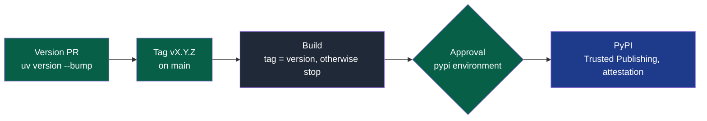

# Contributing to NapkinStack

This repository develops the framework; it is also its first user. Read
[`PRODUCT.md`](PRODUCT.md) first, §5 in particular.

## A workstream's journey

**Legend** — light grey: tracking (`docs/governance/`) · dark grey: work on the branch ·
blue: review · green: merged into `main`.

## The rules of the batch

- **One workstream = one pull request**, never two together. In the issue and pull
  request templates, "the module" reads "the workstream".
- **The test first**: every check has a test that proves it fails (P5), seen red before
  the implementation; every failure names the rule, the place and the action (P6).
- **Review budget**: 400 lines and 15 files; beyond that, the `over-budget` label,
  justified in the pull request (mechanical migration, detailed plan, generation).
- **Pull request summary**: `DONE / VERIFIED / ASSUMED / NOT VERIFIED / RISKS`.
- **Documentation in the same batch**: a change of command, of status or of decision
  updates every page concerned, diagrams and their legends included.
- **Definition of Done**: [`docs/governance/workstreams.md`](docs/governance/workstreams.md).

## Publishing a version

**Legend** — green: a maintainer's action · grey: `.github/workflows/release.yml` ·
blue: PyPI. Decision: [ADR-0002](docs/adr/0002-distribute-napkinstack-on-pypi.md).

1. Bump the version in a pull request: `uv version --bump patch` (or `minor`), then merge
   it.
2. Tag the merged commit: `git tag -a vX.Y.Z -m "NapkinStack vX.Y.Z" <commit>`, then
   `git push origin vX.Y.Z`.
3. Approve the deployment in GitHub Actions ("Review deployments").

No secret is stored: GitHub proves its identity to PyPI at every publication. A published
version is never replaced; a mistake is fixed by the next version, and a faulty version is
yanked on PyPI.

A skeleton file renamed between two versions comes back, under its new name, in every
project that had deleted it: `nstack update` sees a new file. Rename only when the gain is
worth that cost, and say so in the version pull request.

Leak barriers and exceptions (`cross-module`, `over-budget`): the same as in the projects,
described in [`skeleton/CONTRIBUTING.md`](skeleton/CONTRIBUTING.md).
