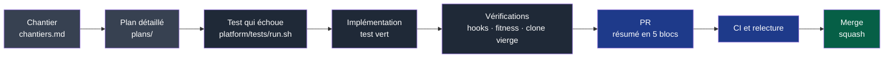

# Contribuer à NapkinStack

Ce dépôt développe le framework ; il en est aussi le premier utilisateur. Lire d'abord
[`PRODUCT.md`](PRODUCT.md), en particulier §5.

## Le parcours d'un chantier

**Légende** — gris clair : suivi (`docs/governance/`) · gris foncé : travail sur la branche ·
bleu : revue · vert : intégré à `main`.

## Les règles du lot

- **Un chantier = une PR**, jamais deux ensemble. Dans les modèles d'issue et de PR, « le
  module » se lit « le chantier ».
- **Le test d'abord** : chaque contrôle a un test qui prouve qu'il échoue (P5), vu rouge
  avant l'implémentation ; chaque échec nomme la règle, l'endroit et l'action (P6).
- **Budget de revue** : 400 lignes et 15 fichiers ; au-delà, label `hors-budget` justifié
  dans la PR (migration mécanique, plan détaillé, génération).
- **Résumé de PR** : `FAIT / VÉRIFIÉ / SUPPOSÉ / NON VÉRIFIÉ / RISQUES`.
- **Documentation dans le même lot** : un changement de commande, de statut ou de décision
  met à jour toutes les pages concernées, schémas légendés compris.
- **Definition of Done** : [`docs/governance/chantiers.md`](docs/governance/chantiers.md).

Barrières contre les fuites et exceptions (`cross-module`, `hors-budget`) : les mêmes que
dans les projets, décrites dans [`skeleton/CONTRIBUTING.md`](skeleton/CONTRIBUTING.md).
