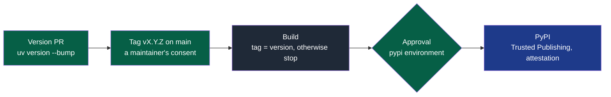

# Contributing to NapkinStack

This repository develops the framework; it is also its first user. Read
[`PRODUCT.md`](PRODUCT.md) first, §5 in particular.

## A workstream's journey


**Legend** — light grey: tracking (`docs/governance/`) · dark grey: work on the branch ·
blue: review · green: merged into `main`.

## Trying a change on a real project (PDR-0005)

A defect of the framework is best fixed where it was found. From a checkout of this
repository, judge the project that exposed it — nothing installed, nothing published:

```bash
uv run --project <checkout> nstack fitness --root <project>
uv run --project <checkout> nstack pr-check --root <project> --base origin/main --body-file <description.md>
uv run --project <checkout> nstack init <new-project> --source <checkout> --ref HEAD
```

`--root` and `--source` are how `platform/tests/run.sh` itself judges and creates its
throwaway projects. Every run that judges says, on its first line, that an unpublished
NapkinStack judged it. Attach that output, against the real project, to the pull request
proposing the fix.

While the fix is reviewed, the project may run on it: `nstack update --ref <commit>`
records the commit, CI installs the framework from this repository at that commit —
never a published version in its place — and every run says so; `nstack doctor` never
calls such a project compliant (L1). Leave the pin with the first release carrying the
fix: `nstack update --ref vX.Y.Z`.

## The rules of the batch

- **One workstream = one pull request**, never two together. In the issue and pull
  request templates, "the module" reads "the workstream".
- **The test first**: every check has a test that proves it fails (P5), seen red before
  the implementation; every failure names the rule, the place and the action (P6).
- **Review budget**: 400 lines and 15 files; beyond that, the `over-budget` label,
  justified in the pull request (mechanical migration, detailed plan, generation).
- **Pull request summary**: `DONE / VERIFIED / ASSUMED / NOT VERIFIED / RISKS`.
- **Merging**: every pull request needs a maintainer's approval (ruleset `main`, ADR-0004).
  Agents work under the `napkinstack-agent` App, never with a maintainer's credentials;
  they merge once the approval and the checks are there.
- **Documentation in the same batch**: a change of command, of status or of decision
  updates every page concerned, diagrams and their legends included.
- **Definition of Done**: [`docs/governance/workstreams.md`](docs/governance/workstreams.md).

## Publishing a version



**Legend** — green: a maintainer's action · grey: `.github/workflows/release.yml` ·
blue: PyPI. Decision: [ADR-0002](docs/adr/0002-distribute-napkinstack-on-pypi.md).

1. Bump the version in a pull request: `uv version --bump patch` (or `minor`); a maintainer
   approves it, then it merges.
2. With a maintainer's explicit consent, the agent tags the merged commit —
   `git tag -a vX.Y.Z -m "NapkinStack vX.Y.Z" <commit>` — and pushes it under its App.
3. Approve the deployment in GitHub Actions ("Review deployments").

No secret is stored: GitHub proves its identity to PyPI at every publication. A published
version is never replaced; a mistake is fixed by the next version, and a faulty version is
yanked on PyPI.

A skeleton file renamed between two versions comes back, under its new name, in every
project that had deleted it: `nstack update` sees a new file. Rename only when the gain is
worth that cost, and say so in the version pull request.

Leak barriers and exceptions (`cross-module`, `over-budget`): the same as in the projects,
described in [`skeleton/CONTRIBUTING.md`](skeleton/CONTRIBUTING.md).
