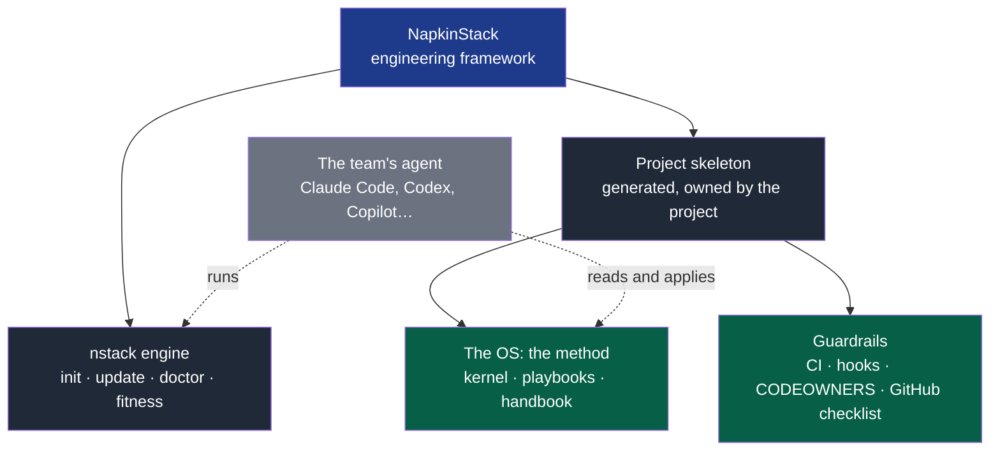

# PRODUCT — NapkinStack

> **This file has no place in a client project.** If it is present in a project created by
> `nstack init`, that is an installation error: delete it. `nstack doctor` reports it.
>
> It describes what the product is and how to work **on** NapkinStack, not **with** it.
> To be read first by any human or agent contributing here.

---

## 1. What NapkinStack is, and this repository's double role

NapkinStack is an **engineering framework**, on the Django or Rails model: one command
creates the project, which then owns its skeleton and receives new versions on demand
(PDR-0001). It is **not** an application framework: no language, no database, no internal
architecture is imposed.

**Legend** — blue: the product · dark grey: what it ships · green: the skeleton's content ·
light grey, dotted: the team's agent, which uses the framework; NapkinStack embeds no AI.

| Term | Meaning, everywhere in this repository |
|---|---|
| **Framework** | NapkinStack: the engine and the skeleton, versioned together |
| **Engine** | The `nstack` command, a dependency the project pins |
| **Skeleton** | What `nstack init` generates (`skeleton/` here); the project owns it |
| **OS** | The method: kernel, playbooks, handbook; generic and unbranded (P2, P7) |
| **Foundation** | A project's shared rules and guardrails, carried by its foundation team |
| **Guardrail** | A check that refuses an invalid state, in CI or in a hook |
| **Workstream** | The unit of batch in this repository; elsewhere, read "module" |
| **Contract** | The only channel between two modules: API, event, schema, versioned |
| **Standard verb** | `bootstrap`, `check`, `test`, `run`: the same names in every module |
| **Fitness function** | An automated test that fails when the architecture drifts |

This repository develops NapkinStack; it is also its **first user**. A foundation that
does not hold its own rules will hold nowhere.

Hence a disambiguation rule to keep in mind at all times:

| When you read… | Understand… |
|---|---|
| `skeleton/AGENTS.md`, `skeleton/playbooks/`, `skeleton/docs/os/`, `skeleton/contracts/`, the skeleton's CI and hooks | The **deliverable**. What every project receives. It is edited the way a product is edited. |
| `src/napkinstack/`, `copier.yml`, `platform/`, `.github/` | The **tooled product**. NapkinStack's code. |
| This file, `docs/governance/` | The **working context**. It never goes to the client. |

An agent working here is therefore **not** in the nominal case the kernel describes ("you
work in a single module"). There are no modules yet. The rules that actually apply to you
are in §5.

---

## 2. What NapkinStack sells

**The client's problem.** Agents make writing code nearly free. Three costs do not come
down: understanding, verifying, coordinating. A team that plugs an agent into a repository
with no boundaries does not produce faster — it produces, faster, something nobody can
review.

**The promise.** Several teams, and their agents, work in parallel on different modules
with no synchronisation meeting, and without quality depending on anyone's vigilance.

**The mechanism.** Three ideas, and only these:

1. The **module** is the unit of parallelism. Two modules know each other only through
   their contract.
2. The **prompt is a transit zone**. Every automatable rule moves down into CI and leaves
   the prompt.
3. The **oracle before the generation**. The success criterion is executable before the
   first line.

**What it does not sell.** No stack, no application framework, no internal architecture,
no list of tools, no embedded AI: the team's agent uses the framework. NapkinStack
provides the layer that lets **the client's stack** hold up across several teams.

---

## 3. The users

| User | What they must be able to do | Success criterion |
|---|---|---|
| **A tech lead** starting a project | Create a compliant repository, frame it and start a first cycle | The repository in under 30 min, the framing in one session of two hours **of effective work** — the wall clock recorded beside it (PDR-0002, clarified 2026-09-19) — without reading the whole handbook |
| **A developer** joining a team | Contribute usefully | With no spoken conversation |
| **An AI agent** on a task | Work bounded, be blocked when it drifts | An unmergeable PR rather than debt in `main` |
| **A second team** arriving | Move forward without blocking the first | Zero synchronisation meetings |

These four criteria are the product's acceptance tests. A change that degrades one of them
is a failure, however elegant.

---

## 4. Product invariants

Non-negotiable. A pull request that violates one is refused, even when everything else is
green.

| # | Invariant | Why |
|---|---|---|
| P1 | **No stack imposed on the modules** — no language, no framework, no database. NapkinStack's own tooling (uv, which provides Python and pre-commit) has its own prerequisites, isolated from the project's code | The platform orchestrates, it knows no stack. Any ecosystem-specific logic in the engine is a bug; a preset delegates to the official generator. |
| P2 | **Portability of the rules** — the skeleton's rules (`skeleton/AGENTS.md`, `skeleton/playbooks/`, `skeleton/docs/os/`) stay in generic markdown | A client must be able to use the OS with an agent other than Claude. A tool is an adapter, never a foundation. |
| P3 | **Enforcement stays in CI** — never in a hook, never in a plugin | A hook is bypassable. Mistaking it for a guarantee postpones the real check. |
| P4 | **Kernel within budget** — 250 lines | Without a ceiling it grows back at every incident and turns into the unreadable document it replaces. |
| P5 | **Every check has a test that proves it fails** | A guardrail that cannot fail guards nothing. |
| P6 | **Explanatory failure message** — rule, file, line, action | A check that says "violation" will be worked around. |
| P7 | **Branding at the periphery** — `platform/`, the CLI and the distribution carry the brand; the rules stay generic | Nobody adopts a way of working that carries a vendor's name in every file. |

---

## 5. How to work on this repository

The kernel `skeleton/AGENTS.md` stays your reference for **method** — oracle first,
minimal change, five-block summary, stop on a high-risk action. Three adaptations, and
what does not judge here:

**"A module" reads "a workstream".** There are no modules here. The unit of batch is the
workstream listed in `docs/governance/workstreams.md`. One workstream, one pull request, one
commit. Never two workstreams together.

**The oracle, here, is `platform/tests/run.sh`** (`uv run bash platform/tests/run.sh`),
which also runs the pytest cases for rules M, B, S, P and H
(`platform/tests/test_guardrails.py`). For every new check, first write the case that
proves it fails when the rule is broken, and watch it fail. The pattern exists in both
files: a fitness function rule gains a parameterised case there, a command behaviour gains
a block of `run.sh`.

**Three of the five required checks run here.** `Fitness functions`, `PR scope and review
budget` and `Hooks and secrets` judge this repository. `Test sheet and cycle` does not: there is
no `docs/project/` here, and `platform/` is of criticality `high`, so T1 would ask for a test
sheet on almost every pull request of a repository whose deliverable is the framework itself.
`Commits on main` does not either: the ruleset refuses a direct push, which is the barrier that
record exists to compensate for. Both are exemptions, not oversights, and PDR-0007 is where the
first of them becomes a state a project can declare.

**The "client" is fictional but demanding.** Before every change, ask which of the four
users of §3 benefits, and how we will know. An improvement that serves none of them is not
an improvement.

## 6. Out of product scope

Do not build, do not propose:

- a reference stack, an example module, an application architecture;
- a stack preset that no real project uses yet;
- a Claude Code plugin or marketplace — enforcement stays in CI (P3);
- fitness functions beyond the current workstream — the next ones are prioritised in
  `skeleton/docs/os/07-governance.md` §3, and their need is not demonstrated;
- abstraction or configuration for a single use;
- a web interface, a dashboard, a service;
- an AI embedded in `nstack` (an API key, a model call): the team's agent uses the
  framework, and its proposals go through the same guardrails as everything else.

## 7. Current state

NapkinStack v0.6.0 is published on PyPI (2026-09-20), with a provenance attestation, and
written in English throughout (ADR-0003): `nstack init`, `update`, `doctor`, `new-module`,
the module verbs and the fitness functions; since v0.3.0, the test sheet (`pr-check`,
PDR-0003) and the framing — discovery, charter, bounded cycles (`discover`, `plan`,
PDR-0002). Every check has a test that proves its failure. `nstack update` has carried
projects from v0.1.0 to v0.2.0, from v0.2.0 to v0.3.1, from v0.3.1 to v0.4.0, from v0.4.0
to v0.5.0 and from v0.5.0 to v0.6.0, all
published, and the update's pull request passes the checks of the version it brings. This
repository's agent works under its own GitHub App, behind the maintainer's approval, and its
session reaches none of the maintainer's credentials (ADR-0004).

**M9 rehearsed a full team cycle on a public subject (2026-09-19)**: one cycle end to end in a
day, zero sync events during the work, a review median of 10 minutes — and two probes accepted
that should have been refused. Its exit decision was **fix first**, and **v0.4.0 is that fix
(M10)**: the boundaries read the contracts a module uses and refuse any reference to another
module's code; a contract version someone relies on changes only with the project's own proof;
the module checks are a required check; a verifier is compared with the change's authors; an
approval is dismissed by a new push; every verdict names the framework that gave it, and a
project may try an unpublished fix without being judged by it in silence (PDR-0005). An
independent review before the tag found three ways around these barriers; the tag waited for
their fix. **M10h then proved the fixes on the project that exposed them** (2026-09-19): the
update paid for real, and eight probes replayed — the six that must be refused were refused,
by the rule that names them, and the two that must pass passed; the forge's own checklist
compliant. Its review found one more way around a barrier — the contract proof runs in the
pull request's tree, so a proof calling a file of its module can be rewritten by the change
it judges — and the maintainer's exit decision is **fix first**: the pilot, private and the
first real use, starts on **v0.5.0, published 2026-09-20**: the contract proof runs in the
base's tree, so a change cannot rewrite what judges it, and says it did not prove compatibility
rather than asserting a break it may not have seen; the diagnosis answers *guarded* or
*unguarded* and stops reporting a project as faulty for what its plan forbids (PDR-0006); every
project receives a record naming a commit that reached its default branch outside a pull
request, which records and never refuses; and the repository is a documented way to install the
tool beside the registry, which alone publishes (ADR-0002, clarified). Updating `tool-library`
from v0.4.0 asked for no adaptation at all. A direction is recorded and
not yet built:
PDR-0004, which routes the interview on the project's stage and the field the questions come
from; its design is M11. The checks the handbook describes without them being automated are
marked as such and listed in the automation backlog.

**An internal audit before the pilot, and v0.6.0 is what it found (2026-09-20)**: the whole
repository was read against its own code, and three barriers the framework announces turned
out not to refuse. A charter, a cycle, a deliverable or a module responsibility still holding
its template's words went green — D28 had fixed that shape for one field only; nothing ever
mentioned the consumers of a deprecated module, which `02-modules.md` promised would turn red;
and a contract change ran the tests of the module holding the document and of nobody else,
where `03-contracts.md` promises both sides. **v0.6.0 closes the three**: a declaration still
carrying a placeholder is refused — for a module from its first file of code, so a generated
module stays green (D33); a deprecated module's consumers are named with the removal date that
will turn them red; and a contract change runs the checks of the producer and of every
declared consumer, read from the manifests the project already writes. Eleven documents were
brought back in line with the published version, a guardrail that could not see a whole decade
of its own subject was widened, and a refusal that dropped the line saying what happened keeps
it. Updating `tool-library` from v0.5.0 cost 9 files and no conflict, and none of the new
refusals fired on it.

**Two channels, one published artefact** (ADR-0002, clarified 2026-09-20): the registry
publishes, with the attestation; this repository distributes the same tag's source, for
trying the tool or installing it without the registry. A run installed from the forge says
so on every line that judges, because a tag can be moved — and a project created through
either channel at the same tag is identical, down to the version it records.

Roadmaps: `docs/governance/plans/2026-09-15-engine-v0.1.0.md`,
`docs/governance/plans/2026-09-16-english-migration.md`,
`docs/governance/plans/2026-09-16-v0.3.0-frame-verify-approve.md`,
`docs/governance/plans/2026-09-17-v0.3.1-what-changes-a-module.md`,
`docs/governance/plans/2026-09-17-team-mode-validation.md`,
`docs/governance/plans/2026-09-19-v0.4.0-every-barrier-refuses.md`,
`docs/governance/plans/2026-09-20-v0.5.0-a-proof-that-cannot-be-rewritten.md`,
`docs/governance/plans/2026-09-20-m12-conformance-suite.md`,
`docs/governance/plans/2026-09-20-v0.6.0-what-is-announced-refuses.md`. Defects and decisions:
`docs/governance/workstreams.md`. Beyond that, let the pilot's usage dictate the next
fitness functions and agent adapters: nothing is built before it has served once.
