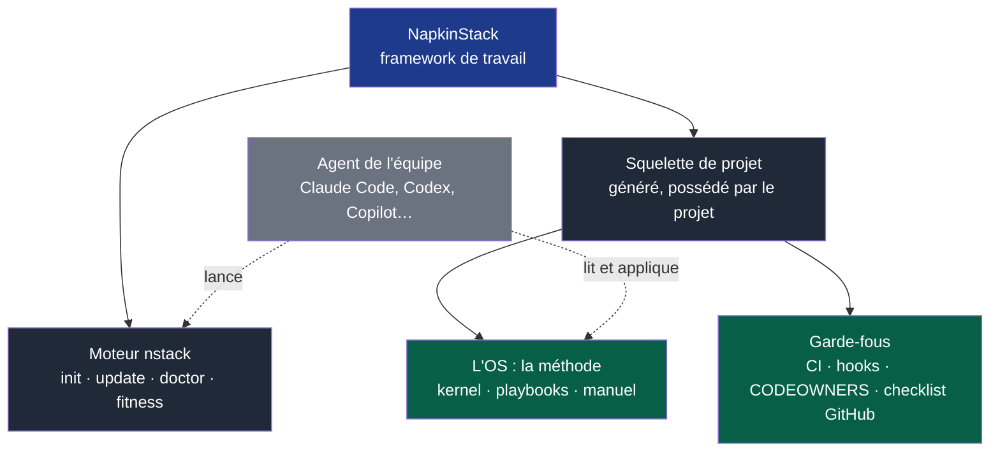

# PRODUCT — NapkinStack

> **Ce fichier n'a pas sa place dans un projet client.** S'il est présent dans un projet
> créé par `nstack init`, c'est une erreur d'installation : supprime-le.
> `nstack doctor` le signale.
>
> Il décrit ce qu'est le produit et comment travailler **sur** NapkinStack, pas **avec** lui.
> À lire en premier par tout humain ou agent qui contribue ici.

---

## 1. Ce qu'est NapkinStack, et le double rôle de ce dépôt

NapkinStack est un **framework de travail**, sur le modèle de Django ou Rails : une
commande crée le projet, qui possède ensuite son squelette et reçoit les nouvelles versions
à sa demande (PDR-0001). Ce n'est **pas** un framework applicatif : aucun langage, aucune
base, aucune architecture interne n'est imposé.

**Légende** — bleu : le produit · gris foncé : ce qu'il livre · vert : le contenu du
squelette · gris clair, pointillés : l'agent de l'équipe, qui utilise le framework ;
NapkinStack n'embarque aucune IA.

| Terme | Sens, partout dans le dépôt |
|---|---|
| **Framework** | NapkinStack : le moteur et le squelette, versionnés ensemble |
| **Moteur** | La commande `nstack`, dépendance épinglée par le projet |
| **Squelette** | Ce que `nstack init` génère (`skeleton/` ici) ; le projet le possède |
| **OS** | La méthode : kernel, playbooks, manuel ; générique et sans marque (P2, P7) |
| **Socle** | Les règles et garde-fous communs d'un projet, portés par son équipe socle |

Ce dépôt développe NapkinStack ; il est aussi son **premier utilisateur**. Un socle qui ne
tient pas ses propres règles ne tiendra chez personne.

D'où une règle de désambiguïsation à garder en tête en permanence :

| Quand tu lis… | Comprends… |
|---|---|
| `skeleton/AGENTS.md`, `skeleton/playbooks/`, `skeleton/docs/os/`, `skeleton/contracts/`, CI et hooks du squelette | Le **livrable**. Ce que reçoit chaque projet. On l'édite comme on édite un produit. |
| `src/napkinstack/`, `copier.yml`, `platform/`, `.github/` | Le **produit outillé**. Le code de NapkinStack. |
| Ce fichier, `docs/governance/` | Le **contexte de travail**. Il ne part pas chez le client. |

Un agent qui travaille ici n'est donc **pas** dans le cas nominal décrit par le kernel
(« tu travailles dans un seul module »). Il n'y a pas encore de modules. Les règles qui
s'appliquent réellement à toi sont en §5.

---

## 2. Ce que NapkinStack vend

**Le problème client.** Les agents rendent l'écriture de code quasi gratuite. Trois
coûts ne baissent pas : comprendre, vérifier, coordonner. Une équipe qui branche un
agent sur un dépôt sans frontières ne produit pas plus vite — elle produit plus vite
quelque chose que personne ne peut relire.

**La promesse.** Plusieurs équipes, et leurs agents, travaillent en parallèle sur des
modules différents sans réunion de synchronisation, et sans que la qualité dépende de
la vigilance de quiconque.

**Le mécanisme.** Trois idées, et elles seules :

1. Le **module** est l'unité de parallélisme. Deux modules ne se connaissent que par
   leur contrat.
2. Le **prompt est une zone de transit**. Toute règle automatisable descend en CI et
   quitte le prompt.
3. L'**oracle avant la génération**. Le critère de réussite est exécutable avant la
   première ligne.

**Ce qu'on ne vend pas.** Ni stack, ni framework applicatif, ni architecture interne,
ni liste d'outils, ni IA intégrée : l'agent de l'équipe utilise le framework.
NapkinStack fournit la couche qui permet à **la stack du client** de tenir à plusieurs
équipes.

---

## 3. Les utilisateurs

| Utilisateur | Ce qu'il doit pouvoir faire | Critère de réussite |
|---|---|---|
| **Tech lead** qui démarre un projet | Créer un dépôt conforme et un premier module | < 30 min, sans lire tout le manuel |
| **Développeur** qui rejoint une équipe | Contribuer utilement | Sans conversation orale |
| **Agent IA** sur une tâche | Travailler borné, être bloqué s'il dérive | PR non mergeable plutôt que dette dans `main` |
| **Deuxième équipe** qui arrive | Avancer sans bloquer la première | Zéro réunion de synchronisation |

Ces quatre critères sont les tests d'acceptation du produit. Une modification qui en
dégrade un est un échec, quelle que soit son élégance.

---

## 4. Invariants produit

Non négociables. Une PR qui en viole un est refusée, même si tout le reste est vert.

| # | Invariant | Pourquoi |
|---|---|---|
| P1 | **Aucune stack imposée aux modules** — ni langage, ni framework, ni base. L'outillage NapkinStack (uv, qui fournit Python et pre-commit) a ses propres prérequis, isolés du code du projet | La plateforme orchestre, elle ne connaît aucune stack. Toute logique spécifique à un écosystème dans le moteur est un bug ; un preset délègue au générateur officiel. |
| P2 | **Portabilité des règles** — les règles du squelette (`skeleton/AGENTS.md`, `skeleton/playbooks/`, `skeleton/docs/os/`) restent en markdown générique | Un client doit pouvoir utiliser l'OS avec un autre agent que Claude. Un outil est un adaptateur, jamais une fondation. |
| P3 | **L'enforcement reste en CI** — jamais dans un hook, jamais dans un plugin | Un hook est contournable. Le confondre avec une garantie fait repousser le vrai check. |
| P4 | **Kernel sous budget** — 250 lignes | Sans plafond, il regrossit à chaque incident et redevient le document illisible qu'il remplace. |
| P5 | **Tout check a un test qui prouve qu'il échoue** | Un garde-fou qui ne sait pas échouer ne garde rien. |
| P6 | **Message d'échec explicatif** — règle, fichier, ligne, action | Un check qui dit « violation » sera contourné. |
| P7 | **Branding en périphérie** — `platform/`, CLI et distribution portent la marque ; les règles restent génériques | Personne n'adopte un cadre de travail qui porte le nom d'un fournisseur dans chaque fichier. |

---

## 5. Comment travailler sur ce dépôt

Le kernel `skeleton/AGENTS.md` reste ta référence de **méthode** — oracle d'abord, changement
minimal, résumé en cinq blocs, arrêt sur action à haut risque. Trois adaptations :

**« Un module » se lit « un chantier ».** Il n'y a pas de modules ici. L'unité de lot
est le chantier listé dans `docs/governance/chantiers.md`. Un chantier, une PR, un
commit. Jamais deux chantiers ensemble.

**L'oracle, ici, c'est `platform/tests/run.sh`** (`uv run bash platform/tests/run.sh`), qui
lance aussi les tests pytest des règles M, B, S et P (`platform/tests/test_controles.py`).
Pour chaque nouveau contrôle, écris d'abord le cas qui prouve qu'il échoue quand la
règle est violée, et vois-le échouer. Le pattern existe dans ces deux fichiers : une
règle de fitness function y gagne un cas paramétré, un comportement de commande un bloc
de `run.sh`.

**Le « client » est fictif mais exigeant.** Avant chaque changement, demande-toi lequel
des quatre utilisateurs du §3 en bénéficie, et comment on le saura. Une amélioration qui
ne sert aucun d'eux n'est pas une amélioration.

## 6. Hors périmètre produit

Ne construis pas, ne propose pas :

- une stack de référence, un module d'exemple, une architecture applicative ;
- un preset de stack qu'aucun vrai projet n'utilise encore ;
- un plugin ou un marketplace Claude Code — l'enforcement reste en CI (P3) ;
- des fitness functions au-delà du chantier en cours — les suivantes sont priorisées
  dans `skeleton/docs/os/07-gouvernance.md` §3, et leur besoin n'est pas démontré ;
- de l'abstraction ou de la configuration pour un usage unique ;
- une interface web, un tableau de bord, un service ;
- une IA intégrée à `nstack` (clé d'API, appel de modèle) : l'agent de l'équipe utilise le
  framework, et ses propositions passent les mêmes garde-fous que le reste.

## 7. État actuel

NapkinStack v0.1.0 est en construction. Le moteur et le squelette fonctionnent depuis ce
dépôt : `nstack init`, `update`, `doctor`, `new-module`, les verbes des modules et les
fitness functions ; chaque contrôle a un test qui prouve son échec. Restent la première
publication et le projet pilote, privé. Les contrôles que le manuel décrit sans qu'ils
soient automatisés sont marqués comme tels et inscrits au backlog d'automatisation.

Feuille de route : `docs/governance/plans/2026-09-15-moteur-v0.1.0.md`. Défauts et
décisions : `docs/governance/chantiers.md`. Au-delà, laisser l'usage du pilote dicter les
fitness functions et les adaptateurs d'agent suivants : rien ne se construit avant d'avoir
servi une fois.
