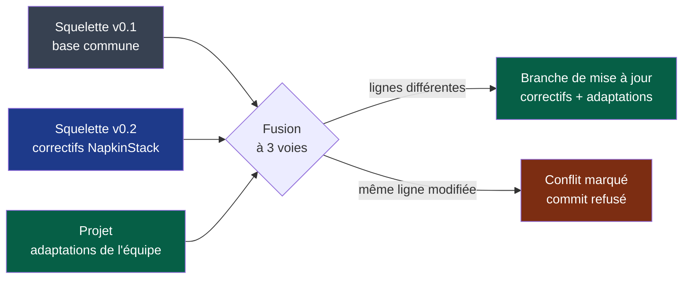
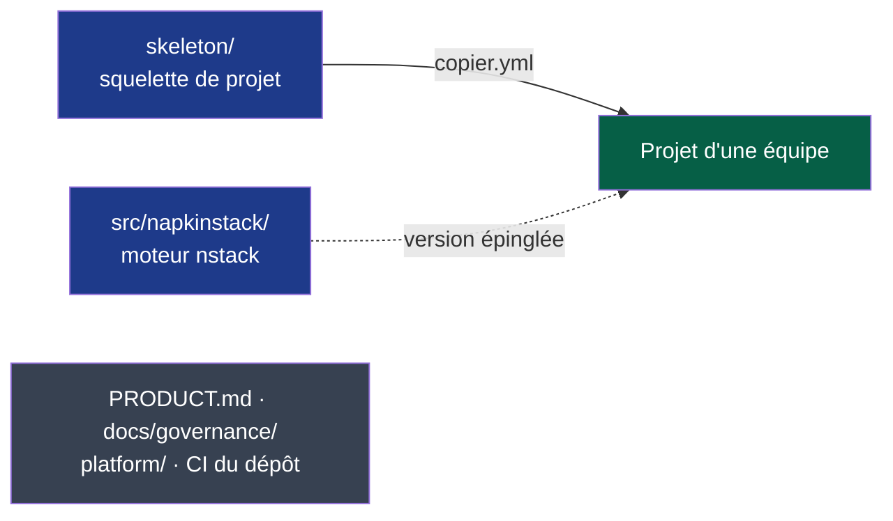

# NapkinStack

Framework de travail pour faire travailler plusieurs équipes et leurs agents sur un même
dépôt : modules, contrats, garde-fous en CI. Sur le modèle de Django ou Rails, une commande
crée le projet, qui reçoit ensuite les nouvelles versions à sa demande ; aucune stack
applicative n'est imposée. Positionnement et vocabulaire : [`PRODUCT.md`](PRODUCT.md) §1.

> **État : v0.1.0, première version publiée** ([PyPI](https://pypi.org/project/napkinstack/)).
> Un premier projet pilote, privé, l'éprouve avant la suite. Suivi :
> [feuille de route](docs/governance/plans/2026-09-15-moteur-v0.1.0.md),
> [`docs/governance/chantiers.md`](docs/governance/chantiers.md).

## Le parcours d'un projet

```mermaid
flowchart LR
    I["Installer<br/>uv tool install"]:::cmd --> N["nstack init"]:::cmd
    N --> G["Publier sur GitHub<br/>appliquer la checklist"]:::humain
    G --> D["nstack doctor<br/>lecture seule"]:::cmd
    D --> M["nstack new-module"]:::cmd
    M --> W["Travail en PR<br/>l'équipe et son agent"]:::humain
    W --> U["nstack update<br/>branche fusionnée"]:::cmd
    U --> P["PR relue<br/>validée par la CI"]:::humain
    P -->|"version suivante"| U

    classDef cmd fill:#1f2937,color:#fff
    classDef humain fill:#065f46,color:#fff
```



**Légende** — gris : commande NapkinStack · vert : action de l'équipe. Décision :
[PDR-0001](docs/pdr/0001-creer-un-projet-et-recevoir-les-evolutions.md).

Le projet possède son squelette et l'adapte librement. Chaque nouvelle version lui arrive
à sa demande, fusionnée avec ses adaptations ; les conflits restent à l'équipe.



**Légende** — gris : version dont le projet est issu · bleu : nouvelle version · vert :
travail de l'équipe et résultat accepté · rouge : conflit laissé à l'équipe.

## Installer

```bash
uv tool install napkinstack --with-executables-from pre-commit   # prérequis : uv et git
nstack init mon-projet
```

Chaque projet épingle ensuite sa version et la change par `nstack update`. Toute version
publiée porte une attestation de provenance, visible sur PyPI, qui la relie au workflow et
au commit de ce dépôt ([ADR-0002](docs/adr/0002-distribuer-napkinstack-sur-pypi.md)).

## Les commandes

| Commande | Rôle |
|---|---|
| `nstack init <dossier>` | Crée le projet : squelette, dépôt git, commit initial, checklist GitHub |
| `nstack doctor` | Vérifie le poste et les réglages GitHub, en lecture seule |
| `nstack new-module <nom> <organisation>/<équipe> <criticité>` | Crée un module, sans stack imposée |
| `nstack check`, `test`, `bootstrap` `[module]` ; `nstack run <module>` | Exécutent les commandes déclarées dans le manifest du module |
| `nstack fitness` | Manifests, frontières entre modules, skills |
| `nstack pr-scope` | Une PR = un module, budget de revue |
| `nstack skills` | Expose les playbooks en skills pour l'agent |
| `nstack update` | Pose la nouvelle version sur une branche à relire |

**Prérequis** : uv et git. Les garde-fous bloquent vraiment sur un dépôt GitHub public, ou
privé sous l'offre Team ou Pro ; sur un dépôt privé de l'offre Free, la CI informe sans
bloquer ([précision de PDR-0001](docs/pdr/0001-creer-un-projet-et-recevoir-les-evolutions.md)).

**IA** : NapkinStack n'en embarque aucune. L'agent de l'équipe (Claude Code, Codex,
Copilot…) lit le kernel et les playbooks, lance les commandes, et la CI accepte ou refuse
ses propositions comme celles de n'importe quel contributeur.

## Ce dépôt



**Légende** — bleu : livré aux projets · vert : projet généré, qui possède son squelette ·
gris : développement de NapkinStack, jamais copié (PDR-0001 R6). Trait plein : génération ;
pointillé : dépendance versionnée.

| Chemin | Rôle |
|---|---|
| `skeleton/` | Ce que reçoit chaque projet : kernel, playbooks, manuel, CI, hooks |
| `copier.yml` | Questions posées à la création (gabarit Copier, ADR-0001) |
| `src/napkinstack/` | Le moteur, commande `nstack` |
| `platform/` | Enveloppe du module moteur : manifest, runbook, tests |
| `PRODUCT.md`, `docs/governance/` | Contexte de travail sur NapkinStack |
| `docs/adr/`, `docs/pdr/` | Décisions de NapkinStack |

## Développer NapkinStack

```bash
uv sync                               # prérequis : uv
uv run pre-commit install
uv run nstack fitness                 # garde-fous du dépôt
uv run bash platform/tests/run.sh     # oracle : chaque garde-fou prouve qu'il sait échouer
uv run nstack init /tmp/essai --source . --ref HEAD   # projet d'essai depuis l'arbre de travail
uv run nstack doctor --root /tmp/essai                # poste et réglages GitHub, en lecture seule
```

Contribuer : [`CONTRIBUTING.md`](CONTRIBUTING.md), après [`PRODUCT.md`](PRODUCT.md).

Licence : [MIT](LICENSE).
