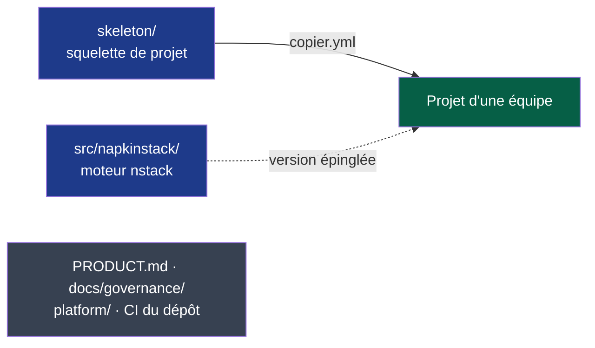

# NapkinStack

Framework de travail pour faire travailler plusieurs équipes et leurs agents sur un même
dépôt : modules, contrats, garde-fous en CI. Sur le modèle de Django ou Rails, une commande
crée le projet, qui reçoit ensuite les nouvelles versions à sa demande ; aucune stack
applicative n'est imposée. Positionnement et vocabulaire : [`PRODUCT.md`](PRODUCT.md) §1.

> **État : en construction (v0.1.0).** `nstack init`, `nstack update` et `nstack doctor`
> fonctionnent depuis ce dépôt ; la première version publiée arrive au chantier M5, le mode
> d'emploi complet au chantier M6.
> Suivi : [feuille de route](docs/governance/plans/2026-09-15-moteur-v0.1.0.md),
> [`docs/governance/chantiers.md`](docs/governance/chantiers.md).



**Légende** — bleu : livré aux projets · vert : projet généré, qui possède son squelette ·
gris : développement de NapkinStack, jamais copié (PDR-0001 R6). Trait plein : génération ;
pointillé : dépendance versionnée.

| Chemin | Rôle |
|---|---|
| `skeleton/` | Ce que reçoit chaque projet : kernel, playbooks, manuel, CI, hooks |
| `copier.yml` | Questions posées à la création (gabarit Copier, ADR-0001) |
| `src/napkinstack/` | Le moteur, commande `nstack` |
| `platform/` | Enveloppe du module moteur : manifest, runbook, tests |
| `PRODUCT.md`, `docs/governance/` | Contexte de travail sur NapkinStack |
| `docs/adr/`, `docs/pdr/` | Décisions de NapkinStack |

## Développer NapkinStack

```bash
uv sync                               # prérequis : uv
uv run pre-commit install
uv run nstack fitness                 # garde-fous du dépôt
uv run bash platform/tests/run.sh     # oracle : chaque garde-fou prouve qu'il sait échouer
uv run nstack init /tmp/essai --source . --ref HEAD   # projet d'essai depuis l'arbre de travail
uv run nstack doctor --root /tmp/essai                # poste et réglages GitHub, en lecture seule
```

Avant toute contribution : [`PRODUCT.md`](PRODUCT.md).
