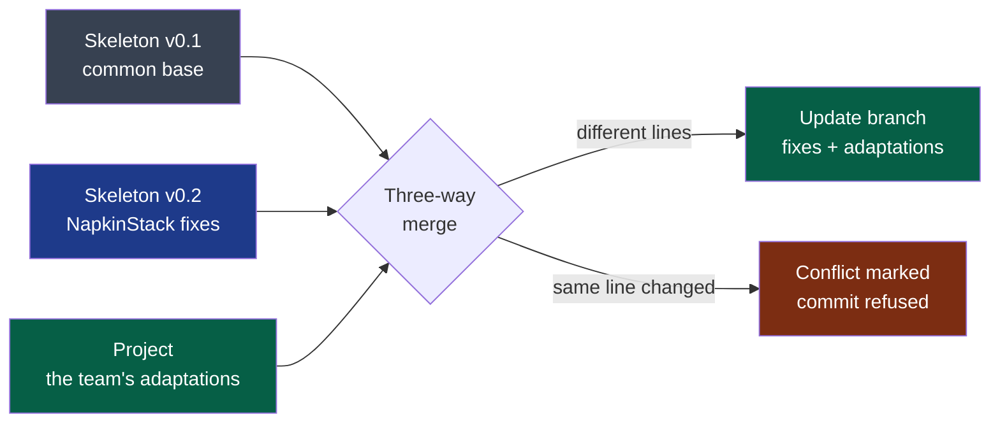
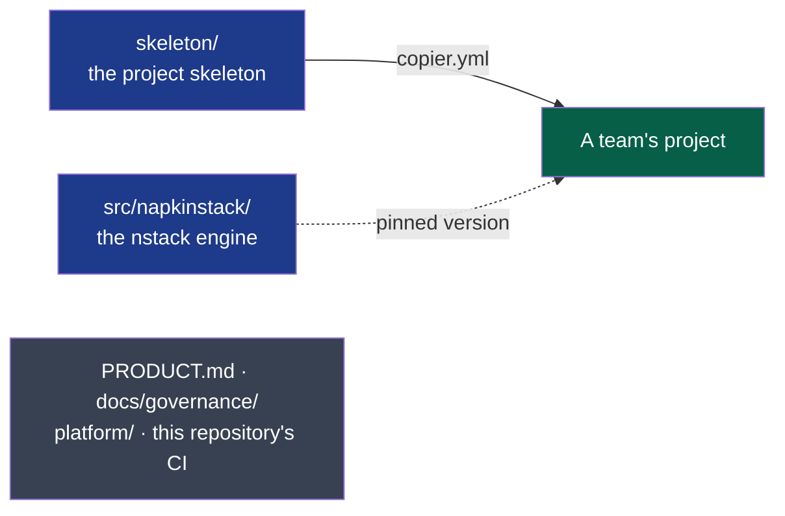

# NapkinStack

An engineering framework for several teams and their agents working in one repository:
modules, contracts, guardrails in CI. On the Django or Rails model, one command creates
the project, which then receives new versions on demand; no application stack is imposed.
Positioning and vocabulary: [`PRODUCT.md`](PRODUCT.md) §1.

> **Status: v0.2.0, published** ([PyPI](https://pypi.org/project/napkinstack/)), English
> throughout. A first pilot project, private, starts from it and puts it to the test before
> the rest. Tracking: [engine roadmap](docs/governance/plans/2026-09-15-engine-v0.1.0.md),
> [move to English](docs/governance/plans/2026-09-16-english-migration.md),
> [`docs/governance/workstreams.md`](docs/governance/workstreams.md).

## A project's journey

```mermaid
flowchart LR
    I["Install<br/>uv tool install"]:::cmd --> N["nstack init"]:::cmd
    N --> G["Publish on GitHub<br/>apply the checklist"]:::human
    G --> D["nstack doctor<br/>read-only"]:::cmd
    D --> M["nstack new-module"]:::cmd
    M --> W["Work in pull requests<br/>the team and its agent"]:::human
    W --> U["nstack update<br/>merged branch"]:::cmd
    U --> P["PR reviewed<br/>validated by CI"]:::human
    P -->|"next version"| U

    classDef cmd fill:#1f2937,color:#fff
    classDef human fill:#065f46,color:#fff
```



**Legend** — grey: a NapkinStack command · green: the team's action. Decision:
[PDR-0001](docs/pdr/0001-create-a-project-and-receive-updates.md).

The project owns its skeleton and adapts it freely. Every new version reaches it on
demand, merged with its adaptations; the conflicts are left to the team.



**Legend** — grey: the version the project came from · blue: the new version · green: the
team's work and the accepted result · red: a conflict left to the team.

## Install

```bash
uv tool install napkinstack --with-executables-from pre-commit   # prerequisites: uv and git
nstack init my-project
```

Each project then pins its version and changes it through `nstack update`. Every published
version carries a provenance attestation, visible on PyPI, tying it to the workflow and
the commit of this repository
([ADR-0002](docs/adr/0002-distribute-napkinstack-on-pypi.md)).

## The commands

| Command | Role |
|---|---|
| `nstack init <folder>` | Creates the project: skeleton, git repository, initial commit, GitHub checklist |
| `nstack doctor` | Checks the workstation and the GitHub settings, read-only |
| `nstack new-module <name> <organisation>/<team> <criticality>` | Creates a module, with no imposed stack |
| `nstack check`, `test`, `bootstrap` `[module]`; `nstack run <module>` | Run the commands declared in the module's manifest |
| `nstack fitness` | Manifests, boundaries between modules, skills |
| `nstack pr-scope` | One PR = one module, review budget |
| `nstack skills` | Exposes the playbooks as skills for the agent |
| `nstack update` | Lays the new version on a branch to review |

**Prerequisites**: uv and git. The guardrails really block on a public GitHub repository,
or on a private one under the Team or Pro plan; on a private repository on the Free plan
CI informs without blocking
([a clarification of PDR-0001](docs/pdr/0001-create-a-project-and-receive-updates.md)).

**AI**: NapkinStack embeds none. The team's agent (Claude Code, Codex, Copilot…) reads the
kernel and the playbooks, runs the commands, and CI accepts or refuses its proposals
exactly as it would any other contributor's.

## This repository



**Legend** — blue: shipped to projects · green: a generated project, which owns its
skeleton · grey: developing NapkinStack itself, never copied (PDR-0001 R6). Solid line:
generation; dotted: a versioned dependency.

| Path | Role |
|---|---|
| `skeleton/` | What every project receives: kernel, playbooks, handbook, CI, hooks |
| `copier.yml` | The questions asked at creation (a Copier template, ADR-0001) |
| `src/napkinstack/` | The engine, the `nstack` command |
| `platform/` | The engine module's envelope: manifest, runbook, tests |
| `PRODUCT.md`, `docs/governance/` | The working context for NapkinStack itself |
| `docs/adr/`, `docs/pdr/` | NapkinStack's decisions |

## Developing NapkinStack

```bash
uv sync                               # prerequisite: uv
uv run pre-commit install
uv run nstack fitness                 # this repository's guardrails
uv run bash platform/tests/run.sh     # the oracle: every guardrail proves it can fail
uv run nstack init /tmp/trial --source . --ref HEAD   # a trial project from the working tree
uv run nstack doctor --root /tmp/trial                # workstation and GitHub settings, read-only
```

Contributing: [`CONTRIBUTING.md`](CONTRIBUTING.md), after [`PRODUCT.md`](PRODUCT.md).

Licence: [MIT](LICENSE).
