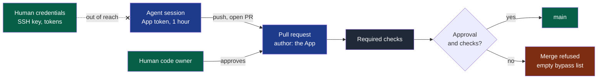

# ADR-0004 — Give agents their own GitHub identity, behind a human approval

- **Status**: Accepted (2026-09-16, by the maintainer; the success criterion is observed in
  the pilot project); clarified on 2026-09-19 (who verified, D32; an approval covers what it
  read, D31) and on 2026-09-20 (two powers, never in the same hand, PDR-0008)
- **Date**: 2026-09-16
- **Decision makers**: NapkinStack maintainers (`@NapkinStack/maintainers`)
- **Scope**: project (the skeleton, `nstack doctor`, and this repository)
- **Reversibility**: easy — an App to uninstall and a ruleset to lower; the skeleton's text
  follows through `nstack update`

---

## Context

The GitHub checklist every project receives (printed by `nstack init`, checked by
`nstack doctor`, repeated in the skeleton README) requires at least one approving review
(G2) and a code owner review (G3). GitHub refuses the author of a pull request the right
to approve it.

Today, a team's agent works under a human's identity. In this repository, the agent
commits and pushes with the maintainer's SSH key and opens pull requests with a token
belonging to the maintainer's account. Two consequences:

- **A single maintainer cannot satisfy G2 and G3**: every pull request is theirs. This
  repository therefore requires no approval and no code owner review — two of the three
  gaps `doctor` found on it (engine plan, M3) — and the agent merges its own pull requests
  once CI is green.
- **In a team, the approval is no barrier against the agent**: holding a human's
  credentials, it can approve a colleague's pull request under that human's name, then
  merge. The handbook's test fails: "if asking an agent nicely is enough to get around it,
  the rule does not exist" (`skeleton/docs/os/07-governance.md` §7).

The pilot project is about to start: private, in the `NapkinStack` organisation, with one
human maintainer. The question has to be settled before its `nstack init`.

## Problem

Under which GitHub identity does a team's agent work, so that a human approval is a
barrier the agent cannot cross, including when the team is one person?

## Constraints

- A critical rule is not bypassable by an instruction given to the agent
  (`07-governance.md` §7; for an agent, "an unmergeable PR rather than debt in `main`",
  `PRODUCT.md` §3).
- Agent-agnostic: Claude Code, Codex, Copilot, in a terminal or hosted; no AI in `nstack`
  (`PRODUCT.md` §2).
- No secret in a repository (kernel §5); `doctor` stays read-only (PDR-0001).
- Works for a single maintainer and for several teams; GitHub only (PDR-0001).
- A private repository needs GitHub Team or Pro for rulesets to block (PDR-0001,
  clarification of 2026-09-15); this decision does not change that.
- No bespoke service: established tools only (kernel §6).

---

## Prior art

**Dominant convention of the field:** it depends on where the agent runs. An agent hosted
by GitHub or a vendor works under a **bot identity provided by a GitHub App**, and its
pull requests are merged after a human approval: Copilot's cloud agent, the Claude GitHub
App, Dependabot, Renovate. An agent run in a developer's terminal uses **the developer's
own credentials** and marks its share with a `Co-Authored-By` trailer. For a long-lived
automation in an organisation, GitHub recommends an App.

**References examined** (2026-09-16):

| Reference | What it does | Applicable here? |
|---|---|---|
| GitHub, "Deciding when to build a GitHub App" | An App does "not consume a seat", uses short-lived tokens and fine-grained permissions, acts independently of a user; recommended for "a long-lived integration" | Yes: the kind of identity |
| GitHub, installation access tokens | Expire after 1 hour; narrowable to some repositories and permissions | Yes: the agent's credentials |
| GitHub, rulesets and code owners | Only the actors on the bypass list bypass a ruleset, administrators included; code owners are users or teams with write access; the last matching `CODEOWNERS` pattern wins | Yes: the barrier |
| Copilot cloud agent | Works under its own identity. The approval of the person who asked for the pull request does not count toward the required approvals; rulesets add one approval, by default, to a Copilot pull request not attributed to a person | Partly: the human approval, yes. Not counting the requester, no: GitHub can enforce it only for its own agent, and it leaves a single maintainer with no possible approval |
| Claude Code GitHub Actions | Works as the Claude GitHub App; a custom App when the organisation wants only Contents, Issues and Pull requests; commits made with `GITHUB_TOKEN` trigger no workflow, an App's do | Yes: permissions, CI triggered |
| Renovate, self-hosted | "Consider creating a GitHub App to use instead of using your own GitHub user account" | Yes: a dedicated identity |
| Claude Code, Codex CLI, in a terminal | The developer's git and GitHub credentials, a `Co-Authored-By` trailer | No: the agent holds the right to approve and merge of the human it runs for |
| GitHub Terms of Service, machine account | Allowed: set up by a human who stays responsible, "no more than one free machine account" per person | Studied as option 2 |

**Why the convention is not enough:** for a local agent, the applicable convention is the
terminal's, and it is exactly what makes the barrier depend on the agent's goodwill. The
hosted agents' convention covers the need: it is extended to local agents.

---

## Options considered

### Option 1 — A GitHub App for the agents, no human credential in their session
- Description: one App per organisation, installed on the repositories where agents work;
  the agent's session obtains 1-hour tokens from it and holds no human credential; a merge
  requires a human code owner's approval, with nobody on the bypass list.
- Advantages: GitHub's recommendation; no seat; short-lived tokens, least permissions,
  never Administration; a bot author on every commit and pull request; CI triggered; one
  model for local and hosted agents.
- Drawbacks: the App's private key is a long-lived secret, kept outside any repository;
  locally, a tool must mint the tokens and hand them to git.
- Cost: to set up, an organisation owner creates and installs the App, once; to maintain,
  rotating the key; **to get out**, uninstalling the App and lowering the ruleset.

### Option 2 — A machine account
- Description: a GitHub account dedicated to the agents, a member of the organisation.
- Advantages: git, SSH and the GitHub CLI work unchanged.
- Drawbacks: a paid seat on GitHub Team; an email address and 2FA to manage (the
  organisation requires 2FA); a long-lived token and SSH key; one free machine account per
  person; GitHub recommends an App.
- Cost: to get out, removing the member.

### Option 3 — The developer's identity, a second human approves
- Description: the terminal convention, kept.
- Advantages: nothing to set up.
- Drawbacks: impossible for a single maintainer, G2 and G3 stay gaps for good; in a team,
  the agent holds its human's right to approve and merge.

### Option 4 — Do nothing
- G2 and G3 stay in the checklist and a project with one human disables them, like this
  repository: the checklist contradicts the projects it serves, and the agent merges its
  own work.

---

## Decision

**Option 1.** It is the only option where the barrier does not rest on the agent — the
author of a pull request cannot approve it, and an App cannot be a code owner — while it
works for one person, takes no seat, and bounds the agent by the App's permissions and by
tokens that expire within the hour.

**Legend** — blue: the agent and what it produces · grey: CI · green: the human and the
accepted result · red: the refusal · dotted cross: what the agent's session never reaches.

| Element | Choice | Verified fact |
|---|---|---|
| Identity | One GitHub App per organisation, installed only on the repositories where agents work | An App consumes no seat |
| Permissions | Contents, Pull requests, Issues: read and write; Actions, Checks: read. Workflows: write only where agents maintain CI, as in this repository. Never Administration | The App's permissions bound every token |
| Credentials | The private key in the workstation's secret store or the CI's secrets, never in a repository; tokens limited to the repository | Tokens expire after 1 hour and can be narrowed |
| The agent's session | Reaches no human credential: no SSH key, token or GitHub CLI login of a human (a sandbox, a container or a dedicated system user) | Otherwise the agent approves under a human's name |
| Merge | Ruleset on the main branch: pull request, at least 1 approval, code owner review, required checks, **empty bypass list** | Administrators bypass only when listed: with an empty list, this repository's ruleset answers `current_user_can_bypass: never` to the organisation owner |
| Code owners | A default owner — `*` followed by the foundation team, first line of `CODEOWNERS` — so the code owner review covers every path | A dedicated App's approval can count toward the approval count — the `renovate-approve` App exists for that — but an App is never a code owner |
| Who approves | A human code owner — during the pilot, see "Deferred, decided on evidence". In a team, preferably not the one who drove the agent; for a `critical` module, its owner (`05-workflow.md` §7) | GitHub cannot tie a local agent's pull request to the person who drove it |
| Who merges | Anyone with write access, the agent included, once the approval and the checks are there | The barrier is the approval, not the click |
| Traceability | The agent assigns the pull request to the human who drove it | — |
| Local tooling | An established tool mints the tokens and serves git's credentials; chosen, pinned and verified when the pilot starts, never built | Candidates: `gh-token`, `gh-app-auth`, `git-credential-github-app`, each to pass the niche filter (`06-decisions.md` §3) |

This repository adopts the decision with the pilot project: the agent loses the
maintainer's SSH key and token, `CODEOWNERS` gains its default owner, and ruleset `main`
requires one approval and the code owner review.

### Deviation from the convention

Two, each paid for by a named value.

**A local agent gets a bot identity**, where its convention uses the developer's.

- **Expected user value**: the human approval is a barrier the agent cannot cross, in a
  team as alone.
- **How we will observe it**: in the pilot, the agent's attempt to merge before approval
  is refused by GitHub.

**The human who drove the agent may approve**, where Copilot's agent does not count that
approval.

- **Expected user value**: a tech lead working alone keeps an enforced human gate instead
  of none.
- **How we will observe it**: in the pilot, with one human, no agent pull request reaches
  `main` without that human's approval.

---

## Success criterion

> We will consider this was the right call if, **in the pilot project, every agent pull
> request is authored by the App, none reaches `main` without a human approval, and the
> agent's attempt to merge before approval is refused by GitHub**, observed before
> **2026-12-31**.

What we do if it is not: correct when the friction comes from the local tooling; supersede
with option 2 if no established tool reliably serves App tokens to a local agent.

---

## Consequences

**Positive:**

- G2 and G3 become attainable for a single maintainer, and real for a team.
- Every change made by an agent is visible as such, in the history and on the pull request.
- No seat, no human credential in the agent's hands, tokens that expire within the hour;
  one rule for local and hosted agents.

**Negative and accepted debt:**

- Every pull request waits for a human: throughput is bounded by review, which is the
  stated principle (`05-workflow.md` §4). In this repository, the maintainer approves each
  pull request.
- Creating the App and rotating its key are human actions, once per organisation.
- Keeping human credentials out of the agent's session is a workstation setup that
  `doctor` cannot see.
- The approval of the human who drove the agent is not an independent review; a team that
  wants four eyes adds "require approval of the most recent reviewable push" or a second
  reviewer.
- A private repository under GitHub Free still blocks nothing (PDR-0001); the identity
  brings traceability only.

**Impacts on other modules or contracts:**

- Skeleton: the README checklist gains the App and the default code owner;
  `CODEOWNERS.jinja` gains its `*` line; the kernel `AGENTS.md` states that the agent works
  under its own identity, never with a human's credentials, and never approves.
- `nstack doctor` gains the checks below, and `init` prints them.
- This repository: `CODEOWNERS`, ruleset `main`, the agent's credentials.

**Rule to automate:** `doctor` checks that the main branch's ruleset has an empty bypass
list and that `CODEOWNERS` starts with a default owner — readable with the token it
already asks for (Administration: read). That an agent's session reaches no human
credential cannot be read from GitHub: a kernel rule and a workstation setup, recorded in
the automation backlog (`07-governance.md` §9).

---

## Deferred, decided on evidence

**Letting an agent's approval count toward merging.** Not during the pilot — and not
rejected either. Agents already run end-to-end scenarios in a browser or on a mobile
emulator and bring back evidence, and GitHub lets an AI approval count toward the
required approvals since 2026-09-01. What nobody knows yet is whether an independent
verifying agent is reliable on a real project.

PDR-0003 measures it: on every pull request carrying a test sheet, what the human found
that the verifier had missed. If, over the pilot's last 20 such pull requests, the human
found nothing the verifier missed, a new ADR may let a verifier agent's approval count for
modules of criticality `prototype` and `standard` — never `high` or `critical`. That
agent will need an App of its own: the author of a pull request cannot approve it.

---

## Clarification of 2026-09-19 — who verified (D32)

Added when fixing D32, without changing the decision. Under one App, the forge cannot
tell an author session from a verifier session. `pr-check` T2 therefore compares the
verifier's declared name — `@handle` or `session <id>` — with the change's authors,
read from the history: its commits' GitHub accounts — through GitHub's noreply addresses,
the only ones that name an account — and the sessions their `Agent-Session:` trailers name. It refuses a session verifying its own work; it cannot
refuse one that lies about its name, and it does not need to while a human approves every
pull request. The ADR this decision defers — a verifier agent's approval counting —
comes with the verifier's own App, whose status check the ruleset requires from that
App: from then, the verdict carries an identity the author cannot hold.

## Clarification of 2026-09-19 — an approval covers what it read (D31)

Observed in M9: an approval survived a force-push, and only the agent's own
`--match-head-commit` stood between it and content its approver had never read. The
ruleset of `main` dismisses stale approvals when new commits are pushed: checklist
rule G13, checked by `nstack doctor`. The last pusher's own approval needs no rule of
its own — the agent never approves, and a human's approval is dismissed by the next push.

## Clarification of 2026-09-20 — two powers, never in the same hand (PDR-0008)

Added when deciding how a repository's settings get applied, without changing the decision.
The agent's App holds `Contents: write` — it pushes branches and, once a human has approved,
merges. It holds **no** `Administration`, which is what creates a ruleset or a required check.
That separation is what makes the barrier a barrier: an identity that can remove the rule and
then merge under it is not constrained by the rule.

PDR-0008 lets a person hand a **credential of the other kind** to their agent for one setup
run. It stays inside this decision because of one rule, checked before anything is applied:

> **The identity that configures the repository may never commit to it.**

The forge answers the question directly — the calling identity's own permissions on the
repository say whether it may push — so the command reads them first and refuses to act when
the credential carries both powers. The framework's own agent never holds administration, in
any mode; what PDR-0008 adds is a second, temporary identity whose only power is to raise the
barrier, and which cannot work behind it.

---

## Rejected alternatives

- **A machine account**: a seat, long-lived credentials and 2FA to manage, for what an App
  does without them.
- **The developer's identity with a second human**: impossible alone; in a team, the agent
  holds its human's right to approve.
- **Not counting the approval of the human who drove the agent**, as Copilot does:
  unenforceable for a local agent, and a single maintainer could never merge.
- **The vendor's App** (Claude, Copilot): ties the identity to one agent product, with a
  permission set broader than the need — Claude's own documentation points to a custom App
  for minimal permissions.
- **One App per developer**: more keys to rotate for no gain; assigning the pull request
  already names the human.
