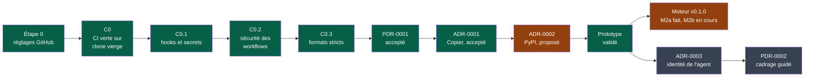
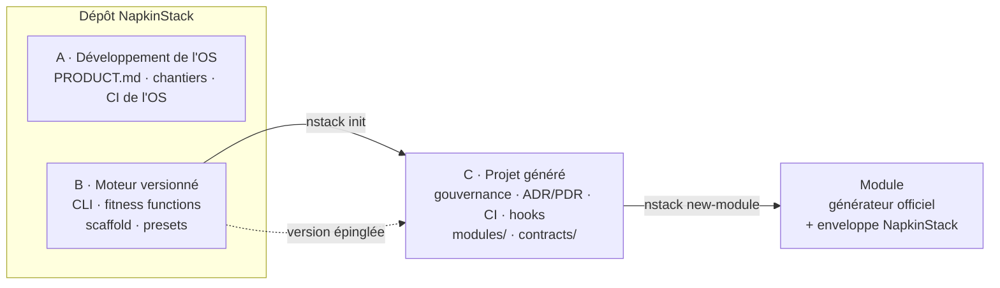

# Chantiers

> Les défauts identifiés du socle, dans l'ordre de traitement.
> **Un chantier = une PR.** Ne jamais les fusionner.
>
> Contexte produit : [`PRODUCT.md`](../../PRODUCT.md). Invariants : `PRODUCT.md` §4.

## Séquence



**Légende** — vert : fait · orange : partiel · gris : à faire · rouge : attend une décision.

| # | Chantier | Statut |
|---|---|---|
| 0 | Réglages GitHub (hors dépôt) | Fait |
| C0 | CI verte sur clone vierge | Fait |
| C0.1 | Hooks et secrets | Fait |
| C0.2 | Sécurité des workflows | Fait |
| C0.3 | Formats stricts | Fait |
| PDR-0001 | [Créer un projet et recevoir les évolutions](../pdr/0001-creer-un-projet-et-recevoir-les-evolutions.md) | Accepté (2026-09-15) |
| ADR-0001 | [Adopter Copier pour générer et mettre à jour les projets](../adr/0001-adopter-copier-pour-generer-et-mettre-a-jour-les-projets.md) | Accepté (2026-09-15) |
| ADR-0002 | [Distribuer NapkinStack sur PyPI](../adr/0002-distribuer-napkinstack-sur-pypi.md) | Proposé ; vérifié à la première publication |
| Prototype | Jetable, valide les critères d'acceptation de PDR-0001 | Fait (2026-09-15), non mergé |
| ADR-0003 | Identité de l'agent et approbation obligatoire | À faire |
| PDR-0002 | Cadrage et découpage guidés | À faire |
| C1 | Point d'entrée unique `nstack` | Partiel (M1) : commande `nstack`, Makefile racine supprimé ; verbes de module à M4 |
| C2 | Check anti-placeholder | À replanifier au plan d'implémentation |
| C3 | Hook git versionné | Absorbé par C0.1 |
| C4 | Proxy d'oracle | À replanifier au plan d'implémentation |
| C5 | Amorçage, `doctor` et marque | À replanifier au plan d'implémentation |

---

## Étape 0 — Réglages GitHub

Ils ne se versionnent pas : chaque dépôt doit les refaire. Depuis le passage en
organisation, les politiques Actions, la 2FA et les droits de base se règlent une fois
pour toute l'organisation `NapkinStack`.

| Réglage | État |
|---|---|
| Secret Protection et protection au push | Vérifié par l'API (désactivées par le transfert, réactivées) |
| Graphe de dépendances et alertes Dependabot | Vérifié par l'API |
| Discussions activées (canal des questions du formulaire d'issues) | Vérifié par l'API |
| Organisation : Actions de GitHub seules, SHA obligatoire, jeton en lecture seule, approbation des contributeurs externes | Vérifié par l'API sur le dépôt |
| Organisation : 2FA obligatoire, aucun droit de base, équipe `maintainers` en écriture | Confirmé ; équipe vérifiée par l'API |
| Signalement privé de vulnérabilités | Vérifié par l'API |
| Approbation des workflows pour tout contributeur externe | Confirmé |
| Token Actions en lecture seule ; Actions ne crée ni n'approuve de PR | Confirmé |
| Actions autorisées : celles de GitHub uniquement | Confirmé |
| Wiki désactivé | Vérifié par l'API |
| Ruleset `main` : PR obligatoire, force-push et suppression interdits, squash seul | Vérifié par l'API |
| Required checks `Fitness functions` et `Périmètre et budget de revue` | Vérifié par l'API |
| Required check `Hooks et secrets` | Vérifié par l'API |
| Actions épinglées par SHA obligatoires | Vérifié par l'API |

## C0 — CI verte sur clone vierge

**Défaut.** `main` rouge dès le premier push : S3 exige des skills gitignorées, donc
absentes de la CI. `pr_scope.sh` commité sans bit exécutable (exit 126). Les tests des
garde-fous ne tournent pas en CI.

**Cible.** S3 non applicable sans `.claude/skills/`, et toujours bloquant dès qu'une skill
est générée. Scripts à shebang en `100755`. `platform/tests/run.sh` dans le job
`Fitness functions`.

## C0.1 — Hooks et secrets

**Défaut.** Aucune barrière locale avant publication ; le job `secrets` est factice.

**Cible.** Framework [pre-commit](https://pre-commit.com) : gitleaks, `detect-private-key`,
`check-added-large-files`, `check-merge-conflict`, contrôles de shebang. La même
configuration tourne en CI (P3), plus gitleaks sur les commits poussés.

Le test d'échec génère le faux secret à l'exécution : écrit en dur, il déclencherait la
protection au push. Remplace C3, car pre-commit refuse de s'installer si
`core.hooksPath` est défini.

**Pièges traités.** Le hook gitleaks officiel ne scanne que les changements indexés,
vides en CI : la CI l'ignore et lance un hook local qui scanne tout l'historique. Sortie
masquée (`--redact`), car les logs de CI sont publics. Dependabot met à jour le
hook gitleaks mais pas le scan d'historique : un test bloque la PR tant que les deux
versions divergent (éprouvé sur la PR #5, v8.30.0 → v8.30.1).

## C0.2 — Sécurité des workflows

**Défaut.** Injection possible : `${{ matrix.module }}`, issu des chemins de la PR, est
inséré dans `run:`. Pas de `permissions:`. Actions référencées par tag modifiable. Token
laissé dans `.git/config`. `SECURITY.md` sans canal de signalement. Fichiers locaux
d'agent non ignorés.

**Cible.** zizmor et actionlint ; `permissions: contents: read` ; actions épinglées par SHA
et tenues à jour par Dependabot ; `persist-credentials: false` ; expressions passées par
`env:` ; `SECURITY.md` renvoyant au signalement privé ; `.gitignore` complété.

**Mesuré.** zizmor : 32 constats avant, 0 après. Points retenus : le `git fetch` du job de
périmètre est retiré (redondant avec `fetch-depth: 0`, et il échouerait sur un dépôt
privé sans jeton) ; zizmor tourne hors ligne et actionlint sans shellcheck, pour des
résultats identiques en local et en CI ; Dependabot contourne la politique Actions, donc
l'épinglage SHA obligatoire ne le bloque pas.

## C0.3 — Formats stricts

**Défaut.** Frontmatter YAML des 5 skills générées invalide (` : ` à la française).
Gabarit `MANIFEST.yaml` invalide (`{{MODULE_NAME}}` est lu comme un mapping). PyYAML
accepte les clés dupliquées sans rien dire.

**Cible.** `check-yaml`, yamllint, check-jsonschema (schémas GitHub). Frontmatter sérialisé
par `yaml.safe_dump`, conforme à la spécification Agent Skills.

**Pièges traités.** yamllint ne fait qu'analyser la syntaxe : il laisse passer
`{{MODULE_NAME}}`, que seul le chargement réel de `check-yaml` refuse. Par défaut, la
règle `truthy` n'est qu'un avertissement : `--strict` la rend bloquante. La clé `on:` des
workflows reste permise, les valeurs `yes`/`on` non. Les workflows ne passent pas par
check-jsonschema, actionlint les couvre déjà. Aucun outil maintenu ne valide les skills
(`skills-ref` n'est qu'une démonstration) : d'où le contrôle S4 dans `sync_skills.py`.

**Mesuré.** `check-yaml` : un seul fichier en échec, le gabarit. yamllint : 127 constats de
style avec la configuration par défaut, 0 avec 5 assouplissements (`.yamllint.yaml`), aucun
sur le fond. Les 3 schémas GitHub passaient déjà. Mutations : 12 défauts réintroduits, 12
détectés par `platform/tests/run.sh`.

## PDR-0001 — Créer un projet et recevoir les évolutions



**Légende** — trait plein : génération, une seule fois · pointillé : dépendance
versionnée, le projet choisit quand monter de version.

**Accepté (2026-09-15, après prototype)** : [`docs/pdr/0001-creer-un-projet-et-recevoir-les-evolutions.md`](../pdr/0001-creer-un-projet-et-recevoir-les-evolutions.md).
Le projet possède son squelette et l'adapte ; chaque version lui arrive à sa demande, en
PR fusionnée avec ses adaptations (fusion à 3 voies) ; réglages GitHub en checklist
vérifiée en lecture seule ; uv seul prérequis. Il remplace les points « copiés ou
générés », « réglages GitHub » et la révision de P1 et du §6, appliquée le 2026-09-15.

**Décidé avant le PDR.**

- 2026-09-13 : modèle Django, projet indépendant sans CI partagée ; stack choisie par
  module ; preset = donnée déléguant au générateur officiel, créé pour un vrai projet ;
  GitHub seul au départ.
- 2026-09-14 : organisation GitHub `NapkinStack`, par renommage du compte, création de
  l'organisation et transfert du dépôt ; l'équipe `maintainers` possède le socle.

**À trancher, dans l'ordre.**

- ~~ADR-0001 — outil de gabarit~~ : Copier, proposé (2026-09-15). Un seul gabarit dans
  ce dépôt, le squelette ; versions = tags ; aucune fonction « unsafe ».
- ~~ADR-0002 — distribution et nom~~ : PyPI, paquet `napkinstack`, commande `nstack`,
  `uv_build`, publication sur tag par Trusted Publishing, proposé (2026-09-15).
- ADR-0003 — identité de l'agent (GitHub App ou compte machine), condition pour exiger
  une approbation humaine : l'auteur d'une PR ne peut pas l'approuver.
- PDR-0002 — cadrage et découpage guidés : à partir de l'idée ou des specs, une procédure
  suivie par l'agent propose règles, PDR, ADR, modules et contrats ; l'humain valide, le
  CLI génère. À comparer à GitHub Spec Kit et BMAD-METHOD.

**Prototype (2026-09-15).** Mécanisme validé dans un conteneur uv + git : critères 1, 2,
4, 6 et 7 validés, 5 après correctif (D20), 3 partiel (gabarit de module qui impose
`make`). Écarts reportés au plan d'implémentation, avec la réécriture du README produit
et la replanification de C1, C2, C4 et C5.

---

## C1 — Point d'entrée unique `nstack`

> **Partiellement traité par M1** ([plan](plans/2026-09-15-moteur-v0.1.0.md)) : commande
> `nstack`, Makefile racine supprimé. Le reste suit le plan d'implémentation, où le modèle
> framework change sa portée : CLI publié, commande `init`, dépendance à pre-commit.

**Défaut.** Quatre styles d'invocation coexistent (`make`, `python3 platform/…`,
`bash platform/…`, `./platform/…`). Pire : le `Makefile` racine suppose que chaque
module a un Makefile, ce qui viole l'invariant P1 — un module Node ne devrait pas avoir
à écrire un Makefile pour satisfaire la plateforme.

**Cible.**

```
./nstack help
./nstack doctor                    # diagnostic de l'installation
./nstack fitness                   # manifests + frontières + skills-check
./nstack check [module]            # délègue aux commandes du MANIFEST
./nstack test [module]
./nstack bootstrap [module]
./nstack run <module>
./nstack skills [--check]
./nstack new-module <nom> <owner> <criticité>
./nstack pr-scope [base]
```

**Contraintes.**

- `check`, `test`, `bootstrap`, `run` lisent `commands:` dans le `MANIFEST.yaml` du
  module et exécutent ce qui y est déclaré. Ils ne supposent **jamais** l'existence d'un
  Makefile, d'un `package.json` ou de quoi que ce soit d'autre. C'est le cœur du
  chantier : la plateforme orchestre, elle ne connaît aucune stack.
- Sans argument de module, la commande s'applique à tous et sort en échec au premier qui
  échoue, en nommant lequel.
- Fichier `nstack`, sans extension, shebang `#!/usr/bin/env python3`, exécutable.
  **Pas `os.py`** (masque le module standard de Python), **pas `manage.py`** (collision
  si un module Django arrive), **pas `napkin`** (binaire déjà pris par le paquet npm
  `napkin-ai`, qui utilise aussi un dossier `.napkin/`). Dossier de configuration
  éventuel : `.nstack/`.
- Aucune dépendance nouvelle. Stdlib + PyYAML, déjà présent.
- Les scripts de `platform/fitness/` restent exécutables directement : la CI les appelle
  ainsi et ne doit pas dépendre du CLI.
- Supprimer le `Makefile` racine et celui du squelette de module. Les `commands` du
  gabarit deviennent des `TODO` explicites, plus des appels `make`.
- Mettre à jour toutes les références à `make …` — `README.md`, `CONTRIBUTING.md`,
  `platform/README.md`, workflows, scaffold. Aucune référence morte.
- Écrire `docs/adr/0001-point-d-entree-unique-nstack.md`. Le *prior art* couvre deux
  conventions : le point d'entrée unique (`manage.py` de Django) et le nommage des CLI
  (mot prononçable plutôt qu'initialisme). Les *conséquences* nomment la règle
  nouvellement vérifiable : les commandes sont déclarées dans le manifest, donc la
  plateforme n'impose plus aucune stack.

## C2 — Check anti-placeholder

> **À replanifier au plan d'implémentation (PDR-0001 accepté).**

**Défaut.** `manifests.py` vérifie que `responsibility` est non vide, pas qu'elle a été
écrite. Un module entièrement non rempli passe au vert. Le gabarit garantit la forme,
pas le contenu.

**Cible.** Contrôle `M10` : tout marqueur `TODO`, `FIXME` ou `<…>` restant dans un
`MANIFEST.yaml`, un `AGENTS.md` local ou un `runbook.md` fait échouer la CI **dès que le
module quitte le statut `Proposé`**. Un module `Proposé` a le droit d'être incomplet ;
un module `Actif` n'en a pas.

## C3 — Hook git versionné

> **Absorbé par C0.1.** pre-commit est la convention, et il refuse de s'installer si
> `core.hooksPath` est défini. Texte conservé pour l'historique.

**Défaut.** `.git/hooks/` n'est pas versionné : un hook créé à la main n'existe que chez
son auteur.

**Cible.** `core.hooksPath` vers un dossier du dépôt, positionné par
`./nstack bootstrap`. Le hook pre-commit lance `./nstack fitness`.

Il reste contournable par `--no-verify`, et **c'est voulu** (invariant P3). Écris-le en
commentaire dans le hook, sinon quelqu'un le renforcera un jour en croyant bien faire, et
on cessera de considérer la CI comme la vraie barrière.

## C4 — Proxy d'oracle

> **À replanifier au plan d'implémentation (PDR-0001 accepté).**

**Défaut.** L'OS exige que le critère de réussite soit écrit et vu échouer avant la
génération. C'est invérifiable mécaniquement.

**Cible.** Meilleur proxy disponible : sur une PR portant le label `feature` ou `bug`,
vérifier qu'au moins un fichier sous un dossier de test est touché.

**Avertissement, pas blocage** — le proxy attrape le cas franc, pas le cas subtil, et
une gate qui bloque à tort sera contournée. Documenter cette limite dans
`docs/os/07-gouvernance.md`.

## C5 — Amorçage, `doctor` et marque

> **À replanifier au plan d'implémentation (PDR-0001 accepté).** `gh repo create
> --template` sera remplacé par `nstack init`. Le marquage de CODEOWNERS et des manifests
> est fait (organisation, 2026-09-14).

**Défaut.** Le socle suppose aujourd'hui un `unzip`, et porte encore des marqueurs
génériques.

**Cible.**

- Documenter `gh repo create <nom> --template napkinstack/engineering-os` dans
  le README, à la place de la décompression.
- `./nstack doctor` diagnostique : Python et PyYAML, `gh` disponible, hooks installés,
  marqueurs de personnalisation restants, présence de `PRODUCT.md` dans un projet client
  (erreur d'installation). Il rappelle en sortie que les required checks GitHub sont la
  seule vraie barrière et qu'ils **ne se copient pas** avec le template.
- ~~Remplacer `@equipe-plateforme` dans `.github/CODEOWNERS` et dans les manifests de
  `platform/` et `contracts/`~~ : fait, `@NapkinStack/maintainers`. Reste à adapter le
  scaffold à un owner de la forme `org/équipe` (D19).
- **Ne rien brander dans `docs/os/`, `playbooks/` ni `AGENTS.md`** (invariant P7). En
  cas d'hésitation sur un fichier : laisser générique.

---

## Registre des défauts

Constatés lors de l'audit du 2026-09-13. Un défaut sans chantier attend d'être ordonnancé.

| # | Constat | Traité par |
|---|---|---|
| D1 | S3 exige des skills gitignorées : `main` rouge sur tout clone vierge | C0 |
| D2 | Scripts à shebang non exécutables (`pr_scope.sh` : exit 126) | C0 |
| D3 | Tests des garde-fous absents de la CI | C0 |
| D4 | Checks sans test d'échec (P5) : M1, M3–M9, B1–B5, S1–S2, P1–P2 | À ordonnancer |
| D5 | M1 documenté mais non implémenté | À ordonnancer |
| D6 | ~34 références mortes `docs/0X-….md`, dont 3 dans le kernel | À ordonnancer |
| D7 | « Module » défini 5 fois, différemment (fitness, `pr_scope.sh`, workflow, scaffold) | À ordonnancer |
| D8 | Manifest malformé : traceback au lieu d'un message (P6) | À ordonnancer |
| D9 | Déclarations sans effet : `review_budget` jamais lu, étapes par criticité en `echo TODO` | À ordonnancer |
| D10 | Frontmatter YAML des skills générées invalide | C0.3 |
| D11 | Gabarit `MANIFEST.yaml` : YAML invalide | C0.3 |
| D12 | Job `secrets` factice ; `.gitignore` renvoie ce détecteur à C5, qui n'en parle pas | C0.1 |
| D13 | Workflows : injection, permissions, épinglage, token persistant | C0.2 |
| D14 | `SECURITY.md` sans canal ; fichiers locaux d'agent non ignorés | C0.2 |
| D15 | Manuel : contrôles promis mais absents (prior art des ADR/PDR, transitions de cycle de vie, issue de contraction, matrice des consommateurs, échéances) | PDR-0001 |
| D16 | `@equipe-plateforme` refusé par GitHub ; équipes impossibles sur un compte utilisateur | Organisation (2026-09-14) |
| D17 | Lien `ORG/REPO` mort dans le formulaire d'issues | Organisation (2026-09-14) |
| D18 | Amorçage : `make` et `pip` absents du poste de référence | M1 : uv seul prérequis |
| D19 | Scaffold : `sed` casse sur un owner contenant `/` | Replanification |
| D20 | `check-merge-conflict` ignore les marqueurs hors merge git : un conflit de mise à jour Copier se commite (trouvé par le prototype de PDR-0001) | `--assume-in-merge`, 2026-09-15 |
| D21 | Moteur couplé au dépôt : `sync_skills.py` et `new-module.sh` supposent vivre dans le projet (trouvé par le prototype) | M1 : `--root` |
| D22 | Gabarit de module : commandes `make` imposées, contraire à P1 et R5 (confirmé par le prototype) | C1, plan d'implémentation |
| D23 | Moteur installé : `SOURCE_SUFFIXES` et `IMPORT_HINTS` de `boundaries.py` ne se calibrent plus depuis un projet (trouvé par M2a) | À ordonnancer |

---

## Definition of Done, par chantier

- [ ] Le comportement est couvert par un test qui échouait avant
- [ ] `uv run nstack fitness` vert
- [ ] `uv run bash platform/tests/run.sh` vert
- [ ] Documentation impactée mise à jour
- [ ] Aucune référence morte
- [ ] Statut du chantier mis à jour dans le tableau ci-dessus
- [ ] Résumé au format `FAIT / VÉRIFIÉ / SUPPOSÉ / NON VÉRIFIÉ / RISQUES`
