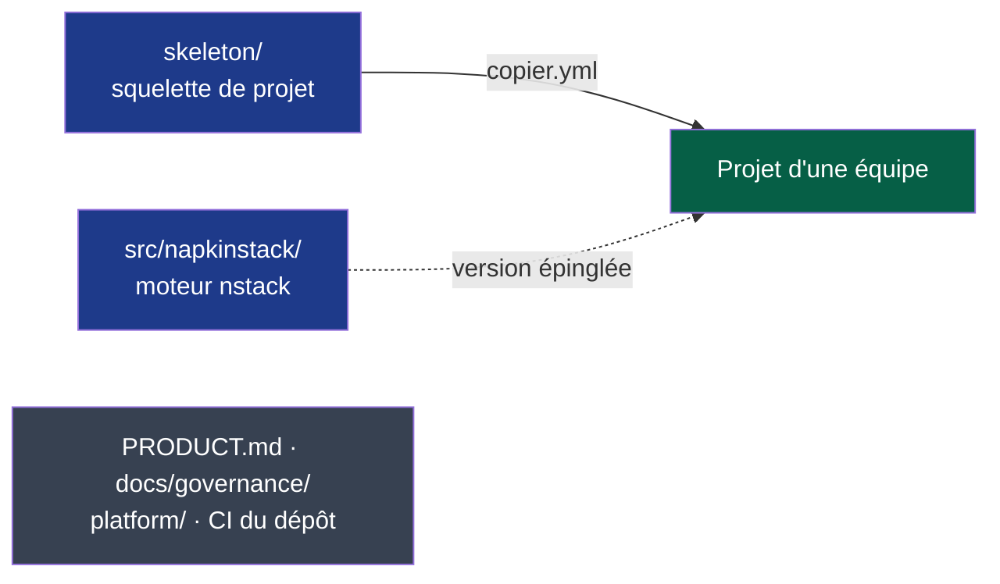

# Moteur NapkinStack v0.1.0 — plan d'implémentation

> **Emplacement :** `docs/governance/plans/`, contexte de travail du dépôt ; aucun dossier
> portant un nom d'outil (P2, P7).
>
> **Pour l'agent qui exécute :** exécuter chantier par chantier, tâche par tâche, en TDD.
> Les étapes utilisent des cases (`- [ ]`) pour le suivi. Un chantier reçoit son plan
> détaillé ici au moment de son lancement, nourri de ce que le précédent a appris : M1
> et M2a (faits), puis M2b.

**Objectif :** publier `napkinstack` v0.1.0 sur PyPI, capable de créer un projet
(`nstack init`), de le mettre à jour (`nstack update`) et de le vérifier
(`nstack doctor`), puis s'en servir pour le projet pilote avant le 2026-10-31.

**Architecture :** un seul dépôt. Le moteur est un paquet Python (`src/napkinstack/`,
`uv_build`) ; le squelette de projet est l'unique gabarit Copier du dépôt
(`copier.yml`, `_subdirectory: skeleton`) ; le contexte de développement de NapkinStack
(`PRODUCT.md`, `docs/governance/`, CI du dépôt) reste à la racine et n'est jamais copié.

**Pile technique :** Python ≥ 3.12 géré par uv, PyYAML, Copier 9.18, pre-commit, GitHub
Actions.

**Spécification :** [PDR-0001](../../pdr/0001-creer-un-projet-et-recevoir-les-evolutions.md)
(accepté), [ADR-0001](../../adr/0001-adopter-copier-pour-generer-et-mettre-a-jour-les-projets.md)
(accepté), [ADR-0002](../../adr/0002-distribuer-napkinstack-sur-pypi.md) (proposé).

## Contraintes globales

- uv est le seul prérequis ; aucune stack imposée aux modules (PDR-0001 R5, `PRODUCT.md` P1).
- Une version couvre moteur et squelette ; le projet épingle la sienne (PDR-0001 R2, R3).
- Copier piloté par `run_copy` et `run_update`, jamais `unsafe` ; un seul gabarit dans ce
  dépôt (ADR-0001).
- Paquet `napkinstack`, commande `nstack`, `uv_build`, version dans `pyproject.toml` égale
  au tag `vX.Y.Z` (ADR-0002).
- Actions tierces autorisées : `astral-sh/setup-uv` et `pypa/gh-action-pypi-publish`,
  épinglées par SHA (ADR-0002).
- Hooks et CI exécutent la même configuration (P3) ; tout check a un test qui prouve qu'il
  échoue (P5) ; tout échec nomme la règle, l'endroit et l'action (P6).
- Un chantier = une PR ; budget de revue 400 lignes et 15 fichiers, `hors-budget` justifié
  pour une migration mécanique.
- Identité : commits `fc <328672623+napkinstack-admin@users.noreply.github.com>`, push
  par l'alias SSH `github-napkinstack`, API GitHub par `gh-napkinstack`.

---

## Feuille de route


**Légende** — vert : fait · bleu : en cours · gris : chantier sans action humaine
requise · orange : actions humaines nécessaires (réglages, comptes, projet pilote).

| Chantier | Livrable vérifiable | Traite | Actions humaines |
|---|---|---|---|
| **M1 — Moteur empaqueté** | `uv run nstack fitness`, `skills`, `new-module`, `pr-scope` fonctionnent sur la racine donnée ; CI du dépôt sur uv ; `Makefile` racine supprimé | C1 (partiel), D21, D18 | Autoriser `astral-sh/setup-uv` dans l'organisation, avant la PR |
| **M2a — Squelette Copier** | `copier.yml` + `skeleton/` ; un projet généré passe ses propres checks dans la CI du dépôt ; refus des fonctions « unsafe » testé | PDR-0001 R6, ADR-0001 | — |
| **M2b — `init`, `update`** | Commandes `nstack init` et `nstack update` ; mises à jour testées (critères 1, 4 à 7) ; erreurs de Copier traduites (P6) | PDR-0001, ADR-0001 | — |
| **M3 — `doctor`** | Contrôle du poste et des réglages GitHub en lecture seule ; checklist affichée par `init` (critère 2) | PDR-0001 | — |
| **M4 — Module sans stack imposée** | Gabarit de module aux commandes à déclarer ; owner `org/équipe` accepté ; CODEOWNERS à jour (critère 3) | D22, D19 | — |
| **M6 — Documentation produit** | README réécrit avec les schémas du PDR ; CONTRIBUTING ; `docs/os/09-plateforme.md` ; C1, C2, C4, C5 replanifiés | PDR-0001 (impacts) | Relecture |
| **M5 — Publication v0.1.0** | Workflow de publication sur tag ; `uv tool install napkinstack` sur poste neuf ; attestation visible sur PyPI | ADR-0002 | Choisir la licence ; autoriser `pypa/gh-action-pypi-publish` ; compte PyPI NapkinStack (2FA) et éditeur de confiance ; environnement GitHub `pypi` ; approuver la publication |
| **Projet pilote** | `nstack init` chronométré, puis une mise à jour fusionnée | Critère de succès de PDR-0001 | Stack, équipe, dépôt ; session d'init |

---

## M1 — Moteur empaqueté (fait, #13)

**Fichiers :**

- Créer : `pyproject.toml`, `uv.lock` (généré par `uv lock`), `src/napkinstack/__init__.py`,
  `src/napkinstack/cli.py`, `src/napkinstack/fitness/__init__.py`
- Déplacer (`git mv`) :
  - `platform/fitness/manifests.py` → `src/napkinstack/fitness/manifests.py`
  - `platform/fitness/boundaries.py` → `src/napkinstack/fitness/boundaries.py`
  - `platform/fitness/pr_scope.sh` → `src/napkinstack/fitness/pr_scope.sh`
  - `platform/sync_skills.py` → `src/napkinstack/skills.py`
  - `platform/scaffold/new-module.sh` → `src/napkinstack/scaffold/new-module.sh`
  - `platform/templates/module/` → `src/napkinstack/scaffold/templates/module/`
- Supprimer : `Makefile`, `requirements-dev.txt`, `platform/fitness/requirements.txt`
- Modifier : `.github/workflows/governance.yml`, `.github/dependabot.yml`,
  `.github/CODEOWNERS`, `platform/MANIFEST.yaml`, `platform/README.md`,
  `platform/docs/runbook.md`, `platform/skills.yaml`, `platform/tooling-profile.md`,
  `README.md`, `CONTRIBUTING.md`, `modules/README.md`,
  `docs/governance/chantiers.md` (DoD, D18, D21, C1)

**Interfaces produites (utilisées par M2 à M5) :**

- `napkinstack.fitness.manifests.run(root: Path) -> int`
- `napkinstack.fitness.boundaries.run(root: Path) -> int`
- `napkinstack.skills.run(root: Path, check_only: bool = False) -> int`
- `napkinstack.cli.main(argv: list[str] | None = None) -> int`
- Commande : `nstack {manifests,boundaries,skills,fitness,new-module,pr-scope} [--root RACINE]`

### Tâche 0 — Action humaine : autoriser `astral-sh/setup-uv`

- [x] Le mainteneur ouvre https://github.com/organizations/NapkinStack/settings/actions,
  section **Policies**, champ **Allow specified actions and reusable workflows**, ajoute
  `astral-sh/setup-uv@*` et enregistre. L'épinglage par SHA reste obligatoire.
- [x] Vérifier : `gh-napkinstack api repos/NapkinStack/engineering-os/actions/permissions/selected-actions --jq .patterns_allowed`
  Attendu : `["astral-sh/setup-uv@*"]`

### Tâche 1 — Paquet et commande `nstack --version`

- [x] **Étape 1 : écrire le test qui échoue.** En tête de `platform/tests/run.sh`, juste après
  la ligne `cd …`, ajouter `REPO=$(pwd)`, puis remplacer le bloc « les scripts compilent » par :

```bash
echo "→ nstack : la commande répond et affiche sa version"
uv run nstack --version | grep -qE '^nstack [0-9]+\.[0-9]+' \
  || { echo "ÉCHEC : nstack --version ne répond pas."; exit 1; }
```

- [x] **Étape 2 : le voir échouer.** `bash platform/tests/run.sh` — attendu : échec, aucun
  `pyproject.toml`.
- [x] **Étape 3 : implémenter.** Créer `pyproject.toml` :

```toml
[project]
name = "napkinstack"
version = "0.1.0.dev0"
description = "Cadre de travail pour faire travailler plusieurs équipes et leurs agents sur un même dépôt : modules, contrats, garde-fous en CI."
requires-python = ">=3.12"
dependencies = ["PyYAML>=6.0"]

[project.scripts]
nstack = "napkinstack.cli:main"

[dependency-groups]
dev = ["pre-commit==4.6.2"]

[tool.uv]
required-version = ">=0.12.14,<0.13"

[build-system]
requires = ["uv_build>=0.12.14,<0.13"]
build-backend = "uv_build"
```

Créer `src/napkinstack/__init__.py` :

```python
"""NapkinStack — moteur : fitness functions, skills et scaffold de module."""

from importlib.metadata import version

__version__ = version("napkinstack")
```

Créer `src/napkinstack/cli.py` :

```python
"""Point d'entrée unique `nstack` (chantier C1, PDR-0001)."""

from __future__ import annotations

import argparse
from pathlib import Path

from napkinstack import __version__


def _root(value: str) -> Path:
    root = Path(value).resolve()
    if not root.is_dir():
        raise argparse.ArgumentTypeError(f"racine introuvable : {value}")
    return root


def build_parser() -> argparse.ArgumentParser:
    parser = argparse.ArgumentParser(prog="nstack", description="Moteur NapkinStack.")
    parser.add_argument("--version", action="version", version=f"nstack {__version__}")
    parser.add_subparsers(dest="command", required=True, metavar="commande")
    return parser


def main(argv: list[str] | None = None) -> int:
    args = build_parser().parse_args(argv)
    return args.func(args)
```

- [x] **Étape 4 : le voir passer.** `uv lock && bash platform/tests/run.sh` — attendu : le
  bloc « nstack : la commande répond » passe (les blocs suivants sont traités aux tâches
  suivantes et passent encore avec les anciens chemins).
- [x] **Étape 5 : commit.** `git add pyproject.toml uv.lock src/ platform/tests/run.sh && git commit -m "M1 — paquet napkinstack et commande nstack"`

### Tâche 2 — `nstack manifests` et `nstack boundaries` sur une racine donnée

- [x] **Étape 1 : tests qui échouent.** Dans `platform/tests/run.sh`, remplacer les appels :

```bash
echo "→ manifests du dépôt conformes"
uv run nstack manifests --root .

echo "→ frontières du dépôt conformes"
uv run nstack boundaries --root .

echo "→ un manifest invalide DOIT échouer"
TMP=$(mktemp -d)
mkdir -p "$TMP/modules/cassé"
printf 'module:\n  name: cassé\n' > "$TMP/modules/cassé/MANIFEST.yaml"
if OUT=$(cd / && uv run --project "$REPO" nstack manifests --root "$TMP" 2>&1); then
  echo "ÉCHEC : un manifest incomplet est passé au vert."; rm -rf "$TMP"; exit 1
fi
echo "$OUT" | grep -qF "[M2] cassé" \
  || { echo "ÉCHEC : message M2 attendu absent."; echo "$OUT"; rm -rf "$TMP"; exit 1; }
rm -rf "$TMP"
```

- [x] **Étape 2 : les voir échouer.** Attendu : `invalid choice: 'manifests'`.
- [x] **Étape 3 : implémenter.**
  - `git mv platform/fitness/manifests.py platform/fitness/boundaries.py src/napkinstack/fitness/`
    et créer `src/napkinstack/fitness/__init__.py` vide.
  - Dans les deux fichiers : remplacer le bloc `try: import yaml … except ImportError: sys.exit(…)`
    par `import yaml` ; remplacer `def main() -> int:` et sa première ligne
    `root = Path(sys.argv[1] if len(sys.argv) > 1 else ".").resolve()` par :

```python
def run(root: Path) -> int:
    failures.clear()
    warnings.clear()
```

  - Remplacer le bloc final des deux fichiers par :

```python
if __name__ == "__main__":
    sys.exit(run(Path(sys.argv[1] if len(sys.argv) > 1 else ".").resolve()))
```

  - Remplacer la ligne `Usage :` des docstrings par `Usage :  nstack manifests [--root RACINE]`
    et `Usage :  nstack boundaries [--root RACINE]`.
  - Dans `cli.py`, ajouter les imports et les sous-commandes :

```python
from napkinstack.fitness import boundaries, manifests


def _add(sub, name: str, help_: str, func) -> argparse.ArgumentParser:
    parser = sub.add_parser(name, help=help_)
    parser.add_argument("--root", type=_root, default=Path.cwd(), help="racine du projet (défaut : dossier courant)")
    parser.set_defaults(func=func)
    return parser
```

    et remplacer `parser.add_subparsers(...)` dans `build_parser` par :

```python
    sub = parser.add_subparsers(dest="command", required=True, metavar="commande")
    _add(sub, "manifests", "manifests, cycles de vie, dépréciations (M1–M9)",
         lambda a: manifests.run(a.root))
    _add(sub, "boundaries", "graphe déclaré contre graphe réel (B1–B5)",
         lambda a: boundaries.run(a.root))
```

- [x] **Étape 4 : les voir passer.** `bash platform/tests/run.sh`
- [x] **Étape 5 : commit.** `git add -A src platform && git commit -m "M1 — nstack manifests et boundaries sur la racine donnée"`

### Tâche 3 — `nstack skills` sur une racine donnée (D21)

- [x] **Étape 1 : tests qui échouent.** Dans `platform/tests/run.sh`, bloc skills :
  la fixture ne copie plus le script, et un test prouve que la racine est respectée depuis
  n'importe quel dossier :

```bash
SK=$(mktemp -d)
trap 'rm -rf "$SK"' EXIT
mkdir -p "$SK/platform"
cp platform/skills.yaml "$SK/platform/"
cp -r playbooks "$SK/"
nstack_sk() { (cd / && uv run --project "$REPO" nstack skills --root "$SK" "$@"); }

echo "→ skills : la racine donnée est analysée, quel que soit le dossier courant (D21)"
if (cd / && uv run --project "$REPO" nstack skills --check --root / >/dev/null 2>&1); then
  echo "ÉCHEC : racine sans skills.yaml acceptée."; exit 1
fi
nstack_sk --check >/dev/null || { echo "ÉCHEC : la racine donnée n'est pas analysée."; exit 1; }
```

  puis, dans tous les blocs skills, remplacer `python3 "$SK/platform/sync_skills.py" --check`
  par `nstack_sk --check` et `python3 "$SK/platform/sync_skills.py"` par `nstack_sk`.

- [x] **Étape 2 : les voir échouer.** Attendu : `invalid choice: 'skills'`.
- [x] **Étape 3 : implémenter.** `git mv platform/sync_skills.py src/napkinstack/skills.py`,
  puis remplacer son contenu par :

```python
"""
Génère les skills Claude Code à partir des playbooks.

Les playbooks sont la SOURCE DE VÉRITÉ (docs/os/06-decisions.md §9). Les skills en
sont dérivées : fichiers générés, jamais édités à la main, jamais commités.

Contrôles (mode --check, exécuté en CI) :
  S1  chaque playbook a une entrée dans platform/skills.yaml
  S2  chaque entrée pointe vers un playbook existant
  S3  les skills générées correspondent aux playbooks actuels
  S4  nom et description conformes à la spécification Agent Skills

S3 ne s'applique que si .claude/skills/ existe. Les skills sont gitignorées : un clone
vierge, donc la CI, n'en a aucune, et aucune ne peut y être désynchronisée.

Usage :
    nstack skills [--root RACINE]            # génère .claude/skills/
    nstack skills --check [--root RACINE]    # vérifie sans écrire
"""

from __future__ import annotations

import hashlib
import re
from pathlib import Path

import yaml

SKILL_NAME = re.compile(r"[a-z0-9]+(-[a-z0-9]+)*")
BANNER = (
    "<!-- GÉNÉRÉ depuis {source} par nstack skills — NE PAS ÉDITER.\n"
    "     Modifier le playbook, puis relancer `nstack skills`. -->"
)


def normalise(text: str) -> str:
    """Description sur une seule ligne, pour un frontmatter YAML propre."""
    return " ".join(text.split())


def build(root: Path, name: str, entry: dict) -> tuple[Path, str]:
    body = (root / entry["source"]).read_text(encoding="utf-8")
    # Sérialisé, jamais concaténé : « : » ou « # » dans une description casserait le YAML.
    frontmatter = yaml.safe_dump(
        {"name": name, "description": normalise(entry["description"])},
        allow_unicode=True, sort_keys=False, width=float("inf"),
    )
    content = "---\n" + frontmatter + "---\n\n" + BANNER.format(source=entry["source"]) + "\n\n" + body
    return root / ".claude" / "skills" / name / "SKILL.md", content


def digest(text: str) -> str:
    return hashlib.sha256(text.encode("utf-8")).hexdigest()[:12]


def run(root: Path, check_only: bool = False) -> int:
    map_file = root / "platform" / "skills.yaml"
    playbook_dir = root / "playbooks"
    skill_dir = root / ".claude" / "skills"

    if not map_file.is_file():
        print(f"ÉCHEC : {map_file.relative_to(root)} introuvable dans {root}.")
        return 1

    mapping = (yaml.safe_load(map_file.read_text(encoding="utf-8")) or {}).get("skills") or {}
    failures: list[str] = []

    declared = {Path(e["source"]).name for e in mapping.values() if e.get("source")}
    for playbook in sorted(playbook_dir.glob("*.md")):
        if playbook.name not in declared:
            failures.append(
                f"[S1] {playbook.relative_to(root)} n'a pas d'entrée dans "
                f"platform/skills.yaml.\n      Ajouter une description, ou retirer le "
                f"playbook s'il ne sert plus (docs/os/10-mesure.md §6)."
            )

    for name, entry in mapping.items():
        if not (root / entry.get("source", "")).is_file():
            failures.append(f"[S2] skill '{name}' : source introuvable ({entry.get('source')})")
        if not normalise(entry.get("description", "")):
            failures.append(f"[S2] skill '{name}' : description vide")

    for name, entry in mapping.items():
        if len(name) > 64 or not SKILL_NAME.fullmatch(name):
            failures.append(
                f"[S4] skill '{name}' : nom invalide. 1 à 64 caractères, a-z, 0-9 et "
                "tirets simples, sans tiret au début ni à la fin."
            )
        if len(normalise(entry.get("description", ""))) > 1024:
            failures.append(f"[S4] skill '{name}' : description de plus de 1024 caractères")

    if failures:
        for failure in failures:
            print(f"  ÉCHEC {failure}")
        return 1

    if check_only and not skill_dir.is_dir():
        print(f"Skills : S1, S2 et S4 conformes. S3 non applicable : "
              f"{skill_dir.relative_to(root)}/ absent, aucune skill générée ici.")
        return 0

    stale: list[str] = []
    written = 0
    for name, entry in sorted(mapping.items()):
        path, content = build(root, name, entry)
        if check_only:
            if not path.is_file():
                stale.append(f"[S3] skill '{name}' absente de .claude/skills/")
            elif digest(path.read_text(encoding="utf-8")) != digest(content):
                stale.append(f"[S3] skill '{name}' désynchronisée de {entry['source']}")
        else:
            path.parent.mkdir(parents=True, exist_ok=True)
            path.write_text(content, encoding="utf-8")
            written += 1

    if check_only:
        if stale:
            for item in stale:
                print(f"  ÉCHEC {item}")
            print("\nLancer `nstack skills` pour régénérer.")
            return 1
        print(f"Skills : {len(mapping)} synchronisées avec les playbooks.")
        return 0

    print(f"Skills générées dans .claude/skills/ : {written}")
    for name in sorted(mapping):
        print(f"  - {name}")
    print("\nElles se déclenchent seules selon leur description ; l'agent peut aussi")
    print("les invoquer par leur nom. Le kernel reste dans AGENTS.md.")
    return 0
```

  Dans `cli.py`, importer `skills` et ajouter :

```python
    sk = _add(sub, "skills", "génère ou vérifie les skills (S1–S4)",
              lambda a: skills.run(a.root, check_only=a.check))
    sk.add_argument("--check", action="store_true", help="vérifier sans écrire")
```

  Dans `platform/skills.yaml`, ligne 12 : `make skills-check` → `nstack skills --check`.

- [x] **Étape 4 : les voir passer.** `bash platform/tests/run.sh`
- [x] **Étape 5 : commit.** `git add -A src platform && git commit -m "M1 — nstack skills sur la racine donnée (D21)"`

### Tâche 4 — `nstack new-module`, `nstack pr-scope` et `nstack fitness`

- [x] **Étape 1 : tests qui échouent.** Bloc scaffold de `platform/tests/run.sh` :

```bash
echo "→ scaffold : le module généré a un MANIFEST.yaml valide, aux valeurs substituées"
mkdir -p "$SC/.github" "$SC/modules"
cp .github/CODEOWNERS "$SC/.github/"
uv run nstack new-module demo equipe-demo standard --root "$SC" >/dev/null
```

  (le reste du bloc est inchangé, sauf `python3 platform/fitness/manifests.py "$SC"` qui
  devient `uv run nstack manifests --root "$SC"`), puis ajouter :

```bash
echo "→ nstack fitness : échoue si l'un des trois contrôles échoue"
FT=$(mktemp -d)
mkdir -p "$FT/platform" "$FT/playbooks"
printf 'skills: {}\n' > "$FT/platform/skills.yaml"
printf '# orphelin\n' > "$FT/playbooks/orphelin.md"
if OUT=$(uv run nstack fitness --root "$FT" 2>&1); then
  echo "ÉCHEC : un playbook sans entrée est passé au vert."; rm -rf "$FT"; exit 1
fi
echo "$OUT" | grep -qF "[S1]" || { echo "ÉCHEC : S1 attendu."; echo "$OUT"; rm -rf "$FT"; exit 1; }
rm -rf "$FT"
```

- [x] **Étape 2 : les voir échouer.** Attendu : `invalid choice: 'new-module'`.
- [x] **Étape 3 : implémenter.**
  - `git mv platform/scaffold/new-module.sh src/napkinstack/scaffold/new-module.sh`,
    `git mv platform/templates/module src/napkinstack/scaffold/templates/module`,
    `git mv platform/fitness/pr_scope.sh src/napkinstack/fitness/pr_scope.sh`.
  - Dans `new-module.sh`, remplacer `ROOT="$(cd "$(dirname "$0")/../.." && pwd)"` par
    `ROOT="${NSTACK_ROOT:?racine du projet requise (nstack new-module --root)}"` et
    `cp -r "$ROOT/platform/templates/module" "$DEST"` par
    `cp -r "$(cd "$(dirname "$0")" && pwd)/templates/module" "$DEST"` ; dans ses messages,
    `make fitness` → `nstack fitness` et `verbes standards : make check / test / run` →
    `verbes standards : section commands du MANIFEST`.
  - Dans `cli.py` :

```python
import os
import subprocess

PACKAGE = Path(__file__).resolve().parent


def _script(relative: str, *args: str, root: Path) -> int:
    env = {**os.environ, "NSTACK_ROOT": str(root)}
    return subprocess.run(["bash", str(PACKAGE / relative), *args], cwd=root, env=env).returncode


def _fitness(root: Path) -> int:
    results = [manifests.run(root), boundaries.run(root), skills.run(root, check_only=True)]
    return 1 if any(results) else 0
```

    et dans `build_parser` :

```python
    _add(sub, "fitness", "manifests + frontières + skills",
         lambda a: _fitness(a.root))
    nm = _add(sub, "new-module", "crée un module et ses garde-fous",
              lambda a: _script("scaffold/new-module.sh", a.name, a.owner, a.criticality, root=a.root))
    nm.add_argument("name")
    nm.add_argument("owner")
    nm.add_argument("criticality", choices=["prototype", "standard", "eleve", "critique"])
    ps = _add(sub, "pr-scope", "une PR = un module, budget de revue (P1–P2)",
              lambda a: _script("fitness/pr_scope.sh", a.base, root=a.root))
    ps.add_argument("--base", default="origin/main")
```

  - Dans `pr_scope.sh`, ajouter `uv\.lock` à la liste des fichiers de verrouillage exclus
    du budget : `(package-lock\.json|yarn\.lock|pnpm-lock\.yaml|Cargo\.lock|go\.sum|uv\.lock|\.generated\.|/generated/)`.
- [x] **Étape 4 : les voir passer.** `bash platform/tests/run.sh`
- [x] **Étape 5 : commit.** `git add -A src platform && git commit -m "M1 — nstack new-module, pr-scope et fitness"`

### Tâche 5 — CI, dépendances et tests sur uv

- [x] **Étape 1 : l'oracle reste dans le module.** `platform/tests/run.sh` ne bouge pas : M9
  exige un dossier `tests/` dans le module `platform` (criticité élevée). *Écart constaté à
  l'exécution : le déplacement vers `tests/run.sh` a été refusé par M9 lui-même.*
- [x] **Étape 2 : CI.** Dans `.github/workflows/governance.yml`, job `architecture` :
  remplacer `actions/setup-python`, `Dépendances` et les quatre étapes de checks par :

```yaml
      - uses: astral-sh/setup-uv@bec219d24cd3e171d82865faccec33120bb574f4 # v10.1.0

      - uses: actions/cache@55cc8345863c7cc4c66a329aec7e433d2d1c52a9 # v6.1.0
        with:
          path: ~/.cache/pre-commit
          key: pre-commit-${{ runner.os }}-${{ hashFiles('.pre-commit-config.yaml', 'uv.lock') }}

      - name: Dépendances
        run: uv sync --locked

      - name: Manifests, frontières, skills
        run: uv run nstack fitness --root .

      - name: Tests de la plateforme — chaque garde-fou prouve qu'il sait échouer
        run: uv run bash platform/tests/run.sh
```

  Job `scope` : `run: ./platform/fitness/pr_scope.sh "origin/$BASE_REF"` devient
  `run: bash src/napkinstack/fitness/pr_scope.sh "origin/$BASE_REF"`.
  Job `hooks` : remplacer `actions/setup-python` et `Dépendances` par
  `astral-sh/setup-uv` (même SHA) puis `run: uv sync --locked` ; clé de cache
  `hashFiles('.pre-commit-config.yaml', 'uv.lock')` ; les deux commandes deviennent
  `uv run pre-commit run --all-files --show-diff-on-failure` et
  `uv run pre-commit run gitleaks-historique --hook-stage manual --all-files`.
  Les trois noms de jobs ne changent pas : ce sont les checks obligatoires du ruleset.
- [x] **Étape 3 : Dependabot.** Dans `.github/dependabot.yml`, le bloc `pip` devient :

```yaml
  - package-ecosystem: uv
    directory: /
    schedule:
      interval: weekly
    cooldown:
      default-days: 7
    groups:
      uv:
        patterns: ["*"]
```

- [x] **Étape 4 : supprimer.** `git rm Makefile requirements-dev.txt platform/fitness/requirements.txt`
- [x] **Étape 5 : vérifier.** `uv run bash platform/tests/run.sh` vert ; `uv run pre-commit run --all-files`
  vert (zizmor et actionlint valident le workflow) ;
  `GITHUB_ACTIONS=true GITHUB_WORKFLOW=Gouvernance uv run bash platform/tests/run.sh` vert.
- [x] **Étape 6 : commit.** `git add -A && git commit -m "M1 — CI et dépendances sur uv"`

### Tâche 6 — Références et enveloppe du module `platform`

- [x] **Étape 1 : inventaire rouge.** Cette commande doit ne rien afficher à la fin de la
  tâche ; elle affiche aujourd'hui les références mortes :

```bash
git grep -n -E "platform/(fitness|sync_skills|scaffold|templates|tests)|\bmake (bootstrap|check|test|fitness|skills|skills-check|scaffold|ci)\b|requirements-dev\.txt" \
  -- ':!docs/governance/chantiers.md' ':!docs/governance/plans/' ':!docs/adr/' \
     ':!src/napkinstack/scaffold/templates/' ':!contracts/'
```

  Exclusions : historique des décisions et des chantiers ; gabarit de module et module
  `contracts/`, dont les `make` restent exacts tant que leurs Makefile existent (D22, M4).

- [x] **Étape 2 : corriger chaque occurrence.**
  - `README.md` : `make bootstrap` → `uv sync` ; `make scaffold NAME=x OWNER=team-y CRIT=standard`
    → `uv run nstack new-module x team-y standard` ; `make fitness` → `uv run nstack fitness` ;
    `make skills` → `uv run nstack skills` ; `make skills-check` → `uv run nstack skills --check` ;
    lignes `make check`, `make test`, `make ci` → une ligne « commandes de chaque module :
    section `commands` de son `MANIFEST.yaml` » ; `platform/fitness/boundaries.py` →
    `src/napkinstack/fitness/boundaries.py`.
  - `CONTRIBUTING.md` : `make fitness` → `uv run nstack fitness`.
  - `modules/README.md` : `make scaffold NAME=billing OWNER=team-revenue CRIT=standard` →
    `uv run nstack new-module billing team-revenue standard`.
  - `platform/README.md` : tableau « Contenu » vers `src/napkinstack/` ; blocs de commandes
    en `uv run nstack …`.
  - `platform/docs/runbook.md` : `make fitness` → `uv run nstack fitness`.
  - `.github/CODEOWNERS` ligne 2 : `platform/scaffold/new-module.sh` → `nstack new-module`.
  - `platform/MANIFEST.yaml`, section `commands` :

```yaml
commands:
  bootstrap: uv sync --locked
  check: uv run nstack fitness --root ..
  test: uv run bash tests/run.sh
  run: "echo 'non applicable'"
```

  - `platform/tooling-profile.md` : ligne « Exécution de commandes et de tests » →
    outil `uv`, décision `ADR-0002`.
  - `PRODUCT.md` §5 : l'oracle reste `platform/tests/run.sh`, désormais lancé par
    `uv run bash platform/tests/run.sh`.
  - `docs/governance/chantiers.md` : DoD `bash platform/tests/run.sh` →
    `uv run bash platform/tests/run.sh` ; D18 → « M1, uv » ; ajouter D21 → « M1 » ; en-tête de C1 :
    « Partiellement traité par M1 (commande `nstack`, Makefile racine supprimé) ».
- [x] **Étape 3 : inventaire vert.** La commande de l'étape 1 n'affiche plus rien.
- [x] **Étape 4 : vérification complète.** Fitness, `uv run bash platform/tests/run.sh` (local et
  GitHub simulé), hooks sur tous les fichiers, `pr-scope`, gitleaks, rejeu sur clone vierge.
- [x] **Étape 5 : commit, PR, merge.** `git add -A && git commit -m "M1 — références et enveloppe du module platform"` ;
  PR « M1 — Moteur empaqueté », label `hors-budget` (migration mécanique : déplacements de
  fichiers et `uv.lock`) ; merge après tests et validation.

---

## M2a — Squelette Copier (fait, #14)

> M2 est découpé le 2026-09-15. **M2a** extrait le squelette en gabarit Copier et prouve,
> dans la CI de ce dépôt, qu'un projet généré passe ses propres contrôles. **M2b** livre
> `nstack init` et `nstack update`, les scénarios des critères 1 et 4 à 7 et la traduction
> des erreurs de Copier (P6).

**Décisions du chantier** (faits vérifiés le 2026-09-15) :

| Sujet | Choix | Référence, fait vérifié |
|---|---|---|
| Gabarit | `copier.yml` à la racine, `_subdirectory: skeleton`, `_min_copier_version: "9.18"` ; `copier==9.18.2` dépendance du moteur | 9.18.2 est la dernière version sur PyPI. Essai : suffixe `.jinja` retiré au rendu, fichiers sans suffixe copiés tels quels (`${{ }}` intacts), modifications non commitées d'un gabarit local incluses avec `--vcs-ref HEAD` |
| Questions | `project_name`, `github_repo` (`org/nom`), `owner_team` (`org/équipe`) ; `validator` natif sur les deux dernières | Réponse invalide : sortie 1, `Validation error for question 'owner_team'` ; ferme l'entrée qui cause D19 |
| Version du projet | `_commit` du fichier de réponses standard `.copier-answers.yml` | `_commit` = `git describe --tags --always` (`copier/_template.py`) ; essai sur un tag `v0.1.0` : `napkinstack==0.1.0` rendu |
| Moteur dans la CI du projet | `uv tool install "napkinstack==<_commit sans v>" --with-executables-from pre-commit`, version lue par `yq` ; aucun workflow en `.jinja` | `yq` 4.53 préinstallé sur `ubuntu-24.04` (runner-images) ; `setup-uv` ajoute `~/.local/bin` au PATH (`src/setup-uv.ts`) ; ADR-0001 règle 5 |
| pre-commit | Passe du groupe `dev` aux dépendances du moteur, même épinglage | Une version de NapkinStack fixe aussi celle de pre-commit (R2, R3) ; option `--with-executables-from` d'uv 0.12 |
| Configuration des skills | `.nstack/skills.yaml` ; racine sans `playbooks/` ni correspondance : « non applicable » | Configuration d'outil dans un dossier à son nom, comme `.github/` ; marque en périphérie (P7) |
| Hooks du squelette | `.pre-commit-config.yaml` et `.yamllint.yaml` identiques à la racine, test bloquant | Le dépôt reste le premier utilisateur de ses règles (`PRODUCT.md` §1) |
| Dependabot | `directories` et `group-by: dependency-name` : une PR par dépendance, qui met à jour la racine et `skeleton/` ensemble | Changelog GitHub du 2026-02-24 : sans `group-by`, une PR par répertoire, qui casserait le test d'identité. github-actions lit tel quel un répertoire autre que `/` (`dependabot-core`, `file_fetcher.rb`), d'où `/skeleton/.github/workflows`. Schéma accepté par check-jsonschema 0.38.0 |
| Refus « unsafe » | Test : un gabarit avec `_tasks` sort en code 4 et ne crée rien | Constaté sur Copier 9.18.2 ; règle à automatiser d'ADR-0001 |

**Non vérifiable dans ce chantier :** l'installation depuis PyPI dans la CI d'un projet
généré. Elle l'est à la première publication (M5), puis au projet pilote.

**Fichiers :**

- Déplacer (`git mv`) vers `skeleton/` : `AGENTS.md`, `CONTRIBUTING.md`, `playbooks/`,
  `docs/os/`, `docs/architecture/.gitkeep`, `docs/runbooks/.gitkeep`, `modules/`,
  `contracts/` (`MANIFEST.yaml` devient `MANIFEST.yaml.jinja`),
  `.github/workflows/module-checks.yml` ; `platform/skills.yaml` →
  `skeleton/.nstack/skills.yaml` ; `platform/tooling-profile.md` →
  `skeleton/docs/tooling-profile.md` ; `README.md` → `skeleton/README.md.jinja`.
- Copier vers `skeleton/` (deux publics, deux fichiers) : `.pre-commit-config.yaml`,
  `.yamllint.yaml`, `.gitignore`, `SECURITY.md`, `.github/pull_request_template.md`,
  `.github/ISSUE_TEMPLATE/0*.yml`, `docs/adr/README.md`, `docs/adr/_TEMPLATE.md`,
  `docs/pdr/README.md`, `docs/pdr/_TEMPLATE.md`. Les copies de la racine des formulaires
  et du modèle de PR restent des copies de référence, relues à M6.
- Créer : `copier.yml` ; `skeleton/.github/CODEOWNERS.jinja`,
  `skeleton/.github/ISSUE_TEMPLATE/config.yml.jinja`,
  `skeleton/{{ _copier_conf.answers_file }}.jinja`, `skeleton/.github/workflows/governance.yml`,
  `skeleton/.github/dependabot.yml` ; à la racine, `README.md`, `AGENTS.md` et
  `CONTRIBUTING.md` courts.
- Modifier : `src/napkinstack/skills.py`, `platform/tests/run.sh`, `pyproject.toml`,
  `uv.lock`, `.github/CODEOWNERS`, `.github/dependabot.yml`, `PRODUCT.md`, `SECURITY.md`,
  `platform/README.md`, `docs/adr/README.md`, `docs/pdr/README.md`,
  `docs/governance/chantiers.md`, `docs/governance/backlog-automatisation.md`,
  `docs/governance/revues.md`.

**Interfaces produites (utilisées par M2b à M5) :**

- `napkinstack.skills.MAPPING == Path(".nstack/skills.yaml")` ; `skills.run(root, check_only)`
  rend 0 sur une racine sans `playbooks/` ni correspondance.
- Gabarit : `copier copy --vcs-ref <réf> -d project_name=… -d github_repo=org/nom
  -d owner_team=org/équipe <source> <destination>` ; réponses et version dans
  `.copier-answers.yml` (`_commit`, `_src_path`).
- CI d'un projet : jobs `Fitness functions`, `Périmètre et budget de revue`,
  `Hooks et secrets`, mêmes noms que dans ce dépôt, donc même checklist de ruleset.

### Tâche 1 — Skills configurées dans `.nstack/`, playbooks dans le squelette

- [x] **Étape 1 : déplacer.**

```bash
mkdir -p skeleton/.nstack
git mv playbooks skeleton/playbooks
git mv platform/skills.yaml skeleton/.nstack/skills.yaml
```

- [x] **Étape 2 : tests qui échouent.** Dans `platform/tests/run.sh` :
  - fixture des skills : `mkdir -p "$SK/platform"`, `cp platform/skills.yaml "$SK/platform/"`
    et `cp -r playbooks "$SK/"` deviennent `mkdir -p "$SK/.nstack"`,
    `cp skeleton/.nstack/skills.yaml "$SK/.nstack/"` et `cp -r skeleton/playbooks "$SK/"` ;
  - bloc D21 : supprimer le cas `--root /` (quatre lignes `if … fi`) ; garder la ligne
    `nstack_sk --check` ; ajouter après elle :

```bash
echo "→ skills : une racine sans playbooks ni correspondance n'est pas concernée"
mkdir -p "$SK/vide"
if ! OUT=$(cd / && uv run --project "$REPO" nstack skills --check --root "$SK/vide" 2>&1); then
  echo "ÉCHEC : une racine sans playbooks est refusée."; echo "$OUT"; exit 1
fi
echo "$OUT" | grep -qF "Skills : non applicable" \
  || { echo "ÉCHEC : racine non concernée sans le dire."; echo "$OUT"; exit 1; }

echo "→ skills : des playbooks sans .nstack/skills.yaml DOIVENT échouer (S1)"
mkdir -p "$SK/vide/playbooks"
printf '# orphelin\n' > "$SK/vide/playbooks/orphelin.md"
if OUT=$(cd / && uv run --project "$REPO" nstack skills --check --root "$SK/vide" 2>&1); then
  echo "ÉCHEC : des playbooks sans correspondance sont passés au vert."; exit 1
fi
echo "$OUT" | grep -qF "[S1] .nstack/skills.yaml introuvable" \
  || { echo "ÉCHEC : message S1 attendu absent."; echo "$OUT"; exit 1; }
```

  - frontmatter : `root / "platform/skills.yaml"` → `root / ".nstack/skills.yaml"` ;
    `cp playbooks/tests.md` → `cp skeleton/playbooks/tests.md` ;
  - `skill_tests_modifiee` : `cp platform/skills.yaml "$SK/platform/"` →
    `cp skeleton/.nstack/skills.yaml "$SK/.nstack/"`, et `"$SK/platform/skills.yaml"` →
    `"$SK/.nstack/skills.yaml"` ;
  - `nstack fitness` : `mkdir -p "$FT/platform" "$FT/playbooks"` →
    `mkdir -p "$FT/.nstack" "$FT/playbooks"`, et `"$FT/platform/skills.yaml"` →
    `"$FT/.nstack/skills.yaml"`.
- [x] **Étape 3 : voir échouer.** `uv run bash platform/tests/run.sh` — attendu :
  `ÉCHEC : la racine donnée n'est pas analysée.` (le moteur cherche encore
  `platform/skills.yaml`).
- [x] **Étape 4 : implémenter.** Dans `src/napkinstack/skills.py` : docstring,
  `(platform/tooling-profile.md)` → `(docs/tooling-profile.md)`, `S1  chaque playbook a une
  entrée dans .nstack/skills.yaml`, et après le paragraphe S3 : « Une racine sans playbooks/
  ni .nstack/skills.yaml, comme le dépôt NapkinStack lui-même, n'est pas concernée. » Ajouter
  la constante `MAPPING = Path(".nstack") / "skills.yaml"` après `BANNER`, puis remplacer le
  début de `run` :

```python
def run(root: Path, check_only: bool = False) -> int:
    map_file = root / MAPPING
    playbook_dir = root / "playbooks"
    skill_dir = root / ".claude" / "skills"

    if not map_file.is_file():
        if not playbook_dir.is_dir():
            print(f"Skills : non applicable, ni playbooks/ ni {MAPPING} dans {root}.")
            return 0
        print(f"  ÉCHEC [S1] {MAPPING} introuvable dans {root} : aucun playbook n'a d'entrée.\n"
              f"      Créer {MAPPING}, une entrée par playbook (source, description).")
        return 1
```

  Message S1 : `f"platform/skills.yaml.\n      Ajouter …"` → `f"{MAPPING}.\n      Ajouter …"`.
- [x] **Étape 5 : voir passer.** `uv run bash platform/tests/run.sh` vert ;
  `uv run nstack fitness --root .` affiche `Skills : non applicable`.
- [x] **Étape 6 : commit.** `git add -A && git commit -m "M2a — skills configurées dans .nstack/, playbooks dans le squelette"`

### Tâche 2 — Gabarit Copier : réponses rendues, contexte NapkinStack absent

- [x] **Étape 1 : dépendance.** `pyproject.toml` :
  `dependencies = ["PyYAML>=6.0", "copier==9.18.2"]`, puis `uv lock`.
- [x] **Étape 2 : tests qui échouent.** À la fin de `platform/tests/run.sh`, avant
  `echo "Tests plateforme : OK"` :

```bash
# Squelette : projets générés depuis l'arbre de travail, modifications non commitées
# comprises, jamais depuis GitHub.
GN=$(mktemp -d)
trap 'rm -rf "$SK" "$SC" "$HK" "$GN"' EXIT
generer() {  # $1 = gabarit, $2 = destination, puis les options -d de Copier
  local gabarit=$1 destination=$2; shift 2
  copier copy --quiet --defaults --vcs-ref HEAD "$@" "$gabarit" "$destination"
}
REPONSES=(-d "project_name=Projet démo" -d github_repo=acme/demo -d owner_team=acme/plateforme)
PROJET="$GN/projet"

echo "→ squelette : le projet généré porte les réponses, sans fichier de gabarit résiduel"
if ! OUT=$(generer "$REPO" "$PROJET" "${REPONSES[@]}" 2>&1); then
  echo "ÉCHEC : la génération du projet a échoué."; echo "$OUT"; exit 1
fi
RESIDUS=$(find "$PROJET" -name '*.jinja')
[ -z "$RESIDUS" ] || { echo "ÉCHEC : fichiers de gabarit copiés tels quels :"; echo "$RESIDUS"; exit 1; }
for attendu in ".github/CODEOWNERS|@acme/plateforme" \
               ".github/ISSUE_TEMPLATE/config.yml|https://github.com/acme/demo/discussions" \
               "contracts/MANIFEST.yaml|owner: acme/plateforme" \
               "README.md|# Projet démo" \
               ".copier-answers.yml|owner_team: acme/plateforme"; do
  fichier=${attendu%%|*}; texte=${attendu#*|}
  grep -qF -- "$texte" "$PROJET/$fichier" 2>/dev/null \
    || { echo "ÉCHEC : $fichier ne contient pas « $texte »."; exit 1; }
done

echo "→ squelette : le contexte de développement de NapkinStack n'est jamais copié (R6)"
for absent in PRODUCT.md docs/governance platform src pyproject.toml uv.lock copier.yml skeleton; do
  [ ! -e "$PROJET/$absent" ] \
    || { echo "ÉCHEC : $absent copié dans le projet généré (PDR-0001 R6). Le retirer de skeleton/."; exit 1; }
done

echo "→ squelette : le projet généré passe nstack fitness, playbooks compris"
if ! OUT=$(cd / && uv run --project "$REPO" nstack fitness --root "$PROJET" 2>&1); then
  echo "ÉCHEC : le projet généré ne passe pas nstack fitness."; echo "$OUT"; exit 1
fi
echo "$OUT" | grep -qF "Skills : S1, S2 et S4 conformes" \
  || { echo "ÉCHEC : skills non vérifiées dans le projet généré."; echo "$OUT"; exit 1; }

echo "→ squelette : un dépôt ou une équipe sans organisation DOIT être refusé"
for question in github_repo owner_team; do
  if [ "$question" = github_repo ]; then
    reponses=(-d project_name=x -d github_repo=demo -d owner_team=acme/plateforme)
  else
    reponses=(-d project_name=x -d github_repo=acme/demo -d owner_team=plateforme)
  fi
  if OUT=$(generer "$REPO" "$GN/refus-$question" "${reponses[@]}" 2>&1); then
    echo "ÉCHEC : $question sans « / » accepté."; exit 1
  fi
  echo "$OUT" | grep -qF "Validation error for question '$question'" \
    || { echo "ÉCHEC : refus de $question sans le message du validateur."; echo "$OUT"; exit 1; }
done

echo "→ squelette : un gabarit à fonction « unsafe » DOIT être refusé, sans rien créer (ADR-0001)"
UNSAFE="$GN/gabarit-unsafe"
mkdir -p "$UNSAFE" && cp -r copier.yml skeleton "$UNSAFE/"
printf '\n_tasks:\n  - "touch execute"\n' >> "$UNSAFE/copier.yml"
git "${GIT_ID[@]}" init -q "$UNSAFE"
git -C "$UNSAFE" add -A
git "${GIT_ID[@]}" -C "$UNSAFE" commit -q --no-verify -m unsafe
CODE=0
OUT=$(generer "$UNSAFE" "$GN/unsafe" "${REPONSES[@]}" 2>&1) || CODE=$?
[ "$CODE" -eq 4 ] || { echo "ÉCHEC : gabarit unsafe non refusé (code $CODE, 4 attendu)."; echo "$OUT"; exit 1; }
echo "$OUT" | grep -qF "potentially unsafe feature: tasks" \
  || { echo "ÉCHEC : refus sans le message de Copier."; echo "$OUT"; exit 1; }
[ ! -e "$GN/unsafe" ] || { echo "ÉCHEC : le gabarit refusé a créé des fichiers."; exit 1; }
```

- [x] **Étape 3 : voir échouer.** Attendu : sans `copier.yml`, Copier copie tout le dépôt,
  puis `ÉCHEC : .github/CODEOWNERS ne contient pas « @acme/plateforme ».`
- [x] **Étape 4 : gabarit.** Créer `copier.yml` :

```yaml
# Gabarit Copier du squelette de projet (ADR-0001) : le seul de ce dépôt.
# Versions = tags du dépôt (PEP 440). Aucune fonction « unsafe » : ni _tasks, ni
# _migrations, ni _jinja_extensions ; un test le vérifie. Seuls les fichiers .jinja
# contiennent des variables.

_subdirectory: skeleton
_min_copier_version: "9.18"

project_name:
  type: str
  help: Nom du projet

github_repo:
  type: str
  help: Dépôt GitHub du projet, de la forme organisation/nom
  validator: >-
    
    Attendu : organisation/nom, par exemple acme/facturation.
    

owner_team:
  type: str
  help: Équipe GitHub propriétaire du socle, de la forme organisation/équipe
  validator: >-
    
    Attendu : organisation/équipe, par exemple acme/plateforme.
    
```

- [x] **Étape 5 : déplacer et copier.**

```bash
mkdir -p skeleton/docs/adr skeleton/docs/pdr skeleton/docs/architecture skeleton/docs/runbooks \
         skeleton/.github/workflows skeleton/.github/ISSUE_TEMPLATE
git mv AGENTS.md CONTRIBUTING.md contracts modules skeleton/
git mv docs/os skeleton/docs/os
git mv docs/architecture/.gitkeep skeleton/docs/architecture/.gitkeep
git mv docs/runbooks/.gitkeep skeleton/docs/runbooks/.gitkeep
git mv .github/workflows/module-checks.yml skeleton/.github/workflows/module-checks.yml
git mv platform/tooling-profile.md skeleton/docs/tooling-profile.md
git mv skeleton/contracts/MANIFEST.yaml skeleton/contracts/MANIFEST.yaml.jinja
git mv README.md skeleton/README.md.jinja
cp .gitignore SECURITY.md skeleton/
cp .github/pull_request_template.md skeleton/.github/
cp .github/ISSUE_TEMPLATE/0*.yml skeleton/.github/ISSUE_TEMPLATE/
cp docs/adr/README.md docs/adr/_TEMPLATE.md skeleton/docs/adr/
cp docs/pdr/README.md docs/pdr/_TEMPLATE.md skeleton/docs/pdr/
```

- [x] **Étape 6 : fichiers à variables.**
  - `skeleton/.github/CODEOWNERS.jinja` : contenu de `.github/CODEOWNERS`, où
    `@NapkinStack/maintainers` devient `@{{ owner_team }}`, la ligne `/platform/` disparaît et
    `/.nstack/` et `/.copier-answers.yml` s'ajoutent au bloc « Socle ».
  - `skeleton/.github/ISSUE_TEMPLATE/config.yml.jinja` : contenu de
    `.github/ISSUE_TEMPLATE/config.yml`, URL `https://github.com/{{ github_repo }}/discussions`.
  - `skeleton/contracts/MANIFEST.yaml.jinja` : `owner: {{ owner_team }}` et
    `contact: "https://github.com/{{ github_repo }}/discussions"`.
  - `skeleton/{{ _copier_conf.answers_file }}.jinja` :

```jinja
# Réponses de la création du projet et version de NapkinStack (_commit).
# Géré par Copier : modifié par nstack update, jamais à la main.
{{ _copier_answers|to_nice_yaml -}}
```

  - `skeleton/README.md.jinja` : les neuf premières lignes (bandeau « en refonte », titre et
    phrase) deviennent `# {{ project_name }}`, une ligne vide, `<Une phrase : ce que fait ce
    projet.>` ; la section « Installation — 10 minutes » devient :

````markdown
## Installation

```bash
# 1. Outillage à la version de NapkinStack du projet (prérequis : uv)
uv tool install "napkinstack=={{ _copier_answers._commit | regex_replace('^v', '') }}" --with-executables-from pre-commit

# 2. Hooks, une fois par clone
pre-commit install

# 3. Créer le premier module
nstack new-module billing team-revenue standard

# 4. Vérifier que les garde-fous répondent
nstack fitness
```

Cette version est celle de `.copier-answers.yml` ; elle ne change que par `nstack update`,
en PR relue.
````

    Puis : ligne `platform/` du tableau → `` | `.nstack/` | Configuration de l'outillage :
    playbooks exposés en skills | L'équipe socle | `` ; ligne `docs/governance/` →
    `` | `.copier-answers.yml` | Version de NapkinStack et réponses de création | `nstack update`, seul | `` ;
    `uv run nstack` → `nstack` partout ; `platform/skills.yaml` → `.nstack/skills.yaml` ;
    `platform/tooling-profile.md` → `docs/tooling-profile.md` ; supprimer la case « Calibrage
    de `SOURCE_SUFFIXES` et `IMPORT_HINTS` » (le moteur installé ne se modifie pas, D23).
- [x] **Étape 7 : contenu du squelette.**
  - `skeleton/CONTRIBUTING.md` et `skeleton/modules/README.md` : `uv run nstack` → `nstack`.
  - `skeleton/docs/tooling-profile.md` : colonne « Décision » des lignes remplies →
    `Socle NapkinStack` ; « uv (`uv run`, `uv sync`) » → « uv (`uv tool install`) » ;
    « `nstack` (`src/napkinstack/fitness/`) » → « `nstack fitness` » ; « générées par
    `sync_skills.py` » → « générées par `nstack skills` ».
  - `skeleton/docs/os/09-plateforme.md` : ligne 182, `platform/tooling-profile.md` →
    `docs/tooling-profile.md` ; dans l'arborescence, la ligne `tooling-profile.md` passe du
    bloc `platform/` (dont `templates/` devient la dernière entrée, `└──`) au bloc `docs/`,
    après `runbooks/`.
  - `skeleton/docs/adr/README.md` et `skeleton/docs/pdr/README.md` : lignes de l'index
    supprimées, en-tête du tableau conservé.
- [x] **Étape 8 : racine.** Créer `README.md` :

````markdown
# NapkinStack

Cadre de travail pour faire travailler plusieurs équipes et leurs agents sur un même
dépôt : modules, contrats, garde-fous en CI.

> **État : en construction (v0.1.0).** `nstack init` et `nstack update` arrivent au
> chantier M2b ; le mode d'emploi complet, au chantier M6.
> Suivi : [`docs/governance/chantiers.md`](docs/governance/chantiers.md).



**Légende** — bleu : livré aux projets · vert : projet généré, qui possède son squelette ·
gris : développement de NapkinStack, jamais copié (PDR-0001 R6). Trait plein : génération ;
pointillé : dépendance versionnée.

| Chemin | Rôle |
|---|---|
| `skeleton/` | Ce que reçoit chaque projet : kernel, playbooks, manuel, CI, hooks |
| `copier.yml` | Questions posées à la création (gabarit Copier, ADR-0001) |
| `src/napkinstack/` | Le moteur, commande `nstack` |
| `platform/` | Enveloppe du module moteur : manifest, runbook, tests |
| `PRODUCT.md`, `docs/governance/` | Contexte de travail sur NapkinStack |
| `docs/adr/`, `docs/pdr/` | Décisions de NapkinStack |

## Développer NapkinStack

```bash
uv sync                               # prérequis : uv
uv run pre-commit install
uv run nstack fitness                 # garde-fous du dépôt
uv run bash platform/tests/run.sh     # oracle : chaque garde-fou prouve qu'il sait échouer
```

Avant toute contribution : [`PRODUCT.md`](PRODUCT.md).
````

  Créer `AGENTS.md` :

```markdown
# Agents — dépôt NapkinStack

Ce dépôt développe NapkinStack ; ce n'est pas un projet qui l'utilise.

1. Lire [`PRODUCT.md`](PRODUCT.md), en particulier §5 : comment travailler ici.
2. Méthode : le kernel livré aux projets, [`skeleton/AGENTS.md`](skeleton/AGENTS.md).
   Ici, « un module » se lit « un chantier ».
3. Oracle : `uv run bash platform/tests/run.sh`.
```

  Créer `CONTRIBUTING.md` :

```markdown
# Contribuer à NapkinStack

- Contexte et règles de travail : [`PRODUCT.md`](PRODUCT.md) §5.
- Chantiers et Definition of Done : [`docs/governance/chantiers.md`](docs/governance/chantiers.md).
- Barrières contre les fuites et exceptions (`cross-module`, `hors-budget`) : les mêmes que
  dans les projets, décrites dans [`skeleton/CONTRIBUTING.md`](skeleton/CONTRIBUTING.md).
```

- [x] **Étape 9 : voir passer.** `uv run bash platform/tests/run.sh` vert jusqu'au dernier
  bloc ; `uv run nstack fitness --root .` vert (un seul manifest : `platform`).
- [x] **Étape 10 : inventaire du squelette.** Cette commande ne doit rien afficher :

```bash
git grep -n -E "PRODUCT\.md|docs/governance|platform/(skills\.yaml|tooling-profile\.md|tests)|src/napkinstack|sync_skills|uv run nstack|uv sync|engineering-os|NapkinStack/maintainers" -- skeleton/
```

- [x] **Étape 11 : commit.** `git add -A && git commit -m "M2a — gabarit Copier du squelette de projet"`

### Tâche 3 — CI et hooks du projet généré

- [x] **Étape 1 : tests qui échouent.** À la suite du bloc de la tâche 2 :

```bash
echo "→ squelette : hooks et règles YAML identiques à ceux du dépôt (P3)"
for f in .pre-commit-config.yaml .yamllint.yaml; do
  cmp -s "$f" "skeleton/$f" \
    || { echo "ÉCHEC : skeleton/$f diverge de $f. Appliquer le même changement aux deux copies."; exit 1; }
done

echo "→ squelette : le projet généré passe ses propres hooks et le scan de secrets"
git "${GIT_ID[@]}" init -q "$PROJET"
git -C "$PROJET" add -A
git "${GIT_ID[@]}" -C "$PROJET" commit -q --no-verify -m "Projet généré"
if ! OUT=$(cd "$PROJET" && SKIP=gitleaks pre-commit run --all-files 2>&1); then
  echo "ÉCHEC : le projet généré ne passe pas ses hooks."; echo "$OUT"; exit 1
fi
for hook in "Lint GitHub Actions workflow files" "Validate Dependabot Config (v2)" \
            "Validate GitHub issue config" "Validate GitHub issue forms" "zizmor"; do
  echo "$OUT" | grep -F -- "$hook" | grep -qF "Passed" \
    || { echo "ÉCHEC : hook « $hook » non exécuté sur le projet généré."; echo "$OUT"; exit 1; }
done
if ! OUT=$(cd "$PROJET" && pre-commit run gitleaks-historique --hook-stage manual --all-files 2>&1); then
  echo "ÉCHEC : scan d'historique en échec sur le projet généré."; echo "$OUT"; exit 1
fi
```

- [x] **Étape 2 : voir échouer.** Attendu : `ÉCHEC : skeleton/.pre-commit-config.yaml diverge
  de .pre-commit-config.yaml.`
- [x] **Étape 3 : hooks.** Dans `.pre-commit-config.yaml`, la phrase « l'aligner sur celle du
  hook gitleaks, un test bloque sinon » devient « l'aligner sur celle du hook gitleaks »
  (vraie aussi dans un projet, qui n'a pas ce test) ; puis
  `cp .pre-commit-config.yaml .yamllint.yaml skeleton/`.
- [x] **Étape 4 : outils.** `pyproject.toml` : `pre-commit==4.6.2` passe dans `dependencies`,
  la table `[dependency-groups]` disparaît ; `uv lock`.
- [x] **Étape 5 : CI du projet.** Créer `skeleton/.github/workflows/governance.yml` :

```yaml
name: Gouvernance

# Fitness functions d'architecture, périmètre de PR, hooks et secrets.
# Ces checks sont NON CONTOURNABLES : c'est ce qui distingue une règle d'un vœu pieux
# (docs/os/07-gouvernance.md).
#
# À faire une fois : Settings → Rules → Rulesets → exiger ces checks sur la branche
# principale. Sans cela, la CI informe mais ne garantit rien.
#
# Sécurité, vérifiée par zizmor : jeton en lecture seule, actions épinglées par SHA et
# tenues à jour par Dependabot, aucun jeton laissé dans .git/config, et les valeurs
# issues du contexte passent par env: au lieu d'être insérées dans les scripts.
#
# Outillage : uv, seul prérequis. nstack et pre-commit s'installent à la version de
# NapkinStack du projet (_commit de .copier-answers.yml), qui ne change que par
# nstack update.

on:
  pull_request:
  push:
    branches: [main]

permissions:
  contents: read

jobs:
  architecture:
    name: Fitness functions
    runs-on: ubuntu-latest
    steps:
      - uses: actions/checkout@3d3c42e5aac5ba805825da76410c181273ba90b1 # v7.0.1
        with:
          persist-credentials: false

      - uses: astral-sh/setup-uv@bec219d24cd3e171d82865faccec33120bb574f4 # v10.1.0

      - name: NapkinStack, version du projet
        run: |
          VERSION=$(yq '._commit' .copier-answers.yml)
          uv tool install "napkinstack==${VERSION#v}" --with-executables-from pre-commit

      - name: Manifests, frontières, skills
        run: nstack fitness --root .

  scope:
    name: Périmètre et budget de revue
    if: github.event_name == 'pull_request'
    runs-on: ubuntu-latest
    steps:
      # fetch-depth: 0 récupère toutes les branches : pas de git fetch authentifié à faire.
      - uses: actions/checkout@3d3c42e5aac5ba805825da76410c181273ba90b1 # v7.0.1
        with:
          fetch-depth: 0
          persist-credentials: false

      - uses: astral-sh/setup-uv@bec219d24cd3e171d82865faccec33120bb574f4 # v10.1.0

      - name: NapkinStack, version du projet
        run: |
          VERSION=$(yq '._commit' .copier-answers.yml)
          uv tool install "napkinstack==${VERSION#v}" --with-executables-from pre-commit

      - name: Une PR = un module
        env:
          PR_LABELS: ${{ join(github.event.pull_request.labels.*.name, ',') }}
          BASE_REF: ${{ github.base_ref }}
        run: nstack pr-scope --root . --base "origin/$BASE_REF"

  hooks:
    name: Hooks et secrets
    runs-on: ubuntu-latest
    steps:
      - uses: actions/checkout@3d3c42e5aac5ba805825da76410c181273ba90b1 # v7.0.1
        with:
          fetch-depth: 0
          persist-credentials: false

      - uses: astral-sh/setup-uv@bec219d24cd3e171d82865faccec33120bb574f4 # v10.1.0

      - uses: actions/cache@55cc8345863c7cc4c66a329aec7e433d2d1c52a9 # v6.1.0
        with:
          path: ~/.cache/pre-commit
          key: pre-commit-${{ runner.os }}-${{ hashFiles('.pre-commit-config.yaml', '.copier-answers.yml') }}

      - name: NapkinStack, version du projet
        run: |
          VERSION=$(yq '._commit' .copier-answers.yml)
          uv tool install "napkinstack==${VERSION#v}" --with-executables-from pre-commit

      # Même configuration que les hooks locaux. Le hook « gitleaks » ne scanne que
      # les changements indexés, vides en CI : l'étape suivante couvre les secrets.
      - name: Hooks sur tous les fichiers
        env:
          SKIP: gitleaks
        run: pre-commit run --all-files --show-diff-on-failure

      # Règle S1 : aucun secret dans le dépôt. Sortie masquée, les logs sont publics.
      - name: Secrets dans tout l'historique git
        run: pre-commit run gitleaks-historique --hook-stage manual --all-files
```

  Créer `skeleton/.github/dependabot.yml` :

```yaml
# Mises à jour de l'outillage : actions GitHub et hooks pre-commit, une PR par écosystème.
# Le délai de 7 jours évite d'adopter une version publiée la veille, le temps qu'une
# compromission soit repérée. Chaque PR passe par les mêmes checks obligatoires.
# NapkinStack ne passe pas par Dependabot : sa version vient de .copier-answers.yml et
# change par nstack update.

version: 2

updates:
  - package-ecosystem: github-actions
    directory: /
    schedule:
      interval: weekly
    cooldown:
      default-days: 7
    groups:
      github-actions:
        patterns: ["*"]

  - package-ecosystem: pre-commit
    directory: /
    schedule:
      interval: weekly
    cooldown:
      default-days: 7
    groups:
      pre-commit:
        patterns: ["*"]
```

- [x] **Étape 6 : voir passer.** `uv sync --locked && uv run bash platform/tests/run.sh` vert,
  puis `GITHUB_ACTIONS=true GITHUB_WORKFLOW=Gouvernance uv run bash platform/tests/run.sh`
  vert ; `uv run pre-commit run --all-files` vert (zizmor lit aussi les workflows de
  `skeleton/`).
- [x] **Étape 7 : commit.** `git add -A && git commit -m "M2a — CI et hooks du projet généré"`

### Tâche 4 — Dependabot, références et suivi

- [x] **Étape 1 : inventaire rouge.** Cette commande doit ne rien afficher à la fin de la
  tâche :

```bash
git grep -n -E "(^|[^/])(docs/os/|playbooks/)|platform/(skills\.yaml|tooling-profile\.md)" -- . \
  ':!skeleton/' ':!src/napkinstack/' ':!docs/adr/0*' ':!docs/pdr/0*' \
  ':!docs/governance/plans/' ':!docs/governance/chantiers.md' \
  ':!.github/ISSUE_TEMPLATE/0*' ':!.github/pull_request_template.md' ':!.gitignore'
```

  Exclusions : squelette et messages du moteur, écrits pour un projet ; décisions et
  historique ; copies de référence des formulaires ; `.gitignore`, dont le commentaire
  décrit un motif, pas un chemin (*ajouté à l'exécution*).
- [x] **Étape 2 : Dependabot de la racine.** Dans `.github/dependabot.yml`, les blocs
  `github-actions` et `pre-commit` deviennent :

```yaml
  - package-ecosystem: github-actions
    directories: ["/", "/skeleton/.github/workflows"]
    schedule:
      interval: weekly
    cooldown:
      default-days: 7
    groups:
      github-actions:
        group-by: dependency-name
        patterns: ["*"]

  - package-ecosystem: pre-commit
    directories: ["/", "/skeleton"]
    schedule:
      interval: weekly
    cooldown:
      default-days: 7
    groups:
      pre-commit:
        group-by: dependency-name
        patterns: ["*"]
```

  L'en-tête « Une PR par écosystème » devient : « Actions et hooks existent en deux
  exemplaires, ce dépôt et `skeleton/` : `group-by: dependency-name` les met à jour dans la
  même PR, une par dépendance. github-actions lit tel quel un répertoire autre que « / »,
  d'où le chemin des workflows du squelette. »
- [x] **Étape 3 : corriger chaque occurrence.**
  - `.github/CODEOWNERS` : lignes `/AGENTS.md`, `/playbooks/`, `/docs/os/`, `/contracts/`
    remplacées par `/skeleton/` et `/copier.yml` ; en-tête, `docs/os/07-gouvernance.md` →
    `skeleton/docs/os/07-gouvernance.md`.
  - `.github/workflows/governance.yml` : en-tête, `docs/os/07-gouvernance.md` →
    `skeleton/docs/os/07-gouvernance.md`.
  - `PRODUCT.md` §1 : première ligne du tableau → `` `skeleton/AGENTS.md`, `skeleton/playbooks/`,
    `skeleton/docs/os/`, `skeleton/contracts/`, CI et hooks du squelette `` ; deuxième →
    `` `src/napkinstack/`, `copier.yml`, `platform/`, `.github/` `` ; P2 → `` les règles du
    squelette (`skeleton/AGENTS.md`, `skeleton/playbooks/`, `skeleton/docs/os/`) `` ; §5 →
    `` le kernel `skeleton/AGENTS.md` `` ; §6 → `` `skeleton/docs/os/07-gouvernance.md` §3 ``.
    *Chemins complets à l'exécution : l'inventaire ne distingue pas « `playbooks/` sous
    `skeleton/` » d'une référence morte.*
  - `SECURITY.md` : `playbooks/securite.md` → `skeleton/playbooks/securite.md` ; `AGENTS.md`
    §5 → `skeleton/AGENTS.md` §5.
  - `platform/README.md` : lignes `skills.yaml` et `tooling-profile.md` du tableau
    supprimées ; S1 → `` `.nstack/skills.yaml` `` ; `docs/os/07-gouvernance.md` →
    `skeleton/docs/os/07-gouvernance.md`.
  - `docs/adr/README.md`, `docs/pdr/README.md`, `docs/governance/backlog-automatisation.md`,
    `docs/governance/revues.md` : `docs/os/` → `skeleton/docs/os/`.
  - `docs/governance/chantiers.md` : nœud `RP` → `Moteur v0.1.0<br/>M1 fait, M2a en cours` ;
    registre : `| D23 | Moteur installé : SOURCE_SUFFIXES et IMPORT_HINTS de boundaries.py
    ne se calibrent plus depuis un projet (trouvé par M2a) | À ordonnancer |`.
- [x] **Étape 4 : inventaire vert.** La commande de l'étape 1 n'affiche plus rien ;
  `uv run pre-commit run --all-files` vert (check-dependabot valide `group-by`).
- [x] **Étape 5 : commit.** `git add -A && git commit -m "M2a — Dependabot sur deux répertoires, références et suivi"`

### Tâche 5 — Vérification, PR et merge

- [x] **Étape 1 : vérification complète.** `uv run nstack fitness --root .` ;
  `uv run bash platform/tests/run.sh` en local et en GitHub simulé ;
  `uv run pre-commit run --all-files` ;
  `uv run pre-commit run gitleaks-historique --hook-stage manual --all-files` ;
  `uv run nstack pr-scope --base origin/main` (avertissement P2 attendu).
- [x] **Étape 2 : rejeu sur clone vierge** de la branche, dans le scratchpad : `git clone`,
  `uv sync --locked`, tests en GitHub simulé. *Écart constaté à l'exécution : cloné sous un
  chemin long, le projet généré échouait à yamllint, Copier écrivant `_src_path` sur une
  ligne de plus de 120 caractères. Test rendu déterministe par un nom de projet long ;
  `.copier-answers.yml` exclu de yamllint (`ignore`), check-yaml le charge toujours.*
- [x] **Étape 3 : fuites.** Identité unique des commits
  (`git log --format='%an <%ae>' origin/main..HEAD | sort -u`) ; relecture du diff à la
  recherche d'adresses, de jetons et de chemins locaux.
- [x] **Étape 4 : checks obligatoires.** Lire le ruleset par `gh-napkinstack api` : aucun
  check du workflow « Modules », retiré de la racine, n'y est exigé.
- [x] **Étape 5 : PR.** Push par l'alias SSH ; PR « M2a — Squelette Copier » par
  `gh-napkinstack`, label `hors-budget` (migration mécanique : ~30 déplacements, copies et
  `uv.lock`), résumé `FAIT / VÉRIFIÉ / SUPPOSÉ / NON VÉRIFIÉ / RISQUES` ; NON VÉRIFIÉ :
  installation depuis PyPI dans la CI d'un projet (M5).
- [x] **Étape 6 : merge.** Checks requis verts, PR `CLEAN`, aucun commentaire ; rejeu sur un
  clone GitHub au SHA de tête ; `gh-napkinstack pr merge --squash --match-head-commit <sha>`.

---

## M2b — `nstack init` et `nstack update`

**Décisions du chantier** (faits vérifiés le 2026-09-15, prototype sur le vrai squelette) :

| Sujet | Choix | Référence, fait vérifié |
|---|---|---|
| Version visée | `--ref` vaut par défaut `v<version de nstack>` : moteur et squelette montent ensemble (R2) ; changer de version = installer la version voulue, puis `nstack update` | Rails : le générateur installé fixe la version du gabarit. `uv tool install napkinstack==X` réinstalle une autre version (constaté avec un autre outil). Retour arrière refusé nativement par Copier : `You are downgrading from … to …` |
| Source | `--source`, par défaut `https://github.com/NapkinStack/engineering-os.git` ; `update` relit `_src_path` du fichier de réponses | Copier enregistre la source à la création |
| `init` | Dossier absent ou vide ; questions de `copier.yml` en options, demandées si absentes ; puis `git init --initial-branch=main`, `git add --all` et commit initial | `rails new` : `git init`, `git add .`, commit initial. `main` : branche des workflows du squelette |
| `update` | Copier d'abord, sur l'état commité ; s'il y a des changements, `git switch --create nstack/update-<ref>` les emporte ; sans conflit, commit ; avec conflit, rien n'est commité | Prototype : Copier laisse les changements non indexés et marque les conflits comme non fusionnés (`UU`), listés par `git diff --name-only --diff-filter=U`. `git add --all` puis commit accepte les marqueurs sans hook : nstack ne commite donc jamais un conflit, le hook et la CI le refusent |
| Refus | Arbre modifié, retour arrière, projet hors git, version d'origine non publiée, gabarit « unsafe » : refus de Copier, avant toute modification, traduits en messages P6 | Messages lus dans `copier/_main.py` ; version absente → `ProcessExecutionError` (sous-classe d'`OSError`), source absente → `ValueError` |
| Chargement | Copier importé seulement par `init` et `update` | Import de Copier : 0,2 s, contre 0,04 s pour toute la CLI actuelle ; `nstack fitness` ne ralentit pas |
| Tests | Dans `platform/tests/run.sh`, par `nstack init` : la section « squelette » de M2a passe par la commande, puis un gabarit jetable à trois tags couvre les critères 4 à 7 | Même oracle que M1 et M2a, aucun outil de test en plus |

**Connu, sans effet :** Copier 9.18.2 affiche « Make sure Git >= 2.24 is installed to improve
updates » avec git 2.55, dont `diff --inter-hunk-context=-1` est refusé ; il se replie sur une
autre méthode et la fusion est correcte (critères 4 à 6 constatés).

**Non vérifiable dans ce chantier :** `init` et `update` depuis GitHub (source par défaut) ;
la CI d'un projet sur GitHub. Vérifiés à la première publication (M5), puis au projet pilote.

**Fichiers :**

- Créer : `src/napkinstack/project.py`.
- Modifier : `src/napkinstack/cli.py`, `platform/tests/run.sh`, `skeleton/README.md.jinja`,
  `README.md`, `platform/README.md`, `docs/governance/chantiers.md`, ce plan.

**Interfaces produites (utilisées par M3 à M5) :**

- `napkinstack.project.SOURCE`, `ANSWERS = ".copier-answers.yml"`, `default_ref() -> str`
- `project.init(destination: Path, answers: dict[str, str | None], source: str, ref: str) -> int`
- `project.update(root: Path, ref: str) -> int`
- Commandes : `nstack init DESTINATION [--project-name] [--github-repo] [--owner-team]
  [--source] [--ref]` ; `nstack update [--root] [--ref]`.

### Tâche 1 — `nstack init` : la section « squelette » passe par la commande (critère 1)

- [ ] **Étape 1 : tests qui échouent.** Dans `platform/tests/run.sh`, remplacer tout le bloc
  qui commence à `# Squelette : projets générés` et finit avant `echo "Tests plateforme : OK"`
  par :

```bash
# Squelette, init et update : projets créés depuis l'arbre de travail, modifications non
# commitées comprises, jamais depuis GitHub. nstack commite : identité git fictive.
GN=$(mktemp -d)
trap 'rm -rf "$SK" "$SC" "$HK" "$GN"' EXIT
export GIT_AUTHOR_NAME=test GIT_AUTHOR_EMAIL=test@example.invalid
export GIT_COMMITTER_NAME=test GIT_COMMITTER_EMAIL=test@example.invalid
# Nom long : Copier écrit .copier-answers.yml sans limite de ligne (nom, chemin du gabarit).
# Le rejeu sur clone vierge l'a montré avec un chemin long ; le nom rend le cas déterministe.
NOM_LONG="Projet démo $(printf 'long%.0s' {1..30})"
REPONSES=(--project-name "$NOM_LONG" --github-repo acme/demo --owner-team acme/plateforme)
PROJET="$GN/projet"

echo "→ init : projet créé et commité sur main, réponses rendues, sans fichier de gabarit"
if ! OUT=$(nstack init "$PROJET" --source "$REPO" --ref HEAD "${REPONSES[@]}" 2>&1); then
  echo "ÉCHEC : nstack init a échoué."; echo "$OUT"; exit 1
fi
echo "$OUT" | grep -qF "Projet créé dans" \
  || { echo "ÉCHEC : nstack init ne confirme pas la création."; echo "$OUT"; exit 1; }
[ "$(git -C "$PROJET" branch --show-current)" = main ] && [ -z "$(git -C "$PROJET" status --porcelain)" ] \
  || { echo "ÉCHEC : le projet n'est pas commité sur main."; git -C "$PROJET" status; exit 1; }
RESIDUS=$(find "$PROJET" -name '*.jinja')
[ -z "$RESIDUS" ] || { echo "ÉCHEC : fichiers de gabarit copiés tels quels :"; echo "$RESIDUS"; exit 1; }
for attendu in ".github/CODEOWNERS|@acme/plateforme" \
               ".github/ISSUE_TEMPLATE/config.yml|https://github.com/acme/demo/discussions" \
               "contracts/MANIFEST.yaml|owner: acme/plateforme" \
               "README.md|# Projet démo" \
               ".copier-answers.yml|owner_team: acme/plateforme"; do
  fichier=${attendu%%|*}; texte=${attendu#*|}
  grep -qF -- "$texte" "$PROJET/$fichier" 2>/dev/null \
    || { echo "ÉCHEC : $fichier ne contient pas « $texte »."; exit 1; }
done

echo "→ init : le contexte de développement de NapkinStack n'est jamais copié (R6)"
for absent in PRODUCT.md docs/governance platform src pyproject.toml uv.lock copier.yml skeleton; do
  [ ! -e "$PROJET/$absent" ] \
    || { echo "ÉCHEC : $absent copié dans le projet généré (PDR-0001 R6). Le retirer de skeleton/."; exit 1; }
done

echo "→ init : un dossier non vide DOIT être refusé, sans rien y écrire"
mkdir -p "$GN/occupe" && echo garde > "$GN/occupe/garde.txt"
if OUT=$(nstack init "$GN/occupe" --source "$REPO" --ref HEAD "${REPONSES[@]}" 2>&1); then
  echo "ÉCHEC : init dans un dossier non vide accepté."; exit 1
fi
echo "$OUT" | grep -qF "n'est pas vide" \
  || { echo "ÉCHEC : refus sans explication."; echo "$OUT"; exit 1; }
[ "$(ls -A "$GN/occupe")" = garde.txt ] || { echo "ÉCHEC : init a écrit dans le dossier refusé."; exit 1; }

echo "→ init : un dépôt ou une équipe sans organisation DOIT être refusé (P6)"
for question in github_repo owner_team; do
  if [ "$question" = github_repo ]; then
    reponses=(--project-name x --github-repo demo --owner-team acme/plateforme)
  else
    reponses=(--project-name x --github-repo acme/demo --owner-team plateforme)
  fi
  if OUT=$(nstack init "$GN/refus-$question" --source "$REPO" --ref HEAD "${reponses[@]}" 2>&1); then
    echo "ÉCHEC : $question sans « / » accepté."; exit 1
  fi
  echo "$OUT" | grep -qF "ÉCHEC [init] Réponse refusée pour $question" \
    || { echo "ÉCHEC : refus de $question sans message explicatif."; echo "$OUT"; exit 1; }
done

echo "→ init : un gabarit à fonction « unsafe » DOIT être refusé, sans rien créer (ADR-0001)"
UNSAFE="$GN/gabarit-unsafe"
mkdir -p "$UNSAFE" && cp -r copier.yml skeleton "$UNSAFE/"
printf '\n_tasks:\n  - "touch execute"\n' >> "$UNSAFE/copier.yml"
git "${GIT_ID[@]}" init -q "$UNSAFE"
git -C "$UNSAFE" add -A
git "${GIT_ID[@]}" -C "$UNSAFE" commit -q --no-verify -m unsafe
if OUT=$(nstack init "$GN/unsafe" --source "$UNSAFE" --ref HEAD "${REPONSES[@]}" 2>&1); then
  echo "ÉCHEC : gabarit unsafe accepté."; exit 1
fi
echo "$OUT" | grep -qF "ÉCHEC [init] Le gabarit $UNSAFE exécute du code" \
  || { echo "ÉCHEC : refus unsafe sans message explicatif."; echo "$OUT"; exit 1; }
[ ! -e "$GN/unsafe" ] || { echo "ÉCHEC : le gabarit refusé a créé des fichiers."; exit 1; }

echo "→ init : une version de gabarit introuvable DOIT être expliquée (P6)"
if OUT=$(nstack init "$GN/absente" --source "$REPO" --ref v9.9.9 "${REPONSES[@]}" 2>&1); then
  echo "ÉCHEC : version introuvable acceptée."; exit 1
fi
echo "$OUT" | grep -qF "ÉCHEC [init] Gabarit $REPO en version v9.9.9 inaccessible" \
  || { echo "ÉCHEC : version introuvable sans message explicatif."; echo "$OUT"; exit 1; }

echo "→ squelette : hooks et règles YAML identiques à ceux du dépôt (P3)"
for f in .pre-commit-config.yaml .yamllint.yaml; do
  cmp -s "$f" "skeleton/$f" \
    || { echo "ÉCHEC : skeleton/$f diverge de $f. Appliquer le même changement aux deux copies."; exit 1; }
done

echo "→ init : sur clone vierge, le projet passe sa CI sans retouche (critère 1)"
CLONE="$GN/clone"
git clone -q "$PROJET" "$CLONE"
if ! OUT=$(cd "$CLONE" && nstack fitness --root . 2>&1); then
  echo "ÉCHEC : le projet ne passe pas nstack fitness."; echo "$OUT"; exit 1
fi
echo "$OUT" | grep -qF "Skills : S1, S2 et S4 conformes" \
  || { echo "ÉCHEC : skills non vérifiées dans le projet."; echo "$OUT"; exit 1; }
if ! OUT=$(cd "$CLONE" && SKIP=gitleaks pre-commit run --all-files 2>&1); then
  echo "ÉCHEC : le projet ne passe pas ses hooks."; echo "$OUT"; exit 1
fi
for hook in "Lint GitHub Actions workflow files" "Validate Dependabot Config (v2)" \
            "Validate GitHub issue config" "Validate GitHub issue forms" "zizmor"; do
  echo "$OUT" | grep -F -- "$hook" | grep -qF "Passed" \
    || { echo "ÉCHEC : hook « $hook » non exécuté sur le projet."; echo "$OUT"; exit 1; }
done
if ! OUT=$(cd "$CLONE" && pre-commit run gitleaks-historique --hook-stage manual --all-files 2>&1); then
  echo "ÉCHEC : scan d'historique en échec sur le projet."; echo "$OUT"; exit 1
fi
(cd "$CLONE" && nstack pr-scope --root . --base HEAD) | grep -qF "Aucun fichier modifié" \
  || { echo "ÉCHEC : nstack pr-scope ne répond pas dans le projet."; exit 1; }
```

- [ ] **Étape 2 : voir échouer.** `uv run bash platform/tests/run.sh` — attendu :
  `ÉCHEC : nstack init a échoué.` (commande inconnue).
- [ ] **Étape 3 : implémenter.** Créer `src/napkinstack/project.py` (la fonction `update`
  arrive à la tâche 2) :

```python
"""
Création et mise à jour d'un projet (PDR-0001), par Copier (ADR-0001).

Copier est piloté par son API, jamais en mode « unsafe ». Ses refus arrivent avant toute
modification et sont traduits en messages qui nomment la règle, l'endroit et l'action (P6).

Une mise à jour part d'un état commité et pose la version cible, fusionnée avec les
adaptations du projet, sur la branche nstack/update-<version>. Un conflit n'est jamais
commité : il reste marqué dans le fichier pour l'équipe, et le hook check-merge-conflict
comme la CI refusent tout marqueur restant.
"""

from __future__ import annotations

import re
import subprocess
from pathlib import Path

import yaml

from napkinstack import __version__

SOURCE = "https://github.com/NapkinStack/engineering-os.git"
ANSWERS = ".copier-answers.yml"
DOWNGRADE = re.compile(r"You are downgrading from (\S+) to (\S+)\.")


def default_ref() -> str:
    """Le squelette de la version du moteur : ils montent ensemble (PDR-0001 R2)."""
    return f"v{__version__}"


def _git(root: Path, *args: str) -> subprocess.CompletedProcess[str]:
    return subprocess.run(["git", *args], cwd=root, capture_output=True, text=True)


def _answers(root: Path) -> dict:
    return yaml.safe_load((root / ANSWERS).read_text(encoding="utf-8")) or {}


def _explain(exc: Exception, command: str, where: Path, source: str, ref: str) -> str:
    """Traduit un refus de Copier (P6)."""
    from copier.errors import UnsafeTemplateError

    text = str(exc).strip()
    action = "      Action : "
    if isinstance(exc, UnsafeTemplateError):
        return (f"ÉCHEC [{command}] Le gabarit {source} exécute du code ({text.splitlines()[0]}) : "
                f"refusé (ADR-0001).\n{action}vérifier --source ; NapkinStack n'active jamais ces fonctions.")
    if text.startswith("Validation error for question '"):
        question, _, detail = text.removeprefix("Validation error for question '").partition("': ")
        return (f"ÉCHEC [{command}] Réponse refusée pour {question} : {detail.strip()}\n"
                f"{action}relancer avec une valeur conforme.")
    if text.startswith("Destination repository is dirty"):
        return (f"ÉCHEC [{command}] Arbre de travail modifié dans {where} : une mise à jour part d'un "
                f"état commité (PDR-0001).\n{action}commiter ou remiser (git stash), puis relancer.")
    if match := DOWNGRADE.search(text):
        return (f"ÉCHEC [{command}] Version cible {match[2]} antérieure à celle du projet ({match[1]}) : "
                f"pas de retour arrière (PDR-0001).\n{action}utiliser nstack {match[1]} ou plus récent.")
    if text.startswith("Updating is only supported in git-tracked subprojects"):
        return (f"ÉCHEC [{command}] {where} n'est pas un dépôt git : la fusion s'appuie sur "
                f"l'historique.\n{action}git init, commit, puis relancer.")
    if text.startswith("Cannot update: version from last update not detected"):
        return (f"ÉCHEC [{command}] Le projet ne vient pas d'une version publiée (_commit de {ANSWERS}) : "
                f"aucune base de fusion.\n{action}créer le projet depuis un tag vX.Y.Z.")
    if isinstance(exc, OSError) or text == "Local template must be a directory.":
        detail = [line.split("|", 1)[-1].strip() for line in text.splitlines() if line.strip()][-1]
        return (f"ÉCHEC [{command}] Gabarit {source} en version {ref} inaccessible : {detail}\n"
                f"{action}vérifier --source et --ref (tag vX.Y.Z), et l'accès au réseau.")
    return f"ÉCHEC [{command}] Copier : {text}"


def init(destination: Path, answers: dict[str, str | None], source: str, ref: str) -> int:
    import copier
    from copier.errors import CopierError

    destination = destination.resolve()
    if destination.exists() and (not destination.is_dir() or any(destination.iterdir())):
        print(f"ÉCHEC [init] {destination} n'est pas vide : nstack init crée un projet neuf.\n"
              "      Action : choisir un dossier absent ou vide.")
        return 1
    data = {question: value for question, value in answers.items() if value is not None}
    try:
        copier.run_copy(source, destination, data=data, vcs_ref=ref, quiet=True, unsafe=False)
    except (CopierError, ValueError, OSError) as exc:
        print(_explain(exc, "init", destination, source, ref))
        return 1

    created = _answers(destination)
    version = created.get("_commit", ref)
    for args in (("init", "--quiet", "--initial-branch=main"), ("add", "--all"),
                 ("commit", "--quiet", "--message", f"Création du projet, NapkinStack {version}")):
        result = _git(destination, *args)
        if result.returncode:
            print(f"ÉCHEC [init] Projet généré dans {destination}, mais `git {args[0]}` a échoué :\n"
                  f"      {result.stderr.strip()}\n"
                  "      Action : corriger (identité : git config user.name et user.email), "
                  "puis git add --all && git commit.")
            return 1

    print(f"Projet créé dans {destination}, NapkinStack {version}, commit initial sur main.")
    print("\nÉtapes suivantes :")
    print(f"  1. cd {destination} && pre-commit install")
    print(f"  2. Créer le dépôt GitHub {created.get('github_repo')}, y pousser main, "
          "puis appliquer la checklist du README")
    return 0

```

  Dans `src/napkinstack/cli.py`, ajouter avant `build_parser` :

```python
def _init(args: argparse.Namespace) -> int:
    from napkinstack import project  # Copier ne se charge que pour init et update

    answers = {"project_name": args.project_name, "github_repo": args.github_repo,
               "owner_team": args.owner_team}
    return project.init(args.destination, answers, args.source or project.SOURCE,
                        args.ref or project.default_ref())

```

  et dans `build_parser`, après `pr-scope` :

```python
    ini = sub.add_parser("init", help="crée un projet à partir du squelette (PDR-0001)")
    ini.add_argument("destination", type=Path, help="dossier du projet, absent ou vide")
    ini.add_argument("--project-name", help="nom du projet (demandé si absent)")
    ini.add_argument("--github-repo", help="dépôt GitHub, organisation/nom (demandé si absent)")
    ini.add_argument("--owner-team", help="équipe GitHub du socle, organisation/équipe (demandé si absent)")
    ini.add_argument("--source", help="gabarit : URL ou chemin (défaut : dépôt NapkinStack)")
    ini.add_argument("--ref", help="version du squelette, tag vX.Y.Z (défaut : celle de nstack)")
    ini.set_defaults(func=_init)
```

- [ ] **Étape 4 : voir passer.** `uv run bash platform/tests/run.sh` vert ;
  `uv run nstack init --help` lisible.
- [ ] **Étape 5 : commit.** `git add -A && git commit -m "M2b — nstack init"`

### Tâche 2 — `nstack update` : critères 4 à 7 et refus

- [ ] **Étape 1 : tests qui échouent.** À la suite de la tâche 1, avant
  `echo "Tests plateforme : OK"` :

```bash
# Mises à jour : gabarit jetable à trois versions, construit depuis l'arbre de travail.
TPL="$GN/gabarit"
mkdir -p "$TPL" && cp -r copier.yml skeleton "$TPL/"
git "${GIT_ID[@]}" init -q "$TPL"
version_gabarit() {  # $1 = tag, les modifications du gabarit étant faites
  git -C "$TPL" add -A
  git "${GIT_ID[@]}" -C "$TPL" commit -q --no-verify -m "$1"
  git -C "$TPL" tag "$1"
}
version_gabarit v0.1.0
printf '\nCorrectif v0.2, en fin de fichier.\n' >> "$TPL/skeleton/playbooks/tests.md"
printf '\nCorrectif v0.2.\n' >> "$TPL/skeleton/docs/pdr/_TEMPLATE.md"
printf '\nCorrectif v0.2.\n' >> "$TPL/skeleton/modules/README.md"
version_gabarit v0.2.0
sed -i '1s/.*/# Sécurité — titre v0.3/' "$TPL/skeleton/playbooks/securite.md"
version_gabarit v0.3.0
projet_v01() {
  nstack init "$1" --source "$TPL" --ref v0.1.0 "${REPONSES[@]}" >/dev/null \
    || { echo "ÉCHEC : nstack init depuis le gabarit jetable ($1)."; exit 1; }
}
commit_projet() { git -C "$1" add -A && git "${GIT_ID[@]}" -C "$1" commit -q --no-verify -m "$2"; }

A="$GN/projet-a"
projet_v01 "$A"
sed -i '1s/.*/# Tests — adaptation locale/' "$A/playbooks/tests.md"
rm "$A/docs/pdr/_TEMPLATE.md"
nstack new-module demo equipe-demo standard --root "$A" >/dev/null
commit_projet "$A" "Adaptations et premier module"
MODULE_AVANT=$(git -C "$A" rev-parse HEAD:modules/demo)

echo "→ update : correctif et adaptation fusionnés, commités sur une branche (critère 4)"
if ! OUT=$(nstack update --root "$A" --ref v0.2.0 2>&1); then
  echo "ÉCHEC : nstack update a échoué."; echo "$OUT"; exit 1
fi
[ "$(git -C "$A" branch --show-current)" = nstack/update-v0.2.0 ] && [ -z "$(git -C "$A" status --porcelain)" ] \
  || { echo "ÉCHEC : mise à jour non commitée sur nstack/update-v0.2.0."; git -C "$A" status; exit 1; }
[ "$(head -1 "$A/playbooks/tests.md")" = "# Tests — adaptation locale" ] \
  && grep -qF "Correctif v0.2, en fin de fichier." "$A/playbooks/tests.md" \
  || { echo "ÉCHEC : adaptation ou correctif perdu dans playbooks/tests.md."; exit 1; }
grep -qF "_commit: v0.2.0" "$A/.copier-answers.yml" \
  || { echo "ÉCHEC : version du projet non montée."; exit 1; }
echo "$OUT" | grep -qF "git push -u origin nstack/update-v0.2.0" \
  || { echo "ÉCHEC : étape suivante absente."; echo "$OUT"; exit 1; }

echo "→ update : un fichier supprimé par l'équipe n'est pas recréé (critère 6)"
[ ! -e "$A/docs/pdr/_TEMPLATE.md" ] || { echo "ÉCHEC : fichier supprimé recréé."; exit 1; }

echo "→ update : aucun fichier de module modifié, le README du squelette suit (critère 7)"
[ "$(git -C "$A" rev-parse HEAD:modules/demo)" = "$MODULE_AVANT" ] \
  || { echo "ÉCHEC : modules/demo modifié par la mise à jour (PDR-0001 R4)."; exit 1; }
grep -qF "Correctif v0.2." "$A/modules/README.md" \
  || { echo "ÉCHEC : modules/README.md n'a pas suivi la version."; exit 1; }

echo "→ update : un projet déjà à jour ne crée pas de branche"
if ! OUT=$(nstack update --root "$A" --ref v0.2.0 2>&1); then
  echo "ÉCHEC : projet à jour refusé."; echo "$OUT"; exit 1
fi
echo "$OUT" | grep -qF "Déjà à jour" \
  && [ "$(git -C "$A" branch --list 'nstack/*' | wc -l)" -eq 1 ] \
  || { echo "ÉCHEC : projet à jour mal traité."; echo "$OUT"; exit 1; }

echo "→ update : une version antérieure DOIT être refusée, sans rien modifier"
if OUT=$(nstack update --root "$A" --ref v0.1.0 2>&1); then
  echo "ÉCHEC : retour arrière accepté."; exit 1
fi
echo "$OUT" | grep -qF "antérieure à celle du projet (0.2.0)" \
  && [ -z "$(git -C "$A" status --porcelain)" ] \
  || { echo "ÉCHEC : retour arrière mal refusé."; echo "$OUT"; exit 1; }

echo "→ update : un arbre de travail modifié DOIT être refusé, sans rien modifier"
echo "modification locale" >> "$A/README.md"
if OUT=$(nstack update --root "$A" --ref v0.3.0 2>&1); then
  echo "ÉCHEC : mise à jour acceptée sur un arbre modifié."; exit 1
fi
echo "$OUT" | grep -qF "ÉCHEC [update] Arbre de travail modifié" \
  && [ "$(git -C "$A" diff --name-only)" = README.md ] \
  && ! git -C "$A" rev-parse --verify --quiet refs/heads/nstack/update-v0.3.0 >/dev/null \
  || { echo "ÉCHEC : arbre modifié mal refusé."; echo "$OUT"; exit 1; }
git -C "$A" checkout -q -- README.md

echo "→ update : hors d'un projet, la commande DOIT l'expliquer"
if OUT=$(nstack update --root "$GN/occupe" 2>&1); then
  echo "ÉCHEC : update accepté hors d'un projet."; exit 1
fi
echo "$OUT" | grep -qF "ÉCHEC [update] .copier-answers.yml introuvable" \
  || { echo "ÉCHEC : message attendu absent."; echo "$OUT"; exit 1; }

B="$GN/projet-b"
projet_v01 "$B"
sed -i '1s/.*/# Sécurité — adaptation locale/' "$B/playbooks/securite.md"
commit_projet "$B" "Adaptation"

echo "→ update : versions sautées d'un coup, conflit marqué et laissé à l'équipe (critère 5)"
if OUT=$(nstack update --root "$B" --ref v0.3.0 2>&1); then
  echo "ÉCHEC : conflit passé sous silence."; echo "$OUT"; exit 1
fi
echo "$OUT" | grep -qF "ÉCHEC [update] NapkinStack v0.1.0 → v0.3.0 : conflits" \
  && echo "$OUT" | grep -qF "  - playbooks/securite.md" \
  || { echo "ÉCHEC : conflit sans liste des fichiers."; echo "$OUT"; exit 1; }
[ "$(git -C "$B" branch --show-current)" = nstack/update-v0.3.0 ] \
  && [ "$(git -C "$B" rev-parse HEAD)" = "$(git -C "$B" rev-parse main)" ] \
  && grep -qF "Correctif v0.2, en fin de fichier." "$B/playbooks/tests.md" \
  || { echo "ÉCHEC : branche, commit ou version sautée incorrects."; exit 1; }

echo "→ update : le commit reste refusé tant qu'un marqueur subsiste (critère 5)"
(cd "$B" && pre-commit install >/dev/null)
git -C "$B" add -A
if OUT=$(git "${GIT_ID[@]}" -C "$B" commit -m "Mise à jour" 2>&1); then
  echo "ÉCHEC : un conflit de mise à jour a été commité."; exit 1
fi
echo "$OUT" | grep -qF "Merge conflict string" \
  || { echo "ÉCHEC : refus sans check-merge-conflict."; echo "$OUT"; exit 1; }
```

- [ ] **Étape 2 : voir échouer.** Attendu : `ÉCHEC : nstack update a échoué.` (commande
  inconnue).
- [ ] **Étape 3 : implémenter.** Ajouter à la fin de `src/napkinstack/project.py` :

```python
def update(root: Path, ref: str) -> int:
    import copier
    from copier.errors import CopierError

    if not (root / ANSWERS).is_file():
        print(f"ÉCHEC [update] {ANSWERS} introuvable dans {root} : ce dossier n'est pas un projet "
              "créé par nstack init.\n      Action : lancer la commande à la racine du projet, "
              "ou préciser --root.")
        return 1
    previous = str(_answers(root).get("_commit"))
    if previous == ref:
        print(f"Déjà à jour : NapkinStack {ref}.")
        return 0
    branch = f"nstack/update-{ref}"
    if _git(root, "rev-parse", "--verify", "--quiet", f"refs/heads/{branch}").returncode == 0:
        print(f"ÉCHEC [update] La branche {branch} existe déjà dans {root}.\n"
              "      Action : la fusionner ou la supprimer (git branch -D), puis relancer.")
        return 1
    try:
        copier.run_update(root, vcs_ref=ref, overwrite=True, skip_answered=True, defaults=True,
                          conflict="inline", quiet=True, unsafe=False)
    except (CopierError, ValueError, OSError) as exc:
        print(_explain(exc, "update", root, str(_answers(root).get("_src_path")), ref))
        return 1

    if not _git(root, "status", "--porcelain").stdout.strip():
        print(f"Déjà à jour : rien ne change entre NapkinStack {previous} et {ref}.")
        return 0
    current = str(_answers(root).get("_commit"))
    switch = _git(root, "switch", "--create", branch)
    if switch.returncode:
        print(f"ÉCHEC [update] Branche {branch} impossible à créer : {switch.stderr.strip()}\n"
              "      Action : les changements restent dans l'arbre de travail ; créer la branche "
              "à la main, puis commiter.")
        return 1
    conflicts = _git(root, "diff", "--name-only", "--diff-filter=U").stdout.splitlines()
    if conflicts:
        print(f"ÉCHEC [update] NapkinStack {previous} → {current} : conflits avec les adaptations "
              f"du projet, marqués sur la branche {branch} dans :")
        for path in conflicts:
            print(f"  - {path}")
        print("      Action : dans chaque fichier, garder la bonne version entre <<<<<<< et >>>>>>>, "
              "puis git add --all && git commit.\n      Le hook check-merge-conflict et la CI "
              "refusent tout marqueur restant.")
        return 1
    for args in (("add", "--all"), ("commit", "--quiet", "--message", f"NapkinStack {previous} → {current}")):
        result = _git(root, *args)
        if result.returncode:
            print(f"ÉCHEC [update] Mise à jour posée sur {branch}, mais `git {args[0]}` a échoué :\n"
                  f"      {(result.stdout + result.stderr).strip()}\n"
                  "      Action : corriger, puis git add --all && git commit.")
            return 1

    print(f"Branche {branch} : NapkinStack {previous} → {current}, fusionné avec les adaptations "
          "du projet.")
    print(f"\nÉtape suivante : git push -u origin {branch}, puis ouvrir la PR ; la CI la valide.")
    return 0
```

  Dans `src/napkinstack/cli.py`, après `_init` :

```python
def _update(args: argparse.Namespace) -> int:
    from napkinstack import project

    return project.update(args.root, args.ref or project.default_ref())
```

  et dans `build_parser`, après `ini.set_defaults(func=_init)` :

```python
    up = _add(sub, "update", "fusionne une version de NapkinStack sur une branche à relire (PDR-0001)",
              _update)
    up.add_argument("--ref", help="version cible, tag vX.Y.Z (défaut : celle de nstack)")
```

- [ ] **Étape 4 : voir passer.** `uv run bash platform/tests/run.sh` vert, puis en GitHub
  simulé ; `uv run nstack update --help` lisible.
- [ ] **Étape 5 : commit.** `git add -A && git commit -m "M2b — nstack update, critères 4 à 7"`

### Tâche 3 — Documentation et suivi

- [ ] **Étape 1.** `skeleton/README.md.jinja`, après le paragraphe « Cette version est celle de
  `.copier-answers.yml` » :

````markdown
## Recevoir une nouvelle version de NapkinStack

```bash
uv tool install "napkinstack==X.Y.Z" --with-executables-from pre-commit  # la version voulue
nstack update                          # branche nstack/update-vX.Y.Z, fusionnée et commitée
git push -u origin nstack/update-vX.Y.Z  # puis la PR, validée par la CI
```

La fusion garde les adaptations du projet et ne touche jamais au code des modules. Un
conflit reste marqué dans le fichier, sans commit : l'équipe arbitre, et le hook comme la CI
refusent tout marqueur restant.
````

- [ ] **Étape 2.** `README.md` : le bandeau devient « **État : en construction (v0.1.0).**
  `nstack init` et `nstack update` fonctionnent depuis ce dépôt ; la première version publiée
  arrive au chantier M5, le mode d'emploi complet au chantier M6. » ; dans « Développer
  NapkinStack », ajouter `uv run nstack init /tmp/essai --source . --ref HEAD   # projet
  d'essai depuis l'arbre de travail`.
- [ ] **Étape 3.** `platform/README.md` : tableau « Contenu », ligne
  `` | `src/napkinstack/project.py` | Création et mise à jour d'un projet, par Copier | `` ;
  bloc de commandes après `pr-scope` : `uv run nstack init <dossier>` et
  `uv run nstack update`.
- [ ] **Étape 4.** `docs/governance/chantiers.md` : nœud `RP` →
  `Moteur v0.1.0<br/>M2a fait, M2b en cours`.
- [ ] **Étape 5 : vérifier.** Hooks sur tous les fichiers ; tests verts.
- [ ] **Étape 6 : commit.** `git add -A && git commit -m "M2b — documentation et suivi"`

### Tâche 4 — Vérification, PR et merge

- [ ] **Étape 1 : vérification complète.** `uv run nstack fitness --root .` ; tests en local
  et en GitHub simulé ; hooks sur tous les fichiers ; scan d'historique ; `pr-scope`.
- [ ] **Étape 2 : essai manuel.** `uv run nstack init` sans options dans le scratchpad : les
  questions s'affichent ; puis refus lisibles (dossier non vide, réponse invalide).
- [ ] **Étape 3 : rejeu sur clone vierge** sous un chemin long, en GitHub simulé.
- [ ] **Étape 4 : fuites.** Identité unique des commits ; diff sans adresse, jeton ni chemin
  local.
- [ ] **Étape 5 : PR.** « M2b — nstack init et nstack update », résumé
  `FAIT / VÉRIFIÉ / SUPPOSÉ / NON VÉRIFIÉ / RISQUES` ; label `hors-budget` seulement si le
  budget est dépassé (tests de scénarios).
- [ ] **Étape 6 : merge.** Checks verts, `CLEAN`, aucun commentaire, rejeu sur clone GitHub au
  SHA de tête ; `gh-napkinstack pr merge --squash --match-head-commit <sha>`.

---

## Auto-revue

- **Couverture de la spécification :** R2/R3 (M2a : `_commit` lu par la CI du projet ;
  M2b : `--ref` par défaut = version de nstack ; M5 : vérifié sur PyPI), R4 (M2b : critère 7), R5 (M1 : uv ; M4 : module), R6 (M2a : test
  d'absence), critères 1 et 4 à 7 (M2b : scénarios de `run.sh`), 2 (M3), 3 (M4), permissions en lecture seule (M3),
  ADR-0001 règles 1 et 5 (M2a : un gabarit, `.jinja` seulement pour les variables), 2 (M5 :
  tags), 3 (M2a : test « unsafe »), 4 (M2a : hooks du squelette identiques), ADR-0002
  (M1 : `uv_build`, `setup-uv` ; M5 : publication), messages P6 (M2b : erreurs de Copier).
- **Marqueurs de remplissage :** aucun dans M1, M2a et M2b ; les chantiers M3 à M6 sont
  décrits par livrable, leur plan détaillé suivra.
- **Cohérence des interfaces :** `run(root: Path) -> int` pour les trois contrôles,
  `skills.run(root, check_only)` et `skills.MAPPING`, `cli.main(argv)` ; `--root` partout,
  défaut dossier courant ; questions `project_name`, `github_repo`, `owner_team` identiques
  dans `copier.yml`, les `.jinja`, les options de `nstack init` et les tests ;
  `project.init(destination, answers, source, ref)` et `project.update(root, ref)`.
