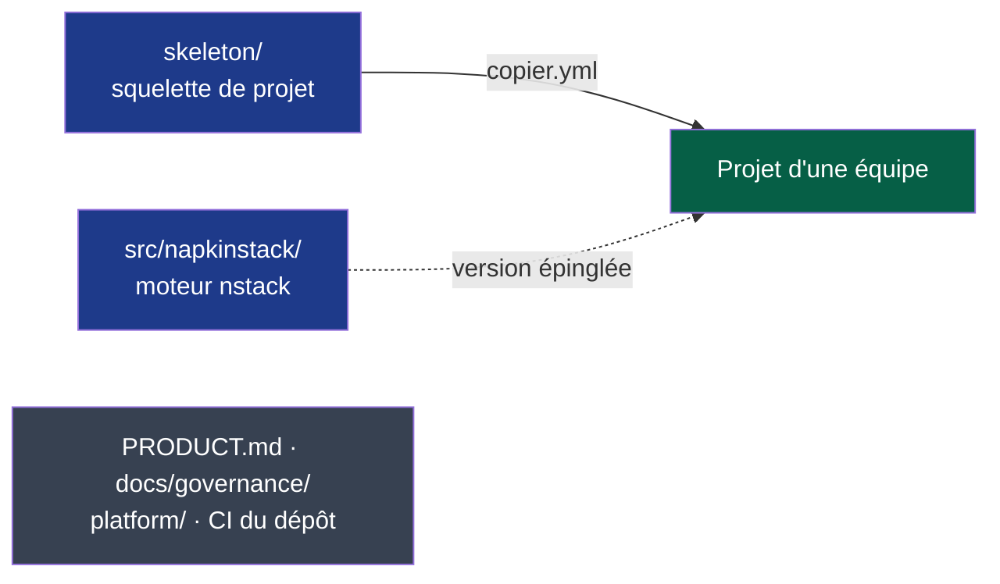

# Moteur NapkinStack v0.1.0 — plan d'implémentation

> **Emplacement :** `docs/governance/plans/`, contexte de travail du dépôt ; aucun dossier
> portant un nom d'outil (P2, P7).
>
> **Pour l'agent qui exécute :** exécuter chantier par chantier, tâche par tâche, en TDD.
> Les étapes utilisent des cases (`- [ ]`) pour le suivi. Un chantier reçoit son plan
> détaillé ici au moment de son lancement, nourri de ce que le précédent a appris : M1,
> M2a, M2b, M3, M3.1, M3.2, M4, M6 et M6.1 (faits), puis M5.

**Objectif :** publier `napkinstack` v0.1.0 sur PyPI, capable de créer un projet
(`nstack init`), de le mettre à jour (`nstack update`) et de le vérifier
(`nstack doctor`), puis s'en servir pour le projet pilote avant le 2026-10-31.

**Architecture :** un seul dépôt. Le moteur est un paquet Python (`src/napkinstack/`,
`uv_build`) ; le squelette de projet est l'unique gabarit Copier du dépôt
(`copier.yml`, `_subdirectory: skeleton`) ; le contexte de développement de NapkinStack
(`PRODUCT.md`, `docs/governance/`, CI du dépôt) reste à la racine et n'est jamais copié.

**Pile technique :** Python ≥ 3.12 géré par uv, PyYAML, Copier 9.18, pre-commit, GitHub
Actions.

**Spécification :** [PDR-0001](../../pdr/0001-creer-un-projet-et-recevoir-les-evolutions.md)
(accepté), [ADR-0001](../../adr/0001-adopter-copier-pour-generer-et-mettre-a-jour-les-projets.md)
(accepté), [ADR-0002](../../adr/0002-distribuer-napkinstack-sur-pypi.md) (proposé).

## Contraintes globales

- uv est le seul prérequis ; aucune stack imposée aux modules (PDR-0001 R5, `PRODUCT.md` P1).
- Une version couvre moteur et squelette ; le projet épingle la sienne (PDR-0001 R2, R3).
- Copier piloté par `run_copy` et `run_update`, jamais `unsafe` ; un seul gabarit dans ce
  dépôt (ADR-0001).
- Paquet `napkinstack`, commande `nstack`, `uv_build`, version dans `pyproject.toml` égale
  au tag `vX.Y.Z` (ADR-0002).
- Actions tierces autorisées : `astral-sh/setup-uv` et `pypa/gh-action-pypi-publish`,
  épinglées par SHA (ADR-0002).
- Hooks et CI exécutent la même configuration (P3) ; tout check a un test qui prouve qu'il
  échoue (P5) ; tout échec nomme la règle, l'endroit et l'action (P6).
- Un chantier = une PR ; budget de revue 400 lignes et 15 fichiers, `hors-budget` justifié
  pour une migration mécanique.
- Identité : commits `fc <328672623+napkinstack-admin@users.noreply.github.com>`, push
  par l'alias SSH `github-napkinstack`, API GitHub par `gh-napkinstack`.

---

## Feuille de route


**Légende** — vert : fait · bleu : en cours · gris : chantier sans action humaine
requise · orange : actions humaines nécessaires (réglages, comptes, projet pilote).

| Chantier | Livrable vérifiable | Traite | Actions humaines |
|---|---|---|---|
| **M1 — Moteur empaqueté** | `uv run nstack fitness`, `skills`, `new-module`, `pr-scope` fonctionnent sur la racine donnée ; CI du dépôt sur uv ; `Makefile` racine supprimé | C1 (partiel), D21, D18 | Autoriser `astral-sh/setup-uv` dans l'organisation, avant la PR |
| **M2a — Squelette Copier** | `copier.yml` + `skeleton/` ; un projet généré passe ses propres checks dans la CI du dépôt ; refus des fonctions « unsafe » testé | PDR-0001 R6, ADR-0001 | — |
| **M2b — `init`, `update`** | Commandes `nstack init` et `nstack update` ; mises à jour testées (critères 1, 4 à 7) ; erreurs de Copier traduites (P6) | PDR-0001, ADR-0001 | — |
| **M3 — `doctor`** | Contrôle du poste et des réglages GitHub en lecture seule ; checklist affichée par `init` (critère 2) | PDR-0001 | — |
| **M3.1 — Dépôts privés** | `doctor` suit la visibilité du dépôt ; prérequis et offres GitHub écrits dans le README du squelette ; avenant à PDR-0001 | Projet pilote privé | — |
| **M3.2 — Alignement de la documentation** | Positionnement « framework de travail » et vocabulaire cohérents partout, schémas légendés, renvois morts D6 corrigés et gardés par un test | Cohérence (demande du mainteneur), D6 | Description du dépôt sur GitHub |
| **M4 — Module sans stack imposée** | Gabarit de module aux commandes à déclarer ; owner `org/équipe` accepté ; CODEOWNERS à jour (critère 3) | D22, D19 | — |
| **M6 — Documentation produit** | README réécrit avec les schémas du PDR ; CONTRIBUTING ; `docs/os/09-plateforme.md` ; C1, C2, C4, C5 replanifiés | PDR-0001 (impacts) | Relecture |
| **M6.1 — Fiabilité des contrôles hérités** | Chaque contrôle M, B, S et P a un test qui prouve qu'il échoue ; M1 implémenté ; message P6 sur tout manifest illisible | D4, D5, D8 (P5 non négociable avant publication) | — |
| **M5 — Publication v0.1.0** | Workflow de publication sur tag ; `uv tool install napkinstack` sur poste neuf ; attestation visible sur PyPI | ADR-0002 | Choisir la licence ; autoriser `pypa/gh-action-pypi-publish` ; compte PyPI NapkinStack (2FA) et éditeur de confiance ; environnement GitHub `pypi` ; approuver la publication |
| **Projet pilote** | `nstack init` chronométré, puis une mise à jour fusionnée | Critère de succès de PDR-0001 | Stack, équipe, dépôt ; session d'init |

---

## M1 — Moteur empaqueté (fait, #13)

**Fichiers :**

- Créer : `pyproject.toml`, `uv.lock` (généré par `uv lock`), `src/napkinstack/__init__.py`,
  `src/napkinstack/cli.py`, `src/napkinstack/fitness/__init__.py`
- Déplacer (`git mv`) :
  - `platform/fitness/manifests.py` → `src/napkinstack/fitness/manifests.py`
  - `platform/fitness/boundaries.py` → `src/napkinstack/fitness/boundaries.py`
  - `platform/fitness/pr_scope.sh` → `src/napkinstack/fitness/pr_scope.sh`
  - `platform/sync_skills.py` → `src/napkinstack/skills.py`
  - `platform/scaffold/new-module.sh` → `src/napkinstack/scaffold/new-module.sh`
  - `platform/templates/module/` → `src/napkinstack/scaffold/templates/module/`
- Supprimer : `Makefile`, `requirements-dev.txt`, `platform/fitness/requirements.txt`
- Modifier : `.github/workflows/governance.yml`, `.github/dependabot.yml`,
  `.github/CODEOWNERS`, `platform/MANIFEST.yaml`, `platform/README.md`,
  `platform/docs/runbook.md`, `platform/skills.yaml`, `platform/tooling-profile.md`,
  `README.md`, `CONTRIBUTING.md`, `modules/README.md`,
  `docs/governance/chantiers.md` (DoD, D18, D21, C1)

**Interfaces produites (utilisées par M2 à M5) :**

- `napkinstack.fitness.manifests.run(root: Path) -> int`
- `napkinstack.fitness.boundaries.run(root: Path) -> int`
- `napkinstack.skills.run(root: Path, check_only: bool = False) -> int`
- `napkinstack.cli.main(argv: list[str] | None = None) -> int`
- Commande : `nstack {manifests,boundaries,skills,fitness,new-module,pr-scope} [--root RACINE]`

### Tâche 0 — Action humaine : autoriser `astral-sh/setup-uv`

- [x] Le mainteneur ouvre https://github.com/organizations/NapkinStack/settings/actions,
  section **Policies**, champ **Allow specified actions and reusable workflows**, ajoute
  `astral-sh/setup-uv@*` et enregistre. L'épinglage par SHA reste obligatoire.
- [x] Vérifier : `gh-napkinstack api repos/NapkinStack/engineering-os/actions/permissions/selected-actions --jq .patterns_allowed`
  Attendu : `["astral-sh/setup-uv@*"]`

### Tâche 1 — Paquet et commande `nstack --version`

- [x] **Étape 1 : écrire le test qui échoue.** En tête de `platform/tests/run.sh`, juste après
  la ligne `cd …`, ajouter `REPO=$(pwd)`, puis remplacer le bloc « les scripts compilent » par :

```bash
echo "→ nstack : la commande répond et affiche sa version"
uv run nstack --version | grep -qE '^nstack [0-9]+\.[0-9]+' \
  || { echo "ÉCHEC : nstack --version ne répond pas."; exit 1; }
```

- [x] **Étape 2 : le voir échouer.** `bash platform/tests/run.sh` — attendu : échec, aucun
  `pyproject.toml`.
- [x] **Étape 3 : implémenter.** Créer `pyproject.toml` :

```toml
[project]
name = "napkinstack"
version = "0.1.0.dev0"
description = "Cadre de travail pour faire travailler plusieurs équipes et leurs agents sur un même dépôt : modules, contrats, garde-fous en CI."
requires-python = ">=3.12"
dependencies = ["PyYAML>=6.0"]

[project.scripts]
nstack = "napkinstack.cli:main"

[dependency-groups]
dev = ["pre-commit==4.6.2"]

[tool.uv]
required-version = ">=0.12.14,<0.13"

[build-system]
requires = ["uv_build>=0.12.14,<0.13"]
build-backend = "uv_build"
```

Créer `src/napkinstack/__init__.py` :

```python
"""NapkinStack — moteur : fitness functions, skills et scaffold de module."""

from importlib.metadata import version

__version__ = version("napkinstack")
```

Créer `src/napkinstack/cli.py` :

```python
"""Point d'entrée unique `nstack` (chantier C1, PDR-0001)."""

from __future__ import annotations

import argparse
from pathlib import Path

from napkinstack import __version__


def _root(value: str) -> Path:
    root = Path(value).resolve()
    if not root.is_dir():
        raise argparse.ArgumentTypeError(f"racine introuvable : {value}")
    return root


def build_parser() -> argparse.ArgumentParser:
    parser = argparse.ArgumentParser(prog="nstack", description="Moteur NapkinStack.")
    parser.add_argument("--version", action="version", version=f"nstack {__version__}")
    parser.add_subparsers(dest="command", required=True, metavar="commande")
    return parser


def main(argv: list[str] | None = None) -> int:
    args = build_parser().parse_args(argv)
    return args.func(args)
```

- [x] **Étape 4 : le voir passer.** `uv lock && bash platform/tests/run.sh` — attendu : le
  bloc « nstack : la commande répond » passe (les blocs suivants sont traités aux tâches
  suivantes et passent encore avec les anciens chemins).
- [x] **Étape 5 : commit.** `git add pyproject.toml uv.lock src/ platform/tests/run.sh && git commit -m "M1 — paquet napkinstack et commande nstack"`

### Tâche 2 — `nstack manifests` et `nstack boundaries` sur une racine donnée

- [x] **Étape 1 : tests qui échouent.** Dans `platform/tests/run.sh`, remplacer les appels :

```bash
echo "→ manifests du dépôt conformes"
uv run nstack manifests --root .

echo "→ frontières du dépôt conformes"
uv run nstack boundaries --root .

echo "→ un manifest invalide DOIT échouer"
TMP=$(mktemp -d)
mkdir -p "$TMP/modules/cassé"
printf 'module:\n  name: cassé\n' > "$TMP/modules/cassé/MANIFEST.yaml"
if OUT=$(cd / && uv run --project "$REPO" nstack manifests --root "$TMP" 2>&1); then
  echo "ÉCHEC : un manifest incomplet est passé au vert."; rm -rf "$TMP"; exit 1
fi
echo "$OUT" | grep -qF "[M2] cassé" \
  || { echo "ÉCHEC : message M2 attendu absent."; echo "$OUT"; rm -rf "$TMP"; exit 1; }
rm -rf "$TMP"
```

- [x] **Étape 2 : les voir échouer.** Attendu : `invalid choice: 'manifests'`.
- [x] **Étape 3 : implémenter.**
  - `git mv platform/fitness/manifests.py platform/fitness/boundaries.py src/napkinstack/fitness/`
    et créer `src/napkinstack/fitness/__init__.py` vide.
  - Dans les deux fichiers : remplacer le bloc `try: import yaml … except ImportError: sys.exit(…)`
    par `import yaml` ; remplacer `def main() -> int:` et sa première ligne
    `root = Path(sys.argv[1] if len(sys.argv) > 1 else ".").resolve()` par :

```python
def run(root: Path) -> int:
    failures.clear()
    warnings.clear()
```

  - Remplacer le bloc final des deux fichiers par :

```python
if __name__ == "__main__":
    sys.exit(run(Path(sys.argv[1] if len(sys.argv) > 1 else ".").resolve()))
```

  - Remplacer la ligne `Usage :` des docstrings par `Usage :  nstack manifests [--root RACINE]`
    et `Usage :  nstack boundaries [--root RACINE]`.
  - Dans `cli.py`, ajouter les imports et les sous-commandes :

```python
from napkinstack.fitness import boundaries, manifests


def _add(sub, name: str, help_: str, func) -> argparse.ArgumentParser:
    parser = sub.add_parser(name, help=help_)
    parser.add_argument("--root", type=_root, default=Path.cwd(), help="racine du projet (défaut : dossier courant)")
    parser.set_defaults(func=func)
    return parser
```

    et remplacer `parser.add_subparsers(...)` dans `build_parser` par :

```python
    sub = parser.add_subparsers(dest="command", required=True, metavar="commande")
    _add(sub, "manifests", "manifests, cycles de vie, dépréciations (M1–M9)",
         lambda a: manifests.run(a.root))
    _add(sub, "boundaries", "graphe déclaré contre graphe réel (B1–B5)",
         lambda a: boundaries.run(a.root))
```

- [x] **Étape 4 : les voir passer.** `bash platform/tests/run.sh`
- [x] **Étape 5 : commit.** `git add -A src platform && git commit -m "M1 — nstack manifests et boundaries sur la racine donnée"`

### Tâche 3 — `nstack skills` sur une racine donnée (D21)

- [x] **Étape 1 : tests qui échouent.** Dans `platform/tests/run.sh`, bloc skills :
  la fixture ne copie plus le script, et un test prouve que la racine est respectée depuis
  n'importe quel dossier :

```bash
SK=$(mktemp -d)
trap 'rm -rf "$SK"' EXIT
mkdir -p "$SK/platform"
cp platform/skills.yaml "$SK/platform/"
cp -r playbooks "$SK/"
nstack_sk() { (cd / && uv run --project "$REPO" nstack skills --root "$SK" "$@"); }

echo "→ skills : la racine donnée est analysée, quel que soit le dossier courant (D21)"
if (cd / && uv run --project "$REPO" nstack skills --check --root / >/dev/null 2>&1); then
  echo "ÉCHEC : racine sans skills.yaml acceptée."; exit 1
fi
nstack_sk --check >/dev/null || { echo "ÉCHEC : la racine donnée n'est pas analysée."; exit 1; }
```

  puis, dans tous les blocs skills, remplacer `python3 "$SK/platform/sync_skills.py" --check`
  par `nstack_sk --check` et `python3 "$SK/platform/sync_skills.py"` par `nstack_sk`.

- [x] **Étape 2 : les voir échouer.** Attendu : `invalid choice: 'skills'`.
- [x] **Étape 3 : implémenter.** `git mv platform/sync_skills.py src/napkinstack/skills.py`,
  puis remplacer son contenu par :

```python
"""
Génère les skills Claude Code à partir des playbooks.

Les playbooks sont la SOURCE DE VÉRITÉ (docs/os/06-decisions.md §9). Les skills en
sont dérivées : fichiers générés, jamais édités à la main, jamais commités.

Contrôles (mode --check, exécuté en CI) :
  S1  chaque playbook a une entrée dans platform/skills.yaml
  S2  chaque entrée pointe vers un playbook existant
  S3  les skills générées correspondent aux playbooks actuels
  S4  nom et description conformes à la spécification Agent Skills

S3 ne s'applique que si .claude/skills/ existe. Les skills sont gitignorées : un clone
vierge, donc la CI, n'en a aucune, et aucune ne peut y être désynchronisée.

Usage :
    nstack skills [--root RACINE]            # génère .claude/skills/
    nstack skills --check [--root RACINE]    # vérifie sans écrire
"""

from __future__ import annotations

import hashlib
import re
from pathlib import Path

import yaml

SKILL_NAME = re.compile(r"[a-z0-9]+(-[a-z0-9]+)*")
BANNER = (
    "<!-- GÉNÉRÉ depuis {source} par nstack skills — NE PAS ÉDITER.\n"
    "     Modifier le playbook, puis relancer `nstack skills`. -->"
)


def normalise(text: str) -> str:
    """Description sur une seule ligne, pour un frontmatter YAML propre."""
    return " ".join(text.split())


def build(root: Path, name: str, entry: dict) -> tuple[Path, str]:
    body = (root / entry["source"]).read_text(encoding="utf-8")
    # Sérialisé, jamais concaténé : « : » ou « # » dans une description casserait le YAML.
    frontmatter = yaml.safe_dump(
        {"name": name, "description": normalise(entry["description"])},
        allow_unicode=True, sort_keys=False, width=float("inf"),
    )
    content = "---\n" + frontmatter + "---\n\n" + BANNER.format(source=entry["source"]) + "\n\n" + body
    return root / ".claude" / "skills" / name / "SKILL.md", content


def digest(text: str) -> str:
    return hashlib.sha256(text.encode("utf-8")).hexdigest()[:12]


def run(root: Path, check_only: bool = False) -> int:
    map_file = root / "platform" / "skills.yaml"
    playbook_dir = root / "playbooks"
    skill_dir = root / ".claude" / "skills"

    if not map_file.is_file():
        print(f"ÉCHEC : {map_file.relative_to(root)} introuvable dans {root}.")
        return 1

    mapping = (yaml.safe_load(map_file.read_text(encoding="utf-8")) or {}).get("skills") or {}
    failures: list[str] = []

    declared = {Path(e["source"]).name for e in mapping.values() if e.get("source")}
    for playbook in sorted(playbook_dir.glob("*.md")):
        if playbook.name not in declared:
            failures.append(
                f"[S1] {playbook.relative_to(root)} n'a pas d'entrée dans "
                f"platform/skills.yaml.\n      Ajouter une description, ou retirer le "
                f"playbook s'il ne sert plus (docs/os/10-mesure.md §6)."
            )

    for name, entry in mapping.items():
        if not (root / entry.get("source", "")).is_file():
            failures.append(f"[S2] skill '{name}' : source introuvable ({entry.get('source')})")
        if not normalise(entry.get("description", "")):
            failures.append(f"[S2] skill '{name}' : description vide")

    for name, entry in mapping.items():
        if len(name) > 64 or not SKILL_NAME.fullmatch(name):
            failures.append(
                f"[S4] skill '{name}' : nom invalide. 1 à 64 caractères, a-z, 0-9 et "
                "tirets simples, sans tiret au début ni à la fin."
            )
        if len(normalise(entry.get("description", ""))) > 1024:
            failures.append(f"[S4] skill '{name}' : description de plus de 1024 caractères")

    if failures:
        for failure in failures:
            print(f"  ÉCHEC {failure}")
        return 1

    if check_only and not skill_dir.is_dir():
        print(f"Skills : S1, S2 et S4 conformes. S3 non applicable : "
              f"{skill_dir.relative_to(root)}/ absent, aucune skill générée ici.")
        return 0

    stale: list[str] = []
    written = 0
    for name, entry in sorted(mapping.items()):
        path, content = build(root, name, entry)
        if check_only:
            if not path.is_file():
                stale.append(f"[S3] skill '{name}' absente de .claude/skills/")
            elif digest(path.read_text(encoding="utf-8")) != digest(content):
                stale.append(f"[S3] skill '{name}' désynchronisée de {entry['source']}")
        else:
            path.parent.mkdir(parents=True, exist_ok=True)
            path.write_text(content, encoding="utf-8")
            written += 1

    if check_only:
        if stale:
            for item in stale:
                print(f"  ÉCHEC {item}")
            print("\nLancer `nstack skills` pour régénérer.")
            return 1
        print(f"Skills : {len(mapping)} synchronisées avec les playbooks.")
        return 0

    print(f"Skills générées dans .claude/skills/ : {written}")
    for name in sorted(mapping):
        print(f"  - {name}")
    print("\nElles se déclenchent seules selon leur description ; l'agent peut aussi")
    print("les invoquer par leur nom. Le kernel reste dans AGENTS.md.")
    return 0
```

  Dans `cli.py`, importer `skills` et ajouter :

```python
    sk = _add(sub, "skills", "génère ou vérifie les skills (S1–S4)",
              lambda a: skills.run(a.root, check_only=a.check))
    sk.add_argument("--check", action="store_true", help="vérifier sans écrire")
```

  Dans `platform/skills.yaml`, ligne 12 : `make skills-check` → `nstack skills --check`.

- [x] **Étape 4 : les voir passer.** `bash platform/tests/run.sh`
- [x] **Étape 5 : commit.** `git add -A src platform && git commit -m "M1 — nstack skills sur la racine donnée (D21)"`

### Tâche 4 — `nstack new-module`, `nstack pr-scope` et `nstack fitness`

- [x] **Étape 1 : tests qui échouent.** Bloc scaffold de `platform/tests/run.sh` :

```bash
echo "→ scaffold : le module généré a un MANIFEST.yaml valide, aux valeurs substituées"
mkdir -p "$SC/.github" "$SC/modules"
cp .github/CODEOWNERS "$SC/.github/"
uv run nstack new-module demo equipe-demo standard --root "$SC" >/dev/null
```

  (le reste du bloc est inchangé, sauf `python3 platform/fitness/manifests.py "$SC"` qui
  devient `uv run nstack manifests --root "$SC"`), puis ajouter :

```bash
echo "→ nstack fitness : échoue si l'un des trois contrôles échoue"
FT=$(mktemp -d)
mkdir -p "$FT/platform" "$FT/playbooks"
printf 'skills: {}\n' > "$FT/platform/skills.yaml"
printf '# orphelin\n' > "$FT/playbooks/orphelin.md"
if OUT=$(uv run nstack fitness --root "$FT" 2>&1); then
  echo "ÉCHEC : un playbook sans entrée est passé au vert."; rm -rf "$FT"; exit 1
fi
echo "$OUT" | grep -qF "[S1]" || { echo "ÉCHEC : S1 attendu."; echo "$OUT"; rm -rf "$FT"; exit 1; }
rm -rf "$FT"
```

- [x] **Étape 2 : les voir échouer.** Attendu : `invalid choice: 'new-module'`.
- [x] **Étape 3 : implémenter.**
  - `git mv platform/scaffold/new-module.sh src/napkinstack/scaffold/new-module.sh`,
    `git mv platform/templates/module src/napkinstack/scaffold/templates/module`,
    `git mv platform/fitness/pr_scope.sh src/napkinstack/fitness/pr_scope.sh`.
  - Dans `new-module.sh`, remplacer `ROOT="$(cd "$(dirname "$0")/../.." && pwd)"` par
    `ROOT="${NSTACK_ROOT:?racine du projet requise (nstack new-module --root)}"` et
    `cp -r "$ROOT/platform/templates/module" "$DEST"` par
    `cp -r "$(cd "$(dirname "$0")" && pwd)/templates/module" "$DEST"` ; dans ses messages,
    `make fitness` → `nstack fitness` et `verbes standards : make check / test / run` →
    `verbes standards : section commands du MANIFEST`.
  - Dans `cli.py` :

```python
import os
import subprocess

PACKAGE = Path(__file__).resolve().parent


def _script(relative: str, *args: str, root: Path) -> int:
    env = {**os.environ, "NSTACK_ROOT": str(root)}
    return subprocess.run(["bash", str(PACKAGE / relative), *args], cwd=root, env=env).returncode


def _fitness(root: Path) -> int:
    results = [manifests.run(root), boundaries.run(root), skills.run(root, check_only=True)]
    return 1 if any(results) else 0
```

    et dans `build_parser` :

```python
    _add(sub, "fitness", "manifests + frontières + skills",
         lambda a: _fitness(a.root))
    nm = _add(sub, "new-module", "crée un module et ses garde-fous",
              lambda a: _script("scaffold/new-module.sh", a.name, a.owner, a.criticality, root=a.root))
    nm.add_argument("name")
    nm.add_argument("owner")
    nm.add_argument("criticality", choices=["prototype", "standard", "eleve", "critique"])
    ps = _add(sub, "pr-scope", "une PR = un module, budget de revue (P1–P2)",
              lambda a: _script("fitness/pr_scope.sh", a.base, root=a.root))
    ps.add_argument("--base", default="origin/main")
```

  - Dans `pr_scope.sh`, ajouter `uv\.lock` à la liste des fichiers de verrouillage exclus
    du budget : `(package-lock\.json|yarn\.lock|pnpm-lock\.yaml|Cargo\.lock|go\.sum|uv\.lock|\.generated\.|/generated/)`.
- [x] **Étape 4 : les voir passer.** `bash platform/tests/run.sh`
- [x] **Étape 5 : commit.** `git add -A src platform && git commit -m "M1 — nstack new-module, pr-scope et fitness"`

### Tâche 5 — CI, dépendances et tests sur uv

- [x] **Étape 1 : l'oracle reste dans le module.** `platform/tests/run.sh` ne bouge pas : M9
  exige un dossier `tests/` dans le module `platform` (criticité élevée). *Écart constaté à
  l'exécution : le déplacement vers `tests/run.sh` a été refusé par M9 lui-même.*
- [x] **Étape 2 : CI.** Dans `.github/workflows/governance.yml`, job `architecture` :
  remplacer `actions/setup-python`, `Dépendances` et les quatre étapes de checks par :

```yaml
      - uses: astral-sh/setup-uv@bec219d24cd3e171d82865faccec33120bb574f4 # v10.1.0

      - uses: actions/cache@55cc8345863c7cc4c66a329aec7e433d2d1c52a9 # v6.1.0
        with:
          path: ~/.cache/pre-commit
          key: pre-commit-${{ runner.os }}-${{ hashFiles('.pre-commit-config.yaml', 'uv.lock') }}

      - name: Dépendances
        run: uv sync --locked

      - name: Manifests, frontières, skills
        run: uv run nstack fitness --root .

      - name: Tests de la plateforme — chaque garde-fou prouve qu'il sait échouer
        run: uv run bash platform/tests/run.sh
```

  Job `scope` : `run: ./platform/fitness/pr_scope.sh "origin/$BASE_REF"` devient
  `run: bash src/napkinstack/fitness/pr_scope.sh "origin/$BASE_REF"`.
  Job `hooks` : remplacer `actions/setup-python` et `Dépendances` par
  `astral-sh/setup-uv` (même SHA) puis `run: uv sync --locked` ; clé de cache
  `hashFiles('.pre-commit-config.yaml', 'uv.lock')` ; les deux commandes deviennent
  `uv run pre-commit run --all-files --show-diff-on-failure` et
  `uv run pre-commit run gitleaks-historique --hook-stage manual --all-files`.
  Les trois noms de jobs ne changent pas : ce sont les checks obligatoires du ruleset.
- [x] **Étape 3 : Dependabot.** Dans `.github/dependabot.yml`, le bloc `pip` devient :

```yaml
  - package-ecosystem: uv
    directory: /
    schedule:
      interval: weekly
    cooldown:
      default-days: 7
    groups:
      uv:
        patterns: ["*"]
```

- [x] **Étape 4 : supprimer.** `git rm Makefile requirements-dev.txt platform/fitness/requirements.txt`
- [x] **Étape 5 : vérifier.** `uv run bash platform/tests/run.sh` vert ; `uv run pre-commit run --all-files`
  vert (zizmor et actionlint valident le workflow) ;
  `GITHUB_ACTIONS=true GITHUB_WORKFLOW=Gouvernance uv run bash platform/tests/run.sh` vert.
- [x] **Étape 6 : commit.** `git add -A && git commit -m "M1 — CI et dépendances sur uv"`

### Tâche 6 — Références et enveloppe du module `platform`

- [x] **Étape 1 : inventaire rouge.** Cette commande doit ne rien afficher à la fin de la
  tâche ; elle affiche aujourd'hui les références mortes :

```bash
git grep -n -E "platform/(fitness|sync_skills|scaffold|templates|tests)|\bmake (bootstrap|check|test|fitness|skills|skills-check|scaffold|ci)\b|requirements-dev\.txt" \
  -- ':!docs/governance/chantiers.md' ':!docs/governance/plans/' ':!docs/adr/' \
     ':!src/napkinstack/scaffold/templates/' ':!contracts/'
```

  Exclusions : historique des décisions et des chantiers ; gabarit de module et module
  `contracts/`, dont les `make` restent exacts tant que leurs Makefile existent (D22, M4).

- [x] **Étape 2 : corriger chaque occurrence.**
  - `README.md` : `make bootstrap` → `uv sync` ; `make scaffold NAME=x OWNER=team-y CRIT=standard`
    → `uv run nstack new-module x team-y standard` ; `make fitness` → `uv run nstack fitness` ;
    `make skills` → `uv run nstack skills` ; `make skills-check` → `uv run nstack skills --check` ;
    lignes `make check`, `make test`, `make ci` → une ligne « commandes de chaque module :
    section `commands` de son `MANIFEST.yaml` » ; `platform/fitness/boundaries.py` →
    `src/napkinstack/fitness/boundaries.py`.
  - `CONTRIBUTING.md` : `make fitness` → `uv run nstack fitness`.
  - `modules/README.md` : `make scaffold NAME=billing OWNER=team-revenue CRIT=standard` →
    `uv run nstack new-module billing team-revenue standard`.
  - `platform/README.md` : tableau « Contenu » vers `src/napkinstack/` ; blocs de commandes
    en `uv run nstack …`.
  - `platform/docs/runbook.md` : `make fitness` → `uv run nstack fitness`.
  - `.github/CODEOWNERS` ligne 2 : `platform/scaffold/new-module.sh` → `nstack new-module`.
  - `platform/MANIFEST.yaml`, section `commands` :

```yaml
commands:
  bootstrap: uv sync --locked
  check: uv run nstack fitness --root ..
  test: uv run bash tests/run.sh
  run: "echo 'non applicable'"
```

  - `platform/tooling-profile.md` : ligne « Exécution de commandes et de tests » →
    outil `uv`, décision `ADR-0002`.
  - `PRODUCT.md` §5 : l'oracle reste `platform/tests/run.sh`, désormais lancé par
    `uv run bash platform/tests/run.sh`.
  - `docs/governance/chantiers.md` : DoD `bash platform/tests/run.sh` →
    `uv run bash platform/tests/run.sh` ; D18 → « M1, uv » ; ajouter D21 → « M1 » ; en-tête de C1 :
    « Partiellement traité par M1 (commande `nstack`, Makefile racine supprimé) ».
- [x] **Étape 3 : inventaire vert.** La commande de l'étape 1 n'affiche plus rien.
- [x] **Étape 4 : vérification complète.** Fitness, `uv run bash platform/tests/run.sh` (local et
  GitHub simulé), hooks sur tous les fichiers, `pr-scope`, gitleaks, rejeu sur clone vierge.
- [x] **Étape 5 : commit, PR, merge.** `git add -A && git commit -m "M1 — références et enveloppe du module platform"` ;
  PR « M1 — Moteur empaqueté », label `hors-budget` (migration mécanique : déplacements de
  fichiers et `uv.lock`) ; merge après tests et validation.

---

## M2a — Squelette Copier (fait, #14)

> M2 est découpé le 2026-09-15. **M2a** extrait le squelette en gabarit Copier et prouve,
> dans la CI de ce dépôt, qu'un projet généré passe ses propres contrôles. **M2b** livre
> `nstack init` et `nstack update`, les scénarios des critères 1 et 4 à 7 et la traduction
> des erreurs de Copier (P6).

**Décisions du chantier** (faits vérifiés le 2026-09-15) :

| Sujet | Choix | Référence, fait vérifié |
|---|---|---|
| Gabarit | `copier.yml` à la racine, `_subdirectory: skeleton`, `_min_copier_version: "9.18"` ; `copier==9.18.2` dépendance du moteur | 9.18.2 est la dernière version sur PyPI. Essai : suffixe `.jinja` retiré au rendu, fichiers sans suffixe copiés tels quels (`${{ }}` intacts), modifications non commitées d'un gabarit local incluses avec `--vcs-ref HEAD` |
| Questions | `project_name`, `github_repo` (`org/nom`), `owner_team` (`org/équipe`) ; `validator` natif sur les deux dernières | Réponse invalide : sortie 1, `Validation error for question 'owner_team'` ; ferme l'entrée qui cause D19 |
| Version du projet | `_commit` du fichier de réponses standard `.copier-answers.yml` | `_commit` = `git describe --tags --always` (`copier/_template.py`) ; essai sur un tag `v0.1.0` : `napkinstack==0.1.0` rendu |
| Moteur dans la CI du projet | `uv tool install "napkinstack==<_commit sans v>" --with-executables-from pre-commit`, version lue par `yq` ; aucun workflow en `.jinja` | `yq` 4.53 préinstallé sur `ubuntu-24.04` (runner-images) ; `setup-uv` ajoute `~/.local/bin` au PATH (`src/setup-uv.ts`) ; ADR-0001 règle 5 |
| pre-commit | Passe du groupe `dev` aux dépendances du moteur, même épinglage | Une version de NapkinStack fixe aussi celle de pre-commit (R2, R3) ; option `--with-executables-from` d'uv 0.12 |
| Configuration des skills | `.nstack/skills.yaml` ; racine sans `playbooks/` ni correspondance : « non applicable » | Configuration d'outil dans un dossier à son nom, comme `.github/` ; marque en périphérie (P7) |
| Hooks du squelette | `.pre-commit-config.yaml` et `.yamllint.yaml` identiques à la racine, test bloquant | Le dépôt reste le premier utilisateur de ses règles (`PRODUCT.md` §1) |
| Dependabot | `directories` et `group-by: dependency-name` : une PR par dépendance, qui met à jour la racine et `skeleton/` ensemble | Changelog GitHub du 2026-02-24 : sans `group-by`, une PR par répertoire, qui casserait le test d'identité. github-actions lit tel quel un répertoire autre que `/` (`dependabot-core`, `file_fetcher.rb`), d'où `/skeleton/.github/workflows`. Schéma accepté par check-jsonschema 0.38.0 |
| Refus « unsafe » | Test : un gabarit avec `_tasks` sort en code 4 et ne crée rien | Constaté sur Copier 9.18.2 ; règle à automatiser d'ADR-0001 |

**Non vérifiable dans ce chantier :** l'installation depuis PyPI dans la CI d'un projet
généré. Elle l'est à la première publication (M5), puis au projet pilote.

**Fichiers :**

- Déplacer (`git mv`) vers `skeleton/` : `AGENTS.md`, `CONTRIBUTING.md`, `playbooks/`,
  `docs/os/`, `docs/architecture/.gitkeep`, `docs/runbooks/.gitkeep`, `modules/`,
  `contracts/` (`MANIFEST.yaml` devient `MANIFEST.yaml.jinja`),
  `.github/workflows/module-checks.yml` ; `platform/skills.yaml` →
  `skeleton/.nstack/skills.yaml` ; `platform/tooling-profile.md` →
  `skeleton/docs/tooling-profile.md` ; `README.md` → `skeleton/README.md.jinja`.
- Copier vers `skeleton/` (deux publics, deux fichiers) : `.pre-commit-config.yaml`,
  `.yamllint.yaml`, `.gitignore`, `SECURITY.md`, `.github/pull_request_template.md`,
  `.github/ISSUE_TEMPLATE/0*.yml`, `docs/adr/README.md`, `docs/adr/_TEMPLATE.md`,
  `docs/pdr/README.md`, `docs/pdr/_TEMPLATE.md`. Les copies de la racine des formulaires
  et du modèle de PR restent des copies de référence, relues à M6.
- Créer : `copier.yml` ; `skeleton/.github/CODEOWNERS.jinja`,
  `skeleton/.github/ISSUE_TEMPLATE/config.yml.jinja`,
  `skeleton/{{ _copier_conf.answers_file }}.jinja`, `skeleton/.github/workflows/governance.yml`,
  `skeleton/.github/dependabot.yml` ; à la racine, `README.md`, `AGENTS.md` et
  `CONTRIBUTING.md` courts.
- Modifier : `src/napkinstack/skills.py`, `platform/tests/run.sh`, `pyproject.toml`,
  `uv.lock`, `.github/CODEOWNERS`, `.github/dependabot.yml`, `PRODUCT.md`, `SECURITY.md`,
  `platform/README.md`, `docs/adr/README.md`, `docs/pdr/README.md`,
  `docs/governance/chantiers.md`, `docs/governance/backlog-automatisation.md`,
  `docs/governance/revues.md`.

**Interfaces produites (utilisées par M2b à M5) :**

- `napkinstack.skills.MAPPING == Path(".nstack/skills.yaml")` ; `skills.run(root, check_only)`
  rend 0 sur une racine sans `playbooks/` ni correspondance.
- Gabarit : `copier copy --vcs-ref <réf> -d project_name=… -d github_repo=org/nom
  -d owner_team=org/équipe <source> <destination>` ; réponses et version dans
  `.copier-answers.yml` (`_commit`, `_src_path`).
- CI d'un projet : jobs `Fitness functions`, `Périmètre et budget de revue`,
  `Hooks et secrets`, mêmes noms que dans ce dépôt, donc même checklist de ruleset.

### Tâche 1 — Skills configurées dans `.nstack/`, playbooks dans le squelette

- [x] **Étape 1 : déplacer.**

```bash
mkdir -p skeleton/.nstack
git mv playbooks skeleton/playbooks
git mv platform/skills.yaml skeleton/.nstack/skills.yaml
```

- [x] **Étape 2 : tests qui échouent.** Dans `platform/tests/run.sh` :
  - fixture des skills : `mkdir -p "$SK/platform"`, `cp platform/skills.yaml "$SK/platform/"`
    et `cp -r playbooks "$SK/"` deviennent `mkdir -p "$SK/.nstack"`,
    `cp skeleton/.nstack/skills.yaml "$SK/.nstack/"` et `cp -r skeleton/playbooks "$SK/"` ;
  - bloc D21 : supprimer le cas `--root /` (quatre lignes `if … fi`) ; garder la ligne
    `nstack_sk --check` ; ajouter après elle :

```bash
echo "→ skills : une racine sans playbooks ni correspondance n'est pas concernée"
mkdir -p "$SK/vide"
if ! OUT=$(cd / && uv run --project "$REPO" nstack skills --check --root "$SK/vide" 2>&1); then
  echo "ÉCHEC : une racine sans playbooks est refusée."; echo "$OUT"; exit 1
fi
echo "$OUT" | grep -qF "Skills : non applicable" \
  || { echo "ÉCHEC : racine non concernée sans le dire."; echo "$OUT"; exit 1; }

echo "→ skills : des playbooks sans .nstack/skills.yaml DOIVENT échouer (S1)"
mkdir -p "$SK/vide/playbooks"
printf '# orphelin\n' > "$SK/vide/playbooks/orphelin.md"
if OUT=$(cd / && uv run --project "$REPO" nstack skills --check --root "$SK/vide" 2>&1); then
  echo "ÉCHEC : des playbooks sans correspondance sont passés au vert."; exit 1
fi
echo "$OUT" | grep -qF "[S1] .nstack/skills.yaml introuvable" \
  || { echo "ÉCHEC : message S1 attendu absent."; echo "$OUT"; exit 1; }
```

  - frontmatter : `root / "platform/skills.yaml"` → `root / ".nstack/skills.yaml"` ;
    `cp playbooks/tests.md` → `cp skeleton/playbooks/tests.md` ;
  - `skill_tests_modifiee` : `cp platform/skills.yaml "$SK/platform/"` →
    `cp skeleton/.nstack/skills.yaml "$SK/.nstack/"`, et `"$SK/platform/skills.yaml"` →
    `"$SK/.nstack/skills.yaml"` ;
  - `nstack fitness` : `mkdir -p "$FT/platform" "$FT/playbooks"` →
    `mkdir -p "$FT/.nstack" "$FT/playbooks"`, et `"$FT/platform/skills.yaml"` →
    `"$FT/.nstack/skills.yaml"`.
- [x] **Étape 3 : voir échouer.** `uv run bash platform/tests/run.sh` — attendu :
  `ÉCHEC : la racine donnée n'est pas analysée.` (le moteur cherche encore
  `platform/skills.yaml`).
- [x] **Étape 4 : implémenter.** Dans `src/napkinstack/skills.py` : docstring,
  `(platform/tooling-profile.md)` → `(docs/tooling-profile.md)`, `S1  chaque playbook a une
  entrée dans .nstack/skills.yaml`, et après le paragraphe S3 : « Une racine sans playbooks/
  ni .nstack/skills.yaml, comme le dépôt NapkinStack lui-même, n'est pas concernée. » Ajouter
  la constante `MAPPING = Path(".nstack") / "skills.yaml"` après `BANNER`, puis remplacer le
  début de `run` :

```python
def run(root: Path, check_only: bool = False) -> int:
    map_file = root / MAPPING
    playbook_dir = root / "playbooks"
    skill_dir = root / ".claude" / "skills"

    if not map_file.is_file():
        if not playbook_dir.is_dir():
            print(f"Skills : non applicable, ni playbooks/ ni {MAPPING} dans {root}.")
            return 0
        print(f"  ÉCHEC [S1] {MAPPING} introuvable dans {root} : aucun playbook n'a d'entrée.\n"
              f"      Créer {MAPPING}, une entrée par playbook (source, description).")
        return 1
```

  Message S1 : `f"platform/skills.yaml.\n      Ajouter …"` → `f"{MAPPING}.\n      Ajouter …"`.
- [x] **Étape 5 : voir passer.** `uv run bash platform/tests/run.sh` vert ;
  `uv run nstack fitness --root .` affiche `Skills : non applicable`.
- [x] **Étape 6 : commit.** `git add -A && git commit -m "M2a — skills configurées dans .nstack/, playbooks dans le squelette"`

### Tâche 2 — Gabarit Copier : réponses rendues, contexte NapkinStack absent

- [x] **Étape 1 : dépendance.** `pyproject.toml` :
  `dependencies = ["PyYAML>=6.0", "copier==9.18.2"]`, puis `uv lock`.
- [x] **Étape 2 : tests qui échouent.** À la fin de `platform/tests/run.sh`, avant
  `echo "Tests plateforme : OK"` :

```bash
# Squelette : projets générés depuis l'arbre de travail, modifications non commitées
# comprises, jamais depuis GitHub.
GN=$(mktemp -d)
trap 'rm -rf "$SK" "$SC" "$HK" "$GN"' EXIT
generer() {  # $1 = gabarit, $2 = destination, puis les options -d de Copier
  local gabarit=$1 destination=$2; shift 2
  copier copy --quiet --defaults --vcs-ref HEAD "$@" "$gabarit" "$destination"
}
REPONSES=(-d "project_name=Projet démo" -d github_repo=acme/demo -d owner_team=acme/plateforme)
PROJET="$GN/projet"

echo "→ squelette : le projet généré porte les réponses, sans fichier de gabarit résiduel"
if ! OUT=$(generer "$REPO" "$PROJET" "${REPONSES[@]}" 2>&1); then
  echo "ÉCHEC : la génération du projet a échoué."; echo "$OUT"; exit 1
fi
RESIDUS=$(find "$PROJET" -name '*.jinja')
[ -z "$RESIDUS" ] || { echo "ÉCHEC : fichiers de gabarit copiés tels quels :"; echo "$RESIDUS"; exit 1; }
for attendu in ".github/CODEOWNERS|@acme/plateforme" \
               ".github/ISSUE_TEMPLATE/config.yml|https://github.com/acme/demo/discussions" \
               "contracts/MANIFEST.yaml|owner: acme/plateforme" \
               "README.md|# Projet démo" \
               ".copier-answers.yml|owner_team: acme/plateforme"; do
  fichier=${attendu%%|*}; texte=${attendu#*|}
  grep -qF -- "$texte" "$PROJET/$fichier" 2>/dev/null \
    || { echo "ÉCHEC : $fichier ne contient pas « $texte »."; exit 1; }
done

echo "→ squelette : le contexte de développement de NapkinStack n'est jamais copié (R6)"
for absent in PRODUCT.md docs/governance platform src pyproject.toml uv.lock copier.yml skeleton; do
  [ ! -e "$PROJET/$absent" ] \
    || { echo "ÉCHEC : $absent copié dans le projet généré (PDR-0001 R6). Le retirer de skeleton/."; exit 1; }
done

echo "→ squelette : le projet généré passe nstack fitness, playbooks compris"
if ! OUT=$(cd / && uv run --project "$REPO" nstack fitness --root "$PROJET" 2>&1); then
  echo "ÉCHEC : le projet généré ne passe pas nstack fitness."; echo "$OUT"; exit 1
fi
echo "$OUT" | grep -qF "Skills : S1, S2 et S4 conformes" \
  || { echo "ÉCHEC : skills non vérifiées dans le projet généré."; echo "$OUT"; exit 1; }

echo "→ squelette : un dépôt ou une équipe sans organisation DOIT être refusé"
for question in github_repo owner_team; do
  if [ "$question" = github_repo ]; then
    reponses=(-d project_name=x -d github_repo=demo -d owner_team=acme/plateforme)
  else
    reponses=(-d project_name=x -d github_repo=acme/demo -d owner_team=plateforme)
  fi
  if OUT=$(generer "$REPO" "$GN/refus-$question" "${reponses[@]}" 2>&1); then
    echo "ÉCHEC : $question sans « / » accepté."; exit 1
  fi
  echo "$OUT" | grep -qF "Validation error for question '$question'" \
    || { echo "ÉCHEC : refus de $question sans le message du validateur."; echo "$OUT"; exit 1; }
done

echo "→ squelette : un gabarit à fonction « unsafe » DOIT être refusé, sans rien créer (ADR-0001)"
UNSAFE="$GN/gabarit-unsafe"
mkdir -p "$UNSAFE" && cp -r copier.yml skeleton "$UNSAFE/"
printf '\n_tasks:\n  - "touch execute"\n' >> "$UNSAFE/copier.yml"
git "${GIT_ID[@]}" init -q "$UNSAFE"
git -C "$UNSAFE" add -A
git "${GIT_ID[@]}" -C "$UNSAFE" commit -q --no-verify -m unsafe
CODE=0
OUT=$(generer "$UNSAFE" "$GN/unsafe" "${REPONSES[@]}" 2>&1) || CODE=$?
[ "$CODE" -eq 4 ] || { echo "ÉCHEC : gabarit unsafe non refusé (code $CODE, 4 attendu)."; echo "$OUT"; exit 1; }
echo "$OUT" | grep -qF "potentially unsafe feature: tasks" \
  || { echo "ÉCHEC : refus sans le message de Copier."; echo "$OUT"; exit 1; }
[ ! -e "$GN/unsafe" ] || { echo "ÉCHEC : le gabarit refusé a créé des fichiers."; exit 1; }
```

- [x] **Étape 3 : voir échouer.** Attendu : sans `copier.yml`, Copier copie tout le dépôt,
  puis `ÉCHEC : .github/CODEOWNERS ne contient pas « @acme/plateforme ».`
- [x] **Étape 4 : gabarit.** Créer `copier.yml` :

```yaml
# Gabarit Copier du squelette de projet (ADR-0001) : le seul de ce dépôt.
# Versions = tags du dépôt (PEP 440). Aucune fonction « unsafe » : ni _tasks, ni
# _migrations, ni _jinja_extensions ; un test le vérifie. Seuls les fichiers .jinja
# contiennent des variables.

_subdirectory: skeleton
_min_copier_version: "9.18"

project_name:
  type: str
  help: Nom du projet

github_repo:
  type: str
  help: Dépôt GitHub du projet, de la forme organisation/nom
  validator: >-
    
    Attendu : organisation/nom, par exemple acme/facturation.
    

owner_team:
  type: str
  help: Équipe GitHub propriétaire du socle, de la forme organisation/équipe
  validator: >-
    
    Attendu : organisation/équipe, par exemple acme/plateforme.
    
```

- [x] **Étape 5 : déplacer et copier.**

```bash
mkdir -p skeleton/docs/adr skeleton/docs/pdr skeleton/docs/architecture skeleton/docs/runbooks \
         skeleton/.github/workflows skeleton/.github/ISSUE_TEMPLATE
git mv AGENTS.md CONTRIBUTING.md contracts modules skeleton/
git mv docs/os skeleton/docs/os
git mv docs/architecture/.gitkeep skeleton/docs/architecture/.gitkeep
git mv docs/runbooks/.gitkeep skeleton/docs/runbooks/.gitkeep
git mv .github/workflows/module-checks.yml skeleton/.github/workflows/module-checks.yml
git mv platform/tooling-profile.md skeleton/docs/tooling-profile.md
git mv skeleton/contracts/MANIFEST.yaml skeleton/contracts/MANIFEST.yaml.jinja
git mv README.md skeleton/README.md.jinja
cp .gitignore SECURITY.md skeleton/
cp .github/pull_request_template.md skeleton/.github/
cp .github/ISSUE_TEMPLATE/0*.yml skeleton/.github/ISSUE_TEMPLATE/
cp docs/adr/README.md docs/adr/_TEMPLATE.md skeleton/docs/adr/
cp docs/pdr/README.md docs/pdr/_TEMPLATE.md skeleton/docs/pdr/
```

- [x] **Étape 6 : fichiers à variables.**
  - `skeleton/.github/CODEOWNERS.jinja` : contenu de `.github/CODEOWNERS`, où
    `@NapkinStack/maintainers` devient `@{{ owner_team }}`, la ligne `/platform/` disparaît et
    `/.nstack/` et `/.copier-answers.yml` s'ajoutent au bloc « Socle ».
  - `skeleton/.github/ISSUE_TEMPLATE/config.yml.jinja` : contenu de
    `.github/ISSUE_TEMPLATE/config.yml`, URL `https://github.com/{{ github_repo }}/discussions`.
  - `skeleton/contracts/MANIFEST.yaml.jinja` : `owner: {{ owner_team }}` et
    `contact: "https://github.com/{{ github_repo }}/discussions"`.
  - `skeleton/{{ _copier_conf.answers_file }}.jinja` :

```jinja
# Réponses de la création du projet et version de NapkinStack (_commit).
# Géré par Copier : modifié par nstack update, jamais à la main.
{{ _copier_answers|to_nice_yaml -}}
```

  - `skeleton/README.md.jinja` : les neuf premières lignes (bandeau « en refonte », titre et
    phrase) deviennent `# {{ project_name }}`, une ligne vide, `<Une phrase : ce que fait ce
    projet.>` ; la section « Installation — 10 minutes » devient :

````markdown
## Installation

```bash
# 1. Outillage à la version de NapkinStack du projet (prérequis : uv)
uv tool install "napkinstack=={{ _copier_answers._commit | regex_replace('^v', '') }}" --with-executables-from pre-commit

# 2. Hooks, une fois par clone
pre-commit install

# 3. Créer le premier module
nstack new-module billing team-revenue standard

# 4. Vérifier que les garde-fous répondent
nstack fitness
```

Cette version est celle de `.copier-answers.yml` ; elle ne change que par `nstack update`,
en PR relue.
````

    Puis : ligne `platform/` du tableau → `` | `.nstack/` | Configuration de l'outillage :
    playbooks exposés en skills | L'équipe socle | `` ; ligne `docs/governance/` →
    `` | `.copier-answers.yml` | Version de NapkinStack et réponses de création | `nstack update`, seul | `` ;
    `uv run nstack` → `nstack` partout ; `platform/skills.yaml` → `.nstack/skills.yaml` ;
    `platform/tooling-profile.md` → `docs/tooling-profile.md` ; supprimer la case « Calibrage
    de `SOURCE_SUFFIXES` et `IMPORT_HINTS` » (le moteur installé ne se modifie pas, D23).
- [x] **Étape 7 : contenu du squelette.**
  - `skeleton/CONTRIBUTING.md` et `skeleton/modules/README.md` : `uv run nstack` → `nstack`.
  - `skeleton/docs/tooling-profile.md` : colonne « Décision » des lignes remplies →
    `Socle NapkinStack` ; « uv (`uv run`, `uv sync`) » → « uv (`uv tool install`) » ;
    « `nstack` (`src/napkinstack/fitness/`) » → « `nstack fitness` » ; « générées par
    `sync_skills.py` » → « générées par `nstack skills` ».
  - `skeleton/docs/os/09-plateforme.md` : ligne 182, `platform/tooling-profile.md` →
    `docs/tooling-profile.md` ; dans l'arborescence, la ligne `tooling-profile.md` passe du
    bloc `platform/` (dont `templates/` devient la dernière entrée, `└──`) au bloc `docs/`,
    après `runbooks/`.
  - `skeleton/docs/adr/README.md` et `skeleton/docs/pdr/README.md` : lignes de l'index
    supprimées, en-tête du tableau conservé.
- [x] **Étape 8 : racine.** Créer `README.md` :

````markdown
# NapkinStack

Cadre de travail pour faire travailler plusieurs équipes et leurs agents sur un même
dépôt : modules, contrats, garde-fous en CI.

> **État : en construction (v0.1.0).** `nstack init` et `nstack update` arrivent au
> chantier M2b ; le mode d'emploi complet, au chantier M6.
> Suivi : [`docs/governance/chantiers.md`](docs/governance/chantiers.md).



**Légende** — bleu : livré aux projets · vert : projet généré, qui possède son squelette ·
gris : développement de NapkinStack, jamais copié (PDR-0001 R6). Trait plein : génération ;
pointillé : dépendance versionnée.

| Chemin | Rôle |
|---|---|
| `skeleton/` | Ce que reçoit chaque projet : kernel, playbooks, manuel, CI, hooks |
| `copier.yml` | Questions posées à la création (gabarit Copier, ADR-0001) |
| `src/napkinstack/` | Le moteur, commande `nstack` |
| `platform/` | Enveloppe du module moteur : manifest, runbook, tests |
| `PRODUCT.md`, `docs/governance/` | Contexte de travail sur NapkinStack |
| `docs/adr/`, `docs/pdr/` | Décisions de NapkinStack |

## Développer NapkinStack

```bash
uv sync                               # prérequis : uv
uv run pre-commit install
uv run nstack fitness                 # garde-fous du dépôt
uv run bash platform/tests/run.sh     # oracle : chaque garde-fou prouve qu'il sait échouer
```

Avant toute contribution : [`PRODUCT.md`](PRODUCT.md).
````

  Créer `AGENTS.md` :

```markdown
# Agents — dépôt NapkinStack

Ce dépôt développe NapkinStack ; ce n'est pas un projet qui l'utilise.

1. Lire [`PRODUCT.md`](PRODUCT.md), en particulier §5 : comment travailler ici.
2. Méthode : le kernel livré aux projets, [`skeleton/AGENTS.md`](skeleton/AGENTS.md).
   Ici, « un module » se lit « un chantier ».
3. Oracle : `uv run bash platform/tests/run.sh`.
```

  Créer `CONTRIBUTING.md` :

```markdown
# Contribuer à NapkinStack

- Contexte et règles de travail : [`PRODUCT.md`](PRODUCT.md) §5.
- Chantiers et Definition of Done : [`docs/governance/chantiers.md`](docs/governance/chantiers.md).
- Barrières contre les fuites et exceptions (`cross-module`, `hors-budget`) : les mêmes que
  dans les projets, décrites dans [`skeleton/CONTRIBUTING.md`](skeleton/CONTRIBUTING.md).
```

- [x] **Étape 9 : voir passer.** `uv run bash platform/tests/run.sh` vert jusqu'au dernier
  bloc ; `uv run nstack fitness --root .` vert (un seul manifest : `platform`).
- [x] **Étape 10 : inventaire du squelette.** Cette commande ne doit rien afficher :

```bash
git grep -n -E "PRODUCT\.md|docs/governance|platform/(skills\.yaml|tooling-profile\.md|tests)|src/napkinstack|sync_skills|uv run nstack|uv sync|engineering-os|NapkinStack/maintainers" -- skeleton/
```

- [x] **Étape 11 : commit.** `git add -A && git commit -m "M2a — gabarit Copier du squelette de projet"`

### Tâche 3 — CI et hooks du projet généré

- [x] **Étape 1 : tests qui échouent.** À la suite du bloc de la tâche 2 :

```bash
echo "→ squelette : hooks et règles YAML identiques à ceux du dépôt (P3)"
for f in .pre-commit-config.yaml .yamllint.yaml; do
  cmp -s "$f" "skeleton/$f" \
    || { echo "ÉCHEC : skeleton/$f diverge de $f. Appliquer le même changement aux deux copies."; exit 1; }
done

echo "→ squelette : le projet généré passe ses propres hooks et le scan de secrets"
git "${GIT_ID[@]}" init -q "$PROJET"
git -C "$PROJET" add -A
git "${GIT_ID[@]}" -C "$PROJET" commit -q --no-verify -m "Projet généré"
if ! OUT=$(cd "$PROJET" && SKIP=gitleaks pre-commit run --all-files 2>&1); then
  echo "ÉCHEC : le projet généré ne passe pas ses hooks."; echo "$OUT"; exit 1
fi
for hook in "Lint GitHub Actions workflow files" "Validate Dependabot Config (v2)" \
            "Validate GitHub issue config" "Validate GitHub issue forms" "zizmor"; do
  echo "$OUT" | grep -F -- "$hook" | grep -qF "Passed" \
    || { echo "ÉCHEC : hook « $hook » non exécuté sur le projet généré."; echo "$OUT"; exit 1; }
done
if ! OUT=$(cd "$PROJET" && pre-commit run gitleaks-historique --hook-stage manual --all-files 2>&1); then
  echo "ÉCHEC : scan d'historique en échec sur le projet généré."; echo "$OUT"; exit 1
fi
```

- [x] **Étape 2 : voir échouer.** Attendu : `ÉCHEC : skeleton/.pre-commit-config.yaml diverge
  de .pre-commit-config.yaml.`
- [x] **Étape 3 : hooks.** Dans `.pre-commit-config.yaml`, la phrase « l'aligner sur celle du
  hook gitleaks, un test bloque sinon » devient « l'aligner sur celle du hook gitleaks »
  (vraie aussi dans un projet, qui n'a pas ce test) ; puis
  `cp .pre-commit-config.yaml .yamllint.yaml skeleton/`.
- [x] **Étape 4 : outils.** `pyproject.toml` : `pre-commit==4.6.2` passe dans `dependencies`,
  la table `[dependency-groups]` disparaît ; `uv lock`.
- [x] **Étape 5 : CI du projet.** Créer `skeleton/.github/workflows/governance.yml` :

```yaml
name: Gouvernance

# Fitness functions d'architecture, périmètre de PR, hooks et secrets.
# Ces checks sont NON CONTOURNABLES : c'est ce qui distingue une règle d'un vœu pieux
# (docs/os/07-gouvernance.md).
#
# À faire une fois : Settings → Rules → Rulesets → exiger ces checks sur la branche
# principale. Sans cela, la CI informe mais ne garantit rien.
#
# Sécurité, vérifiée par zizmor : jeton en lecture seule, actions épinglées par SHA et
# tenues à jour par Dependabot, aucun jeton laissé dans .git/config, et les valeurs
# issues du contexte passent par env: au lieu d'être insérées dans les scripts.
#
# Outillage : uv, seul prérequis. nstack et pre-commit s'installent à la version de
# NapkinStack du projet (_commit de .copier-answers.yml), qui ne change que par
# nstack update.

on:
  pull_request:
  push:
    branches: [main]

permissions:
  contents: read

jobs:
  architecture:
    name: Fitness functions
    runs-on: ubuntu-latest
    steps:
      - uses: actions/checkout@3d3c42e5aac5ba805825da76410c181273ba90b1 # v7.0.1
        with:
          persist-credentials: false

      - uses: astral-sh/setup-uv@bec219d24cd3e171d82865faccec33120bb574f4 # v10.1.0

      - name: NapkinStack, version du projet
        run: |
          VERSION=$(yq '._commit' .copier-answers.yml)
          uv tool install "napkinstack==${VERSION#v}" --with-executables-from pre-commit

      - name: Manifests, frontières, skills
        run: nstack fitness --root .

  scope:
    name: Périmètre et budget de revue
    if: github.event_name == 'pull_request'
    runs-on: ubuntu-latest
    steps:
      # fetch-depth: 0 récupère toutes les branches : pas de git fetch authentifié à faire.
      - uses: actions/checkout@3d3c42e5aac5ba805825da76410c181273ba90b1 # v7.0.1
        with:
          fetch-depth: 0
          persist-credentials: false

      - uses: astral-sh/setup-uv@bec219d24cd3e171d82865faccec33120bb574f4 # v10.1.0

      - name: NapkinStack, version du projet
        run: |
          VERSION=$(yq '._commit' .copier-answers.yml)
          uv tool install "napkinstack==${VERSION#v}" --with-executables-from pre-commit

      - name: Une PR = un module
        env:
          PR_LABELS: ${{ join(github.event.pull_request.labels.*.name, ',') }}
          BASE_REF: ${{ github.base_ref }}
        run: nstack pr-scope --root . --base "origin/$BASE_REF"

  hooks:
    name: Hooks et secrets
    runs-on: ubuntu-latest
    steps:
      - uses: actions/checkout@3d3c42e5aac5ba805825da76410c181273ba90b1 # v7.0.1
        with:
          fetch-depth: 0
          persist-credentials: false

      - uses: astral-sh/setup-uv@bec219d24cd3e171d82865faccec33120bb574f4 # v10.1.0

      - uses: actions/cache@55cc8345863c7cc4c66a329aec7e433d2d1c52a9 # v6.1.0
        with:
          path: ~/.cache/pre-commit
          key: pre-commit-${{ runner.os }}-${{ hashFiles('.pre-commit-config.yaml', '.copier-answers.yml') }}

      - name: NapkinStack, version du projet
        run: |
          VERSION=$(yq '._commit' .copier-answers.yml)
          uv tool install "napkinstack==${VERSION#v}" --with-executables-from pre-commit

      # Même configuration que les hooks locaux. Le hook « gitleaks » ne scanne que
      # les changements indexés, vides en CI : l'étape suivante couvre les secrets.
      - name: Hooks sur tous les fichiers
        env:
          SKIP: gitleaks
        run: pre-commit run --all-files --show-diff-on-failure

      # Règle S1 : aucun secret dans le dépôt. Sortie masquée, les logs sont publics.
      - name: Secrets dans tout l'historique git
        run: pre-commit run gitleaks-historique --hook-stage manual --all-files
```

  Créer `skeleton/.github/dependabot.yml` :

```yaml
# Mises à jour de l'outillage : actions GitHub et hooks pre-commit, une PR par écosystème.
# Le délai de 7 jours évite d'adopter une version publiée la veille, le temps qu'une
# compromission soit repérée. Chaque PR passe par les mêmes checks obligatoires.
# NapkinStack ne passe pas par Dependabot : sa version vient de .copier-answers.yml et
# change par nstack update.

version: 2

updates:
  - package-ecosystem: github-actions
    directory: /
    schedule:
      interval: weekly
    cooldown:
      default-days: 7
    groups:
      github-actions:
        patterns: ["*"]

  - package-ecosystem: pre-commit
    directory: /
    schedule:
      interval: weekly
    cooldown:
      default-days: 7
    groups:
      pre-commit:
        patterns: ["*"]
```

- [x] **Étape 6 : voir passer.** `uv sync --locked && uv run bash platform/tests/run.sh` vert,
  puis `GITHUB_ACTIONS=true GITHUB_WORKFLOW=Gouvernance uv run bash platform/tests/run.sh`
  vert ; `uv run pre-commit run --all-files` vert (zizmor lit aussi les workflows de
  `skeleton/`).
- [x] **Étape 7 : commit.** `git add -A && git commit -m "M2a — CI et hooks du projet généré"`

### Tâche 4 — Dependabot, références et suivi

- [x] **Étape 1 : inventaire rouge.** Cette commande doit ne rien afficher à la fin de la
  tâche :

```bash
git grep -n -E "(^|[^/])(docs/os/|playbooks/)|platform/(skills\.yaml|tooling-profile\.md)" -- . \
  ':!skeleton/' ':!src/napkinstack/' ':!docs/adr/0*' ':!docs/pdr/0*' \
  ':!docs/governance/plans/' ':!docs/governance/chantiers.md' \
  ':!.github/ISSUE_TEMPLATE/0*' ':!.github/pull_request_template.md' ':!.gitignore'
```

  Exclusions : squelette et messages du moteur, écrits pour un projet ; décisions et
  historique ; copies de référence des formulaires ; `.gitignore`, dont le commentaire
  décrit un motif, pas un chemin (*ajouté à l'exécution*).
- [x] **Étape 2 : Dependabot de la racine.** Dans `.github/dependabot.yml`, les blocs
  `github-actions` et `pre-commit` deviennent :

```yaml
  - package-ecosystem: github-actions
    directories: ["/", "/skeleton/.github/workflows"]
    schedule:
      interval: weekly
    cooldown:
      default-days: 7
    groups:
      github-actions:
        group-by: dependency-name
        patterns: ["*"]

  - package-ecosystem: pre-commit
    directories: ["/", "/skeleton"]
    schedule:
      interval: weekly
    cooldown:
      default-days: 7
    groups:
      pre-commit:
        group-by: dependency-name
        patterns: ["*"]
```

  L'en-tête « Une PR par écosystème » devient : « Actions et hooks existent en deux
  exemplaires, ce dépôt et `skeleton/` : `group-by: dependency-name` les met à jour dans la
  même PR, une par dépendance. github-actions lit tel quel un répertoire autre que « / »,
  d'où le chemin des workflows du squelette. »
- [x] **Étape 3 : corriger chaque occurrence.**
  - `.github/CODEOWNERS` : lignes `/AGENTS.md`, `/playbooks/`, `/docs/os/`, `/contracts/`
    remplacées par `/skeleton/` et `/copier.yml` ; en-tête, `docs/os/07-gouvernance.md` →
    `skeleton/docs/os/07-gouvernance.md`.
  - `.github/workflows/governance.yml` : en-tête, `docs/os/07-gouvernance.md` →
    `skeleton/docs/os/07-gouvernance.md`.
  - `PRODUCT.md` §1 : première ligne du tableau → `` `skeleton/AGENTS.md`, `skeleton/playbooks/`,
    `skeleton/docs/os/`, `skeleton/contracts/`, CI et hooks du squelette `` ; deuxième →
    `` `src/napkinstack/`, `copier.yml`, `platform/`, `.github/` `` ; P2 → `` les règles du
    squelette (`skeleton/AGENTS.md`, `skeleton/playbooks/`, `skeleton/docs/os/`) `` ; §5 →
    `` le kernel `skeleton/AGENTS.md` `` ; §6 → `` `skeleton/docs/os/07-gouvernance.md` §3 ``.
    *Chemins complets à l'exécution : l'inventaire ne distingue pas « `playbooks/` sous
    `skeleton/` » d'une référence morte.*
  - `SECURITY.md` : `playbooks/securite.md` → `skeleton/playbooks/securite.md` ; `AGENTS.md`
    §5 → `skeleton/AGENTS.md` §5.
  - `platform/README.md` : lignes `skills.yaml` et `tooling-profile.md` du tableau
    supprimées ; S1 → `` `.nstack/skills.yaml` `` ; `docs/os/07-gouvernance.md` →
    `skeleton/docs/os/07-gouvernance.md`.
  - `docs/adr/README.md`, `docs/pdr/README.md`, `docs/governance/backlog-automatisation.md`,
    `docs/governance/revues.md` : `docs/os/` → `skeleton/docs/os/`.
  - `docs/governance/chantiers.md` : nœud `RP` → `Moteur v0.1.0<br/>M1 fait, M2a en cours` ;
    registre : `| D23 | Moteur installé : SOURCE_SUFFIXES et IMPORT_HINTS de boundaries.py
    ne se calibrent plus depuis un projet (trouvé par M2a) | À ordonnancer |`.
- [x] **Étape 4 : inventaire vert.** La commande de l'étape 1 n'affiche plus rien ;
  `uv run pre-commit run --all-files` vert (check-dependabot valide `group-by`).
- [x] **Étape 5 : commit.** `git add -A && git commit -m "M2a — Dependabot sur deux répertoires, références et suivi"`

### Tâche 5 — Vérification, PR et merge

- [x] **Étape 1 : vérification complète.** `uv run nstack fitness --root .` ;
  `uv run bash platform/tests/run.sh` en local et en GitHub simulé ;
  `uv run pre-commit run --all-files` ;
  `uv run pre-commit run gitleaks-historique --hook-stage manual --all-files` ;
  `uv run nstack pr-scope --base origin/main` (avertissement P2 attendu).
- [x] **Étape 2 : rejeu sur clone vierge** de la branche, dans le scratchpad : `git clone`,
  `uv sync --locked`, tests en GitHub simulé. *Écart constaté à l'exécution : cloné sous un
  chemin long, le projet généré échouait à yamllint, Copier écrivant `_src_path` sur une
  ligne de plus de 120 caractères. Test rendu déterministe par un nom de projet long ;
  `.copier-answers.yml` exclu de yamllint (`ignore`), check-yaml le charge toujours.*
- [x] **Étape 3 : fuites.** Identité unique des commits
  (`git log --format='%an <%ae>' origin/main..HEAD | sort -u`) ; relecture du diff à la
  recherche d'adresses, de jetons et de chemins locaux.
- [x] **Étape 4 : checks obligatoires.** Lire le ruleset par `gh-napkinstack api` : aucun
  check du workflow « Modules », retiré de la racine, n'y est exigé.
- [x] **Étape 5 : PR.** Push par l'alias SSH ; PR « M2a — Squelette Copier » par
  `gh-napkinstack`, label `hors-budget` (migration mécanique : ~30 déplacements, copies et
  `uv.lock`), résumé `FAIT / VÉRIFIÉ / SUPPOSÉ / NON VÉRIFIÉ / RISQUES` ; NON VÉRIFIÉ :
  installation depuis PyPI dans la CI d'un projet (M5).
- [x] **Étape 6 : merge.** Checks requis verts, PR `CLEAN`, aucun commentaire ; rejeu sur un
  clone GitHub au SHA de tête ; `gh-napkinstack pr merge --squash --match-head-commit <sha>`.

---

## M2b — `nstack init` et `nstack update` (fait, #15)

**Décisions du chantier** (faits vérifiés le 2026-09-15, prototype sur le vrai squelette) :

| Sujet | Choix | Référence, fait vérifié |
|---|---|---|
| Version visée | `--ref` vaut par défaut `v<version de nstack>` : moteur et squelette montent ensemble (R2) ; changer de version = installer la version voulue, puis `nstack update` | Rails : le générateur installé fixe la version du gabarit. `uv tool install napkinstack==X` réinstalle une autre version (constaté avec un autre outil). Retour arrière refusé nativement par Copier : `You are downgrading from … to …` |
| Source | `--source`, par défaut `https://github.com/NapkinStack/engineering-os.git` ; `update` relit `_src_path` du fichier de réponses | Copier enregistre la source à la création |
| `init` | Dossier absent ou vide ; questions de `copier.yml` en options, demandées si absentes ; puis `git init --initial-branch=main`, `git add --all` et commit initial | `rails new` : `git init`, `git add .`, commit initial. `main` : branche des workflows du squelette |
| `update` | Copier d'abord, sur l'état commité ; s'il y a des changements, `git switch --create nstack/update-<ref>` les emporte ; sans conflit, commit ; avec conflit, rien n'est commité | Prototype : Copier laisse les changements non indexés et marque les conflits comme non fusionnés (`UU`), listés par `git diff --name-only --diff-filter=U`. `git add --all` puis commit accepte les marqueurs sans hook : nstack ne commite donc jamais un conflit, le hook et la CI le refusent |
| Refus | Arbre modifié, retour arrière, projet hors git, version d'origine non publiée, gabarit « unsafe » : refus de Copier, avant toute modification, traduits en messages P6 | Messages lus dans `copier/_main.py` ; version absente → `ProcessExecutionError` (sous-classe d'`OSError`), source absente → `ValueError` |
| Chargement | Copier importé seulement par `init` et `update` | Import de Copier : 0,2 s, contre 0,04 s pour toute la CLI actuelle ; `nstack fitness` ne ralentit pas |
| Tests | Dans `platform/tests/run.sh`, par `nstack init` : la section « squelette » de M2a passe par la commande, puis un gabarit jetable à trois tags couvre les critères 4 à 7 | Même oracle que M1 et M2a, aucun outil de test en plus |

**Connu, sans effet :** Copier 9.18.2 affiche « Make sure Git >= 2.24 is installed to improve
updates » avec git 2.55, dont `diff --inter-hunk-context=-1` est refusé ; il se replie sur une
autre méthode et la fusion est correcte (critères 4 à 6 constatés).

**Non vérifiable dans ce chantier :** `init` et `update` depuis GitHub (source par défaut) ;
la CI d'un projet sur GitHub. Vérifiés à la première publication (M5), puis au projet pilote.

**Fichiers :**

- Créer : `src/napkinstack/project.py`.
- Modifier : `src/napkinstack/cli.py`, `platform/tests/run.sh`, `skeleton/README.md.jinja`,
  `README.md`, `platform/README.md`, `docs/governance/chantiers.md`, ce plan.

**Interfaces produites (utilisées par M3 à M5) :**

- `napkinstack.project.SOURCE`, `ANSWERS = ".copier-answers.yml"`, `default_ref() -> str`
- `project.init(destination: Path, answers: dict[str, str | None], source: str, ref: str) -> int`
- `project.update(root: Path, ref: str) -> int`
- Commandes : `nstack init DESTINATION [--project-name] [--github-repo] [--owner-team]
  [--source] [--ref]` ; `nstack update [--root] [--ref]`.

### Tâche 1 — `nstack init` : la section « squelette » passe par la commande (critère 1)

- [x] **Étape 1 : tests qui échouent.** Dans `platform/tests/run.sh`, remplacer tout le bloc
  qui commence à `# Squelette : projets générés` et finit avant `echo "Tests plateforme : OK"`
  par :

```bash
# Squelette, init et update : projets créés depuis l'arbre de travail, modifications non
# commitées comprises, jamais depuis GitHub. nstack commite : identité git fictive.
GN=$(mktemp -d)
trap 'rm -rf "$SK" "$SC" "$HK" "$GN"' EXIT
export GIT_AUTHOR_NAME=test GIT_AUTHOR_EMAIL=test@example.invalid
export GIT_COMMITTER_NAME=test GIT_COMMITTER_EMAIL=test@example.invalid
# Nom long : Copier écrit .copier-answers.yml sans limite de ligne (nom, chemin du gabarit).
# Le rejeu sur clone vierge l'a montré avec un chemin long ; le nom rend le cas déterministe.
NOM_LONG="Projet démo $(printf 'long%.0s' {1..30})"
REPONSES=(--project-name "$NOM_LONG" --github-repo acme/demo --owner-team acme/plateforme)
PROJET="$GN/projet"

echo "→ init : projet créé et commité sur main, réponses rendues, sans fichier de gabarit"
if ! OUT=$(nstack init "$PROJET" --source "$REPO" --ref HEAD "${REPONSES[@]}" 2>&1); then
  echo "ÉCHEC : nstack init a échoué."; echo "$OUT"; exit 1
fi
echo "$OUT" | grep -qF "Projet créé dans" \
  || { echo "ÉCHEC : nstack init ne confirme pas la création."; echo "$OUT"; exit 1; }
[ "$(git -C "$PROJET" branch --show-current)" = main ] && [ -z "$(git -C "$PROJET" status --porcelain)" ] \
  || { echo "ÉCHEC : le projet n'est pas commité sur main."; git -C "$PROJET" status; exit 1; }
RESIDUS=$(find "$PROJET" -name '*.jinja')
[ -z "$RESIDUS" ] || { echo "ÉCHEC : fichiers de gabarit copiés tels quels :"; echo "$RESIDUS"; exit 1; }
for attendu in ".github/CODEOWNERS|@acme/plateforme" \
               ".github/ISSUE_TEMPLATE/config.yml|https://github.com/acme/demo/discussions" \
               "contracts/MANIFEST.yaml|owner: acme/plateforme" \
               "README.md|# Projet démo" \
               ".copier-answers.yml|owner_team: acme/plateforme"; do
  fichier=${attendu%%|*}; texte=${attendu#*|}
  grep -qF -- "$texte" "$PROJET/$fichier" 2>/dev/null \
    || { echo "ÉCHEC : $fichier ne contient pas « $texte »."; exit 1; }
done

echo "→ init : le contexte de développement de NapkinStack n'est jamais copié (R6)"
for absent in PRODUCT.md docs/governance platform src pyproject.toml uv.lock copier.yml skeleton; do
  [ ! -e "$PROJET/$absent" ] \
    || { echo "ÉCHEC : $absent copié dans le projet généré (PDR-0001 R6). Le retirer de skeleton/."; exit 1; }
done

echo "→ init : un dossier non vide DOIT être refusé, sans rien y écrire"
mkdir -p "$GN/occupe" && echo garde > "$GN/occupe/garde.txt"
if OUT=$(nstack init "$GN/occupe" --source "$REPO" --ref HEAD "${REPONSES[@]}" 2>&1); then
  echo "ÉCHEC : init dans un dossier non vide accepté."; exit 1
fi
echo "$OUT" | grep -qF "n'est pas vide" \
  || { echo "ÉCHEC : refus sans explication."; echo "$OUT"; exit 1; }
[ "$(ls -A "$GN/occupe")" = garde.txt ] || { echo "ÉCHEC : init a écrit dans le dossier refusé."; exit 1; }

echo "→ init : un dépôt ou une équipe sans organisation DOIT être refusé (P6)"
for question in github_repo owner_team; do
  if [ "$question" = github_repo ]; then
    reponses=(--project-name x --github-repo demo --owner-team acme/plateforme)
  else
    reponses=(--project-name x --github-repo acme/demo --owner-team plateforme)
  fi
  if OUT=$(nstack init "$GN/refus-$question" --source "$REPO" --ref HEAD "${reponses[@]}" 2>&1); then
    echo "ÉCHEC : $question sans « / » accepté."; exit 1
  fi
  echo "$OUT" | grep -qF "ÉCHEC [init] Réponse refusée pour $question" \
    || { echo "ÉCHEC : refus de $question sans message explicatif."; echo "$OUT"; exit 1; }
done

echo "→ init : un gabarit à fonction « unsafe » DOIT être refusé, sans rien créer (ADR-0001)"
UNSAFE="$GN/gabarit-unsafe"
mkdir -p "$UNSAFE" && cp -r copier.yml skeleton "$UNSAFE/"
printf '\n_tasks:\n  - "touch execute"\n' >> "$UNSAFE/copier.yml"
git "${GIT_ID[@]}" init -q "$UNSAFE"
git -C "$UNSAFE" add -A
git "${GIT_ID[@]}" -C "$UNSAFE" commit -q --no-verify -m unsafe
if OUT=$(nstack init "$GN/unsafe" --source "$UNSAFE" --ref HEAD "${REPONSES[@]}" 2>&1); then
  echo "ÉCHEC : gabarit unsafe accepté."; exit 1
fi
echo "$OUT" | grep -qF "ÉCHEC [init] Le gabarit $UNSAFE exécute du code" \
  || { echo "ÉCHEC : refus unsafe sans message explicatif."; echo "$OUT"; exit 1; }
[ ! -e "$GN/unsafe" ] || { echo "ÉCHEC : le gabarit refusé a créé des fichiers."; exit 1; }

echo "→ init : une version de gabarit introuvable DOIT être expliquée (P6)"
if OUT=$(nstack init "$GN/absente" --source "$REPO" --ref v9.9.9 "${REPONSES[@]}" 2>&1); then
  echo "ÉCHEC : version introuvable acceptée."; exit 1
fi
echo "$OUT" | grep -qF "ÉCHEC [init] Gabarit $REPO en version v9.9.9 inaccessible" \
  || { echo "ÉCHEC : version introuvable sans message explicatif."; echo "$OUT"; exit 1; }

echo "→ squelette : hooks et règles YAML identiques à ceux du dépôt (P3)"
for f in .pre-commit-config.yaml .yamllint.yaml; do
  cmp -s "$f" "skeleton/$f" \
    || { echo "ÉCHEC : skeleton/$f diverge de $f. Appliquer le même changement aux deux copies."; exit 1; }
done

echo "→ init : sur clone vierge, le projet passe sa CI sans retouche (critère 1)"
CLONE="$GN/clone"
git clone -q "$PROJET" "$CLONE"
if ! OUT=$(cd "$CLONE" && nstack fitness --root . 2>&1); then
  echo "ÉCHEC : le projet ne passe pas nstack fitness."; echo "$OUT"; exit 1
fi
echo "$OUT" | grep -qF "Skills : S1, S2 et S4 conformes" \
  || { echo "ÉCHEC : skills non vérifiées dans le projet."; echo "$OUT"; exit 1; }
if ! OUT=$(cd "$CLONE" && SKIP=gitleaks pre-commit run --all-files 2>&1); then
  echo "ÉCHEC : le projet ne passe pas ses hooks."; echo "$OUT"; exit 1
fi
for hook in "Lint GitHub Actions workflow files" "Validate Dependabot Config (v2)" \
            "Validate GitHub issue config" "Validate GitHub issue forms" "zizmor"; do
  echo "$OUT" | grep -F -- "$hook" | grep -qF "Passed" \
    || { echo "ÉCHEC : hook « $hook » non exécuté sur le projet."; echo "$OUT"; exit 1; }
done
if ! OUT=$(cd "$CLONE" && pre-commit run gitleaks-historique --hook-stage manual --all-files 2>&1); then
  echo "ÉCHEC : scan d'historique en échec sur le projet."; echo "$OUT"; exit 1
fi
(cd "$CLONE" && nstack pr-scope --root . --base HEAD) | grep -qF "Aucun fichier modifié" \
  || { echo "ÉCHEC : nstack pr-scope ne répond pas dans le projet."; exit 1; }
```

- [x] **Étape 2 : voir échouer.** `uv run bash platform/tests/run.sh` — attendu :
  `ÉCHEC : nstack init a échoué.` (commande inconnue).
- [x] **Étape 3 : implémenter.** Créer `src/napkinstack/project.py` (la fonction `update`
  arrive à la tâche 2) :

```python
"""
Création et mise à jour d'un projet (PDR-0001), par Copier (ADR-0001).

Copier est piloté par son API, jamais en mode « unsafe ». Ses refus arrivent avant toute
modification et sont traduits en messages qui nomment la règle, l'endroit et l'action (P6).

Une mise à jour part d'un état commité et pose la version cible, fusionnée avec les
adaptations du projet, sur la branche nstack/update-<version>. Un conflit n'est jamais
commité : il reste marqué dans le fichier pour l'équipe, et le hook check-merge-conflict
comme la CI refusent tout marqueur restant.
"""

from __future__ import annotations

import re
import subprocess
from pathlib import Path

import yaml

from napkinstack import __version__

SOURCE = "https://github.com/NapkinStack/engineering-os.git"
ANSWERS = ".copier-answers.yml"
DOWNGRADE = re.compile(r"You are downgrading from (\S+) to (\S+)\.")


def default_ref() -> str:
    """Le squelette de la version du moteur : ils montent ensemble (PDR-0001 R2)."""
    return f"v{__version__}"


def _git(root: Path, *args: str) -> subprocess.CompletedProcess[str]:
    return subprocess.run(["git", *args], cwd=root, capture_output=True, text=True)


def _answers(root: Path) -> dict:
    return yaml.safe_load((root / ANSWERS).read_text(encoding="utf-8")) or {}


def _explain(exc: Exception, command: str, where: Path, source: str, ref: str) -> str:
    """Traduit un refus de Copier (P6)."""
    from copier.errors import UnsafeTemplateError

    text = str(exc).strip()
    action = "      Action : "
    if isinstance(exc, UnsafeTemplateError):
        return (f"ÉCHEC [{command}] Le gabarit {source} exécute du code ({text.splitlines()[0]}) : "
                f"refusé (ADR-0001).\n{action}vérifier --source ; NapkinStack n'active jamais ces fonctions.")
    if text.startswith("Validation error for question '"):
        question, _, detail = text.removeprefix("Validation error for question '").partition("': ")
        return (f"ÉCHEC [{command}] Réponse refusée pour {question} : {detail.strip()}\n"
                f"{action}relancer avec une valeur conforme.")
    if text.startswith("Destination repository is dirty"):
        return (f"ÉCHEC [{command}] Arbre de travail modifié dans {where} : une mise à jour part d'un "
                f"état commité (PDR-0001).\n{action}commiter ou remiser (git stash), puis relancer.")
    if match := DOWNGRADE.search(text):
        return (f"ÉCHEC [{command}] Version cible {match[2]} antérieure à celle du projet ({match[1]}) : "
                f"pas de retour arrière (PDR-0001).\n{action}utiliser nstack {match[1]} ou plus récent.")
    if text.startswith("Updating is only supported in git-tracked subprojects"):
        return (f"ÉCHEC [{command}] {where} n'est pas un dépôt git : la fusion s'appuie sur "
                f"l'historique.\n{action}git init, commit, puis relancer.")
    if text.startswith("Cannot update: version from last update not detected"):
        return (f"ÉCHEC [{command}] Le projet ne vient pas d'une version publiée (_commit de {ANSWERS}) : "
                f"aucune base de fusion.\n{action}créer le projet depuis un tag vX.Y.Z.")
    if isinstance(exc, OSError) or text == "Local template must be a directory.":
        detail = [line.split("|", 1)[-1].strip() for line in text.splitlines() if line.strip()][-1]
        return (f"ÉCHEC [{command}] Gabarit {source} en version {ref} inaccessible : {detail}\n"
                f"{action}vérifier --source et --ref (tag vX.Y.Z), et l'accès au réseau.")
    return f"ÉCHEC [{command}] Copier : {text}"


def init(destination: Path, answers: dict[str, str | None], source: str, ref: str) -> int:
    import copier
    from copier.errors import CopierError

    destination = destination.resolve()
    if destination.exists() and (not destination.is_dir() or any(destination.iterdir())):
        print(f"ÉCHEC [init] {destination} n'est pas vide : nstack init crée un projet neuf.\n"
              "      Action : choisir un dossier absent ou vide.")
        return 1
    data = {question: value for question, value in answers.items() if value is not None}
    try:
        copier.run_copy(source, destination, data=data, vcs_ref=ref, quiet=True, unsafe=False)
    except (CopierError, ValueError, OSError) as exc:
        print(_explain(exc, "init", destination, source, ref))
        return 1

    created = _answers(destination)
    version = created.get("_commit", ref)
    for args in (("init", "--quiet", "--initial-branch=main"), ("add", "--all"),
                 ("commit", "--quiet", "--message", f"Création du projet, NapkinStack {version}")):
        result = _git(destination, *args)
        if result.returncode:
            print(f"ÉCHEC [init] Projet généré dans {destination}, mais `git {args[0]}` a échoué :\n"
                  f"      {result.stderr.strip()}\n"
                  "      Action : corriger (identité : git config user.name et user.email), "
                  "puis git add --all && git commit.")
            return 1

    print(f"Projet créé dans {destination}, NapkinStack {version}, commit initial sur main.")
    print("\nÉtapes suivantes :")
    print(f"  1. cd {destination} && pre-commit install")
    print(f"  2. Créer le dépôt GitHub {created.get('github_repo')}, y pousser main, "
          "puis appliquer la checklist du README")
    return 0

```

  Dans `src/napkinstack/cli.py`, ajouter avant `build_parser` :

```python
def _init(args: argparse.Namespace) -> int:
    from napkinstack import project  # Copier ne se charge que pour init et update

    answers = {"project_name": args.project_name, "github_repo": args.github_repo,
               "owner_team": args.owner_team}
    return project.init(args.destination, answers, args.source or project.SOURCE,
                        args.ref or project.default_ref())

```

  et dans `build_parser`, après `pr-scope` :

```python
    ini = sub.add_parser("init", help="crée un projet à partir du squelette (PDR-0001)")
    ini.add_argument("destination", type=Path, help="dossier du projet, absent ou vide")
    ini.add_argument("--project-name", help="nom du projet (demandé si absent)")
    ini.add_argument("--github-repo", help="dépôt GitHub, organisation/nom (demandé si absent)")
    ini.add_argument("--owner-team", help="équipe GitHub du socle, organisation/équipe (demandé si absent)")
    ini.add_argument("--source", help="gabarit : URL ou chemin (défaut : dépôt NapkinStack)")
    ini.add_argument("--ref", help="version du squelette, tag vX.Y.Z (défaut : celle de nstack)")
    ini.set_defaults(func=_init)
```

- [x] **Étape 4 : voir passer.** `uv run bash platform/tests/run.sh` vert ;
  `uv run nstack init --help` lisible.
- [x] **Étape 5 : commit.** `git add -A && git commit -m "M2b — nstack init"`

### Tâche 2 — `nstack update` : critères 4 à 7 et refus

- [x] **Étape 1 : tests qui échouent.** À la suite de la tâche 1, avant
  `echo "Tests plateforme : OK"` :

```bash
# Mises à jour : gabarit jetable à trois versions, construit depuis l'arbre de travail.
TPL="$GN/gabarit"
mkdir -p "$TPL" && cp -r copier.yml skeleton "$TPL/"
git "${GIT_ID[@]}" init -q "$TPL"
version_gabarit() {  # $1 = tag, les modifications du gabarit étant faites
  git -C "$TPL" add -A
  git "${GIT_ID[@]}" -C "$TPL" commit -q --no-verify -m "$1"
  git -C "$TPL" tag "$1"
}
version_gabarit v0.1.0
printf '\nCorrectif v0.2, en fin de fichier.\n' >> "$TPL/skeleton/playbooks/tests.md"
printf '\nCorrectif v0.2.\n' >> "$TPL/skeleton/docs/pdr/_TEMPLATE.md"
printf '\nCorrectif v0.2.\n' >> "$TPL/skeleton/modules/README.md"
version_gabarit v0.2.0
sed -i '1s/.*/# Sécurité — titre v0.3/' "$TPL/skeleton/playbooks/securite.md"
version_gabarit v0.3.0
projet_v01() {
  nstack init "$1" --source "$TPL" --ref v0.1.0 "${REPONSES[@]}" >/dev/null \
    || { echo "ÉCHEC : nstack init depuis le gabarit jetable ($1)."; exit 1; }
}
commit_projet() { git -C "$1" add -A && git "${GIT_ID[@]}" -C "$1" commit -q --no-verify -m "$2"; }

A="$GN/projet-a"
projet_v01 "$A"
sed -i '1s/.*/# Tests — adaptation locale/' "$A/playbooks/tests.md"
rm "$A/docs/pdr/_TEMPLATE.md"
nstack new-module demo equipe-demo standard --root "$A" >/dev/null
commit_projet "$A" "Adaptations et premier module"
MODULE_AVANT=$(git -C "$A" rev-parse HEAD:modules/demo)

echo "→ update : correctif et adaptation fusionnés, commités sur une branche (critère 4)"
if ! OUT=$(nstack update --root "$A" --ref v0.2.0 2>&1); then
  echo "ÉCHEC : nstack update a échoué."; echo "$OUT"; exit 1
fi
[ "$(git -C "$A" branch --show-current)" = nstack/update-v0.2.0 ] && [ -z "$(git -C "$A" status --porcelain)" ] \
  || { echo "ÉCHEC : mise à jour non commitée sur nstack/update-v0.2.0."; git -C "$A" status; exit 1; }
[ "$(head -1 "$A/playbooks/tests.md")" = "# Tests — adaptation locale" ] \
  && grep -qF "Correctif v0.2, en fin de fichier." "$A/playbooks/tests.md" \
  || { echo "ÉCHEC : adaptation ou correctif perdu dans playbooks/tests.md."; exit 1; }
grep -qF "_commit: v0.2.0" "$A/.copier-answers.yml" \
  || { echo "ÉCHEC : version du projet non montée."; exit 1; }
echo "$OUT" | grep -qF "git push -u origin nstack/update-v0.2.0" \
  || { echo "ÉCHEC : étape suivante absente."; echo "$OUT"; exit 1; }

echo "→ update : un fichier supprimé par l'équipe n'est pas recréé (critère 6)"
[ ! -e "$A/docs/pdr/_TEMPLATE.md" ] || { echo "ÉCHEC : fichier supprimé recréé."; exit 1; }

echo "→ update : aucun fichier de module modifié, le README du squelette suit (critère 7)"
[ "$(git -C "$A" rev-parse HEAD:modules/demo)" = "$MODULE_AVANT" ] \
  || { echo "ÉCHEC : modules/demo modifié par la mise à jour (PDR-0001 R4)."; exit 1; }
grep -qF "Correctif v0.2." "$A/modules/README.md" \
  || { echo "ÉCHEC : modules/README.md n'a pas suivi la version."; exit 1; }

echo "→ update : un projet déjà à jour ne crée pas de branche"
if ! OUT=$(nstack update --root "$A" --ref v0.2.0 2>&1); then
  echo "ÉCHEC : projet à jour refusé."; echo "$OUT"; exit 1
fi
echo "$OUT" | grep -qF "Déjà à jour" \
  && [ "$(git -C "$A" branch --list 'nstack/*' | wc -l)" -eq 1 ] \
  || { echo "ÉCHEC : projet à jour mal traité."; echo "$OUT"; exit 1; }

echo "→ update : une version antérieure DOIT être refusée, sans rien modifier"
if OUT=$(nstack update --root "$A" --ref v0.1.0 2>&1); then
  echo "ÉCHEC : retour arrière accepté."; exit 1
fi
echo "$OUT" | grep -qF "antérieure à celle du projet (0.2.0)" \
  && [ -z "$(git -C "$A" status --porcelain)" ] \
  || { echo "ÉCHEC : retour arrière mal refusé."; echo "$OUT"; exit 1; }

echo "→ update : un arbre de travail modifié DOIT être refusé, sans rien modifier"
echo "modification locale" >> "$A/README.md"
if OUT=$(nstack update --root "$A" --ref v0.3.0 2>&1); then
  echo "ÉCHEC : mise à jour acceptée sur un arbre modifié."; exit 1
fi
echo "$OUT" | grep -qF "ÉCHEC [update] Arbre de travail modifié" \
  && [ "$(git -C "$A" diff --name-only)" = README.md ] \
  && ! git -C "$A" rev-parse --verify --quiet refs/heads/nstack/update-v0.3.0 >/dev/null \
  || { echo "ÉCHEC : arbre modifié mal refusé."; echo "$OUT"; exit 1; }
git -C "$A" checkout -q -- README.md

echo "→ update : hors d'un projet, la commande DOIT l'expliquer"
if OUT=$(nstack update --root "$GN/occupe" 2>&1); then
  echo "ÉCHEC : update accepté hors d'un projet."; exit 1
fi
echo "$OUT" | grep -qF "ÉCHEC [update] .copier-answers.yml introuvable" \
  || { echo "ÉCHEC : message attendu absent."; echo "$OUT"; exit 1; }

B="$GN/projet-b"
projet_v01 "$B"
sed -i '1s/.*/# Sécurité — adaptation locale/' "$B/playbooks/securite.md"
commit_projet "$B" "Adaptation"

echo "→ update : versions sautées d'un coup, conflit marqué et laissé à l'équipe (critère 5)"
if OUT=$(nstack update --root "$B" --ref v0.3.0 2>&1); then
  echo "ÉCHEC : conflit passé sous silence."; echo "$OUT"; exit 1
fi
echo "$OUT" | grep -qF "ÉCHEC [update] NapkinStack v0.1.0 → v0.3.0 : conflits" \
  && echo "$OUT" | grep -qF "  - playbooks/securite.md" \
  || { echo "ÉCHEC : conflit sans liste des fichiers."; echo "$OUT"; exit 1; }
[ "$(git -C "$B" branch --show-current)" = nstack/update-v0.3.0 ] \
  && [ "$(git -C "$B" rev-parse HEAD)" = "$(git -C "$B" rev-parse main)" ] \
  && grep -qF "Correctif v0.2, en fin de fichier." "$B/playbooks/tests.md" \
  || { echo "ÉCHEC : branche, commit ou version sautée incorrects."; exit 1; }

echo "→ update : le commit reste refusé tant qu'un marqueur subsiste (critère 5)"
(cd "$B" && pre-commit install >/dev/null)
git -C "$B" add -A
if OUT=$(git "${GIT_ID[@]}" -C "$B" commit -m "Mise à jour" 2>&1); then
  echo "ÉCHEC : un conflit de mise à jour a été commité."; exit 1
fi
echo "$OUT" | grep -qF "Merge conflict string" \
  || { echo "ÉCHEC : refus sans check-merge-conflict."; echo "$OUT"; exit 1; }
```

- [x] **Étape 2 : voir échouer.** Attendu : `ÉCHEC : nstack update a échoué.` (commande
  inconnue).
- [x] **Étape 3 : implémenter.** Ajouter à la fin de `src/napkinstack/project.py` :

```python
def update(root: Path, ref: str) -> int:
    import copier
    from copier.errors import CopierError

    if not (root / ANSWERS).is_file():
        print(f"ÉCHEC [update] {ANSWERS} introuvable dans {root} : ce dossier n'est pas un projet "
              "créé par nstack init.\n      Action : lancer la commande à la racine du projet, "
              "ou préciser --root.")
        return 1
    previous = str(_answers(root).get("_commit"))
    if previous == ref:
        print(f"Déjà à jour : NapkinStack {ref}.")
        return 0
    branch = f"nstack/update-{ref}"
    if _git(root, "rev-parse", "--verify", "--quiet", f"refs/heads/{branch}").returncode == 0:
        print(f"ÉCHEC [update] La branche {branch} existe déjà dans {root}.\n"
              "      Action : la fusionner ou la supprimer (git branch -D), puis relancer.")
        return 1
    try:
        copier.run_update(root, vcs_ref=ref, overwrite=True, skip_answered=True, defaults=True,
                          conflict="inline", quiet=True, unsafe=False)
    except (CopierError, ValueError, OSError) as exc:
        print(_explain(exc, "update", root, str(_answers(root).get("_src_path")), ref))
        return 1

    if not _git(root, "status", "--porcelain").stdout.strip():
        print(f"Déjà à jour : rien ne change entre NapkinStack {previous} et {ref}.")
        return 0
    current = str(_answers(root).get("_commit"))
    switch = _git(root, "switch", "--create", branch)
    if switch.returncode:
        print(f"ÉCHEC [update] Branche {branch} impossible à créer : {switch.stderr.strip()}\n"
              "      Action : les changements restent dans l'arbre de travail ; créer la branche "
              "à la main, puis commiter.")
        return 1
    conflicts = _git(root, "diff", "--name-only", "--diff-filter=U").stdout.splitlines()
    if conflicts:
        print(f"ÉCHEC [update] NapkinStack {previous} → {current} : conflits avec les adaptations "
              f"du projet, marqués sur la branche {branch} dans :")
        for path in conflicts:
            print(f"  - {path}")
        print("      Action : dans chaque fichier, garder la bonne version entre <<<<<<< et >>>>>>>, "
              "puis git add --all && git commit.\n      Le hook check-merge-conflict et la CI "
              "refusent tout marqueur restant.")
        return 1
    for args in (("add", "--all"), ("commit", "--quiet", "--message", f"NapkinStack {previous} → {current}")):
        result = _git(root, *args)
        if result.returncode:
            print(f"ÉCHEC [update] Mise à jour posée sur {branch}, mais `git {args[0]}` a échoué :\n"
                  f"      {(result.stdout + result.stderr).strip()}\n"
                  "      Action : corriger, puis git add --all && git commit.")
            return 1

    print(f"Branche {branch} : NapkinStack {previous} → {current}, fusionné avec les adaptations "
          "du projet.")
    print(f"\nÉtape suivante : git push -u origin {branch}, puis ouvrir la PR ; la CI la valide.")
    return 0
```

  Dans `src/napkinstack/cli.py`, après `_init` :

```python
def _update(args: argparse.Namespace) -> int:
    from napkinstack import project

    return project.update(args.root, args.ref or project.default_ref())
```

  et dans `build_parser`, après `ini.set_defaults(func=_init)` :

```python
    up = _add(sub, "update", "fusionne une version de NapkinStack sur une branche à relire (PDR-0001)",
              _update)
    up.add_argument("--ref", help="version cible, tag vX.Y.Z (défaut : celle de nstack)")
```

- [x] **Étape 4 : voir passer.** `uv run bash platform/tests/run.sh` vert, puis en GitHub
  simulé ; `uv run nstack update --help` lisible.
- [x] **Étape 5 : commit.** `git add -A && git commit -m "M2b — nstack update, critères 4 à 7"`

### Tâche 3 — Documentation et suivi

- [x] **Étape 1.** `skeleton/README.md.jinja`, après le paragraphe « Cette version est celle de
  `.copier-answers.yml` » :

````markdown
## Recevoir une nouvelle version de NapkinStack

```bash
uv tool install "napkinstack==X.Y.Z" --with-executables-from pre-commit  # la version voulue
nstack update                          # branche nstack/update-vX.Y.Z, fusionnée et commitée
git push -u origin nstack/update-vX.Y.Z  # puis la PR, validée par la CI
```

La fusion garde les adaptations du projet et ne touche jamais au code des modules. Un
conflit reste marqué dans le fichier, sans commit : l'équipe arbitre, et le hook comme la CI
refusent tout marqueur restant.
````

- [x] **Étape 2.** `README.md` : le bandeau devient « **État : en construction (v0.1.0).**
  `nstack init` et `nstack update` fonctionnent depuis ce dépôt ; la première version publiée
  arrive au chantier M5, le mode d'emploi complet au chantier M6. » ; dans « Développer
  NapkinStack », ajouter `uv run nstack init /tmp/essai --source . --ref HEAD   # projet
  d'essai depuis l'arbre de travail`.
- [x] **Étape 3.** `platform/README.md` : tableau « Contenu », ligne
  `` | `src/napkinstack/project.py` | Création et mise à jour d'un projet, par Copier | `` ;
  bloc de commandes après `pr-scope` : `uv run nstack init <dossier>` et
  `uv run nstack update`.
- [x] **Étape 4.** `docs/governance/chantiers.md` : nœud `RP` →
  `Moteur v0.1.0<br/>M2a fait, M2b en cours`.
- [x] **Étape 5 : vérifier.** Hooks sur tous les fichiers ; tests verts.
- [x] **Étape 6 : commit.** `git add -A && git commit -m "M2b — documentation et suivi"`

### Tâche 4 — Vérification, PR et merge

- [x] **Étape 1 : vérification complète.** `uv run nstack fitness --root .` ; tests en local
  et en GitHub simulé ; hooks sur tous les fichiers ; scan d'historique ; `pr-scope`.
- [x] **Étape 2 : essai manuel.** `uv run nstack init` sans options dans le scratchpad : les
  questions s'affichent ; puis refus lisibles (dossier non vide, réponse invalide).
- [x] **Étape 3 : rejeu sur clone vierge** sous un chemin long, en GitHub simulé.
- [x] **Étape 4 : fuites.** Identité unique des commits ; diff sans adresse, jeton ni chemin
  local.
- [x] **Étape 5 : PR.** « M2b — nstack init et nstack update », résumé
  `FAIT / VÉRIFIÉ / SUPPOSÉ / NON VÉRIFIÉ / RISQUES` ; label `hors-budget` seulement si le
  budget est dépassé (tests de scénarios).
- [x] **Étape 6 : merge.** Checks verts, `CLEAN`, aucun commentaire, rejeu sur clone GitHub au
  SHA de tête ; `gh-napkinstack pr merge --squash --match-head-commit <sha>`.

---

## M3 — `nstack doctor` (fait, #16)

**Décisions du chantier** (faits vérifiés le 2026-09-15 sur le dépôt NapkinStack, jeton à
grain fin « Administration : lecture ») :

| Sujet | Choix | Référence, fait vérifié |
|---|---|---|
| Portée | Poste (L1–L5) et checklist GitHub (G1–G11), en lecture seule ; sortie 0 seulement si tout est vérifié et conforme | PDR-0001 : chaque écart donne la règle, l'endroit et l'action ; « non vérifié », jamais « conforme » ; `brew doctor` sort aussi en échec au moindre avertissement |
| Checklist | Une table dans le moteur : affichée par `init`, vérifiée par `doctor`, recopiée mot pour mot dans le README du squelette, un test garantit l'identité ; le réglage G4 est construit depuis les noms des jobs, testés contre le workflow du squelette | Critère 2 et parcours nominal de PDR-0001 (`init` affiche la checklist) |
| Jeton | `GH_TOKEN`, sinon `GITHUB_TOKEN` ; sans jeton, aucun appel et partie GitHub non vérifiée | Convention de la CLI GitHub. Sans jeton, `actions/permissions` répond 401 alors que `rules/branches/main` est public : le PDR veut toute la partie GitHub non vérifiée |
| API | `urllib` de la bibliothèque standard ; `GITHUB_API_URL` (défaut `https://api.github.com`), `X-GitHub-Api-Version: 2026-03-10` | Variable posée par GitHub Actions et GHES. Version d'API acceptée (constaté). Une dizaine de GET ne justifie pas une dépendance |
| Lectures | `rules/branches/main` (règles effectives), dépôt (`security_and_analysis`), `private-vulnerability-reporting`, `actions/permissions` (`allowed_actions`, `sha_pinning_required`), `…/selected-actions`, `…/fork-pr-contributor-approval`, `…/workflow`, `labels/<nom>` | Tous lus sur `NapkinStack/engineering-os` ; `security_and_analysis` n'apparaît qu'avec la permission Administration |
| Poste | L1 version de nstack = `_commit` ; L2 `git` et `pre-commit` ; L3 hook « generated by pre-commit » ; L4 `PRODUCT.md` absent ; L5 phrase du README écrite | C5 : hooks, marqueurs restants, `PRODUCT.md` signalé ; R3 : le poste exécute la version du projet |
| Tests | API simulée par un petit serveur HTTP de la bibliothèque standard, trois dépôts : conforme, nu, sans permission Administration | La vraie API n'est jamais appelée par la CI ; réponses recopiées de celles du dépôt NapkinStack |

**Constat au passage :** le dépôt NapkinStack lui-même a 3 écarts : 0 relecture requise et
pas de revue des CODEOWNERS (ADR-0003, identité de l'agent, à faire), pas de label
`cross-module`.

**Non vérifiable dans ce chantier :** l'affichage réel des réglages dans l'interface GitHub
(les actions citent le chemin des menus, pas leurs libellés anglais exacts).

**Fichiers :**

- Créer : `src/napkinstack/doctor.py`.
- Modifier : `src/napkinstack/cli.py`, `src/napkinstack/project.py` (checklist affichée par
  `init`), `platform/tests/run.sh`, `skeleton/README.md.jinja`, `platform/README.md`,
  `docs/governance/chantiers.md`, ce plan.

**Interfaces produites (utilisées par M4 à M6) :**

- `napkinstack.doctor.CHECKLIST: list[tuple[str, str, str]]` (règle, réglage, action) ;
  `doctor.JOBS`, `doctor.ACTIONS_TIERCES`, `doctor.LABELS`
- `doctor.run(root: Path) -> int`
- Commande : `nstack doctor [--root RACINE]`.

### Tâche 1 — `nstack doctor` et checklist d'`init` (critère 2)

- [x] **Étape 1 : tests qui échouent.** Dans `platform/tests/run.sh`, avant
  `echo "Tests plateforme : OK"` :

```bash
# Doctor : API GitHub simulée, jamais la vraie. Réponses recopiées de celles du dépôt
# NapkinStack, puis dégradées : dépôt nu, jeton sans permission Administration.
API="$GN/api"
mkdir -p "$API"
python3 - "$API/routes.json" <<'EOF'
import json, sys
regles = [
    {"type": "pull_request", "parameters": {"required_approving_review_count": 1, "require_code_owner_review": True}},
    {"type": "required_status_checks", "parameters": {"required_status_checks": [
        {"context": "Fitness functions"}, {"context": "Périmètre et budget de revue"}, {"context": "Hooks et secrets"}]}},
]
labels = {"/labels/cross-module": {"name": "cross-module"}, "/labels/hors-budget": {"name": "hors-budget"}}
active = {"status": "enabled"}
conforme = {
    "": {"security_and_analysis": {"secret_scanning": active, "secret_scanning_push_protection": active}},
    "/rules/branches/main": regles,
    "/private-vulnerability-reporting": {"enabled": True},
    "/actions/permissions": {"enabled": True, "allowed_actions": "selected", "sha_pinning_required": True},
    "/actions/permissions/selected-actions": {"github_owned_allowed": True, "patterns_allowed": ["astral-sh/setup-uv@*"]},
    "/actions/permissions/fork-pr-contributor-approval": {"approval_policy": "all_external_contributors"},
    "/actions/permissions/workflow": {"default_workflow_permissions": "read", "can_approve_pull_request_reviews": False},
    **labels,
}
inactive = {"status": "disabled"}
nu = {
    "": {"security_and_analysis": {"secret_scanning": inactive, "secret_scanning_push_protection": inactive}},
    "/rules/branches/main": [],
    "/private-vulnerability-reporting": {"enabled": False},
    "/actions/permissions": {"enabled": True, "allowed_actions": "all", "sha_pinning_required": False},
    "/actions/permissions/fork-pr-contributor-approval": {"approval_policy": "first_time_contributors"},
    "/actions/permissions/workflow": {"default_workflow_permissions": "write", "can_approve_pull_request_reviews": True},
}
restreint = {"": {}, "/rules/branches/main": regles, **labels}
json.dump({"acme/conforme": conforme, "acme/nu": nu, "acme/restreint": restreint}, open(sys.argv[1], "w"))
EOF
cat > "$API/serveur.py" <<'EOF'
import http.server, json, pathlib, sys
routes = json.loads(pathlib.Path(sys.argv[1]).read_text())
class API(http.server.BaseHTTPRequestHandler):
    def do_GET(self):
        statut, corps = 404, {"message": "Not Found"}
        if not self.headers.get("Authorization", "").startswith("Bearer "):
            statut, corps = 401, {"message": "Requires authentication"}
        elif self.path.startswith("/repos/"):
            owner, name, *reste = self.path.removeprefix("/repos/").split("/")
            depot, chemin = f"{owner}/{name}", ("/" + "/".join(reste)) if reste else ""
            if chemin in routes.get(depot, {}):
                statut, corps = 200, routes[depot][chemin]
            elif depot == "acme/restreint" and not chemin.startswith("/labels/"):
                statut, corps = 403, {"message": "Resource not accessible by personal access token"}
        self.send_response(statut)
        self.send_header("Content-Type", "application/json")
        self.end_headers()
        self.wfile.write(json.dumps(corps).encode())
    def log_message(self, *args):
        pass
serveur = http.server.HTTPServer(("127.0.0.1", 0), API)
pathlib.Path(sys.argv[2]).write_text(str(serveur.server_port))
serveur.serve_forever()
EOF
python3 "$API/serveur.py" "$API/routes.json" "$API/port" &
API_PID=$!
trap 'kill "$API_PID" 2>/dev/null; rm -rf "$SK" "$SC" "$HK" "$GN"' EXIT
for _ in $(seq 50); do [ -s "$API/port" ] && break; sleep 0.1; done
export GITHUB_API_URL="http://127.0.0.1:$(cat "$API/port")"

V=$(nstack --version | cut -d' ' -f2)
git "${GIT_ID[@]}" -C "$TPL" commit -q --allow-empty --no-verify -m "v$V"
git -C "$TPL" tag "v$V"
C="$GN/projet-c"
INIT_OUT=$(nstack init "$C" --source "$TPL" --ref "v$V" --project-name "Projet C" \
  --github-repo acme/conforme --owner-team acme/plateforme 2>&1) \
  || { echo "ÉCHEC : nstack init du projet C."; echo "$INIT_OUT"; exit 1; }
depot_c() { sed -i "s#^github_repo: .*#github_repo: $1#" "$C/.copier-answers.yml"; }

echo "→ init : checklist GitHub affichée, identique au README du squelette et aux jobs de la CI"
[ "$(echo "$INIT_OUT" | grep -cF -- '- [ ] ')" -eq 11 ] && echo "$INIT_OUT" | grep -qF "nstack doctor" \
  || { echo "ÉCHEC : checklist absente de la sortie d'init."; echo "$INIT_OUT"; exit 1; }
echo "$INIT_OUT" | grep -F -- '- [ ] ' | sed 's/^ *//' | while IFS= read -r ligne; do
  grep -qF -- "$ligne" skeleton/README.md.jinja \
    || { echo "ÉCHEC : « $ligne » absent du README du squelette."; exit 1; }
done
python3 - "$(echo "$INIT_OUT" | grep -F 'Checks obligatoires')" <<'EOF' || exit 1
import sys, yaml
jobs = yaml.safe_load(open("skeleton/.github/workflows/governance.yml", encoding="utf-8"))["jobs"]
absents = [job["name"] for job in jobs.values() if f"`{job['name']}`" not in sys.argv[1]]
if absents:
    sys.exit(f"ÉCHEC : jobs de la CI du squelette absents de la checklist (G4) : {absents}")
EOF

echo "→ doctor : écarts du poste listés avec leur action (L1, L3, L4, L5)"
echo "# Produit" > "$A/PRODUCT.md"
if OUT=$(GH_TOKEN=jeton-factice nstack doctor --root "$A" 2>&1); then
  echo "ÉCHEC : poste non conforme accepté."; echo "$OUT"; exit 1
fi
for regle in L1 L3 L4 L5; do
  echo "$OUT" | grep -qE "ÉCHEC +\[$regle\]" \
    || { echo "ÉCHEC : écart $regle non signalé."; echo "$OUT"; exit 1; }
done
echo "$OUT" | grep -qF "Action : pre-commit install" \
  || { echo "ÉCHEC : action de L3 absente."; echo "$OUT"; exit 1; }
rm "$A/PRODUCT.md"

(cd "$C" && pre-commit install >/dev/null)
sed -i 's#<Une phrase : ce que fait ce projet.>#Projet de démonstration.#' "$C/README.md"

echo "→ doctor : dépôt GitHub sans réglages, chaque écart listé avec son action (critère 2)"
depot_c acme/nu
if OUT=$(GH_TOKEN=jeton-factice nstack doctor --root "$C" 2>&1); then
  echo "ÉCHEC : dépôt sans réglages accepté."; echo "$OUT"; exit 1
fi
for regle in G1 G2 G3 G4 G5 G6 G7 G8 G9 G10 G11; do
  echo "$OUT" | grep -qE "ÉCHEC +\[$regle\]" \
    || { echo "ÉCHEC : écart $regle non signalé."; echo "$OUT"; exit 1; }
done
[ "$(echo "$OUT" | grep -cF 'Action : Settings')" -ge 10 ] && echo "$OUT" | grep -qE "OK +\[L1\]" \
  || { echo "ÉCHEC : actions ou poste incorrects."; echo "$OUT"; exit 1; }

echo "→ doctor : checklist appliquée, la commande sort en succès (critère 2)"
depot_c acme/conforme
if ! OUT=$(GH_TOKEN=jeton-factice nstack doctor --root "$C" 2>&1); then
  echo "ÉCHEC : projet conforme refusé."; echo "$OUT"; exit 1
fi
echo "$OUT" | grep -qF "nstack doctor : conforme." && [ "$(echo "$OUT" | grep -cE '^  OK +\[')" -eq 16 ] \
  || { echo "ÉCHEC : conformité mal rapportée."; echo "$OUT"; exit 1; }

echo "→ doctor : sans jeton, la partie GitHub est non vérifiée, jamais conforme"
if OUT=$(env -u GH_TOKEN -u GITHUB_TOKEN nstack doctor --root "$C" 2>&1); then
  echo "ÉCHEC : conforme sans jeton."; echo "$OUT"; exit 1
fi
echo "$OUT" | grep -qE "NON VÉRIFIÉ +\[G11\]" && ! echo "$OUT" | grep -qE "OK +\[G" \
  && echo "$OUT" | grep -qF "GH_TOKEN" \
  || { echo "ÉCHEC : absence de jeton mal traitée."; echo "$OUT"; exit 1; }

echo "→ doctor : jeton sans permission Administration, les réglages illisibles sont non vérifiés"
depot_c acme/restreint
if OUT=$(GH_TOKEN=jeton-factice nstack doctor --root "$C" 2>&1); then
  echo "ÉCHEC : conforme sans permission Administration."; echo "$OUT"; exit 1
fi
echo "$OUT" | grep -qE "OK +\[G1\]" && echo "$OUT" | grep -qE "NON VÉRIFIÉ +\[G5\]" \
  && echo "$OUT" | grep -qE "NON VÉRIFIÉ +\[G8\]" && echo "$OUT" | grep -qF "Administration : lecture" \
  || { echo "ÉCHEC : permission manquante mal traitée."; echo "$OUT"; exit 1; }

echo "→ doctor : API injoignable, rien n'est déclaré conforme"
if OUT=$(GITHUB_API_URL=http://127.0.0.1:9 GH_TOKEN=jeton-factice nstack doctor --root "$C" 2>&1); then
  echo "ÉCHEC : conforme sans API."; echo "$OUT"; exit 1
fi
echo "$OUT" | grep -qE "NON VÉRIFIÉ +\[G1\]" && echo "$OUT" | grep -qF "injoignable" \
  || { echo "ÉCHEC : API injoignable mal traitée."; echo "$OUT"; exit 1; }

echo "→ doctor : hors d'un projet, la commande DOIT l'expliquer"
if OUT=$(nstack doctor --root "$GN/occupe" 2>&1); then
  echo "ÉCHEC : doctor accepté hors d'un projet."; exit 1
fi
echo "$OUT" | grep -qF "ÉCHEC [doctor] .copier-answers.yml introuvable" \
  || { echo "ÉCHEC : message attendu absent."; echo "$OUT"; exit 1; }
```

- [x] **Étape 2 : voir échouer.** Attendu : `ÉCHEC : checklist absente de la sortie d'init.`
- [x] **Étape 3 : implémenter.** Créer `src/napkinstack/doctor.py` :

```python
"""
Diagnostic d'un projet, en lecture seule : le poste et les réglages GitHub (PDR-0001).

Les workflows informent ; ce sont les réglages GitHub qui bloquent, et ils ne se copient
pas avec le projet. CHECKLIST est affichée par nstack init, vérifiée ici, et recopiée mot
pour mot dans le README du squelette (un test le vérifie).

GitHub se lit avec un jeton fourni par l'humain (GH_TOKEN, sinon GITHUB_TOKEN) : à grain
fin, limité au dépôt, permission Administration : lecture. Sans jeton, ou si l'API refuse
une lecture, le réglage est « non vérifié », jamais conforme. Aucune écriture.

Contrôles :
  L1  nstack installé à la version du projet (_commit de .copier-answers.yml)
  L2  git et pre-commit disponibles
  L3  hooks pre-commit installés
  L4  PRODUCT.md absent : contexte de développement de NapkinStack (R6)
  L5  README personnalisé : phrase de présentation écrite
  G1–G11  réglages GitHub de CHECKLIST

Usage :  nstack doctor [--root RACINE]
Sortie :  0 si tout est vérifié et conforme, 1 sinon.
"""

from __future__ import annotations

import fnmatch
import json
import os
import re
import shutil
import subprocess
import urllib.error
import urllib.request
from collections.abc import Callable
from pathlib import Path

import yaml

from napkinstack import __version__
from napkinstack.project import ANSWERS

OK, ECART, INCONNU = "OK", "ÉCHEC", "NON VÉRIFIÉ"
API_VERSION = "2026-03-10"
MARQUEUR = "<Une phrase : ce que fait ce projet.>"
JOBS = ("Fitness functions", "Périmètre et budget de revue", "Hooks et secrets")
ACTIONS_TIERCES = ("astral-sh/setup-uv",)  # actions hors GitHub des workflows du squelette
LABELS = ("cross-module", "hors-budget")
PUBLIEE = re.compile(r"v\d+(\.\d+)*((a|b|rc)\d+)?(\.post\d+)?(\.dev\d+)?")

RULESET = "Settings → Rules → Rulesets, branche main"
SECURITE = "Settings → Advanced Security"
ACTIONS = "Settings → Actions → General"

CHECKLIST = [  # (règle, réglage, action)
    ("G1", "Pull request obligatoire : aucun push direct sur main",
     f"{RULESET} : exiger une pull request avant la fusion"),
    ("G2", "Au moins 1 relecture approuvée", f"{RULESET} : au moins 1 approbation requise"),
    ("G3", "Revue des CODEOWNERS obligatoire", f"{RULESET} : exiger la revue des Code Owners"),
    ("G4", "Checks obligatoires : " + ", ".join(f"`{job}`" for job in JOBS),
     f"{RULESET} : exiger ces checks de statut"),
    ("G5", "Secret Protection et protection au push",
     f"{SECURITE} : activer Secret Protection et la protection au push"),
    ("G6", "Signalement privé de vulnérabilités (canal de `SECURITY.md`)",
     f"{SECURITE} : activer le signalement privé de vulnérabilités"),
    ("G7", "Actions autorisées : celles de GitHub, plus " + ", ".join(f"`{a}`" for a in ACTIONS_TIERCES),
     f"{ACTIONS} : n'autoriser que les actions de GitHub et " + ", ".join(f"{a}@*" for a in ACTIONS_TIERCES)),
    ("G8", "Actions épinglées par SHA obligatoires", f"{ACTIONS} : exiger l'épinglage des actions par SHA"),
    ("G9", "Approbation des workflows pour tout contributeur externe",
     f"{ACTIONS} : exiger l'approbation pour tous les contributeurs externes"),
    ("G10", "Jeton des workflows en lecture seule ; Actions ne crée ni n'approuve de PR",
     f"{ACTIONS} : permissions des workflows en lecture, sans création ni approbation de PR"),
    ("G11", "Labels " + " et ".join(f"`{label}`" for label in LABELS),
     "Issues → Labels : créer " + " et ".join(LABELS)),
]


class NonVerifie(Exception):
    """Réglage illisible : jeton, permission ou réseau."""


class GitHub:
    """Lectures de l'API REST de GitHub, mises en cache ; jamais d'écriture."""

    def __init__(self, repo: str, token: str, api: str) -> None:
        self.repo, self.token, self.api = repo, token, api.rstrip("/")
        self.cache: dict[str, tuple[int, object]] = {}

    def get(self, path: str, missing: bool = False):
        """JSON de /repos/<dépôt><path> ; None si `missing` et 404 ; NonVerifie sinon."""
        if path not in self.cache:
            request = urllib.request.Request(f"{self.api}/repos/{self.repo}{path}", headers={
                "Accept": "application/vnd.github+json", "Authorization": f"Bearer {self.token}",
                "X-GitHub-Api-Version": API_VERSION, "User-Agent": f"nstack/{__version__}"})
            try:
                with urllib.request.urlopen(request, timeout=10) as response:
                    self.cache[path] = (response.status, json.load(response))
            except urllib.error.HTTPError as error:
                self.cache[path] = (error.code, None)
            except (OSError, ValueError):
                self.cache[path] = (0, None)
        status, data = self.cache[path]
        if status == 200:
            return data
        if status == 404 and missing:
            return None
        if status == 0:
            raise NonVerifie(f"API GitHub injoignable ({self.api})")
        if status == 401:
            raise NonVerifie("jeton refusé (HTTP 401)")
        raise NonVerifie(f"lecture refusée (HTTP {status}) : dépôt inaccessible, ou permission "
                         "Administration : lecture absente du jeton")


def _regle(gh: GitHub, kind: str) -> dict | None:
    return next((rule for rule in gh.get("/rules/branches/main") if rule.get("type") == kind), None)


def _parametres(gh: GitHub, kind: str) -> dict:
    return (_regle(gh, kind) or {}).get("parameters") or {}


def _securite(gh: GitHub) -> bool:
    analysis = gh.get("").get("security_and_analysis")
    if analysis is None:
        raise NonVerifie("réglages de sécurité non visibles : permission Administration : lecture "
                         "absente du jeton")
    return all((analysis.get(key) or {}).get("status") == "enabled"
               for key in ("secret_scanning", "secret_scanning_push_protection"))


def _actions_autorisees(gh: GitHub) -> bool:
    if gh.get("/actions/permissions").get("allowed_actions") != "selected":
        return False
    selection = gh.get("/actions/permissions/selected-actions")
    patterns = selection.get("patterns_allowed") or []
    return bool(selection.get("github_owned_allowed")) and all(
        any(fnmatch.fnmatch(f"{action}@0", pattern) for pattern in patterns) for action in ACTIONS_TIERCES)


def _workflows(gh: GitHub) -> bool:
    permissions = gh.get("/actions/permissions/workflow")
    return (permissions.get("default_workflow_permissions") == "read"
            and permissions.get("can_approve_pull_request_reviews") is False)


VERIFICATIONS: dict[str, Callable[[GitHub], bool]] = {
    "G1": lambda gh: _regle(gh, "pull_request") is not None,
    "G2": lambda gh: _parametres(gh, "pull_request").get("required_approving_review_count", 0) >= 1,
    "G3": lambda gh: _parametres(gh, "pull_request").get("require_code_owner_review") is True,
    "G4": lambda gh: set(JOBS) <= {check.get("context") for check in _parametres(
        gh, "required_status_checks").get("required_status_checks", [])},
    "G5": _securite,
    "G6": lambda gh: gh.get("/private-vulnerability-reporting").get("enabled") is True,
    "G7": _actions_autorisees,
    "G8": lambda gh: gh.get("/actions/permissions").get("sha_pinning_required") is True,
    "G9": lambda gh: gh.get("/actions/permissions/fork-pr-contributor-approval").get(
        "approval_policy") == "all_external_contributors",
    "G10": _workflows,
    "G11": lambda gh: all(gh.get(f"/labels/{label}", missing=True) is not None for label in LABELS),
}


def _poste(root: Path, answers: dict) -> list[tuple[str, str, str, str]]:
    commit = str(answers.get("_commit") or "")
    projet = commit.removeprefix("v")
    installer = f'uv tool install "napkinstack=={projet}" --with-executables-from pre-commit'
    resultats = []

    if not PUBLIEE.fullmatch(commit):
        l1 = (INCONNU, f"Raison : le projet vient d'une version non publiée ({commit or 'inconnue'}).")
    elif projet != __version__:
        l1 = (ECART, f"nstack {__version__} installé, projet en {projet} (PDR-0001 R3).\nAction : {installer}")
    else:
        l1 = (OK, "")
    resultats.append(("L1", "nstack à la version du projet", *l1))

    absents = [outil for outil in ("git", "pre-commit") if shutil.which(outil) is None]
    resultats.append(("L2", "git et pre-commit disponibles", ECART if absents else OK,
                      f"Absents : {', '.join(absents)}.\nAction : installer git ; pre-commit vient avec "
                      f"{installer}" if absents else ""))

    if "git" in absents:
        l3 = (INCONNU, "Raison : git absent.")
    else:
        hook = subprocess.run(["git", "rev-parse", "--git-path", "hooks/pre-commit"], cwd=root,
                              capture_output=True, text=True)
        chemin = root / hook.stdout.strip()
        installe = (hook.returncode == 0 and chemin.is_file()
                    and "generated by pre-commit" in chemin.read_text(errors="replace"))
        l3 = (OK, "") if installe else (ECART, "Action : pre-commit install")
    resultats.append(("L3", "Hooks pre-commit installés", *l3))

    produit = (root / "PRODUCT.md").exists()
    resultats.append(("L4", "PRODUCT.md absent", ECART if produit else OK,
                      "PRODUCT.md décrit le développement de NapkinStack (PDR-0001 R6).\n"
                      "Action : le supprimer." if produit else ""))

    readme = root / "README.md"
    marque = readme.is_file() and MARQUEUR in readme.read_text(encoding="utf-8", errors="replace")
    resultats.append(("L5", "README personnalisé", ECART if marque else OK,
                      f"README.md contient encore « {MARQUEUR} ».\n"
                      "Action : écrire la phrase qui présente le projet." if marque else ""))
    return resultats


def _afficher(regle: str, reglage: str, statut: str, detail: str) -> None:
    print(f"  {statut:<11} [{regle}] {reglage}")
    for ligne in detail.splitlines():
        print(f"              {ligne}")


def run(root: Path) -> int:
    if not (root / ANSWERS).is_file():
        print(f"ÉCHEC [doctor] {ANSWERS} introuvable dans {root} : ce dossier n'est pas un projet "
              "créé par nstack init.\n      Action : lancer la commande à la racine du projet, "
              "ou préciser --root.")
        return 1
    answers = yaml.safe_load((root / ANSWERS).read_text(encoding="utf-8")) or {}

    resultats = _poste(root, answers)
    print("Poste")
    for resultat in resultats:
        _afficher(*resultat)

    token = os.environ.get("GH_TOKEN") or os.environ.get("GITHUB_TOKEN")
    print(f"\nGitHub : {answers.get('github_repo')}")
    if token:
        gh = GitHub(str(answers.get("github_repo")), token,
                    os.environ.get("GITHUB_API_URL") or "https://api.github.com")
    else:
        gh = None
        print("  Aucun jeton (GH_TOKEN ou GITHUB_TOKEN) : aucun réglage n'est lu.\n"
              "  Action : fournir un jeton à grain fin limité au dépôt, permission "
              "Administration : lecture, puis relancer.")
    for regle, reglage, action in CHECKLIST:
        if gh is None:
            statut, detail = INCONNU, ""
        else:
            try:
                statut, detail = (OK, "") if VERIFICATIONS[regle](gh) else (ECART, f"Action : {action}")
            except NonVerifie as raison:
                statut, detail = INCONNU, f"Raison : {raison}"
        resultats.append((regle, reglage, statut, detail))
        _afficher(regle, reglage, statut, detail)

    ecarts = sum(statut == ECART for _, _, statut, _ in resultats)
    inconnus = sum(statut == INCONNU for _, _, statut, _ in resultats)
    if not ecarts and not inconnus:
        print("\nnstack doctor : conforme.")
        return 0
    print(f"\nnstack doctor : {ecarts} écart(s), {inconnus} non vérifié(s).\nLes workflows informent ; "
          "ce sont les réglages GitHub qui bloquent, et ils ne se copient pas avec le projet.")
    return 1
```

  Dans `src/napkinstack/cli.py` : `from napkinstack import __version__, doctor, skills`, et dans
  `build_parser`, après `fitness` :

```python
    _add(sub, "doctor", "diagnostique le poste et les réglages GitHub, en lecture seule (PDR-0001)",
         lambda a: doctor.run(a.root))
```

  Dans `src/napkinstack/project.py`, fonction `init`, les lignes affichées après
  `print("\nÉtapes suivantes :")` deviennent :

```python
    from napkinstack.doctor import CHECKLIST

    print(f"  1. cd {destination} && pre-commit install")
    print(f"  2. Créer le dépôt GitHub {created.get('github_repo')}, y pousser main, puis appliquer "
          "ces réglages :")
    for _, reglage, _ in CHECKLIST:
        print(f"     - [ ] {reglage}")
    print("  3. Vérifier le poste et GitHub, en lecture seule : nstack doctor (jeton : voir le README)")
```

  Dans `skeleton/README.md.jinja`, la section « À faire une fois sur GitHub » reprend les
  réglages mot pour mot :

````markdown
Settings → Rules → Rulesets → sur la branche principale :

- [x] Pull request obligatoire : aucun push direct sur main
- [x] Au moins 1 relecture approuvée
- [x] Revue des CODEOWNERS obligatoire
- [x] Checks obligatoires : `Fitness functions`, `Périmètre et budget de revue`, `Hooks et secrets`

Settings → Advanced Security :

- [x] Secret Protection et protection au push
- [x] Signalement privé de vulnérabilités (canal de `SECURITY.md`)

Settings → Actions → General :

- [x] Actions autorisées : celles de GitHub, plus `astral-sh/setup-uv`
- [x] Actions épinglées par SHA obligatoires
- [x] Approbation des workflows pour tout contributeur externe
- [x] Jeton des workflows en lecture seule ; Actions ne crée ni n'approuve de PR

Issues → Labels :

- [x] Labels `cross-module` et `hors-budget` : ils rendent les exceptions visibles **et
  comptables** (`docs/os/10-mesure.md` §3)

Puis vérifier, en lecture seule :

```bash
nstack doctor
```

`nstack doctor` lit le jeton dans `GH_TOKEN`, sinon `GITHUB_TOKEN` : un jeton à grain fin,
limité au dépôt, permission **Administration : lecture**. Sans jeton, la partie GitHub reste
« non vérifiée », jamais conforme.
````

  La phrase « Créer aussi les labels `cross-module` et `hors-budget` … » disparaît (reprise
  dans la liste).
- [x] **Étape 4 : voir passer.** `uv run bash platform/tests/run.sh` vert, puis en GitHub
  simulé ; `uv run nstack doctor --help` lisible.
  *Écart constaté à l'exécution : les labels se gèrent dans « Issues → Labels », pas sous
  Settings ; action de G11 et README corrigés.*
- [x] **Étape 5 : commit.** `git add -A && git commit -m "M3 — nstack doctor et checklist d'init"`

### Tâche 2 — Documentation et suivi

- [x] **Étape 1.** `platform/README.md` : tableau « Contenu », ligne
  `` | `src/napkinstack/doctor.py` | Diagnostic du poste et des réglages GitHub, en lecture seule | `` ;
  commandes : `uv run nstack doctor --root <projet>`.
- [x] **Étape 2.** `docs/governance/chantiers.md` : nœud `RP` →
  `Moteur v0.1.0<br/>M2b fait, M3 en cours` ; ligne C5 du tableau → « Traité par M2b et M3 :
  `nstack init`, `nstack doctor` » ; en-tête de la section C5 : « Traité par `nstack init`
  (M2b) et `nstack doctor` (M3) : plus de décompression ni de création depuis un modèle de
  dépôt. »
- [x] **Étape 3 : vérifier.** Hooks sur tous les fichiers ; tests verts.
- [x] **Étape 4 : commit.** `git add -A && git commit -m "M3 — documentation et suivi"`

### Tâche 3 — Vérification, PR et merge

- [x] **Étape 1 : vérification complète.** Fitness, tests en local et en GitHub simulé,
  hooks, scan d'historique, `pr-scope`.
- [x] **Étape 2 : vraie API, en lecture seule.** Projet d'essai dont `github_repo` est
  `NapkinStack/engineering-os`, `nstack doctor` avec le jeton de `gh-napkinstack` passé par
  l'environnement, jamais affiché. Attendu : G2, G3 et G11 en écart (constat ci-dessus), les
  autres réglages conformes.
- [x] **Étape 3 : mutations.** Inverser une vérification (G8) et le traitement de l'absence de
  jeton : les tests correspondants échouent.
- [x] **Étape 4 : rejeu sur clone vierge** sous un chemin long, en GitHub simulé.
- [x] **Étape 5 : fuites.** Identité unique ; diff sans adresse, jeton ni chemin local.
- [x] **Étape 6 : PR** « M3 — nstack doctor », résumé `FAIT / VÉRIFIÉ / SUPPOSÉ / NON VÉRIFIÉ /
  RISQUES`, label `hors-budget` si le budget est dépassé.
- [x] **Étape 7 : merge.** Checks verts, `CLEAN`, aucun commentaire, rejeu sur clone GitHub au
  SHA de tête ; `gh-napkinstack pr merge --squash --match-head-commit <sha>`.

---

## M3.1 — Dépôts privés (fait, #17)

> Décidé avec le mainteneur le 2026-09-15 : le projet pilote sera **privé**. GitHub reste la
> seule forge ; la garantie dépend de la visibilité du dépôt et de l'offre GitHub.

**Décisions du chantier** (documentation GitHub vérifiée le 2026-09-15) :

| Sujet | Choix | Référence, fait vérifié |
|---|---|---|
| Offres | Rulesets (G1–G4) : public, ou privé sous Team (organisation) ou Pro (compte personnel). Secret scanning et protection au push (G5) : public, ou privé avec l'option payante Secret Protection. Signalement privé (G6) : public seulement | Pages GitHub « plans », « available rules for rulesets », « about secret scanning », « private vulnerability reporting » |
| Détection | Visibilité lue sur le dépôt (`visibility`) ; offre non détectée : les messages nomment l'offre ou l'option requise | Un jeton limité au dépôt lit la visibilité mais pas l'offre (`orgs/NapkinStack` → `plan: null`, constaté) |
| G6 hors dépôt public | Nouveau statut « NON APPLICABLE », qui ne fait pas échouer | Le réglage n'existe pas : ni écart, ni inconnu |
| G1–G5 en privé | Écart ou non vérifié, avec la mention de l'offre ou de l'option ; sur l'offre Free ils restent des écarts | Aucune barrière n'existe : le dire, ne jamais déclarer conforme (PDR-0001) |
| Décision produit | Avenant daté à PDR-0001, sans changer sa décision | `docs/os/06-decisions.md` §4 : pas de réécriture silencieuse |
| Sans forge | Hors périmètre tant qu'un vrai projet ne le demande pas | `PRODUCT.md` §6 |

**Fichiers :** modifier `src/napkinstack/doctor.py`, `platform/tests/run.sh`,
`skeleton/README.md.jinja`, `skeleton/SECURITY.md`,
`docs/pdr/0001-creer-un-projet-et-recevoir-les-evolutions.md`, `docs/pdr/README.md`,
`docs/governance/chantiers.md`, ce plan.

### Tâche 1 — `doctor` suit la visibilité du dépôt

- [x] **Étape 1 : tests qui échouent.** Dans le générateur de `routes.json` de
  `platform/tests/run.sh`, ajouter avant `json.dump(...)` :

```python
conforme[""]["visibility"] = "public"
nu[""]["visibility"] = "public"
actions = {chemin: reponse for chemin, reponse in conforme.items() if chemin.startswith("/actions/")}
prive = {
    "": {"visibility": "private", "security_and_analysis": {"secret_scanning": inactive, "secret_scanning_push_protection": inactive}},
    "/rules/branches/main": [],
    **actions, **labels,
}
prive_team = {chemin: reponse for chemin, reponse in conforme.items() if chemin != "/private-vulnerability-reporting"}
prive_team[""] = {**conforme[""], "visibility": "private"}
```

  et compléter le dictionnaire écrit : `"acme/prive": prive, "acme/prive-team": prive_team`.
  Puis, après le bloc « checklist appliquée, la commande sort en succès » :

```bash
echo "→ doctor : dépôt privé sur l'offre Free, écarts nommant l'offre requise, signalement non applicable"
depot_c acme/prive
if OUT=$(GH_TOKEN=jeton-factice nstack doctor --root "$C" 2>&1); then
  echo "ÉCHEC : dépôt privé sans barrière accepté."; echo "$OUT"; exit 1
fi
echo "$OUT" | grep -qE "NON APPLICABLE +\[G6\]" \
  && [ "$(echo "$OUT" | grep -cF 'offre GitHub Team')" -eq 4 ] \
  && echo "$OUT" | grep -qF "Secret Protection est une option payante" \
  && echo "$OUT" | grep -qE "OK +\[G7\]" \
  || { echo "ÉCHEC : dépôt privé sur l'offre Free mal rapporté."; echo "$OUT"; exit 1; }

echo "→ doctor : dépôt privé sous GitHub Team, conforme sans signalement privé"
depot_c acme/prive-team
if ! OUT=$(GH_TOKEN=jeton-factice nstack doctor --root "$C" 2>&1); then
  echo "ÉCHEC : dépôt privé conforme refusé."; echo "$OUT"; exit 1
fi
echo "$OUT" | grep -qF "nstack doctor : conforme" && echo "$OUT" | grep -qE "NON APPLICABLE +\[G6\]" \
  && [ "$(echo "$OUT" | grep -cE '^  OK +\[')" -eq 15 ] \
  || { echo "ÉCHEC : dépôt privé conforme mal rapporté."; echo "$OUT"; exit 1; }
```

- [x] **Étape 2 : voir échouer.** Attendu : `ÉCHEC : dépôt privé sans barrière accepté.` ou
  `… mal rapporté.` (G6 évalué au lieu d'être non applicable).
- [x] **Étape 3 : implémenter.** Dans `src/napkinstack/doctor.py` :
  - statuts : `OK, ECART, INCONNU, SANS_OBJET = "OK", "ÉCHEC", "NON VÉRIFIÉ", "NON APPLICABLE"` ;
    `_afficher` aligne sur 14 caractères (`f"  {statut:<14} [{regle}] {reglage}"`, détail
    indenté de 17 espaces) ;
  - réglage G6 : `"Signalement privé de vulnérabilités, dépôt public (canal de `SECURITY.md`)"` ;
  - après `CHECKLIST` :

```python
# Réglages propres aux dépôts publics, et réglages qu'un dépôt privé paie (doc GitHub, 2026-09-15).
PUBLIC_SEULEMENT = {"G6": "le signalement privé de vulnérabilités n'existe que pour un dépôt public ; "
                          "indiquer un canal interne dans SECURITY.md"}
OFFRE_PRIVEE = dict.fromkeys(("G1", "G2", "G3", "G4"),
                             "Dépôt privé : les rulesets exigent l'offre GitHub Team (organisation) ou Pro "
                             "(compte personnel) ; sans elle, rien ne bloque la fusion.")
OFFRE_PRIVEE["G5"] = ("Dépôt privé : Secret Protection est une option payante ; sans elle, seuls les hooks "
                      "et la CI cherchent les secrets.")
```

  - avant `run` :

```python
def _prive(gh: GitHub) -> bool:
    """Dépôt non public (privé ou interne) ; visibilité illisible : traité comme public."""
    try:
        return (gh.get("").get("visibility") or "public") != "public"
    except NonVerifie:
        return False
```

  - dans `run`, la boucle sur `CHECKLIST` devient :

```python
    prive = gh is not None and _prive(gh)
    for regle, reglage, action in CHECKLIST:
        if gh is None:
            statut, detail = INCONNU, ""
        elif prive and regle in PUBLIC_SEULEMENT:
            statut, detail = SANS_OBJET, f"Raison : {PUBLIC_SEULEMENT[regle]}."
        else:
            try:
                statut, detail = (OK, "") if VERIFICATIONS[regle](gh) else (ECART, f"Action : {action}")
            except NonVerifie as raison:
                statut, detail = INCONNU, f"Raison : {raison}"
            if prive and statut != OK and regle in OFFRE_PRIVEE:
                detail += f"\n{OFFRE_PRIVEE[regle]}"
        resultats.append((regle, reglage, statut, detail))
        _afficher(regle, reglage, statut, detail)
```

  - bilan : `sans_objet = sum(statut == SANS_OBJET for _, _, statut, _ in resultats)` ;
    `suffixe = f", {sans_objet} non applicable(s)" if sans_objet else ""` ; les deux lignes de
    bilan deviennent `f"\nnstack doctor : conforme{suffixe}."` et
    `f"\nnstack doctor : {ecarts} écart(s), {inconnus} non vérifié(s){suffixe}.\n…"` ;
  - docstring : `G6 non applicable hors dépôt public ; en privé, G1–G5 nomment l'offre requise`.
- [x] **Étape 4 : voir passer.** Tests verts, puis en GitHub simulé. *Écart constaté à
  l'exécution : le test d'identité de la checklist exige la nouvelle ligne G6 du README dès
  cette tâche ; elle y est faite.*
- [x] **Étape 5 : commit.** `git add -A && git commit -m "M3.1 — doctor suit la visibilité du dépôt"`

### Tâche 2 — Prérequis, avenant et suivi

- [x] **Étape 1 : README du squelette.** Avant « ## Installation » :

````markdown
## Prérequis

- **Poste** : uv et git ; accès en lecture à GitHub (squelette NapkinStack) et à PyPI.
- **Dépôt GitHub.** Les workflows informent ; seuls les rulesets et la protection au push
  bloquent. Ce que chaque cas permet :

| Réglage | Dépôt public | Privé, offre Free | Privé, Team ou Pro |
|---|---|---|---|
| Rulesets : PR, relecture, CODEOWNERS, checks requis | Oui | **Non : rien ne bloque la fusion** | Oui |
| Scan de secrets et protection au push | Oui | Non | Option payante Secret Protection |
| Signalement privé de vulnérabilités | Oui | N'existe pas | N'existe pas |
| Minutes de CI | Illimitées | 2 000 par mois | Selon l'offre |

`nstack doctor` suit la visibilité du dépôt et nomme l'offre requise pour chaque réglage absent.
````

  Dans la checklist : le titre des rulesets devient « Settings → Rules → Rulesets → sur la
  branche principale (dépôt privé : offre Team ou Pro) : », celui de la sécurité
  « Settings → Advanced Security (dépôt privé : option Secret Protection) : », et la ligne G6
  reprend le nouveau réglage.
- [x] **Étape 2 : `skeleton/SECURITY.md`.** Après « Le rapport n'est visible que des
  mainteneurs. » : « Ce canal n'existe que pour un dépôt public. Pour un dépôt privé,
  remplacer ce paragraphe par le canal interne de l'équipe. »
- [x] **Étape 3 : avenant.** À la fin de PDR-0001, avant « Condition de retrait », section
  « Précision du 2026-09-15 — dépôts privés » : constat (tableau des offres), décision (projet
  privé accepté, GitHub seule forge, garantie = dépôt public ou privé sous Team ou Pro, `doctor`
  suit la visibilité, usage sans forge hors périmètre), sans changer la décision du PDR ; en-tête
  **Statut** : « Accepté (2026-09-15, après prototype) ; précisé le 2026-09-15 (dépôts privés) ».
- [x] **Étape 4 : suivi.** `docs/pdr/README.md` : statut « Accepté, précisé (dépôts privés) » ;
  `docs/governance/chantiers.md` : nœud `RP` → `Moteur v0.1.0<br/>M3 fait, M3.1 en cours`,
  ligne PDR-0001 du tableau → « Accepté (2026-09-15), précisé : dépôts privés ».
- [x] **Étape 5 : vérifier et commiter.** Hooks, tests verts ;
  `git add -A && git commit -m "M3.1 — prérequis, avenant et suivi"`

### Tâche 3 — Vérification, PR et merge

- [x] **Étape 1.** Fitness, tests en local et en GitHub simulé, hooks, scan d'historique.
- [x] **Étape 2 : vraie API.** `doctor` sur `NapkinStack/engineering-os` (public) : mêmes
  résultats qu'à M3, G6 conforme.
- [x] **Étape 3 : mutation.** Désactiver le statut non applicable : le test du dépôt privé
  sous Team échoue.
- [x] **Étape 4.** Rejeu sur clone vierge ; fuites ; PR « M3.1 — Dépôts privés » ; merge après
  CI verte et rejeu du clone GitHub au SHA de tête.

---

## M3.2 — Alignement de la documentation (fait, #18)

> Demandé par le mainteneur le 2026-09-15, après avoir lu sur GitHub que le projet « n'était
> pas un framework ». Règle retenue : chaque chantier qui change le positionnement, une
> commande, un statut ou une décision met à jour toutes les pages concernées dans sa PR.

**Constats de l'audit :**

| Constat | Où | Correction |
|---|---|---|
| Aucune page ne dit que NapkinStack est un framework ; « ni framework » (sous-entendu applicatif) se lit « pas un framework » | `PRODUCT.md` §2, README du squelette, `docs/os/00-vue-ensemble.md` §5 | Positionnement explicite : **framework de travail** (modèle Django, Rails), pas framework applicatif ; schéma légendé du produit dans `PRODUCT.md` §1 |
| Vocabulaire flottant : « OS », « starter », « template », « socle copié » | `PRODUCT.md`, README du squelette, `docs/os/README.md`, `09-plateforme.md` §3, §7 | Glossaire : framework, moteur, squelette, OS (la méthode, sans marque), socle ; « starter » → « squelette » |
| L'agent et l'IA : décision du 2026-09-15 non écrite | `PRODUCT.md` §2, §6 | « Ni IA intégrée : l'agent de l'équipe utilise le framework » |
| État du produit dépassé | `PRODUCT.md` §7, bandeau du README racine | État réel (init, update, doctor), renvoi à la feuille de route |
| Renvois morts `docs/0X-…` (D6) | kernel, playbooks, modèles ADR/PDR/PR, manuel | `docs/os/0X-…` dans le squelette ; nom seul dans le manuel ; `skeleton/docs/os/0X-…` dans les copies de la racine ; test de non-régression |
| Arborescence du manuel fausse (`docs/00…`, `templates/`) | `docs/os/README.md` | Arborescence réelle du projet |
| Aucun schéma dans le README d'un projet | README du squelette | Cycle de vie légendé : init, doctor, new-module, travail en PR, update |
| En-tête de tableau en double | `platform/README.md` | Supprimé |
| Statuts de défauts à jour | `chantiers.md` : D6, D19, D22 | D6 → M3.2 ; D19 et D22 → M4 |
| Description du dépôt vide sur GitHub | Réglages du dépôt | Action humaine : le jeton de l'agent n'écrit pas les réglages |

**Hors de ce chantier :** la réécriture de fond de `docs/os/09-plateforme.md` (arborescence
d'un module `platform/` interne) reste à M6 ; les `make` du squelette restent à M4 (D22).

### Tâche 1 — Garde-fou des renvois au manuel (D6)

- [x] **Étape 1 : test qui échoue.** Dans `platform/tests/run.sh`, après le bloc
  « frontières du dépôt conformes » :

```bash
echo "→ docs : un renvoi vers l'ancien emplacement du manuel (docs/0X-…) DOIT échouer (D6)"
renvois_morts() {  # $1 = racine d'un dépôt git ; affiche les renvois morts, vrai s'il y en a
  git -C "$1" grep -n -E '(^|[^/a-z])docs/0[0-9]-' -- ':!docs/governance/'
}
RM=$(mktemp -d)
git "${GIT_ID_RM[@]}" init -q "$RM"
printf 'Voir `docs/03-contrats.md` §4.\n' > "$RM/regle.md"
git -C "$RM" add regle.md
renvois_morts "$RM" >/dev/null || { echo "ÉCHEC : renvoi mort non détecté."; rm -rf "$RM"; exit 1; }
rm -rf "$RM"
if MORTS=$(renvois_morts .); then
  echo "ÉCHEC : renvois vers docs/0X-… ; le manuel vit dans docs/os/ (skeleton/docs/os/ à la racine) :"
  echo "$MORTS"; exit 1
fi
```

  avec, au même endroit, `GIT_ID_RM=(-c user.name=test -c user.email=test@example.invalid)`.
- [x] **Étape 2 : voir échouer.** Attendu : la liste des ~40 renvois morts.
- [x] **Étape 3 : corriger.** Dans les fichiers du squelette hors manuel : `docs/0X-` →
  `docs/os/0X-` ; dans `skeleton/docs/os/` : `docs/0X-` → `0X-` ; dans les copies de la racine
  (`.github/pull_request_template.md`, `docs/adr/_TEMPLATE.md`, `docs/pdr/_TEMPLATE.md`) :
  `docs/0X-` → `skeleton/docs/os/0X-`.
- [x] **Étape 4 : voir passer, commit.** `git commit -m "M3.2 — renvois au manuel corrigés et gardés (D6)"`
  *Écart constaté à l'exécution : écrit en dur, le renvoi de l'exemple était détecté (et corrigé)
  dans `run.sh` lui-même ; il est assemblé à l'exécution (`docs/%s-contrats.md`).*

### Tâche 2 — Positionnement, vocabulaire, schémas

- [x] **Étape 1.** `PRODUCT.md` : en-tête (« projet créé par `nstack init` ») ; §1 positionnement,
  schéma légendé (framework → moteur et squelette → OS et garde-fous ; l'agent de l'équipe utilise
  le framework) et glossaire ; §2 « ni IA intégrée » ; §6 « une IA intégrée à `nstack` » ; §7 état
  réel.
- [x] **Étape 2.** README racine : première phrase « Framework de travail… », bandeau d'état
  (`init`, `update`, `doctor`), commande `doctor` dans « Développer NapkinStack » ;
  `pyproject.toml` : même description.
- [x] **Étape 3.** README du squelette : présentation « créé par `nstack init` », schéma du cycle
  de vie légendé, « ni framework applicatif ».
- [x] **Étape 4.** Manuel : `00-vue-ensemble.md` §5 « framework applicatif » et glossaire
  (squelette, moteur, sans marque) ; `README.md` du manuel : public « création du projet » et
  arborescence réelle ; `09-plateforme.md` : « starter » → « squelette ».
- [x] **Étape 5.** `platform/README.md` : en-tête en double supprimé ; `chantiers.md` : nœud
  `RP`, D6, D19, D22.
- [x] **Étape 6 : vérifier et commiter.** Hooks, tests ; relecture croisée des termes
  (`git grep -i -E 'starter|template GitHub|créé à partir du template'`) ;
  `git commit -m "M3.2 — positionnement framework, vocabulaire et schémas"`

### Tâche 3 — Vérification, PR et merge

- [x] Fitness, tests en local et en GitHub simulé, hooks, scan d'historique ; rejeu sur clone
  vierge ; fuites ; PR « M3.2 — Alignement de la documentation » ; merge après CI verte et rejeu
  du clone GitHub au SHA de tête. Action humaine signalée : description du dépôt.

---

## M4 — Module sans stack imposée (fait, #19)

**Décisions du chantier** (faits vérifiés le 2026-09-15) :

| Sujet | Choix | Référence, fait vérifié |
|---|---|---|
| Verbes | `nstack bootstrap|check|test [module]` et `nstack run <module>` exécutent `commands.<verbe>` du `MANIFEST.yaml`, depuis le dossier du module, par le shell du système ; sans module, tous les modules, arrêt au premier échec, nommé | Nx : `nx test <projet>`, `nx run-many -t test` ; moon : `moon run projet:tâche`, `moon run :tâche`, tâches déclarées par projet. Cible de C1 |
| Commandes du gabarit | `check` et `test` « à déclarer » : sortie en échec, message explicite ; `bootstrap` et `run` facultatifs, en commentaire ; plus de `Makefile` | P1, PDR-0001 R5 (D22) ; jamais de vert silencieux (D9) |
| Verbe absent | `bootstrap` absent : rien à préparer ; `check`, `test`, `run` absents : échec qui nomme le fichier et l'action | M7 exige déjà `check` et `test` |
| Scaffold | Porté en Python (`src/napkinstack/modules.py`), gabarit déplacé sous `src/napkinstack/templates/module/` ; owner `organisation/équipe` validé par la même règle que `copier.yml` ; CODEOWNERS `@organisation/équipe` ; contact `@organisation/équipe` | D19 : `sed` cassait sur « / » ; CODEOWNERS n'accepte qu'un utilisateur ou une équipe `@org/équipe` (D16) |
| CI des modules du squelette | `nstack bootstrap|check|test "$MODULE"`, installé comme dans `governance.yml` | P3 : mêmes commandes en local et en CI |
| `contracts/` du squelette | `Makefile` supprimé ; `check` et `test` « à déclarer » (format de contrat au choix du projet) | README du projet : « Ce qui reste à câbler » |

**Hors chantier :** étapes d'intégration et de bout en bout par criticité (D9) ; presets de
stack (`PRODUCT.md` §6 : aucun sans vrai projet).

**Fichiers :** créer `src/napkinstack/modules.py` ; déplacer
`src/napkinstack/scaffold/templates/module/` → `src/napkinstack/templates/module/` ; supprimer
`src/napkinstack/scaffold/new-module.sh` et le `Makefile` du gabarit ; modifier
`src/napkinstack/cli.py`, les fichiers du gabarit, `platform/tests/run.sh`,
`skeleton/.github/workflows/module-checks.yml`, `skeleton/contracts/` (Makefile, MANIFEST),
`skeleton/CONTRIBUTING.md`, `skeleton/README.md.jinja`, `skeleton/modules/README.md`,
`platform/README.md`, `docs/governance/chantiers.md`.

**Interfaces produites :** `napkinstack.modules.nouveau(root, nom, owner, criticite) -> int` ;
`modules.verbe(root, verbe, nom | None) -> int` ; commandes `nstack new-module NOM
ORG/ÉQUIPE CRITICITÉ`, `nstack bootstrap|check|test [MODULE]`, `nstack run MODULE`.

### Tâche 1 — Scaffold en Python, owner `org/équipe` (D19), gabarit sans Makefile

- [x] **Étape 1 : tests qui échouent.** Dans `platform/tests/run.sh`, le bloc « scaffold » devient :

```bash
echo "→ scaffold : module créé sans Makefile, owner org/équipe dans le manifest et CODEOWNERS (D19)"
mkdir -p "$SC/.github" "$SC/modules"
cp .github/CODEOWNERS "$SC/.github/"
uv run nstack new-module demo acme/equipe-demo standard --root "$SC" >/dev/null
python3 - "$SC/modules/demo/MANIFEST.yaml" <<'EOF' || exit 1
import sys, yaml
module = yaml.safe_load(open(sys.argv[1], encoding="utf-8"))["module"]
attendu = {"name": "demo", "owner": "acme/equipe-demo", "criticality": "standard"}
if {k: module.get(k) for k in attendu} != attendu:
    sys.exit(f"ÉCHEC : substitutions du gabarit incorrectes : {module!r}")
EOF
[ ! -e "$SC/modules/demo/Makefile" ] || { echo "ÉCHEC : le gabarit impose encore un Makefile (D22)."; exit 1; }
grep -qE '^/modules/demo/ +@acme/equipe-demo$' "$SC/.github/CODEOWNERS" \
  || { echo "ÉCHEC : ligne CODEOWNERS du module absente ou invalide."; exit 1; }
uv run nstack manifests --root "$SC" >/dev/null \
  || { echo "ÉCHEC : le module généré ne passe pas nstack manifests."; exit 1; }

echo "→ scaffold : un owner sans organisation ou un nom invalide DOIVENT être refusés (P6)"
for cas in "demo2|equipe-demo|owner 'equipe-demo' invalide" "Demo|acme/equipe|nom 'Demo' invalide"; do
  IFS='|' read -r nom owner message <<<"$cas"
  if OUT=$(uv run nstack new-module "$nom" "$owner" standard --root "$SC" 2>&1); then
    echo "ÉCHEC : new-module $nom $owner accepté."; exit 1
  fi
  echo "$OUT" | grep -qF "ÉCHEC [new-module] $message" \
    || { echo "ÉCHEC : refus sans message explicatif."; echo "$OUT"; exit 1; }
done
```

  Dans le bloc des mises à jour (M2b), `nstack new-module demo equipe-demo standard` devient
  `nstack new-module demo acme/equipe-demo standard`.
- [x] **Étape 2 : voir échouer.** Attendu : `ÉCHEC : ligne CODEOWNERS du module absente ou
  invalide.` ou `… impose encore un Makefile`.
- [x] **Étape 3 : implémenter.**
  - `git mv src/napkinstack/scaffold/templates src/napkinstack/templates` ;
    `git rm src/napkinstack/scaffold/new-module.sh src/napkinstack/templates/module/Makefile`.
  - Gabarit `MANIFEST.yaml` : `contact: "@{{OWNER}}"` ; commentaire de l'owner « une ÉQUIPE
    GitHub organisation/équipe, jamais un individu » ; section `commands` :

```yaml
# Verbes standards : mêmes noms partout, commandes de la stack du module
# (docs/os/09-plateforme.md §2). `nstack <verbe> <module>` les exécute depuis ce dossier.
# Aucune stack n'est imposée : remplacer chaque commande « à déclarer ».
commands:
  check: "echo 'commands.check à déclarer dans MANIFEST.yaml' >&2; exit 1"  # < 2 min : format, lint, types
  test: "echo 'commands.test à déclarer dans MANIFEST.yaml' >&2; exit 1"    # ne démarre JAMAIS un autre module
  # bootstrap:                   # facultatif : rendre le module exploitable depuis un clone vierge
  # run:                         # facultatif : démarrage local, avec doublures pour les dépendances
```

  - Gabarit `README.md`, bloc « Démarrer » : `nstack bootstrap {{MODULE_NAME}}`,
    `nstack check {{MODULE_NAME}}`, `nstack test {{MODULE_NAME}}`, `nstack run {{MODULE_NAME}}`,
    avec leurs commentaires, et la phrase « Commandes : section `commands` du MANIFEST, à
    déclarer pour la stack du module. »
  - Créer `src/napkinstack/modules.py` :

```python
"""
Modules d'un projet : création (nstack new-module) et verbes standards (nstack bootstrap,
check, test, run), sans stack imposée (PRODUCT.md P1, PDR-0001 R5).

Chaque verbe exécute la commande déclarée dans la section `commands` du MANIFEST.yaml du
module, depuis son dossier, par le shell du système. NapkinStack ne suppose jamais un
Makefile, un package.json ni rien d'autre : le projet déclare, nstack exécute. Conventions
reprises de Nx (`nx test <projet>`) et de moon (`moon run projet:tâche`).
"""

from __future__ import annotations

import re
import shutil
import subprocess
from pathlib import Path

import yaml

from napkinstack.fitness.manifests import find_manifests

GABARIT = Path(__file__).resolve().parent / "templates" / "module"
NOM = re.compile(r"[a-z][a-z0-9-]*")
EQUIPE = re.compile(r"[A-Za-z0-9-]+/[A-Za-z0-9._-]+")  # même règle que copier.yml
FACULTATIFS = {"bootstrap"}  # absent : rien à préparer

RUNBOOK = """# Runbook — {nom}

> Obligatoire pour criticality={criticite} (docs/os/08-qualite.md §7).
> Un runbook vide fait échouer la CI. À remplir avant la mise en production.

## Alertes et réponses
| Alerte | Signification | Première action |
|---|---|---|
| | | |

## Rollback
<Procédure testée, pas supposée.>

## Vérification post-déploiement
<Ce qu'on regarde, et pendant combien de temps.>

## Dépendances et dégradation
<Que se passe-t-il si chaque dépendance est indisponible ?>
"""


def nouveau(root: Path, nom: str, owner: str, criticite: str) -> int:
    if not NOM.fullmatch(nom):
        print(f"ÉCHEC [new-module] nom '{nom}' invalide : kebab-case attendu, par exemple facturation.")
        return 1
    if not EQUIPE.fullmatch(owner):
        print(f"ÉCHEC [new-module] owner '{owner}' invalide : une équipe GitHub organisation/équipe, "
              "par exemple acme/facturation (CODEOWNERS, docs/os/07-gouvernance.md §7).")
        return 1
    dossier = root / "modules" / nom
    if dossier.exists():
        print(f"ÉCHEC [new-module] modules/{nom} existe déjà.")
        return 1

    shutil.copytree(GABARIT, dossier)
    valeurs = {"{{MODULE_NAME}}": nom, "{{OWNER}}": owner, "{{CRITICALITY}}": criticite}
    for fichier in (f for f in dossier.rglob("*") if f.is_file()):
        texte = fichier.read_text(encoding="utf-8")
        for marque, valeur in valeurs.items():
            texte = texte.replace(marque, valeur)
        fichier.write_text(texte, encoding="utf-8")

    runbook = criticite in {"eleve", "critique"}
    if runbook:
        (dossier / "docs").mkdir(exist_ok=True)
        (dossier / "docs" / "runbook.md").write_text(RUNBOOK.format(nom=nom, criticite=criticite),
                                                      encoding="utf-8")
        manifest = dossier / "MANIFEST.yaml"
        manifest.write_text(re.sub(r"^( *)# runbook:", r"\1runbook:",
                                   manifest.read_text(encoding="utf-8"), flags=re.M), encoding="utf-8")

    codeowners = root / ".github" / "CODEOWNERS"
    ligne = f"/modules/{nom}/"
    if codeowners.is_file():
        contenu = codeowners.read_text(encoding="utf-8")
        if not any(existante.split()[:1] == [ligne] for existante in contenu.splitlines()):
            codeowners.write_text(contenu.rstrip("\n") + f"\n{ligne:<31}@{owner}\n", encoding="utf-8")
    else:
        print(f"AVERTISSEMENT : .github/CODEOWNERS absent ; y ajouter « {ligne} @{owner} ».")

    print(f"Module créé : modules/{nom} (owner {owner}, criticité {criticite})"
          + (", runbook à remplir" if runbook else "") + ".")
    print("\nÉtapes suivantes :")
    print("  1. ADR de création dans docs/adr/ : capacité, frontière, alternatives")
    print("  2. MANIFEST.yaml : responsabilité en UNE phrase, puis les commandes check et test de la stack")
    print(f"  3. modules/{nom}/AGENTS.md : le spécifique du module, jamais le kernel")
    print(f"  4. nstack fitness, puis nstack check {nom} et nstack test {nom}")
    return 0
```

  - `src/napkinstack/cli.py` : importer `modules` ; `new-module` appelle
    `modules.nouveau(a.root, a.name, a.owner, a.criticality)` ; aide de `owner` :
    « équipe GitHub, organisation/équipe ».
- [x] **Étape 4 : voir passer, commit.** `git commit -m "M4 — scaffold en Python, owner org/équipe, gabarit sans Makefile"`

### Tâche 2 — Verbes des modules (D22, critère 3)

- [x] **Étape 1 : tests qui échouent.** Après le bloc scaffold :

```bash
echo "→ verbes : une commande à déclarer DOIT échouer en nommant le module (P1, D22)"
if OUT=$(uv run nstack check demo --root "$SC" 2>&1); then
  echo "ÉCHEC : une commande à déclarer est passée au vert."; echo "$OUT"; exit 1
fi
echo "$OUT" | grep -qF "commands.check à déclarer" && echo "$OUT" | grep -qF "ÉCHEC [check] module 'demo'" \
  || { echo "ÉCHEC : échec sans le module ni la commande."; echo "$OUT"; exit 1; }

echo "→ verbes : la commande déclarée s'exécute depuis le dossier du module, quelle que soit la stack"
python3 - "$SC/modules/demo/MANIFEST.yaml" <<'EOF'
import sys, yaml
chemin = sys.argv[1]
data = yaml.safe_load(open(chemin, encoding="utf-8"))
data["commands"] = {"check": "test -f MANIFEST.yaml && echo stack-libre", "test": "true"}
yaml.safe_dump(data, open(chemin, "w", encoding="utf-8"), allow_unicode=True)
EOF
OUT=$(uv run nstack check demo --root "$SC" 2>&1) && echo "$OUT" | grep -qx "stack-libre" \
  || { echo "ÉCHEC : la commande déclarée ne s'exécute pas depuis le module."; echo "$OUT"; exit 1; }

echo "→ verbes : sans module, tous les modules, premier échec nommé"
uv run nstack new-module zeta acme/equipe-zeta standard --root "$SC" >/dev/null
if OUT=$(uv run nstack check --root "$SC" 2>&1); then
  echo "ÉCHEC : un module non déclaré est passé au vert."; echo "$OUT"; exit 1
fi
echo "$OUT" | grep -qx "stack-libre" && echo "$OUT" | grep -qF "ÉCHEC [check] module 'zeta'" \
  || { echo "ÉCHEC : modules non parcourus ou échec non nommé."; echo "$OUT"; exit 1; }

echo "→ verbes : bootstrap facultatif ; run non déclaré et module inconnu DOIVENT échouer"
uv run nstack bootstrap demo --root "$SC" | grep -qF "rien à préparer" \
  || { echo "ÉCHEC : bootstrap absent mal traité."; exit 1; }
for cas in "run demo|commands.run non déclarée" "test inconnu|module 'inconnu' introuvable"; do
  IFS='|' read -r arguments message <<<"$cas"
  # shellcheck disable=SC2086
  if OUT=$(uv run nstack $arguments --root "$SC" 2>&1); then
    echo "ÉCHEC : nstack $arguments accepté."; exit 1
  fi
  echo "$OUT" | grep -qF "$message" || { echo "ÉCHEC : message « $message » absent."; echo "$OUT"; exit 1; }
done
```

  Et dans le bloc du critère 1 (projet `CLONE`), après `pr-scope` :

```bash
echo "→ new-module : dans le projet, le module passe fitness et hooks sans stack imposée (critère 3)"
nstack new-module demo acme/equipe-demo standard --root "$CLONE" >/dev/null
if ! OUT=$(nstack fitness --root "$CLONE" 2>&1); then
  echo "ÉCHEC : le module sans stack ne passe pas les fitness functions."; echo "$OUT"; exit 1
fi
git -C "$CLONE" add -A
if ! OUT=$(cd "$CLONE" && SKIP=gitleaks pre-commit run 2>&1); then
  echo "ÉCHEC : le module généré ne passe pas les hooks du projet."; echo "$OUT"; exit 1
fi
```

- [x] **Étape 2 : voir échouer.** Attendu : commande `check` inconnue.
- [x] **Étape 3 : implémenter.** Ajouter à `src/napkinstack/modules.py` :

```python
def _modules(root: Path) -> dict[str, Path]:
    """Nom → dossier, pour chaque MANIFEST.yaml que reconnaissent les fitness functions."""
    return {manifest.parent.name: manifest.parent for manifest in find_manifests(root)}


def verbe(root: Path, verbe: str, nom: str | None) -> int:
    connus = _modules(root)
    if nom is not None and nom not in connus:
        print(f"ÉCHEC [{verbe}] module '{nom}' introuvable dans {root} : aucun MANIFEST.yaml à ce nom.\n"
              f"      Modules connus : {', '.join(connus) or 'aucun'}.")
        return 1
    cibles = [nom] if nom is not None else list(connus)
    if not cibles:
        print(f"Aucun module dans {root} : rien à exécuter.")
        return 0
    for cible in cibles:
        manifest = connus[cible] / "MANIFEST.yaml"
        try:
            commandes = (yaml.safe_load(manifest.read_text(encoding="utf-8")) or {}).get("commands") or {}
        except yaml.YAMLError as erreur:
            print(f"ÉCHEC [{verbe}] {manifest} illisible : {erreur}\n      Action : nstack manifests.")
            return 1
        commande = commandes.get(verbe)
        if not commande:
            if verbe in FACULTATIFS:
                print(f"→ {cible} : {verbe} non déclaré, rien à préparer.")
                continue
            print(f"ÉCHEC [{verbe}] module '{cible}' : commands.{verbe} non déclarée dans {manifest}.\n"
                  "      Action : y déclarer la commande de la stack du module (docs/os/09-plateforme.md §2).")
            return 1
        print(f"→ {cible} : {commande}", flush=True)
        code = subprocess.run(commande, shell=True, cwd=connus[cible]).returncode
        if code:
            print(f"ÉCHEC [{verbe}] module '{cible}' : `{commande}` sort en {code}.")
            return code
    return 0
```

  Dans `src/napkinstack/cli.py`, après `new-module` :

```python
    for nom_verbe, aide in (("bootstrap", "prépare un module, ou tous (commands.bootstrap)"),
                            ("check", "format, lint, types d'un module, ou de tous (commands.check)"),
                            ("test", "tests d'un module, ou de tous (commands.test)")):
        vb = _add(sub, nom_verbe, aide, lambda a, v=nom_verbe: modules.verbe(a.root, v, a.module))
        vb.add_argument("module", nargs="?", help="nom du module (défaut : tous)")
    rn = _add(sub, "run", "démarre un module en local (commands.run)",
              lambda a: modules.verbe(a.root, "run", a.module))
    rn.add_argument("module")
```

- [x] **Étape 4 : voir passer, commit.** `git commit -m "M4 — verbes des modules lus dans le MANIFEST"`
  *Écart constaté à l'exécution : la ligne `→ demo : … echo stack-libre` contenait déjà le mot
  cherché, et `grep -q` coupait le tube ; sortie capturée, ligne exacte (`grep -x`).*

### Tâche 3 — Squelette, documentation et suivi

- [x] **Étape 1 : CI des modules.** `skeleton/.github/workflows/module-checks.yml`, job `validate` :
  après `actions/checkout`, `astral-sh/setup-uv` (même SHA que `governance.yml`) et l'étape
  « NapkinStack, version du projet » de `governance.yml` ; les étapes deviennent
  `run: nstack bootstrap "$MODULE"`, `nstack check "$MODULE"`, `nstack test "$MODULE"` ; les deux
  étapes par criticité affichent `Non branché : tests d'intégration (D9)` et
  `Non branché : parcours de bout en bout (D9)`.
- [x] **Étape 2 : `contracts/`.** `git rm skeleton/contracts/Makefile` ; `commands` du manifest :
  `check: "echo 'commands.check à déclarer : validation des schémas de contrat' >&2; exit 1"` et
  `test: "echo 'commands.test à déclarer : contract tests' >&2; exit 1"`.
- [x] **Étape 3 : documentation.**
  - `skeleton/CONTRIBUTING.md` : `nstack bootstrap <nom> && nstack check <nom>`.
  - `skeleton/README.md.jinja` : exemples `nstack new-module facturation acme/facturation standard` ;
    bloc « Les commandes » avec `nstack check|test|bootstrap [module]` et `nstack run <module>` ;
    « Ce qui n'est pas fourni » : un module neuf déclare des commandes « à déclarer » qui
    échouent, à remplacer par celles de son outillage ; « Ce qui reste à câbler » : commandes
    `check` et `test` de chaque module, dans son MANIFEST.
  - `skeleton/modules/README.md` : même exemple de `new-module`.
  - `platform/README.md` : verbes des modules et `new-module` dans les commandes ; tableau
    « Contenu » : `modules.py`, `templates/module/`.
  - `docs/governance/chantiers.md` : nœud `RP` → `M3.2 fait, M4 en cours` ; C1 → « Traité par M1
    et M4 » ; D19 et D22 → « M4 ».
- [x] **Étape 4 : vérifier et commiter.** Inventaire `git grep -n -E '\bmake\b|Makefile' -- skeleton/ src/ README.md platform/`
  (seule la mention générique de `09-plateforme.md` reste) ; hooks ; tests ;
  `git commit -m "M4 — squelette, documentation et suivi"`

### Tâche 4 — Vérification, PR et merge

- [x] Fitness, tests en local et en GitHub simulé, hooks, scan d'historique ; mutations : faire
  passer une commande absente pour réussie, ne pas nommer le module en échec ; rejeu sur clone
  vierge ; fuites ; PR « M4 — Module sans stack imposée » ; merge après CI verte et rejeu du
  clone GitHub au SHA de tête.

---

## M6 — Documentation produit (fait, #20)

> Livrable de la feuille de route : README avec les schémas du PDR, CONTRIBUTING,
> `docs/os/09-plateforme.md`, replanification de C2 et C4 (C1 et C5 sont traités).
> **Action humaine : relecture** des pages avant le merge.

**Constats** (vérifiés le 2026-09-15) :

| Constat | Où | Traitement |
|---|---|---|
| Le chapitre plateforme décrit l'ancien modèle : un module `platform/` généré avec fitness functions et gabarits, verbes « câblés », squelette de contrat v1, rulesets fournis | `skeleton/docs/os/09-plateforme.md`, `02-modules.md` §7 | Réécriture : plateforme à deux étages (moteur versionné, socle du projet), arborescence réelle, création de module exacte, schémas légendés ; sans marque (P7) |
| Contrôles annoncés « rouge » qui n'existent pas (D15) | index et modèle des ADR (racine et squelette), `03-contrats.md` étape 4, playbook sécurité | Libellés « revue, à automatiser » ; lignes au backlog d'automatisation |
| README racine orienté développement, sans les schémas du PDR | `README.md` | Page produit : parcours et fusion à 3 voies (PDR-0001), commandes, prérequis, IA, état |
| CONTRIBUTING racine réduit à des renvois | `CONTRIBUTING.md` | Parcours d'un chantier en schéma légendé, règles de lot |
| Contrôles hérités sans test d'échec (D4), M1 non implémenté (D5), trace Python sur un manifest qui n'est pas un dictionnaire (D8, reproduit) | `src/napkinstack/fitness/` | Nouveau chantier **M6.1**, avant la publication : P5 est non négociable |
| C2, C4, D7, D9, D23 | `chantiers.md` | Après le projet pilote, sur preuve (`PRODUCT.md` §6) |

### Tâche 1 — Chapitre plateforme

- [x] **Étape 1.** Réécrire `skeleton/docs/os/09-plateforme.md` :
  - §1 : la plateforme a deux étages, en schéma légendé : le **moteur**, outil versionné
    que le projet épingle (génération, mise à jour, contrôles, verbes) et le **socle** du
    projet, squelette possédé par l'équipe socle ; un projet qui construit ses propres
    mécanismes partagés en fait un module `platform/` à part entière.
  - §2 : verbes inchangés ; le moteur exécute `bootstrap`, `check`, `test` et `run` depuis le
    manifest ; `contracts`, `migrate`, `release` restent des noms réservés, à déclarer quand
    un module en a besoin.
  - §3 : arborescence réelle du squelette (sans `platform/` ni `docs/governance/` générés),
    note sur `platform/` facultatif.
  - §4 : création d'un module telle que le moteur la fait (manifest, AGENTS.md, README,
    `tests/`, commandes à déclarer, CODEOWNERS, runbook si criticité élevée, fitness
    functions actives), schéma légendé.
  - §6 : l'OS n'embarque aucune IA : l'agent de l'équipe l'utilise.
  - §7 : ce que fournit le squelette, dont la checklist des réglages de la forge vérifiée par
    le moteur, et les nouvelles versions reçues en PR.
- [x] **Étape 2.** `02-modules.md` §7 : « Changement du socle | Fichiers du squelette : équipe
  socle, revue élargie ; module `platform/` s'il existe ».

### Tâche 2 — Contrôles annoncés, non automatisés (D15)

- [x] **Étape 1.** Index des ADR (racine et squelette) : colonne « Contrôle » → « Revue, à
  automatiser » ; modèle ADR (racine et squelette) : « → check rouge » → « → refusée en
  revue ; à automatiser » ; `03-contrats.md` étape 4 : « Revue : consommateurs v1 = 0, à
  automatiser » ; playbook sécurité : « Revue : dépendance non déclarée, à automatiser ».
- [x] **Étape 2.** Ces contrôles relèvent du moteur : lignes ajoutées au backlog
  d'automatisation de la racine (`docs/governance/backlog-automatisation.md`) — sections
  obligatoires d'un ADR, consommateurs d'une version retirée, dépendance non déclarée au
  manifest ; déclencheur : premier projet réel.

### Tâche 3 — README et CONTRIBUTING de la racine

- [x] **Étape 1.** `README.md` : présentation (framework de travail), état, schéma du parcours
  (installer, `nstack init`, publier et appliquer la checklist, `nstack doctor`,
  `nstack new-module`, travail en PR, `nstack update`) et schéma de la fusion à 3 voies, tous
  deux repris de PDR-0001 avec légende ; tableau des commandes ; prérequis et dépôts privés en
  renvoi ; « aucune IA intégrée » ; structure du dépôt et « Développer NapkinStack » conservés.
- [x] **Étape 2.** `CONTRIBUTING.md` : schéma légendé du parcours d'un chantier (chantier,
  plan détaillé, branche, TDD sur `platform/tests/run.sh`, vérifications, PR, CI et relecture,
  merge) ; règles : un chantier = une PR, budget de revue et `hors-budget`, P5 et P6,
  « module » se lit « chantier » dans les modèles d'issue et de PR.

### Tâche 4 — Replanification

- [x] **Étape 1.** Feuille de route : nœud `M6.1 — fiabilité des contrôles hérités` entre M6 et
  M5, ligne du tableau (D4, D5, D8 ; livrable : chaque contrôle M, B, S, P a un test qui prouve
  qu'il échoue, M1 implémenté, message P6 sur tout manifest illisible).
- [x] **Étape 2.** `chantiers.md` : en-têtes de C2 et C4 → « Après le projet pilote, si le
  besoin est constaté » ; registre : D4, D5, D8 → M6.1 ; D7, D9, D23 → « Après le projet
  pilote » ; D15 → M6 ; nœud `RP` → « M4 fait, M6 en cours ».

### Tâche 5 — Vérification, PR, relecture, merge

- [x] Hooks, tests (dont le garde-fou D6), `nstack fitness` ; relecture croisée des termes
  (`platform/` généré, « rouge si », « câblés ») ; rejeu sur clone vierge ; fuites ; PR
  « M6 — Documentation produit » ; **relecture par le mainteneur**, puis merge après CI verte
  et rejeu du clone GitHub au SHA de tête.

---

## M6.1 — Fiabilité des contrôles hérités (fait, #21)

**Décisions du chantier** (faits vérifiés le 2026-09-15) :

| Sujet | Choix | Référence, fait vérifié |
|---|---|---|
| Couverture P5 | Test d'échec pour chaque règle non couverte : M1, M3 à M9, B1 à B5, S2, P1, P2 (M2, S1, S3, S4 le sont déjà dans `run.sh`) | Relevé de `run.sh` : seules `[M2]`, `[S1]`, `[S3]`, `[S4]` y apparaissent |
| Outil | pytest (groupe `dev`, `pytest==9.1.1`) : un manifest conforme, dégradé d'une seule façon par cas paramétré ; `run.sh` lance `pytest -q platform/tests` | Outil de test standard de Python, dernière version du 2026-06-19 ; 16 règles en bash alourdiraient un oracle de 830 lignes |
| Règles existantes | Tests écrits sur le comportement actuel, puis mutation par règle pour prouver qu'ils échouent quand la règle disparaît | P5 : un test jamais vu rouge ne prouve rien |
| D5 | M1 : tout dossier sous `modules/`, `services/`, `apps/`, `packages/` sans `MANIFEST.yaml` échoue | Règle documentée dans `manifests.py`, jamais implémentée |
| D8 | Types vérifiés avant usage : manifest et sections (`module`, `commands`, `docs`, `data` en dictionnaires ; `provides`, `consumes`, `dependencies` en listes) → M2 ; `boundaries` ignore un manifest illisible (M2 le signale) ; `.nstack/skills.yaml` mal formé → S2 | Reproduit : `AttributeError: 'list' object has no attribute 'get'` ; même défaut dans `boundaries` et `skills` |

### Tâche 1 — Manifests : M1 à M9, D5, D8

- [x] **Étape 1 : outil.** `pyproject.toml` : `[dependency-groups]` avec `dev = ["pytest==9.1.1"]` ;
  `uv lock`. Dans `platform/tests/run.sh`, après « frontières du dépôt conformes » :

```bash
echo "→ contrôles M, B, S, P : chaque règle prouve qu'elle échoue et se nomme (pytest, D4)"
pytest -q platform/tests
```

- [x] **Étape 2 : tests qui échouent.** Créer `platform/tests/test_controles.py` :

```python
"""
Contrôles des fitness functions : chaque règle prouve qu'elle échoue (P5) et se nomme (P6).

Un module conforme sert de base ; chaque cas le dégrade d'une seule façon et vérifie que la
règle attendue est signalée, sans trace Python (D8). Lancé par platform/tests/run.sh.
"""

from __future__ import annotations

import copy
import datetime
import os
import subprocess
from pathlib import Path

import pytest
import yaml

from napkinstack import cli, skills
from napkinstack.fitness import boundaries, manifests

HIER = (datetime.date.today() - datetime.timedelta(days=1)).isoformat()
CONFORME = {
    "module": {"name": "facturation", "responsibility": "Facture les clients.",
               "owner": "acme/facturation", "lifecycle": "Actif", "criticality": "standard"},
    "provides": [], "consumes": [], "data": {"owns": [], "shared": []},
    "commands": {"check": "true", "test": "true"},
    "docs": {"readme": "README.md", "agents": "AGENTS.md"},
}


def degrade(base=CONFORME, **changements):
    """Copie d'un manifest ; `section__cle=valeur`, `None` supprime la clé."""
    data = copy.deepcopy(base)
    for chemin, valeur in changements.items():
        cible, cles = data, chemin.split("__")
        for cle in cles[:-1]:
            cible = cible[cle]
        if valeur is None:
            cible.pop(cles[-1], None)
        else:
            cible[cles[-1]] = valeur
    return data


def ecrire_module(racine: Path, nom: str, manifest=CONFORME, sources: dict[str, str] | None = None) -> Path:
    dossier = racine / "modules" / nom
    (dossier / "tests").mkdir(parents=True)
    for fichier in ("AGENTS.md", "README.md"):
        (dossier / fichier).write_text("x\n", encoding="utf-8")
    texte = manifest if isinstance(manifest, str) else yaml.safe_dump(manifest, allow_unicode=True)
    (dossier / "MANIFEST.yaml").write_text(texte, encoding="utf-8")
    for chemin, contenu in (sources or {}).items():
        (dossier / chemin).parent.mkdir(parents=True, exist_ok=True)
        (dossier / chemin).write_text(contenu, encoding="utf-8")
    return dossier


def verifier(code: int, sortie: str, regle: str, echec: bool) -> None:
    assert f"[{regle}]" in sortie, sortie
    assert code == (1 if echec else 0), sortie


def test_manifest_conforme(tmp_path, capsys):
    ecrire_module(tmp_path, "facturation")
    assert manifests.run(tmp_path) == 0, capsys.readouterr().out


CAS_MANIFESTS = {
    "M1 dossier sans manifest": (lambda r: (r / "modules" / "orphelin").mkdir(parents=True), "M1", True),
    "M2 champ manquant": (lambda r: ecrire_module(r, "facturation", degrade(module__owner=None)), "M2", True),
    "M2 manifest en liste (D8)": (lambda r: ecrire_module(r, "facturation", "- une\n- liste\n"), "M2", True),
    "M2 section module en texte (D8)": (lambda r: ecrire_module(r, "facturation", degrade(module="texte")), "M2", True),
    "M2 section commands en texte (D8)": (lambda r: ecrire_module(r, "facturation", degrade(commands="make")), "M2", True),
    "M3 cycle de vie": (lambda r: ecrire_module(r, "facturation", degrade(module__lifecycle="Inconnu")), "M3", True),
    "M3 criticité": (lambda r: ecrire_module(r, "facturation", degrade(module__criticality="haute")), "M3", True),
    "M4 deux phrases": (lambda r: ecrire_module(r, "facturation", degrade(module__responsibility="Facture. Relance.")), "M4", False),
    "M5 déprécié sans date": (lambda r: ecrire_module(r, "facturation", degrade(module__lifecycle="Déprécié")), "M5", True),
    "M5 date dépassée": (lambda r: ecrire_module(r, "facturation", degrade(
        module__lifecycle="Déprécié", module__deprecation={"removal_date": HIER})), "M5", True),
    "M6 contrat déprécié sans date": (lambda r: ecrire_module(r, "facturation", degrade(
        provides=[{"contract": "factures-api", "version": "v1", "stability": "deprecated"}])), "M6", True),
    "M6 date dépassée": (lambda r: ecrire_module(r, "facturation", degrade(provides=[
        {"contract": "factures-api", "version": "v1", "stability": "deprecated", "removal_date": HIER}])), "M6", True),
    "M7 verbe manquant": (lambda r: ecrire_module(r, "facturation", degrade(commands={"check": "true"})), "M7", True),
    "M8 runbook absent": (lambda r: ecrire_module(r, "facturation", degrade(module__criticality="eleve")), "M8", True),
    "M9 AGENTS.md absent": (lambda r: (ecrire_module(r, "facturation") / "AGENTS.md").unlink(), "M9", True),
    "M9 tests absent": (lambda r: (ecrire_module(r, "facturation") / "tests").rmdir(), "M9", True),
}


@pytest.mark.parametrize(("preparer", "regle", "echec"), CAS_MANIFESTS.values(), ids=CAS_MANIFESTS.keys())
def test_manifests(tmp_path, capsys, preparer, regle, echec):
    preparer(tmp_path)
    code = manifests.run(tmp_path)
    verifier(code, capsys.readouterr().out, regle, echec)
```

- [x] **Étape 3 : voir échouer.** `uv sync && uv run pytest -q platform/tests` — attendu : M1
  absent de la sortie, et les cas D8 en erreur (`AttributeError`).
- [x] **Étape 4 : implémenter.** Dans `src/napkinstack/fitness/manifests.py` :

```python
MODULE_BASES = ["modules", "services", "apps", "packages"]  # bases dont chaque dossier est un module
SECTIONS = {"module": dict, "provides": list, "consumes": list, "data": dict,
            "commands": dict, "docs": dict, "dependencies": list}
TYPES = {dict: "dictionnaire", list: "liste"}


def find_orphans(root: Path) -> list[Path]:
    """Dossiers de module sans MANIFEST.yaml (M1)."""
    return [enfant for base in MODULE_BASES if (root / base).is_dir()
            for enfant in sorted((root / base).iterdir())
            if enfant.is_dir() and not enfant.name.startswith(".") and not (enfant / "MANIFEST.yaml").is_file()]
```

  Dans `check_manifest`, juste après la lecture du YAML :

```python
    if not isinstance(data, dict):
        fail(rel, "M2", "MANIFEST.yaml doit être un dictionnaire YAML (sections module, commands, docs…).")
        return
    for section, attendu in SECTIONS.items():
        if data.get(section) is not None and not isinstance(data[section], attendu):
            fail(rel, "M2", f"section {section} : {TYPES[attendu]} attendu, "
                            f"{type(data[section]).__name__} trouvé.")
            data[section] = attendu()
```

  Dans la boucle M6, avant l'usage de `provided` : `if not isinstance(provided, dict):` →
  `fail(rel, "M2", "entrée de provides : dictionnaire attendu (contract, version, stability).")`
  puis `continue` ; dépréciation du module : `dep = mod.get("deprecation")` puis
  `dep = dep if isinstance(dep, dict) else {}`. Dans `run`, remplacer le début par :

```python
    manifests = find_manifests(root)
    orphans = find_orphans(root)
    if not manifests and not orphans:
        print("Aucun MANIFEST.yaml trouvé. Rien à valider.")
        return 0
    for orphan in orphans:
        fail(orphan.name, "M1", f"{orphan.relative_to(root)}/ n'a pas de MANIFEST.yaml. "
                                "Action : le créer, ou créer le module avec nstack new-module.")
```

- [x] **Étape 5 : voir passer ; mutations.** Tests verts ; pour M3 à M9, désactiver la règle
  (condition à `False`) fait échouer son cas ; restaurer.
  *Écart constaté à l'exécution : des mutations successives, de même taille et dans la même
  seconde, réutilisaient le `.pyc` précédent et semblaient non détectées ; mutations rejouées
  avec `PYTHONDONTWRITEBYTECODE=1`, toutes détectées (M1, M3 à M9).*
- [x] **Étape 6 : commit.** `git commit -m "M6.1 — manifests : M1 implémenté, types vérifiés, règles M prouvées"`

### Tâche 2 — Frontières : B1 à B5, D8

- [x] **Étape 1 : tests.** Ajouter à `platform/tests/test_controles.py` :

```python
CLIENTS = degrade(module__name="clients", module__owner="acme/clients")


def consomme(manifest, module):
    return {**manifest, "consumes": [{"contract": f"{module}-api", "version": "v1", "module": module}]}


def test_frontieres_conformes(tmp_path, capsys):
    ecrire_module(tmp_path, "facturation")
    ecrire_module(tmp_path, "clients", CLIENTS)
    assert boundaries.run(tmp_path) == 0, capsys.readouterr().out


CAS_FRONTIERES = {
    "B1 référence non déclarée": ({
        "facturation": (CONFORME, {"src/app.py": "from modules.clients.api import client\n"}),
        "clients": (CLIENTS, {})}, "B1", True),
    "B2 implémentation interne": ({
        "facturation": (consomme(CONFORME, "clients"), {"src/app.js": 'import { db } from "../clients/src/db";\n'}),
        "clients": (CLIENTS, {})}, "B2", True),
    "B3 dépendance circulaire": ({
        "facturation": (consomme(CONFORME, "clients"), {"src/app.py": "from modules.clients.api import client\n"}),
        "clients": (consomme(CLIENTS, "facturation"), {"src/app.py": "from modules.facturation.api import facture\n"})},
        "B3", True),
    "B4 dépendance inutilisée": ({
        "facturation": (consomme(CONFORME, "clients"), {}), "clients": (CLIENTS, {})}, "B4", False),
    "B5 table d'un autre module": ({
        "facturation": (degrade(data={"owns": ["factures"], "shared": []}), {}),
        "clients": (CLIENTS, {"src/requete.py": 'SQL = "SELECT * FROM factures"\n'})}, "B5", True),
}


@pytest.mark.parametrize(("modules_", "regle", "echec"), CAS_FRONTIERES.values(), ids=CAS_FRONTIERES.keys())
def test_frontieres(tmp_path, capsys, modules_, regle, echec):
    for nom, (manifest, sources) in modules_.items():
        ecrire_module(tmp_path, nom, manifest, sources)
    code = boundaries.run(tmp_path)
    verifier(code, capsys.readouterr().out, regle, echec)


def test_frontieres_manifest_illisible_sans_trace(tmp_path, capsys):
    ecrire_module(tmp_path, "facturation")
    ecrire_module(tmp_path, "clients", "- une\n- liste\n")
    ecrire_module(tmp_path, "stock", degrade(module__name="stock", consumes="clients"))
    assert boundaries.run(tmp_path) == 0, capsys.readouterr().out
```

- [x] **Étape 2 : voir échouer.** Attendu : le cas du manifest illisible en erreur
  (`AttributeError`) ; B1 à B5 verts, car déjà implémentés.
- [x] **Étape 3 : implémenter.** Dans `load_modules` de `boundaries.py` :

```python
        for manifest in sorted(d.glob("*/MANIFEST.yaml")):
            try:
                data = yaml.safe_load(manifest.read_text(encoding="utf-8")) or {}
            except yaml.YAMLError:
                continue  # signalé par nstack manifests (M2)
            mod = data.get("module") if isinstance(data, dict) else None
            if not isinstance(mod, dict):
                continue  # signalé par nstack manifests (M2)
            consumes = data.get("consumes") if isinstance(data.get("consumes"), list) else []
            section = data.get("data") if isinstance(data.get("data"), dict) else {}
            owns = section.get("owns") if isinstance(section.get("owns"), list) else []
            name = mod.get("name") or manifest.parent.name
            modules[name] = {
                "path": manifest.parent,
                "dirname": manifest.parent.name,
                "code_name": mod.get("code_name") or name,
                "declared": {c.get("module") for c in consumes if isinstance(c, dict) and c.get("module")},
                "owns_data": set(owns),
                "raw": data,
            }
```

- [x] **Étape 4 : mutations, commit.** Désactiver chacune des règles B1 à B5 fait échouer son
  cas ; restaurer ; `git commit -m "M6.1 — frontières : règles B prouvées, manifest illisible ignoré"`

### Tâche 3 — Skills S2 et périmètre de PR P1, P2

- [x] **Étape 1 : tests.** Ajouter :

```python
def ecrire_skills(racine: Path, correspondance) -> None:
    (racine / "playbooks").mkdir()
    (racine / "playbooks" / "tests.md").write_text("# Tests\n", encoding="utf-8")
    (racine / ".nstack").mkdir()
    texte = correspondance if isinstance(correspondance, str) else yaml.safe_dump(correspondance, allow_unicode=True)
    (racine / ".nstack" / "skills.yaml").write_text(texte, encoding="utf-8")


TESTS = {"source": "playbooks/tests.md", "description": "Stratégie de test."}
CAS_SKILLS = {
    "S2 source introuvable": {"skills": {"tests": TESTS, "absente": {**TESTS, "source": "playbooks/absent.md"}}},
    "S2 description vide": {"skills": {"tests": {**TESTS, "description": ""}}},
    "S2 correspondance en liste (D8)": "- tests\n",
    "S2 entrée en texte (D8)": {"skills": {"tests": "playbooks/tests.md"}},
}


@pytest.mark.parametrize("correspondance", CAS_SKILLS.values(), ids=CAS_SKILLS.keys())
def test_skills(tmp_path, capsys, correspondance):
    ecrire_skills(tmp_path, correspondance)
    code = skills.run(tmp_path, check_only=True)
    verifier(code, capsys.readouterr().out, "S2", True)


def depot(racine: Path, fichiers: dict[str, int]) -> str:
    """Dépôt git à deux commits ; rend la base. Les fichiers portent n lignes."""
    env = {**os.environ, "GIT_AUTHOR_NAME": "test", "GIT_AUTHOR_EMAIL": "test@example.invalid",
           "GIT_COMMITTER_NAME": "test", "GIT_COMMITTER_EMAIL": "test@example.invalid"}

    def git(*args: str) -> str:
        return subprocess.run(["git", *args], cwd=racine, env=env, check=True,
                              capture_output=True, text=True).stdout.strip()

    git("init", "-q", "--initial-branch=main")
    (racine / "README.md").write_text("base\n", encoding="utf-8")
    git("add", "-A")
    git("commit", "-q", "-m", "base")
    base = git("rev-parse", "HEAD")
    for chemin, lignes in fichiers.items():
        (racine / chemin).parent.mkdir(parents=True, exist_ok=True)
        (racine / chemin).write_text("ligne\n" * lignes, encoding="utf-8")
    git("add", "-A")
    git("commit", "-q", "-m", "changement")
    return base


DEUX_MODULES = {"modules/a/x.txt": 1, "modules/b/y.txt": 1}
CAS_PR = {
    "P1 deux modules": (DEUX_MODULES, {}, "ÉCHEC [P1]", 1),
    "P1 label cross-module": (DEUX_MODULES, {"PR_LABELS": "cross-module"}, "AVERTISSEMENT [P1]", 0),
    "P2 hors budget": ({"modules/a/x.txt": 3}, {"MAX_LINES": "1"}, "AVERTISSEMENT [P2] Hors budget de revue.", 0),
}


@pytest.mark.parametrize(("fichiers", "variables", "attendu", "code_attendu"), CAS_PR.values(), ids=CAS_PR.keys())
def test_pr_scope(tmp_path, capfd, monkeypatch, fichiers, variables, attendu, code_attendu):
    base = depot(tmp_path, fichiers)
    monkeypatch.delenv("PR_LABELS", raising=False)
    for nom, valeur in variables.items():
        monkeypatch.setenv(nom, valeur)
    code = cli.main(["pr-scope", "--root", str(tmp_path), "--base", base])
    sortie = capfd.readouterr().out
    assert attendu in sortie, sortie
    assert code == code_attendu, sortie
```

- [x] **Étape 2 : voir échouer.** Attendu : les cas D8 de skills en erreur ; S2, P1, P2 verts.
- [x] **Étape 3 : implémenter.** Dans `skills.run`, la lecture de la correspondance devient :

```python
    try:
        brut = yaml.safe_load(map_file.read_text(encoding="utf-8")) or {}
    except yaml.YAMLError as exc:
        print(f"  ÉCHEC [S2] {MAPPING} illisible : {exc}")
        return 1
    mapping = brut.get("skills") if isinstance(brut, dict) else None
    if not isinstance(mapping, dict):
        print(f"  ÉCHEC [S2] {MAPPING} : section skills attendue, un dictionnaire nom → source et "
              "description.")
        return 1
    failures: list[str] = [f"[S2] skill '{name}' : entrée invalide, source et description attendues"
                           for name, entry in mapping.items() if not isinstance(entry, dict)]
    mapping = {name: entry for name, entry in mapping.items() if isinstance(entry, dict)}
```

- [x] **Étape 4 : mutations, commit.** Désactiver S2 et P1, forcer le seuil P2 : les cas
  échouent ; restaurer ; `git commit -m "M6.1 — skills et périmètre de PR : règles S2, P1, P2 prouvées"`

### Tâche 4 — Suivi, vérification, PR, merge

- [x] `docs/governance/chantiers.md` : D4, D5, D8 → « M6.1 » traités ; nœud `RP` → « M6 fait,
  M6.1 en cours ». `platform/README.md` : ligne `tests/test_controles.py`. `PRODUCT.md` §5 et §7 :
  l'oracle lance aussi les tests des contrôles ; D4 traité. Fitness, tests en local et en GitHub
  simulé, hooks, scan d'historique ; rejeu sur clone vierge ; fuites ; PR « M6.1 — Fiabilité des
  contrôles hérités » ; merge après CI verte et rejeu du clone GitHub au SHA de tête.

---

## M5 — Publication v0.1.0

**Décisions et faits vérifiés** (2026-09-15) :

| Sujet | Choix | Référence, fait vérifié |
|---|---|---|
| Licence | **MIT**, choisie par le mainteneur ; `Copyright (c) 2026 NapkinStack` | Convention de 8 références sur 11 (Rails, Copier, pytest, pre-commit, Spec Kit, Nx, moon, Laravel) |
| Métadonnées | `license = "MIT"`, `license-files = ["LICENSE"]` (PEP 639), `readme`, `[project.urls]` ; version `0.1.0` | Build local : `License-Expression: MIT`, `LICENSE` embarqué dans le wheel |
| Workflow | `.github/workflows/release.yml` sur tag `v[0-9]+.[0-9]+.[0-9]+` ; job de construction (`contents: read`, cache d'uv désactivé, tag = `uv version --short`, `uv build`, artefact) ; job de publication (environnement `pypi`, seul `id-token: write`, `pypa/gh-action-pypi-publish`, attestations par défaut) | Guide d'uv (`release.yml`, environnement `pypi`) et ADR-0002 ; noms déclarés sur PyPI par le mainteneur |
| Actions | `pypa/gh-action-pypi-publish` v1.14.2 `dc37677b…`, `actions/upload-artifact` v7.0.1 `043fb46d…`, `actions/download-artifact` v8.0.1 `3e5f45b2…` | API GitHub, 2026-09-15 ; action PyPA autorisée dans l'organisation (vérifié) |
| Contrôle tag = version | Étape du workflow, testée dans `run.sh` en extrayant son script du YAML | P5 |
| Actions humaines faites | Compte PyPI (2FA), éditeur de confiance en attente, action PyPA autorisée | Déclaré par le mainteneur ; autorisation vérifiée par l'API |

**Non vérifiable avant la publication :** l'éditeur de confiance en attente (non public sur
PyPI) ; le rendu du README sur PyPI (les schémas Mermaid s'y affichent comme blocs de code).

### Tâche 1 — Licence, métadonnées, version

- [ ] `LICENSE` : texte MIT intégral, `Copyright (c) 2026 NapkinStack`.
- [ ] `pyproject.toml` : `version = "0.1.0"`, `license = "MIT"`, `license-files = ["LICENSE"]`,
  `readme = "README.md"`, `[project.urls]` (Homepage, Source, Issues vers
  `https://github.com/NapkinStack/engineering-os`) ; `uv lock`.
- [ ] Vérifier : `uv build` puis métadonnées du wheel (licence, version) ; tests verts.
  *Écart constaté à l'exécution : avec la version `0.1.0`, le tag `v0.1.0` des tests de `doctor`
  existait déjà dans le gabarit jetable des tests de mise à jour ; il n'est plus créé s'il existe.*

### Tâche 2 — Workflow de publication et son contrôle

- [ ] **Étape 1 : test qui échoue.** Dans `platform/tests/run.sh`, avant les tests des hooks :

```bash
echo "→ publication : un tag différent de la version du paquet DOIT bloquer (ADR-0002)"
[ -f .github/workflows/release.yml ] || { echo "ÉCHEC : .github/workflows/release.yml absent."; exit 1; }
CONTROLE_TAG=$(python3 - <<'EOF'
import yaml
jobs = yaml.safe_load(open(".github/workflows/release.yml", encoding="utf-8"))["jobs"]
print(next(step["run"] for step in jobs["construction"]["steps"] if step.get("name") == "Tag et version identiques"))
EOF
)
if OUT=$(GITHUB_REF_NAME=v9.9.9 bash -c "$CONTROLE_TAG" 2>&1); then
  echo "ÉCHEC : tag v9.9.9 accepté pour une autre version."; exit 1
fi
echo "$OUT" | grep -qF "Tag v9.9.9 et version" \
  || { echo "ÉCHEC : refus sans message explicatif."; echo "$OUT"; exit 1; }
GITHUB_REF_NAME="v$(uv version --short)" bash -c "$CONTROLE_TAG" >/dev/null \
  || { echo "ÉCHEC : tag conforme refusé."; exit 1; }
```

- [ ] **Étape 2 : voir échouer** (`release.yml` absent), **implémenter** :

```yaml
name: Publication

# Publie napkinstack sur PyPI à chaque tag vX.Y.Z (ADR-0002), selon le guide d'uv et de PyPA :
# construction sans droit, puis publication par Trusted Publishing, seule à recevoir
# id-token: write, dans l'environnement pypi qui exige l'approbation d'un mainteneur.
# Aucun secret stocké ; attestations de provenance générées par l'action PyPA.
# Ce nom de fichier et l'environnement pypi sont déclarés sur PyPI : ne pas les renommer.

on:
  push:
    tags: ["v[0-9]+.[0-9]+.[0-9]+"]

permissions: {}

jobs:
  construction:
    name: Construction
    runs-on: ubuntu-latest
    permissions:
      contents: read
    steps:
      - uses: actions/checkout@3d3c42e5aac5ba805825da76410c181273ba90b1 # v7.0.1
        with:
          persist-credentials: false

      - uses: astral-sh/setup-uv@bec219d24cd3e171d82865faccec33120bb574f4 # v10.1.0
        with:
          enable-cache: false

      - name: Tag et version identiques
        run: |
          VERSION=$(uv version --short)
          if [ "${GITHUB_REF_NAME#v}" != "$VERSION" ]; then
            echo "::error::Tag $GITHUB_REF_NAME et version $VERSION de pyproject.toml différents (ADR-0002). Action : aligner la version par une PR, puis poser le tag v$VERSION."
            exit 1
          fi

      - name: Paquet
        run: uv build

      - uses: actions/upload-artifact@043fb46d1a93c77aae656e7c1c64a875d1fc6a0a # v7.0.1
        with:
          name: distributions
          path: dist/

  publication:
    name: Publication sur PyPI
    needs: construction
    runs-on: ubuntu-latest
    environment:
      name: pypi
      url: https://pypi.org/project/napkinstack/
    permissions:
      id-token: write
    steps:
      - uses: actions/download-artifact@3e5f45b2cfb9172054b4087a40e8e0b5a5461e7c # v8.0.1
        with:
          name: distributions
          path: dist/

      - uses: pypa/gh-action-pypi-publish@dc37677b2e1c63e2034f94d8a5b11f265b73ba33 # v1.14.2
```

- [ ] **Étape 3 : voir passer.** Tests verts ; hooks (zizmor, actionlint) verts sur le workflow.

### Tâche 3 — Documentation

- [ ] `CONTRIBUTING.md` : section « Publier une version » avec le schéma légendé du circuit
  (PR de version, tag, construction, approbation, publication) et les commandes
  (`uv version --bump`, tag).
- [ ] `README.md` : installation `uv tool install napkinstack --with-executables-from pre-commit`
  (dès la v0.1.0 publiée) ; ligne « Licence : MIT ».
- [ ] `chantiers.md` : nœud `RP` → « M6.1 fait, M5 en cours ».

### Tâche 4 — PR et merge

- [ ] Vérifications habituelles ; PR « M5 — Publication v0.1.0 » ; merge après CI verte et rejeu.

### Tâche 5 — Publication (actions humaines guidées)

- [ ] **Mainteneur** : Settings → Environments → `pypi` ; relecteur obligatoire
  `napkinstack-admin` ; déploiements limités aux tags `v*`. **Agent** : vérifie par l'API.
- [ ] **Agent**, avec l'accord du mainteneur : tag `v0.1.0` sur le commit de merge, poussé par
  l'alias SSH. **Mainteneur** : approuve le déploiement dans GitHub.
- [ ] **Agent** : vérifie `uv tool install napkinstack==0.1.0` sur un poste neuf (dossiers
  d'outils isolés), `nstack init` depuis le tag publié, et l'attestation par l'API d'intégrité
  de PyPI ; PR de bilan : ADR-0002 → Accepté si son critère est constaté, README et
  `PRODUCT.md` §7 à jour.

---

## Auto-revue

- **Couverture de la spécification :** R2/R3 (M2a : `_commit` lu par la CI du projet ;
  M2b : `--ref` par défaut = version de nstack ; M5 : vérifié sur PyPI), R4 (M2b : critère 7), R5 (M1 : uv ; M4 : module), R6 (M2a : test
  d'absence), critères 1 et 4 à 7 (M2b : scénarios de `run.sh`), 2 (M3 : API simulée), 3 (M4),
  permissions en lecture seule (M3 : GET seulement, jeton fourni par l'humain),
  ADR-0001 règles 1 et 5 (M2a : un gabarit, `.jinja` seulement pour les variables), 2 (M5 :
  tags), 3 (M2a : test « unsafe »), 4 (M2a : hooks du squelette identiques), ADR-0002
  (M1 : `uv_build`, `setup-uv` ; M5 : publication), messages P6 (M2b : erreurs de Copier).
- **Marqueurs de remplissage :** aucun dans M1, M2a, M2b et M3 ; les chantiers M4 à M6 sont
  décrits par livrable, leur plan détaillé suivra.
- **Cohérence des interfaces :** `run(root: Path) -> int` pour les trois contrôles,
  `skills.run(root, check_only)` et `skills.MAPPING`, `cli.main(argv)` ; `--root` partout,
  défaut dossier courant ; questions `project_name`, `github_repo`, `owner_team` identiques
  dans `copier.yml`, les `.jinja`, les options de `nstack init` et les tests ;
  `project.init(destination, answers, source, ref)` et `project.update(root, ref)`.
