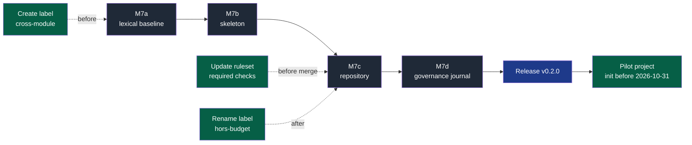

# English baseline — implementation plan (M7)

> **Location:** `docs/governance/plans/`, the repository's working context; no directory
> named after a tool (P2, P7).
>
> **For the executing agent:** run workstream by workstream, task by task, in TDD. Steps
> use checkboxes (`- [ ]`) for tracking. This plan is written in English because its own
> subject is that every repository artefact is English; translating it later would be
> absurd.

**Goal:** make English the single language of this repository — content, naming and
machine values — and use the pass to remove the naming inconsistencies it exposes.
Ship the result as `napkinstack` **v0.2.0**, before the pilot project starts.

**Why now:** v0.1.0 is published but no project has been generated from it yet. Every
breaking rename below costs nothing today. The moment a project exists, each one becomes
a three-way merge on a live repository. This window closes when the pilot opens.

**Side benefit:** v0.2.0 is the second published version, which finally makes it possible
to verify `nstack update` between two tags — the last unverified item of PDR-0001.

**Decision record:** ADR-0003 (written in M7a). Existing specification unchanged:
[PDR-0001](../../pdr/0001-create-a-project-and-receive-updates.md),
[ADR-0001](../../adr/0001-adopt-copier-to-generate-and-update-projects.md),
[ADR-0002](../../adr/0002-distribute-napkinstack-on-pypi.md).

---

## Global constraints

- **The glossary below is normative.** No term is translated ad hoc while writing; every
  file conforms to §2. A translation that drifts from it is a defect, not a variant.
- **Renames use `git mv`**, so review sees moves rather than delete-plus-create pairs.
- The test suite asserts **exact message text** (`platform/tests/run.sh`,
  `platform/tests/test_controles.py`). Expectations turn English first, seen red, then the
  code follows (P5). This is what makes a 65 000-word migration safe.
- One workstream = one PR. Review budget 400 lines and 15 files; beyond that the
  `over-budget` label, justified in the PR (mechanical migration).
- Hooks and CI run the same configuration (P3); every failure names the rule, the place
  and the action (P6).
- Identity: commits `fc <328672623+napkinstack-admin@users.noreply.github.com>`, push via
  the `github-napkinstack` SSH alias, GitHub API via `gh-napkinstack`.
- **Main is transiently bilingual** between M7a and M7d. Acceptable: no user, no
  onboarded team, no generated project.

---

## Roadmap

**Legend** — dark grey: a pull request · blue: published release · green: human action on
GitHub, which the agent's read-only token cannot perform · dotted: ordering constraint.

---

## 1. Scope

| Layer | In | Out |
|---|---|---|
| Machine values | `lifecycle`, `criticality`, GitHub labels, CI job names, hook ids, skill keys | published tag `v0.1.0`, ADR/PDR numbers |
| Code | identifiers, docstrings, comments, output strings, test expectations | command names — already English |
| Skeleton | file names and delivered prose | — |
| Repository | README, PRODUCT, CONTRIBUTING, AGENTS, SECURITY, ADR/PDR, CI, templates | git history and past commit messages |
| Journal | workstreams, reviews, backlog, M1→M5 plan | — |

**Explicitly out of scope**, to keep this workstream from growing:

- No i18n mechanism, no translation catalogue, no bilingual documentation, no `language`
  question in `copier.yml`. One language, one source.
- No CI check enforcing English. Accent-based detection is brittle (typographic quotes,
  proper nouns) for a low risk. The rule lives in `AGENTS.md` and `CONTRIBUTING.md`,
  where humans and agents actually read it, and review holds it.
- Git history is not rewritten. Past commit messages stay French; new ones are English.
- No permanent markdown link checker. Links are verified once, during this migration
  (§6). Making that check permanent is a separate decision.

---

## 2. Canonical glossary

Most of the conceptual vocabulary is **already English inside the French text** and needs
no work: *fitness function, playbook, kernel, oracle, context firewall, expand/contract,
contract test, quality gate, runbook, backfill, DoR/DoD, Prior Art Gate*.

What changes:

| French | Canonical English | Note |
|---|---|---|
| framework de travail | **engineering framework** | matches the repository name `engineering-os`; used in the package description |
| squelette | **skeleton** | already the directory name |
| moteur | **engine** | the `nstack` command |
| socle | **foundation** | `platform` is taken twice: `platform/` here, `09-platform.md` in the skeleton |
| équipe socle | **foundation team** | the `owner_team` answer |
| garde-fou | **guardrail** | |
| chantier | **workstream** | in this repository, "a module" reads "a workstream" |
| verbe (standard) | **standard verb** | |
| frontière | **boundary** | already the module name `fitness/boundaries.py` |
| périmètre (de PR) | **scope** | |
| budget de revue | **review budget** | |
| criticité · cycle de vie · dette | **criticality · lifecycle · debt** | |
| manuel | **handbook** | `docs/os/` |
| plateforme · gouvernance · qualité · mesure | **platform · governance · quality · measurement** | |
| exploitation | **operations** | the playbook |
| données et migrations | **data and migrations** | the playbook |
| vue d'ensemble · principes · contexte IA | **overview · principles · AI context** | |

The table lands in `PRODUCT.md` §1, which already holds a terminology table — it becomes
the single reference instead of translating file by file at the pen's pace.

---

## 3. Machine values

Breaking for anyone who installed v0.1.0; free today, since nobody has.

| Field | Before | After |
|---|---|---|
| `lifecycle` | `Proposé · Actif · Maintenance · Déprécié · Retiré` | `proposed · active · maintenance · deprecated · retired` |
| `criticality` | `prototype · standard · eleve · critique` | `prototype · standard · high · critical` |
| PR label | `hors-budget` | `over-budget` — **string changed in M7c**, not M7a: it is tied to GitHub state, and the M7 pull requests need the escape hatch until then |
| PR label | `cross-module` *(never created)* | `cross-module` — **to create** |
| CI job | `Périmètre et budget de revue` | `PR scope and review budget` |
| CI job | `Hooks et secrets` | `Hooks and secrets` |
| CI job | `Fitness functions` | unchanged |
| Workflow | `Gouvernance` | `Governance` |
| pre-commit hook | `gitleaks-historique` | `gitleaks-history` |
| Skill keys | `securite · donnees-migration · exploitation` | `security · data-migration · operations` |
| Skill keys | `tests · ux` | unchanged |

**`lifecycle` moves to lower case** to match `criticality`. Today two enumerations read by
the same code in the same file follow two different casing conventions, one of them
accented. Accented values travelling through YAML, Python comparisons and CI output are a
portability hazard for no benefit.

**Command names do not change.** `init`, `update`, `doctor`, `fitness`, `new-module`,
`pr-scope`, `bootstrap`, `check`, `test`, `run`, `manifests`, `boundaries`, `skills` are
already English. Only help text, messages and the `eleve` value of `new-module` move.

---

## 4. File renames

| Before | After |
|---|---|
| `skeleton/docs/os/00-overview.md` | `00-overview.md` |
| `skeleton/docs/os/01-principles.md` | `01-principles.md` |
| `skeleton/docs/os/03-contracts.md` | `03-contracts.md` |
| `skeleton/docs/os/04-ai-context.md` | `04-ai-context.md` |
| `skeleton/docs/os/07-governance.md` | `07-governance.md` |
| `skeleton/docs/os/08-quality.md` | `08-quality.md` |
| `skeleton/docs/os/09-platform.md` | `09-platform.md` |
| `skeleton/docs/os/10-measurement.md` | `10-measurement.md` |
| `skeleton/playbooks/security.md` | `security.md` |
| `skeleton/playbooks/data-migration.md` | `data-migration.md` |
| `skeleton/playbooks/operations.md` | `operations.md` |
| `.github/ISSUE_TEMPLATE/05-debt.yml` *(and skeleton copy)* | `05-debt.yml` |
| `platform/tests/test_controles.py` | `test_guardrails.py` |
| `docs/governance/chantiers.md` | `workstreams.md` |
| `docs/governance/revues.md` | `reviews.md` |
| `docs/governance/backlog-automatisation.md` | `automation-backlog.md` |
| `docs/governance/plans/2026-09-15-moteur-v0.1.0.md` | `2026-09-15-engine-v0.1.0.md` |
| `docs/adr/0001-adopt-copier-to-generate-and-update-projects.md` | `0001-adopt-copier-to-generate-and-update-projects.md` |
| `docs/adr/0002-distribute-napkinstack-on-pypi.md` | `0002-distribute-napkinstack-on-pypi.md` |
| `docs/pdr/0001-create-a-project-and-receive-updates.md` | `0001-create-a-project-and-receive-updates.md` |

Unchanged: `02-modules.md`, `05-workflow.md`, `06-decisions.md`, `playbooks/tests.md`,
`playbooks/ux.md`, and every directory name — they are already English.

---

## 5. Human actions on GitHub

The agent's token is read-only on settings. These are yours, in this order.

1. **Before M7a — done 2026-09-16, by the agent.** The label audit found not one but
   **four phantom labels**: `cross-module`, required by `pr_scope.sh` to lift rule P1,
   documented in `CONTRIBUTING.md` and expected by `doctor.py`; and `feature`,
   `architecture`, `spike`, declared by the issue forms. None existed, so rule P1 could
   not be lifted and three of the five issue templates produced unlabelled issues. All
   four created, descriptions in English. Seven unused GitHub default labels
   (`accessibility`, `documentation`, `duplicate`, `enhancement`, `invalid`, `question`,
   `wontfix`) were deleted: referenced by no file, carried by none of the 23 issues and
   pull requests. `good first issue` and `help wanted` were kept — GitHub's own
   contributor-discovery surfaces rely on them, and this repository is public.
   Remaining gap, closed in M7c: the `dette` label is still declared by
   `05-dette.yml` and still does not exist. Creating it now would mean creating a French
   label three pull requests before renaming it — residue by construction.
2. **Before merging M7c** — in ruleset `main`, replace the two required checks
   `Périmètre et budget de revue` and `Hooks et secrets` with `PR scope and review budget`
   and `Hooks and secrets`. A required check whose job no longer reports stays pending
   forever and blocks every pull request. No other PR must be open at that moment.
3. **After M7c** — rename label `hors-budget` to `over-budget`, and create the missing
   `debt` label. GitHub's rename preserves `hors-budget` on the eight pull requests that
   carry it. The rename cannot happen earlier: `pr_scope.sh` greps that exact string, and
   the M7 pull requests themselves need the escape hatch to exceed the review budget.

Still pending from M5, unrelated but worth doing in the same sitting: fill the
repository's "About" description, and confirm the PyPI API token was revoked.

---

## M7a — Lexical baseline (PR 1)

Machine values, code, tests. Small diff, entirely covered by the test suite.

### Task 0 — Labels (done 2026-09-16)

- [x] `cross-module`, `feature`, `architecture`, `spike` created; seven unused default
      labels deleted. Detail and rationale in §5.1.

### Task 1 — ADR-0003, English as the repository language (done)

- [x] `docs/adr/0003-adopt-english-as-the-repository-language.md`, from `_TEMPLATE.md`.
- [x] Prior art, five named references: Django, Rails, Vue.js, Kubernetes, the Linux
      kernel — canonical English source, localisation left downstream to the user's
      project. No deviation, so no dated success criterion is required; one is given
      anyway, checkable at the v0.2.0 release.
- [x] Consequences state the breaking value changes and the v0.2.0 bump.
- [x] `docs/adr/README.md` index updated.
- [x] **Rule to automate**: the §2 arbitration of `07-governance.md` is applied
      explicitly — mechanically checkable but at high cost and low risk, therefore
      *automation backlog*, not *review*. Entry added to
      `docs/governance/backlog-automatisation.md`, triggered by the first outside
      contribution in another language.
- [x] The planned agent-identity ADR shifts to **ADR-0004**; renumbered in
      `chantiers.md` (three places) and in the M1→M5 plan (one forward reference).
- [x] M7 added to the `chantiers.md` sequence, table and diagram, with a new `encours`
      class and its legend. M7d therefore only translates that file, it does not add M7.

### Task 2 — The rule where agents read it (done, adjusted)

- [x] `AGENTS.md` translated in full and given a fourth kernel item: everything written
      here is English, history is not rewritten, translate what you touch and never add
      French. This file is eight lines and is the kernel — the §2 arbitration of
      `07-governance.md` sends a rule that applies to *every* task here, and the file is
      short enough that leaving it half-French would be worse than translating it now.
- [x] **Adjustment:** the canonical glossary stays in §2 of this plan, which is normative
      and already merged into the branch, instead of landing in `PRODUCT.md` §1 now.
      `PRODUCT.md` is French until M7c; writing an English table into it today would mean
      rewriting its surrounding prose twice. M7c moves the glossary to its permanent home.
- [x] Same reasoning for `CONTRIBUTING.md`: translated whole in M7c rather than given one
      English bullet in a French list. Its audience is outside contributors, of whom
      there are none yet; the agent audience is covered by `AGENTS.md`.

### Task 3 — `lifecycle` and `criticality` (TDD, done)

- [x] Test expectations turned English — **seen red on five cases**: the conforming
      manifest, M4, M5 twice and M8, each failing because the code still enforced the
      French vocabulary.
- [x] `fitness/manifests.py`: `LIFECYCLES`, `CRITICALITIES`, the two literal comparisons
      (`== "deprecated"`, `in {"high", "critical"}`) and the rule messages.
- [x] `cli.py`: `new-module` choices `prototype · standard · high · critical`.
- [x] `templates/module/MANIFEST.yaml`, `platform/MANIFEST.yaml`.
- [x] **Two consumers this plan had missed**, caught by the full suite rather than by
      reading: `skeleton/contracts/MANIFEST.yaml.jinja`, and the criticality gate of
      `skeleton/.github/workflows/module-checks.yml`, which branches on
      `steps.crit.outputs.level == 'eleve' | 'critique'`. The second is a generated
      project's CI: no test executes it here, so only the grep for enum values found it.
      Any future change to these two enumerations must check that file too.
- [x] Green: 31 unit cases, full `run.sh` suite, `nstack fitness`, all hooks.

### Task 4 — Python identifiers and output strings

- [ ] `modules.py`: `nouveau` → `create`, `verbe` → `run_verb`, `criticite` →
      `criticality`, `GABARIT` → `TEMPLATE`, `NOM` → `NAME`, `EQUIPE` → `TEAM`,
      `FACULTATIFS` → `OPTIONAL`.
- [ ] `doctor.py`: `MARQUEUR` → `PLACEHOLDER`, `PUBLIEE` → `PUBLISHED`, `SECURITE` →
      `SECURITY`, `ACTIONS_TIERCES` → `THIRD_PARTY_ACTIONS`, `PUBLIC_SEULEMENT` →
      `PUBLIC_ONLY`, `OFFRE_PRIVEE` → `PRIVATE_PLAN`, `NonVerifie` → `NotVerified`,
      `_regle`, `_parametres`, `_securite`, `_actions_autorisees`, `_poste`, `_prive`,
      `_afficher`. `JOBS` keeps its current values — the CI job names it checks only
      change in M7c, and the three must move together (§5.2).
- [ ] `fitness/manifests.py`: `TYPES` values `dictionnaire · liste` → `mapping · list`.
- [x] `fitness/pr_scope.sh`, `fitness/boundaries.py`, `skills.py`, `project.py`,
      `doctor.py`, `cli.py`: all help text, comments and messages. `ÉCHEC` → `FAIL`,
      `AVERTISSEMENT` → `WARNING`.
- [x] **Rule M4 was language-bound and untested.** It warned when a responsibility
      contained `" et "`, a French conjunction, in a rule that a project writes in its
      own language. Left as is it would have been French residue inside English code;
      extended to every language it would have been over-engineering. It now tests
      `" and "`, matching the framework's language, and the sentence-count heuristic
      beside it stays language-agnostic. A test case was added first — the branch had
      none, so P5 was not actually held for M4 — and verified red against the French
      rule before the change.
- [x] **Paths inside the sources** (`docs/os/03-contracts.md`, `07-governance.md`,
      `08-quality.md`, `09-platform.md`) stay French until M7b renames those files.
      M7b must update these references too, not only the markdown ones.
- [x] `copier.yml` questions and validator messages.
- [x] `pyproject.toml` description (it reaches PyPI at the next release).
- [x] `modules.py` identifiers: `create()` and `run_verb()` replace `nouveau()` and
      `verbe()`, whose parameter shadowed the function name.

### Task 5 — Tests and verification (done)

- [x] `git mv platform/tests/test_controles.py platform/tests/test_guardrails.py`, then
      the file translated in full: identifiers, docstrings, case ids and fixtures
      (`facturation` becomes `billing`, `clients` becomes `customers`). References in
      `platform/README.md` and `PRODUCT.md` followed, so no link dangles.
- [x] `run.sh`, 852 lines: 222 messages, the fixture names and every French identifier.
      Translated before renaming identifiers — the reverse order rewrites French words
      *inside* the messages, which is how the first attempt failed.
- [x] `platform/MANIFEST.yaml`, `platform/README.md`, `platform/AGENTS.md`,
      `platform/docs/runbook.md` in English.
- [x] `uv run nstack fitness` green; `uv run bash platform/tests/run.sh` green; all hooks
      green.
- [x] Every rule still proves it fails (P5): no expectation was weakened to pass. Two
      rules gained a case they never had, M4's conjunction branch and `new-module` at
      `criticality=high`.

### Known transitional French, all of it deliberate

Nothing else in `src/` or `platform/` is French. What remains is coupled to state that
moves later, and removing it early would break a guardrail:

| What | Where | Freed by |
|---|---|---|
| `hors-budget` label string | `pr_scope.sh`, `doctor.py`, `run.sh` | M7c, with the GitHub rename |
| CI job names, skeleton side | `doctor.py` `JOBS`, skeleton workflow, `run.sh` simulated API | ~~M7c~~ **done in M7b**, see below |
| CI job names, this repository | `.github/workflows/governance.yml` | M7c, with the ruleset |
| `gitleaks-historique` hook id | shared pre-commit config, both workflows | ~~M7c~~ **done in M7b**, see below |
| `<Une phrase : ce que fait ce projet.>` | `doctor.py` `PLACEHOLDER`, `run.sh` | M7b, with the skeleton README |
| `Tag et version identiques` | `run.sh` | M7c, with `release.yml` |
| `docs/os/0X-*.md` paths | fitness functions, module templates | M7b, with the file renames |
| `skeleton/playbooks/security.md` path | `run.sh` | M7b, with the playbook renames |

**Correction made during M7b.** The plan treated "the CI job names" as one set tied to
this repository's ruleset. They are two sets, in two separate files. The skeleton's job
names feed `doctor.py` `JOBS`, the checklist in the skeleton README and the simulated
ruleset of a *generated* project — none of which touches this repository's ruleset, so
they moved in M7b. Only `.github/workflows/governance.yml`, whose names this repository's
ruleset requires by exact string, waits for M7c and its human action.

The same reasoning frees the `gitleaks-history` hook id: it lives in the shared
pre-commit configuration and in a workflow *step*, never in a job name.

---

## M7b — Skeleton (PR 2)

What every generated project receives. File names and delivered prose.

### Task 1 — File renames (done)

- [x] `git mv` on `docs/os/` and `playbooks/` per §4, plus `05-dette.yml`.
- [x] Every reference updated across 58 files: the navigation map, cross-references
      between chapters, the fitness function messages, the issue forms, the skill
      mapping. The bare filenames (`securite.md` without its folder) needed a second
      pass — the first only matched the path-prefixed form.

### Task 2 — Skills and playbooks (done)

- [x] `.nstack/skills.yaml`: keys `security`, `data-migration`, `operations`; `source`
      paths follow the renames; descriptions in English, keeping the rule that a
      description says what and when, in the third person.
- [x] The five playbooks translated.
- [x] `nstack skills` green, and the five skills generate correctly in a real project.

### Task 3 — The handbook (done)

- [x] The eleven `docs/os/` chapters and their `README.md`. Every mermaid diagram now
      carries the legend the repository requires; a good half of them had none, so this
      pass added them rather than translating an absence.
- [x] `docs/tooling-profile.md`, `docs/adr/`, `docs/pdr/` templates and indexes. The
      repository's own copies differ only by their path prefix; M7c aligns them.

### Task 4 — Skeleton root (done)

- [x] `AGENTS.md` (the kernel, still inside its 250-line budget), `README.md.jinja`,
      `CONTRIBUTING.md`, `SECURITY.md`, `modules/README.md`, `contracts/` (README,
      AGENTS, MANIFEST template, runbook).
- [x] `.github/`: both workflows, the five issue forms, the pull request template,
      `CODEOWNERS.jinja`, `config.yml.jinja`, `dependabot.yml`, `.gitignore`.
- [x] The two shared configurations, `.pre-commit-config.yaml` and `.yamllint.yaml`,
      translated in both byte-identical copies as rule P3 requires.
- [x] PR summary blocks: `FAIT / VÉRIFIÉ / SUPPOSÉ / NON VÉRIFIÉ / RISQUES` →
      `DONE / VERIFIED / ASSUMED / NOT VERIFIED / RISKS`.
- [x] `05-debt.yml` labels with `debt`, and that label was created on the repository. It
      was the last phantom one: every label an issue form or a guardrail names now
      exists.

### Task 5 — Verification (done)

- [x] `nstack init` into a scratch directory from the working tree: the generated project
      contains **no French at all** and no `PRODUCT.md`.
- [x] In the generated project: `nstack fitness` green, `nstack new-module billing
      acme/billing high` writes its runbook and passes `nstack manifests`, and
      `nstack skills` generates the five skills under their new names.
- [x] Full `run.sh` suite green throughout, including its generated-project assertions.

---

## M7c — Repository (PR 3)

The repository's own surface. Contains the CI job renames, hence the ruleset action.

### Task 0 — Human action: ruleset, before merge

- [ ] In ruleset `main`, replace the two required checks `Périmètre et budget de revue`
      and `Hooks et secrets` with **`PR scope and review budget`** and
      **`Hooks and secrets`**. The pull request reports the new names as soon as it is
      pushed; until the ruleset is updated it stays blocked on two checks that will never
      report again.

### Task 1 — CI and hooks (done)

- [x] `.github/workflows/governance.yml`: workflow name `Governance`, the two job names,
      step names, comments.
- [x] `.github/workflows/release.yml`: the workflow name, both job keys and their names,
      the tag check and its message. The test extracts that check by job key and step
      name, so its expectations were turned first and seen red.
- [x] `.pre-commit-config.yaml`: hook id `gitleaks-history` — **done in M7b**, since it
      lives in the shared configuration and in a workflow step, never in a job name.
- [x] `doctor.py` `JOBS` — **done in M7b**: it names the *skeleton's* jobs, which a
      generated project's ruleset requires, not this repository's.
- [x] `hors-budget` becomes `over-budget` in `pr_scope.sh`, `doctor.py` and both
      CONTRIBUTING files. Until the label is renamed on GitHub, P2 only warns, so nothing
      breaks in between.

### Task 2 — Root documents (done)

- [x] `README.md`, `PRODUCT.md`, `CONTRIBUTING.md`, `SECURITY.md`, mermaid diagrams and
      legends included. `AGENTS.md` was done in M7a.
- [x] The canonical glossary (§2) replaces the terminology table of `PRODUCT.md` §1 and
      becomes its permanent home, extended with guardrail, workstream, contract, standard
      verb and fitness function.

### Task 3 — Decisions (done)

- [x] `git mv` on the three ADR/PDR files per §4; content translated; indexes and every
      inbound link updated. Facts, dates and observed results preserved verbatim.
- [x] The templates and indexes are the skeleton ones with this repository's paths, as
      they were before.

### Task 4 — Templates (done)

- [x] The repository's `05-dette.yml` renamed to `05-debt.yml` (the skeleton's moved in
      M7b).
- [x] `.github/ISSUE_TEMPLATE/*`, `pull_request_template.md`, `config.yml`,
      `dependabot.yml`, `CODEOWNERS`, `.gitignore`. The issue and pull request templates
      are the skeleton ones with this repository's paths — they were identical before.
- [x] `.yamllint.yaml` — **done in M7b**, with its byte-identical skeleton copy.

### Task 5 — Human action: labels, after merge

- [ ] `hors-budget` → `over-budget`. `pr_scope.sh` and `CONTRIBUTING.md` already expect
      the new name once this pull request is merged.
- [ ] Create `debt`, matching `05-debt.yml`. This closes the last phantom label; after it,
      every label an issue form or a guardrail names exists on the repository.

---

## M7d — Governance journal (PR 4)

No code, no guardrail. The largest volume, the lowest risk — deliberately last.

### Task 1 — Living documents

- [ ] `git mv` per §4; `chantiers.md` → `workstreams.md`, `revues.md` → `reviews.md`,
      `backlog-automatisation.md` → `automation-backlog.md`.
- [ ] Content translated. M7 is already in the sequence, table and diagram (added in
      M7a); this task only turns them English.

### Task 2 — The M1→M5 plan

- [ ] `git mv` to `2026-09-15-engine-v0.1.0.md`, content translated. Facts, dates, SHAs
      and PR numbers are preserved verbatim: this is a record of what happened.
- [ ] Embedded code and configuration excerpts follow the English sources.

### Task 3 — Final consistency

- [ ] No French remains: `git grep` on accented **letters** (`[àâçéèêëîïôùûü]`, case
      insensitive) and on the glossary's French terms returns nothing outside git
      history. Typographic punctuation — `«  »`, `—` — is not a French marker and stays
      wherever the English text uses it.
- [ ] Link check (§6) clean across the whole repository.

---

## 6. Verification

Per PR, before pushing:

1. `uv run nstack fitness` and `uv run bash platform/tests/run.sh` green.
2. `uv run pre-commit run --all-files`.
3. CI replay with `GITHUB_ACTIONS` and `GITHUB_WORKFLOW` set, asserting message text.
4. Relative markdown links resolve — one-off check over the changed files, not a
   permanent CI hook.
5. gitleaks over history, identity check, diff reviewed for leaks before pushing.
6. Merge only on green CI, on a fresh clone at head SHA, with
   `--match-head-commit <full sha>`.

After M7c, `nstack doctor` must report the ruleset as compliant with the new job names.

---

## 7. Release v0.2.0

Minor bump, not a patch: `lifecycle`, `criticality` and skill keys change, so a manifest
valid in v0.1.0 is invalid in v0.2.0.

- [ ] Version PR (`uv version --bump minor`), merged.
- [ ] Annotated tag `v0.2.0` pushed via the SSH alias — **only with explicit consent**.
- [ ] The `pypi` deployment approved by the user in GitHub.
- [ ] Verification: PyPI JSON and Integrity API, isolated `uv tool install`, `nstack init`
      in a clean directory.
- [ ] The pilot project starts from v0.2.0.

---

## 8. Risks

| Risk | Mitigation |
|---|---|
| A required check renamed without the ruleset update blocks `main` permanently | §5.2, ordered and explicit; no other PR open at that moment |
| Broken relative links after ~20 renames | `git mv` keeps history; link check per PR (§6.4) and repository-wide in M7d |
| Translation drifts from the glossary across four PRs | §2 is normative and lands first, in M7a |
| An expectation weakened to make a test pass | M7a task 5: each rule must still prove it fails (P5) |
| A French string left in a machine value | `git grep` on accented characters in M7d task 3 |
| Main bilingual between M7a and M7d | Accepted: no user, no team, no generated project |
