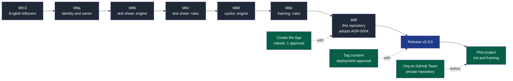
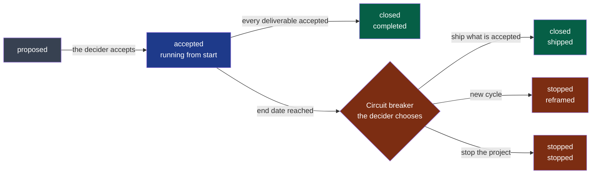

# NapkinStack v0.3.0 — frame, verify, approve — implementation plan (M8)

> **Location:** `docs/governance/plans/`, the repository's working context; no directory
> named after a tool (P2, P7).
>
> **For the executing agent:** run workstream by workstream, task by task, in TDD: the
> failing test first, seen red, then the code (P5). Steps use checkboxes (`- [ ]`) for
> tracking. One workstream = one pull request. The code below was prototyped and run
> against the cases it lists before this plan was written; it is the starting point, and
> the tests decide.

**Goal:** implement the three decisions accepted on 2026-09-16 — an agent's own identity
behind a human approval, a change approved on evidence of its behaviour, a project framed
and bounded — and ship them as `napkinstack` v0.3.0, the version the private pilot
project starts from.

**Architecture:** the framework keeps its layers. What can be checked moves into the
engine: `nstack doctor` (the owner's default rule, the ruleset's bypass list), `nstack
manifests` (a module declares whether a user sees it), a new fitness function `nstack
plan` (charter and cycles), a new pull request check `nstack pr-check` (test sheet and
cycle), a new optional standard verb `e2e`, and `nstack discover`, which starts a discovery from
an idea file without calling any model. What cannot be checked goes to the kernel, two
new playbooks (`framing`, `verification`) and the handbook. The project's own substance
lives in `docs/project/`, written by the team's agent through an interview, never by the
CLI.

**Tech stack:** Python 3.12+ standard library and PyYAML (the engine), Copier 9.18.2
(generation), bash (the test suite), pytest 9.1.1, GitHub Actions pinned by SHA, GitHub
REST API read-only.

**Specifications:**
[ADR-0004](../../adr/0004-give-agents-their-own-github-identity.md),
[PDR-0003](../../pdr/0003-approve-a-change-on-evidence-of-its-behaviour.md),
[PDR-0002](../../pdr/0002-frame-and-bound-a-project.md), all three accepted by the
maintainer on 2026-09-16; the gap found the same day — a project without an organisation
cannot name its owner; the English leftovers M7 missed.

## Global constraints

- **P1** — no stack, no tool, no business domain named in the framework's files: the
  playbooks, the kernel and the handbook say *what*; `docs/tooling-profile.md` names
  tools, and ships with that column empty for the new capabilities.
- **P3** — enforcement in CI, never in a hook or a plugin. **P4** — the kernel stays
  within 250 lines (208 today); this plan adds a check that proves it.
- **P5** — every new rule has a test that proves it fails, seen red before the code.
- **P6** — every failure names the rule, the place and the action.
- **P7** — the brand stays at the periphery: no "NapkinStack" in the skeleton's rules.
- **ADR-0003** — English everywhere, machine values included.
- **ADR-0001** — Copier driven by its API, never "unsafe"; only `.jinja` files carry
  variables.
- **Checklist identity** — `CHECKLIST` in `doctor.py` is printed by `init`, checked by
  `doctor` and repeated word for word in `skeleton/README.md.jinja`; `run.sh` verifies it.
- **Hooks identity** — `.pre-commit-config.yaml` and `.yamllint.yaml` stay byte-identical
  between the repository and `skeleton/`.
- **The pilot is private.** Nothing about its subject enters this public repository: no
  name, no domain, no charter content. Only durations, counts and criteria met.
- **Review budget** — 400 lines and 15 files; a workstream beyond it carries the
  `over-budget` label, justified in its pull request.
- **Identity until M8f** — commits `fc <328672623+napkinstack-admin@users.noreply.github.com>`,
  push through the `github-napkinstack` SSH alias, API through `gh-napkinstack`. From M8f
  on, the agent's own App (ADR-0004).
- **Consent** — the tag and the publication need the maintainer's explicit consent, every
  time.

---

## Decisions taken while planning

Implementation choices, each the convention of the field or the smallest one that holds.
None changes a decision's intent; the one that narrows a business rule is recorded as a
clarification of PDR-0002 in the same pull request as this plan.

| Subject | Choice | Reference, verified fact |
|---|---|---|
| Where the test sheet lives | In the pull request description, section `## Test sheet`, a markdown table | Phabricator's test plan lives on the revision; Copilot's cloud agent attaches its screenshots to the pull request |
| How CI reads it | `PR_BODY`, `PR_LABELS`, `PR_HEAD_SHA` passed through `env:`, parsed by `nstack pr-check` in Python | zizmor's template-injection rule: a context value never inserted into a script |
| When it runs again | A dedicated workflow, `pull_request` types `opened, edited, synchronize, reopened, labeled, unlabeled` | Editing the description or a label must re-evaluate the check on the same head commit |
| Its required check | A fourth job, `Test sheet and cycle`, added to G4 | A new name rather than widening `PR scope and review budget`, whose meaning stays exact |
| Stale evidence | A `passed` or `failed` row verified on another commit than the head fails T4 | PDR-0003: "CI reports the scenarios to run again"; an approval on stale evidence is the formality the PDR removes |
| Automated scenarios | A new optional standard verb, `e2e`, run by `module-checks.yml`; its evidence uploaded from `.evidence/` as an artefact kept 30 days | `actions/upload-artifact` is published by GitHub, already pinned in `release.yml` (v7.0.1); replaces the "E2E not wired up (D9)" placeholder |
| A module's surface | `module.user_facing: true` or `false`, required (M10); `nstack new-module --user-facing` | PDR-0003: "a module declares in its manifest whether it exposes a user-visible surface" |
| Charter and cycles | `docs/project/charter.md`, `docs/project/cycles/NN-<slug>.md`: a YAML front matter the checks read, prose below | The front matter convention of Jekyll, Hugo and MADR; the manifests are already YAML |
| Cycle statuses | Stored: `proposed`, `accepted`, `closed`, `stopped`. Computed: *running* once `start` is reached, *broken* past `end` | Dates decide; a status nobody updates cannot lie |
| The appetite | `appetite_weeks`; `end` must equal `start` + the appetite (C3) | Shape Up: the appetite sets the box |
| Scope of the cycle rules | K1 to K4 apply to **delivery work** — a pull request changing a module; framing documents, `nstack update` branches, CI and handbook changes are exempt | The framing pull request cannot be tied to a cycle that does not exist yet; recorded as a clarification of PDR-0002 |
| Starting from an idea | `nstack discover <idea-file>`, deterministic; the discovery runs in the agent (`playbooks/discovery.md`) and writes `docs/project/discovery.md`; rule C7 | PDR-0002, extension of 2026-09-16: Spec Kit's `assess` extension (intake → research → define → shape → decide), a challenge by another session |
| The circuit breaker in CI | In `pr-check` (K2), not in `nstack fitness` | A breaker in fitness would block the `out-of-cycle` incident fix PDR-0002 allows |
| Owner of the foundation | The Copier question `owner_team` also accepts a GitHub user when the project has no organisation; its name stays | CODEOWNERS accepts `@user` and `@org/team`; a renamed question would leave `nstack update` a new question with no answer in every existing project |
| The default code owner | First rule of `CODEOWNERS`: `*` followed by the owner; checked by `doctor` L6 | ADR-0004, rule to automate; GitHub: the last matching pattern wins |
| The bypass list | `doctor` G12: every ruleset applying to `main` has an empty bypass list | ADR-0004; `GET /repos/{repo}/rules/branches/main` returns each rule's `ruleset_id`, `GET /repos/{repo}/rulesets/{id}?includes_parents=true` its `bypass_actors` (observed on this repository, 2026-09-16) |
| The agent's local token | The `gh-token` binary, standalone, from its latest release | 416 stars, MIT, 7 contributors, v2.0.10: passes the niche filter; `gh-app-auth` (17 stars, v0.0.8) and `git-credential-github-app` (18 stars) do not |
| Git with the App | HTTPS, `x-access-token` as user, the installation token as password, through a credential helper | GitHub documentation, "Authenticating as a GitHub App installation" |
| The agent's session | Claude Code's sandbox on this workstation: `allowUnsandboxedCommands: false`, `credentials.files` deny for `~/.ssh`; the human's token revoked | Claude Code sandboxing documentation: the default read policy still allows `~/.ssh` |

---

## Roadmap



**Legend** — grey: a workstream, one pull request · blue: the release · green: the
maintainer's actions and the pilot. Dotted: a human action tied to a step.

Until M8f, the agent merges its own pull requests after the usual checks, as today. From
M8f on, every pull request waits for the maintainer's approval.

## File map

| File | M8.0 | M8a | M8b | M8c | M8d | M8e | M8f |
|---|---|---|---|---|---|---|---|
| `copier.yml` | | owner validator | | | | | |
| `src/napkinstack/cli.py` | | owner help | `pr-check`, `e2e`, `--user-facing` | | `plan` | | |
| `src/napkinstack/modules.py` | | `OWNER` | `user_facing`, `e2e` | | | | |
| `src/napkinstack/doctor.py` | | L6, G12 | G4 job | | G11 label | | |
| `src/napkinstack/fitness/manifests.py` | | | M10 | | | | |
| `src/napkinstack/pull_request.py` | | | create: T1–T5 | | K1–K4 | | |
| `src/napkinstack/fitness/plan.py` | | | | | create: C1–C7 | | |
| `src/napkinstack/discovery.py`, `platform/tests/test_discovery.py` | | | | | create | | |
| `src/napkinstack/templates/module/MANIFEST.yaml` | | owner comment | `user_facing` | | | | |
| `platform/MANIFEST.yaml`, `platform/README.md` | | | `user_facing`, commands | | commands | | |
| `platform/tests/run.sh` | English | owner, L6, G12 | wiring | kernel budget | wiring | | |
| `platform/tests/test_guardrails.py` | | owner | M10 | | | | |
| `platform/tests/test_pull_request.py` | | | create | | K cases | | |
| `platform/tests/test_plan.py` | | | | | create | | |
| `skeleton/.github/CODEOWNERS.jinja` | | `*` | | | | | |
| `skeleton/.github/workflows/pull-request.yml` | | | create | | | | |
| `skeleton/.github/workflows/module-checks.yml` | | | `e2e`, evidence | | | | |
| `skeleton/.github/pull_request_template.md` | | | test sheet | | deliverable | | |
| `skeleton/.github/ISSUE_TEMPLATE/01-feature.yml` | | | | | deliverable | | |
| `skeleton/docs/project/` | | | | | create: templates | README | |
| `skeleton/.nstack/skills.yaml` | | | | `verification` | | `framing`, `discovery` | |
| `skeleton/contracts/MANIFEST.yaml.jinja` | | | `user_facing` | | | | |
| `skeleton/README.md.jinja` | | checklist, identity | G4, commands | | G11, journey | | |
| `skeleton/AGENTS.md` | | identity | | test sheet | | postures, cycle | |
| `skeleton/playbooks/verification.md`, `framing.md`, `discovery.md` | | | | create `verification` | | create `framing`, `discovery` | |
| `skeleton/docs/os/*.md`, `skeleton/docs/tooling-profile.md` | | 07, 09, profile | | 05, 08, 09, profile | | 00, 05, 06, 09, 10 | |
| `skeleton/CONTRIBUTING.md` | English | | | | | cycle, sheet | |
| `skeleton/.gitignore`, `skeleton/modules/README.md` | | | `.evidence/`, `--user-facing` | | | | |
| `.github/CODEOWNERS`, `CONTRIBUTING.md` | | | | | | | `*`, merge and release |
| `docs/pdr/0001-…md` | | clarification | | | | | |
| `docs/adr/0003-…md` | correction | | | | | | |
| `README.md`, `PRODUCT.md`, `docs/governance/workstreams.md` | | | | | | | status |

---
## This plan's pull request

It carries the decisions' acceptance and nothing that the workstreams implement:

- ADR-0004, PDR-0003 and PDR-0002: **Accepted (2026-09-16, by the maintainer)**; their
  success criteria still observed in the pilot project; the ADR and PDR indexes, and
  `workstreams.md` — M8 in progress, its plan linked.
- PDR-0002, a clarification: the cycle rules apply to **delivery work**, a pull request that
  changes a module. Framing documents, `nstack update` branches, CI and handbook changes
  are exempt — the framing pull request cannot be tied to a cycle that does not exist yet.

---
## M8.0 — English leftovers (PR 1)

M7 searched for accented letters; French without accents slipped through. A generated
project still names a CI job `Hooks et secrets`, which contradicts ADR-0003's success
criterion as it was observed at the v0.2.0 release.

### Task 1 — Skeleton, test suite, ADR-0003

**Files:**
- Modify: `skeleton/CONTRIBUTING.md` (the barriers diagram)
- Modify: `platform/tests/run.sh` (identifiers, fixtures, one comment)
- Modify: `docs/adr/0003-adopt-english-as-the-repository-language.md` (§Success criterion)

**Interfaces:** none — prose, fixtures and local shell names only.

- [x] **Step 1: List what is left**

Run:
```bash
git grep -nIiE "\b(voir|morts|vide|orphelin|ajout|cle|outil|historique|jeton|faux|contournement|faille|invalide|doublon|garde|absente|locale|projet|produit|avant|et secrets)\b" -- ':!docs/governance/plans' ':!docs/adr/0003*' ':!uv.lock'
```
Expected: the lines of `platform/tests/run.sh` and `skeleton/CONTRIBUTING.md:19`, nothing else.

- [x] **Step 2: Fix the skeleton**

In `skeleton/CONTRIBUTING.md`, the diagram node:
```
    PP -->|ok| PR["Pull request"] --> CI{"3 · CI 'Hooks and secrets'<br/>same hooks + full history"}
```

- [x] **Step 3: Translate the test suite**

In `platform/tests/run.sh`, rename exactly — every occurrence:

| Before | After |
|---|---|
| `printf 'Voir \`docs/%s-contrats.md\` §4.\n' 03` | `printf 'See \`docs/%s-contracts.md\` §4.\n' 03` |
| `MORTS` | `DEAD` |
| `"$SK/vide"` | `"$SK/empty"` |
| `orphelin` (file and content) | `orphan` |
| `echo "ajout"` | `echo "added"` |
| `repo_with_hooks cle`, `"$HK/cle/…"` | `repo_with_hooks key`, `"$HK/key/…"` |
| `outil.sh` | `tool.sh` |
| `historique` | `history` |
| `JETON`, `faux_jeton_aws` | `TOKEN`, `fake_aws_token` |
| `-m contournement` | `-m bypass` |
| `faille.yml`, `name: faille` | `flaw.yml`, `name: flaw` |
| `invalide.yml` | `invalid.yml` |
| `doublon` | `duplicate` |
| `garde`, `garde.txt` | `guard`, `guard.txt` |
| `"$GN/absente"` | `"$GN/missing"` |
| `# Tests — adaptation locale` | `# Tests — local adaptation` |
| `"modification locale"` | `"local change"` |
| `projet_v01` | `project_v01` |
| `MODULE_AVANT` | `MODULE_BEFORE` |
| `"Projet C"` | `"Project C"` |
| `"# Produit"` | `"# Product"` |
| `jeton-factice` | `fake-token` |
| `stack-libre` | `stack-free` — *found during execution, missed by Step 1's word list* |

And the comment above the yamllint assertion:
```bash
# The message text, not "(truthy)": on GitHub Actions, yamllint switches to the annotations format.
```

- [x] **Step 4: Run the suite**

Run: `uv run bash platform/tests/run.sh`
Expected: `Platform tests: OK` — the renames change no assertion.

- [x] **Step 5: Step 1 again**

Expected: no output.

- [x] **Step 6: Correct ADR-0003's observation**

In `docs/adr/0003-…md` §Success criterion, after the second bullet of "Observed on
2026-09-16", add:
```markdown
- *Correction, workstream M8.0:* "no accented letter" was true, "no French" was not. The
  skeleton's `CONTRIBUTING.md` still named the CI job `Hooks et secrets`, and the test
  suite kept French identifiers and fixtures; a search for accents cannot see them. Fixed
  in M8.0, observed again at the v0.3.0 release.
```

- [x] **Step 7: Commit, pull request**

```bash
git switch -c m8-0-english-leftovers
git add skeleton/CONTRIBUTING.md platform/tests/run.sh docs/adr/0003-adopt-english-as-the-repository-language.md
git commit -m "M8.0 — English leftovers M7's accent search could not see"
```
The usual verification (§Verification), pull request "M8.0 — English leftovers", merge.

---
## M8a — Identity and owner (PR 2)

ADR-0004 in the skeleton and the engine, and the gap found on 2026-09-16: a project without
an organisation cannot name its owner.

### Task 1 — The owner can be a user

**Files:**
- Modify: `copier.yml` (the `owner_team` question's help and validator)
- Modify: `src/napkinstack/cli.py` (`init --owner-team` and `new-module` help)
- Modify: `src/napkinstack/modules.py` (`TEAM` → `OWNER`)
- Modify: `src/napkinstack/templates/module/MANIFEST.yaml` (owner comment)
- Modify: `skeleton/README.md.jinja`, `skeleton/modules/README.md`, `README.md`, `platform/README.md` (synopsis)
- Modify: `docs/pdr/0001-create-a-project-and-receive-updates.md` (clarification)
- Test: `platform/tests/test_guardrails.py`, `platform/tests/run.sh`

**Interfaces:**
- Produces: `modules.OWNER: re.Pattern` — `organisation/team`, or a GitHub user name
  (letters, digits, single inner hyphens, 39 characters at most); the Copier answer
  `owner_team` accepting the same values — its name unchanged.

- [x] **Step 1: Write the failing test**

Append to `platform/tests/test_guardrails.py`:
```python
OWNERS = {
    "team": ("acme/billing", True),
    "user": ("alice", True),
    "user with hyphens": ("a-l-i-c-e", True),
    "user of 39 characters": ("a" * 39, True),
    "leading hyphen": ("-alice", False),
    "trailing hyphen": ("alice-", False),
    "double hyphen": ("al--ice", False),
    "user of 40 characters": ("a" * 40, False),
    "team without a name": ("acme/", False),
    "space": ("bad owner", False),
}


@pytest.mark.parametrize(("owner", "accepted"), OWNERS.values(), ids=OWNERS.keys())
def test_new_module_owner(tmp_path, capsys, owner, accepted):
    """A team, or a user when the project has no organisation (PDR-0001, clarification)."""
    code = cli.main(["new-module", "demo", owner, "standard", "--root", str(tmp_path)])
    output = capsys.readouterr().out
    assert code == (0 if accepted else 1), output
    assert accepted or f"FAIL [new-module] invalid owner '{owner}'" in output
```

- [x] **Step 2: Run it**

Run: `uv run pytest -q platform/tests/test_guardrails.py -k owner`
Expected: FAIL on `user`, `user with hyphens`, `user of 39 characters` — refused as
"invalid owner".

- [x] **Step 3: Accept a user in the engine**

`src/napkinstack/modules.py`:
```python
OWNER = re.compile(  # same rule as copier.yml: organisation/team, or a GitHub user
    r"[A-Za-z0-9-]+/[A-Za-z0-9._-]+|(?=[A-Za-z0-9-]{1,39}$)[A-Za-z0-9]+(?:-[A-Za-z0-9]+)*")
```
and in `create`:
```python
    if not OWNER.fullmatch(owner):
        print(f"FAIL [new-module] invalid owner '{owner}': a GitHub team, organisation/team, "
              "or a user when the project has no organisation, for example acme/billing "
              "(CODEOWNERS, docs/os/07-governance.md §7).")
        return 1
```

`src/napkinstack/templates/module/MANIFEST.yaml`, the owner line:
```yaml
  owner: "{{OWNER}}"          # a GitHub team, organisation/team; a user only without an organisation
```

`src/napkinstack/cli.py`, the help of both options:
```python
    nm.add_argument("owner", help="GitHub team, organisation/team, or a user when the project has "
                                  "no organisation")
```
```python
    ini.add_argument("--owner-team", help="owner of the foundation: organisation/team, or a user "
                                          "when the project has no organisation (asked when absent)")
```

- [x] **Step 4: Run it**

Run: `uv run pytest -q platform/tests/test_guardrails.py -k owner`
Expected: 10 passed.

- [x] **Step 5: The template's question**

`copier.yml`, the `owner_team` question — its name kept, so that no existing project has a
question left to answer at its next `nstack update`:
```yaml
owner_team:
  type: str
  help: >-
    Owner of the foundation: a GitHub team, organisation/team, or a GitHub user when the
    project has no organisation
  validator: >-
    
    Expected: organisation/team, for example acme/platform, or a user, for example alice.
    
```
In `skeleton/README.md.jinja`, `README.md` and `platform/README.md`, the synopsis `nstack
new-module <name> <organisation>/<team> <criticality>` (or `<org>/<team>`) becomes
`nstack new-module <name> <owner> <criticality>`.

- [x] **Step 6: The suite, red then green**

In `platform/tests/run.sh`, the refusal loop becomes:
```bash
echo "-> init: a repository without an organisation, or an invalid owner, MUST be refused (P6)"
for question in github_repo owner_team; do
  if [ "$question" = github_repo ]; then
    answers=(--project-name x --github-repo demo --owner-team acme/platform)
  else
    answers=(--project-name x --github-repo acme/demo --owner-team -platform)
  fi
  if OUT=$(nstack init "$GN/refused-$question" --source "$REPO" --ref HEAD "${answers[@]}" 2>&1); then
    echo "FAIL: $question '${answers[-1]}' accepted."; exit 1
  fi
  echo "$OUT" | grep -qF "FAIL [init] Answer rejected for $question" \
    || { echo "FAIL: refusal of $question without an explanatory message."; echo "$OUT"; exit 1; }
done

echo "-> init: a project without an organisation names a user as owner"
nstack init "$GN/solo" --source "$REPO" --ref HEAD --project-name Solo --github-repo alice/solo \
  --owner-team alice >/dev/null || { echo "FAIL: init with a user as owner."; exit 1; }
grep -qE '^/AGENTS\.md +@alice$' "$GN/solo/.github/CODEOWNERS" \
  || { echo "FAIL: CODEOWNERS does not name the user."; exit 1; }
```
- in the scaffolding refusal cases, `"demo2|demo-team|invalid owner 'demo-team'"` becomes
  `"demo2|-team|invalid owner '-team'"` (`demo-team` is now a valid user name).

Run: `uv run bash platform/tests/run.sh`
Expected: `Platform tests: OK`. Then revert `copier.yml` alone and run again: the user case
fails with "Answer rejected for owner_team" — restore it.

- [x] **Step 7: Record the clarification in PDR-0001**

After "Clarification of 2026-09-15 — private repositories", add:
```markdown
## Clarification of 2026-09-16 — a project without an organisation

Added without changing the decision above, when checking that one person alone can use the
framework.

**Observation:** `nstack init` required the foundation's owner as `organisation/team`. A
personal GitHub account has no team: one person working alone could not answer.

**Clarification:**

- The `owner_team` question accepts a team, `organisation/team`, or a GitHub user when the
  project has no organisation; its name stays, so that no update has a question to migrate.
  `CODEOWNERS` names either; `nstack new-module` accepts either.
- Several teams remain the framework's target: a module's owner stays a team whenever an
  organisation exists (`docs/os/02-modules.md` §5).
```

- [x] **Step 8: Commit**

```bash
git add copier.yml src/napkinstack/cli.py src/napkinstack/modules.py src/napkinstack/templates/module/MANIFEST.yaml \
  skeleton/README.md.jinja skeleton/modules/README.md README.md platform/README.md \
  docs/pdr/0001-create-a-project-and-receive-updates.md \
  platform/tests/test_guardrails.py platform/tests/run.sh
git commit -m "M8a — The foundation's owner can be a user when the project has no organisation"
```

### Task 2 — A default code owner, checked by doctor (L6)

**Files:**
- Modify: `skeleton/.github/CODEOWNERS.jinja` (first rule)
- Modify: `src/napkinstack/doctor.py` (docstring, `_default_owner`, `_workstation`)
- Test: `platform/tests/run.sh` (doctor section)

**Interfaces:**
- Consumes: `doctor.OK`, `doctor.GAP`.
- Produces: `doctor._default_owner(root: Path) -> tuple[str, str]` — `(status, detail)`; rule
  `L6` in the workstation part.

- [x] **Step 1: Write the failing test**

In `platform/tests/run.sh`, the block "doctor: workstation gaps listed with their action"
becomes:
```bash
echo "-> doctor: workstation gaps listed with their action (L1, L3, L4, L5, L6)"
sed -i 's#^_commit: .*#_commit: v0.0.1#' "$A/.copier-answers.yml"
echo "# Product" > "$A/PRODUCT.md"
sed -i '/^\*/d' "$A/.github/CODEOWNERS"
if OUT=$(GH_TOKEN=fake-token nstack doctor --root "$A" 2>&1); then
  echo "FAIL: non-compliant workstation accepted."; echo "$OUT"; exit 1
fi
for rule in L1 L3 L4 L5 L6; do
  echo "$OUT" | grep -qE "FAIL +\[$rule\]" \
    || { echo "FAIL: gap $rule not reported."; echo "$OUT"; exit 1; }
done
echo "$OUT" | grep -qF "Action: pre-commit install" && echo "$OUT" | grep -qF 'make `*  @<owner>` its first rule' \
  || { echo "FAIL: L3 or L6 action missing."; echo "$OUT"; exit 1; }
rm "$A/PRODUCT.md"
```
and, in "doctor: checklist applied, the command exits successfully", the count `-eq 16`
becomes `-eq 17`; in "private repository under GitHub Team", `-eq 15` becomes `-eq 16`.

- [x] **Step 2: Run it**

Run: `uv run bash platform/tests/run.sh`
Expected: FAIL "gap L6 not reported."

- [x] **Step 3: The skeleton's first rule**

`skeleton/.github/CODEOWNERS.jinja`, before the foundation's rules:
```
# Default owner: every path the rules below do not name. With the code owner review
# required, a human approval covers every file (docs/os/07-governance.md §7).
*                              @{{ owner_team }}
```

- [x] **Step 4: The check**

`src/napkinstack/doctor.py` — in the docstring's rules, after `L5`:
```
  L6  CODEOWNERS starts with a default owner: the code owner review covers every path
```
after the constants:
```python
CODEOWNERS = Path(".github") / "CODEOWNERS"
```
before `_workstation`:
```python
def _default_owner(root: Path) -> tuple[str, str]:
    """L6: `*` first, so that the code owner review covers every path (ADR-0004)."""
    path = root / CODEOWNERS
    if not path.is_file():
        return GAP, f"{CODEOWNERS} missing.\nAction: create it, starting with `*  @<owner>`."
    rules = [line.split() for line in path.read_text(encoding="utf-8").splitlines()
             if line.strip() and not line.lstrip().startswith("#")]
    if rules and rules[0][0] == "*" and len(rules[0]) > 1:
        return OK, ""
    return GAP, (f"The first rule of {CODEOWNERS} is not a default owner.\nAction: make `*  @<owner>` "
                 "its first rule: the code owner review then covers every path (ADR-0004).")
```
and at the end of `_workstation`, before `return results`:
```python
    results.append(("L6", "CODEOWNERS starts with a default owner", *_default_owner(root)))
```

- [x] **Step 5: Run it**

Run: `uv run bash platform/tests/run.sh`
Expected: `Platform tests: OK`.

- [x] **Step 6: Commit**

```bash
git add skeleton/.github/CODEOWNERS.jinja src/napkinstack/doctor.py platform/tests/run.sh
git commit -m "M8a — A default code owner in the skeleton, checked by doctor (L6)"
```

### Task 3 — No bypass on the main branch's rulesets (G12)

**Files:**
- Modify: `src/napkinstack/doctor.py` (docstring, `CHECKLIST`, `PRIVATE_PLAN`, `_no_bypass`, `CHECKS`)
- Modify: `skeleton/README.md.jinja` (checklist)
- Test: `platform/tests/run.sh` (simulated API, doctor section)

**Interfaces:**
- Consumes: `GitHub.get(path)`, `NotVerified`.
- Produces: `doctor._no_bypass(client: GitHub) -> bool`; rule `G12`, the twelfth line of
  `CHECKLIST`.

- [x] **Step 1: Write the failing test**

In the simulated API of `platform/tests/run.sh` (the `routes.json` generator):
```python
rules = [
    {"type": "pull_request", "ruleset_id": 1, "parameters": {"required_approving_review_count": 1, "require_code_owner_review": True}},
    {"type": "required_status_checks", "ruleset_id": 1, "parameters": {"required_status_checks": [
        {"context": "Fitness functions"}, {"context": "PR scope and review budget"}, {"context": "Hooks and secrets"}]}},
]
ruleset = {"/rulesets/1?includes_parents=true": {"id": 1, "bypass_actors": []}}
```
add `**ruleset` to `compliant`, and after `private_team` is built:
```python
bypass = {**compliant, "/rulesets/1?includes_parents=true": {"id": 1, "bypass_actors": [
    {"actor_id": 5, "actor_type": "RepositoryRole", "bypass_mode": "always"}]}}
```
dumped as `"acme/bypass": bypass`. Then:
- "init: GitHub checklist printed": `-eq 11` becomes `-eq 12`;
- the bare repository's loop covers `G1 … G11 G12`;
- the compliant count becomes `-eq 18`, the private Team count `-eq 17`;
- the Free private repository expects `[ "$(echo "$OUT" | grep -cF 'GitHub Team plan')" -eq 5 ]`;
- after the compliant case:
```bash
echo "-> doctor: a bypass actor on the main branch's ruleset is a gap (G12, ADR-0004)"
repo_c acme/bypass
if OUT=$(GH_TOKEN=fake-token nstack doctor --root "$C" 2>&1); then
  echo "FAIL: a bypassable ruleset accepted."; echo "$OUT"; exit 1
fi
echo "$OUT" | grep -qE "FAIL +\[G12\]" && echo "$OUT" | grep -qE "OK +\[G1\]" \
  && echo "$OUT" | grep -qF "remove every bypass actor" \
  || { echo "FAIL: bypass actor badly reported."; echo "$OUT"; exit 1; }
```
- the restricted token case adds `&& echo "$OUT" | grep -qE "NOT VERIFIED +\[G12\]"`.

- [x] **Step 2: Run it**

Run: `uv run bash platform/tests/run.sh`
Expected: FAIL at "checklist missing from the init output" (11 lines, not 12).

- [x] **Step 3: The check**

`src/napkinstack/doctor.py` — docstring `G1-G11` becomes `G1-G12`; `CHECKLIST` gains, after
`G11`:
```python
    ("G12", "Bypass list empty: nobody merges around the rules, administrators included",
     f"{RULESET}: remove every bypass actor"),
```
`PRIVATE_PLAN = dict.fromkeys(("G1", "G2", "G3", "G4", "G12"), …)`; before `CHECKS`:
```python
def _no_bypass(client: GitHub) -> bool:
    """G12: every ruleset applying to main has an empty bypass list (ADR-0004)."""
    rulesets = {rule["ruleset_id"] for rule in client.get("/rules/branches/main") if rule.get("ruleset_id")}
    if not rulesets:
        return False
    for ruleset in sorted(rulesets):
        actors = client.get(f"/rulesets/{ruleset}?includes_parents=true").get("bypass_actors")
        if actors is None:
            raise NotVerified("bypass list not visible: the token lacks the Administration: read permission")
        if actors:
            return False
    return True
```
and `"G12": _no_bypass,` in `CHECKS`.

`skeleton/README.md.jinja`, under the ruleset settings, after "Required checks":
```markdown
- [ ] Bypass list empty: nobody merges around the rules, administrators included
```

- [x] **Step 4: Run it**

Run: `uv run bash platform/tests/run.sh`
Expected: `Platform tests: OK`.

- [x] **Step 5: Commit**

```bash
git add src/napkinstack/doctor.py skeleton/README.md.jinja platform/tests/run.sh
git commit -m "M8a — doctor G12: no bypass on the main branch's rulesets"
```

### Task 4 — The agent's identity in the rules

**Files:**
- Modify: `skeleton/AGENTS.md` (§0)
- Modify: `skeleton/docs/os/07-governance.md` (§7)
- Modify: `skeleton/docs/os/09-platform.md` (§6), `skeleton/docs/tooling-profile.md`
- Modify: `skeleton/README.md.jinja` ("To do once on GitHub")

**Interfaces:** none — rules and documentation.

- [x] **Step 1: The kernel**

`skeleton/AGENTS.md` §0, after "You are **never** the guarantee.":
```markdown
**Identity.** You work under your own GitHub identity, never with a human's credentials,
and you never approve a pull request (`docs/os/07-governance.md` §7).
```

- [x] **Step 2: The handbook**

`skeleton/docs/os/07-governance.md` §7, three rows at the end of the mechanisms table:
```markdown
| A dedicated identity for agents | An agent neither approves nor merges around a human approval |
| Rulesets with an empty bypass list | Nobody, administrators included, merges around a rule |
| A default code owner | The code owner review covers every path |
```
and after the quote that ends §7:
```markdown
### Agents and approval

A pull request's author cannot approve it. An agent working with a human's credentials
*is* that human: it can approve a colleague's pull request in their name, then merge. Three
settings close that door, and they only hold together:

1. **The agent has its own identity** — a GitHub App installed on the repository: tokens
   that expire within the hour, never the Administration permission. Its session reaches
   no human credential — no SSH key, token or command-line login of a human — through a
   sandbox, a container or a dedicated system user.
2. **The merge requires a human code owner's approval**, and `CODEOWNERS` starts with a
   default owner: an App can approve, but it is never a code owner.
3. **Nobody is on the rulesets' bypass list**, administrators included.

The human who drove the agent may approve its pull request. A team that wants four eyes
adds "require approval of the most recent reviewable push", or a second reviewer. An
agent's approval does not count toward merging until the test sheets show, module by
module, that an independent verifier finds what a human would (`05-workflow.md` §7).
```

`skeleton/docs/os/09-platform.md` §6 capabilities table and `skeleton/docs/tooling-profile.md`,
a row after "Git, issue and pull request interaction" (the profile's two tool columns left
empty):
```markdown
| Agent identity | Changes arrive under the agent's own name, behind a human approval |
```

- [x] **Step 3: The README's once-only steps**

`skeleton/README.md.jinja`, after the labels and before "Then check, read-only":
```markdown
Settings → Developer settings → GitHub Apps → New GitHub App, then install it on this
repository — **the identity your agents work under** (`docs/os/07-governance.md` §7):

- [ ] Permissions: Contents, Pull requests and Issues read and write; Actions and Checks
      read; Workflows write only when agents maintain CI; never Administration
- [ ] No webhook; installable only on this account
- [ ] Its private key stored outside any repository: the workstation's secret store, or
      the CI's secrets
- [ ] The agent's session reaches no human credential
```

- [x] **Step 4: Check the kernel's budget and the English**

Run: `wc -l skeleton/AGENTS.md`
Expected: 211 or fewer (≤ 250, P4).

- [x] **Step 5: Commit**

```bash
git add skeleton/AGENTS.md skeleton/docs/os/07-governance.md skeleton/docs/os/09-platform.md \
  skeleton/docs/tooling-profile.md skeleton/README.md.jinja
git commit -m "M8a — The agent's own identity in the kernel, the handbook and the README"
```

**Deviations observed during execution:**

- A value starting with a hyphen is read by argparse as an option: the owner test passes its
  positional arguments after `--`, and the suite's invalid owners are `platform-` and
  `team-` rather than `-platform` and `-team`.
- The Copier validator's regular expression exceeded yamllint's 120-character lines: it is
  split into two Jinja variables, `team` and `user`; Copier strips the validator's output,
  so the extra whitespace is harmless.
- Beyond the plan: `_no_bypass` run against this repository's real ruleset answers `True`
  (G1 compliant, G2 and G3 gaps until M8f).

### Task 5 — Verification and pull request

- [x] The usual verification (§Verification), plus: a trial project from the working tree
      (`uv run nstack init /tmp/trial --source . --ref HEAD --project-name T --github-repo
      alice/t --owner-team alice`) whose `CODEOWNERS` starts with `*  @alice` and whose
      `nstack doctor` reports `OK [L6]`.
- [x] Pull request "M8a — Identity and owner", merge.

---
## M8b — Test sheet: the engine (PR 3)

PDR-0003's checkable part: a module declares whether a user sees it, its end-to-end
scenarios run in CI and keep their evidence, and `nstack pr-check` reads the test sheet in
the pull request description. Over the review budget as one piece (engine, tests,
workflow): the `over-budget` label, justified by the checks and their tests landing
together.

### Task 1 — A module declares whether a user sees it (M10)

**Files:**
- Modify: `src/napkinstack/fitness/manifests.py` (docstring, `check_manifest`)
- Modify: `src/napkinstack/templates/module/MANIFEST.yaml`
- Modify: `src/napkinstack/modules.py` (`create`), `src/napkinstack/cli.py` (`new-module --user-facing`)
- Modify: `skeleton/contracts/MANIFEST.yaml.jinja`, `platform/MANIFEST.yaml`
- Test: `platform/tests/test_guardrails.py`, `platform/tests/run.sh`

**Interfaces:**
- Produces: manifest field `module.user_facing: bool`, rule `M10`;
  `modules.create(root: Path, name: str, owner: str, criticality: str, user_facing: bool = False) -> int`.

- [x] **Step 1: Write the failing tests**

`platform/tests/test_guardrails.py` — `VALID["module"]` gains `"user_facing": False`;
`MANIFEST_CASES` gains:
```python
    "M10 user_facing missing": (lambda r: write_module(r, "billing", degrade(module__user_facing=None)), "M10", True),
    "M10 user_facing as text": (lambda r: write_module(r, "billing", degrade(module__user_facing="yes")), "M10", True),
```
and after `test_new_module_high_criticality_generates_a_runbook`:
```python
def test_new_module_user_facing(tmp_path, capsys):
    """PDR-0003: a module declares whether a user sees it; the flag writes it."""
    assert cli.main(["new-module", "face", "acme/web", "standard", "--user-facing", "--root", str(tmp_path)]) == 0
    manifest = yaml.safe_load((tmp_path / "modules" / "face" / "MANIFEST.yaml").read_text(encoding="utf-8"))
    assert manifest["module"]["user_facing"] is True, capsys.readouterr().out
    capsys.readouterr()
    assert manifests.run(tmp_path) == 0, capsys.readouterr().out
```

- [x] **Step 2: Run them**

Run: `uv run pytest -q platform/tests/test_guardrails.py -k "M10 or user_facing"`
Expected: FAIL — M10 not reported; `--user-facing` unrecognised.

- [x] **Step 3: The rule, the template, the flag**

`manifests.py` docstring, after `M9`:
```
  M10 user_facing declared: true when a user sees the module (docs/os/05-workflow.md §7)
```
at the end of `check_manifest`:
```python
    # M10 - a user-visible surface declared: it decides the test sheet (docs/os/05-workflow.md §7)
    if not isinstance(mod.get("user_facing"), bool):
        fail(rel, "M10", "module.user_facing must be true or false: does a user see this module? "
                         "true requires a test sheet on its pull requests (docs/os/05-workflow.md §7)")
```
`templates/module/MANIFEST.yaml`, after `criticality`:
```yaml
  # Does a user see this module? true requires a test sheet on its pull requests
  # (docs/os/05-workflow.md §7).
  user_facing: false
```
`modules.py`, the signature `def create(root: Path, name: str, owner: str, criticality: str, user_facing: bool = False) -> int:`
and after the placeholders are replaced:
```python
    if user_facing:
        manifest = folder / "MANIFEST.yaml"
        manifest.write_text(re.sub(r"^( *)user_facing: false", r"\1user_facing: true",
                                   manifest.read_text(encoding="utf-8"), flags=re.M), encoding="utf-8")
```
the confirmation line gains `+ (", user-facing" if user_facing else "")`, and next step 2
becomes `"  2. MANIFEST.yaml: responsibility in ONE sentence, user_facing, then the stack's check and test commands"`.

`cli.py`:
```python
    nm = _add(sub, "new-module", "creates a module and its guardrails, with no imposed stack",
              lambda a: modules.create(a.root, a.name, a.owner, a.criticality, a.user_facing))
    …
    nm.add_argument("--user-facing", action="store_true",
                    help="a user sees this module: its pull requests carry a test sheet")
```
`skeleton/contracts/MANIFEST.yaml.jinja` and `platform/MANIFEST.yaml`, after `criticality`:
```yaml
  user_facing: false
```

- [x] **Step 4: Run them, then the suite**

Run: `uv run pytest -q platform/tests/test_guardrails.py && uv run bash platform/tests/run.sh`
Expected: all pass; `Platform tests: OK`.

- [x] **Step 5: Commit**

```bash
git add src/napkinstack/fitness/manifests.py src/napkinstack/templates/module/MANIFEST.yaml src/napkinstack/modules.py \
  src/napkinstack/cli.py skeleton/contracts/MANIFEST.yaml.jinja platform/MANIFEST.yaml platform/tests/test_guardrails.py
git commit -m "M8b — A module declares whether a user sees it (M10, new-module --user-facing)"
```

### Task 2 — The `e2e` verb and its evidence

**Files:**
- Modify: `src/napkinstack/modules.py` (`OPTIONAL`, `run_verb`), `src/napkinstack/cli.py` (verbs)
- Modify: `skeleton/.github/workflows/module-checks.yml`, `skeleton/.gitignore`
- Test: `platform/tests/run.sh` (verbs)

**Interfaces:**
- Produces: `nstack e2e [module]`, running `commands.e2e`; `modules.OPTIONAL: dict[str, str]`
  (verb → what an undeclared verb means); the convention `modules/<name>/.evidence/`.

- [x] **Step 1: Write the failing test**

`platform/tests/run.sh`, the block "verbs: bootstrap optional" becomes:
```bash
echo "-> verbs: bootstrap and e2e optional; an undeclared run and an unknown module MUST fail"
uv run nstack bootstrap demo --root "$SC" | grep -qF "nothing to prepare" \
  || { echo "FAIL: missing bootstrap mishandled."; exit 1; }
uv run nstack e2e demo --root "$SC" | grep -qF "no end-to-end scenario" \
  || { echo "FAIL: missing e2e mishandled."; exit 1; }
```
(the loop on `run demo` and `test unknown` unchanged).

- [x] **Step 2: Run it**

Run: `uv run bash platform/tests/run.sh`
Expected: FAIL — `invalid choice: 'e2e'`.

- [x] **Step 3: The verb**

`modules.py`:
```python
OPTIONAL = {"bootstrap": "nothing to prepare", "e2e": "no end-to-end scenario"}  # undeclared: skipped
```
in `run_verb`:
```python
            if verb in OPTIONAL:
                print(f"-> {target}: {verb} not declared, {OPTIONAL[verb]}.")
                continue
```
`cli.py`, the verbs tuple gains:
```python
                            ("e2e", "end-to-end scenarios of one module, or of all (commands.e2e)"),
```
and the template's commands comment gains, after `# run:`:
```yaml
  # e2e:                         # optional: end-to-end scenarios; evidence written to .evidence/
```

- [x] **Step 4: CI runs it and keeps the evidence**

`skeleton/.github/workflows/module-checks.yml`, replacing the step "E2E on critical
journeys" and its "Not wired up" echo:
```yaml
      # Optional verb: the module's end-to-end scenarios, when declared (docs/os/09-platform.md §2).
      - name: e2e
        run: nstack e2e "$MODULE"

      # The evidence the test sheet links to (docs/os/05-workflow.md §7), kept even on failure.
      - name: Evidence of the scenarios
        if: always()
        uses: actions/upload-artifact@043fb46d1a93c77aae656e7c1c64a875d1fc6a0a # v7.0.1
        with:
          name: evidence-${{ matrix.module }}
          path: modules/${{ matrix.module }}/.evidence/
          include-hidden-files: true
          if-no-files-found: ignore
          retention-days: 30
```
`skeleton/.gitignore`, after the skills block:
```
# Evidence of the end-to-end scenarios: a CI artefact, never committed
.evidence/
```

- [x] **Step 5: Run the suite and the workflow hooks**

Run: `uv run bash platform/tests/run.sh` — then, in the trial project it creates, the hooks
run on `module-checks.yml` (actionlint, zizmor) through "init: on a fresh clone, the
project passes its CI untouched".
Expected: `Platform tests: OK`.

- [x] **Step 6: Commit**

```bash
git add src/napkinstack/modules.py src/napkinstack/cli.py src/napkinstack/templates/module/MANIFEST.yaml \
  skeleton/.github/workflows/module-checks.yml skeleton/.gitignore platform/tests/run.sh
git commit -m "M8b — The e2e verb, run by CI, its evidence kept as an artefact"
```

### Task 3 — `nstack pr-check`: the test sheet (T1 to T5)

**Files:**
- Create: `src/napkinstack/pull_request.py`
- Modify: `src/napkinstack/cli.py` (`pr-check`)
- Test: `platform/tests/test_pull_request.py`

**Interfaces:**
- Consumes: `fitness.manifests.find_manifests(root: Path) -> list[Path]`.
- Produces: `pull_request.run(root: Path, base: str, body_file: Path | None = None) -> int`;
  `pull_request.touched_modules(root: Path, files: list[str]) -> dict[str, dict]`;
  `pull_request.read_sheet(body: str) -> tuple[str, list[str], list[dict[str, str]]]`
  (verifier, header, filled rows); `pull_request.check_sheet(body: str, head: str,
  reasons: list[str], fail: Callable[[str, str], None]) -> list[str]` (human-only scenarios);
  the environment variables `PR_BODY`, `PR_LABELS`, `PR_HEAD_SHA`.

- [x] **Step 1: Write the failing tests**

`platform/tests/test_pull_request.py`:
```python
"""
Pull request rules read from the description (PDR-0003, PDR-0002): every rule proves it
fails (P5) and names itself (P6). Run by platform/tests/run.sh.
"""

from __future__ import annotations

import os
import subprocess

import pytest

from napkinstack import cli
from test_guardrails import VALID, degrade, write_module

IDENTITY = {"GIT_AUTHOR_NAME": "test", "GIT_AUTHOR_EMAIL": "test@example.invalid",
            "GIT_COMMITTER_NAME": "test", "GIT_COMMITTER_EMAIL": "test@example.invalid"}
USER_FACING = degrade(module__user_facing=True)
HIGH = degrade(module__criticality="high")


def git(root, *args: str) -> str:
    return subprocess.run(["git", *args], cwd=root, env={**os.environ, **IDENTITY}, check=True,
                          capture_output=True, text=True).stdout.strip()


def change(root, manifest=VALID) -> tuple[str, str]:
    """A repository whose second commit changes the module `login`; returns (base, head)."""
    git(root, "init", "-q", "--initial-branch=main")
    git(root, "commit", "-q", "--allow-empty", "-m", "base")
    base = git(root, "rev-parse", "HEAD")
    write_module(root, "login", manifest, {"src/page.txt": "page\n"})
    git(root, "add", "-A")
    git(root, "commit", "-q", "-m", "change")
    return base, git(root, "rev-parse", "HEAD")


def sheet(*rows: tuple[str, ...], verifier: str = "a fresh agent session") -> str:
    lines = ["## Test sheet", "", f"Verifier: {verifier}", "",
             "| # | Given · when · then | Kind | Result | Evidence | Commit |", "|---|---|---|---|---|---|"]
    return "\n".join([*lines, *(f"| {' | '.join(row)} |" for row in rows), "", "## Summary", ""])


def check(root, base: str, head: str, body: str, monkeypatch, labels: str = "") -> int:
    monkeypatch.setenv("PR_BODY", body.replace("{head}", head[:7]))
    monkeypatch.setenv("PR_HEAD_SHA", head)
    monkeypatch.setenv("PR_LABELS", labels)
    return cli.main(["pr-check", "--root", str(root), "--base", base])


PASSED = ("S1", "Given an account, when the password is valid, then the dashboard", "automated",
          "passed", "https://ci.example/run/1", "{head}")
HUMAN = ("S8", "Given a real mailbox, when a reset is asked, then the email arrives",
         "human only — no test mailbox", "not verified", "—", "—")
TEMPLATE = ("S1", "<Given …, when …, then …>", "<automated · explored · human only — reason>",
            "<passed · failed · not verified>", "<link>", "<commit>")

SHEET_CASES = {
    "T1 user-facing module without a sheet": (USER_FACING, "No sheet here.", "FAIL [T1] Test sheet missing", 1),
    "T1 high criticality without a sheet": (HIGH, "", "(criticality high)", 1),
    "T1 the template's row only": (USER_FACING, sheet(TEMPLATE), "FAIL [T1]", 1),
    "T1 a standard module needs none": (VALID, "", "Test sheet      : not required", 0),
    "T2 no verifier": (USER_FACING, sheet(PASSED, verifier="<agent session or @human>"), "FAIL [T2] Test sheet: no verifier", 1),
    "T2 missing column": (USER_FACING, "## Test sheet\n\nVerifier: x\n\n| # | Kind | Result |\n|---|---|---|\n| S1 | explored | passed |\n",
                          "FAIL [T2] Test sheet: columns missing", 1),
    "T2 unknown kind": (USER_FACING, sheet(("S1", "Given x", "guessed", "passed", "link", "{head}")), "FAIL [T2] scenario S1: kind", 1),
    "T2 unknown result": (USER_FACING, sheet(("S1", "Given x", "explored", "ok", "link", "{head}")), "FAIL [T2] scenario S1: result", 1),
    "T3 passed without evidence": (USER_FACING, sheet(("S1", "Given x", "explored", "passed", "—", "{head}")), "FAIL [T3] scenario S1", 1),
    "T4 verified on another commit": (USER_FACING, sheet(("S1", "Given x", "explored", "passed", "link", "0000000")),
                                      "FAIL [T4] scenarios verified on another commit", 1),
    "T5 failed": (USER_FACING, sheet(("S1", "Given x", "explored", "**failed** — the button is hidden", "link", "{head}")),
                  "FAIL [T5] scenario S1: failed", 1),
    "T5 not verified": (USER_FACING, sheet(("S1", "Given x", "automated", "not verified", "—", "—")),
                        "FAIL [T5] scenario S1: not verified", 1),
    "compliant, human only listed apart": (USER_FACING, sheet(PASSED, HUMAN),
                                           "For the approver, human only: S8 — no test mailbox", 0),
}


@pytest.mark.parametrize(("manifest", "body", "expected", "code"), SHEET_CASES.values(), ids=SHEET_CASES.keys())
def test_test_sheet(tmp_path, capsys, monkeypatch, manifest, body, expected, code):
    base, head = change(tmp_path, manifest)
    result = check(tmp_path, base, head, body, monkeypatch)
    output = capsys.readouterr().out
    assert expected in output, output
    assert result == code, output


def test_without_a_description_nothing_is_checked(tmp_path, capsys, monkeypatch):
    base, _ = change(tmp_path, USER_FACING)
    monkeypatch.delenv("PR_BODY", raising=False)
    assert cli.main(["pr-check", "--root", str(tmp_path), "--base", base]) == 0
    assert "not checked" in capsys.readouterr().out


def test_description_from_a_file(tmp_path, capsys, monkeypatch):
    base, head = change(tmp_path, USER_FACING)
    body = tmp_path.parent / f"{tmp_path.name}-body.md"
    body.write_text(sheet(PASSED).replace("{head}", head[:7]), encoding="utf-8")
    monkeypatch.delenv("PR_BODY", raising=False)
    monkeypatch.setenv("PR_HEAD_SHA", head)
    assert cli.main(["pr-check", "--root", str(tmp_path), "--base", base, "--body-file", str(body)]) == 0, \
        capsys.readouterr().out
```

- [x] **Step 2: Run them**

Run: `uv run pytest -q platform/tests/test_pull_request.py`
Expected: FAIL — `invalid choice: 'pr-check'`.

- [x] **Step 3: The module**

`src/napkinstack/pull_request.py`:
```python
"""
Pull request rules read from its description: the test sheet (PDR-0003).

Rules:
  T1  a test sheet when the pull request touches a user-facing module, or one of
      criticality high or critical
  T2  a verifier named, and every scenario row filled in: id, given · when · then, a kind
      (automated, explored, human only — reason), a result (passed, failed, not verified)
  T3  no scenario passed without its evidence and the commit it was verified on
  T4  evidence produced on the pull request's head commit: the others are to run again
  T5  no scenario failed; none left not verified, unless it is human only

Usage :  nstack pr-check [--root ROOT] [--base BASE] [--body-file FILE]
In CI :  PR_BODY, PR_LABELS and PR_HEAD_SHA come from the pull_request event.
Output:  0 when every applicable rule passes, 1 otherwise.
"""

from __future__ import annotations

import os
import re
import subprocess
from collections.abc import Callable
from pathlib import Path

import yaml

from napkinstack.fitness.manifests import find_manifests

SHEET_CRITICALITIES = {"high", "critical"}
COLUMNS = ("#", "given · when · then", "kind", "result", "evidence", "commit")
KINDS = {"automated", "explored"}
RESULTS = {"passed", "failed", "not verified"}
SECTION = re.compile(r"^##[ \t]+Test sheet[ \t]*$", re.I | re.M)
NEXT_SECTION = re.compile(r"^#{1,2}[ \t]", re.M)
VERIFIER = re.compile(r"^Verifier:[ \t]*(.*)$", re.I | re.M)
HUMAN_ONLY = re.compile(r"human only[ \t]*[—–-][ \t]*(\S.*)", re.I)
PLACEHOLDER = re.compile(r"<[^<>]*>")
EMPTY = {"", "—", "-"}
SHA = re.compile(r"[0-9a-f]{7,40}")

Fail = Callable[[str, str], None]


def _git(root: Path, *args: str) -> subprocess.CompletedProcess[str]:
    return subprocess.run(["git", *args], cwd=root, capture_output=True, text=True)


def touched_modules(root: Path, files: list[str]) -> dict[str, dict]:
    """Folder, relative to the root, to manifest, for every module the files change."""
    touched = {}
    for manifest in find_manifests(root):
        folder = manifest.parent.relative_to(root).as_posix()
        if any(path.startswith(f"{folder}/") for path in files):
            try:
                data = yaml.safe_load(manifest.read_text(encoding="utf-8")) or {}
            except yaml.YAMLError:
                data = {}
            touched[folder] = data if isinstance(data, dict) else {}
    return touched


def sheet_reason(folder: str, manifest: dict) -> str | None:
    """Why a module requires a test sheet (T1), or None."""
    module = manifest.get("module") if isinstance(manifest.get("module"), dict) else {}
    if module.get("user_facing") is True:
        return f"{folder} (user-facing)"
    if module.get("criticality") in SHEET_CRITICALITIES:
        return f"{folder} (criticality {module['criticality']})"
    return None


def _cells(line: str) -> list[str]:
    inner = line.strip().removeprefix("|").removesuffix("|")
    return [cell.strip().replace("\\|", "|") for cell in re.split(r"(?<!\\)\|", inner)]


def read_sheet(body: str) -> tuple[str, list[str], list[dict[str, str]]]:
    """(verifier, header, filled rows) of the "Test sheet" section; empty when absent."""
    match = SECTION.search(body)
    if not match:
        return "", [], []
    section = body[match.end():]
    if following := NEXT_SECTION.search(section):
        section = section[:following.start()]
    found = VERIFIER.search(section)
    verifier = found[1].strip() if found else ""
    verifier = "" if PLACEHOLDER.fullmatch(verifier) else verifier
    lines = [line for line in section.splitlines() if line.strip().startswith("|")]
    if len(lines) < 2:
        return verifier, [], []
    header = [" ".join(cell.lower().split()) for cell in _cells(lines[0])]
    rows = []
    for line in lines[2:]:
        values = _cells(line)
        if all(value in EMPTY or PLACEHOLDER.fullmatch(value) for value in values[1:]):
            continue  # the template's example row
        rows.append(dict(zip(header, values)))
    return verifier, header, rows


def _result(cell: str) -> str:
    return re.split(r"[ \t]+[—–-][ \t]+", cell.replace("*", "").strip(), maxsplit=1)[0].lower()


def check_sheet(body: str, head: str, reasons: list[str], fail: Fail) -> list[str]:
    """T1 to T5; returns the human-only scenarios, listed apart for the approver."""
    verifier, header, rows = read_sheet(body)
    if reasons and not rows:
        fail("T1", f"Test sheet missing: this pull request touches {', '.join(reasons)}.\n"
                   "      Action: fill in the \"Test sheet\" section of the description — scenarios "
                   "from the acceptance criteria, run by a verifier who is not the author "
                   "(docs/os/05-workflow.md §7).")
        return []
    if not rows:
        return []
    missing = [column for column in COLUMNS if column not in header]
    if missing:
        fail("T2", f"Test sheet: columns missing: {', '.join(missing)}.\n"
                   f"      Expected: | {' | '.join(COLUMNS)} |")
        return []
    if not verifier:
        fail("T2", "Test sheet: no verifier named.\n      Action: \"Verifier: <agent session "
                   "or @human>\", someone other than the author of the change.")
    human_only, rerun = [], []
    for row in rows:
        ident = row["#"] or "?"
        kind = row["kind"]
        reason = HUMAN_ONLY.fullmatch(kind)
        result = _result(row["result"])
        if row["given · when · then"] in EMPTY or PLACEHOLDER.fullmatch(row["given · when · then"]):
            fail("T2", f"scenario {ident}: given · when · then missing")
        if kind.lower() not in KINDS and not reason:
            fail("T2", f"scenario {ident}: kind '{kind}', expected automated, explored, "
                       "or human only — <reason>")
        if result not in RESULTS:
            fail("T2", f"scenario {ident}: result '{row['result']}', expected passed, failed or "
                       "not verified")
            continue
        commit = row["commit"].strip().strip("`").lower()
        if result == "passed" and (row["evidence"] in EMPTY or not SHA.fullmatch(commit)):
            fail("T3", f"scenario {ident}: passed without evidence and the commit verified.\n"
                       "      Action: link the screenshot, video, trace or log, and give the commit.")
        elif result in {"passed", "failed"} and SHA.fullmatch(commit) and not head.startswith(commit):
            rerun.append(ident)
        if result == "failed":
            fail("T5", f"scenario {ident}: failed.\n      Action: fix the change, or have the decider "
                       "change the expected result, visibly in the sheet's history.")
        elif result == "not verified" and reason:
            human_only.append(f"{ident} — {reason[1]}")
        elif result == "not verified":
            fail("T5", f"scenario {ident}: not verified.\n      Action: run it, or mark it "
                       "human only — <reason>.")
    if rerun:
        fail("T4", f"scenarios verified on another commit than the head {head[:7]}: "
                   f"{', '.join(rerun)}.\n      Action: run them again on the head commit.")
    return human_only


def run(root: Path, base: str, body_file: Path | None = None) -> int:
    if body_file is not None:
        body = body_file.read_text(encoding="utf-8")
    elif "PR_BODY" in os.environ:
        body = os.environ["PR_BODY"]
    else:
        print("Pull request description not provided (PR_BODY or --body-file): not checked.")
        return 0
    if _git(root, "rev-parse", "--verify", "--quiet", base).returncode:
        print(f"Base '{base}' not found — check skipped.")
        return 0
    files = _git(root, "diff", "--name-only", f"{base}...HEAD").stdout.split()
    head = (os.environ.get("PR_HEAD_SHA") or _git(root, "rev-parse", "HEAD").stdout).strip().lower()
    modules = touched_modules(root, files)

    failures: list[str] = []

    def fail(rule: str, message: str) -> None:
        failures.append(f"[{rule}] {message}")

    reasons = [reason for folder, data in modules.items() if (reason := sheet_reason(folder, data))]
    human_only = check_sheet(body, head, reasons, fail)

    print(f"Modules touched : {len(modules)}" + "".join(f"\n  - {folder}" for folder in modules))
    print(f"Test sheet      : {'required' if reasons else 'not required'}")
    for scenario in human_only:
        print(f"  For the approver, human only: {scenario}")
    for failure in failures:
        print(f"FAIL {failure}")
    if failures:
        return 1
    print("Pull request rules: compliant.")
    return 0
```
`cli.py`, `from napkinstack import __version__, doctor, modules, pull_request, skills`, and
after `pr-scope`:
```python
    pc = _add(sub, "pr-check", "test sheet and cycle, read from the pull request description (T1-T5)",
              lambda a: pull_request.run(a.root, a.base, a.body_file))
    pc.add_argument("--base", default="origin/main")
    pc.add_argument("--body-file", type=Path, help="the description, when PR_BODY is not set")
```

- [x] **Step 4: Run them**

Run: `uv run pytest -q platform/tests/test_pull_request.py`
Expected: 15 passed.

- [x] **Step 5: Mutation check**

Run with `PYTHONDONTWRITEBYTECODE=1`: comment out the `rerun.append(ident)` line; the T4 case
fails; restore. Same for `if not verifier:` (T2 no verifier).

- [x] **Step 6: Commit**

```bash
git add src/napkinstack/pull_request.py src/napkinstack/cli.py platform/tests/test_pull_request.py
git commit -m "M8b — nstack pr-check: the test sheet read from the pull request (T1-T5)"
```

### Task 4 — The pull request template, the workflow, the required check

**Files:**
- Modify: `skeleton/.github/pull_request_template.md` (section "Test sheet")
- Create: `skeleton/.github/workflows/pull-request.yml`
- Modify: `src/napkinstack/doctor.py` (`JOBS`)
- Modify: `skeleton/README.md.jinja` (checklist, commands), `README.md`, `platform/README.md` (commands)
- Test: `platform/tests/run.sh` (simulated API, checklist test, generated project)

**Interfaces:**
- Consumes: `nstack pr-check`, `module.user_facing`, `nstack new-module --user-facing`.
- Produces: the required check `Test sheet and cycle`; `doctor.JOBS` of four names.

- [x] **Step 1: Write the failing tests**

`platform/tests/run.sh`:
- the "checklist … identical to the CI jobs" Python block reads every governance workflow:
```python
import sys, yaml
names = [job["name"] for workflow in ("governance.yml", "pull-request.yml")
         for job in yaml.safe_load(open(f"skeleton/.github/workflows/{workflow}", encoding="utf-8"))["jobs"].values()]
absents = [name for name in names if f"`{name}`" not in sys.argv[1]]
if absents:
    sys.exit(f"FAIL: skeleton CI jobs missing from the checklist (G4): {absents}")
```
- the simulated API's `required_status_checks` gains `{"context": "Test sheet and cycle"}`;
- after "new-module: in the project, the module passes fitness and hooks":
```bash
echo "-> pr-check: in the project, a user-facing change without a test sheet MUST fail (PDR-0003)"
git "${GIT_ID[@]}" -C "$CLONE" commit -q --no-verify -m "First module"
nstack new-module face acme/web standard --user-facing --root "$CLONE" >/dev/null
git -C "$CLONE" add -A && git "${GIT_ID[@]}" -C "$CLONE" commit -q --no-verify -m "User-facing module"
if OUT=$(cd "$CLONE" && PR_BODY="$(cat .github/pull_request_template.md)" nstack pr-check --root . --base HEAD~1 2>&1); then
  echo "FAIL: a user-facing change with the template's empty sheet went green."; echo "$OUT"; exit 1
fi
echo "$OUT" | grep -qF "FAIL [T1] Test sheet missing: this pull request touches modules/face (user-facing)" \
  || { echo "FAIL: expected T1 message missing."; echo "$OUT"; exit 1; }
```

- [x] **Step 2: Run them**

Run: `uv run bash platform/tests/run.sh`
Expected: FAIL — `skeleton/.github/workflows/pull-request.yml` not found.

- [x] **Step 3: The workflow**

`skeleton/.github/workflows/pull-request.yml`:
```yaml
name: Pull request

# The rules read from the pull request's description: the test sheet
# (docs/os/05-workflow.md §7) and the cycle (docs/project/README.md). Editing the
# description or a label re-evaluates them on the same head commit.
#
# The description is untrusted input: it reaches nstack through env:, never a script.

on:
  pull_request:
    types: [opened, edited, synchronize, reopened, labeled, unlabeled]

permissions:
  contents: read

jobs:
  description:
    name: Test sheet and cycle
    runs-on: ubuntu-latest
    steps:
      - uses: actions/checkout@3d3c42e5aac5ba805825da76410c181273ba90b1 # v7.0.1
        with:
          fetch-depth: 0
          persist-credentials: false

      - uses: astral-sh/setup-uv@bec219d24cd3e171d82865faccec33120bb574f4 # v10.1.0

      - name: NapkinStack, the project version
        run: |
          VERSION=$(yq '._commit' .copier-answers.yml)
          uv tool install "napkinstack==${VERSION#v}" --with-executables-from pre-commit

      - name: Test sheet and cycle
        env:
          PR_BODY: ${{ github.event.pull_request.body }}
          PR_LABELS: ${{ join(github.event.pull_request.labels.*.name, ',') }}
          PR_HEAD_SHA: ${{ github.event.pull_request.head.sha }}
          BASE_REF: ${{ github.base_ref }}
        run: nstack pr-check --root . --base "origin/$BASE_REF"
```
`doctor.py`:
```python
JOBS = ("Fitness functions", "PR scope and review budget", "Hooks and secrets", "Test sheet and cycle")
```

- [x] **Step 4: The template's section**

`skeleton/.github/pull_request_template.md`, before "## Summary":
```markdown
## Test sheet

> Required when the pull request touches a user-facing module, or one of criticality high
> or critical (`docs/os/05-workflow.md` §7). The scenarios come from the acceptance
> criteria and are written before the code; the results are filled in by a verifier who is
> not the author (`playbooks/verification.md`). Kind: automated · explored · human only —
> reason. Result: passed · failed — what was observed · not verified.

Verifier: <agent session or @human>

| # | Given · when · then | Kind | Result | Evidence | Commit |
|---|---|---|---|---|---|
| S1 | <Given …, when …, then …> | <automated · explored · human only — reason> | <passed · failed · not verified> | <link> | <commit> |

---
```

- [x] **Step 5: The checklist and the commands**

`skeleton/README.md.jinja`, the checklist line becomes:
```markdown
- [ ] Required checks: `Fitness functions`, `PR scope and review budget`, `Hooks and secrets`, `Test sheet and cycle`
```
its commands block gains:
```bash
nstack pr-check --body-file <file>   # test sheet and cycle, as CI reads them from the pull request
nstack e2e [module]                  # end-to-end scenarios, when commands.e2e is declared
```
`README.md` commands table gains:
```markdown
| `nstack e2e [module]` | Runs the module's end-to-end scenarios, when declared |
| `nstack pr-check` | The test sheet and the cycle, read from the pull request description |
```
and `platform/README.md`, the contents table gains
`| src/napkinstack/pull_request.py | The rules read from the pull request description: test sheet, cycle |`,
the fitness table `| nstack pr-check | T1-T5: the test sheet |`, and the tests table
`| tests/test_pull_request.py | Rules T and K: one failing case per rule |`.

- [x] **Step 6: Run them**

Run: `uv run bash platform/tests/run.sh`
Expected: `Platform tests: OK` — the trial project's hooks pass `pull-request.yml` through
actionlint and zizmor.

- [x] **Step 7: Commit**

```bash
git add skeleton/.github/pull_request_template.md skeleton/.github/workflows/pull-request.yml src/napkinstack/doctor.py \
  skeleton/README.md.jinja README.md platform/README.md platform/tests/run.sh
git commit -m "M8b — The test sheet in the pull request template, checked by a required job"
```

**Observed during execution:** `include-hidden-files` read at the source of
`actions/upload-artifact` at the pinned commit (v7.0.1) — actionlint cannot check the
inputs of an action pinned by SHA; mutations of T4 and T2 each fail their case; a trial
project with a complete sheet, verified on its head commit, passes `nstack pr-check
--body-file` and lists its human-only scenario apart.

### Task 5 — Verification and pull request

- [x] The usual verification (§Verification), plus: in a trial project, a pull request body
      written to a file with a complete sheet on the head commit passes
      `nstack pr-check --body-file`.
- [x] Pull request "M8b — Test sheet: the engine", label `over-budget` with its
      justification, merge.

---
## M8c — Test sheet: the rules (PR 4)

PDR-0003's part no check can hold: the verifier's posture, the evidence expected, where
the sheet fits in the loop.

### Task 1 — The verification playbook, exposed as a skill

**Files:**
- Create: `skeleton/playbooks/verification.md`
- Modify: `skeleton/.nstack/skills.yaml`
- Test: `platform/tests/run.sh` (existing skills cases, S1)

**Interfaces:**
- Produces: the playbook `verification.md`, the skill `verification`.

- [x] **Step 1: See S1 fail**

Create `skeleton/playbooks/verification.md` with its first line only, `# Playbook — Verification`.
Run: `uv run bash platform/tests/run.sh`
Expected: FAIL at "skills: the given root is analysed" — `[S1] playbooks/verification.md has no entry`.

- [x] **Step 2: The playbook**

`skeleton/playbooks/verification.md`:
```markdown
# Playbook — Verification

> **Trigger.** Load this playbook when you are asked to verify a change you did not write,
> or to fill in the results of a test sheet.

---

## Your posture

You are the **verifier**. You did not write this change, and you do not fix it.

| You do | You never do |
|---|---|
| Start from the need, the acceptance criteria and the test sheet | Read the diff before running the sheet |
| Run every scenario against the running change | Fix the code, even one line |
| Bring back evidence for every result | Write "passed" without evidence |
| Report the gaps against the need or against correctness | Report a preference as a gap |

The session that wrote the change cannot verify it: start another session, with a fresh
context, or hand the sheet to a human.

---

## The procedure

1. **Read the need** — the deliverable, its acceptance criteria, the test sheet in the
   pull request's description. Nothing else yet.
2. **Start the change** — the module's `run` command (`nstack run <module>`), or the
   environment named in `docs/tooling-profile.md`.
3. **Run each scenario**, in order:
   - *automated* — `nstack e2e <module>`; the evidence is the CI run on the head commit, or
     its artefact;
   - *explored* — drive the interface yourself, in a browser, an emulator or on a device,
     with the tools of the tooling profile; capture the screen at the step that proves the
     result;
   - *human only* — do not run it; check that its reason is stated.
4. **Record** each result in the sheet — `passed`, `failed — <what you observed>`, or
   `not verified` — with its evidence and the short commit you tested
   (`git rev-parse --short HEAD`).
5. **Only then read the diff**, to explain a failure — never to decide a result.
6. **Report** the failures first — observed, expected, evidence — then any optional
   remark, marked as such.

---

## Evidence

| Scenario | Evidence expected |
|---|---|
| An interface | A screenshot of the state that proves the result; a video for a sequence |
| A mobile interface | The screenshot of the emulator or the device, with its width or model |
| An API, a job, data | The command and its output, or the log lines |
| Accessibility | The keyboard path followed, and the automated report when there is one |

Test data only: never a real user's data, never a secret on a screenshot (`security.md`).
Evidence lives where the whole team sees it — a CI artefact, or an image attached to the
pull request.

A user-facing change covers the eight states of an interface (`ux.md`), or says which are
out of scope. A state missing from the sheet is a gap to report.

---

## When the sheet itself is wrong

A scenario that does not match the need, or a need no scenario covers: report it. An
expected result changes only with the decider's agreement, visibly in the sheet's history.
```

- [x] **Step 3: The skill's entry**

`skeleton/.nstack/skills.yaml`, after `operations`:
```yaml
  verification:
    source: playbooks/verification.md
    description: >
      The project's rules for verifying a change: the verifier's posture, running a test
      sheet against the running change, the evidence expected for each result, and what
      to report. This skill should be used when a task asks to verify, test or accept a
      change someone else wrote, or to fill in the results of a pull request's test sheet.
```

- [x] **Step 4: Run the suite**

Run: `uv run bash platform/tests/run.sh`
Expected: `Platform tests: OK`.

- [x] **Step 5: Commit**

```bash
git add skeleton/playbooks/verification.md skeleton/.nstack/skills.yaml
git commit -m "M8c — The verification playbook: the verifier's posture and the evidence"
```

### Task 2 — The kernel, and a check of its budget

**Files:**
- Modify: `skeleton/AGENTS.md` (§2, §4, §7)
- Test: `platform/tests/run.sh` (a new P4 check)

**Interfaces:** none.

- [x] **Step 1: Write the check, and see it fail on purpose**

`platform/tests/run.sh`, after the dead links block:
```bash
echo "-> kernel: over its 250-line budget MUST fail (P4)"
within_budget() { [ "$(wc -l < "$1")" -le 250 ]; }
KB=$(mktemp)
seq 251 > "$KB"
if within_budget "$KB"; then echo "FAIL: a 251-line kernel passed the budget."; rm -f "$KB"; exit 1; fi
rm -f "$KB"
within_budget skeleton/AGENTS.md \
  || { echo "FAIL: skeleton/AGENTS.md has $(wc -l < skeleton/AGENTS.md) lines, over 250 (P4). Move a rule to a playbook, or to CI."; exit 1; }
```
Run it once with `seq 250` instead of `seq 251`: the suite fails with "a 251-line kernel
passed the budget" — the check can fail. Restore `seq 251`.

- [x] **Step 2: The kernel**

`skeleton/AGENTS.md` §2, the working loop's step 4 gains a second line:
```
4.  Oracle       write the executable success criterion, watch it FAIL
                 a user sees the change: write its test sheet too
```
§4, the trigger table gains:
```markdown
| verifying a change you did not write, filling in a test sheet | `verification.md` |
```
§7, **Done** becomes:
```markdown
**Done** — a task is finished when the *applicable* validations have actually passed:
oracle green, local checks green, contracts validated, the test sheet run by a verifier
when a user sees the change, affected documentation up to date, diff self-reviewed,
summary produced. The level required depends on the criticality declared in the module's
manifest (`docs/os/07-governance.md` § proportionate governance).
```

- [x] **Step 3: Run the suite**

Run: `uv run bash platform/tests/run.sh`
Expected: `Platform tests: OK`; `wc -l skeleton/AGENTS.md` at most 214.

- [x] **Step 4: Commit**

```bash
git add skeleton/AGENTS.md platform/tests/run.sh
git commit -m "M8c — The test sheet in the kernel's loop; the kernel's budget checked (P4)"
```

### Task 3 — The handbook, the playbooks, the profile

**Files:**
- Modify: `skeleton/docs/os/05-workflow.md` (§2 diagram, §7)
- Modify: `skeleton/docs/os/08-quality.md` (§5)
- Modify: `skeleton/docs/os/09-platform.md` (§2, §3, §6), `skeleton/docs/tooling-profile.md`
- Modify: `skeleton/playbooks/ux.md`, `skeleton/playbooks/tests.md` (closing pointers)
- Modify: `skeleton/CONTRIBUTING.md` ("Opening the pull request"), `skeleton/README.md.jinja` ("What is left to wire")

**Interfaces:** none.

- [x] **Step 1: The loop and the definition of done**

`skeleton/docs/os/05-workflow.md` §2, in the diagram, between `M` and `N`:
```
    M --> V["VERIFY: a verifier who is not the author<br/>runs the test sheet — user-facing change"]
    V --> N["Human review + CI"]
```
replacing `M --> N["Human review + CI"]`, and in the legend: "· the verification comes
from someone other than the author".

§7, the table gains, after "Accessibility":
```markdown
| Test sheet run by a verifier, with evidence | if user-facing | ✔ | ✔ |
```
and after the table's closing quote:
```markdown
### The test sheet

Reading a diff tells nobody whether the product behaves as needed; an agent reads code as
well as a human. So a pull request that changes what a user sees — or touches a module of
criticality `high` or `critical` — carries a **test sheet** in its description:

| # | Given · when · then | Kind | Result | Evidence | Commit |
|---|---|---|---|---|---|
| S2 | Given an account, when the password is wrong, then a message says what to do and the email stays typed | automated | passed | the CI run's trace | `a1b2c3d` |
| S5 | Given a 375-pixel-wide phone, when the keyboard opens, then the button stays reachable | explored | failed — the button is hidden | emulator screenshot | `a1b2c3d` |
| S8 | Given a real mailbox, when a reset is asked, then the email arrives | human only — no test mailbox | not verified | — | — |

- **Written before the code**, from the acceptance criteria: it is part of the oracle.
- **Run by a verifier who is not the author**: another agent session with a fresh
  context, or a human (`playbooks/verification.md`). The session that wrote the code
  shares its misunderstandings.
- **No result without evidence**, tied to the commit tested. A new commit sends the
  scenarios back to be run again.
- **Kinds**: *automated* — replayable, run by CI through the module's `e2e` command;
  *explored* — judged by driving the interface; *human only* — what no agent can run, with
  the reason, listed apart for the approver.

`nstack pr-check` reads the sheet in CI: missing, unfilled, without evidence, verified on
another commit, failed. The approver decides on the sheet, and notes what they found that
the verifier had missed — that measurement decides, one day and module by module, whether
a verifier agent's approval may count.
```

- [x] **Step 2: Quality, platform, profile**

`skeleton/docs/os/08-quality.md` §5, at its end:
```markdown
The test sheet (`05-workflow.md` §7) is the everyday form of acceptance: the acceptance
criteria turned into scenarios, run by someone other than the author, each with its
evidence. UAT remains for `critical` modules, on top of it.
```
`skeleton/docs/os/09-platform.md` §2, the verbs table gains, after `run`:
```markdown
| `e2e` | The module's end-to-end scenarios; evidence written to `.evidence/` | Against the running module, in CI |
```
and "The engine runs `bootstrap`, `check`, `test` and `run`" becomes "The engine runs
`bootstrap`, `check`, `test`, `run` and `e2e`", with "`check` and `test` are mandatory"
followed by "; `bootstrap` and `e2e` are optional". §3's layout tree gains
`│   ├── verification.md` under `playbooks/`. §6's capabilities table and
`skeleton/docs/tooling-profile.md` gain, after "UI inspection and screenshots":
```markdown
| Driving a browser or an emulator | Explored scenarios of a test sheet, with their evidence |
```

- [x] **Step 3: Pointers from the playbooks and the contributors' guide**

`skeleton/playbooks/ux.md`, closing checklist, last item:
```markdown
- [ ] The test sheet covers the 8 states, or states which are out of scope (`verification.md`)
```
`skeleton/playbooks/tests.md` §1, after the preference rule's paragraph:
```markdown
A scenario replayable end to end belongs in the module's `e2e` command, and its evidence in
`.evidence/`: CI keeps it for the test sheet (`docs/os/05-workflow.md` §7).
```
`skeleton/CONTRIBUTING.md`, "Opening the pull request", a third point:
```markdown
- **The test sheet** — when a user sees the change: scenarios written before the code,
  results filled in by a verifier who is not you, each with its evidence
  (`playbooks/verification.md`).
```
`skeleton/README.md.jinja`, "What is left to wire", a new item:
```markdown
- [ ] The `e2e` command of every user-facing module, and the tools that drive a browser or
      an emulator, in `docs/tooling-profile.md`
```

- [x] **Step 4: Run the suite and the links**

Run: `uv run bash platform/tests/run.sh && uv run pre-commit run --all-files`
Expected: green. Mermaid diagrams changed: parsed (§Verification).

- [x] **Step 5: Commit**

```bash
git add skeleton/docs/os/05-workflow.md skeleton/docs/os/08-quality.md skeleton/docs/os/09-platform.md \
  skeleton/docs/tooling-profile.md skeleton/playbooks/ux.md skeleton/playbooks/tests.md \
  skeleton/CONTRIBUTING.md skeleton/README.md.jinja
git commit -m "M8c — The test sheet in the handbook, the playbooks and the tooling profile"
```

**Observed during execution:** the kernel at 213 lines; the budget check fails when seeded
with 250 lines instead of 251, as it must; a trial project generates six skills,
`verification` among them, with a valid frontmatter, and passes `nstack fitness`.

### Task 4 — Verification and pull request

- [x] The usual verification (§Verification). No tool name added outside
      `docs/tooling-profile.md`:
      `git diff origin/main -- skeleton ':!skeleton/docs/tooling-profile.md' | grep -iE "playwright|cypress|chrome|claude|copilot|appium"` returns nothing.
- [x] Pull request "M8c — Test sheet: the rules", merge.

---
## M8d — Cycles: the engine (PR 5)

PDR-0002's checkable part: the charter and cycle formats, `nstack plan` (C1 to C6), and
the cycle rules of `nstack pr-check` (K1 to K4). Over the review budget as one piece: the
`over-budget` label, justified.

### Task 1 — The templates and `nstack plan` (C1 to C6)

**Files:**
- Create: `skeleton/docs/project/_CHARTER_TEMPLATE.md`, `skeleton/docs/project/cycles/_TEMPLATE.md`
- Create: `src/napkinstack/fitness/plan.py`
- Modify: `src/napkinstack/cli.py` (`plan`, `_fitness`)
- Test: `platform/tests/test_plan.py`

**Interfaces:**
- Produces: `plan.run(root: Path) -> int`; `plan.read_front_matter(path: Path) -> tuple[dict | None, str]`;
  `plan.as_date(value) -> datetime.date | None`; `plan.cycle_files(root: Path) -> list[Path]`;
  `plan.charter_accepted(root: Path) -> bool`; `plan.accepted_cycle(root: Path) -> tuple[Path, dict] | None`;
  the constants `PROJECT`, `CHARTER`, `CYCLES`; `nstack plan`, included in `nstack fitness`.

- [x] **Step 1: Write the failing tests**

`platform/tests/test_plan.py`:
```python
"""
The charter and the cycles (PDR-0002): every rule proves it fails (P5) and names itself
(P6). Run by platform/tests/run.sh; its helpers are shared with test_pull_request.py.
"""

from __future__ import annotations

import datetime

import pytest
import yaml

from napkinstack.fitness import plan

TODAY = datetime.date.today()
CHARTER = {"status": "accepted", "decider": "@alice",
           "success_criteria": ["Customers receive their invoice the day their order ships"]}


def cycle(start: datetime.date | None = None, weeks: int = 3, **changes) -> dict:
    """An accepted cycle started a week ago, with one ready deliverable; `None` removes a key."""
    start = start or TODAY - datetime.timedelta(days=7)
    data = {"goal": "Customers receive their invoices", "status": "accepted", "appetite_weeks": weeks,
            "start": start.isoformat(), "end": (start + datetime.timedelta(weeks=weeks)).isoformat(),
            "deliverables": [{"id": "D1", "title": "Send an invoice", "module": "login", "state": "ready",
                              "acceptance": ["Given an order, when it ships, then an invoice is sent"]}]}
    for key, value in changes.items():
        if value is None:
            data.pop(key, None)
        else:
            data[key] = value
    return data


def write(root, relative: str, front, body: str = "\n# Document\n") -> None:
    path = root / "docs" / "project" / relative
    path.parent.mkdir(parents=True, exist_ok=True)
    text = front if isinstance(front, str) else "---\n" + yaml.safe_dump(front, sort_keys=False) + "---\n"
    path.write_text(text + body, encoding="utf-8")


def framed(root, charter=CHARTER, cycles: dict | None = None) -> None:
    write(root, "charter.md", charter)
    for name, data in (cycles if cycles is not None else {"01-first.md": cycle()}).items():
        write(root, f"cycles/{name}", data)


def deliverable(**changes) -> dict:
    item = cycle()["deliverables"][0]
    return {key: value for key, value in {**item, **changes}.items() if value is not None}


PLAN_CASES = {
    "C1 no front matter": (lambda r: write(r, "charter.md", "# Charter only"), "C1", True),
    "C1 front matter as a list": (lambda r: write(r, "charter.md", "---\n- a\n---\n"), "C1", True),
    "C2 unknown status": (lambda r: framed(r, {**CHARTER, "status": "draft"}), "C2", True),
    "C2 no decider": (lambda r: framed(r, {**CHARTER, "decider": ""}), "C2", True),
    "C2 no success criterion": (lambda r: framed(r, {**CHARTER, "success_criteria": []}), "C2", True),
    "C3 no goal": (lambda r: framed(r, cycles={"01.md": cycle(goal="")}), "C3", True),
    "C3 unknown status": (lambda r: framed(r, cycles={"01.md": cycle(status="running")}), "C3", True),
    "C3 appetite zero": (lambda r: framed(r, cycles={"01.md": cycle(appetite_weeks=0)}), "C3", True),
    "C3 appetite as a boolean": (lambda r: framed(r, cycles={"01.md": cycle(appetite_weeks=True)}), "C3", True),
    "C3 end not set by the appetite": (lambda r: framed(r, cycles={"01.md": cycle(end=TODAY.isoformat())}), "C3", True),
    "C3 start not a date": (lambda r: framed(r, cycles={"01.md": {**cycle(), "start": "soon"}}), "C3", True),
    "C4 no deliverable": (lambda r: framed(r, cycles={"01.md": cycle(deliverables=[])}), "C4", True),
    "C4 invalid id": (lambda r: framed(r, cycles={"01.md": cycle(deliverables=[deliverable(id="X1")])}), "C4", True),
    "C4 id used twice": (lambda r: framed(r, cycles={"01.md": cycle(deliverables=[deliverable(), deliverable()])}), "C4", True),
    "C4 no title": (lambda r: framed(r, cycles={"01.md": cycle(deliverables=[deliverable(title="")])}), "C4", True),
    "C4 unknown state": (lambda r: framed(r, cycles={"01.md": cycle(deliverables=[deliverable(state="wip")])}), "C4", True),
    "C4 ready without criteria": (lambda r: framed(r, cycles={"01.md": cycle(deliverables=[deliverable(acceptance=None)])}), "C4", True),
    "C5 two accepted cycles": (lambda r: framed(r, cycles={"01.md": cycle(), "02.md": cycle()}), "C5", True),
    "C5 accepted cycle, charter proposed": (lambda r: framed(r, {**CHARTER, "status": "proposed"}), "C5", True),
    "C6 closed without outcome": (lambda r: framed(r, cycles={"01.md": cycle(status="closed", ended_on=TODAY.isoformat())}), "C6", True),
    "C6 stopped, outcome of a closed cycle": (lambda r: framed(r, cycles={"01.md": cycle(
        status="stopped", outcome="shipped", ended_on=TODAY.isoformat())}), "C6", True),
    "C6 closed without its date": (lambda r: framed(r, cycles={"01.md": cycle(status="closed", outcome="completed")}), "C6", True),
}


@pytest.mark.parametrize(("prepare", "rule", "fails"), PLAN_CASES.values(), ids=PLAN_CASES.keys())
def test_plan(tmp_path, capsys, prepare, rule, fails):
    prepare(tmp_path)
    code = plan.run(tmp_path)
    output = capsys.readouterr().out
    assert f"[{rule}]" in output, output
    assert code == (1 if fails else 0), output


def test_plan_framed(tmp_path, capsys):
    framed(tmp_path, cycles={"01-first.md": cycle(), "_TEMPLATE.md": "not a cycle",
                             "00-before.md": cycle(status="closed", outcome="completed", ended_on=TODAY.isoformat()),
                             "02-next.md": cycle(status="proposed", deliverables=[deliverable(state="proposed", acceptance=None)])})
    assert plan.run(tmp_path) == 0, capsys.readouterr().out


def test_plan_not_framed_yet(tmp_path, capsys):
    (tmp_path / "docs" / "project" / "cycles").mkdir(parents=True)
    assert plan.run(tmp_path) == 0
    assert "not framed yet" in capsys.readouterr().out


def test_plan_not_applicable(tmp_path, capsys):
    assert plan.run(tmp_path) == 0
    assert "not applicable" in capsys.readouterr().out
```
In `test_plan_framed`, `write` receives `"not a cycle"` for `_TEMPLATE.md`: a string, written
as is — a file the checks must skip.

- [x] **Step 2: Run them**

Run: `uv run pytest -q platform/tests/test_plan.py`
Expected: FAIL — `cannot import name 'plan' from 'napkinstack.fitness'`.

- [x] **Step 3: The fitness function**

`src/napkinstack/fitness/plan.py`:
```python
"""
Fitness function 4 — The project's charter and cycles (PDR-0002).

A project is framed by a charter and bounded by cycles, written in docs/project/. Their
front matter, a YAML block between two --- lines at the top of the file, is what the
checks read; the prose below it is for humans and agents.

Rules:
  C1  front matter readable: a YAML mapping at the top of the file
  C2  charter: status proposed or accepted, a decider, at least one success criterion
  C3  cycle: a goal, a known status, appetite_weeks, start and end, end = start + appetite
  C4  deliverables: ids D1, D2… unique, a title, a known state, acceptance criteria once ready
  C5  at most one accepted cycle, and only under an accepted charter
  C6  a closed or stopped cycle records its outcome and the date it ended

Templates, whose file name starts with "_", are not checked.

Usage :  nstack plan [--root ROOT]
Output:  0 when the charter and the cycles are valid, or absent; 1 otherwise.
A root without docs/project/, such as the NapkinStack repository itself, is out of scope.
"""

from __future__ import annotations

import datetime
import re
from pathlib import Path

import yaml

PROJECT = Path("docs") / "project"
CHARTER = PROJECT / "charter.md"
CYCLES = PROJECT / "cycles"
CHARTER_STATUSES = {"proposed", "accepted"}
CYCLE_STATUSES = {"proposed", "accepted", "closed", "stopped"}
DELIVERABLE_STATES = {"proposed", "ready", "in-progress", "accepted", "deferred", "dropped"}
WITHOUT_CRITERIA = {"proposed", "deferred", "dropped"}  # acceptance criteria not required yet
OUTCOMES = {"closed": {"completed", "shipped"}, "stopped": {"reframed", "stopped"}}
DELIVERABLE_ID = re.compile(r"D[1-9][0-9]*")
FRONT_MATTER = re.compile(r"\A---\n(.*?)\n---\n", re.S)


def read_front_matter(path: Path) -> tuple[dict | None, str]:
    """The front matter as a mapping, or None and the reason it cannot be read (C1)."""
    match = FRONT_MATTER.match(path.read_text(encoding="utf-8"))
    if not match:
        return None, "no front matter: the file must start with a YAML block between two --- lines"
    try:
        data = yaml.safe_load(match[1])
    except yaml.YAMLError as exc:
        return None, f"front matter unreadable: {exc}"
    if not isinstance(data, dict):
        return None, "front matter must be a YAML mapping"
    return data, ""


def as_date(value) -> datetime.date | None:
    if isinstance(value, datetime.datetime):
        return value.date()
    if isinstance(value, datetime.date):
        return value
    try:
        return datetime.date.fromisoformat(str(value))
    except ValueError:
        return None


def cycle_files(root: Path) -> list[Path]:
    folder = root / CYCLES
    return sorted(p for p in folder.glob("*.md") if not p.name.startswith("_")) if folder.is_dir() else []


def charter_accepted(root: Path) -> bool:
    path = root / CHARTER
    data = read_front_matter(path)[0] if path.is_file() else None
    return bool(data) and data.get("status") == "accepted"


def accepted_cycle(root: Path) -> tuple[Path, dict] | None:
    """The cycle in progress: the one accepted cycle, when its front matter is readable."""
    for path in cycle_files(root):
        data = read_front_matter(path)[0]
        if data and data.get("status") == "accepted":
            return path, data
    return None


def _check_charter(path: Path, fail) -> bool:
    data, reason = read_front_matter(path)
    if data is None:
        fail("C1", path, reason)
        return False
    if data.get("status") not in CHARTER_STATUSES:
        fail("C2", path, f"status '{data.get('status')}': expected one of {sorted(CHARTER_STATUSES)}")
    if not str(data.get("decider") or "").strip():
        fail("C2", path, "decider missing: the GitHub handle of the human who validates the charter "
                         "and the cycles, and decides at the circuit breaker")
    criteria = data.get("success_criteria")
    if not isinstance(criteria, list) or not [c for c in criteria if str(c or "").strip()]:
        fail("C2", path, "success_criteria: at least one, they say when the project itself ends")
    return data.get("status") == "accepted"


def _check_deliverables(path: Path, deliverables, fail) -> None:
    if not isinstance(deliverables, list) or not deliverables:
        fail("C4", path, "deliverables: a finite, non-empty list — what the cycle delivers")
        return
    seen: set[str] = set()
    for index, item in enumerate(deliverables, start=1):
        if not isinstance(item, dict):
            fail("C4", path, f"deliverable no. {index}: expected a mapping (id, title, state, acceptance)")
            continue
        ident = str(item.get("id") or "")
        where = ident or f"no. {index}"
        if not DELIVERABLE_ID.fullmatch(ident):
            fail("C4", path, f"deliverable {where}: id expected as D1, D2…")
        elif ident in seen:
            fail("C4", path, f"deliverable {ident}: id used twice")
        seen.add(ident)
        if not str(item.get("title") or "").strip():
            fail("C4", path, f"deliverable {where}: title missing")
        state = item.get("state")
        if state not in DELIVERABLE_STATES:
            fail("C4", path, f"deliverable {where}: state '{state}', expected one of {sorted(DELIVERABLE_STATES)}")
        criteria = item.get("acceptance")
        filled = isinstance(criteria, list) and [c for c in criteria if str(c or "").strip()]
        if state in DELIVERABLE_STATES - WITHOUT_CRITERIA and not filled:
            fail("C4", path, f"deliverable {where}: state '{state}' requires acceptance criteria — "
                             "the definition of ready, and the source of its test sheet (PDR-0003)")


def _check_cycle(path: Path, fail) -> str | None:
    data, reason = read_front_matter(path)
    if data is None:
        fail("C1", path, reason)
        return None
    if not str(data.get("goal") or "").strip():
        fail("C3", path, "goal missing: one sentence")
    status = data.get("status")
    if status not in CYCLE_STATUSES:
        fail("C3", path, f"status '{status}': expected one of {sorted(CYCLE_STATUSES)}")
    weeks = data.get("appetite_weeks")
    if isinstance(weeks, bool) or not isinstance(weeks, int) or weeks < 1:
        fail("C3", path, "appetite_weeks: a whole number of weeks, decided rather than estimated")
        weeks = None
    start, end = as_date(data.get("start")), as_date(data.get("end"))
    if start is None or end is None:
        fail("C3", path, "start and end: dates, YYYY-MM-DD")
    elif weeks is not None and end != start + datetime.timedelta(weeks=weeks):
        fail("C3", path, f"end {end}: the appetite sets it, start + {weeks} week(s) = "
                         f"{start + datetime.timedelta(weeks=weeks)}")
    _check_deliverables(path, data.get("deliverables"), fail)
    if status in OUTCOMES:
        if data.get("outcome") not in OUTCOMES[status]:
            fail("C6", path, f"a {status} cycle records its outcome: one of {sorted(OUTCOMES[status])}")
        if as_date(data.get("ended_on")) is None:
            fail("C6", path, f"a {status} cycle records ended_on, the date it ended")
    return status if isinstance(status, str) else None


def run(root: Path) -> int:
    failures: list[str] = []

    def fail(rule: str, path: Path, message: str) -> None:
        failures.append(f"[{rule}] {path.relative_to(root)}\n      {message}")

    if not (root / PROJECT).is_dir():
        print(f"Plan: not applicable, no {PROJECT}/ in {root}.")
        return 0
    charter = root / CHARTER
    cycles = cycle_files(root)
    if not charter.is_file() and not cycles:
        print(f"Plan: no charter and no cycle in {PROJECT}/ — the project is not framed yet "
              "(playbooks/framing.md).")
        return 0
    accepted_charter = _check_charter(charter, fail) if charter.is_file() else False
    accepted = [path for path in cycles if _check_cycle(path, fail) == "accepted"]
    if len(accepted) > 1:
        names = ", ".join(path.name for path in accepted)
        fail("C5", root / CYCLES, f"{len(accepted)} accepted cycles ({names}): one cycle at a time — "
                                  "close or stop the others")
    if accepted and not accepted_charter:
        fail("C5", accepted[0], "an accepted cycle requires an accepted charter "
                                f"({CHARTER}, status: accepted)")

    print(f"Plan: charter {'present' if charter.is_file() else 'absent'}, {len(cycles)} cycle(s).")
    for failure in failures:
        print(f"  FAIL {failure}")
    if failures:
        print(f"\n{len(failures)} violation(s). See docs/project/README.md and playbooks/framing.md.")
        return 1
    print("Plan: compliant.")
    return 0
```
`cli.py`: `from napkinstack.fitness import boundaries, manifests, plan`;
```python
def _fitness(root: Path) -> int:
    results = [manifests.run(root), boundaries.run(root), skills.run(root, check_only=True), plan.run(root)]
    return 1 if any(results) else 0
```
after `boundaries`:
```python
    _add(sub, "plan", "the charter and the cycles (C1-C6)", lambda a: plan.run(a.root))
```
and `fitness`'s help becomes `"manifests + boundaries + skills + plan"`.

- [x] **Step 4: Run them**

Run: `uv run pytest -q platform/tests/test_plan.py`
Expected: 25 passed.

- [x] **Step 5: The templates**

`skeleton/docs/project/_CHARTER_TEMPLATE.md`:
```markdown
---
status: proposed              # proposed | accepted — the decider accepts
decider: "@<github-handle>"   # the human who validates the charter and the cycles
success_criteria:             # when the project itself is finished: measurable, dated
  - "<An observable result, and when it is observed>"
---

# Charter — <project name>

> Written once, at the first framing (`playbooks/framing.md`), copied to `charter.md`;
> changed only through a PDR. Every agent session reads it.

## Users and their problem

<Who, in what situation, and what fails for them today.>

## Success criteria

<Why these criteria, and how each one is observed.>

## Constraints

<Law, money, security, data, platforms, deadlines — real constraints, not preferences.>

## Risks

<What could make the project fail, or cause harm, and the criticality that follows.>

## Vocabulary

| Term | Meaning |
|---|---|
| | |

## Out of scope

<What this project deliberately does not do.>

## Open questions

<None left blocking once the charter is accepted.>
```

`skeleton/docs/project/cycles/_TEMPLATE.md`:
```markdown
---
goal: "<One sentence: the outcome of this cycle>"
status: proposed          # proposed | accepted | closed | stopped — the decider accepts
appetite_weeks: 2         # the time the decider WANTS to spend, not an estimate
start: 2026-01-05         # YYYY-MM-DD
end: 2026-01-19           # start + appetite: the circuit breaker's date
deliverables:
  - id: D1
    title: "<An outcome a user can observe>"
    module: "<module name>"
    state: proposed       # proposed | ready | in-progress | accepted | deferred | dropped
    acceptance:           # given · when · then, required from ready on: the test sheet starts here
      - "Given <context>, when <action>, then <observable result>"
# outcome: completed      # closed: completed | shipped — stopped: reframed | stopped
# ended_on: YYYY-MM-DD
---

# Cycle NN — <title>

> Copied to `NN-<slug>.md` at framing (`playbooks/framing.md`). One accepted cycle at a
> time; no automatic extension.

## Goal

<Why this outcome, now.>

## Deliverables

<Notes the front matter cannot hold: order, dependencies, open points.>

## Out of scope

<What this cycle deliberately does not do.>

## Later

<Ideas that came up during the cycle. They enter a cycle only through a new framing.>

## Closure

<Written at the end: what was delivered, which success criteria moved, what was deferred,
where the next framing starts.>
```

- [x] **Step 6: Run the suite**

Run: `uv run bash platform/tests/run.sh`
Expected: `Platform tests: OK` — the repository's own `nstack fitness` prints "Plan: not
applicable"; a generated project, "not framed yet".

- [x] **Step 7: Commit**

```bash
git add src/napkinstack/fitness/plan.py src/napkinstack/cli.py platform/tests/test_plan.py \
  skeleton/docs/project/_CHARTER_TEMPLATE.md skeleton/docs/project/cycles/_TEMPLATE.md
git commit -m "M8d — nstack plan: the charter and the cycles (C1-C6), their templates"
```

### Task 2 — `nstack pr-check`: the cycle (K1 to K4), the label

**Files:**
- Modify: `src/napkinstack/pull_request.py` (docstring, constants, `check_cycle`, `run`)
- Modify: `src/napkinstack/doctor.py` (`LABELS`, `G11`), `skeleton/README.md.jinja` (checklist)
- Modify: `skeleton/.github/pull_request_template.md` ("Deliverable"), `skeleton/.github/ISSUE_TEMPLATE/01-feature.yml`
- Test: `platform/tests/test_pull_request.py`, `platform/tests/run.sh`

**Interfaces:**
- Consumes: `plan.charter_accepted`, `plan.accepted_cycle`, `plan.as_date`; `test_plan.framed`,
  `test_plan.cycle`, `test_plan.deliverable`, `test_plan.CHARTER`.
- Produces: `pull_request.check_cycle(root: Path, body: str, labels: set[str], today: datetime.date, fail: Fail) -> None`;
  `pull_request.LABEL = "out-of-cycle"`; the description lines `Deliverable: D<n>` and
  `Out of cycle: <reason>`; `doctor.LABELS` of three labels.

- [x] **Step 1: Write the failing tests**

`platform/tests/test_pull_request.py` — the imports gain
`from test_plan import CHARTER, cycle, deliverable, framed`, and `change` and `check`
become:
```python
def change(root, manifest=VALID, frame: bool = True) -> tuple[str, str]:
    """A repository whose second commit changes the module `login`; returns (base, head).
    `frame`: an accepted charter and cycle, whose deliverable D1 is ready."""
    git(root, "init", "-q", "--initial-branch=main")
    git(root, "commit", "-q", "--allow-empty", "-m", "base")
    base = git(root, "rev-parse", "HEAD")
    write_module(root, "login", manifest, {"src/page.txt": "page\n"})
    git(root, "add", "-A")
    git(root, "commit", "-q", "-m", "change")
    if frame:
        framed(root)
    return base, git(root, "rev-parse", "HEAD")


def check(root, base: str, head: str, body: str, monkeypatch, labels: str = "",
          deliverable_line: str | None = "Deliverable: D1") -> int:
    text = body.replace("{head}", head[:7])
    monkeypatch.setenv("PR_BODY", f"{deliverable_line}\n\n{text}" if deliverable_line else text)
    monkeypatch.setenv("PR_HEAD_SHA", head)
    monkeypatch.setenv("PR_LABELS", labels)
    return cli.main(["pr-check", "--root", str(root), "--base", base])
```
`test_description_from_a_file` writes `"Deliverable: D1\n\n" + sheet(PASSED)…`. Then:
```python
BROKEN = cycle(start=datetime.date.today() - datetime.timedelta(days=22))  # ended yesterday
CYCLE_CASES = {
    "K1 not framed": (None, "", "", "FAIL [K1] the project is not framed", 1),
    "K1 charter proposed": (lambda r: framed(r, {**CHARTER, "status": "proposed"}), "Deliverable: D1", "", "FAIL [K1]", 1),
    "K2 circuit breaker": (lambda r: framed(r, cycles={"01-first.md": BROKEN}), "Deliverable: D1", "",
                           "FAIL [K2] circuit breaker: 01-first.md ended on", 1),
    "K3 no deliverable named": (framed, "", "", "FAIL [K3] no deliverable named", 1),
    "K3 deliverable outside the cycle": (framed, "Deliverable: D9", "", "FAIL [K3] deliverable D9 is not in 01-first.md", 1),
    "K3 deliverable not ready": (lambda r: framed(r, cycles={"01-first.md": cycle(deliverables=[
        deliverable(state="proposed", acceptance=None)])}), "Deliverable: D1", "", "FAIL [K3] deliverable D1 is 'proposed'", 1),
    "K4 label without justification": (None, "", "out-of-cycle", "FAIL [K4] label out-of-cycle without its justification", 1),
    "out of cycle, justified": (None, "Out of cycle: a production incident", "bug,out-of-cycle", "Pull request rules: compliant.", 0),
    "in the cycle": (framed, "Deliverable: D1", "", "Pull request rules: compliant.", 0),
}


@pytest.mark.parametrize(("prepare", "body", "labels", "expected", "code"), CYCLE_CASES.values(), ids=CYCLE_CASES.keys())
def test_cycle(tmp_path, capsys, monkeypatch, prepare, body, labels, expected, code):
    base, head = change(tmp_path, frame=False)
    if prepare:
        prepare(tmp_path)
    result = check(tmp_path, base, head, body, monkeypatch, labels, deliverable_line=None)
    output = capsys.readouterr().out
    assert expected in output, output
    assert result == code, output


def test_cycle_rules_spare_work_outside_the_modules(tmp_path, capsys, monkeypatch):
    """Delivery work only: framing documents, updates and CI changes (PDR-0002, clarification)."""
    git(tmp_path, "init", "-q", "--initial-branch=main")
    git(tmp_path, "commit", "-q", "--allow-empty", "-m", "base")
    base = git(tmp_path, "rev-parse", "HEAD")
    (tmp_path / "docs").mkdir()
    (tmp_path / "docs" / "notes.md").write_text("notes\n", encoding="utf-8")
    git(tmp_path, "add", "-A")
    git(tmp_path, "commit", "-q", "-m", "docs")
    assert check(tmp_path, base, git(tmp_path, "rev-parse", "HEAD"), "", monkeypatch, deliverable_line=None) == 0, \
        capsys.readouterr().out
```
with `import datetime` among the imports.

`platform/tests/run.sh`:
- the simulated API's `labels` gains `"/labels/out-of-cycle": {"name": "out-of-cycle"}`;
- the T1 check in the generated project also expects K1:
```bash
echo "$OUT" | grep -qF "FAIL [T1] Test sheet missing: this pull request touches modules/face (user-facing)" \
  && echo "$OUT" | grep -qF "FAIL [K1] the project is not framed" \
  || { echo "FAIL: expected T1 and K1 messages missing."; echo "$OUT"; exit 1; }
```
- after it:
```bash
echo "-> plan: a new project is not framed yet; its templates are not checked (PDR-0002)"
(cd "$CLONE" && nstack plan --root .) | grep -qF "the project is not framed yet" \
  || { echo "FAIL: nstack plan does not report an unframed project."; exit 1; }
```

- [x] **Step 2: Run them**

Run: `uv run pytest -q platform/tests/test_pull_request.py`
Expected: FAIL — K1 to K4 never reported; the sheet cases still pass.

- [x] **Step 3: The cycle rules**

`src/napkinstack/pull_request.py` — the docstring's title becomes "the test sheet
(PDR-0003) and the cycle (PDR-0002)", and after `T5`:
```
  K1  delivery work needs an accepted charter and an accepted cycle
  K2  delivery work stops once the cycle is past its end date: the circuit breaker
  K3  delivery work names a ready or in-progress deliverable of the cycle
  K4  the out-of-cycle label carries its justification

Delivery work: a pull request that changes a module — a folder holding a MANIFEST.yaml.
The out-of-cycle label lifts K1 to K3, visibly and countably (docs/os/10-measurement.md).
```
imports: `import datetime` and `from napkinstack.fitness import plan`; constants:
```python
LABEL = "out-of-cycle"
DELIVERABLE = re.compile(r"^Deliverable:[ \t]*(D[1-9][0-9]*)\b", re.I | re.M)
JUSTIFICATION = re.compile(r"^Out of cycle:[ \t]*(\S.*)$", re.I | re.M)
```
before `run`:
```python
def check_cycle(root: Path, body: str, labels: set[str], today: datetime.date, fail: Fail) -> None:
    """K1 to K4, for delivery work."""
    if LABEL in labels:
        if not JUSTIFICATION.search(body):
            fail("K4", f"label {LABEL} without its justification.\n      Action: add "
                       "\"Out of cycle: <reason>\" to the description — an incident, a production defect.")
        return
    cycle = plan.accepted_cycle(root)
    if not plan.charter_accepted(root) or cycle is None:
        fail("K1", "the project is not framed: no accepted charter and cycle in docs/project/.\n"
                   "      Action: frame it with your agent (playbooks/framing.md), or add the "
                   f"{LABEL} label with a justification.")
        return
    path, data = cycle
    end = plan.as_date(data.get("end"))
    if end is not None and today > end:
        fail("K2", f"circuit breaker: {path.name} ended on {end}, with no automatic extension.\n"
                   "      Action: the decider chooses — ship what is accepted (status: closed), "
                   "frame a new cycle with a new appetite, or stop the project (status: stopped).")
        return
    match = DELIVERABLE.search(body)
    states = {str(item.get("id")): item.get("state") for item in data.get("deliverables") or []
              if isinstance(item, dict)}
    if not match:
        fail("K3", f"no deliverable named.\n      Action: \"Deliverable: D<n>\" in the description, "
                   f"a deliverable of {path.name}.")
    elif match[1] not in states:
        fail("K3", f"deliverable {match[1]} is not in {path.name}.\n      Action: name one of "
                   f"{', '.join(states) or 'its deliverables'}, or re-frame the cycle with the decider.")
    elif states[match[1]] not in {"ready", "in-progress"}:
        fail("K3", f"deliverable {match[1]} is '{states[match[1]]}': work starts on a ready "
                   "deliverable (definition of ready).")
```
in `run`, after `modules = …`:
```python
    labels = {label.strip() for label in os.environ.get("PR_LABELS", "").split(",") if label.strip()}
```
and after `human_only = check_sheet(…)`:
```python
    if modules:
        check_cycle(root, body, labels, datetime.date.today(), fail)
```
`cli.py`, the help of `pr-check` becomes `"test sheet and cycle, read from the pull request description (T1-T5, K1-K4)"`.

`doctor.py`:
```python
LABELS = ("cross-module", "over-budget", "out-of-cycle")
```
```python
    ("G11", "Labels " + ", ".join(f"`{label}`" for label in LABELS[:-1]) + f" and `{LABELS[-1]}`",
     "Issues → Labels: create " + ", ".join(LABELS[:-1]) + f" and {LABELS[-1]}"),
```
`skeleton/README.md.jinja`, the labels line:
```markdown
- [ ] Labels `cross-module`, `over-budget` and `out-of-cycle` — they make the exceptions
  visible **and countable** (`docs/os/10-measurement.md` §3)
```
— the first line must stay identical to the checklist's text; the rest of the item is the
README's own.

- [x] **Step 4: The pull request template and the issue form**

`skeleton/.github/pull_request_template.md`, after the "Module" section:
```markdown
## Deliverable

Deliverable: D<n>

> A deliverable of the current cycle (`docs/project/cycles/`), ready or in progress. Work
> outside the cycle — an incident, a production defect — carries the `out-of-cycle` label,
> and replaces the line above with `Out of cycle: <reason>`.

---
```
`skeleton/.github/ISSUE_TEMPLATE/01-feature.yml`, after the `module` input:
```yaml
  - type: input
    id: deliverable
    attributes:
      label: Deliverable
      description: The deliverable of the current cycle this issue delivers (docs/project/cycles/). Empty only for work outside the cycle.
      placeholder: D1
```

- [x] **Step 5: Run them**

Run: `uv run pytest -q platform/tests && uv run bash platform/tests/run.sh`
Expected: all pass; `Platform tests: OK`.

- [x] **Step 6: Mutation check**

With `PYTHONDONTWRITEBYTECODE=1`: replace `today > end` by `False` — "K2 circuit breaker"
fails; restore. Remove `LABEL in labels` handling's `return` — "out of cycle, justified"
fails; restore.

- [x] **Step 7: Commit**

```bash
git add src/napkinstack/pull_request.py src/napkinstack/cli.py src/napkinstack/doctor.py skeleton/README.md.jinja \
  skeleton/.github/pull_request_template.md skeleton/.github/ISSUE_TEMPLATE/01-feature.yml \
  platform/tests/test_pull_request.py platform/tests/run.sh
git commit -m "M8d — nstack pr-check: delivery work tied to the cycle (K1-K4), the out-of-cycle label"
```

### Task 3 — Discovery: `nstack discover` and rule C7

PDR-0002's extension of 2026-09-16: a project may start from an idea alone.

**Files:**
- Create: `src/napkinstack/discovery.py`, `skeleton/docs/project/_DISCOVERY_TEMPLATE.md`
- Modify: `src/napkinstack/fitness/plan.py` (docstring, constants, `_check_discovery`, `run`), `src/napkinstack/cli.py` (`discover`)
- Test: `platform/tests/test_discovery.py`, `platform/tests/run.sh`

**Interfaces:**
- Consumes: `plan.PROJECT`, `plan.read_front_matter`, `plan.as_date`; `test_plan.TODAY`, `test_plan.framed`, `test_plan.write`.
- Produces: `discovery.run(root: Path, idea: Path) -> int`; `plan.DISCOVERY`, `plan.DECISIONS`;
  rule `C7`; `nstack discover <idea-file>`.

- [x] **Step 1: Write the failing tests**

`platform/tests/test_discovery.py`:
```python
"""
Discovery (PDR-0002, extension of 2026-09-16): `nstack discover` and rule C7. Every rule
proves it fails (P5) and names itself (P6). Run by platform/tests/run.sh.
"""

from __future__ import annotations

import pytest

from napkinstack import cli
from napkinstack.fitness import plan
from test_plan import TODAY, framed, write

TEMPLATE = "---\ndecision: proposed\ndecider: \"@<github-handle>\"\ndecided_on:\nidea: \"<idea file>\"\n---\n\n# Discovery\n"


def project(root):
    """A generated project's docs/project/, with the discovery template only."""
    (root / "docs" / "project").mkdir(parents=True)
    (root / "docs" / "project" / "_DISCOVERY_TEMPLATE.md").write_text(TEMPLATE, encoding="utf-8")


def idea(root, name: str = "idea.md"):
    path = root.parent / f"{root.name}-{name}"
    path.write_text("A shop where neighbours lend each other tools.\n", encoding="utf-8")
    return path


def discover(root, source, capsys) -> tuple[int, str]:
    code = cli.main(["discover", str(source), "--root", str(root)])
    return code, capsys.readouterr().out


def test_discover_starts_a_discovery(tmp_path, capsys):
    project(tmp_path)
    source = idea(tmp_path)
    code, output = discover(tmp_path, source, capsys)
    assert code == 0, output
    kept = tmp_path / "docs" / "project" / "inputs" / source.name
    assert kept.read_text(encoding="utf-8") == source.read_text(encoding="utf-8")
    document = (tmp_path / "docs" / "project" / "discovery.md").read_text(encoding="utf-8")
    assert f'idea: "docs/project/inputs/{source.name}"' in document and "decision: proposed" in document
    assert f"Follow playbooks/discovery.md on docs/project/inputs/{source.name}" in output
    assert plan.run(tmp_path) == 0, capsys.readouterr().out


DISCOVER_REFUSALS = {
    "not a project": (lambda r: None, "idea.md", "_DISCOVERY_TEMPLATE.md not found"),
    "not a text file": (project, "idea.pdf", "a Markdown or text file expected"),
    "discovery already started": (lambda r: (project(r), (r / "docs" / "project" / "discovery.md").write_text("x")),
                                  "idea.md", "discovery.md already exists"),
}


@pytest.mark.parametrize(("prepare", "name", "expected"), DISCOVER_REFUSALS.values(), ids=DISCOVER_REFUSALS.keys())
def test_discover_refuses(tmp_path, capsys, prepare, name, expected):
    prepare(tmp_path)
    code, output = discover(tmp_path, idea(tmp_path, name), capsys)
    assert code == 1 and "FAIL [discover]" in output and expected in output, output


def decided(decision: str, **changes) -> dict:
    data = {"decision": decision, "decider": "@alice", "decided_on": TODAY.isoformat(),
            "idea": "docs/project/inputs/idea.md"}
    return {key: value for key, value in {**data, **changes}.items() if value is not None}


DISCOVERY_CASES = {
    "C7 unknown decision": (lambda r: write(r, "discovery.md", decided("maybe")), "C7", True),
    "C7 decided without a decider": (lambda r: write(r, "discovery.md", decided("kill", decider="")), "C7", True),
    "C7 decided without a date": (lambda r: write(r, "discovery.md", decided("clarify", decided_on=None)), "C7", True),
    "C7 charter accepted before a go": (lambda r: (write(r, "discovery.md", decided("clarify")), framed(r)), "C7", True),
    "C1 discovery without front matter": (lambda r: write(r, "discovery.md", "# Discovery"), "C1", True),
}


@pytest.mark.parametrize(("prepare", "rule", "fails"), DISCOVERY_CASES.values(), ids=DISCOVERY_CASES.keys())
def test_discovery_rules(tmp_path, capsys, prepare, rule, fails):
    prepare(tmp_path)
    code = plan.run(tmp_path)
    output = capsys.readouterr().out
    assert f"[{rule}]" in output, output
    assert code == (1 if fails else 0), output


def test_charter_after_a_go(tmp_path, capsys):
    write(tmp_path, "discovery.md", decided("go"))
    framed(tmp_path)
    assert plan.run(tmp_path) == 0, capsys.readouterr().out
```

- [x] **Step 2: Run them**

Run: `uv run pytest -q platform/tests/test_discovery.py`
Expected: FAIL — `invalid choice: 'discover'`; C7 never reported.

- [x] **Step 3: Rule C7**

`src/napkinstack/fitness/plan.py` — the docstring gains, after `C6`:
```
  C7  discovery: a known decision, its decider and date once decided; a charter follows a go
```
the constants, after `CYCLES`:
```python
DISCOVERY = PROJECT / "discovery.md"
DECISIONS = {"proposed", "go", "clarify", "kill"}
```
before `run`:
```python
def _check_discovery(path: Path, fail) -> str | None:
    data, reason = read_front_matter(path)
    if data is None:
        fail("C1", path, reason)
        return None
    decision = data.get("decision")
    if decision not in DECISIONS:
        fail("C7", path, f"decision '{decision}': expected one of {sorted(DECISIONS)}")
    elif decision != "proposed":
        if not str(data.get("decider") or "").strip():
            fail("C7", path, f"a decision ({decision}) names its decider")
        if as_date(data.get("decided_on")) is None:
            fail("C7", path, f"a decision ({decision}) records decided_on, YYYY-MM-DD")
    return decision if isinstance(decision, str) else None
```
in `run`, `charter = root / CHARTER` is followed by `discovery = root / DISCOVERY`; the "not
framed yet" condition becomes `if not charter.is_file() and not cycles and not discovery.is_file():`;
and `accepted_charter = …` becomes:
```python
    decision = _check_discovery(discovery, fail) if discovery.is_file() else None
    accepted_charter = _check_charter(charter, fail) if charter.is_file() else False
    if accepted_charter and discovery.is_file() and decision != "go":
        fail("C7", charter, f"the charter is accepted, but the discovery's decision is '{decision}': "
                            "a charter follows a go (docs/project/discovery.md)")
```

- [x] **Step 4: The command**

`src/napkinstack/discovery.py`:
```python
"""
nstack discover — starts a project's discovery from an idea file (PDR-0002, extension).

Deterministic, no model called: the idea is kept in docs/project/inputs/, the discovery
document is created from its template, and the instruction for the team's agent is
printed. The conversation itself happens in the agent (playbooks/discovery.md).

Usage :  nstack discover <idea-file> [--root ROOT]
Output:  0 when the discovery is started, 1 otherwise.
"""

from __future__ import annotations

import shutil
from pathlib import Path

from napkinstack.fitness.plan import DISCOVERY, PROJECT

INPUTS = PROJECT / "inputs"
TEMPLATE = PROJECT / "_DISCOVERY_TEMPLATE.md"
SUFFIXES = {".md", ".txt"}


def run(root: Path, idea: Path) -> int:
    if not (root / TEMPLATE).is_file():
        print(f"FAIL [discover] {TEMPLATE} not found in {root}: not a project created by nstack init, "
              "or one older than the discovery.\n      Action: run it at the project root, or update "
              "the project (nstack update).")
        return 1
    if not idea.is_file() or idea.suffix.lower() not in SUFFIXES:
        print(f"FAIL [discover] {idea}: a Markdown or text file expected.\n      Action: write the idea "
              "in a .md or .txt file — a few lines are enough.")
        return 1
    if (root / DISCOVERY).exists():
        print(f"FAIL [discover] {DISCOVERY} already exists: one discovery per project.\n      Action: "
              "continue it in your agent (playbooks/discovery.md), as a new round of the same document.")
        return 1
    kept = root / INPUTS / idea.name
    if kept.exists() and kept.resolve() != idea.resolve():
        print(f"FAIL [discover] {INPUTS / idea.name} already exists.\n      Action: rename the idea file.")
        return 1
    kept.parent.mkdir(parents=True, exist_ok=True)
    if kept.resolve() != idea.resolve():
        shutil.copyfile(idea, kept)
    source = (INPUTS / idea.name).as_posix()
    template = (root / TEMPLATE).read_text(encoding="utf-8")
    (root / DISCOVERY).write_text(template.replace("<idea file>", source), encoding="utf-8")
    print(f"Discovery started: {source} kept, {DISCOVERY} created.")
    print("\nNext, in your agent:")
    print(f"  Follow playbooks/discovery.md on {source}: interview me, one question at a time.")
    print("Then, in another session, have the document challenged (stage 5); the decider decides: "
          "go, clarify or kill.")
    return 0
```
`cli.py`: `from napkinstack import __version__, discovery, doctor, modules, pull_request, skills`, and
before `init`:
```python
    ds = _add(sub, "discover", "starts a discovery from an idea file, for the team's agent (PDR-0002)",
              lambda a: discovery.run(a.root, a.idea))
    ds.add_argument("idea", type=Path, help="the idea, a .md or .txt file")
```

- [x] **Step 5: The template**

`skeleton/docs/project/_DISCOVERY_TEMPLATE.md`:
```markdown
---
decision: proposed          # proposed | go | clarify | kill — the decider decides
decider: "@<github-handle>" # the human who decides
decided_on:                 # YYYY-MM-DD, with the decision
idea: "<idea file>"         # the idea as given, kept in docs/project/inputs/
round: 1
---

# Discovery

> Started by `nstack discover`, run by your agent (`playbooks/discovery.md`). One document,
> a decision at the end of each round.

## 1. Intake

<The idea in one paragraph, as the decider confirmed it.>

## 2. Research

| Claim | For or against the idea | Source |
|---|---|---|
| | | |

**Assumptions** — what could not be sourced:

## 3. Define

**Users and their problem:**

**Success signals:** <what will be observed, and by when, if the idea is right>

## 4. Shape

**Value hypothesis:** <why a user would switch from what they do today>

**Press release:** <from launch day: the user, the problem, the product, one quote>

**No-gos:**

## 5. Challenge

**Challenger:** <another session, or @human>

**Pre-mortem:**

| Risk | Riskiest assumption | Cheapest test |
|---|---|---|
| Value | | |
| Usability | | |
| Feasibility | | |
| Viability | | |

**Counter-evidence:**

## 6. Decision

<go · clarify · kill; the reasons; what the first cycle carries: spikes, no-gos.>
```

- [x] **Step 6: Run them, and the wiring**

`platform/tests/run.sh`, after "plan: a new project is not framed yet":
```bash
echo "-> discover: an idea starts a discovery, no model called (PDR-0002, extension)"
printf 'A place where neighbours lend each other tools.\n' > "$GN/idea.md"
(cd "$CLONE" && nstack discover "$GN/idea.md" --root .) | grep -qF "Follow playbooks/discovery.md on docs/project/inputs/idea.md" \
  && grep -qF 'idea: "docs/project/inputs/idea.md"' "$CLONE/docs/project/discovery.md" \
  && (cd "$CLONE" && nstack plan --root .) >/dev/null \
  || { echo "FAIL: nstack discover did not start the discovery."; exit 1; }
```
Run: `uv run pytest -q platform/tests && uv run bash platform/tests/run.sh`
Expected: all pass (`test_discovery.py`: 10 passed); `Platform tests: OK`.

- [x] **Step 7: Commit**

```bash
git add src/napkinstack/discovery.py src/napkinstack/fitness/plan.py src/napkinstack/cli.py \
  skeleton/docs/project/_DISCOVERY_TEMPLATE.md platform/tests/test_discovery.py platform/tests/run.sh
git commit -m "M8d — nstack discover and rule C7: a project may start from an idea"
```

**Deviations observed during execution:**

- The issue form's `deliverable` description exceeded yamllint's 120-character lines, which
  the generated project's hooks caught: it is folded over two lines.
- The pull request template's "Deliverable" section keeps the template's own structure: no
  `---` separator between it and "What it changes".

**Observed:** mutations of K2 (`today > end`), of the `out-of-cycle` label's early return and
of C7's "a charter follows a go" each fail their case; the templates, once copied, pass
`nstack plan`; a trial project goes from `nstack discover` through a go, an accepted charter
and cycle, to a delivery pull request that passes `nstack pr-check` — and fails K3 when its
deliverable is not in the cycle. `pytest`: 106 passed.

### Task 4 — Commands in the READMEs, verification, pull request

- [x] `README.md` commands table: `| nstack discover <idea-file> | Starts a discovery for your agent: the idea kept, its document created |`
      and `| nstack plan | The discovery, the charter and the cycles: formats, one cycle at a time, closures |`,
      and `nstack fitness`'s row becomes "Manifests, boundaries between modules, skills, plan";
      `platform/README.md`: contents `| src/napkinstack/fitness/plan.py | The charter and the cycles |`,
      `| src/napkinstack/discovery.py | nstack discover |`, the fitness table `| nstack plan | C1-C7: charter, cycles, deliverables, closures, discovery |` and
      `nstack pr-check`'s rules `T1-T5, K1-K4`, tests `| tests/test_plan.py, tests/test_discovery.py | Rules C: one failing case per rule; nstack discover |`;
      `skeleton/README.md.jinja` commands: `nstack discover <idea-file>   # starts a discovery, for your agent` and `nstack plan   # the discovery, the charter and the cycles (docs/project/)`
      and `nstack fitness`'s comment "manifests + boundaries + skills + plan".
- [x] The usual verification (§Verification).
- [x] Pull request "M8d — Cycles: the engine", label `over-budget` with its justification, merge.

---
## M8e — Framing: the rules (PR 6)

PDR-0002's part no check can hold: the framer's interview, the three levels of rules, the
postures, the cycle's life. Probably over the review budget (a playbook, a README, the
handbook): the `over-budget` label, justified by the rules landing together.

### Task 1 — The framing playbook and the project folder's README

**Files:**
- Create: `skeleton/playbooks/framing.md`, `skeleton/docs/project/README.md`
- Modify: `skeleton/.nstack/skills.yaml`
- Test: `platform/tests/run.sh` (existing skills cases, S1)

**Interfaces:**
- Consumes: the templates of M8d, `nstack plan`, `nstack pr-check`.
- Produces: the playbook `framing.md`, the skill `framing`.

- [x] **Step 1: See S1 fail**

Create `skeleton/playbooks/framing.md` with its title only. Run `uv run bash platform/tests/run.sh`.
Expected: FAIL — `[S1] playbooks/framing.md has no entry`.

- [x] **Step 2: The playbook**

`skeleton/playbooks/framing.md`:
```markdown
# Playbook — Framing

> **Trigger.** Load this playbook when you are asked to frame a project, to plan its next
> cycle, to re-frame the current one, or to write a cycle's closure.

---

## Your posture

You are the **framer**. You propose; the decider decides.

| You do | You never do |
|---|---|
| Interview the decider, one subject at a time | Decide in their place, or fill a gap with an invention |
| Propose the field's convention by default, and say so | Propose more than the need |
| List the open questions | Let a cycle be accepted with a blocking question open |
| Keep the first cycle small | Split into many modules on day one (`docs/os/02-modules.md` §3) |

The documents you write carry the project, not the conversation: every later session reads
them, and reads nothing else of what was said.

---

## 1. Frame the project: the charter

Start from what the decider gives you — an idea, a specification, notes. Read it entirely,
then interview, one subject at a time, asking only what you cannot infer:

| Subject | Ask | The charter records |
|---|---|---|
| Users | Who uses it, in what situation, with what problem? | The users and their problem |
| Outcome | What must be true for the project to be finished? | Success criteria, measurable and dated |
| Constraints | Law, money, security, data, platforms, deadlines | The constraints |
| Risks | What could make it fail, or cause harm? | The risks, and the criticality they imply |
| Vocabulary | The domain's words, and what each one means | The vocabulary |
| Not this project | What it will deliberately not do | Out of scope |

A domain that moves money, handles personal data or acts on someone's behalf raises the
criticality of the modules concerned, and the `security.md` playbook applies from the first
cycle: say so to the decider.

Write `docs/project/charter.md` from `docs/project/_CHARTER_TEMPLATE.md`, with
`status: proposed` and the open questions at the end.

## 2. Plan a cycle

1. **Goal** — one sentence, the one outcome of this cycle.
2. **Deliverables** — a finite list, `D1`, `D2`…, each an outcome a user can observe. Each
   gets acceptance criteria written *given · when · then*; they become its test sheet
   (`verification.md`).
3. **Unknowns** — a blocking unknown becomes a *spike* deliverable, whose output is
   knowledge (`docs/os/05-workflow.md` §3).
4. **Modules** — name each deliverable's module. Propose a new module only against the
   tree of `docs/os/02-modules.md` §3: one module is often enough to start.
5. **Appetite** — ask the decider how many weeks they **want** to spend, not how long it
   will take. When the deliverables do not fit, cut the scope; never stretch the appetite.
6. **Later** — everything else goes to the *later* list, visibly.

Write `docs/project/cycles/NN-<slug>.md` from `docs/project/cycles/_TEMPLATE.md`, with
`status: proposed` and `end` = `start` + the appetite, then run `nstack plan`.

## 3. Hand over to the decider

Present the charter, the cycle, the open questions, what went to *later*, and what you are
unsure of. The decider amends, then sets `status: accepted` — on the charter, then on the
cycle — in a pull request they approve. The modules accepted there are created with
`nstack new-module`, with `--user-facing` when a user sees them.

## 4. During the cycle

- **A new idea** goes to *later*. It enters the cycle only if the decider re-frames:
  swapping a deliverable out, or closing the cycle early.
- **An urgent fix** outside the cycle — an incident, a production defect — goes in a pull
  request with the `out-of-cycle` label and the line `Out of cycle: <reason>`.
- **A deliverable** moves `proposed` → `ready` (acceptance criteria written) →
  `in-progress` → `accepted` (its test sheet run, its pull request approved).

## 5. The end of a cycle

**Every deliverable accepted** — write the closure: what was delivered, which success
criteria moved, what was deferred; set `status: closed`, `outcome: completed`, `ended_on`.

**The end date reached first** — the circuit breaker: nothing is extended. Present the
three choices, with the state of every deliverable:

| The decider chooses | `status` | `outcome` |
|---|---|---|
| Ship what is accepted | `closed` | `shipped` |
| Frame a new cycle, with a new appetite | `stopped` | `reframed` |
| Stop the project | `stopped` | `stopped` |

The closure is where the next framing starts. When the charter's success criteria are met,
the project is finished: say so to the decider.
```

- [x] **Step 3: The skill's entry**

`skeleton/.nstack/skills.yaml`, before `verification`:
```yaml
  framing:
    source: playbooks/framing.md
    description: >
      The project's framing rules: interviewing the decider, writing the charter, planning
      a bounded cycle with its deliverables, acceptance criteria and appetite, handling new
      ideas, and closing a cycle at its end or at its circuit breaker. This skill should be
      used when a task asks to frame a project, start a project from an idea or a
      specification, plan or re-plan a cycle, or write a cycle's closure.
```

- [x] **Step 4: The project folder's README**

`skeleton/docs/project/README.md`:
````markdown
# Project

What the framework cannot know about this project: who it is for, when it is finished,
and what is being delivered now. Every agent session reads the charter and the current
cycle before working (`AGENTS.md` §4).

| File | Holds | Written by | Accepted by |
|---|---|---|---|
| `charter.md` | Users, problem, constraints, risks, success criteria, out of scope | The framer (`playbooks/framing.md`) | The decider |
| `cycles/NN-<slug>.md` | One goal, a finite list of deliverables, an appetite, an end date, the closure | The framer | The decider |
| `_CHARTER_TEMPLATE.md`, `cycles/_TEMPLATE.md` | The templates | — | — |



**Legend** — grey: a proposal · blue: the cycle in progress · green: an accepted end ·
red: the circuit breaker and what it can lead to.

## What CI checks

| Command | When | Rules |
|---|---|---|
| `nstack plan` | Every push, in `nstack fitness` | Formats; one accepted cycle at a time, under an accepted charter; `end` = `start` + the appetite; acceptance criteria once a deliverable is ready; closures recorded |
| `nstack pr-check` | Every pull request changing a module | An accepted cycle; not past its end date; a ready or in-progress deliverable named — or the `out-of-cycle` label with its justification |

The charter changes only through a PDR (`docs/os/06-decisions.md` §4). A cycle is never
extended: past its end date, delivery work stops until the decider records a decision.
````

- [x] **Step 5: Run the suite**

Run: `uv run bash platform/tests/run.sh`
Expected: `Platform tests: OK`.

- [x] **Step 6: Commit**

```bash
git add skeleton/playbooks/framing.md skeleton/.nstack/skills.yaml skeleton/docs/project/README.md
git commit -m "M8e — The framing playbook and the project folder's README"
```

### Task 1b — The discovery playbook

PDR-0002's extension of 2026-09-16, the rules no check can hold.

**Files:**
- Create: `skeleton/playbooks/discovery.md`
- Modify: `skeleton/.nstack/skills.yaml`, `skeleton/playbooks/framing.md` (§1), `skeleton/docs/project/README.md`
- Test: `platform/tests/run.sh` (existing skills cases, S1)

**Interfaces:**
- Consumes: `nstack discover`, `_DISCOVERY_TEMPLATE.md`, rule C7 (M8d Task 3).
- Produces: the playbook `discovery.md`, the skill `discovery`, the challenger posture's rules.

- [x] **Step 1: See S1 fail** — create `skeleton/playbooks/discovery.md` with its title only;
      `uv run bash platform/tests/run.sh` fails with `[S1] playbooks/discovery.md has no entry`.

- [x] **Step 2: The playbook**

`skeleton/playbooks/discovery.md`:
```markdown
# Playbook — Discovery

> **Trigger.** Load this playbook when a project starts from an idea — a few lines, notes,
> a wish — before any charter: to test the idea, compare it with what exists, challenge it,
> and reach a decision.

---

## Your posture

You run stages 1 to 4 as the **framer**, stage 5 only as the **challenger** — never both in
the same session. The decider decides, at stage 6.

| You do | You never do |
|---|---|
| Ask one question at a time, only what you cannot infer | Agree to please; soften an objection |
| Give every market fact its source | State a fact you cannot source — write it as an assumption |
| Keep the document to what could change the decision | Fill a canvas, size a market, invent personas |
| End each round with a decision | Open a new direction before the round is decided |

`nstack discover <idea-file>` created `docs/project/discovery.md`: one section per stage.

---

## 1. Intake

Read the idea file entirely. Restate the idea in one paragraph — for whom, which problem,
what the product does — and ask the decider to correct it. Nothing else until it is right.

## 2. Research

With the research tools of `docs/tooling-profile.md`, look for:

- what users do today instead, including nothing;
- the direct and indirect alternatives, their positioning and their price;
- the business models of the field;
- the legal and regulatory constraints, for the countries concerned.

Each finding goes in the evidence table — the claim, for or against the idea, its source.
A claim without a source goes to *Assumptions*.

## 3. Define

With the decider: the users, their problem in their own words, and the success signals —
what will be observed, and by when, if the idea is right.

## 4. Shape

- **The value hypothesis** — why a user would switch from what they do today, in one or two
  sentences. A hypothesis to test first, not a list of features.
- **A short press release**, dated launch day: the user, the problem, the product, one
  quote. If it does not convince the decider, say so: that is a finding.
- **No-gos** — what the product deliberately will not do.

## 5. Challenge — in another session

A session that did not write stages 1 to 4, or a human. The challenger reads the idea file
and the document, then:

1. **Pre-mortem** — the product launched a year ago and failed: list the plausible reasons.
2. **The four risks** — *value*: will they use it, or buy it? *usability*: can they use it?
   *feasibility*: can it be built with the means at hand? *viability*: does it hold for the
   business — cost, law, operations? For each, the riskiest assumption and the cheapest
   test that could refute it.
3. **Counter-evidence** — search for what contradicts the value hypothesis: failed products,
   closed competitors, regulatory refusals.

Report the objections with their evidence, in section 5. Never rewrite stages 1 to 4.

## 6. Decide

Present to the decider, in this order: the objections, the riskiest assumptions, the value
hypothesis. The decider chooses:

| Decision | What follows |
|---|---|
| **go** | The framing writes the charter from this document (`framing.md`); the assumptions needing a test become spike deliverables of the first cycle |
| **clarify** | A new round on the open questions only; `round` goes up |
| **kill** | The document stays, with its reasons — the cheapest outcome of all |

Record `decision`, `decider` and `decided_on` in the front matter, the reasons in section 6,
then run `nstack plan`.

---

## Bounds

A round is one or two working sessions. A second `clarify` is the decider's explicit choice,
recorded in section 6 — never a default.
```

- [x] **Step 3: The skill's entry, the framing's start, the folder's README**

`skeleton/.nstack/skills.yaml`, before `framing`:
```yaml
  discovery:
    source: playbooks/discovery.md
    description: >
      The project's discovery rules: turning an idea into a decision — intake, sourced
      market research, definition, the value hypothesis and no-gos, a challenge by another
      session (pre-mortem, four risks), then go, clarify or kill. This skill should be used
      when a project starts from an idea, when an idea must be tested or challenged before
      a charter, or when a discovery document is to be challenged or decided.
```
`skeleton/playbooks/framing.md` §1, its first paragraph becomes:
```markdown
Start from what the decider gives you. When `docs/project/discovery.md` exists, its decision
must be **go**: the charter reuses its users, problem, success signals, no-gos and risks, and
you ask only what it leaves open. Otherwise — an idea alone — propose a discovery first
(`discovery.md`); a specification already challenged can be framed directly. Read the source
entirely, then interview, one subject at a time, asking only what you cannot infer:
```
`skeleton/docs/project/README.md`, the files table gains, first:
```markdown
| `discovery.md` | An idea tested: evidence, value hypothesis, challenge, decision | The framer, then the challenger (`playbooks/discovery.md`) | The decider |
```
and the "What CI checks" row of `nstack plan` ends with "; a discovery decided with its
decider and date, a charter only after a go".

- [x] **Step 4: Run the suite** — `Platform tests: OK`.

- [x] **Step 5: Commit**

```bash
git add skeleton/playbooks/discovery.md skeleton/.nstack/skills.yaml skeleton/playbooks/framing.md skeleton/docs/project/README.md
git commit -m "M8e — The discovery playbook: an idea tested, challenged by another session, decided"
```

### Task 2 — The kernel: postures and the cycle

**Files:**
- Modify: `skeleton/AGENTS.md` (§0, §4, §7)

**Interfaces:** none.

- [x] **Step 1: The kernel**

§0, before the **Identity** paragraph:
```markdown
**Posture.** By default you are the **author**: one deliverable, one module. Asked to test
an idea or to frame a project, you are the **framer**; to challenge a discovery you did not
write, the **challenger**; to verify a change you did not write, the **verifier** — each
loads its playbook (§4). You never verify, challenge or approve your own work.
```
§4, the loading order becomes:
```
kernel (this file)
  → the charter and the current cycle (docs/project/)
  → AGENTS.md of the module concerned
  → triggered playbook(s)
  → code, tests and docs LOCAL to the module
  → contracts consumed (the contract alone, never someone else's implementation)
```
and the trigger table gains, first:
```markdown
| an idea to test, a discovery to challenge or decide | `discovery.md` |
| framing a project, planning or closing a cycle | `framing.md` |
```
§7, **Ready** becomes:
```markdown
**Ready** — do not start a significant task without: a deliverable of the current cycle,
ready; an understandable goal, scope and out of scope, testable acceptance criteria, known
dependencies, the target module identified. If a piece of information is missing without
being blocking: move forward with an **explicitly stated assumption**.
```

- [x] **Step 2: The budget**

Run: `uv run bash platform/tests/run.sh`
Expected: `Platform tests: OK`, with "kernel: over its 250-line budget MUST fail (P4)"
passing; `wc -l skeleton/AGENTS.md` at most 224.

- [x] **Step 3: Commit**

```bash
git add skeleton/AGENTS.md
git commit -m "M8e — The postures and the current cycle in the kernel"
```

### Task 3 — The handbook, the README, the contributors' guide

**Files:**
- Modify: `skeleton/docs/os/00-overview.md` (§5, §6), `05-workflow.md` (§6, new §10),
  `06-decisions.md` (§4), `09-platform.md` (§3, §5), `10-measurement.md` (§3)
- Modify: `skeleton/README.md.jinja` (journey, "What is in this repository"), `skeleton/CONTRIBUTING.md`

**Interfaces:** none.

- [x] **Step 1: Levels and glossary**

`00-overview.md`, at the end of §5:
```markdown
### What the framework cannot know: three levels of rules

| Level | Holds | Maintained by |
|---|---|---|
| **Framework** — identical in every project, received through updates | Postures, the five laws, the working loop, stopping rules, framing, the test discipline, templates, checks | The framework |
| **Project** | Users, problem, constraints, success criteria, cycles, the project's decisions, its tools | The foundation team and the decider: `docs/project/`, `docs/adr/`, `docs/pdr/`, `docs/tooling-profile.md` |
| **Module** | Its capability, commands, contracts, scenarios | Its owner: `MANIFEST.yaml`, local `AGENTS.md` |

**The framework never names a stack, a tool or a business domain.** A project rule is
written in a project document, never in the kernel or a playbook: the framework's files
keep merging cleanly at every update.
```
§6, the glossary gains, at the end of the table:
```markdown
| **Appetite** | The calendar time the decider chooses to spend on a cycle — not an estimate. It sets the cycle's end date. |
| **Charter** | The project's founding document: users, problem, constraints, success criteria, out of scope (`docs/project/charter.md`). |
| **Circuit breaker** | A cycle's end date: past it, delivery work stops and the decider chooses — ship, re-frame or stop. No automatic extension. |
| **Cycle** | A bounded unit of work: one goal, a finite list of deliverables, an appetite, an end. |
| **Deliverable** | An outcome a user can observe, with acceptance criteria, in one module. |
| **Discovery** | An idea tested before any charter: sourced evidence, a value hypothesis, a challenge by another session, then go, clarify or kill (`docs/project/discovery.md`). |
| **Posture** | What a participant does, and never does: framer, challenger, author, verifier, approver, decider, owner (`05-workflow.md` §10). |
| **Test sheet** | The scenarios of a change, written before the code and run by a verifier who is not the author, each with its evidence (`05-workflow.md` §7). |
```

- [x] **Step 2: Ready, and the postures**

`05-workflow.md` §6, the checklist gains, first:
```markdown
- [ ] a **deliverable of the current cycle**, ready (`docs/project/`)
```
and a new §10 after §9:
```markdown
---

## 10. Postures

One person or one agent can hold several postures in a small team — except that the author
never verifies its own work, and never approves it.

| Posture | Held by | Mission | Never | Produces |
|---|---|---|---|---|
| **Framer** | An agent | Interview the decider; propose the charter, the cycle, the deliverables and their criteria, the modules | Decide; propose more than the need; split on day one without a reason | Proposals (`playbooks/framing.md`) |
| **Author** | An agent | Deliver one deliverable, in one module, within its criteria | Widen the scope; verify or approve its own work | The pull request and its oracle |
| **Challenger** | An agent session other than the framer's, or a human | Attack a discovery: pre-mortem, the four risks, counter-evidence | Rewrite the document; soften an objection | Objections with their evidence (`playbooks/discovery.md`) |
| **Verifier** | An agent session other than the author's, or a human | Run the test sheet against the change, before reading the diff | Fix the code; report a preference as a gap | Results and evidence (`playbooks/verification.md`) |
| **Approver** | A human code owner | Decide the merge on the evidence | Approve without the sheet where one is required | The approval |
| **Decider** | The human who owns the project | Validate the charter, the cycle and its appetite; accept a change of scope; choose at the circuit breaker | Extend a cycle silently | Decisions recorded in `docs/project/` |
| **Owners** | The foundation team, a module's owner | Own the project's rules, or one module | Write a project rule into a framework file | The project's and the module's documents |
```

- [x] **Step 3: Decisions, platform, measurement**

`06-decisions.md` §4, after "Why only two formats":
```markdown
### The charter and the cycles are not decision records

The charter (`docs/project/charter.md`) frames the whole project; a cycle plans a bounded
piece of it. Neither records a trade-off: a change to the charter goes through a PDR, and
a cycle changes only through its decider — re-framed, closed or stopped, never extended.
```
`09-platform.md` §3, the layout tree gains under `docs/`:
```
│   ├── project/                   # the charter and the cycles: what the framework cannot know
```
and under `playbooks/`, `│   ├── framing.md`. §5, the onboarding path gains, first:
```
0. read the charter and the current cycle → who it is for, what is being delivered now
```
`10-measurement.md` §3, after "Over-budget PR rate":
```markdown
### Out-of-cycle PR rate

The share of delivery pull requests carrying the `out-of-cycle` label. Low: the cycles
bound the work. Rising: either incidents are rising, or the framing no longer matches what
the team really does — re-frame.

### Cycles ended by their circuit breaker

How many cycles ended at their end date rather than with every deliverable accepted. An
occasional one is healthy: the appetite held. Every one: the appetites or the deliverables
are wrong — frame smaller.

### Findings beyond the verifier

On every pull request carrying a test sheet, what the approver found that the verifier had
missed. It is the measurement that may one day let a verifier agent's approval count,
module by module (`07-governance.md` §7).
```

- [x] **Step 4: README and contributors' guide**

`skeleton/README.md.jinja`, the journey diagram:
```
    I["nstack init<br/>project created and committed"]:::cmd --> G["GitHub repository<br/>checklist applied"]:::team
    G --> D["nstack doctor<br/>workstation and settings"]:::cmd
    D --> X["nstack discover idea.md<br/>then the discovery, with your agent"]:::cmd
    X --> F["Framing with your agent<br/>charter + first cycle"]:::team
    F --> M["nstack new-module<br/>first module"]:::cmd
    M --> W["Work in pull requests<br/>CI: fitness, hooks, secrets, sheet, cycle"]:::team
    W --> U["nstack update<br/>new version, reviewed branch"]:::cmd
    U --> W
```
"What is in this repository" gains:
```markdown
| `docs/project/` | **The charter and the cycles**: who it is for, what is delivered now | Everyone, agents first |
```
the installation block's step 3 becomes `# 3. Frame the project with your agent (playbooks/framing.md), then create the first module`.

`skeleton/CONTRIBUTING.md`, "Before you start", step 1 becomes
"Pick a **Ready** issue, tied to a deliverable of the current cycle (`docs/project/`)"; the
exceptions table gains:
```markdown
| `out-of-cycle` | An incident, a production defect, with "Out of cycle: <reason>" | Allowed, counted |
```

- [x] **Step 5: Run the suite, the hooks, the diagrams**

Run: `uv run bash platform/tests/run.sh && uv run pre-commit run --all-files`
Expected: green. The changed Mermaid diagrams parse (§Verification).

- [x] **Step 6: Commit**

```bash
git add skeleton/docs/os/00-overview.md skeleton/docs/os/05-workflow.md skeleton/docs/os/06-decisions.md \
  skeleton/docs/os/09-platform.md skeleton/docs/os/10-measurement.md skeleton/README.md.jinja skeleton/CONTRIBUTING.md
git commit -m "M8e — Levels, postures and cycles in the handbook, the README and CONTRIBUTING"
```

**Observed during execution — the dry run.** On an invented public subject (a
neighbourhood tool library), three agent sessions, each fresh, followed the playbooks: a
framer ran the discovery's stages 1 to 4 (5 searches, 7 sourced findings), a challenger ran
stage 5 (a pre-mortem, the four risks with refutable tests, four counter-evidences — among
them a comparable service's closure in 2024), and after the decider's go a framer wrote the
charter and a first cycle of four spikes, which `nstack plan` accepts. The challenge changed
what the charter and the cycle would otherwise have contained: tests of demand and handover
before any software, no ratings of people, the association holding no money.

The three sessions reported 50 findings on the playbooks. Kept, with minimal changes:
asynchronous deciders and open questions per section; research tools, source quality and a
stopping rule; constraints and first-hand user quotes; the challenger's start condition, its
refutable tests with thresholds, its flaws list, and its name — now required for a go (C7);
spikes without a module, their criteria, their acceptance by the decider, and a refuted spike
able to stop the project; dated or event-relative success criteria; blocking and non-blocking
open questions; out of scope versus later; the playbooks replacing the kernel's loop for
their postures. Left out as ceremony: aligning old documents to newer templates, a checked
module name at framing.

**Deviation found by the dry run:** the rules written in M8c and M8e named `nstack` commands,
which P7 forbids — before M8 the kernel, playbooks and handbook never named the engine. They
now say "the engine's `discover` command", "the `e2e` verb", "the fitness functions"; the
tooling profile maps them to `nstack discover`, `nstack plan`, `nstack pr-check`. Also fixed:
`nstack plan`'s help said C1-C6.

### Task 4 — Verification and pull request

- [x] The usual verification (§Verification), plus: no tool, stack or business domain
      named in the framework's new text (the M8c search, extended to the diff of M8e).
- [x] A **dry-run framing** on an invented, public subject — not the pilot's — in a trial
      project: an agent session following `framing.md` writes a charter and a first
      cycle; `nstack plan` passes; a delivery pull request body passes `nstack pr-check`.
      Findings on the playbook fixed before the pull request.
- [x] Pull request "M8e — Framing: the rules", label `over-budget` if beyond the budget,
      merge.

---
## M8f — This repository adopts ADR-0004 (PR 7, and a working session)

From here on, the agent works under its own App, and every pull request waits for the
maintainer's approval. The session needs the maintainer for about half an hour: the steps
marked **Maintainer** are theirs, the others the agent's. Secrets never go through the
conversation.

### Task 1 — The App and the ruleset

- [ ] **Maintainer**: Organisation settings → Developer settings → GitHub Apps → New GitHub
      App. Name `napkinstack-agent` (another if taken); homepage the repository's URL; no
      webhook; installable only on this account. Permissions: Contents, Pull requests,
      Issues — read and write; Actions, Checks — read; Workflows — read and write; nothing
      else, never Administration.
- [ ] **Maintainer**: generate a private key; install the App on `engineering-os` only.
- [ ] **Maintainer**, in their own terminal:
```bash
install -d -m 700 ~/.config/napkinstack-agent
mv ~/Downloads/napkinstack-agent.*.private-key.pem ~/.config/napkinstack-agent/private-key.pem
chmod 600 ~/.config/napkinstack-agent/private-key.pem
```
      and gives the agent the App ID and the installation ID — identifiers, not secrets.
- [ ] **Maintainer**: Settings → Rules → Rulesets → `main` → "Require a pull request before
      merging": 1 required approval, "Require review from Code Owners". The bypass list
      stays empty.
- [ ] **Agent**: verify through the API (`gh-napkinstack`, for the last time):
      `required_approving_review_count` 1, `require_code_owner_review` true,
      `bypass_actors` empty.

### Task 2 — The agent's tooling on the workstation

**Files** (outside the repository):
- Create: `~/.local/bin/gh-token` (release binary), `~/.config/napkinstack-agent/app.env`
- Create: `~/.local/bin/gh-agent`, `~/.local/bin/git-credential-napkinstack-agent`

- [ ] Download `gh-token`'s latest release for linux-amd64 from
      `https://github.com/Link-/gh-token/releases/latest`, verify it against the release's
      published checksum, `chmod 755`, and run `gh-token --help`.
- [ ] `~/.config/napkinstack-agent/app.env` (mode 600):
```bash
APP_ID=<the App ID>
INSTALLATION_ID=<the installation ID>
KEY=$HOME/.config/napkinstack-agent/private-key.pem
```
- [ ] `~/.local/bin/gh-agent` — the GitHub CLI under the App's identity; a token minted per
      call, valid one hour, never written to disk:
```bash
#!/usr/bin/env bash
# The GitHub CLI as the agent's App (ADR-0004). Refuses `auth`: no login is ever stored.
set -euo pipefail
[ "${1:-}" = auth ] && { echo "gh-agent: auth refused — the App's token is minted per call." >&2; exit 2; }
# shellcheck source=/dev/null
. "$HOME/.config/napkinstack-agent/app.env"
TOKEN=$(gh-token generate --app-id "$APP_ID" --installation-id "$INSTALLATION_ID" --key "$KEY" \
  | python3 -c 'import json, sys; print(json.load(sys.stdin)["token"])')
GH_TOKEN="$TOKEN" GH_CONFIG_DIR="$HOME/.config/gh-agent" exec gh "$@"
```
- [ ] `~/.local/bin/git-credential-napkinstack-agent` — git's credentials for github.com,
      the same token:
```bash
#!/usr/bin/env bash
# A git credential helper answering with the App's installation token (x-access-token).
set -euo pipefail
[ "${1:-}" = get ] || exit 0
host=""
while IFS='=' read -r key value && [ -n "$key" ]; do [ "$key" = host ] && host=$value; done
[ "$host" = github.com ] || exit 0
# shellcheck source=/dev/null
. "$HOME/.config/napkinstack-agent/app.env"
TOKEN=$(gh-token generate --app-id "$APP_ID" --installation-id "$INSTALLATION_ID" --key "$KEY" \
  | python3 -c 'import json, sys; print(json.load(sys.stdin)["token"])')
printf 'username=x-access-token\npassword=%s\n' "$TOKEN"
```
- [ ] In the repository:
```bash
git remote set-url origin https://github.com/NapkinStack/engineering-os.git
git config credential.https://github.com.helper ""
git config --add credential.https://github.com.helper napkinstack-agent
BOT_ID=$(gh-agent api "users/napkinstack-agent%5Bbot%5D" --jq .id)
git config user.name "napkinstack-agent[bot]"
git config user.email "${BOT_ID}+napkinstack-agent[bot]@users.noreply.github.com"
```
- [ ] Verify: `gh-agent api repos/NapkinStack/engineering-os --jq .full_name` answers;
      `git ls-remote origin` answers; `gh-agent auth status` is refused.

### Task 3 — No human credential within the agent's reach

- [ ] **Maintainer**: revoke the fine-grained token `napkinstack-engineering-os` on GitHub,
      then `secret-tool clear service napkinstack-gh`.
- [ ] **Maintainer**: remove the SSH key of `napkinstack-admin` used by the
      `github-napkinstack` alias, on GitHub (Settings → SSH keys) and from `~/.ssh`.
- [ ] **Maintainer**: in the Claude in Chrome extension, withdraw the permission on
      `github.com` from the browser profile logged in as `napkinstack-admin` — approvals
      happen by hand in that browser, never by the agent.
- [ ] **Maintainer**: in `~/.claude/settings.json`, the sandbox made strict:
```json
{
  "sandbox": {
    "enabled": true,
    "allowUnsandboxedCommands": false,
    "credentials": {
      "files": [{ "path": "~/.ssh", "mode": "deny" }]
    }
  }
}
```
- [ ] **Agent**, from its session, each expected to fail:
      `ssh -T git@github-napkinstack` · `secret-tool lookup service napkinstack-gh` ·
      reading `~/.ssh` · a Claude in Chrome action on github.com. And to work:
      `gh-agent pr list`, `git fetch`.
- [ ] **Agent**: `gh-napkinstack` removed from `~/.local/bin`; its PreToolUse hook
      blocking a bare `gh` kept, and extended to refuse `gh-napkinstack`.

### Task 4 — The pull request, the first behind an approval

**Files:**
- Modify: `.github/CODEOWNERS` (first rule)
- Modify: `CONTRIBUTING.md` ("Publishing a version", and how a pull request merges)

- [ ] `.github/CODEOWNERS`, before the foundation's rules:
```
# Default owner: every path the rules below do not name (ADR-0004).
*                              @NapkinStack/maintainers
```
- [ ] `CONTRIBUTING.md`, the list of how to work gains:
```markdown
- **Merging**: every pull request needs a maintainer's approval (ruleset `main`, ADR-0004).
  Agents work under the `napkinstack-agent` App, never with a maintainer's credentials;
  they merge once the approval and the checks are there.
```
      and "Publishing a version" step 2 becomes: "With a maintainer's explicit consent, the
      agent tags the merged commit — `git tag -a vX.Y.Z -m "NapkinStack vX.Y.Z" <commit>` —
      and pushes it under its App."
- [ ] Commit under the App's identity, push over HTTPS, open the pull request with
      `gh-agent`.
- [ ] **ADR-0004's criterion, observed on this repository**: with CI green and no approval,
      `gh-agent pr merge <n> --squash` is refused by GitHub; `gh-agent pr review <n>
      --approve` is refused — an author cannot approve its own pull request. Record both
      messages in the pull request.
- [ ] **Maintainer**: reviews and approves in the browser. **Agent**: merges with
      `--match-head-commit <sha>`.

---

## Release v0.3.0 (PR 8)

- [ ] Version pull request: `uv version --bump minor` (0.2.0 → 0.3.0); approved; merged.
      Minor, and breaking: `module.user_facing` is required (M10), and generated projects
      gain a fourth required check.
- [ ] **Maintainer's explicit consent**, then the annotated tag `v0.3.0` on the merge
      commit, pushed by the agent under its App.
- [ ] **Maintainer**: approves the `pypi` deployment.
- [ ] Verification, as at v0.2.0: PyPI JSON; `pypi-attestations verify pypi --repository
      https://github.com/NapkinStack/engineering-os` for both files; `uv tool install
      napkinstack==0.3.0` on a fresh workstation (`--refresh` right after publication);
      `nstack init` from the tag, with a team owner and with a user owner; no French in
      the generated project (accents **and** the M8.0 word search); the generated
      project's CI replayed; `nstack plan` "not framed yet".
- [ ] `nstack update` from v0.2.0 to v0.3.0 on an adapted project: `CODEOWNERS` gains its
      default owner, merged; the module's manifest fails M10 until `user_facing` is
      declared; the new workflow and templates arrive.
- [ ] Summary pull request: `PRODUCT.md` §3 — the tech lead's criterion becomes "create a
      compliant repository, frame it and start a first cycle" — and §7; README status;
      `workstreams.md` (M8 done); ADR-0003's criterion observed again; this plan's
      checkboxes and observations.

---

## The pilot project (a working session with the maintainer)

Its subject stays out of this repository. The maintainer's idea is kept by the maintainer
and handed to the agent in the pilot's own private repository.

- [ ] **Maintainer**: the `NapkinStack` organisation moves to GitHub Team, one seat.
- [ ] **Maintainer**: creates the private repository, empty; installs the App on it.
- [ ] **Timed session, `nstack init`** (PDR-0001, under 30 minutes): the maintainer runs
      `uv tool install napkinstack==0.3.0` and `nstack init`, pushes, applies the checklist;
      `nstack doctor`, run by the maintainer with a short-lived token of their own
      (Administration: read), reports compliant.
- [ ] **Timed session, framing** (PDR-0002, two hours at most): the agent takes the
      framer's posture on the maintainer's idea; the charter and the first cycle are
      proposed, amended, accepted in a pull request the maintainer approves; the first
      modules are created.
- [ ] Observed in this repository, and nothing more: the two durations, the dates of the
      cycle's acceptance and end, whether PDR-0001's first success criterion is met.
- [ ] From then on, the cycle runs in the pilot's repository: test sheets (PDR-0003), the
      measurement of findings beyond the verifier, the circuit breaker (PDR-0002), the
      first `nstack update` to a later version (PDR-0001).

---

## Verification — every pull request

1. `uv run nstack fitness --root .` and `uv run bash platform/tests/run.sh` green, with
   `GITHUB_ACTIONS=true GITHUB_WORKFLOW=Governance` set (message text asserted, not format).
2. `uv run pre-commit run --all-files`; gitleaks over the whole history.
3. Mutation checks where a task names them, with `PYTHONDONTWRITEBYTECODE=1`.
4. Every Mermaid diagram changed parses (`mermaid.parse`, and a deliberately broken one
   fails); relative links resolve.
5. No French added: accented letters and the M8.0 word search; no tool, stack or business
   domain added to the skeleton outside `docs/tooling-profile.md`; nothing about the
   pilot's subject.
6. Identity checked before committing; diff reviewed for leaks before pushing.
7. A fresh clone at the head commit replays the suite; the pull request is CLEAN with no
   comment; merge with `--match-head-commit <full sha>` — after the maintainer's approval
   from M8f on.
8. The summary: DONE / VERIFIED / ASSUMED / NOT VERIFIED / RISKS.

## Risks

| Risk | Mitigation |
|---|---|
| The sheet's markdown table is written loosely by hand and fails T2 on form | The template carries the exact header; the messages name the column and the row; `--body-file` checks a draft before it is posted |
| A verifier agent's evidence is plausible but invented | The evidence is a link a human can open; automated scenarios' evidence comes from CI, not from the agent; the approver's findings are measured |
| The circuit breaker blocks an urgent fix | `out-of-cycle` with its justification, counted; K2 lives in `pr-check`, not in fitness |
| `end` = `start` + appetite feels rigid | It is the point (Shape Up); a different box is a new cycle, decided |
| The kernel crosses 250 lines | Checked by `run.sh` from M8c; postures live in the handbook and the playbooks, the kernel only points to them |
| `gh-token` stops being maintained | One binary, one call per token; PyGithub's `GithubIntegration` replaces it in a few lines |
| The sandbox blocks a tool the agent needs | `excludedCommands` for that tool alone, recorded; never `allowUnsandboxedCommands: true` |
| An update from v0.2.0 conflicts on the new CODEOWNERS rule or manifest field | Expected and marked by `nstack update`; M10's message names the field to add |
| The pilot's subject leaks into this public repository | Global constraint; step 5 of every verification |

## Self-review

- **Specification coverage.** ADR-0004: the App and its permissions (M8a README, M8f), no
  human credential (M8a handbook, M8f Task 3), approval and code owner review (M8a README
  checklist, M8f ruleset), default code owner (M8a L6), empty bypass list (M8a G12), the
  driving human may approve and an agent's approval deferred (M8a §7 text, M8e
  measurement), this repository (M8f), the criterion (M8f Task 4, the pilot). PDR-0003:
  `user_facing` (M8b T1), the sheet in the description and its format (M8b T3–T4), the
  verifier and the evidence (M8c), automated scenarios (M8b T2), T1–T5 = the six acceptance
  criteria — "human only listed apart" and "no tool named" included (M8b, M8c) — the
  removal condition and the measurement (M8e §3, pilot). PDR-0002's extension: `nstack
  discover` and C7 (M8d Task 3), the discovery playbook and the challenger (M8e Task 1b, Tasks
  2 and 3), its criterion (the pilot). PDR-0002: levels (M8e), postures
  (M8e), charter and cycle templates (M8d), `init` unchanged (no task touches its
  questions beyond the owner), C1–C6 and K1–K4 = the seven acceptance criteria (M8d, M8c
  budget check), the playbook (M8e), measurement (M8e), the clarification of the cycle
  rules' scope (this plan's pull request). The gap: the owner as a user (M8a Task 1). M7's
  leftovers (M8.0).
- **Placeholder scan.** No "TBD" or "similar to": handbook edits give their text; code steps
  give their code; the App ID and installation ID are the only values left to the
  maintainer, by nature.
- **Interface consistency.** `pull_request.run(root, base, body_file)`,
  `check_sheet(body, head, reasons, fail)`, `check_cycle(root, body, labels, today, fail)`,
  `read_sheet(body) -> (verifier, header, rows)`; `plan.charter_accepted(root)`,
  `plan.accepted_cycle(root) -> (path, data) | None`, `plan.as_date(value)`;
  `modules.create(root, name, owner, criticality, user_facing=False)`, `modules.OWNER`,
  `modules.OPTIONAL: dict[str, str]`; `doctor._default_owner(root)`, `doctor._no_bypass(client)`;
  job `Test sheet and cycle` in `doctor.JOBS`, `pull-request.yml` and the README; label
  `out-of-cycle` in `pull_request.LABEL`, `doctor.LABELS` and the README. The test helpers
  `framed`, `cycle`, `deliverable`, `CHARTER` defined in `test_plan.py` (M8d Task 1) before
  `test_pull_request.py` imports them (M8d Task 2). `test_plan.py` and
  `test_pull_request.py`, as written here, pass against the code written here: 50 cases,
  run on 2026-09-16.
