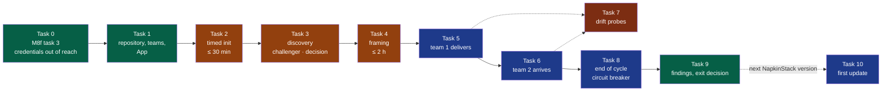

# Team-mode validation — a public rehearsal of the pilot (M9)

> **Location:** `docs/governance/plans/`, the repository's working context.
>
> **For the executing agent:** task by task, in order; each task names who acts —
> **Maintainer** or **Agent** — and what is recorded. A task that finds a defect in the
> framework stops, records it in the defect register, and asks the maintainer whether to
> fix it before going on.

**Goal:** before paying for GitHub Team and starting the private pilot, validate NapkinStack
v0.3.1 end to end the way a team would use it — enforced barriers, two teams in one
repository, agents bounded — on a public project that costs nothing.

**Approach (option C, chosen by the maintainer on 2026-09-17):** the pilot's steps,
rehearsed on an invented public subject and bounded to **one cycle of one week**, with
**deliberate drift probes** during the cycle. A public repository on the organisation's Free
plan enforces rulesets like GitHub Team does for a private one (PDR-0001, clarification of
2026-09-15), with unlimited CI minutes. Rejected: a full rehearsal with no bound (long,
nothing forces a decision); a lab of scripted pull requests only (repeats
`platform/tests/run.sh`, says nothing about whether framing and delivery work).

**The subject:** a **tool library for neighbours** — people lend each other tools. Real
products exist to research at discovery (Peerby, Library of Things, the myTurn lending
software); it splits naturally into two teams joined by a contract; it involves personal
contact data, which exercises "test data only"; and it has nothing in common with the
private pilot's domain.

**Specifications:** [`PRODUCT.md`](../../../PRODUCT.md) §3 — the four users' criteria, the
product's acceptance tests; [PDR-0001](../../pdr/0001-create-a-project-and-receive-updates.md),
[PDR-0002](../../pdr/0002-frame-and-bound-a-project.md),
[PDR-0003](../../pdr/0003-approve-a-change-on-evidence-of-its-behaviour.md),
[ADR-0004](../../adr/0004-give-agents-their-own-github-identity.md).

## Global constraints

- **No cost.** The organisation stays on GitHub Free; the repository is public.
- **Public.** Nothing from the private pilot: not its subject, not its words. Test data
  only — invented names and contacts, never a real person's.
- **The framework as published.** `napkinstack==0.3.1` from PyPI, installed as the README
  says; no local build, no patch during the cycle. A defect found is recorded, not
  hot-fixed in the validation project.
- **The maintainer is the only human.** Tech lead, decider, approver and member of both
  teams. Every other posture is an agent session.
- **Session isolation.** Framer, challenger, each team's author and each verifier is a
  **separate agent session** started with a written brief, and nothing else: the brief is
  posted on the deliverable's issue before the session starts, so anyone can check that no
  knowledge travelled outside the repository.
- **ADR-0004 holds for the agent.** M8f's task 3 is done first (Task 0); without it the
  approval probes prove nothing against the agent.
- **Consent.** Tags and publications of NapkinStack still need the maintainer's explicit
  consent, as in this repository.
- **Identity.** This workstation's global git identity belongs to another account: it must
  never reach a public commit. The maintainer commits as
  `napkinstack-admin <328672623+napkinstack-admin@users.noreply.github.com>`, the agents as
  `napkinstack-agent[bot]`; every push is preceded by a check of the authors it carries.
- **Working directory.** After Task 0 the sandbox lets the agent write only in its working
  directories: the sessions working on `tool-library` run with its clone as their working
  directory.

---

## Roadmap



**Legend** — green: the maintainer's settings and decisions · orange: a timed session with
the maintainer · blue: the one-week cycle, agents delivering · red: probes, pull requests
meant to be refused, never merged. Dotted: runs alongside, or later.

## Postures

| Posture | Who | Session |
|---|---|---|
| Tech lead, decider, approver | The maintainer | — |
| Framer | Agent | One session for discovery stages 1–4, a new one for the framing |
| Challenger | Agent | A fresh session, discovery stage 5 only |
| Team 1 author (`catalog`) | Agent | One session per deliverable, brief on the issue |
| Team 2 author (`loans`) | Agent | One session per deliverable; never shares a session with team 1 |
| Verifier | Agent | A fresh session per test sheet, never an author's |
| Orchestrator | This repository's agent | Starts sessions from their briefs, runs the probes it may run, keeps the log |

## What is measured

Everything is logged in one issue of the validation repository, **"Validation log"**, as it
happens: a comment per event, with its date, duration or link.

| Criterion (`PRODUCT.md` §3 and decisions) | Observed as | Target |
|---|---|---|
| Tech lead — a compliant repository | Time from `uv tool install` to `nstack doctor` compliant; every point where the maintainer needed help, and what for | ≤ 30 min (PDR-0001) |
| Tech lead — framed, first cycle started | Time from the framing session's start to the merge of the accepted charter and cycle; the discovery's duration apart | ≤ 2 h (PDR-0002) |
| Developer joining — no spoken conversation | **Sync events**: a question an author session could not answer from the repository and had to put to the maintainer or to the other team | 0, each one named |
| AI agent — bounded | Every probe of Task 7 with an expected refusal refused by that check or by GitHub; P4 observed | 10 of 10, or a defect recorded |
| Second team — moves forward without blocking the first | Team 2's deliverable merged using only team 1's contract and the repository; team 1's pull requests never waiting on team 2 | 0 sync events, 0 waits |
| Evidence (PDR-0003) | Per sheet pull request: verifier ≠ author, evidence on the head commit, the maintainer's review time and what they found beyond the verifier | Review ≤ 15 min, median |
| Cycle (PDR-0002) | Every merged delivery pull request names a deliverable or carries `out-of-cycle`; the cycle ends on its end date or earlier, no extension | All |
| Questions (PDR-0004) | Every question put to the maintainer: the stage of the project, the hat the question comes from, who it was put to, and whether a check could have answered it | Recorded, from Task 4 on |

The maintainer notes, in each approving review: `review: <n> min · beyond the verifier:
<none | what>`.

---

## Task 0 — M8f task 3: no human credential within the agent's reach

The [M8 plan](2026-09-16-v0.3.0-frame-verify-approve.md)'s M8f task 3, with the sandbox
settings found while preparing it and recorded there.

- [x] **Maintainer**: revoke the token `napkinstack-engineering-os`, then
      `secret-tool clear service napkinstack-gh`.
- [x] **Maintainer**: remove the SSH key behind the `github-napkinstack` alias, on GitHub and
      in `~/.ssh` (and its `Host` block).
- [x] **Maintainer**: withdraw Claude in Chrome's permission on `github.com`.
- [x] **Maintainer**: install the sandbox's seccomp filter
      (`npm install -g @anthropic-ai/sandbox-runtime`); strict sandbox in
      `~/.claude/settings.json` — `allowUnsandboxedCommands: false`, `credentials.files`
      deny `~/.ssh`, `filesystem.allowWrite` for the uv and pre-commit caches,
      `permissions.deny` `Read(~/.ssh/**)` and `Edit(~/.ssh/**)`; restart Claude Code.
- [x] **Agent**: proves `ssh-add -l`, `secret-tool search`, reading `~/.ssh` and a Claude in
      Chrome action on github.com all fail; `gh-agent pr list` and `git fetch` work; removes
      `~/.local/bin/gh-napkinstack` and makes its hook refuse it.
- [x] Recorded in the M8 plan, its task 3 ticked.

**Observed on 2026-09-17** — recorded in the M8 plan, M8f task 3. Deviations: the SSH key file
is kept locally by the maintainer (removed from GitHub, its alias commented); `npm ls -g` inside
the sandbox does not list the seccomp package, yet the SSH agent and the session bus are
unreachable; Claude in Chrome reads no page at all, not only github.com.

## Task 1 — The repository, the teams, the App, the ruleset

- [x] **Maintainer**: create `NapkinStack/tool-library`, **public**, empty (no README, no
      licence).
- [x] **Maintainer**: create the teams `catalog` and `loans` (visible), the maintainer a
      member of both; `maintainers`, `catalog` and `loans` get **write** on `tool-library`.
- [x] **Maintainer**: the `napkinstack-agent` App's installation → **Configure** → add
      `tool-library` to its selected repositories. No new installation, no new permission.
- [x] **Maintainer**: check the organisation's allowed actions: GitHub's own plus
      `astral-sh/setup-uv`, SHA pinning required (checklist G7, G8).
- [x] **Agent**: `gh-agent api installation/repositories` lists both repositories.
- [x] **Maintainer**: from Task 2 on, the orchestrating agent session is started in the
      clone of `tool-library` (this repository added as a readable directory).

The ruleset comes in Task 2: its required checks must exist first.

**Observed on 2026-09-17.** The App lists both repositories. Two of this task's settings are
invisible to it — team permissions and the organisation's Actions policy answer 403 without
the Administration permission: the maintainer's word is the record, and the first CI run
confirms `astral-sh/setup-uv` is allowed. **Deviation:** the orchestrating session stays in
this repository, with the clone added to it (`/add-dir`), so that the session keeps its
memory of the workstream; the sandbox then allows writing in both.

## Task 2 — Timed session: `nstack init` (≤ 30 minutes)

The maintainer runs it, as a tech lead would, from the README only; the agent keeps time
and notes every hesitation. The timer starts at the first command.

- [x] **Maintainer**, in a fresh terminal — the identity first, since `nstack init` commits:
```bash
export GIT_AUTHOR_NAME=napkinstack-admin GIT_COMMITTER_NAME=napkinstack-admin
export GIT_AUTHOR_EMAIL=328672623+napkinstack-admin@users.noreply.github.com
export GIT_COMMITTER_EMAIL=$GIT_AUTHOR_EMAIL
uv tool install napkinstack==0.3.1 --with-executables-from pre-commit
cd "${WORKSPACE:?the directory that will hold the clone}"
nstack init tool-library --project-name tool-library \
  --github-repo NapkinStack/tool-library --owner-team NapkinStack/maintainers
cd tool-library && pre-commit install
git config user.name napkinstack-admin && git config user.email "$GIT_AUTHOR_EMAIL"
```
- [x] **Maintainer**: write the README's sentence, commit.
- [x] **Agent**, in a session whose working directory is the clone: `git log --format='%an
      <%ae>' | sort -u` shows only `napkinstack-admin`'s noreply address; push `main` by URL
      with the App's credential helper passed on the command line — the sandbox forbids
      writing the clone's git configuration:
```bash
git -c credential.https://github.com.helper= \
    -c credential.https://github.com.helper=napkinstack-agent \
    push https://github.com/NapkinStack/tool-library.git main
```
- [x] **Maintainer**: apply the checklist `nstack init` printed — ruleset `main` with the
      four required checks (`Fitness functions`, `PR scope and review budget`,
      `Hooks and secrets`, `Test sheet and cycle`), 1 approval, code owner review, squash
      only, **empty bypass list**; secret protection and push protection; private
      vulnerability reporting; workflow token read-only; the labels `cross-module`,
      `over-budget`, `out-of-cycle`.
- [x] **Maintainer**: `nstack doctor` with a short-lived fine-grained token of their own
      (repository `tool-library`, Administration: read), in their own terminal; the token
      deleted afterwards.
- [x] **Stop the timer** when `doctor` reports no gap. Log: the duration, each help needed,
      each checklist item that was unclear.
- [x] **Agent**: opens the issue **"Validation log"** in `tool-library` and logs Task 2.

**Observed on 2026-09-17** — the log: [`tool-library` issue #1](https://github.com/NapkinStack/tool-library/issues/1).

| Measure | Value |
|---|---|
| `nstack init` to `doctor` with no gap, wall clock | 16:45 → 21:20, a session interrupted several times |
| **Effective time, as the maintainer counts it** | **~25 min — PDR-0001's criterion met** |
| Workstation rules | L1–L6 green from the first run |
| GitHub rules | 8 gaps at first (no ruleset, no Advanced Security, no labels), then 0 |

Conditions the figure carries: the agent created the labels and opened the first pull
request; the maintainer wrote the checklist they were applying; the organisation's settings
(G7–G10) were already in place.

Two defects of the framework, recorded in the register: **D25** (G12's action when no
ruleset exists) and **D26** (a required check GitHub cannot offer before it has run once).
The first pull request of the project stayed `BLOCKED` until the maintainer's approval, then
the agent merged it: the barrier holds in a project from its first day.

## Task 3 — Discovery (the discovery playbook's bounds)

- [x] **Maintainer**: writes the idea in two or three sentences, in an `<idea-file>`
      outside the repository — the original is French, which the repository does not take.
- [x] **Agent**: `nstack discover <idea-file>`, in a branch; the translation it keeps lands
      in the repository, at `docs/project/inputs/`.
- [x] **Framer session** (brief on a "Discovery" issue): stages 1–4 — intake with the
      maintainer, research of existing products (strengths, weaknesses), define, shape.
- [x] **Challenger session**, fresh (its brief: the discovery file's path and the playbook,
      nothing else): stage 5.
- [x] **Maintainer, decider**: go, clarify or kill, recorded with the date. A kill ends the
      delivery part of this validation: the discovery's duration and findings are still
      logged, and the maintainer chooses whether to run it again on another subject.
- [x] Log: the duration of each stage, the number of the challenger's objections kept.

**Observed on 2026-09-17 and 2026-09-18** — the discovery: `tool-library` pull request #5,
merged after the decider's approval; the log, [issue #1](https://github.com/NapkinStack/tool-library/issues/1).

| What | Result |
|---|---|
| Sessions | Three, isolated, each brief published **before** it started: framer stages 1–4 (issue #3), challenger stage 5 (issue #4, did not write 1–4), decider stage 6. The decider's answers posted verbatim |
| Rounds | One; no `clarify`. Stage 2: 19 sourced rows, four pages unreachable and recorded as such. Stage 5: 10 pre-mortem endings, 4 risks with a cheap test and a proposed threshold each, 11 counter-evidence rows, 13 flaws each quoting the line it objects to |
| Decision | **go — an acknowledged rehearsal, criterion A only**; the product criterion dropped, not deferred; no test kept as a spike |
| Checks | `nstack fitness` and `nstack plan` pass; C7 **mutation-tested** on a throwaway copy: a `go` with no `decided_on` fails, a `go` with no `challenger` fails |
| Sync events | 0 — neither session asked for anything outside the repository |
| Deviation | The idea was written in French and translated, the project's language being English; the French original stays outside the repository |

**What the framework earned.** The challenger found, in one session, what the framer's research
had missed and what decides the product: a French product shipping the same thing free today,
the collapse of the French leader of free neighbourhood mutual aid, and a liquidation with
113,000 objects listed. It also showed the success criterion could not be passed or failed and
had no owner — "the framework declared, the product never measured" was the likeliest ending on
the document's own evidence. The decider removed the criterion rather than arrange that ending.
**PDR-0002's extension — a challenger in another session — paid for itself on its first use.**

**What it leaves for Task 4, and criterion A depends on it:** with no deployment and no real
user, what counts as a **verified** deliverable? PDR-0003 asks for a test sheet run by a
verifier, with evidence, and that evidence can no longer come from a neighbourhood. If the
charter does not settle it, a cycle can close green while proving only that the paperwork
moved — the same structure the challenger found, displaced onto criterion A. The charter also
has to settle the eight places in the discovery's sections 1 to 5 that still speak of the
dropped criterion, and carry the factual corrections as constraints.

## Task 4 — Timed session: framing (≤ 2 hours)

The decider holds the framer to what this validation needs; everything else is the framing's
to decide.

- [x] **Framer session**, new: the charter and cycle 1 in one pull request, following the
      framing playbook, with the maintainer answering.
- [x] The charter and the cycle, as the decider accepts them, must give:
  - two modules, `catalog` owned by `NapkinStack/catalog`, `loans` owned by
    `NapkinStack/loans`;
  - `catalog` **provides** a versioned contract that `loans` **consumes**;
  - at least one **user-facing** deliverable per team, with acceptance criteria;
  - `appetite_weeks: 1`, the end date one week after the start;
  - team 2's first deliverable **ready only once** team 1's first one is merged;
  - in the tooling profile: a stack the agents know well, that runs on GitHub-hosted
    runners with GitHub's own actions and `setup-uv` only, and an established tool behind
    the `e2e` verb.
- [x] **Maintainer**: approves; the agent merges. **Stop the timer** at the merge.
- [x] **Agent**: `nstack new-module catalog NapkinStack/catalog standard --user-facing` and
      the same for `loans` (criticality as the charter says), in their own pull requests.
- [x] Log: the duration, the framer's questions the maintainer found useless or missing, and
      what PDR-0004 waits for — per question: the stage, the hat, the recipient, and whether
      the repository could have answered it.

## Task 5 — Team 1 delivers

For each of `catalog`'s deliverables, in order:

- [x] **Agent (orchestrator)**: an issue per deliverable; the author's brief posted on it —
      posture, deliverable id, the playbooks to follow, and nothing about the other team.
- [x] **Team 1 author session**: the test sheet first (from the acceptance criteria), then
      the code, the contract and its producer-side contract tests; opens the pull request
      with `Deliverable: D<n>`.
- [x] **Verifier session**, fresh: runs the sheet before reading the diff; fills results,
      evidence, head commit.
- [x] **Maintainer**: reviews on the sheet, notes review time and findings beyond the
      verifier, approves; the agent merges.
- [x] Log: sync events, review time, findings, CI failures and whether each was legitimate.

## Task 6 — Team 2 arrives

- [x] Starts only after team 1's first deliverable is merged. Same loop as Task 5, with the
      `loans` author sessions.
- [x] Team 2's brief says **nothing** about team 1 beyond "the repository": the contract, its
      version and its tests are found there, or a sync event is logged.
- [x] `loans` declares the contract in `consumes`, with its version; consumer-side contract
      tests.
- [x] Log: every sync event, and any team 1 pull request that waited on team 2.

## Task 7 — Drift probes

Each probe is a pull request titled `Probe P<n> — <what>`, opened by an author session told
to make exactly that change, **never merged**, closed once the refusal is observed and
logged with its link. Probes 9 and 10 are run by the maintainer, as the App, from the
session's shell prompt: the agent's own attempt is refused by Claude Code's auto mode before
it reaches GitHub (M8f).

| # | The pull request | Expected refusal |
|---|---|---|
| P1 | One change to both `catalog` and `loans`, no `cross-module` label | `PR scope and review budget` — P1 |
| P2 | `loans` imports `catalog`'s implementation directly | `Fitness functions` — B2 |
| P3 | `loans` uses `catalog` without declaring it in `consumes` | `Fitness functions` — B1 |
| P4 | `catalog` breaks contract v1 in one pull request, its producer tests edited to match | **To observe**: which check, or only the review, catches it — the contract rules' "to automate" steps |
| P5 | A user-facing change with no test sheet | `Test sheet and cycle` — T1 |
| P6 | A sheet with a scenario passed and no evidence | `Test sheet and cycle` — T3 |
| P7 | A delivery pull request naming no deliverable | `Test sheet and cycle` — K3 |
| P8 | The `out-of-cycle` label with no justification | `Test sheet and cycle` — K4 |
| P9 | CI green, no approval: merge as the App (REST) | GitHub 405, rule violations |
| P10 | The App approves its own pull request | GitHub: cannot approve your own pull request |
| P11 | A delivery pull request after the cycle's end date | `Test sheet and cycle` — K2, circuit breaker |

- [x] P1–P8 during the cycle, once both modules exist. P11 in Task 8.
- [x] A probe that passes when a refusal was expected: a defect in the register, and the
      maintainer decides whether to stop the validation.

## Task 8 — The end of the cycle

- [x] On the end date, whatever remains: **P11** first, then the decider's choice — close
      (completed or shipped) or stop — recorded in the cycle file, no extension.
- [x] Log: deliverables accepted, deferred, dropped; the cycle's real end.

## Task 9 — Findings and the exit decision

- [x] **Agent**: a findings report in the validation log — each criterion of "What is
      measured" against its target, each probe, each sync event, each defect.
- [x] **Agent**: **PDR-0004's success criterion**, met or missed — at least three questions
      the framework should have raised and did not, each attributable to a stage that facts
      an existing check returns would have established. Below three, the decision says the
      direction is abandoned rather than built.
- [x] **Maintainer, decider**: one of — **go**: GitHub Team and the private pilot, as planned
      in the M8 plan; **fix first**: the defects to address in a NapkinStack version before
      the pilot; **rethink**: a decision to reopen, through a PDR or an ADR.
- [x] **Agent**: a summary pull request in this repository — this plan ticked with its
      observations, the defect register, `workstreams.md`, and `PRODUCT.md` §7 if a
      criterion was met or missed. The validation repository stays public as evidence.

## Task 10 — The first update (when the next NapkinStack version exists)

- [x] `nstack update` in `tool-library` to the first version published after 0.3.1: its pull
      request passes the checks with no label and no sheet (D24), adaptations kept,
      modules untouched — PDR-0001's second criterion, rehearsed.

---

## Risks

| Risk | Mitigation |
|---|---|
| Discovery or framing turns into a long design exercise | The playbooks' bounds and the two-hour timer; the decider cuts |
| A session receives knowledge outside the repository, invalidating "zero sync" | Briefs posted on the issue before each session; the orchestrator's prompts are the briefs, verbatim |
| One human approves everything: approval fatigue hides findings | Review time and findings noted per pull request; a long review is itself a finding |
| The stack chosen at framing costs more than the week | `appetite_weeks: 1` and the circuit breaker; a thin slice per deliverable |
| A probe merges by mistake | Titles `Probe P<n>`; the maintainer never approves a probe; the agent merges only approved, non-probe pull requests |
| Real personal data in evidence | Test data only, invented; the security playbook applies |
| Words of the private pilot leak into the public repositories | The leak search on every pull request, as in this repository |

## Self-review

- Every criterion of `PRODUCT.md` §3 has a measure and a target; every decision in force
  (PDR-0001 to 0003, ADR-0004) is exercised by a task or a probe.
- No payment, no private data, no change to NapkinStack during the cycle.
- P4 has no expected check: the handbook marks contract contraction "to automate", so the
  probe records what happens instead of assuming a guard exists.

---

## Observed — the whole validation, 2026-09-18 and 2026-09-19

Everything below is recorded, event by event, in the validation log: `NapkinStack/tool-library`
issue 1. This is its summary.

| Criterion | Target | Observed | |
|---|---|---|---|
| A compliant repository | ≤ 30 min | ~25 min of effective work | met |
| Framed, first cycle started | ≤ 2 h | **148 min wall clock**, ≈ 53 min effective | **missed as written** |
| No spoken conversation | 0 sync events | **0 during the work**, **1 between the teams**, named | met, with one named |
| An agent bounded | 10 of 10 probes | **9 of 11 refused, 2 accepted** | **missed — defect** |
| A second team, not blocking | 0 waits | **0 waits** | met |
| Evidence (PDR-0003) | verifier /= author; review ≤ 15 min median | 3 of 3 verified by a separate session; **median 10 min on 3 measurements** | met |
| The cycle (PDR-0002) | every pull request conforms; no extension | **7 of 7**; closed **7 days early** | met |

**One cycle, one day.** A discovery challenged by a session that had not written it, a charter
and a cycle accepted, two modules with separate owners, a hand-written contract provided by one
and consumed by the other, three deliverables each carrying a test sheet written **before** the
code and run by a session that did not write it, evidence produced by machine and re-runnable,
and a closure recorded before the end date.

**The barriers that protect the human held.** GitHub refused a merge with no approval (405,
naming the missing rule), refused the App's self-approval (422), and `T4` refused a sheet
verified on another commit — which is what proved the author never touched the verifier's cells.

**The barriers that protect the architecture did not.** Probes P2 and P3 were accepted:
`boundaries` builds the real graph from import lines, and a module consuming a contract imports
nothing of its producer. For the only dependency this framework allows between modules, the
declared graph is never confronted with the real one.

## The exit decision — **fix first** (decider, 2026-09-19)

The pilot waits for a version that closes the defects below. The organisation stays on the Free
plan; no seat is bought today.

Not `go`: a real project would be running on a framework whose central promise — the declared
graph compared with the real one — is not kept where it matters. Not `rethink`: no decision
proved wrong, they proved **incompletely applied**, which is implementation work.
