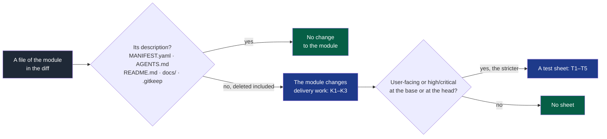

# D24 — What changes a module, through to v0.3.1

- **Date**: 2026-09-17
- **Defect**: D24 (`docs/governance/workstreams.md`), found at the v0.3.0 release
- **Decision**: option C, chosen by the maintainer on 2026-09-17; recorded as a clarification of
  PDR-0003, and a precision of PDR-0002's clarification of 2026-09-16

## Goal

A project generated by NapkinStack can merge the pull request `nstack update` opens: the
check of the test sheet and of the cycle must not read a framework update as delivery work.
PDR-0001's success criterion needs such an update merged in the pilot project.

## The defect

At the v0.3.0 release, a v0.2.0 project updated to v0.3.0: its pull request failed `pr-check`
T1, because the update edits the manifest of the skeleton's `contracts` module, of
criticality `high`; K1 failed too in a project not framed yet. No label lifts T1. PDR-0002's
clarification already exempted "a NapkinStack update" from the cycle rules, but the check read
"changes a module" as "touches a file of it".

## The rule

**Legend** — grey: what the check reads · blue: a rule applies · green: no rule applies.

Rejected: a label lifting T1 (an agent can add it to any pull request); an exemption by
branch name (an agent can name a branch); comparing each file with the template's rendering
(Copier and the network in CI for a documentation question).

## Tasks

- [x] Tests first (`platform/tests/test_pull_request.py`), seen red for the right reason:
      the description only, an empty placeholder, the stricter of base and head, a deleted
      module, a framework update touching `contracts`; a source file still counts.
- [x] `nstack pr-check`: `changes_behaviour`, manifests read at the head and at the merge
      base, `sheet_reason` on both. Mutations: each part of the rule removed turns a test red.
- [x] `platform/tests/run.sh`: its generated-project scenario expected T1 and K1 on a new
      user-facing module's empty scaffold — the suite turned red, as it should. The
      scenario now adds a source file to the module: the rule it proves is unchanged, an
      empty scaffold being no change to a module.
- [x] PDR-0003 clarified; PDR-0002's clarification made precise; the skeleton's
      `05-workflow.md` §7, pull request template and `docs/project/README.md`; the D24 row.
- [x] Pull request, approved, merged.
- [x] Version pull request 0.3.1 (a patch: a check corrected), approved, merged; tag with the
      maintainer's explicit consent; the `pypi` deployment approved.
- [x] Verification on published versions: a v0.2.0 project, adapted, updated to v0.3.1 — its
      update pull request passes `pr-check` without a sheet; a code change to a user-facing
      module still requires one.

## Verification

As for every pull request (`2026-09-16-v0.3.0-frame-verify-approve.md` §Verification): the
suite with `GITHUB_ACTIONS`/`GITHUB_WORKFLOW` set, the hooks, the mutations, the diagrams
parsed, no French, nothing of the pilot's subject, identity, a fresh clone at the head.

## Observed on 2026-09-17

Fix #44, version pull request #45, tag `v0.3.1` on `3b1b3f6` pushed by the App, run
35213258023.

| Verification | Result |
|---|---|
| Publication | `Build` green, `Publish to PyPI` green once the maintainer approved; PyPI 0.3.1, MIT, a wheel and a source archive |
| Attestations | `pypi-attestations verify pypi --repository https://github.com/NapkinStack/engineering-os`, by URL: OK for both files; the certificates name `release.yml@refs/tags/v0.3.1` and `3b1b3f6` |
| The update | A project created by `nstack` 0.2.0 and adapted (the README sentence, an `AGENTS.md` section, a `catalog` module), then `nstack` 0.3.1 from PyPI (`--refresh`, isolated uv directories): `nstack/update-v0.3.1`, no conflict, `_commit: v0.3.1` |
| Its pull request, as opened | `pr-check` with the template's description, no label: `Modules touched : 0`, `Pull request rules: compliant.` — it failed T1 and K1 in v0.3.0 |
| With the M10 migration | `fitness` fails M10 on `catalog` until `user_facing` is declared; then `pr-check` still compliant; hooks, history scan and `doctor` L1–L6 green; `pr-scope` over budget, accepted with the label |
| A code change still counts | A source file added to the user-facing `catalog`: T1 and K1 fail, as before |

