# NapkinStack v0.4.0 — every barrier the framework announces refuses — implementation plan (M10)

> **Location:** `docs/governance/plans/`, the repository's working context.
>
> **For the executing agent:** REQUIRED SUB-SKILL: use superpowers:subagent-driven-development
> (recommended) or superpowers:executing-plans to run this plan task by task. One workstream
> is one pull request, in the order of the roadmap, and each task is TDD: the failing test
> first, seen red for the right reason, then the code (P5). Steps use checkboxes (`- [ ]`).
> The code below was **prototyped on 2026-09-19** in a throwaway clone and run against the
> cases it lists — the unit tests, `platform/tests/run.sh` in full, and the real
> `NapkinStack/tool-library` repository with M9's probes P2, P3 and P4 replayed. It is the
> starting point; the tests decide.

**Goal:** close the five defects M9 found blocking the pilot (D29 to D33) and the one found
while planning this (D35), so that every barrier NapkinStack announces refuses what it claims
to refuse; ship them with PDR-0005 as `napkinstack` v0.4.0; prove each fix on the project that
exposed it, before the pilot starts.

**Architecture:** the layers do not move — the engine checks, the project chooses its tools
(P1). What M9 showed is that several checks read a narrower world than the handbook promises.
One definition of a module's *description* (D24's) now serves four rules, so a new module is
green until it holds code. The boundary check reads the contracts a module's files name, not
only its import lines. A new command, `nstack compat`, runs the project's own contract
comparator on a version someone relies on. The module checks become a required check, and
cover `contracts/`. `pr-check` compares the verifier with the change's authors. `doctor` gains
G13, and says — like every judging command — which framework judges.

**Tech stack:** Python 3.12+ standard library and PyYAML (the engine), Copier 9.18.2, bash
(the test suite), pytest 9.1.1, GitHub Actions pinned by SHA, git trailers, PEP 610
(`direct_url.json`). For the validation project only: oasdiff 1.32.1.

**Specifications:** M9's findings — the validation log (`NapkinStack/tool-library` issue 1)
and its summary in [the M9 plan](2026-09-17-team-mode-validation.md); the defect register rows
D25, D26 and D29 to D35 in [`workstreams.md`](../workstreams.md);
[PDR-0003](../../pdr/0003-approve-a-change-on-evidence-of-its-behaviour.md) (a verifier who is
not the author), [ADR-0004](../../adr/0004-give-agents-their-own-github-identity.md) (the
approval), [PDR-0005](../../pdr/0005-work-on-the-framework-while-using-it.md) (accepted
2026-09-18); the handbook's promises the checks now keep — `skeleton/docs/os/02-modules.md` §5
and §8, `03-contracts.md` §3 to §5; the maintainer's decisions of 2026-09-19, below.

## Global constraints

- **P1** — no stack, format or tool in the engine or the skeleton's rules: `compat` runs the
  project's comparator, named in `docs/tooling-profile.md`, whose column ships empty.
- **P3** — enforcement in CI. **P4** — the kernel within 250 lines (221 today, 225 after
  M10e). **P5** — every new rule has a test seen red before the code. **P6** — every failure
  names the rule, the place and the action. **P7** — no brand in the skeleton's rules.
- **ADR-0003** — English everywhere, machine values included. **ADR-0001** — Copier by its
  API, never unsafe; only `.jinja` files carry variables.
- **Checklist identity** — `CHECKLIST` in `doctor.py` is printed by `init`, checked by
  `doctor`, repeated word for word in `skeleton/README.md.jinja`; `run.sh` verifies it, and
  from M10b in both directions: every required check names a job the skeleton produces.
- **Hooks identity** — `.pre-commit-config.yaml` and `.yamllint.yaml` byte-identical between
  the repository and `skeleton/`.
- **A rule reads the base where a pull request could lower its own requirement** — T1's
  precedent (D24). V1 reads at the base both the freeze and the proof.
- **Public repositories.** Nothing about the pilot's subject; no path from a workstation
  (H1); the authors of every commit checked before every push.
- **Review budget** — 400 lines and 15 files; beyond, the `over-budget` label, justified.
- **Consent** — the tag and the publication need the maintainer's explicit consent. The
  maintainer approves every pull request in the browser; the agent merges with
  `--match-head-commit` (ADR-0004), never approves.
- **The validation project** changes only through reviewed pull requests; a probe is never
  merged, and is closed as soon as its refusal is logged.
- **Dates** written `2026-MM-DD` below are the day the workstream's pull request is opened.
- **Quoted text to replace** is quoted as it reads; in its file it may wrap across lines —
  edit by content, not as one line.

---

## Decisions taken while planning

Implementation choices, each the convention of the field or the smallest one that holds. The
three marked **maintainer** were put to the maintainer on 2026-09-19 and answered.

| Subject | Choice | Reference, verified fact |
|---|---|---|
| A module's description | One definition, `is_description()` in `fitness/manifests.py`: `MANIFEST.yaml`, `AGENTS.md`, `README.md`, `docs/`, `.gitkeep` — D24's, moved out of `pull_request.py` and read by M7, the verbs, `pr-scope` and `boundaries` | D7 counted five definitions of "module"; M9 saw two of them print contradictory counts in one CI run |
| What a module holds | The files git would commit — `git ls-files --cached --others --exclude-standard` — beyond its description; every file outside a repository | PDR-0004's first rule: the committed repository. A workstation's untracked noise is not the module |
| A new module (D33) | Created with `commands: {}`: green while it holds only its description; M7 requires `check` and `test` from its first other file; each verb says "nothing to *verb* yet" | Supersedes M4's "to be declared, failing" ([engine v0.1.0 plan](2026-09-15-engine-v0.1.0.md)): a Rails or Nx generator's output is green. The refusal moves to the required fitness check, with its action |
| What `new-module` prints | Next steps from facts it holds: the test sheet (T1) when user-facing or high or critical; the cycle (K1, K3, K4) from `plan.accepted_cycle` | PDR-0004's fourth rule — a question the framework can answer is not asked; M9's question 4 |
| The module checks (D35) | A final job, `Module checks`: it `needs` the matrix, runs `if: always()`, fails unless every leg passed or none ran; required in G4 | Found while planning: `tool-library`'s ruleset requires four checks, none of them a module's. A matrix leg's name changes with the module, so no ruleset can require it. The *alls-green* pattern, inline — its action is outside G7's allowed list |
| Which modules CI runs | `nstack modules --changed-since <base> --json`: every folder holding a `MANIFEST.yaml`, `contracts/` and `platform/` included | D34: `module-checks.yml` grepped `^modules/`, so the contracts module's own checks never ran |
| One pull request, one module (P1) | `pr-scope` rewritten in Python, counting what `pr-check` counts: modules changed beyond their description, `contracts/` included | D34. An update, or a README edited, changes no module (D24); a contract changed with its implementation is two |
| The real graph (D29) | The contracts a module's files name — a path, a name and version, or a quoted name — and any reference to another module's code: an import, or a path into its folder, on any line of any file it holds | `02-modules.md` §5 and §8. Replayed on `tool-library`: `main` compliant with `loans → catalog (contract catalog-api)`; P2 refused (B2, twice); P3 refused (B1); no false positive |
| A consumed contract and its producer's code | `consumes` licenses the contract, never the producer's code: any import of another module is B2, declared or not | The handbook: "two modules know each other only through their contract". M9 expected B2 of P2, whose import of `catalog` a declared `consumes` would still have licensed. No project imports another module today |
| Two new boundary rules | B6: a consumed contract is provided — contract, version and module; B7: a provided contract holds its document | D34, "provides never confronted". B6 at the head is the automation backlog's "consumers of a removed version = 0", marked high risk |
| Import detection | On an import line: the other module's folder named from the root (`modules.billing`, `modules/billing`), or its package — its folder's name, or `code_name` — opening the statement (Python, Rust, Java) or quoted as a module specifier (JavaScript, TypeScript, Ruby). On any line: a path into its folder, ending where the folder's name does. The old tokens `/name/` and `.name.` go: they matched a module's own subpackages | Two rounds of false positives, each kept as a test: backticked names in `loans`' docstrings on `tool-library` (prototype), then six shapes found by the plan's independent review — an own subpackage, a relative import, a local folder, a source-root alias, a Go package, `../name.csv` |
| A contract version that changes (D30) — **maintainer** | V1: a version frozen at the base — consumed by a module, or `stable` or `deprecated` — changes only when the holding module's `commands.compat`, **as merged**, exits 0. An experimental version nobody consumes is free | Confluent Schema Registry (versions immutable, each new one checked for compatibility), `buf breaking`, oasdiff. Read at the base, so a pull request can neither thaw the version nor bring its own judge — found while prototyping: `compat: "true"` beside the break |
| The comparator | The project's, through a new optional standard verb `compat`, run with `NSTACK_CONTRACT`, `NSTACK_VERSION`, `NSTACK_BASE_PATH`, `NSTACK_HEAD_PATH` | P1. `contracts` stays a reserved verb: validation and generation. Measured with oasdiff 1.32.1 on `tool-library`: P4 refused, naming the property; an optional property added, proven compatible |
| Where V1 runs | `nstack compat <module> --base <base>` in each leg of `module-checks.yml`, after `bootstrap` installs the comparator, with the history fetched | The leg of the module holding the version is the one its change touches; blocking through `Module checks` |
| The verifier (D32) — **maintainer** | T2: the line names people as `@<handle>` anywhere, an agent session as `session <id>` opening it; refused when a name is an author — the pull request's (`PR_AUTHOR`), or of a commit the pull request brings (base to head, merges excluded: CI checks out a merge commit, and updating a branch merges the base in) as author, committer or co-author (GitHub's noreply addresses), or a session such a commit names in an `Agent-Session:` trailer; with a session as verifier, an agent's commit naming no session fails too | The market, compared on 2026-09-19: Gerrit's *Verified* label from another account, with `ignoreSelfApproval`; GitHub's Copilot, one identity to code and another to review; Linux's `Tested-by:` trailer; Phabricator's free-text test plan — D32 itself. A declaration checked against the history: it refuses the session that verifies its own work, not one that lies about its name |
| An agent verifier's own identity | Deferred to the ADR that ADR-0004 already schedules, the one letting a verifier agent's approval count: from then, the verifier is a second App, whose status check the ruleset requires *from that App* (`integration_id`). Recorded as a clarification of ADR-0004 | Separate identities pay when the verdict has authority. Today a human approves every pull request, and with D35 the automated scenarios' results are a required check on the head commit, which no session can write |
| Stale approvals (D31) | G13: `dismiss_stale_reviews_on_push` on the ruleset's pull request rule. `require_last_push_approval` not required | Enabled on both repositories on 2026-09-18; the second setting is redundant once approvals are dismissed, as decided that day |
| D25, D26 | With no ruleset, G12 names the ruleset to create; G4's action says a check can be required only once it has run | M9's Task 2 |
| Which framework judges (PDR-0005) | Every judging command prints `Judged by …` first: published, or UNPUBLISHED with the repository and commit, or "a local checkout at *describe*" — never a path. `nstack modules --json` stays machine-readable | PEP 610: an installer records `direct_url.json` for a repository, archive or folder, never for the registry. Verified on the development install |
| An unpublished framework in CI | `.nstack/install-engine.sh`, one script for the five install steps: `vX.Y.Z` from PyPI; anything else from `_src_path` at the commit Copier recorded (`vX.Y.Z-N-g<sha>`), with a workflow warning; a missing ref fails naming it, never falls back | PDR-0005's acceptance criteria 1 to 5; ADR-0002 unchanged |
| `doctor` and an unpublished framework | L1 a gap when the project pins an unpublished framework or the running engine is unpublished (today "not verified"); L7 a gap when `_src_path` is none of the remote forms the CI script reads (`https://`, `ssh://`, `git@host:`, `gh:`, `gl:`) | PDR-0005: "never reports the project as fully compliant"; one definition of "remote", tested on both sides |
| Scope — **maintainer** | D29 to D35 and PDR-0005 in M10; PDR-0004's design is M11 | The pilot is PDR-0005's first user; PDR-0004's second sample is the pilot's framing |
| The version | v0.4.0, a minor: an updated project can turn red — M7 on a `contracts/` holding a document, B1 and B2's semantics, V1, T2's names, G13, L1 and L7, a fifth required check | ADR-0002; the v0.3.0 precedent |

## What M10 does with everything else

**D34**, the ten findings M9 did not rank as blocking — each one placed or dated, so that
none rots in a holding pen:

| # | Finding | Goes to | Why |
|---|---|---|---|
| 1 | PDR-0002's criterion measures wall clock, and so the decider's availability | Closure: PDR-0002 and `PRODUCT.md` §3 clarified — effective work, wall clock recorded beside it | The pilot measures it next; it was measured the wrong way twice |
| 2 | `contracts/` and `platform/` are modules for one check, invisible to two | M10b | The contracts module's own checks never ran |
| 3 | The handbook contradicts itself on criticality | M11, PDR-0004's design | A question of hats and stages; the pilot's framing is its next sample |
| 4 | `playbooks/framing.md` says nothing about technical framing | M11 | Same |
| 5 | Technical decisions taken at framing have no artefact to land in | M11 | Same |
| 6 | `provides` is never confronted with reality | M10c — B7 | The same code as D29 |
| 7 | `pr-check` and `pr-scope` count modules differently | M10b | The same code as #2 |
| 8 | Two agent sessions on one checkout corrupt each other's branches | M10e — one kernel line | The pilot will run parallel sessions |
| 9 | Two teams conflict on `CODEOWNERS` at their first commit | Dated: after the pilot, if its teams hit it | GitHub reads one `CODEOWNERS`; an ordered insertion removes only some conflicts. Measured before building |
| 10 | `uv.lock` neither committed nor ignored | `tool-library`'s own fix, M10h; no framework rule | A stack's lock file is the project's (P1) |

**PDR-0004** — its design is M11, planned after M10h from two samples: M9's log (five
questions the framework should have raised, one contradiction) and the pilot's framing, the
first real one. Its success criterion is already met.

**GitHub as an acquisition channel** — the maintainer's request, separate and after this plan:
installing the tool from the forge, as Spec Kit documents it. PDR-0005 speaks of projects
pinning a ref, not of people discovering the tool: it needs its own product decision.

---

## Roadmap

```mermaid
flowchart LR
    A["M10a<br/>a new module is green<br/>D33"]:::pr --> B["M10b<br/>module checks refuse<br/>D35 · D34"]:::pr
    B --> C["M10c<br/>the contract graph<br/>D29"]:::pr
    C --> D["M10d<br/>contract versions<br/>D30"]:::pr
    D --> E["M10e<br/>a verifier, not an author<br/>D32"]:::pr
    E --> F["M10f<br/>stale approvals<br/>D31 · D25 · D26"]:::pr
    F --> G["M10g<br/>never judged in silence<br/>PDR-0005"]:::pr
    G --> R["Release<br/>v0.4.0"]:::release
    R --> H["M10h<br/>proved on tool-library<br/>probes replayed"]:::human
    H --> Z["Closure<br/>exit decision"]:::human
    Z -.->|"go"| P["Pilot<br/>private, GitHub Team"]:::todo

    classDef pr fill:#1f2937,color:#fff
    classDef release fill:#1e3a8a,color:#fff
    classDef human fill:#065f46,color:#fff
    classDef todo fill:#374151,color:#fff
```



**Legend** — dark grey: a workstream, one pull request · blue: the release · green: the
maintainer with the agent, on the validation project, then the decision · light grey,
dotted: what the decision opens.

**Why this order.** M10a before M10b: a module leg on the skeleton's `contracts/` would
otherwise run its placeholders, which exit 1. M10b before M10d: V1 runs in the module legs and
blocks through `Module checks`. M10g last: its first output line, `Judged by …`, would shift
every output the earlier workstreams assert, and it touches the workflows M10b and M10d
change.

## File map

| File | a | b | c | d | e | f | g |
|---|---|---|---|---|---|---|---|
| `src/napkinstack/fitness/manifests.py` | description, M7 | | | | | | |
| `src/napkinstack/modules.py` | verbs, next steps | `listing` | | | | | |
| `src/napkinstack/templates/module/MANIFEST.yaml` | `commands: {}` | | comments | | | | |
| `src/napkinstack/pull_request.py` | shared description | | | | T2 | | |
| `src/napkinstack/fitness/pr_scope.py` (replaces `pr_scope.sh`) | | create | | | | | |
| `src/napkinstack/cli.py` | help | `modules`, `pr-scope` | help | `compat` | | | `Judged by` |
| `src/napkinstack/fitness/boundaries.py` | | | rewrite | | | | |
| `src/napkinstack/compat.py` | | | | create | | | |
| `src/napkinstack/doctor.py` | | G4 jobs | | | | G13, G12, G4 | L1, L7 |
| `src/napkinstack/provenance.py` | | | | | | | create |
| `skeleton/.github/workflows/module-checks.yml` | | rewrite | | `compat` | | | install |
| `skeleton/.github/workflows/governance.yml`, `pull-request.yml` | | | | | `PR_AUTHOR` | | install |
| `skeleton/.nstack/install-engine.sh` | | | | | | | create |
| `skeleton/contracts/MANIFEST.yaml.jinja` | `commands: {}` | | | `compat` hint | | | |
| `skeleton/README.md.jinja` | new module | G4 | | left to wire | | G13, D26 | pins |
| `skeleton/AGENTS.md` | | | | | §0, §4 | | |
| `skeleton/docs/os/` | 09 §2 §4 | 02 §7 | 02 §5 §8 | 03 §3 §4, 09 §2 | 05 §7 | | |
| `skeleton/playbooks/verification.md`, `pull_request_template.md` | | | | | ✓ | | |
| `skeleton/contracts/README.md`, `AGENTS.md`, `docs/tooling-profile.md` | | | | ✓ | | | |
| `.github/workflows/governance.yml` (this repository) | | `pr-scope` | | | | | |
| `platform/tests/test_guardrails.py` | M7, next steps | P, `modules` | B1–B7 | | | | |
| `platform/tests/test_compat.py`, `test_provenance.py` | | | | create | | | create |
| `platform/tests/test_pull_request.py` | | | | | T2 | | |
| `platform/tests/run.sh` | verbs | G4 both ways | | | | doctor | engine, doctor |
| `platform/README.md`, `CONTRIBUTING.md`, `docs/governance/automation-backlog.md` | | ✓ | ✓ | ✓ | | | ✓ |
| `docs/adr/0004-…`, `docs/pdr/0005-…` | | | | | clarification | clarification | status |

## This plan's pull request

This plan; `workstreams.md` — the M10 row, D35 added to the register, D25, D26 and D34 given
their destination, the sequence diagram; and the M9 plan's Task 10, ticked by mistake at M9's
closure — no version after 0.3.1 exists yet — unticked and carried to M10h.

---

## M10a — A new module is green, and says what its pull requests will need (D33) — PR 1

The field's convention is that a generator's output passes the project's checks. M9 measured
the opposite: on a module created by `nstack new-module`, `nstack check` and `nstack test`
exited 1 — the template declares both as commands that fail — and the module's first pull
request needed work nobody had named.

### Task 1 — One description, and M7 once there is something to check

**Files:**
- Modify: `src/napkinstack/fitness/manifests.py` (docstring, imports, `DESCRIPTION`,
  `is_description`, `module_content`, M7)
- Modify: `src/napkinstack/pull_request.py` (the description moves out)
- Test: `platform/tests/test_guardrails.py`

**Interfaces:**
- Produces: `manifests.DESCRIPTION: set[str]`;
  `manifests.is_description(path: str) -> bool` — `path` relative to the module's folder;
  `manifests.module_content(folder: Path) -> list[str]` — sorted, relative to the folder.
- Removes: `pull_request.changes_behaviour`; its one caller uses `not is_description(...)`.

- [x] **Step 1: Write the failing tests**

In `platform/tests/test_guardrails.py`, `MANIFEST_CASES`, replace the `"M7 missing verb"` case:
```python
    "M7 missing verb, the module holds code": (lambda r: write_module(
        r, "billing", degrade(commands={"check": "true"}), {"src/app.py": "x\n"}), "M7", True),
```
and before `test_new_module_high_criticality_generates_a_runbook`:
```python
def test_a_module_holding_only_its_description_declares_no_verb(tmp_path, capsys):
    """D33: nothing to check yet, so nothing to declare; docs/ and placeholders included."""
    folder = write_module(tmp_path, "billing", degrade(commands={}), {"docs/adr/0001.md": "x\n", "src/.gitkeep": ""})
    assert manifests.run(tmp_path) == 0, capsys.readouterr().out
    (folder / "src" / "app.py").write_text("x\n", encoding="utf-8")
    assert manifests.run(tmp_path) == 1
    assert "[M7] billing" in capsys.readouterr().out
```

- [x] **Step 2: Run them**

Run: `uv run pytest -q platform/tests/test_guardrails.py -k "M7 or description"`
Expected: FAIL — `test_a_module_holding_only_its_description_declares_no_verb`: M7 reported
on a module holding nothing but its description.

- [x] **Step 3: The description, what a module holds, and M7**

`fitness/manifests.py` — the docstring's M7 line:
```
  M7  standard verbs declared (check / test at least), once the module holds more than
      its description
```
`import subprocess` beside the other imports; after `TYPES`:
```python
DESCRIPTION = {"MANIFEST.yaml", "AGENTS.md", "README.md"}
```
before `parse_date`:
```python
def is_description(path: str) -> bool:
    """A module's description — its manifest, AGENTS.md, README.md, docs/ — or an empty
    placeholder, `path` relative to the module's folder. Changing it changes no behaviour
    (D24); a module holding nothing else has nothing to check yet (D33)."""
    return path in DESCRIPTION or path.startswith("docs/") or path.rsplit("/", 1)[-1] == ".gitkeep"


def module_content(folder: Path) -> list[str]:
    """What a module holds beyond its description, relative to its folder: the files git
    would commit — tracked, or untracked and not ignored — or every file outside a repository."""
    listed = subprocess.run(["git", "ls-files", "-z", "--cached", "--others", "--exclude-standard", "."],
                            cwd=folder, capture_output=True, text=True)
    if listed.returncode == 0:
        files = [path for path in listed.stdout.split("\0") if path]
    else:
        files = [path.relative_to(folder).as_posix() for path in folder.rglob("*") if path.is_file()]
    return sorted(path for path in files if not is_description(path))
```
M7 in `check_manifest` becomes:
```python
    # M7 - standard verbs, once there is something to check (D33)
    commands = data.get("commands") or {}
    content = module_content(path.parent)
    for verb in REQUIRED_COMMANDS:
        if content and not commands.get(verb):
            fail(rel, "M7", f"standard verb missing: commands.{verb}, and the module holds more "
                            f"than its description ({content[0]}).\n      Action: declare its stack's "
                            "command in the manifest (docs/os/09-platform.md §2).")
```
`pull_request.py` — import `is_description` with `MODULE_DIRS` and `find_manifests`; delete
`DESCRIPTION` and `changes_behaviour`; in `touched_modules`,
`and changes_behaviour(file[len(folder) + 1:])` becomes `and not is_description(file[len(folder) + 1:])`.

- [x] **Step 4: Run them, then all the unit tests**

Run: `uv run pytest -q platform/tests`
Expected: all pass.

- [x] **Step 5: Commit**

```bash
git add src/napkinstack/fitness/manifests.py src/napkinstack/pull_request.py platform/tests/test_guardrails.py
git commit -m "M10a — One description of a module, and M7 once it holds something to check"
```

### Task 2 — A new module passes its verbs, and names what CI will ask

**Files:**
- Modify: `src/napkinstack/modules.py` (`create`, `next_steps`, `run_verb`)
- Modify: `src/napkinstack/templates/module/MANIFEST.yaml`, `skeleton/contracts/MANIFEST.yaml.jinja`
- Modify: `src/napkinstack/cli.py` (the `manifests` help, stale since M10: `M1-M10`)
- Test: `platform/tests/test_guardrails.py`, `platform/tests/run.sh`

**Interfaces:**
- Consumes: `manifests.module_content`; `plan.charter_accepted(root) -> bool`,
  `plan.accepted_cycle(root) -> tuple[Path, dict] | None`.
- Produces: `modules.next_steps(root: Path, name: str, criticality: str, user_facing: bool) -> list[str]`.

- [x] **Step 1: Write the failing tests**

`test_guardrails.py`, before `test_new_module_high_criticality_generates_a_runbook`:
```python
def test_new_module_says_what_its_pull_requests_will_need(tmp_path, capsys):
    """D33: green as created; the sheet and the cycle named from facts nstack holds."""
    from test_plan import framed

    assert cli.main(["new-module", "face", "acme/web", "standard", "--user-facing", "--root", str(tmp_path)]) == 0
    output = capsys.readouterr().out
    assert "carries a test sheet (user-facing)" in output and "The project is not framed" in output, output
    for verb in ("check", "test"):
        assert cli.main([verb, "face", "--root", str(tmp_path)]) == 0
        assert f"face: holds only its description, nothing to {verb} yet." in capsys.readouterr().out
    framed(tmp_path)
    assert cli.main(["new-module", "back", "acme/web", "high", "--root", str(tmp_path)]) == 0
    output = capsys.readouterr().out
    assert "carries a test sheet (criticality high)" in output and "a ready deliverable of 01-first.md" in output, output
```
`platform/tests/run.sh` — replace the block `-> verbs: a command still to declare MUST fail
while naming the module (P1, D22)` with:
```bash
echo "-> verbs: a module holding only its description has nothing to check yet (D33)"
for verb in check test; do
  OUT=$(uv run nstack "$verb" demo --root "$SC" 2>&1) \
    && echo "$OUT" | grep -qF "demo: holds only its description, nothing to $verb yet" \
    || { echo "FAIL: nstack $verb on a new module is not green."; echo "$OUT"; exit 1; }
done

echo "-> verbs: a module holding code with no check declared MUST fail while naming it (P1, D22)"
printf 'code\n' > "$SC/modules/demo/src/app.txt"
if OUT=$(uv run nstack check demo --root "$SC" 2>&1); then
  echo "FAIL: a module holding code with no check went green."; echo "$OUT"; exit 1
fi
echo "$OUT" | grep -qF "FAIL [check] module 'demo': commands.check not declared" \
  || { echo "FAIL: failure without the module or the command."; echo "$OUT"; exit 1; }
```
and, in the block `-> verbs: with no module, all modules, first failure named`, after the
`new-module zeta` line, give it code:
```bash
printf 'code\n' > "$SC/modules/zeta/src/app.txt"
```

- [x] **Step 2: Run them — `run.sh` first, since it runs pytest before its own blocks**

Run: `uv run bash platform/tests/run.sh` with the `run.sh` edit only.
Expected: FAIL — "nstack check on a new module is not green".
Run: `uv run pytest -q platform/tests/test_guardrails.py -k says_what` with the pytest case added.
Expected: FAIL — the next steps name neither the sheet nor the cycle.

- [x] **Step 3: The verbs, the next steps, the templates**

`modules.py` — imports (`plan` is imported inside `next_steps`: `plan` reads `HANDLE` from
this module, and a module-level import would be a cycle):
```python
from napkinstack.fitness.manifests import find_manifests, module_content
```
beside `NEEDS_RUNBOOK`:
```python
NEEDS_SHEET = {"high", "critical"}  # pull_request.SHEET_CRITICALITIES, T1
```
the end of `create`, from the confirmation line:
```python
    print(f"Module created: modules/{name} (owner {owner}, criticality {criticality}"
          + (", user-facing" if user_facing else "") + (", runbook to fill in" if runbook else "") + ").")
    print("It holds only its description: fitness, check and test pass as it stands.")
    for number, step in enumerate(next_steps(root, name, criticality, user_facing), 1):
        print(("\nNext steps:\n" if number == 1 else "") + f"  {number}. {step}")
    return 0


def next_steps(root: Path, name: str, criticality: str, user_facing: bool) -> list[str]:
    """What the module's first pull requests will be asked, from facts nstack holds (D33)."""
    from napkinstack.fitness import plan  # here: plan reads HANDLE from this module
    steps = ["Creation ADR in docs/adr/: capability, boundary, alternatives",
             "MANIFEST.yaml: the responsibility in ONE sentence",
             f"modules/{name}/AGENTS.md: what is specific to the module, never the kernel",
             "Before its first file of code: commands.check and commands.test for its stack — "
             "fitness (M7) requires them once the module holds more than its description"]
    if user_facing or criticality in NEEDS_SHEET:
        why = "user-facing" if user_facing else f"criticality {criticality}"
        steps.append(f"Every pull request that changes its behaviour carries a test sheet ({why}), "
                     "run by a verifier who is not its author (T1–T5, docs/os/05-workflow.md §7)")
    cycle = plan.accepted_cycle(root) if plan.charter_accepted(root) else None
    if cycle is None:
        steps.append("The project is not framed: delivery work needs an accepted charter and cycle (K1), "
                     "or the out-of-cycle label with its justification (K4)")
    else:
        steps.append(f"Delivery work names a ready deliverable of {cycle[0].name} (K3), "
                     "or carries the out-of-cycle label with its justification (K4)")
    steps.append(f"nstack fitness, then nstack check {name} and nstack test {name}")
    return steps
```
In `run_verb`, the loop opens with:
```python
    for target in targets:
        if not module_content(known[target]):
            print(f"-> {target}: holds only its description, nothing to {verb} yet.")
            continue
```
`templates/module/MANIFEST.yaml` — the `commands` block:
```yaml
# Standard verbs: the same names everywhere, running this module's stack commands
# (docs/os/09-platform.md §2). `nstack <verb> <module>` runs them from this folder.
# No stack is imposed. check and test are required once the module holds more than its
# description (fitness M7): declare them before its first file of code.
commands: {}
#  check:                        # under 2 min: format, lint, types
#  test:                         # NEVER starts another module
#  bootstrap:                    # optional: make the module usable from a fresh clone
#  run:                          # optional: local start, with doubles for the dependencies
#  e2e:                          # optional: end-to-end scenarios; evidence written to .evidence/
```
`skeleton/contracts/MANIFEST.yaml.jinja` — the `commands` block:
```yaml
# Declared with the first contract: check and test are required once this folder holds one
# (fitness M7). The tools are the project's, named in docs/tooling-profile.md.
commands: {}
#  check:     # validates every contract document against its format
#  test:      # the contract tests, run on both sides (docs/os/03-contracts.md §5)
```
`cli.py` — the `manifests` help: `"manifests, lifecycles, deprecations (M1-M10)"`.

- [x] **Step 4: Run them, then the suite**

Run: `uv run pytest -q platform/tests && uv run bash platform/tests/run.sh`
Expected: all pass; `Platform tests: OK`. The generated project's scenario already creates a
module and runs `fitness` and the hooks on it: they stay green.

- [x] **Step 5: Commit**

```bash
git add src/napkinstack/modules.py src/napkinstack/templates/module/MANIFEST.yaml \
  skeleton/contracts/MANIFEST.yaml.jinja src/napkinstack/cli.py platform/tests/test_guardrails.py platform/tests/run.sh
git commit -m "M10a — A new module passes its verbs, and names the sheet and the cycle its pull requests need"
```

### Task 3 — The handbook, the README, the pull request

- [x] `skeleton/docs/os/09-platform.md` §2 — the sentence "`check` and `test` are mandatory,
      `bootstrap` and `e2e` optional; a new module declares them as "to be declared",
      failing, until the team puts its own stack's commands there." becomes:
      "`check` and `test` are mandatory as soon as the module holds anything beyond its
      description — its manifest, `AGENTS.md`, `README.md`, `docs/`; `bootstrap` and `e2e`
      are optional. A new module holds only its description: its verbs report that there is
      nothing to run yet, and `nstack fitness` asks for `check` and `test` with its first
      other file."
- [x] Same file, §4's diagram: `C3["check and test commands<br/>to be declared, failing"]`
      becomes `C3["No command yet: green<br/>until its first code"]`, and
      `E["The team declares its<br/>own stack's commands"]` becomes
      `E["The team declares its stack's<br/>check and test, then codes"]`.
- [x] `skeleton/README.md.jinja`, "What is not provided": "A new module therefore declares
      commands "to be declared", which fail: wiring `check`, `test` and `run` onto your own
      tooling is your job." becomes "A new module therefore declares no command: it is green
      while it holds only its description, and `nstack fitness` asks for `check` and `test`
      with its first file of code. Wiring them, and `run`, onto your own tooling is your job."
- [x] `workstreams.md`: the D33 row, "v0.4.0: M10a".
- [x] Verification (§ *Verification — every pull request*), then the pull request
      `M10a — D33: a new module is green, and says what its pull requests will need`.

## M10b — The module checks refuse, and one count of modules (D35, D34) — PR 2

A project's modules run `check`, `test` and `e2e` in `module-checks.yml`, one matrix leg per
module — and none of those legs is a required check: a pull request whose module tests fail
merges once approved. The legs also skip `contracts/`, whose own checks never ran, and
`pr-scope` counts modules its own way.

### Task 1 — One list of modules, one count

**Files:**
- Create: `src/napkinstack/fitness/pr_scope.py`; delete `src/napkinstack/fitness/pr_scope.sh`
- Modify: `src/napkinstack/modules.py` (`listing`), `src/napkinstack/cli.py` (`modules`, `pr-scope`)
- Modify: `.github/workflows/governance.yml` — this repository's scope job
- Test: `platform/tests/test_guardrails.py`

**Interfaces:**
- Consumes: `pull_request.touched_modules(root, fork, files) -> dict[str, list[dict]]`.
- Produces: `modules.listing(root: Path, base: str | None = None) -> list[dict[str, str]] | None`
  — `{"name", "folder"}` per module, `None` for an unknown base;
  `pr_scope.run(root: Path, base: str) -> int`; the command `nstack modules [--changed-since BASE] [--json]`.

- [x] **Step 1: Write the failing tests**

`test_guardrails.py` — `import json`; the P cases become:
```python
A_MODULE = {"modules/a/MANIFEST.yaml": 1, "modules/a/x.txt": 1}
TWO_MODULES = {**A_MODULE, "modules/b/MANIFEST.yaml": 1, "modules/b/y.txt": 1}
PR_CASES = {
    "P1 two modules": (TWO_MODULES, {}, "FAIL [P1]", 1),
    "P1 cross-module label": (TWO_MODULES, {"PR_LABELS": "cross-module"}, "WARNING [P1]", 0),
    "P1 another module's description changes no module": (
        {**A_MODULE, "modules/b/MANIFEST.yaml": 1, "modules/b/README.md": 1}, {}, "Modules touched : 1", 0),
    "P1 contracts/ is a module (D34)": (
        {**A_MODULE, "contracts/MANIFEST.yaml": 1, "contracts/a-api/v1/schema.json": 1}, {}, "FAIL [P1]", 1),
    "P2 over budget": ({"modules/a/x.txt": 3}, {"MAX_LINES": "1"}, "WARNING [P2] Over the review budget.", 0),
}
```
and before `OWNERS`:
```python
def test_modules_changed_since(tmp_path, capsys):
    """One list of modules for CI: every folder holding a manifest, contracts/ included (D34)."""
    base = repository(tmp_path, {**A_MODULE, "contracts/MANIFEST.yaml": 1, "docs/notes.md": 1})
    assert cli.main(["modules", "--root", str(tmp_path), "--changed-since", base, "--json"]) == 0
    assert json.loads(capsys.readouterr().out) == [{"name": "a", "folder": "modules/a"},
                                                   {"name": "contracts", "folder": "contracts"}]
    assert cli.main(["modules", "--root", str(tmp_path), "--changed-since", "nope"]) == 1
    assert "FAIL [modules] base 'nope' not found" in capsys.readouterr().out
```

- [x] **Step 2: Run them**

Run: `uv run pytest -q platform/tests/test_guardrails.py -k "pr_scope or modules_changed"`
Expected: FAIL — `P1 another module's description…` counts 2; `P1 contracts/ is a module`
passes P1; `modules` is not a command.

- [x] **Step 3: `pr-scope` in Python, and the list of modules**

`src/napkinstack/fitness/pr_scope.py`:
```python
"""
Fitness function 3 — Pull request scope and size.

  P1  one pull request = one module                  BLOCKING  (docs/os/02-modules.md §7)
  P2  review budget respected                        WARNING   (docs/os/05-workflow.md §4)

A module is touched when the pull request changes it beyond its description — the same
count as `nstack pr-check`'s (D34): editing a manifest, an AGENTS.md, a README or docs/
changes no module, and contracts/ is a module like any other.

The `cross-module` label lifts P1, the `over-budget` label documents P2: both are visible,
so the exceptions are countable (docs/os/10-measurement.md §3).

Usage :  nstack pr-scope [--root ROOT] [--base BASE]
In CI :  PR_LABELS comes from the pull_request event; MAX_LINES and MAX_FILES override the
         budget.
"""

from __future__ import annotations

import os
import re
import subprocess
from pathlib import Path

from napkinstack.pull_request import touched_modules

GENERATED = re.compile(r"(package-lock\.json|yarn\.lock|pnpm-lock\.yaml|Cargo\.lock|go\.sum|uv\.lock"
                       r"|\.generated\.|/generated/)")


def _git(root: Path, *args: str) -> str:
    return subprocess.run(["git", *args], cwd=root, capture_output=True, text=True).stdout


def run(root: Path, base: str) -> int:
    if subprocess.run(["git", "rev-parse", "--verify", "--quiet", base], cwd=root,
                      capture_output=True).returncode:
        print(f"Base '{base}' not found — check skipped.")
        return 0
    files = _git(root, "diff", "--name-only", f"{base}...HEAD").split()
    if not files:
        print("No file changed.")
        return 0
    labels = {label.strip() for label in os.environ.get("PR_LABELS", "").split(",") if label.strip()}
    fork = _git(root, "merge-base", base, "HEAD").strip() or base
    modules = touched_modules(root, fork, files)
    print(f"Files changed   : {len(files)}")
    print(f"Modules touched : {len(modules)}" + "".join(f"\n  - {folder}" for folder in modules))

    status = 0
    if len(modules) > 1 and "cross-module" in labels:
        print("\nWARNING [P1] Cross-module PR allowed by label.\n"
              "  Counted as an exception. A rising rate means a boundary is decaying.")
    elif len(modules) > 1:
        print(f"\nFAIL [P1] This PR changes {len(modules)} modules.\n"
              "  One PR = one module (docs/os/02-modules.md §7).\n"
              "  A contract change goes through an expand/contract sequence,\n"
              "  never a single PR (docs/os/03-contracts.md §4).\n"
              "  If the exception is justified: add the 'cross-module' label.")
        status = 1

    lines = changed = 0
    for row in _git(root, "diff", "--numstat", f"{base}...HEAD").splitlines():
        added, removed, path = row.split("\t", 2)
        if GENERATED.search(path):
            continue
        changed += 1
        lines += (int(added) if added.isdigit() else 0) + (int(removed) if removed.isdigit() else 0)
    max_lines, max_files = int(os.environ.get("MAX_LINES", 400)), int(os.environ.get("MAX_FILES", 15))
    print(f"\nReview budget : {lines}/{max_lines} lines, {changed}/{max_files} files")
    if (lines > max_lines or changed > max_files) and "over-budget" in labels:
        print("WARNING [P2] Over budget, justified by label.")
    elif lines > max_lines or changed > max_files:
        print("WARNING [P2] Over the review budget.\n"
              "  A project's throughput is its VERIFICATION throughput, not its generation rate.\n"
              "  Split it up, or add the 'over-budget' label with a justification\n"
              "  (generation, mechanical migration, mass rename).")
    return status
```
`git rm src/napkinstack/fitness/pr_scope.sh`.

`modules.py`, before `_modules`:
```python
def listing(root: Path, base: str | None = None) -> list[dict[str, str]] | None:
    """Every module — a folder holding a MANIFEST.yaml, contracts/ and platform/ included —
    or, given a base, those with a file changed since it; None when the base is unknown."""
    found = [{"name": manifest.parent.name, "folder": manifest.parent.relative_to(root).as_posix()}
             for manifest in find_manifests(root)]
    if base is None:
        return found
    if subprocess.run(["git", "rev-parse", "--verify", "--quiet", f"{base}^{{commit}}"], cwd=root,
                      capture_output=True).returncode:
        return None
    changed = subprocess.run(["git", "diff", "--name-only", f"{base}...HEAD"], cwd=root,
                             capture_output=True, text=True).stdout.split()
    return [module for module in found if any(path.startswith(f"{module['folder']}/") for path in changed)]
```
`cli.py` — `import json`, and `pr_scope` imported with the other fitness modules; `os`,
`subprocess`, `PACKAGE` and `_script` go; in their place:
```python
def _modules(args: argparse.Namespace) -> int:
    found = modules.listing(args.root, args.changed_since)
    if found is None:
        print(f"FAIL [modules] base '{args.changed_since}' not found in {args.root}.\n"
              "      Action: fetch the history (fetch-depth: 0), or pass an existing commit.")
        return 1
    print(json.dumps(found) if args.json else "\n".join(f"{m['name']}\t{m['folder']}" for m in found))
    return 0
```
and the commands:
```python
    md = _add(sub, "modules", "the project's modules, or those a change touches", _modules)
    md.add_argument("--changed-since", metavar="BASE", help="only the modules with a file changed since BASE")
    md.add_argument("--json", action="store_true", help="a JSON list, for CI")
    ps = _add(sub, "pr-scope", "one PR = one module, review budget (P1-P2)",
              lambda a: pr_scope.run(a.root, a.base))
```
`.github/workflows/governance.yml`, job `scope`: the step `One PR = one module`, which runs
`bash src/napkinstack/fitness/pr_scope.sh` — a file this task deletes — is replaced; the steps
after the checkout become:
```yaml
      - uses: astral-sh/setup-uv@bec219d24cd3e171d82865faccec33120bb574f4 # v10.1.0

      - name: Dependencies
        run: uv sync --locked

      - name: One PR = one module
        env:
          PR_LABELS: ${{ join(github.event.pull_request.labels.*.name, ',') }}
          BASE_REF: ${{ github.base_ref }}
        run: uv run nstack pr-scope --root . --base "origin/$BASE_REF"
```

- [x] **Step 4: Run them, then the suite**

Run: `uv run pytest -q platform/tests && uv run bash platform/tests/run.sh`
Expected: all pass. `run.sh` already runs `nstack pr-scope` in a generated project.

- [x] **Step 5: Commit**

```bash
git add src/napkinstack/fitness/pr_scope.py src/napkinstack/modules.py src/napkinstack/cli.py \
  .github/workflows/governance.yml platform/tests/test_guardrails.py
git commit -m "M10b — One list of modules for CI, and pr-scope counting what pr-check counts"
```

### Task 2 — `Module checks`, a required check (D35)

**Files:**
- Modify: `skeleton/.github/workflows/module-checks.yml` (rewritten below)
- Modify: `src/napkinstack/doctor.py` (`JOBS`), `skeleton/README.md.jinja` (G4's line)
- Test: `platform/tests/run.sh`

- [x] **Step 1: The failing test — G4 read in both directions**

`run.sh`, the Python block after `-> init: GitHub checklist printed, identical to the skeleton
README and to the CI jobs` becomes:
```python
import re, sys, yaml
jobs = {workflow: [job["name"] for job in yaml.safe_load(
            open(f"skeleton/.github/workflows/{workflow}", encoding="utf-8"))["jobs"].values()]
        for workflow in ("governance.yml", "pull-request.yml", "module-checks.yml")}
# Every job of the two rule workflows is required; of the module workflow, only the job that
# fails when any module failed: the matrix jobs carry names no ruleset knows in advance.
names = jobs["governance.yml"] + jobs["pull-request.yml"] + ["Module checks"]
absents = [name for name in names if f"`{name}`" not in sys.argv[1]]
if absents:
    sys.exit(f"FAIL: skeleton CI jobs missing from the checklist (G4): {absents}")
unknown = [name for name in re.findall(r"`([^`]+)`", sys.argv[1]) if name not in sum(jobs.values(), [])]
if unknown:
    sys.exit(f"FAIL: required checks no skeleton job produces (G4): {unknown}")
```
and the simulated API's required checks gain `{"context": "Module checks"}`.

- [x] **Step 2: Run it**

Run: `uv run bash platform/tests/run.sh`
Expected: FAIL — `skeleton CI jobs missing from the checklist (G4): ['Module checks']`.

- [x] **Step 3: The workflow, the checklist**

`skeleton/.github/workflows/module-checks.yml` (the `compat` step comes with M10d):
```yaml
name: Modules

# Runs the standard verbs on the touched modules only: nstack reads their commands
# from the module's MANIFEST.yaml, assuming no stack (P1). A module is a folder holding a
# MANIFEST.yaml, contracts/ included: nstack lists them, the workflow defines nothing.
# The level of validation is proportionate to the criticality declared in the MANIFEST
# (docs/os/07-governance.md §6).
#
# `Module checks` is the required check: a matrix job carries each module's name, which no
# ruleset can require in advance, so this job fails whenever one of them failed.
#
# Module names come from the paths the pull request changed: they are never inserted
# into a script, only read from an environment variable.

on:
  pull_request:
  push:
    branches: [main]

permissions:
  contents: read

jobs:
  discover:
    name: Touched modules
    runs-on: ubuntu-latest
    outputs:
      modules: ${{ steps.list.outputs.modules }}
      any: ${{ steps.list.outputs.any }}
    steps:
      - uses: actions/checkout@3d3c42e5aac5ba805825da76410c181273ba90b1 # v7.0.1
        with:
          fetch-depth: 0
          persist-credentials: false

      - uses: astral-sh/setup-uv@bec219d24cd3e171d82865faccec33120bb574f4 # v10.1.0

      - name: NapkinStack, the project version
        run: |
          VERSION=$(yq '._commit' .copier-answers.yml)
          uv tool install "napkinstack==${VERSION#v}" --with-executables-from pre-commit

      - id: list
        env:
          BASE: ${{ github.event.pull_request.base.sha || github.event.before }}
        run: |
          if ! git rev-parse --verify --quiet "$BASE^{commit}" >/dev/null; then
            BASE=$(git rev-list --max-parents=0 HEAD | tail -1)
          fi
          MODS=$(nstack modules --root . --changed-since "$BASE" --json)
          echo "modules=$MODS" >> "$GITHUB_OUTPUT"
          if [ "$MODS" = '[]' ]; then echo "any=false" >> "$GITHUB_OUTPUT";
          else echo "any=true" >> "$GITHUB_OUTPUT"; fi
          echo "Touched modules: $MODS"

  validate:
    name: ${{ matrix.module.name }}
    needs: discover
    if: needs.discover.outputs.any == 'true'
    runs-on: ubuntu-latest
    strategy:
      fail-fast: false
      matrix:
        module: ${{ fromJson(needs.discover.outputs.modules) }}
    env:
      MODULE: ${{ matrix.module.name }}
      FOLDER: ${{ matrix.module.folder }}
    steps:
      - uses: actions/checkout@3d3c42e5aac5ba805825da76410c181273ba90b1 # v7.0.1
        with:
          persist-credentials: false

      - uses: astral-sh/setup-uv@bec219d24cd3e171d82865faccec33120bb574f4 # v10.1.0

      - name: NapkinStack, the project version
        run: |
          VERSION=$(yq '._commit' .copier-answers.yml)
          uv tool install "napkinstack==${VERSION#v}" --with-executables-from pre-commit

      - name: Declared criticality
        id: crit
        run: |
          LEVEL=$(yq '.module.criticality // "standard"' "$FOLDER/MANIFEST.yaml")
          echo "level=$LEVEL" >> "$GITHUB_OUTPUT"
          echo "Criticality: $LEVEL"

      - name: bootstrap
        run: nstack bootstrap "$MODULE"

      # All levels — docs/os/05-workflow.md §7
      - name: check
        run: nstack check "$MODULE"

      - name: test
        run: nstack test "$MODULE"

      # Levels high and critical — not wired up yet (D9)
      - name: Integration tests
        if: steps.crit.outputs.level == 'high' || steps.crit.outputs.level == 'critical'
        run: |
          echo "Not wired up: integration tests (D9)"

      # Optional verb: the module's end-to-end scenarios, when declared (docs/os/09-platform.md §2).
      - name: e2e
        run: nstack e2e "$MODULE"

      # The evidence the test sheet links to (docs/os/05-workflow.md §7), kept even on failure.
      - name: Evidence of the scenarios
        if: always()
        uses: actions/upload-artifact@043fb46d1a93c77aae656e7c1c64a875d1fc6a0a # v7.0.1
        with:
          name: evidence-${{ matrix.module.name }}
          path: ${{ matrix.module.folder }}/.evidence/
          include-hidden-files: true
          if-no-files-found: ignore
          retention-days: 30

  checks:
    name: Module checks
    needs: [discover, validate]
    if: always()
    runs-on: ubuntu-latest
    steps:
      - name: Every touched module passed
        env:
          DISCOVERED: ${{ needs.discover.result }}
          VALIDATED: ${{ needs.validate.result }}
        run: |
          echo "Touched modules: $DISCOVERED. Their checks: $VALIDATED."
          [ "$DISCOVERED" = success ] && { [ "$VALIDATED" = success ] || [ "$VALIDATED" = skipped ]; }
```
Besides the list and the final job: the criticality is read with `yq`. The old `grep | awk`
kept the quotes `new-module` writes (`criticality: "high"`), so the high-criticality step never
matched.

`doctor.py`:
```python
JOBS = ("Fitness functions", "PR scope and review budget", "Hooks and secrets", "Test sheet and cycle",
        "Module checks")
```
`skeleton/README.md.jinja`, G4's line:
```
- [x] Required checks: `Fitness functions`, `PR scope and review budget`, `Hooks and secrets`, `Test sheet and cycle`, `Module checks`
```

- [x] **Step 4: Run the suite**

Run: `uv run bash platform/tests/run.sh`
Expected: `Platform tests: OK` — including the generated project's hooks, where actionlint and
zizmor read the new workflow (both measured green on the prototype).

- [x] **Step 5: Commit**

```bash
git add skeleton/.github/workflows/module-checks.yml src/napkinstack/doctor.py skeleton/README.md.jinja platform/tests/run.sh
git commit -m "M10b — Module checks: one required check that fails when any module's checks fail (D35)"
```

### Task 3 — The handbook, the backlog, the pull request

- [x] `skeleton/docs/os/02-modules.md` §7, after the rule's paragraph: "A module is touched
      when its behaviour changes: editing only its description — manifest, `AGENTS.md`,
      `README.md`, `docs/` — touches none, and `contracts/` is a module like the others."
- [x] `platform/README.md`: `pr-scope`'s row "P1-P2: one PR = one module — changed beyond
      its description, `contracts/` included — review budget"; `nstack modules` in the
      commands; the file table names `fitness/pr_scope.py`.
- [x] `README.md`'s command table and `skeleton/README.md.jinja`'s "The commands": `nstack
      modules [--changed-since <base>]` — the project's modules, or those a change touches.
- [x] `docs/governance/automation-backlog.md`: the `pr_scope.sh` reference becomes
      `fitness/pr_scope.py`.
- [x] `workstreams.md`: D35 "v0.4.0: M10b"; D34 #2 and #7 done; D7 "M10b: one definition
      for scope and CI; the rest after the pilot".
- [x] Verification, then the pull request
      `M10b — D35: the module checks become a required check; one count of modules`.
      Release note: **a project adds `Module checks` to its ruleset's required checks**,
      after a first pull request has run it (D26).

---

## M10c — The contract graph (D29) — PR 3

`boundaries` built the real graph from import lines, and a module that consumes a contract
imports nothing of its producer. For the only dependency the framework allows between
modules, the declared graph was never confronted with the real one: P3 emptied `consumes`
with every check green, P2 walked around B2 with a path manipulation, and B4 warned on a real
dependency.

### Task 1 — The failing tests: B1 to B7, and no false positive

**Files:**
- Test: `platform/tests/test_guardrails.py` — from `CUSTOMERS = …` to
  `test_boundaries_unreadable_manifest_without_traceback`, replaced

- [x] **Step 1: Write them**

```python
CUSTOMERS = degrade(module__name="customers", module__owner="acme/customers")


def provides(manifest, module, versions=("v1",)):
    """The module provides `<module>-api` in each version, at contracts/<module>-api/<version>."""
    return {**manifest, "provides": [{"contract": f"{module}-api", "version": version,
                                      "path": f"contracts/{module}-api/{version}", "stability": "stable"}
                                     for version in versions]}


def consumes(manifest, module, version="v1"):
    return {**manifest, "consumes": [{"contract": f"{module}-api", "version": version, "module": module}]}


PRODUCER = provides(CUSTOMERS, "customers")
READS = {"src/client.py": 'SPEC = ROOT / "contracts" / "customers-api" / "v1" / "openapi.yaml"\n'}


def test_valid_boundaries(tmp_path, capsys):
    write_module(tmp_path, "billing")
    write_module(tmp_path, "customers", CUSTOMERS)
    assert boundaries.run(tmp_path) == 0, capsys.readouterr().out


def test_a_contract_read_and_declared_is_the_real_graph(tmp_path, capsys):
    """D29: the only dependency allowed between modules is seen, and warns of nothing."""
    write_contract(tmp_path, "customers-api/v1")
    write_module(tmp_path, "billing", consumes(VALID, "customers"), READS)
    write_module(tmp_path, "customers", PRODUCER)
    assert boundaries.run(tmp_path) == 0
    output = capsys.readouterr().out
    assert "billing → customers (contract customers-api)" in output and "WARNING" not in output, output


def write_contract(root: Path, *versions: str) -> None:
    for version in versions:
        (root / "contracts" / version).mkdir(parents=True)
        (root / "contracts" / version / "openapi.yaml").write_text("openapi: 3.1.0\n", encoding="utf-8")


BOUNDARY_CASES = {
    "B1 a contract read without being declared (P3)": ({
        "billing": (VALID, READS), "customers": (PRODUCER, {})}, "B1", True),
    "B1 another version than the one consumed": ({
        "billing": (consumes(VALID, "customers"), {"src/client.py": 'SPEC = "contracts/customers-api/v2"\n'}),
        "customers": (provides(CUSTOMERS, "customers", ("v1", "v2")), {})}, "B1", True),
    "B2 an import of another module": ({
        "billing": (VALID, {"src/app.py": "from modules.customers.api import customer\n"}),
        "customers": (CUSTOMERS, {})}, "B2", True),
    "B2 its package, even with its contract consumed": ({
        "billing": (consumes(VALID, "customers"), {**READS, "src/app.py": "from customers.models import Customer\n"}),
        "customers": (PRODUCER, {})}, "B2", True),
    "B2 internal implementation": ({
        "billing": (VALID, {"src/app.js": 'import { db } from "../customers/src/db";\n'}),
        "customers": (CUSTOMERS, {})}, "B2", True),
    "B2 a path into its folder, whatever the line (P2)": ({
        "billing": (VALID, {"src/app.py": 'sys.path.insert(0, "../customers/src")\n'}),
        "customers": (CUSTOMERS, {})}, "B2", True),
    "B2 its package named by code_name": ({
        "billing": (VALID, {"src/App.java": "import com.acme.customers.Customer;\n"}),
        "customers": (degrade(CUSTOMERS, module__code_name="com.acme.customers"), {})}, "B2", True),
    "B2 a path dependency in a build file": ({
        "billing": (VALID, {"pyproject.toml": 'customers = { path = "../customers" }\n'}),
        "customers": (CUSTOMERS, {})}, "B2", True),
    "B3 circular dependency": ({
        "billing": (VALID, {"src/app.py": "from modules.customers.api import customer\n"}),
        "customers": (CUSTOMERS, {"src/app.py": "from modules.billing.api import invoice\n"})},
        "B3", True),
    "B4 a contract consumed and never read": ({
        "billing": (consumes(VALID, "customers"), {}), "customers": (PRODUCER, {})}, "B4", False),
    "B5 another module's table": ({
        "billing": (degrade(data={"owns": ["invoices"], "shared": []}), {}),
        "customers": (CUSTOMERS, {"src/query.py": 'SQL = "SELECT * FROM invoices"\n'})}, "B5", True),
    "B6 a consumed contract nobody provides": ({
        "billing": (consumes(VALID, "customers"), READS), "customers": (CUSTOMERS, {})}, "B6", True),
    "B6 the wrong producer named": ({
        "billing": ({**VALID, "consumes": [{"contract": "customers-api", "version": "v1", "module": "orders"}]}, READS),
        "customers": (PRODUCER, {})}, "B6", True),
    "B7 a provided contract with no document": ({
        "customers": (provides(CUSTOMERS, "customers", ("v9",)), {})}, "B7", True),
}


@pytest.mark.parametrize(("modules_map", "rule", "fails"), BOUNDARY_CASES.values(), ids=BOUNDARY_CASES.keys())
def test_boundaries(tmp_path, capsys, modules_map, rule, fails):
    write_contract(tmp_path, "customers-api/v1", "customers-api/v2")
    for name, (manifest, sources) in modules_map.items():
        write_module(tmp_path, name, manifest, sources)
    code = boundaries.run(tmp_path)
    expect(code, capsys.readouterr().out, rule, fails)


NOT_ANOTHER_MODULE = {
    "a submodule of its own named like another module": "from billing import customers\n",
    "a local file named like another module": 'import { list } from "./customers";\n',
    "a sentence naming the other module": "# Never reads customers directly: from `customers`, only the contract.\n",
    "a word that starts like another module": "from billing.customersupport import ticket\n",
    "a subpackage of its own named like another module": "from billing.customers.models import Customer\n",
    "a relative import of its own": "from ..customers.models import Customer\n",
    "a local folder named like another module": 'import { list } from "./lib/customers/list";\n',
    "an alias of its own source root": 'import { list } from "@/customers/list";\n',
    "a Go package of its own": 'import "example.com/billing/customers/store"\n',
    "a file named like another module": 'DATA = open("../customers.csv")\n',
}


@pytest.mark.parametrize("line", NOT_ANOTHER_MODULE.values(), ids=NOT_ANOTHER_MODULE.keys())
def test_boundaries_no_false_positive(tmp_path, capsys, line):
    write_module(tmp_path, "billing", VALID, {"src/app.py": line})
    write_module(tmp_path, "customers", CUSTOMERS)
    assert boundaries.run(tmp_path) == 0, capsys.readouterr().out
```

- [x] **Step 2: Run them against today's `boundaries.py`**

Run: `uv run pytest -q platform/tests/test_guardrails.py -k "boundar or real_graph"`
Expected: FAIL, measured on the prototype — 16 tests: both B1, five B2 (an import, its
package with its contract consumed, a path on any line, `code_name`, a build file), both B6,
B7; five of the "no false positive" lines — today's `/name/` and `.name.` tokens report them
as B1; and `test_a_contract_read_and_declared_is_the_real_graph`, on B4's warning.

### Task 2 — `boundaries.py`: the contracts a module reads

**Files:**
- Modify: `src/napkinstack/fitness/boundaries.py` (rewritten below)
- Modify: `src/napkinstack/cli.py` (help `B1-B7`)

**Interfaces:**
- Consumes: `manifests.module_content`.
- Produces: rules B1 to B7; `boundaries.run(root: Path) -> int` unchanged. The real graph
  printed as `name → producer (contract name), other (code)`.

- [x] **Step 1: The file**

```python
#!/usr/bin/env python3
"""
Fitness function 2 — Boundaries between modules.

Compares the DECLARED graph (manifests) with the REAL graph read from the modules' files,
then checks for cycles (docs/os/02-modules.md §8, docs/os/07-governance.md §3). Two
modules know each other only through a contract: the real graph is the contracts a
module's files read, and any reference to another module's code is a violation.

Rules:
  B1  no contract read without being declared: a module reads only the contracts it
      provides, or consumes in the version it declares
  B2  no reference to another module's code: an import of it, or a path into its folder
  B3  no circular dependency between modules
  B4  consumed contract never read (warning)
  B5  no direct access to another module's data (tables declared elsewhere)
  B6  a consumed contract is provided: its contract, version and module match a provides entry
  B7  a provided contract exists: its path holds its document

DETECTION — textual and deliberately simple, with no stack assumed.
  - A contract is read where a module's file names its path (contracts/billing-api/v1),
    its name and version (billing-api/v1), or its name as a quoted string ("billing-api").
  - Another module's code is referenced where an import line names its folder from the root
    (modules.billing, modules/billing) or its package — opening the statement, or quoted as a
    module specifier — or where any line reaches into its folder (../billing/, modules/billing/).
    Its package is its folder's name, or `code_name` when the code names it otherwise
    (com.acme.billing).
A module's files are those git would commit, beyond its description (D33). A false positive
is fixed by rewording the line, or by `code_name`; a false negative by the stack's own import
checker, named in docs/tooling-profile.md and run by the module's `check` verb.

Usage :  nstack boundaries [--root ROOT]
"""

from __future__ import annotations
import re
import sys
from pathlib import Path

import yaml

from napkinstack.fitness.manifests import module_content

MODULE_DIRS = ["modules", "services", "apps", "packages"]
SOURCE_SUFFIXES = {
    ".py", ".ts", ".tsx", ".js", ".jsx", ".go", ".rs", ".java", ".kt",
    ".rb", ".php", ".cs", ".swift", ".scala", ".ex", ".exs",
}
SKIP_DIRS = {"node_modules", "dist", "build", "target", "vendor", ".git",
             "__pycache__", ".venv", "venv", "coverage", "generated"}
IMPORT_HINTS = re.compile(
    r"\b(import|from|require|use|using|include|#include|extern crate|go:import)\b|"
    r"^\s*(import|from)\s", re.IGNORECASE
)
TOO_LARGE = 1_000_000  # bytes: a generated file or a data dump, not code

failures: list[str] = []
warnings: list[str] = []


def fail(rule: str, where: str, message: str) -> None:
    failures.append(f"[{rule}] {where}\n      {message}")


def warn(rule: str, where: str, message: str) -> None:
    warnings.append(f"[{rule}] {where}\n      {message}")


def _entries(data: dict, section: str) -> list[dict]:
    value = data.get(section)
    return [entry for entry in value if isinstance(entry, dict)] if isinstance(value, list) else []


def load_modules(root: Path) -> dict[str, dict]:
    modules: dict[str, dict] = {}
    for base in MODULE_DIRS:
        d = root / base
        if not d.is_dir():
            continue
        for manifest in sorted(d.glob("*/MANIFEST.yaml")):
            try:
                data = yaml.safe_load(manifest.read_text(encoding="utf-8")) or {}
            except yaml.YAMLError:
                continue  # reported by nstack manifests (M2)
            mod = data.get("module") if isinstance(data, dict) else None
            if not isinstance(mod, dict):
                continue  # reported by nstack manifests (M2)
            section = data.get("data") if isinstance(data.get("data"), dict) else {}
            owns = section.get("owns") if isinstance(section.get("owns"), list) else []
            name = mod.get("name") or manifest.parent.name
            modules[name] = {
                "path": manifest.parent,
                "dirname": manifest.parent.name,
                "code_name": mod.get("code_name") or name,
                "provides": _entries(data, "provides"),
                "consumes": _entries(data, "consumes"),
                "owns_data": set(owns),
            }
    return modules


def read_files(module: dict):
    """(relative path, lines) of every text file the module holds beyond its description."""
    for relative in module_content(module["path"]):
        path = module["path"] / relative
        if any(part in SKIP_DIRS for part in Path(relative).parts) or not path.is_file():
            continue
        if path.stat().st_size > TOO_LARGE:
            continue
        data = path.read_bytes()
        if b"\0" in data[:8192]:
            continue  # binary
        yield relative, data.decode("utf-8", errors="ignore").splitlines()


def code_patterns(other: dict) -> tuple[re.Pattern, re.Pattern]:
    """(import of its code, path into its folder). On an import line: its folder named from the
    root, or its package opening the statement (Python, Rust, Java) or quoted as a module
    specifier (JavaScript, TypeScript, Ruby). On any line: a relative or rooted path into its
    folder — ending where the folder's name does, so that ../billing.csv is not billing."""
    code, folder = re.escape(other["code_name"]), re.escape(other["dirname"])
    rooted = "|".join(MODULE_DIRS)
    imports = re.compile(rf"(?<![\w-])(?:{rooted})[./]{folder}(?![\w-])"
                         rf"|^\s*(?:from|import|(?:pub\s+)?use|extern\s+crate)\s+{code}(?![\w-])"
                         rf"|(?:\bfrom\s+|\b(?:require|import)\s*\(\s*|^\s*(?:import|require)\s+)"
                         rf"[\"'](?:@[\w.-]+/)?{code}(?:/[^\"']*)?[\"']")
    reach = re.compile(rf"(?<![\w.-])\.\./(?:\.\./)*{folder}(?=/|[\"'\s)]|$)"
                       rf"|(?<![\w-])(?:{rooted})/{folder}/")
    return imports, reach


def contract_patterns(modules: dict[str, dict]) -> list[tuple[str, str | None, re.Pattern]]:
    """(contract, version or None, pattern) for every contract a module provides."""
    patterns = []
    for mod in modules.values():
        for provided in mod["provides"]:
            name, version = provided.get("contract"), provided.get("version")
            if not isinstance(name, str) or not isinstance(version, str):
                continue
            n, v = re.escape(name), re.escape(version)
            paths = [rf"(?<![\w-]){n}/{v}(?![\w-])"]
            if isinstance(provided.get("path"), str):
                paths.append(re.escape(provided["path"].strip("/")))
            patterns.append((name, version, re.compile("|".join(paths))))
            patterns.append((name, None, re.compile(rf"[\"'`]{n}[\"'`]")))
    return patterns


def check_contracts(root: Path, modules: dict[str, dict]) -> dict[str, dict[str, set[str]]]:
    """B6, B7, B1 and B4. Returns module -> producer -> contracts it reads from it."""
    provided = {(p.get("contract"), p.get("version")): name
                for name, mod in modules.items() for p in mod["provides"]}

    for name, mod in modules.items():
        # B7 - what a module provides exists
        for p in mod["provides"]:
            label = f"{p.get('contract')} {p.get('version')}"
            path = root / str(p.get("path") or "")
            if not p.get("path") or not path.exists() or (path.is_dir() and not any(
                    f.is_file() for f in path.rglob("*"))):
                fail("B7", name, f"provides {label} at '{p.get('path')}', which holds no document.\n"
                                 "      Action: commit the contract there, or correct provides[].path.")
        # B6 - what a module consumes is provided
        for c in mod["consumes"]:
            key = (c.get("contract"), c.get("version"))
            producer = provided.get(key)
            offered = ", ".join(f"{k[0]} {k[1]} by {v}" for k, v in sorted(provided.items(), key=str)) or "none"
            if producer is None:
                fail("B6", name, f"consumes {key[0]} {key[1]}, which no module provides (provided: {offered}).\n"
                                 "      Action: consume a provided version, or have its producer declare it.")
            elif c.get("module") not in (None, producer):
                fail("B6", name, f"consumes {key[0]} {key[1]} from '{c.get('module')}', which is "
                                 f"provided by '{producer}'.\n      Action: name the producer.")

    patterns = contract_patterns(modules)
    reads: dict[str, dict[str, set[str]]] = {name: {} for name in modules}
    for name, mod in modules.items():
        own = {p.get("contract") for p in mod["provides"]}
        consumed = {(c.get("contract"), c.get("version")) for c in mod["consumes"]}
        seen: set[tuple[str, str | None]] = set()
        for relative, lines in read_files(mod):
            for lineno, line in enumerate(lines, 1):
                for contract, version, pattern in patterns:
                    if contract in own or not pattern.search(line):
                        continue
                    producer = next((v for k, v in provided.items() if k[0] == contract), None)
                    if producer:
                        reads[name].setdefault(producer, set()).add(contract)
                    where = f"{mod['path'].relative_to(root) / relative}:{lineno}"
                    versions = {v for c, v in consumed if c == contract}
                    # B1 - a contract read without being declared, or in another version
                    if (contract, version) in seen:
                        continue
                    seen.add((contract, version))
                    if not versions:
                        fail("B1", where, f"'{name}' reads contract '{contract}' without declaring it.\n"
                                          f"      Action: add {{contract: {contract}, version: "
                                          f"{version or '<version>'}, module: {producer}}} to consumes "
                                          "in its MANIFEST, or stop reading it.")
                    elif version is not None and version not in versions:
                        fail("B1", where, f"'{name}' reads {contract} {version} and consumes "
                                          f"{', '.join(sorted(versions))}.\n      Action: declare the version "
                                          "it reads (docs/os/03-contracts.md §4, the migration step).")
        # B4 - declared but never read
        for c in mod["consumes"]:
            if c.get("contract") and not any(c.get("contract") in read for read in reads[name].values()):
                warn("B4", name, f"consumes {c.get('contract')} {c.get('version')} but no file reads it.\n"
                                 "      Action: remove the entry, or name the contract where it is read.")
    return reads


def check_code(root: Path, modules: dict[str, dict]) -> dict[str, set[str]]:
    """B2 and B5. Returns module -> modules whose code it references."""
    code: dict[str, set[str]] = {name: set() for name in modules}
    others = {name: code_patterns(mod) for name, mod in modules.items()}
    for name, mod in modules.items():
        for relative, lines in read_files(mod):
            source = Path(relative).suffix in SOURCE_SUFFIXES
            for lineno, line in enumerate(lines, 1):
                imports = source and IMPORT_HINTS.search(line)
                for other_name, (code_import, reach) in others.items():
                    if other_name == name:
                        continue
                    via_import = imports and code_import.search(line)
                    if not via_import and not reach.search(line.replace("\\", "/")):
                        continue
                    code[name].add(other_name)
                    fail("B2", f"{mod['path'].relative_to(root) / relative}:{lineno}",
                         f"'{name}' references the code of '{other_name}'"
                         f"{' through an import' if via_import else ' through a path into its folder'}. "
                         f"Two modules know each other only through a contract (docs/os/03-contracts.md): "
                         f"read the one '{other_name}' provides.")

    # B5 - access to someone else's data
    for name, mod in modules.items():
        others_tables = {t: o for o, m in modules.items() if o != name for t in m["owns_data"]}
        if not others_tables:
            continue
        for relative, lines in read_files(mod):
            text = "\n".join(lines).lower()
            for table, owner in others_tables.items():
                if re.search(rf"\b(from|join|into|update|table)\s+[\"'`\[]?{re.escape(table.lower())}\b", text):
                    fail("B5", str(mod["path"].relative_to(root) / relative),
                         f"'{name}' accesses table '{table}' owned by '{owner}'. "
                         f"Coupling through the database (docs/os/08-quality.md §8).")
                    break
    return code


def find_cycles(graph: dict[str, set[str]]) -> list[list[str]]:
    cycles, stack, visiting, visited = [], [], set(), set()

    def walk(node: str) -> None:
        if node in visiting:
            cycles.append(stack[stack.index(node):] + [node])
            return
        if node in visited:
            return
        visiting.add(node)
        stack.append(node)
        for nxt in sorted(graph.get(node, ())):
            walk(nxt)
        stack.pop()
        visiting.discard(node)
        visited.add(node)

    for node in sorted(graph):
        walk(node)
    return cycles


def run(root: Path) -> int:
    failures.clear()
    warnings.clear()
    modules = load_modules(root)
    if not modules:
        print("0 module(s): no boundary to check.")
        return 0

    reads = check_contracts(root, modules)
    code = check_code(root, modules)
    for cycle in find_cycles(code):
        fail("B3", " → ".join(cycle),
             "circular dependency: these modules have become inseparable "
             "(docs/os/02-modules.md §9).")

    print(f"Modules checked: {len(modules)}")
    print("Real graph detected:")
    for name in sorted(modules):
        edges = [f"{producer} (contract {', '.join(sorted(contracts))})"
                 for producer, contracts in sorted(reads[name].items())]
        edges += [f"{other} (code)" for other in sorted(code[name])]
        print(f"  {name} → {', '.join(edges) or '-'}")

    for w in warnings:
        print(f"  WARNING {w}")
    for f in failures:
        print(f"  FAIL {f}")

    if failures:
        print(f"\n{len(failures)} boundary violation(s).")
        return 1
    print("Boundaries: compliant.")
    return 0


if __name__ == "__main__":
    sys.exit(run(Path(sys.argv[1] if len(sys.argv) > 1 else ".").resolve()))
```
`cli.py`: `"declared graph against real graph (B1-B7)"`.

- [x] **Step 2: Run the tests**

Run: `uv run pytest -q platform/tests`
Expected: all pass.

- [x] **Step 3: Mutations** (`PYTHONDONTWRITEBYTECODE=1`, each reverted after its run)

| Mutation | Expected red |
|---|---|
| B7 without its `not path.exists()` | `B7 a provided contract with no document` |
| B6 ignores `module` | `B6 the wrong producer named` |
| B1 ignores the version | `B1 another version than the one consumed` |
| `reach` searched on import lines only | `B2 a path into its folder, whatever the line (P2)`, `B2 a path dependency in a build file` |
| `reach` ending with `(?![\w-])` again | `a file named like another module` |
| the quoted specifier accepts backticks | `a sentence naming the other module` |
| the statement branch of `imports` without `^\s*` | `a submodule of its own named like another module` |
| the `/name/` token back on import lines | `a local folder named like another module`, `a Go package of its own` |

- [x] **Step 4: Commit**

```bash
git add src/napkinstack/fitness/boundaries.py src/napkinstack/cli.py platform/tests/test_guardrails.py
git commit -m "M10c — The real graph is the contracts a module reads; any reference to another module's code is B2 (D29)"
```

### Task 3 — Replayed on the project that exposed it

A reading task: `tool-library` is cloned, never changed.

- [x] Clone it and judge it:
```bash
TL=$(mktemp -d)/tl && git clone -q https://github.com/NapkinStack/tool-library.git "$TL"
uv run nstack boundaries --root "$TL"
```
Expected: `loans → catalog (contract catalog-api)`, `Boundaries: compliant.`, no
warning — B4's false warning of M9 gone.
- [x] For P2 and P3: `gh-agent pr diff 22 --repo NapkinStack/tool-library > p2.diff` (then 23),
      `git -C "$TL" apply p2.diff`, `uv run nstack boundaries --root "$TL"`,
      `git -C "$TL" checkout -- .` between the two.
      Expected: P2 — `FAIL [B2] modules/loans/src/loans/catalogue.py:75` (the path) and
      `:76` (the import); P3 — `FAIL [B1]`, "'loans' reads contract 'catalog-api' without
      declaring it".
- [x] The outputs go in the pull request's VERIFIED block.

### Task 4 — The handbook, the templates, the pull request

- [x] `skeleton/docs/os/02-modules.md` §5: "An import towards an undeclared module fails in
      CI. A dependency declared but unused is reported." becomes "A contract a module reads
      without declaring it fails in CI, and so does any reference to another module's code,
      declared or not; a contract declared and never read is reported."
- [x] Same file, §8, at the end of "Allowed but worth watching": "They live outside the
      module folders: a module never imports another module's code, and declaring its
      contract in `consumes` does not change that."
- [x] `src/napkinstack/templates/module/MANIFEST.yaml`: `# Contracts PROVIDED by this
      module.` gains `` `path` holds its document (B7). ``; `consumes`' second comment line
      becomes `# CI compares it with the contracts this module's files read: one read and
      not declared fails (B1), one declared and never read is reported (B4), one nobody
      provides fails (B6).` — on two lines.
- [x] `platform/README.md`: `nstack boundaries` — "B1-B7: the contracts each module reads
      against those it declares, references to another module's code, cycles, data access,
      contracts provided and consumed". Its **Calibration** section: "A false positive is
      fixed by declaring the dependency." becomes "A false positive is fixed by rewording the
      line, or by the module's `code_name` when its code names it otherwise; declaring a
      contract never licenses another module's code."
- [x] `docs/governance/automation-backlog.md`: "Consumers of a removed version = 0" moves to
      the automated rules — `nstack boundaries` B6, 2026-MM-DD; "Declared graph = real graph"
      gains the same date, and "contracts included".
- [x] `workstreams.md`: D29 and D34 #6, "v0.4.0: M10c".
- [x] Verification; the pull request `M10c — D29: the real graph is the contracts a module
      reads`, `over-budget` (the rewrite of one file and its tests; ~400 lines).
      Release note: **a module importing another module's code now fails, declared or not.**

---

## M10d — A contract version someone relies on changes only with a proof (D30) — PR 4

Renaming a required field of `v1` in place, producer edited to match, passed every fitness
rule (probe P4). The handbook calls backward compatibility of contracts a cheap fitness
function, "a comparison of schemas" — and the only thing that caught P4 was the producer's
own `e2e`, by luck.

### Task 1 — The failing tests

**Files:**
- Create: `platform/tests/test_compat.py`

- [x] **Step 1: Write them**

```python
"""
Contract versions (D30): a frozen version changes only with a proof of compatibility. Every
case proves the rule fails (P5) and names itself (P6). Run by platform/tests/run.sh.
"""

from __future__ import annotations

import os
import subprocess

import pytest
import yaml

from napkinstack import cli
from test_guardrails import CUSTOMERS, VALID, consumes, provides, write_module

IDENTITY = {"GIT_AUTHOR_NAME": "test", "GIT_AUTHOR_EMAIL": "test@example.invalid",
            "GIT_COMMITTER_NAME": "test", "GIT_COMMITTER_EMAIL": "test@example.invalid"}
DOCUMENT = "contracts/customers-api/v1/openapi.yaml"
PROVEN = ('test -f "$NSTACK_BASE_PATH/openapi.yaml" && test -f "$NSTACK_HEAD_PATH/openapi.yaml" '
          '&& [ "$NSTACK_CONTRACT $NSTACK_VERSION" = "customers-api v1" ] '
          '&& ! diff -q "$NSTACK_BASE_PATH/openapi.yaml" "$NSTACK_HEAD_PATH/openapi.yaml" >/dev/null')


def git(root, *args: str) -> str:
    return subprocess.run(["git", *args], cwd=root, env={**os.environ, **IDENTITY}, check=True,
                          capture_output=True, text=True).stdout.strip()


def contracts_module(root, compat: str | None) -> None:
    folder = root / "contracts"
    (folder / "customers-api" / "v1").mkdir(parents=True, exist_ok=True)
    manifest = {"module": {"name": "contracts"}, "commands": {"check": "true", "test": "true"}}
    if compat:
        manifest["commands"]["compat"] = compat
    (folder / "MANIFEST.yaml").write_text(yaml.safe_dump(manifest), encoding="utf-8")


def project(root, stability="experimental", consumer=True, compat=None) -> str:
    """customers provides customers-api v1, billing consumes it when `consumer`; returns the base."""
    git(root, "init", "-q", "--initial-branch=main")
    contracts_module(root, compat)
    (root / DOCUMENT).write_text("required: [id, name]\n", encoding="utf-8")
    producer = provides(CUSTOMERS, "customers")
    producer["provides"][0]["stability"] = stability
    write_module(root, "customers", producer)
    write_module(root, "billing", consumes(VALID, "customers") if consumer else VALID)
    git(root, "add", "-A")
    git(root, "commit", "-q", "-m", "base")
    return git(root, "rev-parse", "HEAD")


def change(root, path=DOCUMENT, text="required: [id, fullName]\n") -> None:
    (root / path).parent.mkdir(parents=True, exist_ok=True)
    (root / path).write_text(text, encoding="utf-8")
    git(root, "add", "-A")
    git(root, "commit", "-q", "-m", "change")


CASES = {
    "V1 a consumed version changed, no proof (P4)": (
        {}, {}, "FAIL [V1] customers-api v1 (consumed by billing) changed, and no merged compatibility command", 1),
    "V1 a stable version changed, no proof": (
        {"stability": "stable", "consumer": False}, {}, "FAIL [V1] customers-api v1 (stable) changed", 1),
    "V1 the proof says breaking": (
        {"compat": "exit 3"}, {}, "`exit 3` exited with 3, a breaking change", 1),
    "V1 the proof says compatible, with what it needs": (
        {"compat": PROVEN}, {}, "Contract version customers-api v1 (consumed by billing): proven compatible", 0),
    "an experimental version nobody consumes is free": (
        {"consumer": False}, {}, "No frozen contract version changed.", 0),
    "a new version beside it changes nothing merged": (
        {}, {"path": "contracts/customers-api/v2/openapi.yaml"}, "No frozen contract version changed.", 0),
}


@pytest.mark.parametrize(("setup", "edit", "expected", "code"), CASES.values(), ids=CASES.keys())
def test_contract_versions(tmp_path, capfd, setup, edit, expected, code):
    base = project(tmp_path, **setup)
    change(tmp_path, **edit)
    assert cli.main(["compat", "contracts", "--root", str(tmp_path), "--base", base]) == code
    output = capfd.readouterr().out
    assert expected in output, output


def test_frozen_is_read_at_the_base(tmp_path, capfd):
    """Dropping the consumer in the pull request that breaks the version thaws nothing."""
    base = project(tmp_path)
    billing = tmp_path / "modules" / "billing" / "MANIFEST.yaml"
    billing.write_text(yaml.safe_dump({**VALID, "consumes": []}), encoding="utf-8")
    change(tmp_path)
    assert cli.main(["compat", "--root", str(tmp_path), "--base", base]) == 1
    assert "FAIL [V1]" in capfd.readouterr().out


def test_the_proof_is_the_merged_one(tmp_path, capfd):
    """A pull request cannot bring the command that judges it: `compat: true` beside the break."""
    base = project(tmp_path)
    contracts_module(tmp_path, compat="true")
    change(tmp_path)
    assert cli.main(["compat", "--root", str(tmp_path), "--base", base]) == 1
    assert "no merged compatibility command" in capfd.readouterr().out


def test_another_module_does_not_run_the_proof(tmp_path, capfd):
    base = project(tmp_path)
    change(tmp_path)
    assert cli.main(["compat", "billing", "--root", str(tmp_path), "--base", base]) == 0
    assert "No frozen contract version changed." in capfd.readouterr().out


def test_a_frozen_version_outside_any_module(tmp_path, capfd):
    base = project(tmp_path)
    (tmp_path / "contracts" / "MANIFEST.yaml").unlink()
    change(tmp_path)
    assert cli.main(["compat", "billing", "--root", str(tmp_path), "--base", base]) == 1
    assert "which no module holds" in capfd.readouterr().out


def test_a_version_whose_document_arrives_now(tmp_path, capfd):
    """Consumed at the base with no document there — possible before B7: nothing merged to break."""
    base = project(tmp_path, compat="exit 3")
    git(tmp_path, "rm", "-q", DOCUMENT)
    git(tmp_path, "commit", "-q", "-m", "no document")
    base = git(tmp_path, "rev-parse", "HEAD")
    change(tmp_path)
    assert cli.main(["compat", "--root", str(tmp_path), "--base", base]) == 0
    assert "no document at the base, nothing merged to compare" in capfd.readouterr().out


def test_unknown_base(tmp_path, capfd):
    project(tmp_path)
    assert cli.main(["compat", "--root", str(tmp_path), "--base", "nope"]) == 1
    assert "FAIL [V1] base 'nope' not found" in capfd.readouterr().out
```

- [x] **Step 2: Run them**

Run: `uv run pytest -q platform/tests/test_compat.py`
Expected: FAIL — `nstack: error: argument command: invalid choice: 'compat'`.

### Task 2 — `nstack compat`, rule V1

**Files:**
- Create: `src/napkinstack/compat.py`
- Modify: `src/napkinstack/cli.py`

**Interfaces:**
- Produces: `compat.frozen_versions(root: Path, base: str) -> dict[tuple[str, str], tuple[str, str]]`;
  `compat.run(root: Path, module: str | None, base: str) -> int`; the command
  `nstack compat [module] [--base BASE]`; the verb `commands.compat`, run with
  `NSTACK_CONTRACT`, `NSTACK_VERSION`, `NSTACK_BASE_PATH`, `NSTACK_HEAD_PATH`.

- [x] **Step 1: The file**

```python
"""
Contract versions (D30): a merged version that someone relies on changes only with a proof
that the change is additive (docs/os/03-contracts.md §3 and §4).

Rule:
  V1  a frozen contract version changes only when the compatibility command of the module
      holding it, commands.compat, proves the change compatible

A version is frozen when, at the base, a module consumes it or its producer declares it
stable or deprecated. Both the freeze and the proof are read at the base: a pull request can
neither thaw what it changes nor replace the command that judges it — a new proof is merged
on its own first.
An experimental version nobody consumes is free to change — nobody can break. Its files are
those under provides[].path; a new version beside it changes nothing merged.

The command is the project's (P1: no format assumed): an OpenAPI, protobuf or JSON Schema
comparator, named in docs/tooling-profile.md. It runs from the holding module's folder with
  NSTACK_CONTRACT   the contract's name                    catalog-api
  NSTACK_VERSION    the version                            v1
  NSTACK_BASE_PATH  the version as merged, extracted to a temporary folder
  NSTACK_HEAD_PATH  the version as changed, in the working tree
and exits 0 when the change is compatible.

Usage :  nstack compat [module] [--root ROOT] [--base BASE]
Output:  0 when every changed frozen version is proven compatible, 1 otherwise.
"""

from __future__ import annotations

import io
import os
import subprocess
import tarfile
import tempfile
from pathlib import Path

import yaml

from napkinstack.fitness.manifests import MODULE_DIRS, find_manifests

FROZEN_STABILITIES = {"stable", "deprecated"}


def _git(root: Path, *args: str) -> subprocess.CompletedProcess[str]:
    return subprocess.run(["git", *args], cwd=root, capture_output=True, text=True)


def _load(text: str) -> dict:
    try:
        data = yaml.safe_load(text) or {}
    except yaml.YAMLError:
        return {}
    return data if isinstance(data, dict) else {}


def _entries(data: dict, section: str) -> list[dict]:
    value = data.get(section)
    return [entry for entry in value if isinstance(entry, dict)] if isinstance(value, list) else []


def frozen_versions(root: Path, base: str) -> dict[tuple[str, str], tuple[str, str]]:
    """(contract, version) -> (path, why it is frozen), from the manifests at the base."""
    manifests = [_load(_git(root, "show", f"{base}:{path}").stdout)
                 for path in _git(root, "ls-tree", "-r", "--name-only", base).stdout.split()
                 if path.endswith("/MANIFEST.yaml") and path.split("/")[0] in MODULE_DIRS
                 and len(path.split("/")) in (2, 3)]
    consumers: dict[tuple[str, str], list[str]] = {}
    for data in manifests:
        name = (data.get("module") or {}).get("name") if isinstance(data.get("module"), dict) else None
        for entry in _entries(data, "consumes"):
            consumers.setdefault((entry.get("contract"), entry.get("version")), []).append(str(name))
    frozen = {}
    for data in manifests:
        for entry in _entries(data, "provides"):
            key, path = (entry.get("contract"), entry.get("version")), entry.get("path")
            if not isinstance(path, str) or not all(isinstance(part, str) for part in key):
                continue
            if key in consumers:
                frozen[key] = (path.strip("/"), f"consumed by {', '.join(sorted(consumers[key]))}")
            elif entry.get("stability") in FROZEN_STABILITIES:
                frozen[key] = (path.strip("/"), entry["stability"])
    return frozen


def _holder(root: Path, path: str) -> tuple[str, Path] | None:
    """The module whose folder holds `path`: its name and folder."""
    for manifest in sorted(find_manifests(root), key=lambda m: -len(m.parent.parts)):
        folder = manifest.parent.relative_to(root).as_posix()
        if path == folder or path.startswith(f"{folder}/"):
            return manifest.parent.name, manifest.parent
    return None


def _extract(root: Path, base: str, path: str, into: Path) -> Path:
    archive = subprocess.run(["git", "archive", "--format=tar", base, "--", path], cwd=root,
                             capture_output=True, check=True).stdout
    with tarfile.open(fileobj=io.BytesIO(archive)) as tar:
        tar.extractall(into, filter="data")
    return into / path


def run(root: Path, module: str | None, base: str) -> int:
    if _git(root, "rev-parse", "--verify", "--quiet", f"{base}^{{commit}}").returncode:
        print(f"FAIL [V1] base '{base}' not found: the merged contract versions cannot be read.\n"
              "      Action: fetch the history (fetch-depth: 0), or pass an existing commit.")
        return 1
    fork = _git(root, "merge-base", base, "HEAD").stdout.strip() or base
    changed = _git(root, "diff", "--name-only", f"{fork}...HEAD").stdout.split()
    failures, checked = [], []
    for (contract, version), (path, why) in sorted(frozen_versions(root, fork).items()):
        if not any(file == path or file.startswith(f"{path}/") for file in changed):
            continue
        holder = _holder(root, path)
        label = f"{contract} {version} ({why})"
        if holder is None:
            failures.append(f"[V1] {label} changed at '{path}', which no module holds: nothing declares "
                            "how its versions are compared.\n      Action: keep contracts under contracts/ "
                            "(docs/os/03-contracts.md §2).")
            continue
        if module is not None and holder[0] != module:
            continue
        if not (root / path).exists():
            checked.append(f"{label}: removed — its consumers are checked by B6")
            continue
        if not _git(root, "ls-tree", "-r", "--name-only", fork, "--", path).stdout.strip():
            checked.append(f"{label}: no document at the base, nothing merged to compare")
            continue
        name, folder = holder
        where = f"{folder.relative_to(root).as_posix()}/MANIFEST.yaml"
        commands = _load(_git(root, "show", f"{fork}:{where}").stdout).get("commands")
        command = commands.get("compat") if isinstance(commands, dict) else None
        if not command:
            failures.append(f"[V1] {label} changed, and no merged compatibility command proves the "
                            f"change compatible.\n      Action: declare commands.compat in {where} in a "
                            "pull request of its own (docs/tooling-profile.md), or publish the change as "
                            "a new version beside it (docs/os/03-contracts.md §4).")
            continue
        with tempfile.TemporaryDirectory() as temporary:
            env = {**os.environ, "NSTACK_CONTRACT": contract, "NSTACK_VERSION": version,
                   "NSTACK_BASE_PATH": str(_extract(root, fork, path, Path(temporary))),
                   "NSTACK_HEAD_PATH": str(root / path)}
            print(f"-> {name}: {command}", flush=True)
            code = subprocess.run(command, shell=True, cwd=folder, env=env).returncode
        if code:
            failures.append(f"[V1] {label}: `{command}` exited with {code}, a breaking change.\n"
                            "      Action: publish it as a new version beside it, then migrate its "
                            "consumers (expand/contract, docs/os/03-contracts.md §4).")
        else:
            checked.append(f"{label}: proven compatible")
    for line in checked:
        print(f"Contract version {line}.")
    for failure in failures:
        print(f"FAIL {failure}")
    if failures:
        return 1
    if not checked:
        print("No frozen contract version changed.")
    return 0
```
`cli.py` — `compat` imported with the other modules; before `run`:
```python
    cp = _add(sub, "compat", "a frozen contract version changes only with a proof (V1, commands.compat)",
              lambda a: compat.run(a.root, a.module, a.base))
    cp.add_argument("module", nargs="?", help="module holding the contracts (default: all)")
    cp.add_argument("--base", default="origin/main")
```

- [x] **Step 2: Run the tests**

Run: `uv run pytest -q platform/tests`
Expected: all pass.

- [x] **Step 3: Mutations**

| Mutation | Expected red |
|---|---|
| the proof read at the head | `test_the_proof_is_the_merged_one` |
| the freeze read at the head | `test_frozen_is_read_at_the_base` |
| `stable` not frozen | `V1 a stable version changed, no proof` |
| an unheld version skipped | `test_a_frozen_version_outside_any_module` |

- [x] **Step 4: Commit**

```bash
git add src/napkinstack/compat.py src/napkinstack/cli.py platform/tests/test_compat.py
git commit -m "M10d — nstack compat: a version someone relies on changes only with the merged proof (V1, D30)"
```

### Task 3 — In the module checks

**Files:**
- Modify: `skeleton/.github/workflows/module-checks.yml`, `skeleton/contracts/MANIFEST.yaml.jinja`

- [x] **Step 1**: `module-checks.yml` — the `discover` job outputs its base:
```yaml
    outputs:
      modules: ${{ steps.list.outputs.modules }}
      any: ${{ steps.list.outputs.any }}
      base: ${{ steps.list.outputs.base }}
```
```bash
          echo "base=$BASE" >> "$GITHUB_OUTPUT"
```
the `validate` job reads it and fetches the history:
```yaml
    env:
      MODULE: ${{ matrix.module.name }}
      FOLDER: ${{ matrix.module.folder }}
      BASE: ${{ needs.discover.outputs.base }}
    steps:
      - uses: actions/checkout@3d3c42e5aac5ba805825da76410c181273ba90b1 # v7.0.1
        with:
          fetch-depth: 0
          persist-credentials: false
```
and after `test`:
```yaml
      # A contract version someone relies on changes only with the merged proof (V1,
      # docs/os/03-contracts.md §4).
      - name: compat
        run: nstack compat "$MODULE" --base "$BASE"
```
- [x] **Step 2**: `skeleton/contracts/MANIFEST.yaml.jinja`, the comment above `commands`:
```yaml
# Declared with the first contract: check and test are required once this folder holds one
# (fitness M7), and compat once a version is consumed or stable (nstack compat, V1). The
# tools are the project's, named in docs/tooling-profile.md.
commands: {}
#  check:     # validates every contract document against its format
#  test:      # the contract tests, run on both sides (docs/os/03-contracts.md §5)
#  compat:    # exits 0 when $NSTACK_HEAD_PATH is compatible with $NSTACK_BASE_PATH
```
- [x] **Step 3**: `uv run bash platform/tests/run.sh` — `Platform tests: OK`; the generated
      project's actionlint and zizmor read the step.
- [x] **Step 4: Commit** — `M10d — The module checks run V1 on the module holding a changed version`.

### Task 4 — Replayed on the project that exposed it, with an established comparator

- [x] `tool-library` cloned (Task 3 of M10c); P4's diff (`gh-agent pr diff 24`) applied and
      committed on a throwaway branch: `uv run nstack compat contracts --root "$TL" --base <main>`.
      Expected: `FAIL [V1] catalog-api v1 (consumed by loans) changed, and no merged
      compatibility command proves the change compatible.`
- [x] oasdiff 1.32.1, its release archive downloaded to a scratch folder
      (`github.com/oasdiff/oasdiff/releases`), declared as `commands.compat` of `contracts`
      **in the base commit** of the throwaway branch:
      `oasdiff breaking --fail-on ERR "$NSTACK_BASE_PATH/openapi.yaml" "$NSTACK_HEAD_PATH/openapi.yaml"`.
      Expected on P4: V1 fails; oasdiff names `approximateLocation` twice, `error
      [response-property-became-optional]`.
- [x] The same base, an optional property `condition` added to `Tool` instead: `Contract
      version catalog-api v1 (consumed by loans): proven compatible.`
- [x] The outputs in the pull request's VERIFIED block.

### Task 5 — The handbook, the profile, the pull request

- [x] `skeleton/docs/os/03-contracts.md` §3, after "This is the first question to ask, and
      it can be mechanised.": "It is: from the moment a module consumes a version, or its
      producer marks it `stable`, a change to its files needs the project's comparator —
      the `compat` command of the module holding it, as merged — to call it compatible;
      otherwise it becomes a new version beside it (`nstack compat`, rule V1). A version
      still experimental, which nobody consumes, is free to change."
- [x] Same file, §4, "The two guardrails" become three: "**③ A version someone relies on
      is frozen.** The expand step adds v2 beside v1; editing v1 in place passes only when
      the merged comparator proves the edit compatible (V1)." And step 4's guardrail,
      "Review: v1 consumers = 0 (to automate)", becomes "v1 consumers = 0, checked (B6)".
- [x] `skeleton/docs/os/09-platform.md` §2, the verbs table gains
      `| compat | Tell whether a change to a contract version is compatible: exit 0 when $NSTACK_HEAD_PATH accepts what $NSTACK_BASE_PATH did | On the module holding contracts, once one is consumed or stable |`,
      and "The engine runs `bootstrap`, `check`, `test`, `run` and `e2e`" gains `compat`.
- [x] `skeleton/contracts/README.md`, "Evolving a contract": **Additive** gains "— and, once
      the version is consumed or stable, the `compat` command confirming it". 
      `skeleton/contracts/AGENTS.md`, invariants: "A version a module consumes, or marked
      stable, changes only with the merged `compat` command's approval (V1)."
- [x] `skeleton/docs/tooling-profile.md`: a row
      `| Contract compatibility | Proving a change to a version someone relies on compatible | | |`.
- [x] `skeleton/README.md.jinja`, "What is left to wire": "The contract format chosen, and
      the contract tests that go with it" gains "and the comparator behind `commands.compat`".
- [x] `platform/README.md`: `nstack compat`'s row, "V1: a version consumed or stable changes
      only with the merged `commands.compat`'s proof", and the file table's rows for
      `compat.py` and `tests/test_compat.py`. `README.md`'s command table and
      `skeleton/README.md.jinja`'s "The commands": `nstack compat [module] --base <base>`.
      `automation-backlog.md`: "Backward compatibility of contracts" in the automated rules.
- [x] `workstreams.md`: D30, "v0.4.0: M10d".
- [x] Verification; the pull request `M10d — D30: a contract version someone relies on
      changes only with a proof`, `over-budget` if the documentation takes it past 400 lines.
      Release note: **a project whose contracts are consumed declares `commands.compat`, in a
      pull request of its own, before changing one.**

## M10e — A verifier who is not an author (D32) — PR 5

The `Verifier:` line was free text, and T2 only refused a placeholder: a sheet filled in by
the session that wrote the change passed exactly as one run by another. Under ADR-0004 every
agent works under one App, so the forge cannot tell two sessions apart; the history can,
once each session signs its commits.

### Task 1 — The failing tests

**Files:**
- Test: `platform/tests/test_pull_request.py`

- [x] **Step 1: Write them**

`sheet()`'s default verifier becomes a named session:
```python
def sheet(*rows: tuple[str, ...], verifier: str = "session verifier-7 — ran the sheet before the diff") -> str:
```
`SHEET_CASES` — `"T2 no verifier"` uses the template's new placeholder, and three cases join it:
```python
    "T2 no verifier": (USER_FACING, sheet(PASSED, verifier="<@handle, or session and the agent session's identifier>"),
                       "FAIL [T2] Test sheet: no verifier", 1),
    "T2 a verifier named in prose only (D32)": (USER_FACING, sheet(PASSED, verifier="a fresh agent session"),
                                               "FAIL [T2] Test sheet: the verifier is not named", 1),
    "T2 'session' inside a sentence names no session": (
        USER_FACING, sheet(PASSED, verifier="a session other than the author's"),
        "FAIL [T2] Test sheet: the verifier is not named", 1),
    "T2 a handle inside a sentence is a name": (USER_FACING, sheet(PASSED, verifier="@dana — ran it on staging"),
                                                "Pull request rules: compliant.", 0),
```
before `test_without_a_description_nothing_is_checked`:
```python
AGENT = "330339777+napkinstack-agent[bot]@users.noreply.github.com"
AUTHORSHIP = {
    "the pull request's author": ({}, "", "@alice", "alice", "FAIL [T2] Test sheet: the verifier @alice is an author", 1),
    "a commit's author": ({"GIT_AUTHOR_EMAIL": "123+bob@users.noreply.github.com"}, "", "@bob", "alice",
                          "the verifier @bob is an author", 1),
    "a co-author": ({}, "Co-authored-by: Carol <7+carol@users.noreply.github.com>", "@Carol", "alice",
                    "the verifier @carol is an author", 1),
    "the App, named as a person": ({"GIT_AUTHOR_EMAIL": AGENT}, "Agent-Session: author-1", "@napkinstack-agent",
                                   "alice", "the verifier @napkinstack-agent is an author", 1),
    "the App, named as a bot": ({"GIT_AUTHOR_EMAIL": AGENT}, "Agent-Session: author-1", "@napkinstack-agent[bot]",
                                "alice", "the verifier @napkinstack-agent is an author", 1),
    "one author among the names": ({}, "", "@dana, then @alice", "alice", "the verifier @alice is an author", 1),
    "the session that wrote it": ({"GIT_AUTHOR_EMAIL": AGENT}, "Agent-Session: author-1", "session author-1",
                                  "napkinstack-agent[bot]", "the verifier, session author-1, wrote commits", 1),
    "an agent commit naming no session": ({"GIT_AUTHOR_EMAIL": AGENT}, "", "session verifier-7",
                                          "napkinstack-agent[bot]", "an agent's commits name no session", 1),
    "another session: compliant": ({"GIT_AUTHOR_EMAIL": AGENT}, "Agent-Session: author-1", "session verifier-7",
                                   "napkinstack-agent[bot]", "Pull request rules: compliant.", 0),
    "another person: compliant": ({"GIT_AUTHOR_EMAIL": AGENT}, "Agent-Session: author-1", "@dana",
                                  "napkinstack-agent[bot]", "Pull request rules: compliant.", 0),
}


@pytest.mark.parametrize(("identity", "trailer", "verifier", "opener", "expected", "code"),
                         AUTHORSHIP.values(), ids=AUTHORSHIP.keys())
def test_the_verifier_is_not_an_author(tmp_path, capsys, monkeypatch, identity, trailer, verifier, opener,
                                       expected, code):
    """D32: T2 compares the verifier with the change's authors, people and sessions."""
    base, _ = change(tmp_path, USER_FACING)
    (tmp_path / "modules" / "login" / "src" / "page.txt").write_text("page, fixed\n", encoding="utf-8")
    git(tmp_path, "add", "-A")
    subprocess.run(["git", "commit", "-q", "-m", "fix", *(["-m", trailer] if trailer else [])], cwd=tmp_path,
                   env={**os.environ, **IDENTITY, **identity}, check=True)
    head = git(tmp_path, "rev-parse", "HEAD")
    monkeypatch.setenv("PR_AUTHOR", opener)
    result = check(tmp_path, base, head, sheet(PASSED, verifier=verifier), monkeypatch)
    output = capsys.readouterr().out
    assert expected in output, output
    assert result == code, output


def test_the_authors_are_the_commits_the_pull_request_brings(tmp_path, capsys, monkeypatch):
    """CI checks out a merge commit, and updating a branch merges the base in: neither is the
    change's author, and the base's own commits are not either."""
    agent = {**os.environ, **IDENTITY, "GIT_AUTHOR_EMAIL": AGENT, "GIT_COMMITTER_EMAIL": AGENT}
    base, _ = change(tmp_path, USER_FACING)
    git(tmp_path, "checkout", "-q", "-b", "feature")
    (tmp_path / "modules" / "login" / "src" / "page.txt").write_text("page, fixed\n", encoding="utf-8")
    git(tmp_path, "add", "-A")
    subprocess.run(["git", "commit", "-q", "-m", "fix", "-m", "Agent-Session: author-1"], cwd=tmp_path,
                   env=agent, check=True)
    git(tmp_path, "checkout", "-q", "main")
    (tmp_path / "NOTES.md").write_text("on main\n", encoding="utf-8")
    git(tmp_path, "add", "-A")
    subprocess.run(["git", "commit", "-q", "-m", "main moves on"], cwd=tmp_path, env=agent, check=True)
    git(tmp_path, "checkout", "-q", "feature")
    subprocess.run(["git", "merge", "-q", "--no-edit", "main"], cwd=tmp_path, env=agent, check=True)
    head = git(tmp_path, "rev-parse", "HEAD")
    monkeypatch.setenv("PR_AUTHOR", "napkinstack-agent[bot]")
    result = check(tmp_path, "main", head, sheet(PASSED, verifier="session verifier-7"), monkeypatch)
    output = capsys.readouterr().out
    assert "Pull request rules: compliant." in output and result == 0, output
```

- [x] **Step 2: Run them**

Run: `uv run pytest -q platform/tests/test_pull_request.py`
Expected: FAIL — today T2 accepts any non-empty verifier: the two prose cases and every
authorship case expecting a refusal pass.

### Task 2 — T2 reads the authors

**Files:**
- Modify: `src/napkinstack/pull_request.py`, `src/napkinstack/modules.py` (`LOGIN`);
  `skeleton/.github/workflows/pull-request.yml`

**Interfaces:**
- Produces: `modules.LOGIN` — `HANDLE`'s rule, unanchored, to find a handle in a sentence;
  `pull_request.authors(root: Path, base: str, head: str, opener: str) -> tuple[set[str], set[str], list[str]]`
  — logins, sessions, agent commits naming no session, over `base..head` with no merges;
  `pull_request.check_verifier(verifier: str, authorship, fail: Fail) -> None`; the trailer
  `Agent-Session:`; the environment variable `PR_AUTHOR`.

- [x] **Step 1: The rule**

`pull_request.py` — the docstring's T2:
```
  T2  a verifier named who is not an author of the change, and every scenario row filled
      in: id, given · when · then, a kind (automated, explored, human only — reason), a
      result (passed, failed, not verified)
```
and its `In CI :` line becomes:
```
In CI :  PR_BODY, PR_LABELS, PR_HEAD_SHA and PR_AUTHOR come from the pull_request event.

The verifier (T2) is a person, `@handle`, or an agent session, `session <id>`. The change's
authors are the pull request's author, the GitHub accounts behind its commits' authors,
committers and co-authors, and the sessions its commits name in an `Agent-Session:` trailer.
It is a declaration checked against the history, not a proof of identity: it refuses the
session that verifies its own work, not one that lies about its name (ADR-0004, measurement).
```
`modules.py`, beside `HANDLE`:
```python
LOGIN = r"[A-Za-z0-9](?:-?[A-Za-z0-9]){0,38}"  # the same rule, unanchored: a handle inside a sentence
```
`pull_request.py` — `from napkinstack.modules import LOGIN`; after `SHA`:
```python
HANDLES = re.compile(rf"(?<![\w@])@(?P<handle>{LOGIN}(?:\[bot\])?)(?![\w-])")
SESSION = re.compile(r"^\s*session[ \t]+(?P<session>[\w.:/-]+)", re.I)
NOREPLY = re.compile(r"(?:\d+\+)?(?P<login>[^@<>\s]+)@users\.noreply\.github\.com", re.I)
SESSION_TRAILER = "Agent-Session"
LOG = (f"%h%x1f%ae%x1f%ce%x1f%(trailers:key={SESSION_TRAILER},valueonly,separator=%x1d)"
       "%x1f%(trailers:key=Co-authored-by,valueonly,separator=%x1d)%x1e")
```
before `_result`:
```python
def authors(root: Path, base: str, head: str, opener: str) -> tuple[set[str], set[str], list[str]]:
    """(GitHub logins, agent sessions, agent commits naming no session) of the commits the pull
    request brings — its head, less the base, less merges: CI checks out a merge commit, and
    updating a branch merges the base in. A login is lower-cased and loses its `[bot]` suffix,
    so that `@napkinstack-agent` names the App."""
    logins = {opener.lower().removesuffix("[bot]")} if opener else set()
    sessions, unnamed = set(), []
    for record in _git(root, "log", "--no-merges", f"--format={LOG}", f"{base}..{head}").stdout.split("\x1e"):
        if not record.strip():
            continue
        commit, author, committer, named, coauthors = record.strip("\n").split("\x1f")
        found = {m["login"].lower() for m in NOREPLY.finditer(" ".join([author, committer, coauthors]))}
        logins |= {login.removesuffix("[bot]") for login in found}
        named = {value.strip() for value in named.split("\x1d") if value.strip()}
        sessions |= named
        if not named and any(login.endswith("[bot]") for login in found):
            unnamed.append(commit)
    return logins, sessions, unnamed


def check_verifier(verifier: str, authorship: tuple[set[str], set[str], list[str]], fail: Fail) -> None:
    """T2: the verifier is named — people as @handle anywhere on the line, an agent session as
    `session <id>` opening it — and none of the names is an author of the change."""
    opening = SESSION.match(verifier)
    session = opening["session"] if opening else None
    handles = {m["handle"].lower().removesuffix("[bot]") for m in HANDLES.finditer(verifier)}
    if not session and not handles:
        fail("T2", "Test sheet: the verifier is not named as a person or a session.\n      Action: "
                   "\"Verifier: @<handle>\" for a person, \"Verifier: session <id>\" for an agent "
                   "session — the identifier its own commits would carry (docs/os/05-workflow.md §7).")
        return
    logins, sessions, unnamed = authorship
    if named := sorted(handles & logins):
        fail("T2", f"Test sheet: the verifier @{', @'.join(named)} is an author of this change.\n      Action: "
                   "the sheet is run by someone who did not write the change (playbooks/verification.md).")
    elif session and session in sessions:
        fail("T2", f"Test sheet: the verifier, session {session}, wrote commits of this change "
                   f"({SESSION_TRAILER} trailer).\n      Action: run the sheet from another session, "
                   "with a fresh context (playbooks/verification.md).")
    elif session and unnamed:
        fail("T2", f"Test sheet: an agent's commits name no session ({', '.join(unnamed)}): the verifier "
                   f"cannot be told from their author.\n      Action: the authoring session commits with "
                   f"the trailer \"{SESSION_TRAILER}: <id>\" (AGENTS.md §0), then the sheet is run again.")
```
`check_sheet` takes the authorship — `authorship: tuple[set[str], set[str], list[str]] = (set(), set(), [])`
— and its verifier block becomes:
```python
    if not verifier:
        fail("T2", "Test sheet: no verifier named.\n      Action: \"Verifier: @<handle>\" or "
                   "\"Verifier: session <id>\", someone other than the author of the change.")
    else:
        check_verifier(verifier, authorship, fail)
```
`run()`:
```python
    authorship = authors(root, base, head, os.environ.get("PR_AUTHOR", ""))
    human_only = check_sheet(body, head, reasons, fail, authorship)
```
`skeleton/.github/workflows/pull-request.yml`, the step's `env:` gains
```yaml
          PR_AUTHOR: ${{ github.event.pull_request.user.login }}
```

- [x] **Step 2: Run the tests, then the suite**

Run: `uv run pytest -q platform/tests && uv run bash platform/tests/run.sh`
Expected: all pass.

- [x] **Step 3: Mutations**

| Mutation | Expected red |
|---|---|
| the opener left out of `logins` | `the pull request's author` |
| `[bot]` kept on the commits' logins | `the App, named as a person` |
| only the first name on the line checked | `one author among the names` |
| `session` searched anywhere on the line | `T2 'session' inside a sentence names no session` |
| `fork..HEAD` again, with merges | `test_the_authors_are_the_commits_the_pull_request_brings` |
| co-authors not read | `a co-author` |
| `unnamed` never reported | `an agent commit naming no session` |

- [x] **Step 4: Commit**

```bash
git add src/napkinstack/pull_request.py src/napkinstack/modules.py skeleton/.github/workflows/pull-request.yml \
  platform/tests/test_pull_request.py
git commit -m "M10e — T2 compares the verifier with the change's authors, people and sessions (D32)"
```

### Task 3 — The kernel, the sheet, the playbook, ADR-0004

- [x] `skeleton/AGENTS.md` §0, **Identity** — after "and you never approve a pull request
      (`docs/os/07-governance.md` §7).":
```
Every commit you make
carries the trailer `Agent-Session: <an identifier of this session>`; as a verifier, you
sign the sheet `Verifier: session <that identifier>`, and CI refuses one among the authors.
```
- [x] Same file, §4, after the loading order's block (D34 #8): "One session, one working tree:
      never share a checkout with another session — a clone, or a `git worktree`, each." The
      kernel reaches 225 lines; `run.sh` checks the 250.
- [x] `skeleton/.github/pull_request_template.md`: `Verifier: <@handle, or session and the
      agent session's identifier>`.
- [x] `skeleton/playbooks/verification.md`, after "The session that wrote the change cannot
      verify it: start another session, with a fresh context, or hand the sheet to a human.":
      "Sign the sheet with your session's identifier — `Verifier: session <id>` — or, as a
      person, `Verifier: @<handle>`. CI compares it with the change's authors and refuses a
      match."
- [x] `skeleton/docs/os/05-workflow.md` §7, the bullet **Run by a verifier who is not the
      author** gains: "CI compares the verifier's name with the change's authors — the pull
      request's, the commits', and the sessions their `Agent-Session` trailers name — and
      refuses a match: a declaration checked against the history, not a proof of identity."
- [x] ADR-0004, a section before *Rejected alternatives*:
```
## Clarification of 2026-MM-DD — who verified (D32)

Added when fixing D32, without changing the decision. Under one App, the forge cannot
tell an author session from a verifier session. `pr-check` T2 therefore compares the
verifier's declared name — `@handle` or `session <id>` — with the change's authors,
read from the history: its commits' GitHub accounts and the sessions their
`Agent-Session:` trailers name. It refuses a session verifying its own work; it cannot
refuse one that lies about its name, and it does not need to while a human approves every
pull request. The ADR this decision defers — a verifier agent's approval counting —
comes with the verifier's own App, whose status check the ruleset requires from that
App: from then, the verdict carries an identity the author cannot hold.
```
- [x] `workstreams.md`: D32 and D34 #8, "v0.4.0: M10e".
- [x] Verification; the pull request `M10e — D32: a verifier who is not an author`.
      Release note: **an agent commits with `Agent-Session:`; a sheet names its verifier as
      `@handle` or `session <id>`.**

---

## M10f — An approval covers what it read (D31, D25, D26) — PR 6

An approval survived a force-push on `tool-library`: only the agent's own
`--match-head-commit` stood between the approval and content its approver never read. The
setting that closes it exists, and no rule of the checklist required it.

### Task 1 — The failing tests

**Files:**
- Test: `platform/tests/run.sh` (the doctor section)

- [x] **Step 1: Write them**

The simulated API — the compliant `pull_request` rule gains
`"dismiss_stale_reviews_on_push": True`, and a repository keeps its approvals:
```python
stale = {**compliant, "/rules/branches/main": [{**rules[0], "parameters": {**rules[0]["parameters"],
          "dismiss_stale_reviews_on_push": False}}, rules[1]]}
```
(`"acme/stale": stale` in the dumped routes.) The checklist has 13 lines, the bare repository
lists G1 to G13, the compliant one counts 19 OK lines, the private one under Team 18, and the
private one on Free names the plan 6 times. Before the bypass test:
```bash
echo "-> doctor: no ruleset at all, G12 names the ruleset to create, not an actor to remove (D25)"
repo_c acme/bare
OUT=$(GH_TOKEN=fake-token nstack doctor --root "$C" 2>&1) || true
echo "$OUT" | grep -A1 -E "FAIL +\[G12\]" | grep -qF "create the ruleset first (G1)" \
  && echo "$OUT" | grep -A2 -E "FAIL +\[G4\]" | grep -qF "only once it has run" \
  || { echo "FAIL: G12 or G4 action misleading without a ruleset."; echo "$OUT"; exit 1; }

echo "-> doctor: an approval that survives a push is a gap (G13, D31)"
repo_c acme/stale
if OUT=$(GH_TOKEN=fake-token nstack doctor --root "$C" 2>&1); then
  echo "FAIL: stale approvals kept, reported compliant."; echo "$OUT"; exit 1
fi
echo "$OUT" | grep -qE "FAIL +\[G13\]" && echo "$OUT" | grep -qE "OK +\[G2\]" \
  && echo "$OUT" | grep -qF "dismiss stale pull request approvals" \
  || { echo "FAIL: stale approvals badly reported."; echo "$OUT"; exit 1; }
```

- [x] **Step 2: Run them**

Run: `uv run bash platform/tests/run.sh`
Expected: FAIL at "GitHub checklist printed" — 12 lines, not 13.

### Task 2 — G13, and two messages that told the wrong action

**Files:**
- Modify: `src/napkinstack/doctor.py`, `skeleton/README.md.jinja`

- [x] **Step 1**: `doctor.py` — the docstring's G line:
```
  G1-G13  the GitHub settings of CHECKLIST; G6 is not applicable outside a public
          repository, and on a private one G1-G5, G12 and G13 name the GitHub plan or option required
```
G4's action:
```python
     f"{RULESET}: require these status checks. GitHub offers a check only once it has run: "
     "open a first pull request, then select them"),
```
after G12:
```python
    ("G13", "Stale approvals dismissed when new commits are pushed",
     f"{RULESET}: dismiss stale pull request approvals when new commits are pushed"),
```
`PRIVATE_PLAN` over `("G1", "G2", "G3", "G4", "G12", "G13")`; after `NotVerified`:
```python
class Gap(Exception):
    """Setting missing, with an action more precise than the checklist's."""
```
`_no_bypass`, when no ruleset applies:
```python
    if not rulesets:
        raise Gap(f"no ruleset applies to main, so there is no bypass list to empty. {RULESET}: "
                  "create the ruleset first (G1)")
```
`CHECKS`:
```python
    "G13": lambda c: _parameters(c, "pull_request").get("dismiss_stale_reviews_on_push") is True,
```
and in `run()`, beside `except NotVerified`:
```python
            except Gap as action:
                status, detail = GAP, f"Action: {action}"
```
- [x] **Step 2**: `skeleton/README.md.jinja`, after "Code owner review required":
```
- [x] Stale approvals dismissed when new commits are pushed
```
and after the bypass line:
```
GitHub offers a check to require only once it has run: open a first pull request, then
select them.
```
- [x] **Step 3**: `uv run bash platform/tests/run.sh` — `Platform tests: OK`.
- [x] **Step 4: Commit** — `M10f — doctor G13: an approval is dismissed when new commits arrive (D31); G12 and G4 name the right action (D25, D26)`.

### Task 3 — ADR-0004, the pull request

- [x] ADR-0004, a section beside M10e's:
```
## Clarification of 2026-MM-DD — an approval covers what it read (D31)

Observed in M9: an approval survived a force-push, and only the agent's own
`--match-head-commit` stood between it and content its approver had never read. The
ruleset of `main` dismisses stale approvals when new commits are pushed: checklist
rule G13, checked by `nstack doctor`. The last pusher's own approval needs no rule of
its own — the agent never approves, and a human's approval is dismissed by the next push.
```
- [x] `workstreams.md`: D31, D25, D26 "v0.4.0: M10f"; the Step 0 table gains "Ruleset `main`:
      stale approvals dismissed on push — verified through the API (2026-09-18)".
- [x] Verification; the pull request `M10f — D31: an approval covers what it read`.
      Release note: **the ruleset dismisses stale approvals (G13).**

---

## M10g — The contributor's loop, and never judged in silence (PDR-0005) — PR 7

### Task 1 — The failing tests

**Files:**
- Create: `platform/tests/test_provenance.py`

- [x] **Step 1: Write them**

```python
"""
Which framework judges a project (PDR-0005): every judging run says it, and an unpublished
framework is never reported as compliance. Run by platform/tests/run.sh.
"""

from __future__ import annotations

import json

import pytest
import yaml

from napkinstack import cli, doctor, provenance


class Distribution:
    """What importlib.metadata returns for the installed engine; `record` is direct_url.json."""

    def __init__(self, record: dict | None) -> None:
        self.version, self.record = "0.4.0", record

    def read_text(self, name: str) -> str | None:
        return json.dumps(self.record) if self.record and name == "direct_url.json" else None


def installed(monkeypatch, record: dict | None) -> None:
    monkeypatch.setattr(provenance.importlib.metadata, "distribution", lambda name: Distribution(record))


def project(root, commit="v0.4.0", source="https://github.com/NapkinStack/engineering-os.git"):
    answers = {"_commit": commit, "_src_path": source, "github_repo": "acme/demo"}
    (root / ".copier-answers.yml").write_text(yaml.safe_dump(answers), encoding="utf-8")


VCS = {"url": "https://github.com/NapkinStack/engineering-os.git",
       "vcs_info": {"vcs": "git", "commit_id": "1a2b3c4d5e6f7a8b9c0d"}}
JUDGED = {
    "published engine, published project": (None, "v0.4.0",
                                             "Judged by NapkinStack 0.4.0, published, project recorded at v0.4.0."),
    "an engine from the repository": (VCS, "v0.4.0", "UNPUBLISHED NapkinStack — "
                                      "https://github.com/NapkinStack/engineering-os.git@1a2b3c4d5e6f"),
    "a project pinned to a commit": (None, "v0.4.0-3-g1a2b3c4", "project pinned to v0.4.0-3-g1a2b3c4"),
}


@pytest.mark.parametrize(("record", "commit", "expected"), JUDGED.values(), ids=JUDGED.keys())
def test_every_judging_run_names_its_framework(tmp_path, capsys, monkeypatch, record, commit, expected):
    installed(monkeypatch, record)
    project(tmp_path, commit)
    cli.main(["plan", "--root", str(tmp_path)])
    first = capsys.readouterr().out.splitlines()[0]
    assert expected in first, first


def test_a_listing_for_ci_stays_machine_readable(tmp_path, capsys, monkeypatch):
    installed(monkeypatch, VCS)
    cli.main(["modules", "--root", str(tmp_path), "--json"])
    assert json.loads(capsys.readouterr().out) == []


DOCTOR = {
    "L1 a project pinned to an unpublished framework": (None, "v0.4.0-3-g1a2b3c4", "https://github.com/x/y.git",
                                                         "L1", "pinned to an unpublished framework"),
    "L1 an engine from the repository": (VCS, "v0.4.0", "https://github.com/x/y.git",
                                         "L1", "The nstack running is unpublished"),
    "L7 a template source on one machine": (None, "v0.4.0", "/srv/checkouts/framework",
                                            "L7", "a path on one machine"),
}


@pytest.mark.parametrize(("record", "commit", "source", "rule", "expected"), DOCTOR.values(), ids=DOCTOR.keys())
def test_doctor_never_calls_an_unpublished_framework_compliant(tmp_path, capsys, monkeypatch, record, commit,
                                                              source, rule, expected):
    installed(monkeypatch, record)
    monkeypatch.setattr(doctor, "__version__", "0.4.0")
    project(tmp_path, commit, source)
    assert doctor.run(tmp_path) == 1
    output = capsys.readouterr().out
    assert any(line.split()[:2] == ["FAIL", f"[{rule}]"] for line in output.splitlines()), output
    assert expected in output, output


SOURCES = {"https://github.com/x/y.git": "OK", "gh:x/y": "OK", "gl:x/y": "OK", "git@github.com:x/y.git": "OK",
           "ssh://git@github.com/x/y.git": "OK", "git://github.com/x/y.git": "FAIL", "../framework": "FAIL"}


@pytest.mark.parametrize(("source", "status"), SOURCES.items(), ids=SOURCES.keys())
def test_l7_reads_a_source_as_ci_does(tmp_path, capsys, monkeypatch, source, status):
    """L7 and .nstack/install-engine.sh accept the same remote forms."""
    installed(monkeypatch, None)
    project(tmp_path, source=source)
    doctor.run(tmp_path)
    assert any(line.split()[:2] == [status, "[L7]"] for line in capsys.readouterr().out.splitlines())


def test_doctor_published_and_remote(tmp_path, capsys, monkeypatch):
    installed(monkeypatch, None)
    monkeypatch.setattr(doctor, "__version__", "0.4.0")
    project(tmp_path)
    doctor.run(tmp_path)
    output = capsys.readouterr().out
    assert "OK             [L1]" in output and "OK             [L7]" in output, output
```

- [x] **Step 2: Run them**

Run: `uv run pytest -q platform/tests/test_provenance.py`
Expected: FAIL — `cannot import name 'provenance'`.

### Task 2 — Which framework judges

**Files:**
- Create: `src/napkinstack/provenance.py`
- Modify: `src/napkinstack/cli.py` (`main`), `src/napkinstack/doctor.py` (L1, L7)

**Interfaces:**
- Produces: `provenance.engine() -> tuple[str, str | None]` — version, origin (None from the
  registry); `provenance.recorded(root: Path) -> str | None`;
  `provenance.judged_by(root: Path) -> str`; `cli.JUDGES: set[str]`; rule L7.

- [x] **Step 1: The module**

```python
"""
Which framework judges a project (PDR-0005): a published version, or something nobody has
published — said out loud on every run that judges, never only in a file.

The engine's origin is what its installer recorded (PEP 610, direct_url.json): nothing for a
version from the registry; a repository and a commit, or a local checkout, otherwise.
"""

from __future__ import annotations

import importlib.metadata
import json
import re
import subprocess
from pathlib import Path
from urllib.parse import urlparse
from urllib.request import url2pathname

import yaml

ANSWERS = ".copier-answers.yml"
PUBLISHED = re.compile(r"v\d+\.\d+\.\d+")


def engine() -> tuple[str, str | None]:
    """(version, origin): origin is None for a version installed from the registry."""
    distribution = importlib.metadata.distribution("napkinstack")
    record = distribution.read_text("direct_url.json")
    if not record:
        return distribution.version, None
    data = json.loads(record)
    if "vcs_info" in data:
        return distribution.version, f"{data['url']}@{str(data['vcs_info'].get('commit_id', ''))[:12]}"
    path = Path(url2pathname(urlparse(data.get("url", "")).path))
    commit = subprocess.run(["git", "describe", "--always", "--dirty"], cwd=path,
                            capture_output=True, text=True).stdout.strip() if path.is_dir() else ""
    return distribution.version, f"a local checkout at {commit or 'an unknown commit'}"


def recorded(root: Path) -> str | None:
    """The framework version the project records, `_commit`, or None outside a project."""
    try:
        answers = yaml.safe_load((root / ANSWERS).read_text(encoding="utf-8")) or {}
    except (OSError, yaml.YAMLError):
        return None
    return str(answers.get("_commit") or "") or None


def judged_by(root: Path) -> str:
    """The line every judging command prints first."""
    version, origin = engine()
    project = recorded(root)
    on = f", project recorded at {project}" if project else ""
    if origin is None and (project is None or PUBLISHED.fullmatch(project)):
        return f"Judged by NapkinStack {version}, published{on}."
    source = origin or f"napkinstack {version}"
    unpublished = project if project and not PUBLISHED.fullmatch(project) else None
    return (f"Judged by an UNPUBLISHED NapkinStack — {source}"
            + (f", project pinned to {unpublished}" if unpublished else on)
            + ": these rules are no published version (PDR-0005).")
```
`cli.py` — `provenance` imported; `main` becomes:
```python
JUDGES = {"manifests", "boundaries", "plan", "skills", "hygiene", "fitness", "doctor", "pr-scope",
          "pr-check", "compat"}  # the commands whose verdict depends on the framework's rules


def main(argv: list[str] | None = None) -> int:
    args = build_parser().parse_args(argv)
    if args.command in JUDGES:
        print(provenance.judged_by(args.root), flush=True)
    return args.func(args)
```
`doctor.py` — the docstring's L1 and a new L7:
```
  L1  nstack installed at the project version (_commit in .copier-answers.yml), both
      published: an unpublished framework is a gap, never compliance (PDR-0005)
  …
  L7  the template source reachable by anyone: a repository, not a path on one machine
```
`from napkinstack import __version__, provenance`; after `PUBLISHED`:
```python
REMOTE = re.compile(r"https://|ssh://|git@[^:/]+:|gh:|gl:")  # as .nstack/install-engine.sh reads them
```
L1's first branches:
```python
    _, origin = provenance.engine()
    if not PUBLISHED.fullmatch(commit):
        l1 = (GAP, f"The project is pinned to an unpublished framework ({commit or 'unknown'}): its "
                   "verdicts come from rules nobody has published (PDR-0005).\nAction: once the change it "
                   "waits for is released, nstack update --ref vX.Y.Z.")
    elif origin is not None:
        l1 = (GAP, f"The nstack running is unpublished ({origin}) (PDR-0005).\nAction: {install}")
    elif project != __version__:
```
after L6:
```python
    source = str(answers.get("_src_path") or "")
    local = not REMOTE.match(source)
    results.append(("L7", "Template source reachable by anyone", GAP if local else OK,
                    f"The project was generated from '{source}', a path on one machine: nobody else can "
                    "update it (PDR-0005).\nAction: nstack update, from the published source." if local else ""))
```
- [x] **Step 2**: `uv run pytest -q platform/tests` — all pass.
- [x] **Step 3: Commit** — `M10g — Every judging run names the framework that judges; doctor never calls an unpublished one compliant`.

### Task 3 — CI installs what the project records, and says so

**Files:**
- Create: `skeleton/.nstack/install-engine.sh` (executable, `100755`)
- Modify: `skeleton/.github/workflows/governance.yml`, `pull-request.yml`, `module-checks.yml`
- Test: `platform/tests/run.sh`

- [x] **Step 1: The failing tests**

`run.sh`, before `-> nstack fitness: fails when any of the three checks fails`:
```bash
echo "-> CI engine: a published version from PyPI, anything else from the repository, announced (PDR-0005)"
EI=$(mktemp -d)
mkdir -p "$EI/bin" "$EI/project/.nstack"
cp skeleton/.nstack/install-engine.sh "$EI/project/.nstack/"
printf '#!/usr/bin/env python3\nimport sys, yaml\nprint(yaml.safe_load(open(sys.argv[2]))[sys.argv[1][1:]])\n' > "$EI/bin/yq"
printf '#!/usr/bin/env bash\necho "uv $*"; [ -z "${UV_FAILS:-}" ]\n' > "$EI/bin/uv"
chmod +x "$EI/bin/yq" "$EI/bin/uv"
engine() {  # $1 = _commit, $2 = _src_path; prints what CI would run
  printf '_commit: %s\n_src_path: %s\n' "$1" "$2" > "$EI/project/.copier-answers.yml"
  (cd "$EI/project" && PATH="$EI/bin:$PATH" bash .nstack/install-engine.sh 2>&1)
}
URL=https://github.com/NapkinStack/engineering-os.git
engine v0.4.0 "$URL" | grep -qxF 'uv tool install napkinstack==0.4.0 --with-executables-from pre-commit' \
  || { echo "FAIL: a published version is not installed from PyPI."; engine v0.4.0 "$URL"; exit 1; }
OUT=$(engine v0.4.0-3-g1a2b3c4 "$URL")
echo "$OUT" | grep -qF "::warning::UNPUBLISHED NapkinStack: $URL@1a2b3c4" \
  && echo "$OUT" | grep -qF "uv tool install napkinstack @ git+$URL@1a2b3c4" \
  || { echo "FAIL: an unpublished commit is not installed from the repository, announced."; echo "$OUT"; exit 1; }
engine v0.4.0-3-g1a2b3c4 gh:NapkinStack/engineering-os | grep -qF "git+https://github.com/NapkinStack/engineering-os@1a2b3c4" \
  && engine v0.4.0-3-g1a2b3c4 git@github.com:NapkinStack/engineering-os.git \
     | grep -qF "git+ssh://git@github.com/NapkinStack/engineering-os.git@1a2b3c4" \
  || { echo "FAIL: Copier's short and scp-like sources not read as doctor L7 reads them."; exit 1; }
if OUT=$(engine v0.4.0-3-g1a2b3c4 /srv/checkouts/framework); then
  echo "FAIL: a source on one machine accepted in CI."; echo "$OUT"; exit 1
fi
echo "$OUT" | grep -qF "is a path on one machine" || { echo "FAIL: no reason given."; echo "$OUT"; exit 1; }
if OUT=$(UV_FAILS=1 engine v0.4.0-3-g0000000 "$URL"); then
  echo "FAIL: a missing ref did not fail."; echo "$OUT"; exit 1
fi
echo "$OUT" | grep -qF "framework ref '0000000' not found" && ! echo "$OUT" | grep -qF "napkinstack==" \
  || { echo "FAIL: a missing ref fell back, or was not named."; echo "$OUT"; exit 1; }
rm -rf "$EI"
```
The doctor section. This suite runs the engine of a checkout, which is unpublished: the
GitHub scenarios run it as the registry would install it, and the checkout gets a scenario of
its own. After `repo_c() { … }`:
```bash
# Project C as the published template would have made it: its source a repository (L7).
sed -i "s#^_src_path: .*#_src_path: https://github.com/NapkinStack/engineering-os.git#" "$C/.copier-answers.yml"
# The engine under test as the registry installs it: no direct_url.json, so published. The
# engine this suite runs is a checkout, unpublished, and has its own test below (PDR-0005).
published() {
  python3 - "$@" <<'PY'
import sys
from napkinstack import __version__, cli, provenance
provenance.engine = lambda: (__version__, None)
sys.exit(cli.main(sys.argv[1:]))
PY
}
```
Every `nstack doctor --root "$C"` becomes `published doctor --root "$C"` — the one without a
token as `(unset GH_TOKEN GITHUB_TOKEN; published doctor --root "$C")`; the workstation
scenario lists L7 with L1, L3 to L6; the compliant count is 20 OK lines, the private one under
Team 19. Before `-> doctor: outside a project`:
```bash
echo "-> doctor: the engine of a checkout is unpublished, a gap and never compliance (L1, PDR-0005)"
repo_c acme/compliant
if OUT=$(GH_TOKEN=fake-token nstack doctor --root "$C" 2>&1); then
  echo "FAIL: an unpublished engine reported compliant."; echo "$OUT"; exit 1
fi
echo "$OUT" | head -1 | grep -qF "Judged by an UNPUBLISHED NapkinStack — a local checkout" \
  && echo "$OUT" | grep -qE "FAIL +\[L1\]" && echo "$OUT" | grep -qF "The nstack running is unpublished" \
  && echo "$OUT" | grep -qF "1 gap(s), 0 not verified" \
  || { echo "FAIL: unpublished engine badly reported."; echo "$OUT"; exit 1; }
```
Run: `uv run bash platform/tests/run.sh` — Expected: FAIL at "CI engine": no
`install-engine.sh`.

- [x] **Step 2: The script, and the five steps that use it**

`skeleton/.nstack/install-engine.sh`:
```bash
#!/usr/bin/env bash
# Installs the NapkinStack engine this project records, for CI (PDR-0005).
#
# A published version (_commit: vX.Y.Z) comes from PyPI, the only published channel
# (ADR-0002). Anything else comes from the framework's repository at that commit, and is
# announced: nstack then says, on every run that judges, that its rules are unpublished.
# A ref that cannot be fetched fails here; no published version is ever used in its place.
set -euo pipefail

VERSION=$(yq '._commit' .copier-answers.yml)
if [[ "$VERSION" =~ ^v[0-9]+\.[0-9]+\.[0-9]+$ ]]; then
  exec uv tool install "napkinstack==${VERSION#v}" --with-executables-from pre-commit
fi

SOURCE=$(yq '._src_path' .copier-answers.yml)
case "$SOURCE" in  # Copier's remote forms, as nstack doctor L7 reads them
  https://*|ssh://*) ;;
  gh:*) SOURCE="https://github.com/${SOURCE#gh:}" ;;
  gl:*) SOURCE="https://gitlab.com/${SOURCE#gl:}" ;;
  git@*:*) HOST=${SOURCE#git@}; SOURCE="ssh://git@${HOST%%:*}/${HOST#*:}" ;;
  *) echo "FAIL [nstack] framework source '$SOURCE' is a path on one machine: CI cannot fetch it."
     echo "      Action: nstack update from the framework's repository (PDR-0005)."
     exit 1 ;;
esac
REF=${VERSION##*-g}  # Copier records an unpublished commit as git describe: vX.Y.Z-N-g<sha>
echo "::warning::UNPUBLISHED NapkinStack: ${SOURCE}@${REF} judges this run (PDR-0005)"
uv tool install "napkinstack @ git+${SOURCE}@${REF}" --with-executables-from pre-commit || {
  echo "FAIL [nstack] framework ref '$REF' not found at $SOURCE: no published version is used in its place."
  echo "      Action: pin an existing commit with nstack update --ref, or a published vX.Y.Z (PDR-0005)."
  exit 1
}
```
In `governance.yml` (three jobs), `pull-request.yml` (one) and `module-checks.yml` (two), the
step `NapkinStack, the project version` becomes:
```yaml
      - name: NapkinStack, the project version
        run: bash .nstack/install-engine.sh
```

- [x] **Step 3**: `uv run bash platform/tests/run.sh` — `Platform tests: OK`, the generated
      project's hooks included (`check-shebang-scripts-are-executable` on the script).
- [x] **Step 4: Commit** — `M10g — CI installs the framework the project records: PyPI, or the repository at a commit, announced (PDR-0005)`.

### Task 4 — The contributor's loop, written down

- [x] `CONTRIBUTING.md`, after "A workstream's journey":
````
## Trying a change on a real project (PDR-0005)

A defect of the framework is best fixed where it was found. From a checkout of this
repository, judge the project that exposed it — nothing installed, nothing published:

```bash
uv run --project <checkout> nstack fitness --root <project>
uv run --project <checkout> nstack pr-check --root <project> --base origin/main --body-file <description.md>
uv run --project <checkout> nstack init <new-project> --source <checkout> --ref HEAD
```

`--root` and `--source` are how `platform/tests/run.sh` itself judges and creates its
throwaway projects. Every run that judges says, on its first line, that an unpublished
NapkinStack judged it. Attach that output, against the real project, to the pull request
proposing the fix.

While the fix is reviewed, the project may run on it: `nstack update --ref <commit>`
records the commit, CI installs the framework from this repository at that commit —
never a published version in its place — and every run says so; `nstack doctor` never
calls such a project compliant (L1). Leave the pin with the first release carrying the
fix: `nstack update --ref vX.Y.Z`.
````
- [x] `skeleton/README.md.jinja`, "Receiving a new version of NapkinStack", a closing
      paragraph: "A fix to NapkinStack itself can be tried here before it is released:
      `nstack update --ref <commit>` pins the unpublished commit, CI installs it from the
      framework's repository, and every run says so until a published version replaces it."
- [x] PDR-0005's status: "Accepted (2026-09-18) … implemented in v0.4.0 (M10g)".
      `platform/README.md`: `doctor`'s rules L1 to L7, and the file table's rows for
      `provenance.py` and `tests/test_provenance.py`.
- [x] Verification; the pull request `M10g — PDR-0005: the contributor's loop, and never judged
      in silence`, `over-budget` (a new module, a script, three workflows, their tests).

---

## Release v0.4.0 — PR 8

- [x] Version pull request: `uv version --bump minor` (0.3.1 → 0.4.0), approved, merged. Its
      description carries the **release notes: what an updated project adapts**, gathered
      from the workstreams above:
      - `contracts/` holding a contract declares its `check` and `test` (M7), in the update
        pull request itself; `commands.compat` before changing a consumed or stable version,
        in a pull request of its own (V1);
      - a module importing another module's code now fails, declared or not (B2);
      - the ruleset gains the required check `Module checks` — selectable once a first pull
        request has run it — and dismisses stale approvals (G13);
      - agents commit with `Agent-Session:`; sheets name `Verifier: @handle` or
        `Verifier: session <id>` (T2);
      - every judging run prints which framework judged it; `doctor` L7 is new.
- [x] **The maintainer's explicit consent**, then the annotated tag `v0.4.0` on the merge
      commit, pushed by the agent under its App; the maintainer approves the `pypi`
      deployment.
- [x] Verification on published artefacts, as at v0.3.0 and v0.3.1: the PyPI JSON;
      `pypi-attestations verify pypi --repository https://github.com/NapkinStack/engineering-os`
      for both files (the URL form for the source archive); `uv tool install
      napkinstack==0.4.0 --with-executables-from pre-commit --refresh` in isolated uv
      directories; `nstack init` from the tag with a team owner and with a user owner; no
      French in the generated project (accents and the M8.0 word search); its CI replayed —
      `fitness`, the hooks, the history scan, `nstack plan` "not framed yet"; `doctor` L1 to
      L7 green on the published engine, its first line `Judged by NapkinStack 0.4.0,
      published`; `new-module` green, with its next steps.
- [x] `nstack update` from v0.3.1 to v0.4.0 on a project adapted like `tool-library` — a
      contract under `contracts/`, consumed by a module: the update branch, no conflict; the
      update pull request asks for the contracts module's `check` and `test` and nothing
      else; `pr-check` compliant with no label and no sheet (D24).

## M10h — The fixes, proved where they were found (`tool-library`)

The rehearsal's promise, kept: the defects are fixed where they were exposed, and M9's Task 10
— the first update of the validation project — happens here. Each step is logged in the
validation log, `NapkinStack/tool-library` issue 1, as it happens.

- [ ] **Agent**: `uvx --from napkinstack==0.4.0 nstack update` in a clone of `tool-library`;
      the branch `nstack/update-v0.4.0`, and in the same pull request the adaptations the
      update asks for — the `contracts` module's `check` (its OpenAPI document validated by a
      pinned tool) and `test`, each run before it is declared. `pr-check` compliant with no
      label and no sheet; `fitness` and `Module checks` green. **Maintainer**: approves; the
      agent merges.
- [ ] **Maintainer**: the ruleset of `main` requires `Module checks`; `nstack doctor` with a
      short-lived token of their own: G1 to G13 and L1 to L7 compliant.
- [ ] **Agent**: `contracts` declares `commands.compat` — oasdiff, pinned, installed by its
      `bootstrap` — in a pull request of its own, since V1 reads the proof as merged.
      **Maintainer**: approves; the agent merges.
- [ ] **Agent**: the modules' `uv.lock` committed (D34 #10), in a pull request of its own.
- [ ] **The probes, replayed** — each a pull request titled `Probe P<n> — <what>`, never
      merged, closed once its outcome is logged with its link:

| # | The pull request | Expected, on v0.4.0 | On v0.3.1 (M9) |
|---|---|---|---|
| P2 | `loans` imports `catalog`'s code behind `sys.path.insert` | `Fitness functions` — B2, twice | accepted |
| P3 | `loans` reads the contract with `consumes` emptied | `Fitness functions` — B1 | accepted |
| P4 | `v1` broken in place, producer edited to match | `Module checks` — V1, oasdiff naming the property | caught by luck, by the producer's own `e2e` |
| P4b | an optional property added to `v1` | `Module checks` green: V1 proven compatible | — |
| P12 | a sheet signed by the session that wrote the change | `Test sheet and cycle` — T2 | accepted |
| P13 | a module test that fails | `Module checks` red; the pull request `BLOCKED`, read through the API, no merge attempted | mergeable once approved |
| P14 | `nstack new-module` alone, `--user-facing` | every check green, no label, no sheet | `check` and `test` exit 1 |

- [ ] **Agent**: the log's closing comment — each probe's outcome against M9's, the update's
      adaptations and their cost, every sync event.

## Closure — PR 9

- [ ] This plan ticked, with what was observed; `workstreams.md` — M10 done, the rows closed,
      D34's destinations; `PRODUCT.md` §7; the README's status; the automation backlog.
- [ ] **PDR-0002, clarified** (D34 #1): the framing's criterion is stated in effective work,
      and the wall clock is recorded beside it — the decider's availability is not the
      framework's cost. `PRODUCT.md` §3's tech lead criterion follows.
- [ ] **The maintainer, decider**: the exit decision — **go**: the organisation moves to
      GitHub Team and the private pilot starts; or **fix first**, the defects to close.
- [ ] Then, planned separately: M11, PDR-0004's design; and the GitHub acquisition channel.

---

## Verification — every pull request

1. `uv run nstack fitness --root .` and `uv run bash platform/tests/run.sh` green, with
   `GITHUB_ACTIONS=true GITHUB_WORKFLOW=Governance` set — the message text asserted, not its
   format.
2. `uv run pre-commit run --all-files`; gitleaks over the whole history.
3. The mutations a task names, with `PYTHONDONTWRITEBYTECODE=1`, each reverted.
4. Every Mermaid diagram changed parses; every relative link resolves.
5. No French added; no tool, stack or business domain in the skeleton outside
   `docs/tooling-profile.md`; nothing about the pilot's subject; no path from a workstation
   (H1).
6. The authors of every commit checked before committing; the diff read for leaks before
   pushing; files staged by explicit path, never `git add -A`.
7. A fresh clone at the head commit replays the suite; the pull request CLEAN; merged with
   `--match-head-commit <full sha>` after the maintainer's approval.
8. The summary: DONE / VERIFIED / ASSUMED / NOT VERIFIED / RISKS.

## Risks

| Risk | Mitigation |
|---|---|
| The textual detection refuses a legitimate line in a real project | Measured on `tool-library`: none. Each shape found so far kept as a test — an own subpackage, a relative import, a local folder or file, a source-root alias, a Go package, prose, a look-alike name; `code_name` names a module the way its code does; the message says what to change; depth belongs to the stack's own import checker, in the module's `check` |
| V1 blocks a legitimate change where no comparator exists for the project's format | The handbook's own path stays open and is named in the refusal: a new version beside the old one. No label lifts V1 — any agent can add a label |
| T2 reads declarations | Said in the message, the handbook and ADR-0004; the verifier's own App comes with the decision that lets its verdict count |
| The update to v0.4.0 asks every project for work | The release notes list it; M10h pays it on `tool-library` before the pilot does |
| `Module checks` required: a flaky module test now blocks every merge | The tests playbook's rule: quarantined with an issue and a date, never retried until green |
| The line `Judged by …` shifts outputs that scripts read | It comes last (M10g); `run.sh` asserts it; `nstack modules --json`, the one output CI parses, never prints it |
| M10 grows | D34 placed and dated above; PDR-0004 is M11; nothing enters M10 without a row in the register |

## Self-review

- **Coverage**: D29 → M10c; D30 → M10d; D31 → M10f; D32 → M10e; D33 → M10a; D35 → M10b;
  D25 and D26 → M10f; PDR-0005's six acceptance criteria → M10g (1–3 Task 2, 4 L7, 5 Task 3,
  6 Task 4); D34's ten findings each placed or dated; M9's Task 10 → M10h.
- **Every refusal has a test seen red first**, and the probes that passed in M9 are replayed
  on the project where they passed.
- **No placeholder**: the code blocks are the prototype's, run on 2026-09-19 — 196 unit tests
  and `platform/tests/run.sh` in full green, `tool-library` compliant, P2, P3 and P4 refused.
- **Challenged**: an independent session rebuilt every workstream from the plan alone, ran
  each red and green step and the mutation tables, and reported eleven defects — a verifier
  pattern that missed handles inside a sentence, a workflow edit that would have broken this
  repository's CI, false positives of the boundary detection, an import cycle, a crash of
  `nstack compat`, merge commits counted as authors, two definitions of a remote source, and
  documentation left stale. Each is fixed in the prototype, with a test seen red first where
  it is code, before this plan's code was extracted.
- **Names**: `is_description`, `module_content`, `listing`, `next_steps`, `touched_modules`,
  `frozen_versions`, `authors`, `check_verifier`, `engine`, `judged_by` — each defined once,
  in the task that produces it, and consumed under the same name.

---

## Observed — from the plan to the published v0.4.0, 2026-09-19

| Step | Pull request | What differed from this plan |
|---|---|---|
| The plan | #58 | Challenged before its pull request by a session that had not written it: 11 defects, each fixed in the prototype with a test seen red first, then the code re-extracted |
| M10a — D33 | #59 | Nothing |
| M10b — D35 | #60 | Nothing; within budget (309 lines) |
| M10c — D29 | #61 | 16 tests red first, as measured; 8 of 8 mutations red; within budget (378 lines), no label needed |
| M10d — D30 | #62 | 4 of 4 mutations red; P4 replayed with oasdiff 1.32.1 — refused, then an optional property proven compatible |
| M10e — D32 | #63 | 7 of 7 mutations red; the kernel at 226 lines (a blank line more than planned) |
| M10f — D31, D25, D26 | #64 | `07-governance.md`'s "Agents and approval" also names the fourth setting |
| M10g — PDR-0005 | #65 | The contributor's loop run as documented on `tool-library`: its first line names the unpublished checkout |
| Version | #66 | D27 and D28, merged before M10 for a v0.3.2 never published, ship in 0.4.0 |
| **The review before the tag** | #67, #68 | See below — the tag was held until both merged |
| Tag and publication | `v0.4.0` on `486be72` | The maintainer's GO, once the review was closed; run 35444287376, `pypi` approved by the maintainer |

**The review before the tag.** An independent session read the whole release
(`v0.3.1..release-v0.4.0`) and found three ways around barriers this plan had just built,
reproduced before they were fixed, and twenty-one smaller findings (D36 to D43 in the register).
The rules that shipped therefore differ from this plan's code blocks in these points:

- **V1** judges a frozen version wherever it now lives — moving it was a removal and passed;
  M2 requires text for the contract fields and a known stability (a `version: 1` was never
  frozen).
- **B3** reads the contracts as well as the code — it could never fire on its own.
- **One `changed_files()`**, `git diff --no-renames -z`: a rename's source and a non-ASCII name
  had escaped `Module checks`, P1, T1 and V1.
- **B7** keeps a provided contract inside a module's folder; a pull request's base is required
  by `Changed modules` (the job this plan called `Touched modules`).
- **T2** reads handles anywhere on the line and a session opening it, as written (case, full
  stop); the authors are the commits `base..head`, merges excluded.
- **B2** reads a relative path from the file's folder and from the module's, never flags a
  path to the module's own folder or to a provided contract, and catches Go import blocks and
  `from modules import x`. **H1** leaves images' users, container and runner definitions, and
  tildes inside addresses.
- **"Published"** is ADR-0002's `vX.Y.Z` in `doctor` as in CI; no traceback on malformed
  manifests; `pr-scope` and `pr-check` refuse an unknown base; the templates' `commands:` stays
  valid YAML on its first edit.

**The publication, verified on published artefacts:**

| Verification | Result |
|---|---|
| PyPI | `napkinstack` 0.4.0, MIT, Python ≥ 3.12, a wheel and a source archive; the page's status is v0.4.0's |
| Attestations | OK for both files: publisher `release.yml`, environment `pypi`, repository `NapkinStack/engineering-os`; the certificates name `486be72` and `refs/tags/v0.4.0`. Verified `--offline` on the downloaded files — this workstation's sandbox refuses Sigstore's TUF CDN |
| A fresh install | `uv tool install napkinstack==0.4.0` in isolated directories: `nstack 0.4.0` |
| `nstack init` from the tag | A team owner and a user owner; `_commit: v0.4.0`; 13 checklist lines; no accented letter, no French word |
| The generated project | First line `Judged by NapkinStack 0.4.0, published, project recorded at v0.4.0`; `fitness`, `plan`, every hook (actionlint and zizmor on the new workflows), the history scan green; `doctor` L1 and L7 OK; `new-module` green, naming the sheet |
| `nstack update` from v0.3.1 | A clone of `tool-library`: no conflict, `pr-check` compliant with no label and no sheet, `fitness` asking M7 of `contracts/` — the release note's adaptation, paid for real in M10h |

