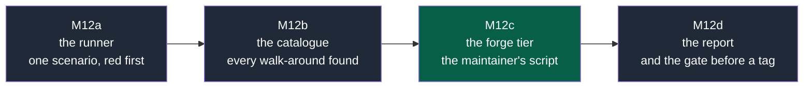

# NapkinStack M12 — the conformance suite: every barrier attacked — implementation plan

> **Location:** `docs/governance/plans/`, the repository's working context.
>
> **For the executing agent:** REQUIRED SUB-SKILL: use superpowers:subagent-driven-development
> (recommended) or superpowers:executing-plans to run this plan task by task. One workstream is
> one pull request, in the order of the roadmap, and each task is TDD: the failing test first,
> seen red for the right reason, then the code (P5). Steps use checkboxes (`- [ ]`).
> **The code below is a design, not an extract from a prototype** — unlike the M10 plan, whose
> blocks were run before they were written down. Each task's first step is the test, and the
> test decides.

**Goal:** turn the probes of M9 and M10h — run by hand, logged in issue comments, never
replayed — into a **versioned suite of attacks that runs on every pull request and before every
tag**, so that a barrier the framework announces can be shown to refuse, and can never quietly
stop refusing.

**Architecture:** two tiers, because two kinds of barrier exist. **Tier 1, mechanical**: the
engine's own rules (M, B, S, P, T, K, C, V, H, W) are attacked in a generated throwaway project
and must refuse, each attack paired with a **neighbour** — a legitimate change of the same shape
that must pass. Tier 1 runs in CI. **Tier 2, the forge**: the barriers that are GitHub's — an
unapproved merge, a self-approval, a stale approval, a failing required check — cannot be
attacked from CI and are run by the maintainer, from a script, at each release, with their
output logged. The suite's result is a file in the repository, produced by the run, and the tag
waits for it.

**Tech stack:** Python 3.12+ standard library, PyYAML and pytest 9.1.1, as the rest of
`platform/`; the generated project comes from `nstack init --source .`, as `platform/tests/run.sh`
already does. No new dependency.

**Spec:** the audit note of 2026-09-20 ([`audits/2026-09-20-external-audit.md`](../audits/2026-09-20-external-audit.md)),
which places this work; `PRODUCT.md` invariant **P5** — *every check has a test that proves it
fails* — of which this suite is the systematic form; the register rows D29 to D49, each of which
was an attack somebody found by hand.

## Global constraints

- **P5** — a scenario without its neighbour is not admissible: a suite that only proves refusals
  measures nothing about false positives, which is how D41 was found.
- **P1** — no stack, format or tool assumed in a scenario. Scenarios drive the engine and the
  generated project, never a language's toolchain.
- **P3** — Tier 1 runs in CI. Tier 2 states plainly that it is human-run, and why.
- **P6** — a failing scenario names the rule it attacked, the file it changed and what it
  expected.
- **ADR-0003** — English everywhere, machine values included.
- **Review budget** — 400 lines and 15 files per pull request; beyond, the `over-budget` label
  with its justification.
- **No probe is ever merged.** Tier 1's mutations live in a temporary directory; nothing a
  scenario writes is ever committed to a real repository.
- **The suite never claims more than it ran.** A scenario that could not run is reported as not
  run, never as passed — the rule PDR-0006 and PDR-0009 both state.

---

## Decisions taken while planning

| Subject | Choice | Why |
|---|---|---|
| What a scenario is | A record: the rule it attacks, a slug, the shape it takes, the mutation, the expected verdict, and a **neighbour** that must pass | The audit asked for a red team; P5 asks for a failure test. A scenario is both, so a rule cannot be satisfied by refusing everything |
| Identifiers | `<rule>/<slug>` — `V1/proof-rewritten`, `B2/path-manipulation` | A report reads as a sentence, and the rule's own identifier is the primary key. No new numbering to maintain |
| Where Tier 1's project comes from | One project generated per run with `nstack init --source .`, reused by every scenario, each scenario working on a copy | `run.sh` already does it; generating one per scenario would multiply a 3-minute cost by thirty |
| How a mutation is expressed | A Python function that edits the copy, not a patch file | Patches rot against the skeleton; a function that writes "a line importing another module" survives a rename |
| Where the catalogue lives | `platform/conformance/catalogue/`, one module per rule family | Files that change together live together; a family is what a workstream touches |
| What the run produces | `docs/governance/conformance/latest.md`, regenerated, plus the same content as JSON for the release notes | A table a human reads, and a form the release can quote without reformatting |
| Tier 2's form | A script that prints the exact calls for the maintainer to run, and a place to paste what the forge answered | The agent's own attempts at approval and merge are stopped by its harness before they leave the machine (M9), and that refusal proves nothing about the forge |
| When the suite runs | Tier 1 on every pull request of this repository; both tiers before a tag | A suite that runs only at release time rots between releases |
| What a red result does | Tier 1 fails the job. Tier 2 blocks the tag, by the release method | The gate is where the barrier is |
| Scenarios from history | Every register row that was a walk-around — D29, D30, D31, D32, D35, D36 to D42, D44 to D47 — becomes a scenario, whatever else it also became | A defect that was found once and fixed is a regression waiting for a refactor. This is the suite's first population, and it is free: each one is already described |

---

## Roadmap



**Legend** — dark grey: a workstream, one pull request · green: the maintainer runs it.

**Why this order.** The runner before the catalogue: a scenario has nowhere to live otherwise.
The catalogue before the forge tier: Tier 1 is where most of the population is, and it pays for
itself immediately. The report last: it quotes both tiers, and a report of an empty suite would
have to be rewritten.

## File map

| File | a | b | c | d |
|---|---|---|---|---|
| `platform/conformance/__init__.py` | create | | | |
| `platform/conformance/scenario.py` | the record and the verdict | | | |
| `platform/conformance/runner.py` | the run, one project, copies per scenario | | | |
| `platform/conformance/catalogue/boundaries.py` | one scenario | B1–B7 | | |
| `platform/conformance/catalogue/contracts.py` | | V1, M2 | | |
| `platform/conformance/catalogue/sheet.py` | | T1–T4 | | |
| `platform/conformance/catalogue/scope.py` | | P1, K1–K4, H1 | | |
| `platform/conformance/forge.py` | | | create | |
| `platform/conformance/report.py` | | | | create |
| `platform/tests/test_conformance.py` | the runner's own tests | family tests | forge script | report |
| `.github/workflows/governance.yml` | | | | the job |
| `docs/governance/conformance/latest.md` | | | | generated |
| `docs/governance/plans/2026-09-20-m12-conformance-suite.md` | this plan, ticked | | | |
| `PRODUCT.md`, `README.md` | | | | the suite's result |

---

## M12a — The runner, and one scenario that fails first — PR 1

**Files:** create `platform/conformance/{__init__,scenario,runner}.py`,
`platform/conformance/catalogue/__init__.py`, `platform/conformance/catalogue/boundaries.py`;
create `platform/tests/test_conformance.py`.

**Interfaces produced** — the names every later task uses:

```python
@dataclass(frozen=True)
class Scenario:
    rule: str                      # "B2"
    slug: str                      # "path-manipulation"
    shape: str                     # one sentence: what an agent plausibly does
    attack: Callable[[Path], None] # edits the copy so the rule must refuse
    neighbour: Callable[[Path], None] | None  # a legitimate change of the same shape
    command: tuple[str, ...]       # ("fitness",) — the verb that judges
    expect: str                    # the rule identifier expected in the refusal

@dataclass(frozen=True)
class Verdict:
    scenario: Scenario
    refused: bool                  # the attack was refused
    neighbour_passed: bool | None  # the legitimate change passed; None when there is none
    output: str                    # what the command printed, kept for the report
    ok: bool                       # refused and neighbour_passed is not False
```

- [ ] **Step 1: Write the failing test.** In `platform/tests/test_conformance.py`:

```python
def test_a_scenario_whose_attack_is_not_refused_is_not_ok(tmp_path):
    from conformance.runner import run_one
    from conformance.scenario import Scenario
    harmless = Scenario(rule="B2", slug="does-nothing", shape="changes a comment",
                        attack=lambda root: (root / "modules/hello/AGENTS.md").write_text("# hello\n"),
                        neighbour=None, command=("fitness",), expect="B2")
    verdict = run_one(harmless, project=tmp_path)
    assert verdict.refused is False and verdict.ok is False
```

- [ ] **Step 2: Run it, see it fail** — `uv run pytest platform/tests/test_conformance.py -v`.
      Expected: `ModuleNotFoundError: No module named 'conformance'`.

- [ ] **Step 3: Write `scenario.py`** — the two dataclasses above, nothing else.

- [ ] **Step 4: Write `runner.py`'s `run_one`** — copy the project, apply the attack, run the
      verb through the engine in-process, read the output, then restore and apply the neighbour:

```python
def run_one(scenario: Scenario, project: Path) -> Verdict:
    """Apply the attack to a copy, judge it, then judge the neighbour on a fresh copy."""
    attacked = _copy(project)
    scenario.attack(attacked)
    code, output = _judge(scenario.command, attacked)
    refused = code != 0 and f"[{scenario.expect}]" in output
    neighbour_passed = None
    if scenario.neighbour is not None:
        other = _copy(project)
        scenario.neighbour(other)
        neighbour_code, neighbour_output = _judge(scenario.command, other)
        neighbour_passed = neighbour_code == 0
        output += "\n--- neighbour ---\n" + neighbour_output
    return Verdict(scenario, refused, neighbour_passed, output,
                   ok=refused and neighbour_passed is not False)
```

- [ ] **Step 5: Run the test, see it pass.**

- [ ] **Step 6: Write the first real scenario** in `catalogue/boundaries.py` — M9's P2, the one
      that was accepted on v0.3.1:

```python
PATH_MANIPULATION = Scenario(
    rule="B2", slug="path-manipulation",
    shape="a module reaches another module's code through a path inserted before the import",
    attack=lambda root: _append(root / "modules/loans/src/loans/catalogue.py",
                                'import sys\nsys.path.insert(0, "../catalog/src")\n'
                                'from catalog.listing import Tool\n'),
    neighbour=lambda root: _append(root / "modules/loans/src/loans/catalogue.py",
                                   'import sys\nsys.path.insert(0, "./vendor")\n'),
    command=("fitness",), expect="B2")
```

- [ ] **Step 7: A test that this scenario is ok**, and a mutation that proves the suite bites:
      delete the `sys.path.insert` line from the attack and assert the verdict is **not** ok.

- [ ] **Step 8: Run the whole suite** — `uv run pytest platform/tests/test_conformance.py -v`,
      then `uv run bash platform/tests/run.sh` with `GITHUB_ACTIONS=true
      GITHUB_WORKFLOW=Governance`, both green.

- [ ] **Step 9: Commit** — `M12a — A scenario is an attack and its neighbour`.

---

## M12b — The catalogue: every walk-around that was ever found — PR 2

**Files:** `platform/conformance/catalogue/{boundaries,contracts,sheet,scope}.py`;
`platform/tests/test_conformance.py`.

Each register row below was a real walk-around, found by a probe or by a review. Each becomes a
scenario, with its neighbour taken from the false positive that was found beside it where there
was one.

- [ ] **Step 1: Write the family's tests first** — one parametrised test per family, asserting
      every scenario of that family is ok:

```python
@pytest.mark.parametrize("scenario", boundaries.ALL, ids=lambda s: f"{s.rule}/{s.slug}")
def test_every_boundary_scenario_is_refused_and_its_neighbour_passes(scenario, project):
    verdict = run_one(scenario, project)
    assert verdict.ok, verdict.output
```

- [ ] **Step 2: Run them, see them fail** — the lists are empty, so the parametrisation collects
      nothing; assert the list is non-empty first, which is what fails.

- [ ] **Step 3: `boundaries.py`** — B1 `consumes` emptied while the contract is read (M9's P3);
      B2 path manipulation (done in M12a) and a relative path from the module's own folder as its
      neighbour (D41); B3 a cycle through contracts (D37); B6 a consumed version nobody provides;
      B7 a contract document outside a module's folder (D39).

- [ ] **Step 4: `contracts.py`** — V1 a frozen version broken with the examples left behind
      (M9's P4) and the same break made consistently (M10h's P4c), with an optional property
      added as their neighbour (P4b); V1 the proof rewritten by the change that is judged
      (D44) — the attack declares a `compat` command that reads a file of its own module, and
      the change rewrites that file to exit 0; V1 a frozen version moved to another folder
      (D36); M2 a version written as a number, or a stability misspelt (D36).

- [ ] **Step 5: `sheet.py`** — T1 a user-facing change with no sheet (M9's P5); T2 a sheet
      signed by the session that wrote the change (M10h's P12), with a trailing full stop and a
      capital as the variants D40 found; T3 a scenario marked passed with no evidence (M9's P6);
      T4 a sheet verified on another commit; the neighbour for T2 is a sheet signed by another
      session, which must pass.

- [ ] **Step 6: `scope.py`** — P1 one change to two modules with no label (M9's P1); K3 a
      delivery pull request naming no deliverable (M9's P7); K4 the `out-of-cycle` label with no
      justification (M9's P8); H1 a workstation path in a tracked file (D27), with a container
      image's home directory as its neighbour (D41); the renamed file and the non-ASCII name
      that escaped the changed-file lists (D38).

- [ ] **Step 7: Run the four families** — every scenario ok. Any that is not is either a real
      regression, which stops the pull request, or a scenario written wrong, which is fixed
      before it is committed.

- [ ] **Step 8: Count them in the test** — assert the catalogue holds at least one scenario per
      rule the engine implements, and list by name the rules deliberately left without one (the
      forge's G rules, which are Tier 2, and L rules, which describe a workstation).

- [ ] **Step 9: Commit** — `M12b — Every walk-around ever found becomes a scenario`.

---

## M12c — The forge tier: what only the maintainer can attack — PR 3

**Files:** create `platform/conformance/forge.py`; `platform/tests/test_conformance.py`.

The attacks on GitHub's own barriers cannot run in CI: they need a real repository, a human's
credential, and — for two of them — a human to run the call, because the agent's harness stops
its own attempts before they leave the machine (M9, P9 and P10). This workstream ships the
script that prints them and the place their answers are recorded.

- [ ] **Step 1: Write the failing test** — `forge.py` prints one block per scenario, each with
      the exact call, the expected refusal, and a line to paste the answer into:

```python
def test_the_forge_script_names_every_expected_refusal():
    from conformance.forge import SCENARIOS, render
    text = render(repo="OWNER/REPO", pull=1)
    for scenario in SCENARIOS:
        assert scenario.expect in text and scenario.call in text
```

- [ ] **Step 2: Run it, see it fail** — no module.

- [ ] **Step 3: Write `forge.py`** with the five scenarios M9 and M10h ran, each carrying the
      call and the answer observed then, so a different answer is visible at a glance:
      `G2/no-approval` (`PUT …/pulls/N/merge` → 405, *"Waiting on code owner review"*),
      `G2/self-approval` (`POST …/pulls/N/reviews event=APPROVE` as the App → 422, *"Can not
      approve your own pull request"*), `G13/stale-approval` (approve, force-push, read the
      review state → dismissed), `G4/required-check-red` (a module test made to fail → the pull
      request BLOCKED, `Module checks` failing and required — M10h's P13), `G12/bypass-list`
      (read the ruleset's bypass actors → empty).

- [ ] **Step 4: Run the test, see it pass.**

- [ ] **Step 5: Document the gesture** in the plan's own verification section and in
      `CONTRIBUTING.md`: the maintainer runs the printed calls with `!`, pastes the answers, and
      the run's output is committed with the release's conformance report.

- [ ] **Step 6: Commit** — `M12c — The forge's barriers, attacked by the only hand that can`.

---

## M12d — The report, and the gate before a tag — PR 4

**Files:** create `platform/conformance/report.py`; `.github/workflows/governance.yml`;
`docs/governance/conformance/latest.md`; `PRODUCT.md`, `README.md`.

- [ ] **Step 1: Write the failing test** — the report names every scenario, its verdict and the
      framework version, and says plainly what was not run:

```python
def test_the_report_names_what_did_not_run():
    from conformance.report import render
    text = render(verdicts=[...], forge_answers=None, version="0.7.0")
    assert "not run" in text and "Tier 2" in text
```

- [ ] **Step 2: Run it, see it fail.**

- [ ] **Step 3: Write `report.py`** — a table per family, a count, and a closing section: which
      rules have no scenario and why, and whether Tier 2 was run for this version. A version
      whose Tier 2 was not run says so in the report rather than omitting the tier.

- [ ] **Step 4: Wire Tier 1 into `governance.yml`** as a job of this repository — not of the
      skeleton: the suite attacks the framework, and a generated project has no business
      running it.

- [ ] **Step 5: Generate `docs/governance/conformance/latest.md`** and commit it, so the current
      state is readable without running anything.

- [ ] **Step 6: The release method gains one line** — in `PRODUCT.md`'s release section and in
      the release plan of whichever version ships this: **the tag waits for a green Tier 1 and a
      Tier 2 run of that version**, the report committed with the release.

- [ ] **Step 7: The README's status line carries the number**, as the audit suggested and with
      the honesty PDR-0006 requires: the count of scenarios, refused as expected, and the ones
      not run.

- [ ] **Step 8: Run everything** — the suite, `run.sh` in full, the hooks, gitleaks.

- [ ] **Step 9: Commit** — `M12d — The suite's result travels with the version`.

---

## Verification — every pull request

1. `uv run nstack fitness --root .` and `uv run bash platform/tests/run.sh` green, with
   `GITHUB_ACTIONS=true GITHUB_WORKFLOW=Governance` set.
2. `uv run pytest platform/tests/test_conformance.py -v` green, and its own mutation: break one
   rule of the engine on purpose and watch the matching scenario go red — a suite that stays
   green while a rule is broken is measuring nothing.
3. `uv run pre-commit run --all-files`; gitleaks over the whole history.
4. No French; no path from a workstation (H1); the authors of every commit checked before
   pushing; files staged by explicit path.
5. A fresh clone at the head commit replays the suite; the pull request CLEAN; merged with
   `--match-head-commit <full sha>` after the maintainer's approval.
6. The summary: DONE / VERIFIED / ASSUMED / NOT VERIFIED / RISKS.

## Risks

| Risk | Mitigation |
|---|---|
| The suite becomes a second, drifting copy of `platform/tests` | The scenarios drive the engine through its verbs on a generated project; the unit tests drive functions. A scenario that can be written as a unit test belongs there instead, and the plan's self-review checks for it |
| A green suite reads as "the framework cannot be walked around" | The report states the opposite: it names the rules with no scenario, the tier that did not run, and that an attack nobody thought of is not in the catalogue. PDR-0009's rule, applied to the suite itself |
| Thirty scenarios, each generating a project, make CI slow | One project per run, copies per scenario; the run is measured in M12a and the number is recorded in the plan's observed section. If it exceeds two minutes, scenarios share a project by family |
| Tier 2 is skipped because it needs a human | The tag waits for it, by the release method — the same gate that already holds the tag for a pre-release review |
| A scenario is written to pass rather than to attack | Every scenario carries a neighbour, and M12a's mutation test proves the runner reports a non-refusal as not ok |

## Self-review

- **Coverage**: every rule family the engine implements has at least one scenario (M12b step 8),
  and the rules deliberately without one are named in the report.
- **Every scenario has a test seen red first**, and the runner itself is proven by a scenario
  that does nothing and must therefore be reported as not ok.
- **No placeholder**: each task names its files, its test and its command.
- **Names**: `Scenario`, `Verdict`, `run_one`, `render`, `ALL` — defined in M12a, used unchanged
  in M12b to M12d.
