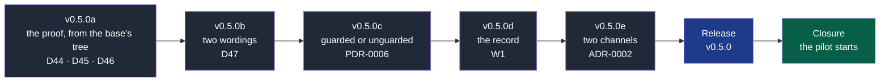

# NapkinStack v0.5.0 — a proof that cannot be rewritten, and a repository that says what it is — implementation plan

> **Location:** `docs/governance/plans/`, the repository's working context.
>
> **For the executing agent:** REQUIRED SUB-SKILL: use superpowers:subagent-driven-development
> (recommended) or superpowers:executing-plans to run this plan task by task. One workstream is
> one pull request, in the order of the roadmap, and each task is TDD: the failing test first,
> seen red for the right reason, then the code (P5). Steps use checkboxes (`- [ ]`).
> **What was measured is marked as measured**; the rest is a design the tests decide.

**Goal:** close the way around V1 that M10h found (D44), make its verdict true and visible
(D45, D46), say what a repository's plan actually enforces instead of listing impossible
settings (PDR-0006), record what nothing can refuse, and document the second install channel
(ADR-0002, clarified) — then publish v0.5.0, which the pilot waits for.

**Architecture:** nothing moves. `compat` gains a base tree to run in, `doctor` gains a verdict
in three blocks, a new read-only command reports what reached the default branch outside a pull
request, and `provenance` names the ref it was installed from. The engine keeps checking, the
project keeps choosing its tools (P1), and enforcement stays in CI (P3).

**Tech stack:** Python 3.12+ standard library and PyYAML, pytest 9.1.1, bash for the suite,
GitHub Actions pinned by SHA. No new dependency.

**Specifications:** the register rows **D44 to D47**;
[PDR-0006](../../pdr/0006-work-where-the-forge-cannot-guard.md) (guarded or unguarded, and the
record); [ADR-0002's clarification of 2026-09-20](../../adr/0002-distribute-napkinstack-on-pypi.md)
(two channels, one published artefact); [PDR-0005](../../pdr/0005-work-on-the-framework-while-using-it.md)
(never judged in silence), whose rule the record extends.

## Global constraints

- **P1** — no stack, format or tool in the engine or the skeleton's rules.
- **P3** — enforcement in CI. **P4** — the kernel within 250 lines (226 today; this plan adds
  none). **P5** — every new rule has a test seen red before the code. **P6** — every failure
  names the rule, the place and the action. **P7** — no brand in the skeleton's rules.
- **ADR-0003** — English everywhere, machine values included.
- **ADR-0004** — the agent holds no administration right; nothing in this plan asks for one.
- **A rule reads the base where a pull request could lower its own requirement** — T1's
  precedent (D24), V1's rule, and now V1's *tree*.
- **Nothing claims more than it ran** — a check that could not run reports "not verified", never
  a pass (PDR-0005, PDR-0006).
- **Review budget** — 400 lines and 15 files; beyond, the `over-budget` label, justified.
- **Consent** — the tag and the publication need the maintainer's explicit consent; the
  maintainer approves every pull request and the agent merges with `--match-head-commit`.
- **Public repositories** — nothing about the pilot's subject; no path from a workstation (H1).

---

## Decisions taken while planning

Three were measured on 2026-09-20 rather than argued. The others are the smallest choice that
holds.

| Subject | Choice | Reference, verified fact |
|---|---|---|
| Where V1's proof runs (D44) | In the **base's tree**, extracted once per run, with the head's document handed to it by absolute path | **Measured**: `git archive` of a whole repository into a temporary folder takes 7 ms for 1.6 MB on this repository. Extracting the whole tree rather than the module's folder closes the case where the proof calls a file outside the module |
| What the proof may read of the head | The one document it judges, through `NSTACK_HEAD_PATH` | The proof compares two documents. Anything else it reads of the head is the change judging itself |
| V1's verdict when the command fails (D45) | *"did not prove the change compatible"*, with the exit code, and an action covering both cases — a real break, and a proof that could not run | The rule is *"changes only when the command proves it compatible"*: a non-zero exit is the absence of a proof, not the presence of a break. Saying "a breaking change" when the network was down is a false verdict |
| The command in the message (D45) | Named by its module and manifest path, never repeated whole | Observed on tool-library: a multi-line command printed twice pushed the comparator's own output off the screen |
| `compat` hidden by an earlier failure (D46) | `if: ${{ !cancelled() }}` on the step, order unchanged | Observed in M10h's P4 and P13: `test` failed first and V1 never ran, so the author met it a round trip later. The condition is the smallest fix; reordering would put a network download before the cheap checks |
| What "guarded" means (PDR-0006) | The six settings that actually refuse a merge — **G1, G2, G3, G4, G12, G13** — all in force. The others are reported as gaps without deciding the state | A repository is guarded when the forge refuses on its own. Secret scanning and labels matter, and neither stops a merge |
| `doctor`'s exit code | 0 when every setting **within reach of the plan** is in force and nothing is unverified; 1 otherwise. The state line is printed either way | A project that has done everything its plan allows is not faulty. A verdict it can never satisfy teaches people to ignore the verdict |
| The record's verb (PDR-0006) | A new command, `nstack landed`, reading a commit range, with rule **W1** | It reads history, which `doctor` (settings) and `fitness` (the tree) do not. **Measured**: the forge answers `GET /repos/{o}/{r}/commits/{sha}/pulls` with the pull request for a merged commit and with an empty list for a commit pushed directly |
| What the record exempts | Commits with no parent, and every commit that predates the record's own arrival in the repository | A record that fails on the commit that installed it teaches people to ignore it (PDR-0006's edge case) |
| The record's rights | A read-only token; without one it reports "not verified" and exits 0 | G10 keeps the project's automation token read-only, and this needs nothing more |
| The provenance line (ADR-0002) | Names the **requested revision** when the install came from a repository: *"installed from the repository at v0.4.0 — not the published artefact"* | **Measured**: `uv tool install "napkinstack @ git+…@v0.4.0"` records `requested_revision: "v0.4.0"` beside the commit in `direct_url.json` (PEP 610). A bare `UNPUBLISHED` plus a sha said less than the tool knew |
| The version | **v0.5.0**, a minor: `doctor`'s exit code changes meaning, the generated project gains a workflow, and V1's message changes | ADR-0002; the v0.4.0 precedent, where a project could turn red on update |

## What this plan does not do

- **PDR-0007's unframed state, PDR-0008's setup command and PDR-0009's record of a merge.** They
  are M11 and M13. This plan's D47 keeps `K1` firing where there is no charter, and only fixes
  what it says — the wording stays true when M11 narrows the rule.
- **A forge adapter, a context command, a brownfield adopter.** Dated in the audit note.

---

## Roadmap



**Legend** — dark grey: a workstream, one pull request · blue: the release · green: the
maintainer.

**Why this order.** The proof first: it is the pilot's precondition and the reason the version
exists. The wordings next, because they are small and touch files the later workstreams also
touch. `doctor`'s states before the record, because the record speaks the vocabulary
`doctor` defines. The channels last: the provenance line prefixes every judging output, and it
would shift assertions the earlier workstreams write — the same reason M10g came last.

## File map

| File | a | b | c | d | e |
|---|---|---|---|---|---|
| `src/napkinstack/compat.py` | base tree, messages | | | | |
| `src/napkinstack/pull_request.py` | | K1's message | | | |
| `src/napkinstack/modules.py` | | next steps | | | |
| `src/napkinstack/doctor.py` | | | states, exit code | | |
| `src/napkinstack/landed.py` | | | | create | |
| `src/napkinstack/provenance.py` | | | | | requested revision |
| `src/napkinstack/cli.py` | | | | `landed` | |
| `skeleton/.github/workflows/module-checks.yml` | `compat` condition | "changed" | | | |
| `skeleton/.github/workflows/commits-on-main.yml` | | | | create | |
| `skeleton/README.md.jinja` | | | the states | the record | the channels |
| `skeleton/docs/os/03-contracts.md` | V1's tree | | | | |
| `skeleton/docs/os/05-workflow.md`, `07-governance.md` | | | the states | the record | |
| `README.md`, `PRODUCT.md` | | | | | the channels, §7 |
| `platform/tests/test_compat.py` | D44's regression | | | | |
| `platform/tests/test_guardrails.py` | | K1 | | W1 | |
| `platform/tests/test_doctor.py` | | | states, exit code | | |
| `platform/tests/test_provenance.py` | | | | | the ref |
| `platform/tests/run.sh` | compat | | doctor | landed | the line |

---

## v0.5.0a — The proof runs where the change cannot reach it (D44, D45, D46) — PR 1

**Files:** `src/napkinstack/compat.py`; `skeleton/.github/workflows/module-checks.yml`;
`skeleton/docs/os/03-contracts.md`; `platform/tests/test_compat.py`.

### Task 1 — The attack, as a test

- [ ] **Step 1: Write the failing test.** A module whose `compat` command calls a file of its
      own folder, and a change that rewrites that file to exit 0 while breaking the contract.
      Today V1 accepts it; it must refuse.

```python
def test_a_proof_that_calls_a_file_of_the_tree_is_run_from_the_base(tmp_path):
    """D44: the change rewrites the script its own proof calls. The base's script must run."""
    repo = _repository(tmp_path)                      # a module providing catalog-api v1, consumed
    _write(repo / "modules/api/compare.sh", "#!/bin/sh\nexit 1\n")   # the base refuses
    _commit(repo, "the proof refuses by default")
    base = _head(repo)
    _write(repo / "modules/api/compare.sh", "#!/bin/sh\nexit 0\n")   # the change rewrites it
    _break_the_contract(repo / "contracts/catalog-api/v1/openapi.yaml")
    assert compat.run(repo, module=None, base=base) == 1
```

- [ ] **Step 2: Run it, see it fail** — `uv run pytest platform/tests/test_compat.py -k base -v`.
      Expected: it returns 0, because the command runs in the head's tree and finds the rewritten
      script. That failure **is** D44.

- [ ] **Step 3: Extract the base's tree once per run.** In `compat.py`, beside `_extract`:

```python
def _base_tree(root: Path, base: str, into: Path) -> Path:
    """The whole repository as it is at the base. The proof runs here, so a change cannot
    rewrite what judges it (D44). Measured: 7 ms for 1.6 MB."""
    archive = subprocess.run(["git", "archive", "--format=tar", base], cwd=root,
                             capture_output=True, check=True).stdout
    with tarfile.open(fileobj=io.BytesIO(archive)) as tar:
        tar.extractall(into, filter="data")
    return into
```

- [ ] **Step 4: Run the command there.** In `run()`, replace the temporary-directory block:

```python
        with tempfile.TemporaryDirectory() as temporary:
            tree = _base_tree(root, fork, Path(temporary))
            folder_at_base = tree / folder.relative_to(root)
            env = {**os.environ, "NSTACK_CONTRACT": contract, "NSTACK_VERSION": version,
                   "NSTACK_BASE_PATH": str(tree / path),
                   "NSTACK_HEAD_PATH": str(root / target)}
            print(f"-> {name}: {command}", flush=True)
            code = subprocess.run(command, shell=True, cwd=folder_at_base, env=env).returncode
```

- [ ] **Step 5: Run the test, see it pass.**

- [ ] **Step 6: The neighbour must still pass** — a test where the proof is honest and the change
      is additive: V1 returns 0. Without it, "refuse everything" would satisfy step 5.

- [ ] **Step 7: A module folder that does not exist at the base** — the command is already read
      from the base, so the manifest is missing and V1 fails naming the missing command. Assert
      the message, not a traceback.

### Task 2 — The verdict says what it knows (D45)

- [ ] **Step 1: Write the failing test** — a proof that cannot run (`exit 127`) must not be
      reported as a breaking change:

```python
def test_a_proof_that_could_not_run_is_not_called_a_breaking_change(capsys, tmp_path):
    ...
    assert "did not prove the change compatible" in capsys.readouterr().out
    assert "a breaking change." not in capsys.readouterr().out
```

- [ ] **Step 2: Run it, see it fail** — today's message says "a breaking change".

- [ ] **Step 3: Rewrite the failure**, naming the command's home instead of repeating it:

```python
            failures.append(
                f"[V1] {label}: the compatibility command of module '{name}' ({where}) "
                f"did not prove the change compatible (exit {code}).\n"
                "      Action: read the comparator's output above. If the change is breaking, "
                "publish it as a new version beside this one and migrate its consumers "
                "(expand/contract, docs/os/03-contracts.md §4). If the command could not run — "
                "a missing tool, no network — fix the command: V1 cannot pass without a proof.")
```

- [ ] **Step 4: Run the tests, see them pass**, including one asserting the command text appears
      once in the whole output.

- [ ] **Step 5: The handbook follows** — `03-contracts.md` §4 says the proof runs in the base's
      tree and may read of the head only the document it judges.

### Task 3 — The verdict is never hidden (D46)

- [ ] **Step 1: Write the failing test** — in `platform/tests/run.sh`, assert that
      `module-checks.yml`'s `compat` step carries a condition that survives an earlier failure.

- [ ] **Step 2: Run it, see it fail.**

- [ ] **Step 3: Add the condition**, with its reason in a comment:

```yaml
      # A frozen version someone relies on changes only with the merged proof (V1). The step
      # runs even when an earlier one failed: a pull request that breaks a contract *and* a
      # test would otherwise meet V1 a round trip later (D46).
      - name: compat
        if: ${{ !cancelled() }}
        run: nstack compat "$MODULE" --base "$BASE"
```

- [ ] **Step 4: Run `run.sh` in full**, with `GITHUB_ACTIONS=true GITHUB_WORKFLOW=Governance`.

- [ ] **Step 5: Mutations** — three, each reverted: remove the base tree (the D44 test goes red),
      restore the old message (the D45 test goes red), remove the condition (the D46 test goes
      red).

- [ ] **Step 6: Commit** — `v0.5.0a — The proof runs in the base's tree, and says what it knows`.

---

## v0.5.0b — Two wordings that misdirect (D47) — PR 2

**Files:** `src/napkinstack/pull_request.py`; `src/napkinstack/modules.py`;
`skeleton/.github/workflows/module-checks.yml`; `platform/tests/test_guardrails.py`.

- [ ] **Step 1: Write the failing tests** — `K1` on a project whose charter is accepted and whose
      cycle is missing must name the cycle, not the framing:

```python
def test_k1_between_two_cycles_names_the_cycle(tmp_path):
    project = _framed_project(tmp_path, charter="accepted", cycle=None)
    failures = _pr_check(project, body=_delivery_body())
    assert "no accepted cycle" in failures["K1"]
    assert "the project is not framed" not in failures["K1"]
```

- [ ] **Step 2: Run them, see them fail.**

- [ ] **Step 3: Split the message in two**, in `pull_request.py`:

```python
        if charter is None:
            fail("K1", "the project is not framed: no accepted charter in docs/project/.\n"
                       "      Action: frame it (playbooks/framing.md), or label this pull "
                       f"request {LABEL} with its justification.")
        else:
            fail("K1", "no accepted cycle: the charter is accepted and no cycle is open.\n"
                       "      Action: open the next cycle (docs/project/cycles/_TEMPLATE.md), "
                       f"or label this pull request {LABEL} with its justification.")
```

- [ ] **Step 4: `new-module`'s next steps follow** the same split, so the generator never sends
      a framed project back to framing.

- [ ] **Step 5: `Every touched module passed` becomes `Every changed module passed`** in
      `module-checks.yml`, matching the word `nstack modules --changed-since` uses (D42's
      wording), with the assertion in `run.sh`.

- [ ] **Step 6: Run the tests and `run.sh`**, then mutate each message back and watch the tests go
      red.

- [ ] **Step 7: Commit** — `v0.5.0b — K1 names what is missing, and one word for one thing`.

---

## v0.5.0c — Guarded, or unguarded (PDR-0006) — PR 3

**Files:** `src/napkinstack/doctor.py`; `skeleton/README.md.jinja`;
`skeleton/docs/os/07-governance.md`; `platform/tests/test_doctor.py`; `platform/tests/run.sh`.

### Task 1 — The state

- [ ] **Step 1: Write the failing tests** — the three states, from PDR-0006's acceptance
      criteria:

```python
BLOCKING = ("G1", "G2", "G3", "G4", "G12", "G13")   # the settings that refuse a merge

def test_a_private_repository_on_a_plan_that_enforces_nothing_is_unguarded(capsys):
    _doctor(repository=_private(plan="free"))
    out = capsys.readouterr().out
    assert "unguarded" in out and "out of reach on this plan" in out

def test_a_repository_whose_blocking_settings_are_in_force_is_guarded(capsys):
    _doctor(repository=_public(settings=_all_in_force()))
    assert "unguarded" not in capsys.readouterr().out

def test_a_repository_that_cannot_be_read_is_never_guarded(capsys):
    _doctor(repository=None)                        # no token
    out = capsys.readouterr().out
    assert "not verified" in out and "guarded" not in out.replace("unguarded", "")
```

- [ ] **Step 2: Run them, see them fail.**

- [ ] **Step 3: Classify, then report.** Each checklist rule gets one of `OK`, `GAP`,
      `OUT_OF_REACH`, `NOT_APPLICABLE`, `UNKNOWN` — `OUT_OF_REACH` replacing today's note
      appended to a gap on a private repository. Then:

```python
def state(results: list[tuple[str, str, str, str]]) -> str:
    """Guarded when every setting that refuses a merge is in force; unguarded otherwise;
    never guarded on what could not be read (PDR-0006)."""
    blocking = [status for rule, _, status, _ in results if rule in BLOCKING]
    if any(status == UNKNOWN for status in blocking):
        return "not verified"
    return "guarded" if all(status == OK for status in blocking) else "unguarded"
```

- [ ] **Step 4: The output in three blocks** — what is enforced here, what nothing enforces here
      (each line saying whether it is out of reach or not yet done), and what it would take,
      with its cost: a public repository at no cost, or a plan that enforces rules on a private
      one.

- [ ] **Step 5: The exit code** — 0 when no `GAP` and no `UNKNOWN`; `OUT_OF_REACH` never decides
      it. A test asserts an unguarded, fully-reachable repository exits 0 **and** prints
      *unguarded*.

- [ ] **Step 6: `run.sh`'s doctor cases updated** — the existing ones assert the old wording; each
      becomes an assertion on the new state line, plus one new case for the exit code.

### Task 2 — What a new project reads

- [ ] **Step 1: The skeleton's README** keeps the checklist word for word (the identity test in
      `run.sh`) and gains one line after it: on a private repository several of these need a plan
      that enforces rules — `nstack doctor` says which, and what costs nothing.
- [ ] **Step 2: `07-governance.md`** names the two states where it describes the checks.
- [ ] **Step 3: Run `run.sh`** — the checklist identity test must still pass in both directions.
- [ ] **Step 4: Commit** — `v0.5.0c — A repository says whether anything refuses`.

---

## v0.5.0d — The record: what nothing could refuse (PDR-0006, rule W1) — PR 4

**Files:** create `src/napkinstack/landed.py`; `src/napkinstack/cli.py`;
create `skeleton/.github/workflows/commits-on-main.yml`; `skeleton/README.md.jinja`;
`skeleton/docs/os/05-workflow.md`; `platform/tests/test_guardrails.py`; `platform/tests/run.sh`.

### Task 1 — The rule

- [ ] **Step 1: Write the failing tests**, the forge answered from a stub:

```python
def test_a_commit_that_arrived_outside_a_pull_request_is_reported(capsys):
    assert landed.run(root, span="A..B", forge=_forge({"B": []})) == 1
    out = capsys.readouterr().out
    assert "[W1]" in out and "B" in out and "nothing here could refuse it" in out

def test_a_commit_that_arrived_through_a_pull_request_passes():
    assert landed.run(root, span="A..B", forge=_forge({"B": [{"number": 7}]})) == 0

def test_a_commit_older_than_the_record_is_not_reported():
    """PDR-0006: the record says nothing about what predates it."""
    assert landed.run(root, span="A..B", forge=_forge({"B": []}), since=_added_commit()) == 0

def test_without_a_token_nothing_is_claimed(capsys):
    assert landed.run(root, span="A..B", forge=None) == 0
    assert "not verified" in capsys.readouterr().out
```

- [ ] **Step 2: Run them, see them fail** — no module.

- [ ] **Step 3: Write `landed.py`** — the commits of the span, minus the parentless ones and
      those that are ancestors of the commit that added the workflow; each asked of the forge
      (**measured**: `GET /repos/{owner}/{repo}/commits/{sha}/pulls` returns the pull request
      for a merged commit and `[]` for a direct push); the message naming the commit, its author
      and the date, and saying plainly that this is a record and not a barrier.

- [ ] **Step 4: Run the tests, see them pass**, then mutate: return a pull request for every
      commit and watch the first test go red.

- [ ] **Step 5: Wire the verb** into `cli.py`, and into `JUDGES` so the run names the framework
      that judged it (PDR-0005).

### Task 2 — The workflow the project receives

- [ ] **Step 1: Write the failing assertion in `run.sh`** — a generated project holds
      `.github/workflows/commits-on-main.yml`, its token is read-only, and it calls the verb
      with the push event's range.

- [ ] **Step 2: Run it, see it fail.**

- [ ] **Step 3: Write the workflow** — `on: push: branches: [main]`, `permissions: contents:
      read, pull-requests: read`, the engine installed by `.nstack/install-engine.sh`, then
      `nstack landed --span "${{ github.event.before }}..${{ github.event.after }}"`. A first
      push, where `before` is empty, falls back to the pushed commit alone.

- [ ] **Step 4: The README and the handbook** say what the record is and, in the same sentence,
      what it is not: it records, it does not refuse.

- [ ] **Step 5: Run `run.sh` in full**, the hooks, actionlint and zizmor on the new workflow.

- [ ] **Step 6: Commit** — `v0.5.0d — What nothing could refuse is recorded`.

---

## v0.5.0e — Two channels, one published artefact (ADR-0002) — PR 5

**Files:** `src/napkinstack/provenance.py`; `README.md`; `skeleton/README.md.jinja`;
`PRODUCT.md`; `platform/tests/test_provenance.py`; `platform/tests/run.sh`.

- [ ] **Step 1: Write the failing test** — an engine installed from a repository at a tag names
      the tag:

```python
def test_an_engine_installed_at_a_tag_names_the_tag():
    line = provenance.judged_by(root, direct_url={
        "url": "https://github.com/NapkinStack/engineering-os.git",
        "vcs_info": {"commit_id": "486be72f1a82", "requested_revision": "v0.4.0"}})
    assert "at v0.4.0" in line and "not the published artefact" in line
    assert "UNPUBLISHED" in line          # it is still not published, and still says so
```

- [ ] **Step 2: Run it, see it fail** — today the line carries the commit only.

- [ ] **Step 3: Name the requested revision** when `direct_url.json` records one
      (**measured**: `uv tool install "napkinstack @ git+…@v0.4.0"` records
      `requested_revision: "v0.4.0"`), keeping the word that matters: a tag can be moved, so this
      is still not the published artefact.

- [ ] **Step 4: Run the tests, see them pass**, with the branch case unchanged.

- [ ] **Step 5: The two channels documented** — `README.md` gains the forge install pinned to a
      tag beside the registry one, and the ephemeral `uvx` form for trying it; the skeleton's
      README says which channel the project was created from matters not at all, because a tag
      install records the same `_commit` (**measured on v0.4.0**).

- [ ] **Step 6: `PRODUCT.md` §7** follows, and the release notes of this version name the second
      channel.

- [ ] **Step 7: Run `run.sh`** — the first-line assertions of every judging command still hold.

- [ ] **Step 8: Commit** — `v0.5.0e — The forge distributes what the registry publishes`.

---

## Release v0.5.0 — PR 6

- [ ] Version pull request (`uv version --bump minor`), whose description carries the **release
      notes: what an updated project adapts** —
      - `doctor` now exits 0 on a repository that has done everything its plan allows, and prints
        whether anything refuses: a script reading its exit code sees a state change;
      - the project receives a new workflow, `commits-on-main.yml`, which records a commit that
        reached `main` outside a pull request — it refuses nothing;
      - V1's refusal is worded differently and its proof runs in the base's tree: a `compat`
        command that depended on a file of the pull request's tree must become self-contained;
      - `K1`'s message distinguishes a missing charter from a missing cycle.
- [ ] **The maintainer's explicit consent**, then the annotated tag on the merge commit, pushed
      by the agent under its App; the maintainer approves the `pypi` deployment.
- [ ] Verification on published artefacts, as at v0.4.0: the PyPI JSON; `pypi-attestations
      verify` for both files; an isolated `uv tool install`; `nstack init` from the tag with a
      team owner and a user owner; the generated project's CI replayed; `doctor` on a public and
      on a private repository, reading *guarded* and *unguarded*; **and the forge channel**:
      `uvx --from git+…@v0.5.0 nstack init` produces `_commit: v0.5.0`.
- [ ] `nstack update` from v0.4.0 on a clone of `tool-library`: the adaptations the release notes
      announce, and nothing else.

## Closure — PR 7

- [ ] This plan ticked with what was observed; `workstreams.md` — D44 to D47 closed, the v0.5.0
      row done, M11 next; `PRODUCT.md` §7 and the README's status.
- [ ] The validation log's entry: the update's cost, and the probes replaying D44 — a proof that
      calls a file of the tree, refused now — and the record, on a commit pushed straight to
      `main`.
- [ ] **The maintainer, decider**: the pilot starts, on GitHub Team.

---

## Verification — every pull request

1. `uv run nstack fitness --root .` and `uv run bash platform/tests/run.sh` green, with
   `GITHUB_ACTIONS=true GITHUB_WORKFLOW=Governance` set — the message text asserted, not its
   format.
2. `uv run pre-commit run --all-files`; gitleaks over the whole history.
3. The mutations each task names, with `PYTHONDONTWRITEBYTECODE=1`, each reverted.
4. Every Mermaid diagram changed parses; every relative link resolves.
5. No French; no tool, stack or business domain in the skeleton outside
   `docs/tooling-profile.md`; no path from a workstation (H1).
6. The authors of every commit checked before committing; the diff read before pushing; files
   staged by explicit path.
7. A fresh clone at the head commit replays the suite; the pull request CLEAN; merged with
   `--match-head-commit <full sha>` after the maintainer's approval — **and nothing is pushed
   after the approval, which dismisses it** (G13, observed on #71).
8. The summary: DONE / VERIFIED / ASSUMED / NOT VERIFIED / RISKS.

## Risks

| Risk | Mitigation |
|---|---|
| A project's `compat` command depended on the pull request's tree and breaks | It is the defect being fixed, and the release notes say so. A command that needs a tool installs it itself, as `tool-library`'s does |
| The base's tree costs time on a large repository | **Measured**: 7 ms for 1.6 MB, extracted once per run whatever the number of contract versions. If a repository is large enough for this to matter, the extraction is narrowed to the holding module's folder and the case D44 describes is named in the handbook |
| `doctor`'s exit code changes meaning for a script that reads it | It is a minor version, the release notes name it first, and the state is printed on every run |
| The record fires on a legitimate flow and becomes noise | Its exemptions are tested — a parentless commit, and anything older than the record itself. PDR-0006's removal condition measures exactly this over the pilot's first two cycles |
| The record is read as a barrier | Its own message says it records and does not refuse; the README and the handbook say it in the same sentence |
| The forge channel makes people install from a branch | The documented gesture is always a tag, and a branch install says `UNPUBLISHED` on every run (PDR-0005) |

## Self-review

- **Coverage**: D44 → a; D45 → a; D46 → a; D47 → b; PDR-0006's diagnosis → c; PDR-0006's record →
  d; ADR-0002's clarification → e. PDR-0007, PDR-0008 and PDR-0009 are out of scope and named as
  such.
- **Every new rule has a test seen red first**, and each task names the mutation that proves the
  test bites.
- **Measured rather than assumed**: the base tree's cost, what `uv` records for a tag install,
  and how the forge answers for a merged commit and for a direct push. The rest is a design the
  tests decide, and this plan says so at the top rather than pretending otherwise.
- **Names**: `_base_tree`, `state`, `BLOCKING`, `landed.run`, `judged_by` — each defined once, in
  the task that produces it, and used unchanged afterwards.
