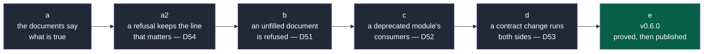

# NapkinStack v0.6.0 — what is announced refuses, and the documents say what is true

> **Location:** `docs/governance/plans/`, the repository's working context.
>
> **For the executing agent:** REQUIRED SUB-SKILL: use superpowers:subagent-driven-development
> (recommended) or superpowers:executing-plans to run this plan task by task. One workstream is
> one pull request, in the order of the roadmap, and each task is TDD: the failing test first,
> seen red for the right reason, then the code (P5). Steps use checkboxes (`- [ ]`).
> Every code block below was written against the files as they are at `a14e2cb`, and every
> anchor was read before being quoted.

**Goal:** close the gaps the internal audit of 2026-09-20 found between what the framework
announces and what it refuses — a document still holding its template's words passes every
check, a deprecated module's consumers are never mentioned, a contract change never runs the
other side's tests, and a refusal drops the line that says what happened — and bring the
documents back in line with the published v0.5.0, before the pilot starts.

**Architecture:** four rules and one documentary lot, each in its own pull request. No new
subsystem: the placeholder predicate joins the shared helpers of `fitness/manifests.py` where
`contract_entries` and `changed_files` already live; the deprecated-consumer verdict joins
`boundaries` beside B6, which already reads the same declarations; the two sides of a contract
are read from the manifests the project already writes, and handed to the workflow that already
lists the changed modules. Then a release, because a rule that is not published does not reach
the pilot.

**Tech stack:** Python 3.12+ standard library, PyYAML and pytest 9.1.1, as the rest of
`platform/`. No new dependency.

**Spec:** the internal audit of 2026-09-20 (this plan's opening section below records its
findings as D51 to D54); `PRODUCT.md` invariants **P5** (every check has a test that
proves it fails) and **P6** (rule, file, line, action); `skeleton/docs/os/02-modules.md` §6 and
`skeleton/docs/os/03-contracts.md` §5, whose promises this plan either mechanises or corrects.

## Global constraints

- **ADR-0003** — English everywhere: code, identifiers, machine values, commit messages,
  pull requests.
- **P5** — the failing test first, seen red for the right reason, then the code. Every new
  rule also gets a case that must **pass**: a rule that refuses everything measures nothing
  (D41 was found that way).
- **P6** — every refusal names the rule, the place and the action, and the action is a command
  or an edit the reader can carry out (D50).
- **P1** — no stack, format or tool assumed. The rules read declarations, never a language.
- **Review budget** — 400 lines and 15 files per pull request; beyond, the `over-budget` label
  with its justification. The plan's own pull request is expected to exceed it, justification
  "detailed plan", as #73 did.
- **D33 holds** — `nstack new-module` output stays green as created. A rule that would turn a
  freshly generated module red is wrong, whatever else it is right about.
- **One word for one thing** — `unfilled` is defined once and used unchanged; the test sheet's
  existing `PLACEHOLDER` keeps its own meaning, and the difference is written down.
- **Nothing is pushed after a review is asked for** — G13 dismisses the approval.

---

## The findings this plan closes

To be added to the register in workstream **a**, and ticked as each one merges.

| # | Observation | Handled by |
|---|---|---|
| D51 | **A document still holding its template's words passes every declarative check.** `nstack plan` reports *compliant* for a charter whose only `success_criteria` entry is `<An observable result, and when it is observed>` (C2), and for a `ready` deliverable whose title and acceptance criteria are the template's (C4); `nstack manifests` reports *compliant* for a module whose responsibility is `TODO - describe this module's business capability in one sentence.` (M2). D28 fixed this shape for the `decider` field alone. Reproduced on a project generated from the working tree, 2026-09-20 | v0.6.0: **b** — a declaration still carrying a placeholder is refused, for a module from its first file of code (D33) |
| D52 | **Nothing ever mentions the consumers of a deprecated module.** `02-modules.md` §6 promises *"a `deprecated` module that gains a consumer → Red"*; the engine reads `lifecycle` only for M3 (valid value) and M5 (removal date). The same table promises *"a `maintenance` module whose contract changes → Red"*, which no check produces either and which V1 already covers for the versions that matter | v0.6.0: **c** — B8 reports every consumer of a deprecated module with its removal date; the `maintenance` row is corrected to name V1 |
| D53 | **A contract change never runs the other side's checks.** `03-contracts.md` §5 promises *"contract tests run in the CI of both modules"* and that *"a contract change that breaks a declared consumer is caught before merge"*. `module-checks.yml` runs the verbs only for modules with a **changed file**: a change under `contracts/` runs the contracts module's tests and nobody else's. V1 compares the documents; it does not run either side's suite | v0.6.0: **d** — `nstack modules --with-contract-sides` adds the producer and the declared consumers of a touched contract version; the workflow asks for them |
| D54 | **A Copier refusal is reported with its last line, which can be the least informative one.** `project._explain` keeps `[line.split("|", 1)[-1].strip() for line in text.splitlines() if line.strip()][-1]`, so a multi-line git error arrives as *"Template . at version HEAD unreachable: fatal: adding files failed"*, with the action *"check --source and --ref, and network access"* — neither names what happened. Measured on 2026-09-20: the line dropped was `error: .bash_profile: can only add regular files, symbolic links or git-directories`. The trigger was this session's sandbox, where four dotfiles at the repository root are character devices, and Copier copies a dirty tree into its clone with `git add -A`; the trigger is the environment, the unusable action is the framework's (P6, the D50 family) | v0.6.0: **a2** — the refusal keeps the line that says what happened |

---

## Decisions taken while planning

| Subject | Choice | Why |
|---|---|---|
| Hand-rolled validators vs JSON Schema | **Keep the Python validators.** The repository already validates GitHub's files with `check-jsonschema`; it does not adopt it for manifests and front matter | Prior Art Gate: the convention is a schema, and the deviation is paid for by a named value — **P6**. A schema validator says `'responsibility' does not match pattern`; these rules say which sentence to write and where. P6 is a product invariant, so the deviation is justified and stays |
| What "unfilled" means | A declaration is unfilled when it is empty, **carries** an angle-bracket placeholder, or opens with `TODO` | Nobody writes a criterion around `<…>`. A *cell* of a test sheet is different — it is unfilled when it is **nothing but** a placeholder, which is the template's example row — so `pull_request.PLACEHOLDER` keeps its meaning and the two are documented side by side |
| False positives on `<` | The placeholder must open on a non-space: `<[^<>\s][^<>]*>` | `then the 95th percentile stays < 200 ms` is a legitimate criterion and must pass. It gets its own green test |
| Where `unfilled` lives | `fitness/manifests.py`, beside `contract_entries`, `is_description` and `changed_files` | That module is already the home of the shared helpers, and it imports nothing of the others: no cycle. The precedent is `HANDLE`, defined once in `modules.py` and read by `fitness/plan.py` |
| An unfilled responsibility and a new module | Refused **only once the module holds more than its description** — the same condition M7 already uses | D33: a generator's output is green (Rails, Nx). The module says what it does from its first file of code, not before |
| B8 blocking or reporting | **A warning**, like B4 | The promise is *"no new consumer"*, which is a diff notion; `boundaries` has no base and runs on push. What is already declared is bounded by the removal date, which M5 already turns red. Reporting matches the field — Backstage declares `spec.lifecycle` and enforces nothing, Cortex and OpsLevel score it — and the hard gate stays where it belongs. **Rejected:** a base-aware "no new consumer" check; it would need a diff subsystem in a whole-tree rule for a case the removal date already closes |
| Reimplementing Pact | **No.** The two sides are read from the manifests the project already declares | Pact solves this with a broker and provider-verification webhooks, for repositories that do not share a CI. In one repository the declared graph is already there, and using it is an argument to an existing command, not a subsystem |
| The flag's name | `--with-contract-sides` | It names exactly what it adds: the producer and the declared consumers of a contract version the change touches. `--with-consumers` would have been wrong, since the producer is added too |
| Per-module `review_budget` | **Removed from the module template**, and `05-workflow.md` §4 says the budget is set for the project | D9: it is a declaration nothing reads. Deleting a dead declaration beats implementing a budget nobody asked for; the field sets PR size at repository level (Danger, pr-size-labeler) |
| The version | **v0.6.0**, and M11 moves to v0.7.0 | These rules turn a project red that was green: not a patch. The maintainer arbitrates at the version pull request, which needs their consent for the tag anyway |
| The rule index | **Not here.** A note in the M12 plan | Every serious linter publishes one (ESLint, ruff, RuboCop, zizmor) and the descriptions already sit in the engine's docstrings — but M12 needs the same catalogue, and building it twice is the waste this repository forbids (`PRODUCT.md` §6) |

---

## Roadmap



**Legend** — dark grey: a workstream, one pull request · green: the maintainer consents, then
the agent tags and the deployment is approved.

**Why this order.** The documentary lot first: it is mergeable in one review, it registers the
four defects, and it repairs the oracle's own blind spot before the rules arrive. Then a2,
because every failure of the three workstreams after it is read through that message. Then the
three rules, cheapest first and each independent. The release last, once a real project has
been updated to it.

---

## File structure

| File | Responsibility | Workstream |
|---|---|---|
| `src/napkinstack/project.py` | A Copier refusal keeps the lines git wrote, not only the last one | a2 |
| `platform/tests/test_project.py` | **Created**: the translated refusals, as pure functions | a2 |
| `src/napkinstack/fitness/manifests.py` | Gains `unfilled()`, the shared predicate, and uses it for `module.responsibility` (M2) | b |
| `src/napkinstack/fitness/plan.py` | Uses `unfilled()` for the charter's criteria (C2), a deliverable's title and acceptance (C4), a go's challenger (C7) | b |
| `src/napkinstack/fitness/boundaries.py` | Keeps each module's lifecycle, and reports a consumer of a deprecated module (B8) | c |
| `src/napkinstack/modules.py` | `listing()` gains `with_contract_sides`, and `_contract_sides()` reads the two sides from the manifests | d |
| `src/napkinstack/cli.py` | The `--with-contract-sides` flag; the help strings that name rule ranges | c, d |
| `skeleton/.github/workflows/module-checks.yml` | Asks for the contract's sides when listing the modules to verify | d |
| `platform/tests/test_guardrails.py` | The M2 and B8 cases, and their green neighbours | b, c |
| `platform/tests/test_plan.py` | The C2 and C4 cases, and the criterion containing `<` that must pass | b |
| `platform/tests/test_discovery.py` | The C7 case | b |
| `platform/tests/test_modules.py` | **Created**: what a change must verify, with and without the contract's sides | d |
| `platform/tests/run.sh` | The dead-link rule widened to `docs/10-…`; the workflow asks for the contract's sides | a, d |
| The documents | Listed task by task in workstream a, and beside the rule that makes them true in c and d | a, c, d |

---

## Workstream a — the documents say what is true

**One pull request.** No engine code. Expected size: 13 files, about 120 lines.

**Files:**
- Modify: `README.md`, `PRODUCT.md`, `AGENTS.md`, `docs/adr/README.md`,
  `docs/governance/automation-backlog.md`, `docs/governance/workstreams.md`
- Modify: `skeleton/docs/os/README.md`, `skeleton/docs/os/02-modules.md`,
  `skeleton/docs/os/05-workflow.md`, `skeleton/docs/os/09-platform.md`,
  `skeleton/docs/project/README.md`
- Modify: `src/napkinstack/templates/module/MANIFEST.yaml`
- Test: `platform/tests/run.sh`

- [ ] **Step 1: Widen the dead-link rule, and watch it catch what it could not**

`platform/tests/run.sh:24-38` matches `docs/0[0-9]-` only, so `docs/10-measurement.md` — which
exists, in `skeleton/docs/os/README.md:104` — walks past it. Replace the function and add the
second fixture:

```bash
echo "-> docs: a link to the handbook's old location (docs/NN-...) MUST fail (D6)"
dead_links() {  # $1 = root of a git repository; prints the dead links, true when there are any
  git -C "$1" grep -n -E '(^|[^/a-z])docs/[0-9][0-9]-' -- ':!docs/governance/'
}
RM=$(mktemp -d)
git "${GIT_ID_RM[@]}" init -q "$RM"
# Links assembled at run time: written literally, they would be detected in this file itself.
printf 'See `docs/%s-contracts.md` §4.\n' 03 > "$RM/rule.md"
printf 'See `docs/%s-measurement.md`.\n' 10 > "$RM/late.md"
git -C "$RM" add rule.md late.md
[ "$(dead_links "$RM" | wc -l)" -eq 2 ] \
  || { echo "FAIL: dead link not detected."; dead_links "$RM"; rm -rf "$RM"; exit 1; }
rm -rf "$RM"
```

- [ ] **Step 2: Run the oracle and watch it fail on the real link**

Run: `uv run bash platform/tests/run.sh`
Expected: FAIL, listing `skeleton/docs/os/README.md:104` — the widened rule has found the dead
link the old one could not see.

- [ ] **Step 3: Fix the dead link**

`skeleton/docs/os/README.md:104` — replace `docs/10-measurement.md` with `10-measurement.md`
(the handbook's own folder, as every other reference in that file does).

- [ ] **Step 4: Run the oracle again**

Run: `uv run bash platform/tests/run.sh`
Expected: PASS.

- [ ] **Step 5: Correct the reference to a file that does not exist**

`skeleton/docs/os/02-modules.md:167` sends the reader to `templates/MANIFEST.example.yaml`,
which exists in no generated project. Replace that sentence with:

```markdown
The manifest `nstack new-module` writes is the reference for the full format; `contracts/MANIFEST.yaml`
is the one every project already holds. It declares:
```

- [ ] **Step 6: Say what the skeleton actually ships**

`skeleton/docs/os/09-platform.md:261` — replace
`- the basic fitness functions (1 to 3 of \`07-governance.md\` §3);` with:

```markdown
- the fitness functions of `07-governance.md` §3, 1 to 9: the declared graph, cycles, another
  module's data, contract compatibility and consumers, lifecycle statuses and dates, one pull
  request one module, the module envelope;
```

- [ ] **Step 7: Say where the review budget is set**

`skeleton/docs/os/05-workflow.md:100-101` — replace *"declared at project level and adjustable
per module according to its criticality"* with:

```markdown
The budget is an explicit ceiling, set for the project — `MAX_LINES` and `MAX_FILES` in the
pull request workflow. Adjusting it per module, by criticality, is not automated: it is in the
automation backlog. It covers:
```

- [ ] **Step 8: Remove the declaration nothing reads (D9)**

`src/napkinstack/templates/module/MANIFEST.yaml:74-79` — delete the `review_budget` block and
its comment. Nothing reads it, and a declaration with no effect teaches a reader that
declarations have no effect.

- [ ] **Step 9: Complete the automation backlog**

`docs/governance/automation-backlog.md` — add to *"Rules already automated"*: another module's
data (`nstack boundaries` B5), no path from one person's machine (`nstack hygiene` H1,
2026-09-19), the test sheet (`nstack pr-check` T1 to T5, 2026-09-17), the cycle (`nstack
pr-check` K1 to K4, 2026-09-17), what reached the default branch (`nstack landed` W1,
2026-09-20), stale approvals dismissed (`nstack doctor` G13, 2026-09-19). Add one open row:
*review budget adjusted per module by criticality · `05-workflow.md` §4 · Low · Low · a module
whose budget is genuinely different · Post-pilot review*.

- [ ] **Step 10: Bring the status lines back to v0.5.0**

- `README.md:75-76` — both forge commands now pin `@v0.5.0`.
- `README.md:17-21` and `PRODUCT.md:203-208` — add
  `docs/governance/plans/2026-09-20-v0.5.0-a-proof-that-cannot-be-rewritten.md` and
  `docs/governance/plans/2026-09-20-m12-conformance-suite.md` to the list of plans.
- `README.md` command table — add the row
  `| \`nstack landed --span <before>..<after>\` | What reached this branch outside a pull request, recorded |`.
- `PRODUCT.md:159` — the sentence now opens: *"NapkinStack v0.5.0 is published on PyPI
  (2026-09-20), with a provenance attestation, and written in English throughout (ADR-0003)"*,
  and the list of versions `nstack update` has carried gains `and from v0.4.0 to v0.5.0`.
- `docs/adr/README.md:27` — the criterion reads *"Observed at the v0.2.0 to v0.5.0 releases;
  the pilot's `init` to confirm"*.
- `AGENTS.md:11` — replace the sentence about M7 still converting files with: *"M7 finished on
  2026-09-16: what remains in French is quoted history — an old pull request title, a machine
  value as it was. Never add French."*
- `skeleton/docs/project/README.md:12` — the templates row names `_DISCOVERY_TEMPLATE.md` too.

- [ ] **Step 11: Say why this repository runs three of the five checks**

`PRODUCT.md` §5, after the paragraph on the oracle, add:

```markdown
**Three of the five required checks run here.** `Fitness functions`, `PR scope and review
budget` and `Hooks and secrets` judge this repository. `Test sheet and cycle` does not: there
is no `docs/project/` here, and `platform/` is of criticality `high`, so T1 would ask for a
test sheet on almost every pull request of a repository whose deliverable is the framework
itself. `Commits on main` does not either: the ruleset refuses a direct push, which is the
barrier the record exists to compensate for. Both are exemptions, not oversights, and PDR-0007
is where the first of them becomes a state a project can declare.
```

- [ ] **Step 12: Register the defects**

`docs/governance/workstreams.md` — add the rows D51 to D54 exactly as written in *"The findings
this plan closes"* above, and one row for the release:

```markdown
| v0.6.0 | **What is announced refuses, and the documents say what is true**: D51 to D53 and the audit's documentary lot — [plan](plans/2026-09-20-v0.6.0-what-is-announced-refuses.md) | In progress (2026-09-20), before the pilot |
```

Add `V60["v0.6.0<br/>what is announced<br/>refuses"]:::todo` to the sequence diagram between
`V50` and `PP`, and move M11's target version to v0.7.0 in its row.

- [ ] **Step 13: Verify and commit**

```bash
uv run nstack fitness --root .
uv run bash platform/tests/run.sh
git add -A && git commit -m "v0.6.0a — The documents say what is true, and the dead-link rule sees all of them"
```

---

## Workstream a2 — a refusal keeps the line that says what happened (D54)

**One pull request.** Expected size: 2 files, about 30 lines.

**Files:**
- Modify: `src/napkinstack/project.py:70-74` (the `OSError` branch of `_explain`)
- Create: `platform/tests/test_project.py`

**Interfaces:**
- Produces: nothing other workstreams read. `_explain`'s signature is unchanged.

- [ ] **Step 1: Write the failing test**

Create `platform/tests/test_project.py`:

```python
"""
Copier's refusals, translated (P6): the message names what happened, and the action is one
the reader can carry out (D50, D54). Run by platform/tests/run.sh.
"""

from __future__ import annotations

from pathlib import Path

from napkinstack import project

GIT_ADD = """Unexpected exit code: 128
Command line: | /usr/bin/git --git-dir=.git --work-tree=/w add -A
Stderr:       | error: .bash_profile: can only add regular files, symbolic links or git-directories
              | fatal: adding files failed"""


def test_a_git_error_keeps_the_line_that_says_what_happened():
    """D54: `fatal: adding files failed` alone names neither the file nor the cause, and the
    action that followed it — check --source, --ref and the network — could not help."""
    message = project._explain(OSError(GIT_ADD), "init", Path("/w"), ".", "HEAD")
    assert "error: .bash_profile: can only add regular files" in message, message
    assert "fatal: adding files failed" in message, message


def test_a_single_line_error_is_unchanged():
    """The neighbour: with nothing to prefer, the last line still carries the message."""
    message = project._explain(OSError("Could not resolve host: github.com"), "init",
                               Path("/w"), "gh:acme/x", "v1.0.0")
    assert "Could not resolve host: github.com" in message, message
```

- [ ] **Step 2: Run it and watch the first fail**

Run: `uv run pytest platform/tests/test_project.py -v`
Expected: the first test FAILS — the message holds `fatal: adding files failed` and not the
`error:` line; the second already passes.

- [ ] **Step 3: Keep what git wrote**

In `src/napkinstack/project.py`, replace the two lines at `:70-72`:

```python
    if isinstance(exc, OSError) or text == "Local template must be a directory.":
        lines = [line.split("|", 1)[-1].strip() for line in text.splitlines() if line.strip()]
        # git writes the cause on an `error:` line and the outcome on a `fatal:` one; keeping
        # the last line alone drops the only one that says what happened (D54).
        detail = " — ".join(line for line in lines if line.startswith(("error:", "fatal:"))) or lines[-1]
        return (f"FAIL [{command}] Template {source} at version {ref} unreachable: {detail}\n"
                f"{action}check --source and --ref (a vX.Y.Z tag), and network access.")
```

- [ ] **Step 4: Run the tests and watch them pass**

Run: `uv run pytest platform/tests -v`
Expected: PASS, including the existing downgrade case of `run.sh` (D50), which does not go
through this branch.

- [ ] **Step 5: Verify and commit**

```bash
uv run nstack fitness --root .
uv run bash platform/tests/run.sh
git add -A && git commit -m "v0.6.0a2 — A Copier refusal keeps the line that says what happened (D54)"
```

---

## Workstream b — an unfilled document is refused (D51)

**One pull request.** Expected size: 5 files, about 90 lines.

**Files:**
- Modify: `src/napkinstack/fitness/manifests.py:89-93` (beside `is_description`), and the M7
  block at `:211-218`
- Modify: `src/napkinstack/fitness/plan.py:34` (imports), `:117-118` (C2), `:138-147` (C4),
  `:191-193` (C7)
- Test: `platform/tests/test_guardrails.py`, `platform/tests/test_plan.py`,
  `platform/tests/test_discovery.py`
- Modify: `skeleton/docs/os/02-modules.md` §5, `skeleton/docs/project/README.md`

**Interfaces:**
- Produces: `napkinstack.fitness.manifests.unfilled(value) -> bool`. Workstream d does not use
  it; nothing else does.

- [ ] **Step 1: Write the failing tests**

In `platform/tests/test_plan.py`, add to `PLAN_CASES`:

```python
    "C2 success criterion left as the template's (D51)": (lambda r: framed(
        r, {**CHARTER, "success_criteria": ["<An observable result, and when it is observed>"]}), "C2", True),
    "C4 title left as the template's (D51)": (lambda r: framed(r, cycles={"01.md": cycle(deliverables=[
        deliverable(title="<An outcome a user can observe; for a spike, the question it answers>")])}), "C4", True),
    "C4 acceptance left as the template's (D51)": (lambda r: framed(r, cycles={"01.md": cycle(deliverables=[
        deliverable(acceptance=["Given <context>, when <action>, then <observable result>"])])}), "C4", True),
```

and, at the end of the file, the neighbour that must pass:

```python
@pytest.mark.parametrize("criterion", [
    "The first invoice reaches a customer before 2026-12-31",
    "The 95th percentile stays < 200 ms on launch day",
])
def test_plan_accepts_a_filled_criterion(tmp_path, capsys, criterion):
    """D51: a placeholder opens on a non-space, so a comparison is not one."""
    framed(tmp_path, {**CHARTER, "success_criteria": [criterion]})
    assert plan.run(tmp_path) == 0, capsys.readouterr().out
```

In `platform/tests/test_discovery.py`, add to `DISCOVERY_CASES`:

```python
    "C7 challenger left as the template's (D51)": (lambda r: write(
        r, "discovery.md", decided("go", challenger="@<github-handle>")), "C7", True),
```

In `platform/tests/test_guardrails.py`, add to `MANIFEST_CASES`:

```python
    "M2 responsibility left as the template's, the module holds code (D51)": (lambda r: write_module(
        r, "billing", degrade(module__responsibility="TODO - describe this module's business "
                                                     "capability in one sentence."),
        {"src/app.py": "x\n"}), "M2", True),
```

and, after `test_a_module_holding_only_its_description_declares_no_verb`:

```python
def test_a_generated_module_is_green_until_it_holds_code(tmp_path, capsys):
    """D51 against D33: the template's responsibility is refused from the module's first file
    of code, never before — a generator's output is green (Rails, Nx)."""
    assert cli.main(["new-module", "billing", "acme/billing", "standard", "--root", str(tmp_path)]) == 0
    capsys.readouterr()
    assert manifests.run(tmp_path) == 0, capsys.readouterr().out
    (tmp_path / "modules" / "billing" / "src" / "app.py").write_text("x\n", encoding="utf-8")
    assert manifests.run(tmp_path) == 1
    output = capsys.readouterr().out
    assert "[M2] billing" in output and "still the template's" in output, output
```

- [ ] **Step 2: Run them and watch them fail for the right reason**

Run:
```bash
uv run pytest platform/tests -k "template" -v
```
Expected: FAIL on each new case — the rule is not reported, the run returns 0. Read each
failure: it must say the expected `[C2]`, `[C4]`, `[C7]` or `[M2]` is absent from the output,
never a traceback.

- [ ] **Step 3: Write the predicate**

In `src/napkinstack/fitness/manifests.py`, add `import re` to the imports, and after
`is_description` (`:89-93`):

```python
UNFILLED = re.compile(r"<[^<>\s][^<>]*>")  # the angle-bracket placeholder of a template
TODO = re.compile(r"^TODO\b", re.I)


def unfilled(value) -> bool:
    """Whether a declaration still holds the template's words: empty, carrying a placeholder
    such as <github-handle>, or opening with TODO (D51).

    A *declaration* is unfilled as soon as it carries a placeholder — nobody writes a success
    criterion around one. A *cell* of a test sheet is unfilled only when it is nothing but a
    placeholder, which is the template's example row: that one is `pull_request.PLACEHOLDER`,
    and the two meanings are deliberately different. A placeholder opens on a non-space, so
    "stays < 200 ms" is a comparison, not a placeholder.
    """
    text = str(value or "").strip()
    return not text or bool(UNFILLED.search(text)) or bool(TODO.match(text))
```

- [ ] **Step 4: Use it for the module's responsibility (M2)**

In `check_manifest`, replace the line `content = module_content(path.parent)` (`:213`) with:

```python
    content = module_content(path.parent)

    # M2 - the responsibility still the template's, once the module holds more than its
    # description: a module is green as created (D33) and says what it does from its first
    # file of code.
    if content and unfilled(resp):
        fail(rel, "M2", f"module.responsibility is still the template's: \"{resp}\"\n"
                        f"      Action: one sentence naming the capability this module covers, "
                        "in MANIFEST.yaml (docs/os/02-modules.md §5).")
```

- [ ] **Step 5: Use it for the charter, the cycles and the discovery**

In `src/napkinstack/fitness/plan.py`, add the import beside the existing one (`:34`):

```python
from napkinstack.fitness.manifests import unfilled
from napkinstack.modules import HANDLE
```

C2 (`:117-118`) becomes:

```python
    criteria = data.get("success_criteria")
    if not isinstance(criteria, list) or not [c for c in criteria if not unfilled(c)]:
        fail("C2", path, "success_criteria: at least one, filled in — they say when the project "
                         "itself ends. The template's example is not one")
```

C4's title (`:138-139`) becomes:

```python
        if unfilled(item.get("title")):
            fail("C4", path, f"deliverable {where}: title missing, or still the template's")
```

C4's acceptance (`:143-147`) becomes:

```python
        criteria = item.get("acceptance")
        filled = isinstance(criteria, list) and [c for c in criteria if not unfilled(c)]
        if state in DELIVERABLE_STATES - WITHOUT_CRITERIA and not filled:
            fail("C4", path, f"deliverable {where}: state '{state}' requires acceptance criteria "
                             "filled in — the definition of ready, and the source of its test "
                             "sheet (PDR-0003)")
```

C7's challenger (`:191-193`) becomes:

```python
        if decision == "go" and unfilled(data.get("challenger")):
            fail("C7", path, "a go names its challenger: another session, or a human, challenged "
                             "the document first (playbooks/discovery.md, stage 5)")
```

- [ ] **Step 6: Run the tests and watch them pass**

Run:
```bash
uv run pytest platform/tests -v
```
Expected: PASS, every case, including the ones that were already there — `C2 no success
criterion`, `C4 no title`, `C4 ready without criteria` and `C7 go without a challenger` still
fail the way they did, because an empty value is unfilled too.

- [ ] **Step 7: Prove it on a real project**

```bash
rm -rf /tmp/nstack-trial && uv run nstack init /tmp/nstack-trial --source . --ref HEAD \
  --project-name "Trial" --github-repo "acme/trial" --owner-team "acme/platform"
cp /tmp/nstack-trial/docs/project/_CHARTER_TEMPLATE.md /tmp/nstack-trial/docs/project/charter.md
sed -i 's/^decider: .*/decider: "@alice"/; s/^status: proposed.*/status: accepted/' \
  /tmp/nstack-trial/docs/project/charter.md
uv run nstack plan --root /tmp/nstack-trial
```
Expected: `FAIL [C2] docs/project/charter.md` naming the criterion. Before this workstream the
same command printed `Plan: compliant.`

- [ ] **Step 8: Say it in the documents**

- `skeleton/docs/os/02-modules.md` §5, after the list of what the manifest declares: *"Each of
  these is filled in: a responsibility still holding the template's sentence fails M2 from the
  module's first file of code."*
- `skeleton/docs/project/README.md`, in *"What CI checks"*, first row: add *"a charter, a cycle
  or a deliverable still holding the template's words is refused"* to the list of rules.

- [ ] **Step 9: Verify and commit**

```bash
uv run nstack fitness --root .
uv run bash platform/tests/run.sh
git add -A && git commit -m "v0.6.0b — A document still holding its template's words is refused (D51)"
```

---

## Workstream c — a deprecated module's consumers are named (D52)

**One pull request.** Expected size: 4 files, about 50 lines.

**Files:**
- Modify: `src/napkinstack/fitness/boundaries.py:10-18` (the rule list), `:86-97`
  (`load_modules`), `:196-206` (the B6 branch)
- Modify: `src/napkinstack/cli.py:66`
- Test: `platform/tests/test_guardrails.py`
- Modify: `skeleton/docs/os/02-modules.md` §6, `docs/governance/automation-backlog.md`

**Interfaces:**
- Consumes: nothing from workstream b.
- Produces: `modules[name]["lifecycle"]` and `modules[name]["removal"]` in
  `boundaries.load_modules`'s return value.

- [ ] **Step 1: Write the failing test**

In `platform/tests/test_guardrails.py`, beside `YESTERDAY` (`:25`):

```python
LATER = (datetime.date.today() + datetime.timedelta(days=30)).isoformat()
```

and in `BOUNDARY_CASES`:

```python
    "B8 a consumer of a deprecated module (D52)": ({
        "billing": (consumes(VALID, "customers"), READS),
        "customers": (degrade(PRODUCER, module__lifecycle="deprecated",
                              module__deprecation={"removal_date": LATER}), {})}, "B8", False),
```

and, after `test_boundaries_no_false_positive`:

```python
def test_a_consumer_of_a_live_module_is_not_reported(tmp_path, capsys):
    """D52: B8 names the consumers of a deprecated module, and only those."""
    write_contract(tmp_path, "customers-api/v1")
    write_module(tmp_path, "billing", consumes(VALID, "customers"), READS)
    write_module(tmp_path, "customers", PRODUCER)
    assert boundaries.run(tmp_path) == 0
    assert "[B8]" not in capsys.readouterr().out
```

- [ ] **Step 2: Run them and watch the first fail**

Run: `uv run pytest platform/tests/test_guardrails.py -k "B8 or live_module" -v`
Expected: the B8 case FAILS with `[B8]` absent from the output; the second already passes.

- [ ] **Step 3: Keep the lifecycle when loading the modules**

In `load_modules` (`:86-97`), before building the entry:

```python
            deprecation = data.get("deprecation") if isinstance(data.get("deprecation"), dict) else {}
            lifecycle = mod.get("lifecycle") if isinstance(mod.get("lifecycle"), str) else None
```

and add two keys to the dictionary:

```python
                "lifecycle": lifecycle,
                "removal": deprecation.get("removal_date"),
```

Note: the removal date lives under `module.deprecation` in the manifest (M5), so read it from
`mod`, not from `data`:

```python
            deprecation = mod.get("deprecation") if isinstance(mod.get("deprecation"), dict) else {}
```

- [ ] **Step 4: Report the consumer**

In `check_contracts`, extend the B6 branch (`:196-206`) with a third case:

```python
            elif modules[producer]["lifecycle"] == "deprecated":
                when = modules[producer]["removal"]
                warn("B8", name, f"consumes {key[0]} {key[1]} from '{producer}', which is deprecated"
                                 + (f" (removal {when})" if when else "") + ": a deprecated module "
                                 "takes no new consumer.\n      Action: migrate to the module that "
                                 "replaces it before that date (docs/os/02-modules.md §6); M5 turns "
                                 "red once it has passed.")
```

- [ ] **Step 5: Declare the rule where the others are declared**

`src/napkinstack/fitness/boundaries.py:18`, after the B7 line:

```python
  B8  a contract consumed from a deprecated module (warning): no new consumer, and the
      existing ones migrate before its removal date
```

`src/napkinstack/cli.py:66` — the help string becomes
`"declared graph against real graph (B1-B8)"`.

- [ ] **Step 6: Run the tests and watch them pass**

Run: `uv run pytest platform/tests -v`
Expected: PASS.

- [ ] **Step 7: Correct the two rows of the handbook**

`skeleton/docs/os/02-modules.md` §6, the table at `:246-251`:

```markdown
| Situation | CI result |
|---|---|
| A frozen contract version of a `maintenance` module changed | **Red** (V1): a version consumed or stable changes only with the merged proof |
| A `deprecated` module with a consumer | Reported (B8), and **red** once its removal date has passed (M5) |
| A `deprecated` module whose removal date has passed | **Red** |
| An `active` module with no declared owner | **Red** |
```

`docs/governance/automation-backlog.md`, in *"Rules already automated"*: *"No new consumer for
a deprecated module | `nstack boundaries` B8, reported | 2026-09-20"*.

- [ ] **Step 8: Verify and commit**

```bash
uv run nstack fitness --root .
uv run bash platform/tests/run.sh
git add -A && git commit -m "v0.6.0c — A deprecated module's consumers are named, and the table says what happens (D52)"
```

---

## Workstream d — a contract change runs both sides (D53)

**One pull request.** Expected size: 6 files, about 90 lines.

**Files:**
- Modify: `src/napkinstack/modules.py:20` (imports), `:137-148` (`listing`)
- Modify: `src/napkinstack/cli.py:21-28` (`_modules`), `:99-101` (the `modules` parser)
- Modify: `skeleton/.github/workflows/module-checks.yml:55`
- Create: `platform/tests/test_modules.py`
- Modify: `platform/tests/run.sh`
- Modify: `skeleton/docs/os/03-contracts.md` §5, `skeleton/README.md.jinja`

**Interfaces:**
- Consumes: `napkinstack.fitness.manifests.contract_entries(data, section)` and
  `find_manifests(root)`, both already exported.
- Produces: `modules.listing(root, base=None, with_contract_sides=False)`; the flag
  `nstack modules --with-contract-sides`.

- [ ] **Step 1: Write the failing test**

Create `platform/tests/test_modules.py`:

```python
"""
What a change must verify (D53): the modules with a changed file, and both sides of a contract
version it touches — the producer and the declared consumers (docs/os/03-contracts.md §5).
Run by platform/tests/run.sh.
"""

from __future__ import annotations

from napkinstack import modules
from test_compat import change, project


def folders(root, base, sides=False) -> list[str]:
    return [module["folder"] for module in modules.listing(root, base, sides)]


def test_a_contract_change_lists_both_sides(tmp_path):
    """D53: the producer's change never ran the consumer's checks. The declared graph says who
    must run, so no broker is needed inside one repository."""
    base = project(tmp_path)
    change(tmp_path)
    assert folders(tmp_path, base) == ["contracts"]
    assert folders(tmp_path, base, sides=True) == ["modules/billing", "modules/customers", "contracts"]


def test_a_module_change_lists_that_module_alone(tmp_path):
    """The neighbour: asking for the contract's sides adds nobody when no contract moved."""
    base = project(tmp_path)
    change(tmp_path, "modules/customers/src/app.py", "x\n")
    assert folders(tmp_path, base, sides=True) == ["modules/customers"]
```

- [ ] **Step 2: Run it and watch it fail**

Run: `uv run pytest platform/tests/test_modules.py -v`
Expected: FAIL with `TypeError: listing() takes from 1 to 2 positional arguments but 3 were
given`. That is the right reason: the notion does not exist yet.

- [ ] **Step 3: Read the two sides from the manifests**

In `src/napkinstack/modules.py`, extend the import at `:20`:

```python
from napkinstack.fitness.manifests import (changed_files, contract_entries, find_manifests,
                                           module_content)
```

and add, before `listing`:

```python
def _load(manifest: Path) -> dict:
    try:
        data = yaml.safe_load(manifest.read_text(encoding="utf-8")) or {}
    except yaml.YAMLError:
        return {}  # reported by nstack manifests (M2)
    return data if isinstance(data, dict) else {}


def _contract_sides(root: Path, changed: list[str]) -> set[str]:
    """The folders of the modules on either side of a contract version the change touches: the
    module that provides it and those that declare it in consumes. The handbook asks for the
    checks of both sides (docs/os/03-contracts.md §5); the declared graph says who they are."""
    provided: dict[tuple[str, str], str] = {}
    declared: list[tuple[str, list[dict]]] = []
    for manifest in find_manifests(root):
        data = _load(manifest)
        folder = manifest.parent.relative_to(root).as_posix()
        for entry in contract_entries(data, "provides"):
            key, path = (entry.get("contract"), entry.get("version")), entry.get("path")
            if isinstance(path, str) and all(isinstance(part, str) for part in key):
                provided[key] = (path.strip("/"), folder)
        declared.append((folder, contract_entries(data, "consumes")))
    touched = {key: folder for key, (path, folder) in provided.items()
               if any(file == path or file.startswith(f"{path}/") for file in changed)}
    sides = set(touched.values())
    return sides | {folder for folder, consumes in declared for entry in consumes
                    if (entry.get("contract"), entry.get("version")) in touched}
```

- [ ] **Step 4: Offer them to the caller**

Replace `listing` (`:137-148`) with:

```python
def listing(root: Path, base: str | None = None,
            with_contract_sides: bool = False) -> list[dict[str, str]] | None:
    """Every module — a folder holding a MANIFEST.yaml, contracts/ and platform/ included — or,
    given a base, those with a file changed since it, and with `with_contract_sides` both sides
    of a contract version the change touches (D53); None when the base is unknown."""
    found = [{"name": manifest.parent.name, "folder": manifest.parent.relative_to(root).as_posix()}
             for manifest in find_manifests(root)]
    if base is None:
        return found
    if subprocess.run(["git", "rev-parse", "--verify", "--quiet", f"{base}^{{commit}}"], cwd=root,
                      capture_output=True).returncode:
        return None
    changed = changed_files(root, base)
    folders = {module["folder"] for module in found
               if any(path.startswith(f"{module['folder']}/") for path in changed)}
    if with_contract_sides:
        folders |= _contract_sides(root, changed)
    return [module for module in found if module["folder"] in folders]
```

- [ ] **Step 5: Run the test and watch it pass**

Run: `uv run pytest platform/tests/test_modules.py -v`
Expected: PASS, both cases.

- [ ] **Step 6: Give the flag to the command and to CI**

`src/napkinstack/cli.py:22`:

```python
    found = modules.listing(args.root, args.changed_since, args.with_contract_sides)
```

`src/napkinstack/cli.py:99-101`, after `--changed-since`:

```python
    md.add_argument("--with-contract-sides", action="store_true",
                    help="also the producer and the declared consumers of a contract version "
                         "this change touches (with --changed-since)")
```

`skeleton/.github/workflows/module-checks.yml:55`:

```yaml
          MODS=$(nstack modules --root . --changed-since "$BASE" --with-contract-sides --json)
```

and, in the comment block at the top of that file, after the sentence on the required check:

```yaml
# A change to a contract version also runs the checks of the module that provides it and of
# every module that declares it in consumes: the contract tests of both sides, which is what
# docs/os/03-contracts.md §5 promises.
```

- [ ] **Step 7: Keep the wiring from being lost**

In `platform/tests/run.sh`, after the block that checks the record's workflow name:

```bash
echo "-> module checks: a contract change verifies both sides (D53)"
grep -qF -- "--with-contract-sides" skeleton/.github/workflows/module-checks.yml \
  || { echo "FAIL: module-checks.yml no longer asks for the contract's sides (D53)."; exit 1; }
```

- [ ] **Step 8: Say it in the documents**

`skeleton/docs/os/03-contracts.md` §5, replace the closing paragraph (`:178-179`) with:

```markdown
Contract tests run in the CI of **both modules**: a change to a contract version runs the
checks of the module that provides it and of every module that declares it in `consumes`, read
from the manifests (`nstack modules --with-contract-sides`, wired into the module workflow). A
contract change that breaks a declared consumer is caught before merge, without a meeting.
```

`skeleton/README.md.jinja`, in the command list, after the `nstack modules` line:

```bash
nstack modules --changed-since <base> --with-contract-sides   # ... and both sides of a changed contract
```

- [ ] **Step 9: Verify and commit**

```bash
uv run nstack fitness --root .
uv run bash platform/tests/run.sh
git add -A && git commit -m "v0.6.0d — A contract change runs the checks of both sides (D53)"
```

---

## Workstream e — v0.6.0, proved then published

**The maintainer's consent is required before the tag, and again to approve the deployment.**

- [ ] **Step 1: Pay the update on a real project, before the tag**

As M10h did, on a clone of the validation project — never on its `main`:

```bash
git clone https://github.com/NapkinStack/tool-library /tmp/tool-library
uv run --project . nstack fitness --root /tmp/tool-library
uv run --project . nstack manifests --root /tmp/tool-library
```
Expected, and to be recorded in the pull request: whether any of D51, D52 or D53's new verdicts
fires on a project that was compliant on v0.5.0, and for each one whether it is right. A real
refusal is the rule working; a wrong one blocks the tag.

- [ ] **Step 2: The version pull request**

```bash
uv version --bump minor    # 0.6.0
```
The description carries the release notes, and names first what turns a green project red:

- a charter, a cycle, a deliverable or a module responsibility still holding its template's
  words is now refused (D51) — the action names the sentence to write;
- a deprecated module's consumers are reported, with the removal date (D52);
- a contract change now runs the checks of the module that provides it and of every declared
  consumer (D53): a pull request touching `contracts/` runs more jobs than it did;
- the documents match the published version again, and the per-module `review_budget` leaves
  the module template, since nothing read it.

- [ ] **Step 3: The tag, with the maintainer's consent**

```bash
git tag -a v0.6.0 -m "NapkinStack v0.6.0" <merge commit>
git push origin v0.6.0
```
Then approve the `pypi` deployment in GitHub Actions.

- [ ] **Step 4: Verify on the published artefacts**

The v0.5.0 table is the model: PyPI metadata, both attestations verified offline, a fresh
`uv tool install napkinstack==0.6.0` in an isolated directory, `nstack init` from the tag,
`nstack update` from v0.5.0 on a clone of the validation project, and the forge channel
resolving the tag to its commit.

- [ ] **Step 5: Close the workstream**

`docs/governance/workstreams.md`: the v0.6.0 row becomes **Done**, D51 to D53 are ticked with
the pull request that closed each, and M11's row reads v0.7.0. `PRODUCT.md` §7 and `README.md`
carry the new status. This plan gains its *Observed* table: step, pull request, what differed.
`docs/governance/plans/2026-09-20-m12-conformance-suite.md` gains D51, D52 and D53 to its first
population, and one line: the rule index the suite's report generates from the engine's
docstrings.

---

## Verification protocol, for every pull request

0. **Commit before running the oracle.** `run.sh` creates its throwaway projects with
   `nstack init --source . --ref HEAD`, and Copier copies an uncommitted working tree into its
   clone with `git add -A`: where a file at the repository root is not a regular file — a
   sandbox that masks `.bashrc` and `.gitconfig` with character devices, for instance — that
   `add` fails and the whole suite stops on a message about the template being unreachable.
   Committing, or stashing, removes the condition. D54 makes that message name its cause.
1. `uv run nstack fitness --root .` compliant.
2. `uv run bash platform/tests/run.sh` green, on a fresh clone at the head commit.
3. `uv run pre-commit run --all-files` green, gitleaks included.
4. The authors of every commit checked before committing; the diff read before pushing; files
   staged by explicit path; no path from a workstation (H1).
5. The pull request carries the five-block summary and, for a workstream touching a rule, the
   mutation that proved the test bites.
6. Merged with `--match-head-commit <full sha>` after the maintainer's approval — and **nothing
   is pushed after the approval, which dismisses it** (G13).

## Risks

| Risk | Mitigation |
|---|---|
| `unfilled` refuses a legitimate sentence containing `<` | The placeholder must open on a non-space, and a green test carries `stays < 200 ms`. A false positive is fixed by rewording, the way H1's are |
| The pilot's first framing session meets C2 mid-writing | The charter is written by the framer in one session and the rule only fires on the template's own words. A `proposed` charter already had to carry one non-empty criterion: the strictness changes in kind, not in degree |
| A project updating from v0.5.0 turns red | That is the rule working, and the release notes say it first. Step 1 of workstream e measures it on a real project before the tag |
| A contract change now runs every consumer's suite | That is the promise being kept, and it is bounded by the declared graph. If a project finds it too slow, the answer is a narrower `test`, not a narrower rule |
| B8 becomes noise on a project with a long deprecation | It is a warning, listed once per consumed version, and it carries the date. If it is ever ignored, the removal date still turns red (M5) |
| The `review_budget` block is removed from the template while a project reads it | No project can read it: nothing in the engine ever did. Existing modules keep their block, since the module template applies at `new-module` time only |

## Self-review

- **Spec coverage**: D51 → workstream b (C2, C4, C7, M2); D52 → c (B8 and the two table rows);
  D53 → d (both sides and the three documents that promise them); D54 → a2; the audit's
  documentary lot → a, in eleven named edits; the oracle's dead-link blind spot → a, steps 1
  to 4.
- **Every new rule has a test seen red first**, and every one has a green neighbour: a filled
  criterion containing `<`, a consumer of a live module, a change touching no contract.
- **No placeholder in this plan.** Every code block is the text to write, every documentary
  edit quotes the sentence that replaces the current one, and every anchor was read at
  `a14e2cb` before being quoted.
- **Names**: `unfilled`, `_contract_sides`, `with_contract_sides`, `B8` — each defined once, in
  the task that produces it, and used unchanged afterwards. `PLACEHOLDER` keeps its existing
  meaning, and the difference between the two is written in `unfilled`'s docstring.
- **Prior art, for each choice that deviates**: a schema validator would have replaced the
  manifest checks and lost P6; a base-aware "no new consumer" would have duplicated a diff
  subsystem for what a removal date already closes; Pact solves across repositories what one
  repository's manifests already declare. Each is recorded above with the reason it was not
  taken.

---

## Observed — from the plan to the published v0.6.0, 2026-09-20

| Step | Pull request | What differed from this plan |
|---|---|---|
| The plan | #82 | Written from an audit that had already reproduced each defect on a generated project, so no block rested on a guess. D54 was found while running the oracle on this very pull request, and became workstream a2 before anything else started |
| a — the documents | #83 | The widened dead-link rule found its target on the first run, as intended. Two edits the plan had not listed were made because the workstream's own title demanded them: `v0.5.0` was still grey in the sequence diagram, and §5's lead-in said "three adaptations" once a fourth paragraph existed |
| a2 — D54 | #84 | Seen red **twice**. The plan asked only that the `error:` line be kept; once it was, the action still sent the reader to `--source`, `--ref` and the network, which P6 forbids. The oracle was extended before the code, and the action became conditional |
| b — D51 | #85 | Nothing. The tension the plan had named — D51 against D33 — held exactly as designed: `new-module` output stays green, and M2 fires on the module's first file of code |
| c — D52 | #86 | Nothing on the code. The plan's reasoning was confirmed by writing it down: the `maintenance` row was reworded to name V1, and the two remaining rows gained the rule that produces them, so the whole table is now checkable against the code |
| d — D53 | #87 | Nothing |
| Version | #88 | `uv version --bump minor` wrote 0.6.0 and then failed on the sandbox's network, so a second bump would have landed on 0.7.0; the version was set explicitly and verified. Nothing else |
| Tag and publication | `v0.6.0` on `8ae544c` | The maintainer's consent, then the `pypi` deployment approved by the maintainer |

**The publication, verified on published artefacts:**

| Verification | Result |
|---|---|
| PyPI | `napkinstack` 0.6.0, MIT, Python ≥ 3.12, a wheel and a source archive |
| Attestations | OK for both files, verified `--offline` from the downloaded files and the provenance served by PyPI's integrity API. Publisher `release.yml`, environment `pypi`, certificates naming `refs/tags/v0.6.0` |
| A fresh install | `uv tool install napkinstack==0.6.0` in isolated directories: `nstack 0.6.0` |
| `nstack init` from the tag | `_commit: v0.6.0`, the four workflows, `--with-contract-sides` wired into the module workflow, and a generated manifest with no `review_budget` block; `fitness` compliant, `plan` "not framed yet" |
| The forge channel | `uvx --from git+…@v0.6.0` resolved the tag to `8ae544c` and recorded `_commit: v0.6.0` — a project identical to one created from the registry |
| The new rules on a real project | A clone of `tool-library` at v0.5.0, judged by v0.6.0: **compliant** — no placeholder in its charter, its cycle or its three manifests, and no deprecated module. None of the new refusals fires on a project that was already right |
| D53 on the same project | A change to `catalog-api v1` listed `contracts` alone before, and `catalog`, `loans` and `contracts` after: the producer and the declared consumer now run their checks |
| `nstack update` from v0.5.0 | On the same clone: **no conflict** — 9 files, 48 lines, and `fitness` still compliant on the published engine |

**Found doing it.** D55: the action a2 added over-claims. A git `error:` line is read as a
refusal of the template's working tree, and a read-only Copier cache produced
`error: cannot open '…/FETCH_HEAD': Read-only file system` with an action that could not help.
The detail line is right, which is what D54 fixed; the action guesses. One sentence covers both,
and it ships with the next version — the same way D50 did.
