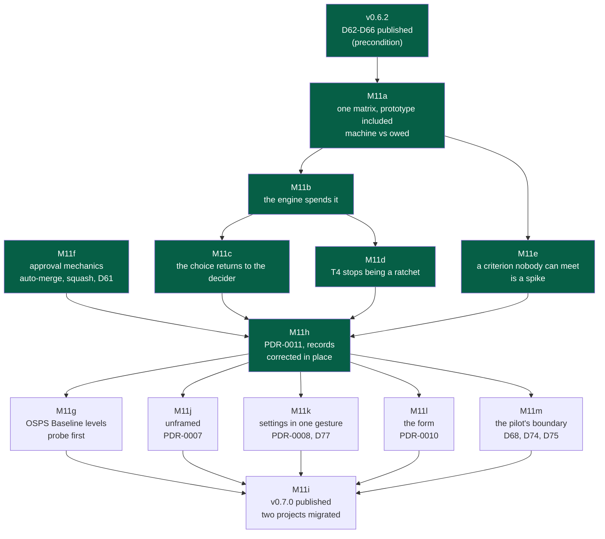

# NapkinStack M11 — Ceremony follows consequence — implementation plan

> **Location:** `docs/governance/plans/`, the repository's working context.
>
> **For the executing agent:** REQUIRED SUB-SKILL: use superpowers:subagent-driven-development
> (recommended) or superpowers:executing-plans to run this plan task by task. One workstream is
> one pull request, in the order of the roadmap, and each task is TDD: the failing test first,
> seen red for the right reason, then the code (P5). Steps use checkboxes (`- [ ]`).
> **The code blocks below are a design, not an extract from a prototype.** Two tasks carry a
> probe that must run before the blocks they cover are trusted: M11f task 0 (auto-merge on the
> forge) and M11g task 0 (the OSPS Baseline mapping). Until each probe is done, read the blocks
> it covers as a proposal.

**Goal:** make the framework cost what the consequence of a failure costs, and nothing more.
The proportionality is already promised — **three times, in three documents, in three shapes** — and executed
by a single threshold. This milestone turns the promise into rules a machine applies, and
removes the four mechanisms that charged the maximum price to every project regardless of what
it was building.

**Architecture:** two axes, two owners, no overlap.

| Axis | Unit | Declared in | Governs | Who decides |
|---|---|---|---|---|
| **Assurance** — what a failure of *this code* costs | the **module** | `criticality` in `MANIFEST.yaml` | the engine's checks: test sheet, verifier, e2e, runbook, contract tests | the **decider**, recorded in the module's creation ADR |
| **Exposure** — what a failure of *this project* costs others | the **project** | an OSPS Baseline target level | the forge's requirements: pull requests, status checks, human approval | the **decider**, at init or later |

They never override each other. A project at the lowest exposure level can hold a `critical`
module and pays its assurance in full; a widely used project at level 3 can hold a `prototype`
module and pays no assurance for it. This separation is what makes both axes small.

**Tech stack:** Python 3.12+ standard library, PyYAML and pytest 9.1.1, as the rest of
`platform/`; the generated project comes from `nstack init --source .`, as
`platform/tests/run.sh` already does. **No new dependency**, and no vendoring of the OSPS
Baseline catalogue — M11g reads identifiers and maps to them, it does not copy them.

---

## Why now, and on what evidence

**From the pilot** (`NapkinStack/flet`, public, 23 pull requests in three days, driven by a
session that knows nothing of this repository):

| Measured | Where it comes from |
|---|---|
| **16 of the decider's 54 turns** were a bare "approved" / "merged" — 7 of them pure relay, carrying no judgement | no auto-merge: the agent waits to be told |
| **7 turns** of "I do not understand what you are asking me" | the routing PDR-0004 has not been built |
| **6 turns** of "you are the expert, decide" | same |
| **5 turns** asking to **simulate** evidence the world could not supply | C4 requires acceptance criteria on every deliverable, and law 2 requires an executable oracle; market research has neither |
| **6 verification rounds** on one read-only `high` module, **3 of the 11 defects introduced by the late rounds**, while the `critical` module does not exist yet | T4 invalidates every scenario at each fix, and nothing says one round is enough |
| `screening` declared **`high`** — read-only, holds no key, places no order | `criticality` is a positional argument with **no help text**, no criteria at hand, and no consequence printed before the choice |

**From the market** (September 2026):

- **DORA** names the central cost of AI-assisted delivery the **verification tax**, and finds AI
  is an *amplifier*: the return comes from the system around the agent, not the agent. LinearB
  measures AI-generated code waiting **4.6× longer** for a first review; Atlassian names the
  *efficiency paradox* — output backs up at the points that need human judgement.
- **GitHub Spec Kit** (111k stars, 30+ agents) is criticised on exactly two points: the process
  is heavy, and **the documents it produces govern by convention rather than by enforcement**.
  Scott Logic's review reports being *"around ten times faster"* with plain iterative prompting,
  and concludes it is *"too much process for a disposable prototype, a tiny bug fix, or a task
  already expressed by a precise failing test"*.
- **The OpenSSF OSPS Baseline** places *"at least one non-author human approval before merging"*
  (`OSPS-QA-07.01`) at **maturity level 3 of 3**. "No direct commit to the primary branch"
  (`OSPS-AC-03.01`) is level 1; "automated status checks must pass" (`OSPS-QA-03.01`) is level 2.
- **The EU Cyber Resilience Act** entered its reporting phase on **11 September 2026**; full
  compliance is due 11 December 2027. The Baseline is mapped to it.

**The conclusion that orders this plan.** Our first criticism is the market leader's first
weakness — that is our reason to exist, and it is kept. Our second weakness is *also* the market
leader's second weakness, unsolved by anyone: uniform ceremony. And our checklist imposes
`OSPS-QA-07.01`, a level-3 control, **from a project's first commit**. We ship the top tier as
the floor.

---

## Global constraints

- **P1 to P7 hold.** In particular **P5**: every rule this plan adds or moves gains a test that
  proves it fails when broken, seen red first. And **P4**: the kernel stays within 250 lines —
  M11c adds one routing line and must remove one elsewhere or stay under budget.
- **No new configuration for a single use (§6).** The only new project-level field is the OSPS
  target, and it is optional with a default that blocks nobody.
- **We report alignment, never conformity.** `doctor` says which Baseline controls it *observes*
  as satisfied. It does not certify, and the wording must make that impossible to misread.
- **Nothing here rewrites a published version's promise.** The `CHANGELOG` entries for v0.1.0 to
  v0.6.1 are untouched.
- **Records are corrected in place**, ADRs and PDRs included, and the exemption is declared in
  `PRODUCT.md` §5 with its end at v1.0 (M11h). The history stays in `workstreams.md` and in the
  `CHANGELOG`.
- **Precondition: v0.6.2 is published before M11a starts.** It carries D62–D65, already on
  `main`, plus D66. The pilot upgrades at its cycle boundary and must find the fixed messages.

## Decisions taken while planning

1. **The project-level knob is the OSPS Baseline level, not an invented one.** Three levels
   already exist, are machine-readable, are mapped to CRA and NIST, and carry a sentence with
   commercial value. Inventing `solo`/`team` was measured against the pilot's 23 pull requests
   and would have changed **none of them**; it was dropped.
2. **The criticality matrix of `05-workflow.md` §7 is the single source for *when*.** The
   framework describes proportionate requirements in **three** places: the four-cran diagram of
   `07-governance.md` §6, the seventeen-row Definition of Done of `05-workflow.md` §7, and the
   thirteen-row reliability table of `08-quality.md` §7 — three shapes, and only the diagram
   carries `prototype`. The matrix says **when** a requirement applies; §6 points at it; §7 of
   `08-quality.md` keeps **what** an operable module holds and gives up the when.
3. **Human review leaves the criticality matrix.** Approval is exposure, not blast radius: it
   belongs to the OSPS axis. This removes any need to amend ADR-0004 — the four settings of
   `07-governance.md` §7 keep holding together at level 3, which is where they are required.
4. **Each matrix row is marked *machine* or *owed*.** A framework that pretends CI verifies UAT
   teaches people to ignore it. **Eight rows are executable; ten are owed** to a human and named
   as such. The count changed once during M11b: the e2e row was written as *machine* and moved to
   *owed* when building it showed a check could not tell an end-to-end suite from a unit suite
   renamed — see M11b task 4.
5. **`high` and `critical` finally differ, without a new field.** `critical` adds: the sheet
   confirmed at head after the last fix, e2e present and green, and the runbook referenced by the
   sheet. The four values plus `user_facing` are enough; no `read_only` field is added.
6. **The framework never asks for N verification rounds.** It asks for one sheet and one
   independent verifier. The six rounds came from T4 and from silence; the matrix says
   explicitly that further rounds are a project's own decision.
7. **Auto-merge is a correction, not an option.** It removes the human from the *merge*, never
   from the *approval*. ADR-0004 requires an approval; it never required a human to press merge.
8. **Market research is not a deliverable.** PDR-0010, accepted 2026-09-22, already gives it a
   home: a typed issue. No new artefact, no new field on cycles.

---

## Roadmap



**Legend** — green: merged · no fill: to do. Redrawn by M11h on 2026-09-24: M11h was taken
before M11g, which may evaporate on its probe, and M11j to M11m were added before the release.

M11f has no dependency and gives the largest immediate relief for the smallest change: it may be
taken first if the pilot's next cycle starts before M11a lands.

## File map

| File | What changes | Workstream |
|---|---|---|
| `skeleton/docs/os/05-workflow.md` §7 | the matrix gains `prototype`, loses *Human review*, marks each row *machine* / *owed*, states one round | M11a |
| `skeleton/docs/os/07-governance.md` §6 | the second description is removed; it points at the matrix | M11a |
| `skeleton/docs/os/08-quality.md` §7 | **the third table**: keeps *what* an operable module holds, gives up *when* it is required | M11a |
| `src/napkinstack/templates/module/MANIFEST.yaml` | the `criticality` comment points at the matrix, not at the diagram — it is what the agent reads when it chooses | M11a |
| `skeleton/playbooks/framing.md` | the criticality implied by the risks points at the matrix; the decision is the decider's | M11a, M11c |
| `skeleton/.github/pull_request_template.md` | the sheet's table gains the `Confirmed` column | M11d |
| `skeleton/README.md.jinja` | the CHECKLIST copy, word for word, with its test | M11f, M11g |
| `skeleton/.github/workflows/module-checks.yml` | already branches on criticality; the dead *"Not wired up (D9)"* step goes | M11b |
| `skeleton/docs/os/07-governance.md` §7 | approval is described by exposure level, not as an absolute | M11g |
| `src/napkinstack/assurance.py` | **new**: the machine half of the matrix, read by every rule that spends it | M11b |
| `src/napkinstack/fitness/manifests.py` | M8 reads the matrix instead of a hard-coded threshold | M11b |
| `src/napkinstack/pull_request.py` | T1 and T4 read the matrix; T4 splits by scenario kind | M11b, M11d |
| `src/napkinstack/modules.py`, `cli.py` | `criticality` gains help text and printed consequences | M11c |
| `skeleton/AGENTS.md` | one routing line: the criticality is the decider's | M11c |
| `skeleton/playbooks/framing.md`, `discovery.md` | non-code work goes to an issue, not a deliverable | M11e |
| `src/napkinstack/fitness/plan.py` | C4's acceptance criteria apply to delivery deliverables | M11e |
| `src/napkinstack/doctor.py` | auto-merge, squash-only, branch deletion; then OSPS levels | M11f, M11g |
| `skeleton/.github/CODEOWNERS.jinja` | unchanged — the default owner stays | — |
| `docs/pdr/0011-*.md` | new: ceremony follows consequence | M11h |
| `docs/adr/0005-*.md` | new: adopt the OSPS Baseline rather than invent a scale | M11g |
| `docs/adr/0003-*.md` | shrunk to the rule in force | M11h |
| `AGENTS.md`, `PRODUCT.md` §2, §3, §5 | the M7 sentence, the fifth user, the honest claim, the records exemption | M11h |
| `docs/governance/workstreams.md` | D66 to D77 recorded | M11h |
| `CHANGELOG.md` | the v0.7.0 section, engine and project apart | M11i |

---

## Coherence map — everything that cites what this plan rewrites

Checked by search, not by memory. An executing agent that changes a section without walking this
list leaves the framework saying two things at once, which is the defect being removed.

**Cites `05-workflow.md` §7** (the matrix): `00-overview.md` glossary · `08-quality.md` §128 ·
`07-governance.md` §7 closing sentence · `playbooks/tests.md` · `.github/pull_request_template.md`
(twice) · `.github/workflows/module-checks.yml` (twice) · `templates/module/MANIFEST.yaml` ·
`fitness/manifests.py` (M10, twice) · `pull_request.py` (twice) · `modules.py`.

**Cites `07-governance.md` §6** (the diagram): `templates/module/MANIFEST.yaml:18` ·
`playbooks/framing.md:40`.

**Cites `07-governance.md` §7** (approval and the forge): `skeleton/AGENTS.md:27` ·
`skeleton/README.md.jinja:127` · `.github/CODEOWNERS.jinja` (twice) · `modules.py:63` ·
`10-measurement.md:93` · `docs/adr/0004-*.md` (twice). **M11g rewrites §7's framing, never its
number**, so every citation above keeps resolving; each is re-read once to confirm the sentence
it points at still says what the citing file claims.

**Two copies bound by a test:** `CHECKLIST` in `doctor.py`, printed by `nstack init`, read by
`project.py`, repeated word for word in `skeleton/README.md.jinja`.

**Identifiers, verified free before use:** M1 to M10 are taken, so the e2e rule is **M11**;
G1 to G13 are taken, so the forge rules are **G14, G15, G16**. Families in use: B1-B9, C1-C7,
G1-G13, H1-H2, K1-K4, L0-L7, M1-M10, P1-P6, S1-S8, T1-T5, V1, W1.

---

## M11a — One matrix, `prototype` included, each row named — PR 1

No behaviour change. This workstream makes the contract readable before any code spends it.

- [x] **Task 1.** In `05-workflow.md` §7, add the `prototype` column and remove the *Human
      review* row (it moves to `07-governance.md` §7 in M11g, as an exposure requirement).
- [x] **Task 2.** Mark every row. A row is **machine** when a check in this repository can fail
      on it today, **owed** otherwise. The seven machine rows: oracle green · lint, format,
      types · unit tests · contract tests · fitness functions · test sheet run by an independent
      verifier · e2e. The ten owed rows keep their place and gain one sentence: *"owed to a human;
      no check reads it."*
- [x] **Task 3.** Add, under the matrix: **one round.** The framework asks for one sheet and one
      verifier who is not an author. Further adversarial rounds are a project's own decision,
      recorded in its own ADR — never a framework requirement.
- [x] **Task 4.** State what separates `high` from `critical`, in the matrix itself: `critical`
      adds the sheet **confirmed at head** after the last fix, **e2e present and green**, and the
      **runbook referenced** by the sheet.
- [x] **Task 5.** In `07-governance.md` §6, replace the four-cran diagram's content with a
      pointer to the matrix, keeping the principle sentence (*"never impose the ceremony of a
      critical system on a small module"*) and the revision rule.
- [x] **Task 6 — the third table.** `08-quality.md` §7 holds a **thirteen-row reliability table**
      on the same three columns, also without `prototype`, and `modules.py:37` cites it as the
      authority for the runbook while the DoD matrix carries a runbook row too. **One fact, one
      home**: the matrix says *when* a runbook is required, `08-quality.md` §7 says *what it
      contains* and points at the matrix for the when. Its own columns gain `prototype`, or state
      in one sentence that operability starts at `standard`.
- [x] **Task 7 — the comment the agent actually reads.** `src/napkinstack/templates/module/
      MANIFEST.yaml:18` points the `criticality` field at `07-governance.md` §6. It is the line
      under the agent's cursor when it chooses (D70). It points at the matrix.
      `skeleton/playbooks/framing.md:40`, which derives the criticality from the risks, does the
      same.
- [x] **Task 8.** `platform/tests/` gains a case that fails when **any two** of the three
      documents describe different sets of criticality values — the defect this workstream exists
      to close, and it had three homes, not two.

**Done when:** one document says when, the others say what, `prototype` is in all of them, every
row says who judges it, and a test refuses a second description of the same fact.

## M11b — The engine spends the matrix — PR 2

- [x] **Task 1.** A single module holds the matrix as data, read by `manifests.py` and
      `pull_request.py`, so a change to the contract is one edit:

```python
# src/napkinstack/assurance.py — the matrix of docs/os/05-workflow.md §7, machine rows only.
MATRIX = {
    "prototype": {"sheet": False, "runbook": False, "e2e": False, "confirm_at_head": False},
    "standard":  {"sheet": "user_facing", "runbook": False, "e2e": False, "confirm_at_head": False},
    "high":      {"sheet": True, "runbook": True, "e2e": True, "confirm_at_head": False},
    "critical":  {"sheet": True, "runbook": True, "e2e": True, "confirm_at_head": True},
}
```

- [x] **Task 2.** T1 reads `MATRIX[...]["sheet"]` instead of a hard-coded set. Test first: a
      `prototype` module changed beyond its description must **not** be asked for a sheet, and a
      `standard` user-facing one must.
- [x] **Task 3.** M8 reads `["runbook"]`. Test first: a `standard` module with no runbook passes;
      a `high` one fails with the action naming the file to create.
- [x] **Task 4 — built, then removed. The rule does not ship.** A new rule `M11` was to require
      `commands.e2e` wherever the matrix asked for e2e. It was written, its test was seen red, and
      then **this repository's own `platform` module refused it for a good reason**: `platform`
      declares its entire oracle as `commands.test`, because its test suite *is* its end-to-end
      suite. The rule would have asked it to declare one command under two names.
      A check can read that an `e2e` verb exists; it cannot read that the verb runs end-to-end
      scenarios rather than the unit suite renamed. **A rule a one-line alias satisfies teaches the
      alias** — which is what P6 says of every contournable check. The e2e row moved to *owed*,
      with that reason written in `05-workflow.md` §7 where a reader will meet it.
      Ten minutes of dogfood against a rule the plan had already approved. Recorded, not hidden.
- [x] **Task 5.** Every message names the criticality that produced the requirement and what the
      neighbouring value would change (P6). Example: *"FAIL [T1] … required at criticality
      `high`. At `standard` this module would need a sheet only if it were user-facing."*
- [x] **Task 6 — the CI already knows.** `module-checks.yml` reads `.module.criticality` and
      branches on it already; it also runs `nstack e2e` unconditionally. Two consequences: M11's
      rule adds the **declaration** requirement, not the run, and the dead step *"Levels high and
      critical — not wired up yet (D9)"*, which prints a sentence and passes in **every generated
      project**, is removed. A step that cannot fail is the residue this milestone exists to
      remove; D9 stays open in the register, without a decorative step to stand for it.
- [x] **Task 7.** Run the real commands on a generated project, not only unit tests: one module
      per criticality value, and the four outcomes observed.

**Done when:** the four values produce four different regimes, each proven by a test that was
seen red, and no step in a generated project passes without being able to fail.

## M11c — The choice returns to the decider — PR 3 *(delivered)*

The defect: `cli.py:83` declares `criticality` with `choices=[...]` and **no `help`**, while its
neighbours `name` and `owner` have one. The agent types a word with no criteria at hand and
picks the prudent one.

- [x] **Task 1.** Help text on the argument, one line per value, phrased as a consequence:
      *"prototype: thrown away, nothing depends on it · standard: real code, no money, no
      personal data · high: a failure costs a day · critical: a key, an order, money, or
      someone's data."*
- [x] **Task 2.** `new-module` prints, **before creating**, what the chosen value will require
      and what the neighbouring values would change — the matrix rows that apply, not a link.
- [x] **Task 3.** `next_steps` gains one line: the creation ADR records the criticality **and one
      sentence of justification**. The ADR already goes through the decider's approval, so the
      choice becomes a reviewed act rather than a keystroke.
- [x] **Task 4.** One line in the kernel (`skeleton/AGENTS.md`), under the stopping rules: *"The
      criticality of a module is a product decision. You propose it with its consequence; the
      decider settles it."* Check the 250-line budget after the edit; if it exceeds, the sentence
      about session identity that `07-governance.md` §7 already carries in full is the one to
      shorten.
- [x] **Task 5.** `platform/tests/` asserts the help text exists and that the consequences are
      printed — a silent generator is the defect being fixed.

**Done when:** `nstack new-module --help` answers "which one do I pick?" without opening a
document, and the decision is recorded where a human approves it.

## M11d — T4 stops being a ratchet — PR 4

The defect: T4 requires every scenario's evidence to be produced on the head commit. A fix moves
the head, so **one blocker invalidates the whole sheet** and calls a full round. Cost is
O(rounds × scenarios) instead of O(scenarios + fixes). Measured: six rounds on one module.

- [x] **Task 1.** T4 splits by the scenario's declared kind.
      - **automated** — must be green at head. CI re-runs them; this costs nothing and stays.
      - **explored** and **human only** — the evidence keeps the commit it was produced on, and
        the sheet carries a **confirmation at head**: the verifier's line naming what changed
        since that commit and that it does not touch the behaviour the scenario covers.
- [x] **Task 2.** The sheet's table gains one column, `Confirmed`, empty for automated scenarios.
      Test first: a sheet with an explored scenario whose evidence predates the head and carries
      no confirmation must fail; the same sheet with a confirmation must pass.
- [x] **Task 3.** At criticality `critical`, the confirmation is required for **every** scenario,
      automated included — that is the `confirm_at_head` row of M11b's matrix, and it is where
      the two top values finally differ.
- [x] **Task 4.** The refusal message says which of the two paths applies, and gives the line to
      add (P6).
- [x] **Task 5.** `skeleton/.github/pull_request_template.md` carries the sheet's table for every
      project: it gains the `Confirmed` column, and the two places where it explains the sheet
      say what fills it. A rule whose form is not in the template is a rule nobody can satisfy on
      the first try.
- [x] **Task 6.** Rerun the pilot's own case as a fixture: a sheet of six scenarios, three fixes
      after the first verification, must pass with one confirmation block instead of three full
      re-runs.
- [x] **Task 7 — checked, and no record to correct.** PDR-0003 promises *scenarios written before
      the code, run by someone other than the author, each result backed by evidence*. It never
      promises evidence produced on the head commit — T4 is the engine's reading of it, not the
      decision. **PDR-0003 is untouched by this workstream**, and this line exists so that nobody
      later "fixes" a contradiction that does not exist.

**Done when:** fixing a blocker costs a confirmation, not a round, `critical` is the only value
that still pays the full price, and the template shows the form.

## M11e — A criterion nobody can meet gets met with counterfeit — PR 5 *(delivered)*

**Renamed while building it.** The plan said non-code work should *leave* the deliverables. It
should not: **the framework already had the right home for it, and the refusal did not mention
it.** `05-workflow.md` §3 says an exploratory task is a **spike** — *"the deliverable is
knowledge, not code"* — and `playbooks/framing.md` says a spike's criteria *"name what is
recorded and the threshold it is read against; a refuted result is still a delivered one."*

The pilot's D1, *"five private invitations, and we count who acts"*, was a legitimate spike. Its
criteria could have read *"we record how many of the five act within seven days; below two, the
demand is not shown"*, and **"nobody acted" would have been a delivered deliverable**. It did not
know that, so it answered a criterion it could not meet with five simulated proofs — merged and
reviewed like the rest. Sending the work to discovery or to an issue, as the plan proposed, would
have contradicted the framework's own answer and taught it as a second rule.

- [x] **Task 1.** C4's refusal names the door: write the criteria, **or make it a spike** — what
      will be recorded, the threshold, and a refuted result is a delivered one. And what has no
      criterion at all, because it waits on someone outside the project, is **a dependency with a
      date, not a deliverable**. The rule itself is unchanged.
- [x] **Task 2.** `playbooks/framing.md` step 2 gains the two questions to ask of every
      deliverable before writing its criteria, and the sentence that explains why one door is not
      enough: *a criterion nobody can meet is not met, it is answered with something that looks
      like proof.*
- [x] **Task 3.** `05-workflow.md` §3's diagnosis table gains the row it was missing — *it waits
      on someone outside the project* — and the spike row now says what a spike's criteria hold.
- [x] **Task 4.** The pilot's D1 is the fixture: the refusal must name knowledge, the spike, the
      refuted result, the dependency with a date, and what a criterion nobody can meet is answered
      with.

**Done when:** the framework stops offering one door to work that has two, and says which.

## M11f — Approval mechanics: the relief that weakens nothing — PR 6

Seven of the decider's sixteen approval turns carried no judgement: they existed because nobody
had enabled auto-merge and the agent waited to be told. This workstream removes the relay, not
the approval.

- [x] **Task 0 — probe, before any block below is trusted.** On a throwaway repository: enable
      auto-merge, approve a pull request with CI pending, confirm it merges on green; then push a
      commit to an approved and armed pull request and confirm G13 dismisses the approval and the
      merge waits. Rewrite the tasks below from what actually ran.
- [x] **Task 1.** A checklist rule — provisionally **G14** — auto-merge enabled on the
      repository, with `doctor` reading `allow_auto_merge`. Not blocking: a project that wants
      the agent to merge by hand keeps that.
- [x] **Task 2.** **G15**, squash-only merges, and **G16**, branch deletion on merge (D61, absorbed
      by PDR-0008). Both readable through the API **without the Administration permission**, so
      both are verified rather than merely written. The pilot's repository currently shows 22
      branches for 23 merged pull requests and four commits on `main` for two workstreams.
- [x] **Task 3.** The skeleton's `README` and `playbooks/verification.md` document the one-gesture
      approval: the human approves from their own terminal, under their own identity, without a
      browser round-trip. The agent still never approves.
- [x] **Task 4.** `doctor`'s output names the three new rules with the exact setting to change.
- [x] **Task 5 — the checklist has two copies and a test that binds them.** `CHECKLIST` lives in
      `doctor.py`, is printed by `nstack init`, read by `project.py`, and **repeated word for word
      in `skeleton/README.md.jinja`**, with a test that verifies it. G14 to G16 land in both, and
      the test is the guard — it must be seen red before the README is edited.
- [x] **Task 6.** The CI replay test asserts the message text for each of the three.

**Done when:** an approval is one gesture and the merge follows by itself, with every barrier of
ADR-0004 intact.

## M11g — The exposure level, anchored on the OSPS Baseline — PR 7

- [ ] **Task 0 — probe, before any block below is trusted.** Read `ossf/security-baseline`'s
      YAML catalogue and its Gemara mappings. Confirm that G1 to G13 and the five required checks
      map onto stable control identifiers, and that the three levels' membership is readable as
      data. **If the mapping is not clean, this workstream stops and returns to M13 as originally
      planned** — the rest of M11 does not depend on it. Record the outcome either way.
- [ ] **Task 1.** A mapping table, in the repository, from our rule identifiers to OSPS control
      identifiers, with the level each control belongs to. Our identifiers stay ours; theirs are
      referenced, never copied.
- [ ] **Task 2.** An optional project field, `assurance_level`, default **1** — the universal
      floor the Baseline itself recommends. It is a Copier answer in `.copier-answers.yml`,
      already owned by the code owner and therefore never merged without a human.
- [ ] **Task 3.** `doctor` reports two things and never confuses them: **the level attained**,
      from what it observes, and **the target**, from what is declared. A rule blocks only when
      its control belongs to the target level or below. `G2` and `G3` — the non-author human
      approval, `OSPS-QA-07.01` — become blocking at target 3, reported below it.
- [ ] **Task 4.** The wording is audited for one failure mode: `doctor` must never read as a
      certification. It says *"observed as satisfied"*, names what it cannot see, and links the
      Baseline rather than restating it.
- [ ] **Task 5.** `07-governance.md` §7 is rewritten: the four settings that close the
      self-approval door are described as **what level 3 requires**, with the honest statement of
      what a project below level 3 does not have. No amendment to ADR-0004 is needed — its
      reasoning is unchanged and its scope becomes explicit.
- [ ] **Task 6.** `ADR-0005` records the choice: adopt an external, machine-readable, regulation-
      mapped scale rather than invent one. Prior art in the record: OSPS Baseline, the EU CRA
      timetable, the three-tier convention of agent governance (IAPP, CBRA), and the rejected
      alternative — our own `solo`/`team`, measured against the pilot's 23 pull requests and
      found to change none of them.

**Done when:** a project knows which level it is at, which it targets, what the next one costs,
and the framework stops charging level 3 to a project that has no users.

## M11h — The records, corrected in place — PR 8

- [x] **Task 1.** **PDR-0011 — Ceremony follows consequence.** The product decision: two axes,
      two owners; the framework says what each level buys; a dated success criterion
      (**2027-03-31**) and a removal condition, per the PDR format.
- [x] **Task 2.** `PRODUCT.md` §3 gains a fifth user — *a solo founder before there is a product*
      — with a measurable criterion, because the plan is about serving them without betraying the
      other four. *Done as one user, not two:* PDR-0006 had promised §3 its user — one person
      with agents, on a repository the forge cannot guard — and it was never added. It is the same
      person, so it is one row, its criterion drawn from PDR-0006, PDR-0007 and PDR-0011.
- [x] **Task 3.** `PRODUCT.md` §2, *what it does not sell*, gains the honest sentence the market
      data supports: **NapkinStack costs on day one and pays from the first module someone else
      must review.** Stanford's measurement — 35-40% AI speedup on simple greenfield, under 10%
      on complex legacy — says plainly that we do not beat plain iterative prompting on a
      three-day greenfield MVP, and pretending otherwise is how trust is lost.
- [x] **Task 4.** `PRODUCT.md` §5 declares the records exemption: ADRs and PDRs of *this*
      repository are corrected in place until the framework has an outside user; the supersession
      rule of `06-decisions.md` §134 applies here **from v1.0**. An undeclared exemption is D57.
- [x] **Task 5.** `PDR-0007` is clarified in place: its sentence *"removes a bound on the work,
      never a check on the change"* is true of framing and false of criticality, which has always
      moved checks. One paragraph, dated.
- [x] **Task 6.** `ADR-0003` is shrunk to the rule in force — English everywhere including machine
      values, **no localisation mechanism**, git history not rewritten — and loses the migration
      narrative, the old value table and the correction log. `AGENTS.md:10-12` loses the M7
      sentence and keeps the rule. The skeleton needs no change: it contains **zero** occurrences.
- [x] **Task 7.** `workstreams.md` records **D66** (an update names only the target version's
      release page, so a project jumping versions lands where its conflict is not explained),
      **D67** (criticality declared on four values, spent on one threshold; proportionality
      promised in three documents and executed by nothing), **D68** (nothing says when to take an update),
      **D69** (the checklist imposes `OSPS-QA-07.01`, a level-3 control, from the first commit),
      **D70** (the criticality is chosen by the agent on a command line with no help, no criteria
      and no consequence shown), **D71** (T4's ratchet: one fix invalidates every scenario),
      **D72** (a deliverable that depends on people outside the project has no executable oracle;
      the framework demanded one and was paid in simulated evidence). *Done, with **D73 to D77**
      besides* — found at the pilot's cycle boundary — and the three accepted decisions no
      workstream carried (below, M11j to M11l).
- [x] **Task 8 — the two plans downstream.** **M12**'s catalogue enumerates the rules it attacks:
      it gains M11, G14, G15, G16, and its T1, T4 and M8 entries are rewritten to the new
      behaviour — a conformance suite that attacks the previous rules proves nothing. **M13**'s
      row in `workstreams.md` loses the OSPS mapping, which M11g has taken, and keeps the merge
      record (PDR-0009). *Done, with two corrections:* there is no rule **M11** to add — M11b
      built the e2e rule and removed it — and of G14 to G16 only **G15** refuses anything, so it
      alone gains a forge scenario. M13 keeps the mapping **conditionally**: M11g has not run, and
      its probe may send the mapping back.
- [x] **Task 9 — a measurement the documents are still waiting for.** `07-governance.md` §7 ends
      on an open condition: an agent's approval does not count *"until the test sheets show,
      module by module, that an independent verifier finds what a human would"*. The pilot
      produced the first data point — a delegated verifier found **8 real defects, 2 of which the
      author would have shipped**, forced 3 refusals to merge, and showed 5 of the author's
      fixtures proved nothing. The measurement is recorded beside the condition. **The rule does
      not change**: one data point on one module is not the module-by-module evidence the
      sentence asks for, and saying so is the point. *Done in PDR-0003, not beside the sentence:*
      `07-governance.md` is in the skeleton, and a figure from this framework's pilot has no place
      in every project's handbook (PDR-0010). The record the condition answers to is PDR-0003's
      success criterion, and that is where it is written.

**Done when:** every document says what is true now, the exemption that lets us do that is
written down, the register holds what was found, and no downstream plan still attacks a rule
that no longer exists.

**What M11h found that this plan had missed.** Three decisions accepted on 2026-09-22 —
PDR-0007, PDR-0008 and PDR-0010 — each said *"to be implemented in M11"*, and so did M11's row
in the register; this plan, written the next day, carried none of them, beyond D61's half of
PDR-0008 in M11f. On 2026-09-24 the maintainer decided they are built **in M11, before
v0.7.0**. They are M11j to M11l below; M11m gathers what the pilot's cycle boundary found.
Each is planned in detail when it starts — the decisions already carry testable acceptance
criteria, and those are the oracle.

## M11j — The unframed state (PDR-0007) — PR 10

A project with no accepted charter is **unframed**: K1 to K3 do not apply, every other rule
does, and every judging run names the state. Its oracle is PDR-0007's six acceptance criteria.
It builds PDR-0004's first axis, the stage, read from the repository and never declared.

**Done when:** a first delivery pull request on an unframed project merges with no charter,
no cycle and no label, while another rule still refuses something in that project.

## M11k — The forge's settings in one gesture (PDR-0008), and D77 — PR 11

One command beside `doctor`: it computes the distance to the checklist and prints the calls
that close it; applying is a choice, and only with a credential that **cannot commit**, checked
first and failing closed. Its oracle is PDR-0008's eight acceptance criteria. **D77** is fixed
here, because the command and `doctor` share one checklist and one verdict: *not read* and
*not in place* get two exit codes, and the summary says which.

**Done when:** a repository reaches the checklist in one gesture, no credential ever reaches
the output, and a script can tell a gap from what could not be read.

## M11l — The form, not the content (PDR-0010) — PR 12

`nstack init` writes a README stub that belongs to the product; the foundation's manual moves
to `docs/os/INSTALL.md`; `06-decisions.md` §9 names different places for planned and
unplanned work; the issue forms name kinds of work no deliverable claims; the documentation
standard is stated once. Its oracle is PDR-0010's five acceptance criteria. **The CHECKLIST's
second copy moves with the manual** — M11f bound it to `skeleton/README.md.jinja` by a test,
and that test is the first thing to see red.

**Done when:** a generated project's front page describes the product, and its manual is one
click away, unchanged in substance.

## M11m — What the pilot's cycle boundary found — PR 13

- **D74**: `nstack update` no longer carries a foreign commit silently — it builds its branch
  from the default branch, or refuses and names the branch it would have carried; the test,
  seen red first, decides which.
- **D68**: the pilot's sentence, *"upgrading mid-cycle changes the judge while a cycle is being
  judged"*, where the handbook describes an update.
- **D75**: one question in `playbooks/verification.md` — is the entry point a real user calls
  exercised the way they call it? A playbook line, not a check (P1).

**Done when:** an update started from a feature branch cannot carry a foreign commit
silently, and the two sentences are where the next reader looks.

## M11i — v0.7.0, and the two projects that already exist — PR 9 and the release

- [ ] **Task 1.** The `CHANGELOG` v0.7.0 section, **engine and project apart** (D63), with a
      **Migration** paragraph: what a project at the default target level sees change, and what a
      project that wants to keep today's behaviour declares. **Written from an update actually
      run against a copy of each real project before the tag, not predicted from the diff**
      (D73): our v0.6.1 note announced a conflict on the one project where it could not happen.
      And **both projects will turn red on G15 and G16**: each allows merge commits today.
- [ ] **Task 2.** The release, with explicit consent, and the release page produced by the
      workflow rather than by hand — its second live run after v0.6.2.
- [ ] **Task 3.** `tool-library` takes the update and is observed, not coached.
- [ ] **Task 4.** The pilot takes it at its own cycle boundary. **Its `screening` module is
      declared `high`; the matrix now says what that buys and what `standard` would have bought.**
      Whether it revises the declaration is a measurement, not an instruction, and it is logged in
      this repository either way.

---

## Verification — every pull request

1. `uv run bash platform/tests/run.sh` — **from a committed tree**: Copier copies the working
   state and four root dotfiles are character devices in this sandbox.
2. `nstack fitness` on this repository, and **the real commands on a project generated from the
   working tree** — not only unit tests.
3. `pre-commit run --all-files`.
4. The pull request body carries DONE / VERIFIED / ASSUMED / NOT VERIFIED / RISKS.
5. CI green, then the decider approves in the browser, then the merge under the App with
   `--match-head-commit <full sha>` and `--delete-branch`, then **`main` is checked after the
   merge**.

## Risks

| Risk | Why it is real | What we do |
|---|---|---|
| **The OSPS mapping is not clean** | Their controls are written for projects, ours for changes; the granularity may not line up | M11g task 0 is a probe with an explicit exit: the workstream returns to M13 and the rest of M11 ships without it |
| **`prototype` becomes a hiding place** | A module declared `prototype` to escape a sheet | The value is declared in a reviewed file, printed in every run, and `nstack modules` lists how many sit at each value. Measured, then judged — not guessed at now |
| **Lowering the assurance floor reads as lowering quality** | It is the product's promise: quality does not depend on vigilance | The floor is never lowered on a module that declares what it is; only the *default target* of the project moves, anchored on an external standard, and `doctor` names the gap to the next level at every run |
| **`doctor` is read as a certification** | "OSPS level 2" is a sentence people will put in a sales deck | M11g task 4 audits the wording; the word *observed* appears in every line, and what cannot be seen is listed |
| **The kernel exceeds 250 lines** | M11c adds a routing line; the kernel is at **226 of 250**, so one line fits and the risk is only that M11c grows | Checked in the task; if it grows, the sentence duplicated from `07-governance.md` §7 comes out |
| **The two existing projects conflict on update** | Both are ours, both take the skeleton | M11i does them one at a time, and the `CHANGELOG`'s Migration paragraph is written before the tag, not after |

## Self-review

- **No placeholder, no TBD.** The two blocks that are not yet proven are marked as probes with a
  named exit (M11f task 0, M11g task 0).
- **Internal consistency.** Human review appears in exactly one axis (exposure, M11g) and is
  removed from the other (M11a task 1). `confirm_at_head` is introduced in M11b's matrix and
  spent in M11d task 3. No rule is added without its failing test (P5). The three proportionality
  tables are reconciled by subject — when, what, and a pointer — rather than merged into one, and
  a test refuses a fourth description.
- **Coherence pass.** Every file citing the three sections this plan rewrites is listed in the
  coherence map, found by search. Three gaps the first draft had missed are closed: the third
  table (`08-quality.md` §7), the pull request template's sheet, and the CHECKLIST's second copy
  in the skeleton README.
- **Scope.** Nine workstreams at planning time, each tracing to a measured defect: D61, D66 to D72; M11h added four more (M11j to M11m), for three accepted decisions and D68, D74, D75, D77. Nothing here
  serves a user of `PRODUCT.md` §3 that is not named, and the fifth user is added explicitly
  rather than assumed.
- **Ambiguity.** "One round" (M11a task 3) is a statement about what the *framework* requires,
  never a cap on what a project chooses — the sentence says so in both directions.
- **What this plan deliberately does not build:** our own security control catalogue (OSPS
  exists, in YAML, with tooling), runtime action guardrails (OPA, Cedar and NIST hold that
  ground, and P3 says CI anyway), a spec → plan → tasks pipeline (Spec Kit and Kiro have it, and
  it is what they are criticised for), our own ArchUnit, and a per-rule configuration file.
