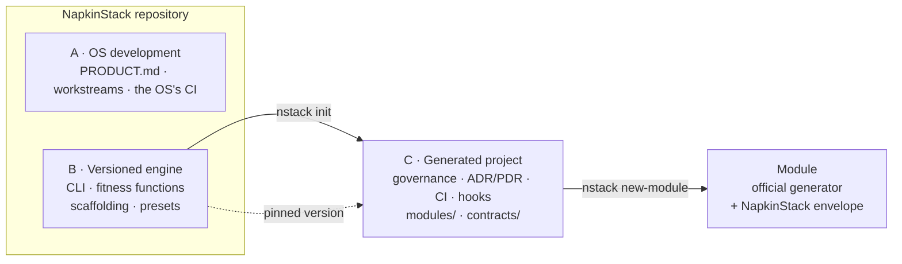

# Workstreams

> The foundation's identified defects, in the order they are dealt with.
> **One workstream = one pull request.** Never merge two together.
>
> Product context: [`PRODUCT.md`](../../PRODUCT.md). Invariants: `PRODUCT.md` §4.

## Sequence

```mermaid
flowchart LR
    S0["Step 0<br/>GitHub settings"]:::done --> C0["C0<br/>CI green on<br/>a fresh clone"]:::done
    C0 --> C01["C0.1<br/>hooks and secrets"]:::done
    C01 --> C02["C0.2<br/>workflow<br/>security"]:::done
    C02 --> C03["C0.3<br/>strict formats"]:::done
    C03 --> PDR["PDR-0001<br/>accepted"]:::done
    PDR --> A1["ADR-0001<br/>Copier, accepted"]:::done
    A1 --> A2["ADR-0002<br/>PyPI, accepted"]:::done
    A2 --> PT["Prototype<br/>validated"]:::done
    PT --> RP["Engine v0.1.0<br/>published on PyPI"]:::done
    RP --> M7["M7<br/>move to English<br/>ADR-0003"]:::done
    M7 --> V2["Engine v0.2.0<br/>published on PyPI"]:::done
    PT --> A4["ADR-0004<br/>agent identity<br/>accepted"]:::done
    PT --> P3["PDR-0003<br/>test sheet<br/>accepted"]:::done
    PT --> P2["PDR-0002<br/>frame and bound<br/>accepted"]:::done
    A4 --> M8["M8<br/>frame, verify, approve"]:::done
    P3 --> M8
    P2 --> M8
    V2 --> M8
    M8 --> V3["Engine v0.3.0<br/>published on PyPI"]:::done
    V3 --> D24["D24<br/>what changes a module<br/>v0.3.1 published"]:::done
    D24 --> M9["M9<br/>team-mode validation<br/>public, one cycle"]:::done
    M9 --> M10["M10<br/>every barrier refuses<br/>v0.4.0"]:::done
    M10 --> V50["v0.5.0<br/>V1 proved from the base<br/>a repository nothing guards"]:::todo
    V50 --> PP["Pilot project<br/>private, GitHub Team"]:::todo
    V50 --> M11["M11<br/>the first gesture<br/>routing · stages · settings"]:::todo
    M11 --> M12["M12<br/>conformance suite<br/>every barrier attacked"]:::todo
    M12 --> M13["M13<br/>the merge record<br/>PDR-0009"]:::todo
    PP -.->|"evidence"| M13

    classDef done fill:#065f46,color:#fff
    classDef wip fill:#1e3a8a,color:#fff
    classDef partial fill:#92400e,color:#fff
    classDef todo fill:#374151,color:#fff
    classDef blocked fill:#7c2d12,color:#fff
```



**Legend** — green: done · blue: in progress · orange: partial · grey: to do · red:
waiting on a decision.

| # | Workstream | Status |
|---|---|---|
| 0 | GitHub settings (outside the repository) | Done |
| C0 | CI green on a fresh clone | Done |
| C0.1 | Hooks and secrets | Done |
| C0.2 | Workflow security | Done |
| C0.3 | Strict formats | Done |
| PDR-0001 | [Create a project and receive updates](../pdr/0001-create-a-project-and-receive-updates.md) | Accepted (2026-09-15), clarified: private repositories |
| ADR-0001 | [Adopt Copier to generate and update projects](../adr/0001-adopt-copier-to-generate-and-update-projects.md) | Accepted (2026-09-15) |
| ADR-0002 | [Distribute NapkinStack on PyPI](../adr/0002-distribute-napkinstack-on-pypi.md) | Accepted (2026-09-15), verified at the v0.1.0 release |
| Prototype | Throwaway, validates PDR-0001's acceptance criteria | Done (2026-09-15), never merged |
| ADR-0003 | [Adopt English as the repository language](../adr/0003-adopt-english-as-the-repository-language.md) | Accepted (2026-09-16), criterion observed at the v0.2.0 and v0.3.0 releases |
| M7 | Moving the repository to English, through to v0.2.0 — [plan](plans/2026-09-16-english-migration.md) | Done (2026-09-16): M7a to M7d, v0.2.0 published |
| M8 | Frame, verify, approve: ADR-0004, PDR-0003, PDR-0002, through to v0.3.0 and the pilot — [plan](plans/2026-09-16-v0.3.0-frame-verify-approve.md) | Done (2026-09-17): M8.0 to M8f, v0.3.0 published; M8f task 3 done with M9's Task 0 |
| ADR-0004 | [Give agents their own GitHub identity, behind a human approval](../adr/0004-give-agents-their-own-github-identity.md) | Accepted (2026-09-16); applied to this repository (M8f, 2026-09-17), criterion observed in the pilot project; clarified 2026-09-19: who verified (D32), an approval covers what it read (D31) |
| PDR-0002 | [Frame and bound a project](../pdr/0002-frame-and-bound-a-project.md) | Accepted (2026-09-16), clarified: delivery work, extended: discovery; applied by M8, prototyped on the pilot's framing |
| PDR-0003 | [Approve a change on evidence of its behaviour](../pdr/0003-approve-a-change-on-evidence-of-its-behaviour.md) | Accepted (2026-09-16), clarified: what changes a module; applied by M8, measured in the pilot project |
| D24 | What changes a module: an update is neither delivery work nor a reason for a sheet, through to v0.3.1 — [plan](plans/2026-09-17-v0.3.1-what-changes-a-module.md) | Done (2026-09-17): v0.3.1 published, an update pull request passes |
| D25 | `doctor` G12 fails with "remove every bypass actor" when **no ruleset** applies to `main`: there is no actor to remove, and the action that fits is G1's, creating the ruleset (P6). Found in M9's Task 2 | v0.4.0: **M10f** — G12 names the ruleset to create |
| D26 | The checklist asks for four required checks, but GitHub only offers a check it has already seen: `Test sheet and cycle` and `PR scope and review budget` run on pull requests only, so a fresh repository cannot select them. Unblocked by opening a first pull request. Found in M9's Task 2 | v0.4.0: **M10f** — said in G4's action and in the skeleton README |
| D27 | A plan carried the author's home directory four times, once in a block meant to be copy-pasted: it names a folder no other machine has, and publishes the locale and the layout of the workstation it was written on. The leak review was a human `grep`, and `gitleaks` looks for secrets, not for a home directory. Found by the maintainer reviewing pull request #50 (M9's Task 3) | v0.4.0 (merged before M10, unreleased until then): rule **H1** in `nstack hygiene`, inside `nstack fitness`, which the skeleton's own workflow already runs — every generated project inherits it |
| D28 | `decider` is checked for being non-empty only, while the charter template writes `"@<github-handle>"` and C2's own message promises a GitHub handle (P6): a charter copied from the template and never filled in goes green, and so does a team where a decision needs one owner. Found reviewing how PDR-0004 lands, whose third rule reads the recipient rather than guessing it | v0.4.0 (merged before M10, unreleased until then): C2 and C7 require one person's handle, the rule defined once beside `OWNER` |
| M9 | Team-mode validation: the pilot rehearsed on a public subject, two teams, one cycle, drift probes, before paying for GitHub Team — [plan](plans/2026-09-17-team-mode-validation.md) | **Done (2026-09-19)**: one cycle end to end in a day, 0 sync events during the work, review median 10 min, 9 of 11 probes refused. Exit decision **fix first**: the pilot waits for the version that closes D29 to D33 |
| D29 | **The boundary rules are blind to a contract dependency — the only one the framework allows between modules.** `boundaries` builds the real graph from import lines, so a contract consumer imports nothing: `B1` accepts an undeclared dependency (probe P3, every check green), `B2` is walked around by a path manipulation (probe P2, `fitness` exits 0), `B4` warns on a real one. `docs/os/02-modules.md` promises the declared graph is compared with the real one; for this boundary it is not. Found in M9 | v0.4.0: **M10c** — the real graph is the contracts a module's files read, and any reference to another module's code is B2; B6 and B7 confront `consumes` and `provides` |
| D30 | **No check refuses a breaking change to a published contract version.** Renaming a required field of `v1` in place, producer edited to match, passes every fitness rule (probe P4). Caught only by the producer's own `e2e`, and only because those scenarios read the contract's examples. Found in M9 | v0.4.0: **M10d** — `nstack compat`, V1: a version consumed or stable changes only with the project's merged comparator |
| D31 | **Nothing requires GitHub's *Dismiss stale pull request approvals*.** An approval survives a force-push; only the agent's own `--match-head-commit` stood between an approval and content its approver never read. Enabled on both repositories on 2026-09-18; a generated project still ships with the hole open and `doctor` reports it compliant. Found in M9 | v0.4.0: **M10f** — checklist rule **G13** and its `doctor` check |
| D32 | **`T2` cannot tell a verifier from an author.** The `Verifier:` line is free text; its own message says "someone other than the author of the change" and nothing enforces it. A sheet filled by the authoring session passes identically. Found in M9 | v0.4.0: **M10e** — T2 compares the verifier, `@handle` or `session <id>`, with the change's authors and the sessions their `Agent-Session` trailers name |
| D33 | **`nstack new-module` produces a module that fails its own project**, and says nothing about the test sheet, the deliverable or the label its pull request will need — while holding every fact needed to say so. Measured: `check` and `test` exit 1 on the generated module. The field's convention (Rails, Nx) is that a generator's output is green. Found in M9 | v0.4.0: **M10a** — a module holding only its description needs no verb, M7 once it holds code; next steps naming the sheet and the cycle |
| D34 | Ten further findings of M9, none blocking: PDR-0002's criterion measures wall clock and therefore the decider's availability; `contracts/` and `platform/` are modules for one check and invisible to two others; the handbook contradicts itself on criticality; `playbooks/framing.md` says nothing about technical framing; technical decisions taken at framing have no artefact to land in; `provides` is never confronted with reality; `pr-check` and `pr-scope` count modules differently; two agent sessions on one checkout corrupt each other's branches; two teams conflict on `CODEOWNERS` at their first commit; `uv.lock` is neither committed nor ignored. All recorded in the validation log | Placed by the M10 plan: #2 and #7 done in M10b, #6 done in M10c, #8 done in M10e, **#10 done in M10h** (`tool-library` #33), **#1 done at M10's closure** (PDR-0002 clarified, `PRODUCT.md` §3); #3 to #5 in M11, PDR-0004's design; #9 after the pilot, if its teams hit it |
| D35 | **The module checks are not a required check.** `module-checks.yml` names each job after its module, so no ruleset can require them, and G4 lists four checks, none of them a module's: a pull request whose module tests fail — the automated scenarios behind a test sheet included — merges once approved. Found while planning M10, on `tool-library`'s ruleset | v0.4.0: **M10b** — a job `Module checks`, failing when any module's checks fail, required in G4 |
| D36 | **V1 could be walked around.** Moving a frozen version to another folder, `provides[].path` following it, then breaking it, was reported "removed" and passed; a version written as a number, or a stability misspelt, was never frozen, and M2 accepted both. Found by the independent review of v0.4.0, before its tag | v0.4.0: **M10 R1** — a version still provided is judged wherever it lives; M2 requires text for the contract fields and a known stability |
| D37 | **B3 could never fire on its own.** It read the code graph only, where every edge is already B2: a cycle through contracts — the only dependency allowed — passed, while the handbook promises the check. Found by the same review | v0.4.0: **M10 R1** — B3 reads the contracts and the code |
| D38 | **The lists of changed files dropped modules.** `git diff --name-only` reports a rename under its new name only, and quotes a non-ASCII name: the module a file left, or one holding a file named outside ASCII, escaped `Module checks`, P1, T1 and V1. Found by the same review | v0.4.0: **M10 R1** — one `changed_files()`, `--no-renames -z`, at every call site |
| D39 | **A contract kept outside a module's folder was never compared in CI**, and a pull request whose base was missing fell back to the first commit, where nothing is frozen. Found by the same review | v0.4.0: **M10 R1** — B7 requires the document inside a module's folder; the base of a pull request is required |
| D40 | **Tracebacks and quiet passes**: malformed contract entries, a short test-sheet row, no git on the path, an empty `MAX_LINES`, an unknown base passing `pr-scope` and `pr-check` silently; T2 walked around by a trailing period or a capital, and silent on authors outside GitHub's noreply addresses; "published" defined three ways; the template's `commands: {}` breaking on its first edit. Found by the same review | v0.4.0: **M10 R2** — no traceback, a base required, T2's session read as written, one definition of "published" (ADR-0002's), the template's `commands:` |
| D41 | **B2 and H1 refusing legitimate lines**: a module's own folder named like another module, a contract stored in its producer's folder; Go import blocks and `from modules import x` missed; H1 flagging a container image's home directory (the Node image's own user) — this very row had to be reworded to pass it. Found by the same review | v0.4.0: **M10 R3** — a relative path read from the file's and the module's folder, a contract path read as a contract, Go blocks and `from modules import`; H1 leaves image users, containers and runners, and addresses |
| D42 | **Documentation left behind by M10**: `09-platform.md` §4's text, `modules/README.md`, H1 undocumented for projects, the pull request template ignoring V1, a tool named in the kernel, the README's status (the PyPI page), "touched" meaning two things, `02-modules.md` §4 placing contracts inside modules. Found by the same review | v0.4.0: **M10 R4** — each passage corrected; the README's status is the 0.4.0 PyPI page |
| D43 | Three edges of the definition of a module: `platform/` provides contracts but is invisible to `boundaries`; two modules with one folder name under two bases; code kept under a module's `docs/` is its description. Found by the same review | After the pilot, if a project hits them |
| D44 | **V1 runs the merged proof in the pull request's tree.** The command is read at the base, so a pull request can neither thaw a version nor bring its own judge — but it runs where the change is, so a `compat` that calls a file of its module (a script, a binary its `bootstrap` installs) can be rewritten by the very change it judges. The validation project is not exposed: its command carries everything itself, which is why it reads that way. Found proving V1 on `tool-library` (M10h, #32) | **Done in v0.5.0**: the proof runs in the base's tree, and the change is handed exactly one file |
| D45 | **V1's refusal is wrong when the proof could not run**, and buries the comparator's verdict. Any non-zero exit is reported as "a breaking change" — a missing network or a wrong pin says the same as a real break — and a multi-line command is printed twice, in the `->` line and inside the message, pushing the comparator's own output out of sight (P6). Found in M10h (#32, #39) | **Done in v0.5.0**: "did not prove the change compatible", the command named once |
| D46 | **A step failing before `compat` hides V1's verdict.** `module-checks.yml` runs `compat` after `test`, with no condition: a pull request that breaks a frozen version *and* its module's tests is refused for the tests, and the author meets V1 only on the next round. Nothing gets through — the pull request is red either way — but the refusal that names the real problem arrives a round trip late. Found replaying P4 and P13 (M10h) | **Done in v0.5.0**: the compat step runs under `if: !cancelled()` |
| D47 | **Two wordings that misdirect.** K1 says "the project is not framed: no accepted charter and cycle" when the charter is accepted and only the next cycle is missing, and sends the reader to the framing playbook; `new-module`'s next steps repeat it. The `Module checks` step still says "Every touched module passed" where v0.4.0 says "changed" (D42's wording). Found in M10h (#31, P14) | **Done in v0.5.0**: K1 names which of the two is missing; the workflow says "changed" |
| D48 | **`setup-uv` pins no `uv` version in the skeleton's workflows.** It installs the latest, so a project whose modules run `uv run --locked` depends on a release nobody chose: a `uv` that writes locks differently turns the modules red with no change in the project. Found in M10h (#33), where the locks were written by 0.12.14 and CI ran 0.12.17 | After the pilot, if its modules lock with `uv` — a lock file is the project's stack (P1), and the workflow is the framework's |
| D49 | **T2 cannot see a verifier launched by the author's session.** It compares declared names with the change's authors and the sessions their trailers name; a verifier subagent with a fresh context, its own identifier and the brief alone passes — which is what ran on #31 and #33, disclosed in each pull request's risks. Found in M10h | With the verifier's own App, which ADR-0004 already schedules: from then the verdict is a check the ruleset requires from that App. Until then, declared in the pull request |
| M10 | **Every barrier the framework announces refuses**: D29 to D33, D35, D25 and D26, and PDR-0005, through to v0.4.0, proved on `tool-library` before the pilot — [plan](plans/2026-09-19-v0.4.0-every-barrier-refuses.md) | **Done (2026-09-19)**: M10a to M10g merged; the review before the tag found D36 to D43, fixed by #67 and #68; v0.4.0 published, tag on `486be72`, verified on published artefacts; M10h paid the update on `tool-library` (#31 to #33) and replayed the probes — **8 of 8 did what v0.4.0 promises**, `doctor` compliant. Exit decision **fix first**: D44 to D47 before the pilot, shipped in v0.5.0 with PDR-0006 |
| v0.5.0 | **V1 cannot be walked around, and a repository nothing guards is served honestly**: D44 to D47, PDR-0006 and ADR-0002's clarification — [plan](plans/2026-09-20-v0.5.0-a-proof-that-cannot-be-rewritten.md) | **Done (2026-09-20)**: five workstreams merged (#74 to #78), **v0.5.0 published**, tag on `309fd21`, verified on published artefacts — including the forge channel and an update of `tool-library` that asked for no adaptation at all. Next: the pilot, and M11 beside it |
| PDR-0004 | [Ask the right question, to the right person, at the right moment](../pdr/0004-ask-the-right-question-to-the-right-person.md) | Accepted (2026-09-18): the direction only — stage derived from the checks, hats in playbooks, recipient read from the project. Its criterion is met on M9's log; its design is M11, planned after M10 from M9's log and the pilot's framing |
| Audit 2026-09-20 | An external expert audited the public repository against the 2026 field; its claims were re-read against the code and the market re-verified from the products' own documentation — [note](audits/2026-09-20-external-audit.md) | Read and placed (2026-09-20): what was already true, what was wrong against the code, what is taken (M11, M12, M13, PDR-0007 to PDR-0009) and what is dated or refused with its reason |
| D50 | **A refusal named an action rather than a command.** `nstack update` run by an engine older than the project refused with *"use nstack X.Y.Z or newer"*; the maintainer then tried `uv tool upgrade napkinstack`, which does nothing on an install pinned to an exact version — uv says so in a hint, the framework said nothing. Invariant P6 asks for the action, and an action a reader cannot copy is a description. Found in real use on 2026-09-20, moving `tool-library` to v0.5.0 | **Done (2026-09-20)**: the refusal carries the command that moves a workstation forward; it ships with the next version |
| PDR-0007 | [Frame a project when framing buys something](../pdr/0007-frame-a-project-when-framing-buys-something.md) | Proposed (2026-09-20): a project with no accepted charter is **unframed**, the cycle rules K1 to K3 do not apply there, everything else does, and every judging run names the state. Measured: today a first delivery pull request hits `K1` with no way out but a justified label on each one. Planned for **M11**; criterion 2027-03-31 |
| PDR-0008 | [Configure the repository in one gesture, without handing over the keys](../pdr/0008-configure-the-repository-in-one-gesture.md) | Proposed (2026-09-20): the thirteen forge settings become one plan-aware gesture that only ever strengthens; printed by default, applied by an agent only with a credential that **cannot commit**, which the command verifies before acting (ADR-0004, clarified). Planned for **M11**; criterion 2027-03-31 |
| PDR-0009 | [Say why a change may merge, and what that does not prove](../pdr/0009-say-why-a-change-may-merge.md) | Proposed (2026-09-20): one record per head commit, built from the verdicts the rules already produce, naming the three states and ending with what it does not prove. Verified on 2026-09-20 that nothing in the field produces such a record. Planned for **M13**; criterion 2027-06-30 |
| M11 | **The first gesture costs what it buys**: PDR-0004's routing, PDR-0007's stages and PDR-0008's settings command, through to v0.6.0 | To plan (2026-09-20), after v0.5.0 and beside the pilot |
| M12 | **The conformance suite**: every barrier attacked on purpose, replayed at each release, its result published with the version — [plan](plans/2026-09-20-m12-conformance-suite.md) | Planned (2026-09-20): the probes of M9 and M10h become a versioned suite |
| M13 | **The merge record** (PDR-0009), and the checklist mapped to the OpenSSF OSPS Baseline's control identifiers | After the pilot's first cycle, which supplies the twenty pull requests its criterion measures |
| PDR-0006 | [Work on a repository the forge cannot guard](../pdr/0006-work-where-the-forge-cannot-guard.md) | Accepted (2026-09-20): on a private repository under a free plan nothing can refuse — verified, and no permission, fork or key invents a barrier. The tool names the state, separates what is out of reach from what is not yet done, and records on every repository a commit that reached `main` outside a pull request. Implemented in v0.5.0; criterion 2027-03-31 |
| PDR-0005 | [Work on the framework while using it, and never be judged in silence](../pdr/0005-work-on-the-framework-while-using-it.md) | Accepted (2026-09-18): the contributor's loop named in `CONTRIBUTING.md`; a project may pin an unpublished framework and can never be silent about being judged by one. ADR-0002 unchanged. Implemented in v0.4.0 (**M10g**); criterion 2027-03-31 |
| C1 | A single entry point, `nstack` | Handled by M1 and M4: the `nstack` command, module verbs read from the MANIFEST |
| C2 | Anti-placeholder check | After the pilot project, if the need is observed |
| C3 | A versioned git hook | Absorbed by C0.1 |
| C4 | An oracle proxy | After the pilot project, if the need is observed |
| C5 | Bootstrapping, `doctor` and branding | Handled by M2b and M3: `nstack init`, `nstack doctor` |

---

## Step 0 — GitHub settings

They are not versioned: every repository has to do them again. Since the move to an
organisation, the Actions policies, 2FA and base permissions are set once for the whole
`NapkinStack` organisation.

| Setting | State |
|---|---|
| Secret Protection and push protection | Verified through the API (disabled by the transfer, re-enabled) |
| Dependency graph and Dependabot alerts | Verified through the API |
| Discussions enabled (the question channel of the issue forms) | Verified through the API |
| Organisation: GitHub actions only, SHA pinning required, read-only token, approval for outside contributors | Verified through the API on the repository |
| Organisation: 2FA required, no base permission, the `maintainers` team with write | Confirmed; team verified through the API |
| Private vulnerability reporting | Verified through the API |
| Workflow approval for every outside contributor | Confirmed |
| Actions token read-only; Actions neither creates nor approves pull requests | Confirmed |
| Allowed actions: GitHub's only | Confirmed |
| Wiki disabled | Verified through the API |
| Ruleset `main`: pull request required, force-push and deletion forbidden, squash only | Verified through the API |
| Ruleset `main`: 1 approval, code owner review, empty bypass list (ADR-0004) | Verified through the API |
| Ruleset `main`: stale approvals dismissed when new commits are pushed (G13) | Verified through the API (2026-09-18) |
| GitHub App `napkinstack-agent`: installed on this repository only; Contents, Pull requests, Issues, Workflows write, Actions and Checks read, no Administration | Verified through the API |
| Required checks `Fitness functions` and `PR scope and review budget` | Verified through the API |
| Required check `Hooks and secrets` | Verified through the API |
| SHA-pinned actions required | Verified through the API |

## C0 — CI green on a fresh clone

**Defect.** `main` red from the first push: S3 requires gitignored skills, which are
therefore absent in CI. `pr_scope.sh` committed without its executable bit (exit 126). The
guardrail tests do not run in CI.

**Target.** S3 not applicable without `.claude/skills/`, and still blocking as soon as a
skill is generated. Shebang scripts at `100755`. `platform/tests/run.sh` inside the
`Fitness functions` job.

## C0.1 — Hooks and secrets

**Defect.** No local barrier before publication; the `secrets` job is a sham.

**Target.** The [pre-commit](https://pre-commit.com) framework: gitleaks,
`detect-private-key`, `check-added-large-files`, `check-merge-conflict`, shebang checks.
The same configuration runs in CI (P3), plus gitleaks over the pushed commits.

The failure test generates the fake secret at run time: written literally, it would
trigger push protection. Replaces C3, because pre-commit refuses to install when
`core.hooksPath` is set.

**Traps handled.** The official gitleaks hook only scans staged changes, empty in CI: CI
skips it and runs a local hook that scans the whole history. Output redacted
(`--redact`), because CI logs are public. Dependabot updates the gitleaks hook but not the
history scan: a test blocks the pull request while the two versions diverge (proven on
PR #5, v8.30.0 → v8.30.1).

## C0.2 — Workflow security

**Defect.** Injection possible: `${{ matrix.module }}`, coming from the pull request's
paths, is inserted into `run:`. No `permissions:`. Actions referenced by a mutable tag. A
token left in `.git/config`. `SECURITY.md` with no reporting channel. Local agent files
not ignored.

**Target.** zizmor and actionlint; `permissions: contents: read`; actions pinned by SHA
and kept up to date by Dependabot; `persist-credentials: false`; expressions passed
through `env:`; `SECURITY.md` pointing at private reporting; `.gitignore` completed.

**Measured.** zizmor: 32 findings before, 0 after. Points retained: the scope job's
`git fetch` is removed (redundant with `fetch-depth: 0`, and it would fail on a private
repository with no token); zizmor runs offline and actionlint without shellcheck, so local
and CI results are identical; Dependabot bypasses the Actions policy, so mandatory SHA
pinning does not block it.

## C0.3 — Strict formats

**Defect.** The YAML frontmatter of the 5 generated skills is invalid (French-style
` : `). The `MANIFEST.yaml` template is invalid (`{{MODULE_NAME}}` reads as a mapping).
PyYAML accepts duplicate keys silently.

**Target.** `check-yaml`, yamllint, check-jsonschema (GitHub schemas). Frontmatter
serialised by `yaml.safe_dump`, conforming to the Agent Skills specification.

**Traps handled.** yamllint only parses syntax: it lets `{{MODULE_NAME}}` through, and
only `check-yaml`'s real load refuses it. By default the `truthy` rule is only a warning:
`--strict` makes it blocking. The workflows' `on:` key stays allowed, the `yes`/`on`
values do not. The workflows do not go through check-jsonschema, actionlint already covers
them. No maintained tool validates skills (`skills-ref` is only a demonstration): hence
the S4 check in `sync_skills.py`.

**Measured.** `check-yaml`: a single failing file, the template. yamllint: 127 style
findings with the default configuration, 0 with 5 relaxations (`.yamllint.yaml`), none on
substance. The 3 GitHub schemas already passed. Mutations: 12 defects reintroduced, 12
caught by `platform/tests/run.sh`.

## PDR-0001 — Create a project and receive updates



**Legend** — solid line: generation, once · dotted: a versioned dependency, the project
chooses when to move up.

**Accepted (2026-09-15, after the prototype)**: [`docs/pdr/0001-create-a-project-and-receive-updates.md`](../pdr/0001-create-a-project-and-receive-updates.md).
The project owns its skeleton and adapts it; every version reaches it on demand, as a pull
request merged with its adaptations (a three-way merge); GitHub settings as a checklist
verified read-only; uv the only prerequisite. It replaces the "copied or generated",
"GitHub settings" points and the revision of P1 and §6, applied on 2026-09-15.

**Decided before the PDR.**

- 2026-09-13: the Django model, an independent project with no shared CI; a stack chosen
  per module; a preset is data delegating to the official generator, created for a real
  project; GitHub only to start with.
- 2026-09-14: the `NapkinStack` GitHub organisation, by renaming the account, creating the
  organisation and transferring the repository; the `maintainers` team owns the
  foundation.

**To settle, in order.**

- ~~ADR-0001 — template tool~~: Copier, accepted after the prototype (2026-09-15). A
  single template in this repository, the skeleton; versions = tags; no "unsafe" feature.
- ~~ADR-0002 — distribution and name~~: PyPI, the `napkinstack` package, the `nstack`
  command, `uv_build`, publication on tag through Trusted Publishing, accepted at the
  v0.1.0 release (2026-09-15).
- ~~ADR-0003 — repository language~~: English everywhere, machine values included; no
  localisation mechanism; accepted on 2026-09-16, executed by workstream M7, published in
  v0.2.0.
- ADR-0004 — agent identity: proposed on 2026-09-16, a GitHub App per organisation, no
  human credential in the agent's session, a human code owner's approval and an empty
  bypass list; applied with the pilot project, which checks its criterion. An agent's
  approval is deferred, decided on PDR-0003's measurement.
- PDR-0003 — approve on evidence: proposed on 2026-09-16, a test sheet written before the
  code, run by a verifier other than the author, no result without evidence; the
  framework decides the rule, the project its tools, the module its scenarios.
- PDR-0002 — frame and bound a project: proposed on 2026-09-16, compared with Shape Up,
  Spec Kit, Scrum and BMad. Three levels of rules (framework, project, module), the
  postures, a charter, and cycles with a finite list of deliverables, an appetite, an end
  date and a circuit breaker; the framing is an interview led by the team's agent, `init`
  keeps its three questions.

**Prototype (2026-09-15).** The mechanism validated in a uv + git container: criteria 1,
2, 4, 6 and 7 validated, 5 after a fix (D20), 3 partial (a module template that imposes
`make`). Gaps carried into the implementation plan, together with the rewrite of the
product README and the replanning of C1, C2, C4 and C5.

---

## C1 — A single entry point, `nstack`

> **Handled by M1 and M4** ([plan](plans/2026-09-15-engine-v0.1.0.md)): the `nstack`
> command published as a package, the root Makefile deleted (M1); the `check`, `test`,
> `bootstrap` and `run` verbs read from the MANIFEST, a module template with no Makefile
> (M4). The choice follows Nx and moon conventions, recorded in the plan: no dedicated
> ADR.

**Defect.** Four invocation styles coexist (`make`, `python3 platform/…`,
`bash platform/…`, `./platform/…`). Worse: the root `Makefile` assumes every module has a
Makefile, which violates invariant P1 — a Node module should not have to write a Makefile
to satisfy the platform.

**Target.**

```
./nstack help
./nstack doctor                    # installation diagnosis
./nstack fitness                   # manifests + boundaries + skills-check
./nstack check [module]            # delegates to the MANIFEST commands
./nstack test [module]
./nstack bootstrap [module]
./nstack run <module>
./nstack skills [--check]
./nstack new-module <name> <owner> <criticality>
./nstack pr-scope [base]
```

**Constraints.**

- `check`, `test`, `bootstrap` and `run` read `commands:` from the module's
  `MANIFEST.yaml` and run what is declared there. They **never** assume a Makefile, a
  `package.json` or anything else exists. That is the heart of the workstream: the
  platform orchestrates, it knows no stack.
- With no module argument, the command applies to all of them and exits in failure on the
  first one that fails, naming which.
- An `nstack` file, with no extension, shebang `#!/usr/bin/env python3`, executable.
  **Not `os.py`** (shadows Python's standard module), **not `manage.py`** (a collision if
  a Django module arrives), **not `napkin`** (a binary already taken by the npm package
  `napkin-ai`, which also uses a `.napkin/` folder). Possible configuration folder:
  `.nstack/`.
- No new dependency. The standard library plus PyYAML, already present.
- The scripts in `platform/fitness/` stay directly executable: CI calls them that way and
  must not depend on the CLI.
- Delete the root `Makefile` and the module template's. The template's `commands` become
  explicit `TODO`s rather than `make` calls.
- Update every reference to `make …` — `README.md`, `CONTRIBUTING.md`,
  `platform/README.md`, workflows, scaffolding. No dead reference.
- Write `docs/adr/0001-point-d-entree-unique-nstack.md`. The *prior art* covers two
  conventions: the single entry point (Django's `manage.py`) and CLI naming (a
  pronounceable word rather than an initialism). The *consequences* name the newly
  checkable rule: the commands are declared in the manifest, so the platform no longer
  imposes any stack.

## C2 — Anti-placeholder check

> **After the pilot project, if the need is observed** ([plan](plans/2026-09-15-engine-v0.1.0.md)):
> a new check, therefore built only after it has served (`PRODUCT.md` §6).

**Defect.** `manifests.py` checks that `responsibility` is non-empty, not that it has been
written. A module left entirely unfilled goes green. The template guarantees the shape,
not the content.

**Target.** Check `M10`: any `TODO`, `FIXME` or `<…>` marker left in a `MANIFEST.yaml`, a
local `AGENTS.md` or a `runbook.md` fails CI **as soon as the module leaves the `proposed`
status**. A `proposed` module is allowed to be incomplete; an `active` one is not.

## C3 — A versioned git hook

> **Absorbed by C0.1.** pre-commit is the convention, and it refuses to install when
> `core.hooksPath` is set. Text kept for the record.

**Defect.** `.git/hooks/` is not versioned: a hook created by hand exists only on its
author's machine.

**Target.** `core.hooksPath` pointing at a folder in the repository, set by
`./nstack bootstrap`. The pre-commit hook runs `./nstack fitness`.

It stays bypassable with `--no-verify`, and **that is deliberate** (invariant P3). Write
it as a comment in the hook, otherwise somebody will harden it one day meaning well, and
we will stop treating CI as the real barrier.

## C4 — An oracle proxy

> **After the pilot project, if the need is observed** ([plan](plans/2026-09-15-engine-v0.1.0.md)):
> a new check, therefore built only after it has served (`PRODUCT.md` §6).

**Defect.** The OS requires the success criterion to be written and seen failing before
generation. That cannot be checked mechanically.

**Target.** The best available proxy: on a pull request labelled `feature` or `bug`, check
that at least one file under a test folder is touched.

**A warning, not a block** — the proxy catches the blatant case, not the subtle one, and a
gate that blocks wrongly will be worked around. Document that limit in
`docs/os/07-governance.md`.

## C5 — Bootstrapping, `doctor` and branding

> **Handled by `nstack init` (M2b) and `nstack doctor` (M3)** ([plan](plans/2026-09-15-engine-v0.1.0.md)):
> no more unzipping, no more creation from a repository template. Branding CODEOWNERS and
> the manifests is done (organisation, 2026-09-14).

**Defect.** The foundation currently assumes an `unzip`, and still carries generic
markers.

**Target.**

- Document creating the repository from a template in the README, in place of unzipping.
- `./nstack doctor` diagnoses: Python and PyYAML, the forge CLI available, hooks
  installed, remaining personalisation markers, the presence of `PRODUCT.md` in a client
  project (an installation error). Its output reminds the reader that the GitHub required
  checks are the only real barrier and that they **are not copied** with the template.
- ~~Replace `@equipe-plateforme` in `.github/CODEOWNERS` and in the manifests of
  `platform/` and `contracts/`~~: done, `@NapkinStack/maintainers`. What remains is
  adapting the scaffolding to an owner of the form `org/team` (D19).
- **Brand nothing in `docs/os/`, `playbooks/` or `AGENTS.md`** (invariant P7). When in
  doubt about a file: leave it generic.

---

## Defect register

Observed during the audit of 2026-09-13. A defect with no workstream is waiting to be
scheduled.

| # | Observation | Handled by |
|---|---|---|
| D1 | S3 requires gitignored skills: `main` red on any fresh clone | C0 |
| D2 | Shebang scripts not executable (`pr_scope.sh`: exit 126) | C0 |
| D3 | Guardrail tests absent from CI | C0 |
| D4 | Checks with no failure test (P5): M1, M3–M9, B1–B5, S1–S2, P1–P2 | M6.1: one failure test per M, B, S, P rule (pytest), mutations verified |
| D5 | M1 documented but not implemented | M6.1: M1 implemented |
| D6 | ~34 dead references `docs/0X-….md`, 3 of them in the kernel | M3.2: references fixed, guarded by a test |
| D7 | "Module" defined 5 times, differently (fitness, `pr_scope.sh`, workflow, scaffolding) | M10b: one definition for scope and CI (`nstack modules`, `pr-scope`); the rest after the pilot project |
| D8 | A malformed manifest: a traceback instead of a message (P6) | M6.1: types checked in manifests, boundaries and skills |
| D9 | Declarations with no effect: `review_budget` never read, criticality steps as `echo TODO` | After the pilot project |
| D10 | The YAML frontmatter of the generated skills is invalid | C0.3 |
| D11 | The `MANIFEST.yaml` template: invalid YAML | C0.3 |
| D12 | A sham `secrets` job; `.gitignore` points this detector at C5, which does not mention it | C0.1 |
| D13 | Workflows: injection, permissions, pinning, persisted token | C0.2 |
| D14 | `SECURITY.md` with no channel; local agent files not ignored | C0.2 |
| D15 | The handbook: checks promised but absent (ADR/PDR prior art, lifecycle transitions, the contraction issue, the consumer matrix, deadlines) | M6: announced checks marked "review, to automate", listed in the backlog |
| D16 | `@equipe-plateforme` refused by GitHub; teams impossible on a user account | Organisation (2026-09-14) |
| D17 | A dead `ORG/REPO` link in the issue form | Organisation (2026-09-14) |
| D18 | Bootstrapping: `make` and `pip` absent from the reference workstation | M1: uv the only prerequisite |
| D19 | Scaffolding: `sed` breaks on an owner containing `/` | M4: scaffolding in Python, owner organisation/team |
| D20 | `check-merge-conflict` ignores markers outside a git merge: a Copier update conflict gets committed (found by the PDR-0001 prototype) | `--assume-in-merge`, 2026-09-15 |
| D21 | Engine coupled to the repository: `sync_skills.py` and `new-module.sh` assume they live in the project (found by the prototype) | M1: `--root` |
| D22 | Module template: `make` commands imposed, contrary to P1 and R5 (confirmed by the prototype) | M4: a template with no Makefile, commands to declare |
| D23 | Engine installed: `SOURCE_SUFFIXES` and `IMPORT_HINTS` of `boundaries.py` can no longer be calibrated from a project (found by M2a) | After the pilot project |
| D24 | An `nstack update` pull request fails `pr-check` T1 whenever the new version changes a file under `contracts/` (criticality high) or a module's manifest has to migrate (M10): no label lifts T1, and an update is not delivery work (found at the v0.3.0 release) | v0.3.1: a module changes beyond its description only; the stricter of base and head (PDR-0003 clarification, 2026-09-17) |

---

## Definition of Done, per workstream

- [ ] The behaviour is covered by a test that failed before
- [ ] `uv run nstack fitness` green
- [ ] `uv run bash platform/tests/run.sh` green
- [ ] Affected documentation updated
- [ ] No dead reference
- [ ] The workstream's status updated in the table above
- [ ] A summary in the `DONE / VERIFIED / ASSUMED / NOT VERIFIED / RISKS` format
