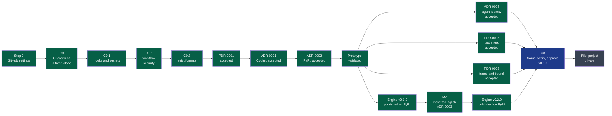
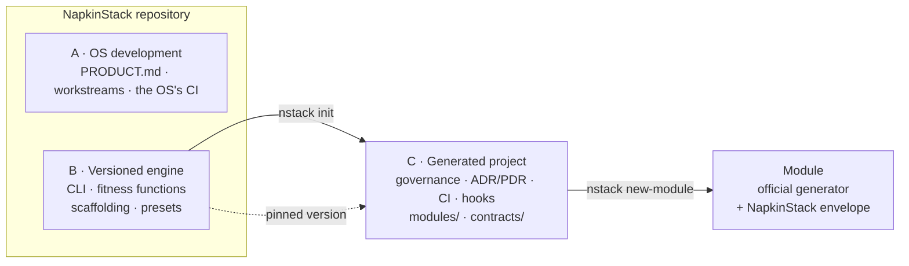

# Workstreams

> The foundation's identified defects, in the order they are dealt with.
> **One workstream = one pull request.** Never merge two together.
>
> Product context: [`PRODUCT.md`](../../PRODUCT.md). Invariants: `PRODUCT.md` §4.

## Sequence



**Legend** — green: done · blue: in progress · orange: partial · grey: to do · red:
waiting on a decision.

| # | Workstream | Status |
|---|---|---|
| 0 | GitHub settings (outside the repository) | Done |
| C0 | CI green on a fresh clone | Done |
| C0.1 | Hooks and secrets | Done |
| C0.2 | Workflow security | Done |
| C0.3 | Strict formats | Done |
| PDR-0001 | [Create a project and receive updates](../pdr/0001-create-a-project-and-receive-updates.md) | Accepted (2026-09-15), clarified: private repositories |
| ADR-0001 | [Adopt Copier to generate and update projects](../adr/0001-adopt-copier-to-generate-and-update-projects.md) | Accepted (2026-09-15) |
| ADR-0002 | [Distribute NapkinStack on PyPI](../adr/0002-distribute-napkinstack-on-pypi.md) | Accepted (2026-09-15), verified at the v0.1.0 release |
| Prototype | Throwaway, validates PDR-0001's acceptance criteria | Done (2026-09-15), never merged |
| ADR-0003 | [Adopt English as the repository language](../adr/0003-adopt-english-as-the-repository-language.md) | Accepted (2026-09-16), criterion observed at the v0.2.0 release |
| M7 | Moving the repository to English, through to v0.2.0 — [plan](plans/2026-09-16-english-migration.md) | Done (2026-09-16): M7a to M7d, v0.2.0 published |
| M8 | Frame, verify, approve: ADR-0004, PDR-0003, PDR-0002, through to v0.3.0 and the pilot — [plan](plans/2026-09-16-v0.3.0-frame-verify-approve.md) | In progress: plan |
| ADR-0004 | [Give agents their own GitHub identity, behind a human approval](../adr/0004-give-agents-their-own-github-identity.md) | Accepted (2026-09-16); applied by M8, criterion observed in the pilot project |
| PDR-0002 | [Frame and bound a project](../pdr/0002-frame-and-bound-a-project.md) | Accepted (2026-09-16), clarified: delivery work, extended: discovery; applied by M8, prototyped on the pilot's framing |
| PDR-0003 | [Approve a change on evidence of its behaviour](../pdr/0003-approve-a-change-on-evidence-of-its-behaviour.md) | Accepted (2026-09-16); applied by M8, measured in the pilot project |
| C1 | A single entry point, `nstack` | Handled by M1 and M4: the `nstack` command, module verbs read from the MANIFEST |
| C2 | Anti-placeholder check | After the pilot project, if the need is observed |
| C3 | A versioned git hook | Absorbed by C0.1 |
| C4 | An oracle proxy | After the pilot project, if the need is observed |
| C5 | Bootstrapping, `doctor` and branding | Handled by M2b and M3: `nstack init`, `nstack doctor` |

---

## Step 0 — GitHub settings

They are not versioned: every repository has to do them again. Since the move to an
organisation, the Actions policies, 2FA and base permissions are set once for the whole
`NapkinStack` organisation.

| Setting | State |
|---|---|
| Secret Protection and push protection | Verified through the API (disabled by the transfer, re-enabled) |
| Dependency graph and Dependabot alerts | Verified through the API |
| Discussions enabled (the question channel of the issue forms) | Verified through the API |
| Organisation: GitHub actions only, SHA pinning required, read-only token, approval for outside contributors | Verified through the API on the repository |
| Organisation: 2FA required, no base permission, the `maintainers` team with write | Confirmed; team verified through the API |
| Private vulnerability reporting | Verified through the API |
| Workflow approval for every outside contributor | Confirmed |
| Actions token read-only; Actions neither creates nor approves pull requests | Confirmed |
| Allowed actions: GitHub's only | Confirmed |
| Wiki disabled | Verified through the API |
| Ruleset `main`: pull request required, force-push and deletion forbidden, squash only | Verified through the API |
| Ruleset `main`: 1 approval, code owner review, empty bypass list (ADR-0004) | Verified through the API |
| GitHub App `napkinstack-agent`: installed on this repository only; Contents, Pull requests, Issues, Workflows write, Actions and Checks read, no Administration | Verified through the API |
| Required checks `Fitness functions` and `PR scope and review budget` | Verified through the API |
| Required check `Hooks and secrets` | Verified through the API |
| SHA-pinned actions required | Verified through the API |

## C0 — CI green on a fresh clone

**Defect.** `main` red from the first push: S3 requires gitignored skills, which are
therefore absent in CI. `pr_scope.sh` committed without its executable bit (exit 126). The
guardrail tests do not run in CI.

**Target.** S3 not applicable without `.claude/skills/`, and still blocking as soon as a
skill is generated. Shebang scripts at `100755`. `platform/tests/run.sh` inside the
`Fitness functions` job.

## C0.1 — Hooks and secrets

**Defect.** No local barrier before publication; the `secrets` job is a sham.

**Target.** The [pre-commit](https://pre-commit.com) framework: gitleaks,
`detect-private-key`, `check-added-large-files`, `check-merge-conflict`, shebang checks.
The same configuration runs in CI (P3), plus gitleaks over the pushed commits.

The failure test generates the fake secret at run time: written literally, it would
trigger push protection. Replaces C3, because pre-commit refuses to install when
`core.hooksPath` is set.

**Traps handled.** The official gitleaks hook only scans staged changes, empty in CI: CI
skips it and runs a local hook that scans the whole history. Output redacted
(`--redact`), because CI logs are public. Dependabot updates the gitleaks hook but not the
history scan: a test blocks the pull request while the two versions diverge (proven on
PR #5, v8.30.0 → v8.30.1).

## C0.2 — Workflow security

**Defect.** Injection possible: `${{ matrix.module }}`, coming from the pull request's
paths, is inserted into `run:`. No `permissions:`. Actions referenced by a mutable tag. A
token left in `.git/config`. `SECURITY.md` with no reporting channel. Local agent files
not ignored.

**Target.** zizmor and actionlint; `permissions: contents: read`; actions pinned by SHA
and kept up to date by Dependabot; `persist-credentials: false`; expressions passed
through `env:`; `SECURITY.md` pointing at private reporting; `.gitignore` completed.

**Measured.** zizmor: 32 findings before, 0 after. Points retained: the scope job's
`git fetch` is removed (redundant with `fetch-depth: 0`, and it would fail on a private
repository with no token); zizmor runs offline and actionlint without shellcheck, so local
and CI results are identical; Dependabot bypasses the Actions policy, so mandatory SHA
pinning does not block it.

## C0.3 — Strict formats

**Defect.** The YAML frontmatter of the 5 generated skills is invalid (French-style
` : `). The `MANIFEST.yaml` template is invalid (`{{MODULE_NAME}}` reads as a mapping).
PyYAML accepts duplicate keys silently.

**Target.** `check-yaml`, yamllint, check-jsonschema (GitHub schemas). Frontmatter
serialised by `yaml.safe_dump`, conforming to the Agent Skills specification.

**Traps handled.** yamllint only parses syntax: it lets `{{MODULE_NAME}}` through, and
only `check-yaml`'s real load refuses it. By default the `truthy` rule is only a warning:
`--strict` makes it blocking. The workflows' `on:` key stays allowed, the `yes`/`on`
values do not. The workflows do not go through check-jsonschema, actionlint already covers
them. No maintained tool validates skills (`skills-ref` is only a demonstration): hence
the S4 check in `sync_skills.py`.

**Measured.** `check-yaml`: a single failing file, the template. yamllint: 127 style
findings with the default configuration, 0 with 5 relaxations (`.yamllint.yaml`), none on
substance. The 3 GitHub schemas already passed. Mutations: 12 defects reintroduced, 12
caught by `platform/tests/run.sh`.

## PDR-0001 — Create a project and receive updates



**Legend** — solid line: generation, once · dotted: a versioned dependency, the project
chooses when to move up.

**Accepted (2026-09-15, after the prototype)**: [`docs/pdr/0001-create-a-project-and-receive-updates.md`](../pdr/0001-create-a-project-and-receive-updates.md).
The project owns its skeleton and adapts it; every version reaches it on demand, as a pull
request merged with its adaptations (a three-way merge); GitHub settings as a checklist
verified read-only; uv the only prerequisite. It replaces the "copied or generated",
"GitHub settings" points and the revision of P1 and §6, applied on 2026-09-15.

**Decided before the PDR.**

- 2026-09-13: the Django model, an independent project with no shared CI; a stack chosen
  per module; a preset is data delegating to the official generator, created for a real
  project; GitHub only to start with.
- 2026-09-14: the `NapkinStack` GitHub organisation, by renaming the account, creating the
  organisation and transferring the repository; the `maintainers` team owns the
  foundation.

**To settle, in order.**

- ~~ADR-0001 — template tool~~: Copier, accepted after the prototype (2026-09-15). A
  single template in this repository, the skeleton; versions = tags; no "unsafe" feature.
- ~~ADR-0002 — distribution and name~~: PyPI, the `napkinstack` package, the `nstack`
  command, `uv_build`, publication on tag through Trusted Publishing, accepted at the
  v0.1.0 release (2026-09-15).
- ~~ADR-0003 — repository language~~: English everywhere, machine values included; no
  localisation mechanism; accepted on 2026-09-16, executed by workstream M7, published in
  v0.2.0.
- ADR-0004 — agent identity: proposed on 2026-09-16, a GitHub App per organisation, no
  human credential in the agent's session, a human code owner's approval and an empty
  bypass list; applied with the pilot project, which checks its criterion. An agent's
  approval is deferred, decided on PDR-0003's measurement.
- PDR-0003 — approve on evidence: proposed on 2026-09-16, a test sheet written before the
  code, run by a verifier other than the author, no result without evidence; the
  framework decides the rule, the project its tools, the module its scenarios.
- PDR-0002 — frame and bound a project: proposed on 2026-09-16, compared with Shape Up,
  Spec Kit, Scrum and BMad. Three levels of rules (framework, project, module), the
  postures, a charter, and cycles with a finite list of deliverables, an appetite, an end
  date and a circuit breaker; the framing is an interview led by the team's agent, `init`
  keeps its three questions.

**Prototype (2026-09-15).** The mechanism validated in a uv + git container: criteria 1,
2, 4, 6 and 7 validated, 5 after a fix (D20), 3 partial (a module template that imposes
`make`). Gaps carried into the implementation plan, together with the rewrite of the
product README and the replanning of C1, C2, C4 and C5.

---

## C1 — A single entry point, `nstack`

> **Handled by M1 and M4** ([plan](plans/2026-09-15-engine-v0.1.0.md)): the `nstack`
> command published as a package, the root Makefile deleted (M1); the `check`, `test`,
> `bootstrap` and `run` verbs read from the MANIFEST, a module template with no Makefile
> (M4). The choice follows Nx and moon conventions, recorded in the plan: no dedicated
> ADR.

**Defect.** Four invocation styles coexist (`make`, `python3 platform/…`,
`bash platform/…`, `./platform/…`). Worse: the root `Makefile` assumes every module has a
Makefile, which violates invariant P1 — a Node module should not have to write a Makefile
to satisfy the platform.

**Target.**

```
./nstack help
./nstack doctor                    # installation diagnosis
./nstack fitness                   # manifests + boundaries + skills-check
./nstack check [module]            # delegates to the MANIFEST commands
./nstack test [module]
./nstack bootstrap [module]
./nstack run <module>
./nstack skills [--check]
./nstack new-module <name> <owner> <criticality>
./nstack pr-scope [base]
```

**Constraints.**

- `check`, `test`, `bootstrap` and `run` read `commands:` from the module's
  `MANIFEST.yaml` and run what is declared there. They **never** assume a Makefile, a
  `package.json` or anything else exists. That is the heart of the workstream: the
  platform orchestrates, it knows no stack.
- With no module argument, the command applies to all of them and exits in failure on the
  first one that fails, naming which.
- An `nstack` file, with no extension, shebang `#!/usr/bin/env python3`, executable.
  **Not `os.py`** (shadows Python's standard module), **not `manage.py`** (a collision if
  a Django module arrives), **not `napkin`** (a binary already taken by the npm package
  `napkin-ai`, which also uses a `.napkin/` folder). Possible configuration folder:
  `.nstack/`.
- No new dependency. The standard library plus PyYAML, already present.
- The scripts in `platform/fitness/` stay directly executable: CI calls them that way and
  must not depend on the CLI.
- Delete the root `Makefile` and the module template's. The template's `commands` become
  explicit `TODO`s rather than `make` calls.
- Update every reference to `make …` — `README.md`, `CONTRIBUTING.md`,
  `platform/README.md`, workflows, scaffolding. No dead reference.
- Write `docs/adr/0001-point-d-entree-unique-nstack.md`. The *prior art* covers two
  conventions: the single entry point (Django's `manage.py`) and CLI naming (a
  pronounceable word rather than an initialism). The *consequences* name the newly
  checkable rule: the commands are declared in the manifest, so the platform no longer
  imposes any stack.

## C2 — Anti-placeholder check

> **After the pilot project, if the need is observed** ([plan](plans/2026-09-15-engine-v0.1.0.md)):
> a new check, therefore built only after it has served (`PRODUCT.md` §6).

**Defect.** `manifests.py` checks that `responsibility` is non-empty, not that it has been
written. A module left entirely unfilled goes green. The template guarantees the shape,
not the content.

**Target.** Check `M10`: any `TODO`, `FIXME` or `<…>` marker left in a `MANIFEST.yaml`, a
local `AGENTS.md` or a `runbook.md` fails CI **as soon as the module leaves the `proposed`
status**. A `proposed` module is allowed to be incomplete; an `active` one is not.

## C3 — A versioned git hook

> **Absorbed by C0.1.** pre-commit is the convention, and it refuses to install when
> `core.hooksPath` is set. Text kept for the record.

**Defect.** `.git/hooks/` is not versioned: a hook created by hand exists only on its
author's machine.

**Target.** `core.hooksPath` pointing at a folder in the repository, set by
`./nstack bootstrap`. The pre-commit hook runs `./nstack fitness`.

It stays bypassable with `--no-verify`, and **that is deliberate** (invariant P3). Write
it as a comment in the hook, otherwise somebody will harden it one day meaning well, and
we will stop treating CI as the real barrier.

## C4 — An oracle proxy

> **After the pilot project, if the need is observed** ([plan](plans/2026-09-15-engine-v0.1.0.md)):
> a new check, therefore built only after it has served (`PRODUCT.md` §6).

**Defect.** The OS requires the success criterion to be written and seen failing before
generation. That cannot be checked mechanically.

**Target.** The best available proxy: on a pull request labelled `feature` or `bug`, check
that at least one file under a test folder is touched.

**A warning, not a block** — the proxy catches the blatant case, not the subtle one, and a
gate that blocks wrongly will be worked around. Document that limit in
`docs/os/07-governance.md`.

## C5 — Bootstrapping, `doctor` and branding

> **Handled by `nstack init` (M2b) and `nstack doctor` (M3)** ([plan](plans/2026-09-15-engine-v0.1.0.md)):
> no more unzipping, no more creation from a repository template. Branding CODEOWNERS and
> the manifests is done (organisation, 2026-09-14).

**Defect.** The foundation currently assumes an `unzip`, and still carries generic
markers.

**Target.**

- Document creating the repository from a template in the README, in place of unzipping.
- `./nstack doctor` diagnoses: Python and PyYAML, the forge CLI available, hooks
  installed, remaining personalisation markers, the presence of `PRODUCT.md` in a client
  project (an installation error). Its output reminds the reader that the GitHub required
  checks are the only real barrier and that they **are not copied** with the template.
- ~~Replace `@equipe-plateforme` in `.github/CODEOWNERS` and in the manifests of
  `platform/` and `contracts/`~~: done, `@NapkinStack/maintainers`. What remains is
  adapting the scaffolding to an owner of the form `org/team` (D19).
- **Brand nothing in `docs/os/`, `playbooks/` or `AGENTS.md`** (invariant P7). When in
  doubt about a file: leave it generic.

---

## Defect register

Observed during the audit of 2026-09-13. A defect with no workstream is waiting to be
scheduled.

| # | Observation | Handled by |
|---|---|---|
| D1 | S3 requires gitignored skills: `main` red on any fresh clone | C0 |
| D2 | Shebang scripts not executable (`pr_scope.sh`: exit 126) | C0 |
| D3 | Guardrail tests absent from CI | C0 |
| D4 | Checks with no failure test (P5): M1, M3–M9, B1–B5, S1–S2, P1–P2 | M6.1: one failure test per M, B, S, P rule (pytest), mutations verified |
| D5 | M1 documented but not implemented | M6.1: M1 implemented |
| D6 | ~34 dead references `docs/0X-….md`, 3 of them in the kernel | M3.2: references fixed, guarded by a test |
| D7 | "Module" defined 5 times, differently (fitness, `pr_scope.sh`, workflow, scaffolding) | After the pilot project |
| D8 | A malformed manifest: a traceback instead of a message (P6) | M6.1: types checked in manifests, boundaries and skills |
| D9 | Declarations with no effect: `review_budget` never read, criticality steps as `echo TODO` | After the pilot project |
| D10 | The YAML frontmatter of the generated skills is invalid | C0.3 |
| D11 | The `MANIFEST.yaml` template: invalid YAML | C0.3 |
| D12 | A sham `secrets` job; `.gitignore` points this detector at C5, which does not mention it | C0.1 |
| D13 | Workflows: injection, permissions, pinning, persisted token | C0.2 |
| D14 | `SECURITY.md` with no channel; local agent files not ignored | C0.2 |
| D15 | The handbook: checks promised but absent (ADR/PDR prior art, lifecycle transitions, the contraction issue, the consumer matrix, deadlines) | M6: announced checks marked "review, to automate", listed in the backlog |
| D16 | `@equipe-plateforme` refused by GitHub; teams impossible on a user account | Organisation (2026-09-14) |
| D17 | A dead `ORG/REPO` link in the issue form | Organisation (2026-09-14) |
| D18 | Bootstrapping: `make` and `pip` absent from the reference workstation | M1: uv the only prerequisite |
| D19 | Scaffolding: `sed` breaks on an owner containing `/` | M4: scaffolding in Python, owner organisation/team |
| D20 | `check-merge-conflict` ignores markers outside a git merge: a Copier update conflict gets committed (found by the PDR-0001 prototype) | `--assume-in-merge`, 2026-09-15 |
| D21 | Engine coupled to the repository: `sync_skills.py` and `new-module.sh` assume they live in the project (found by the prototype) | M1: `--root` |
| D22 | Module template: `make` commands imposed, contrary to P1 and R5 (confirmed by the prototype) | M4: a template with no Makefile, commands to declare |
| D23 | Engine installed: `SOURCE_SUFFIXES` and `IMPORT_HINTS` of `boundaries.py` can no longer be calibrated from a project (found by M2a) | After the pilot project |

---

## Definition of Done, per workstream

- [ ] The behaviour is covered by a test that failed before
- [ ] `uv run nstack fitness` green
- [ ] `uv run bash platform/tests/run.sh` green
- [ ] Affected documentation updated
- [ ] No dead reference
- [ ] The workstream's status updated in the table above
- [ ] A summary in the `DONE / VERIFIED / ASSUMED / NOT VERIFIED / RISKS` format
