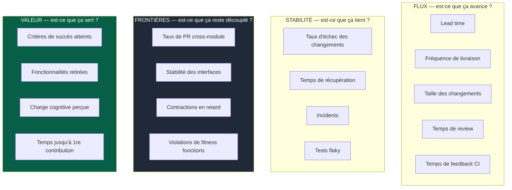
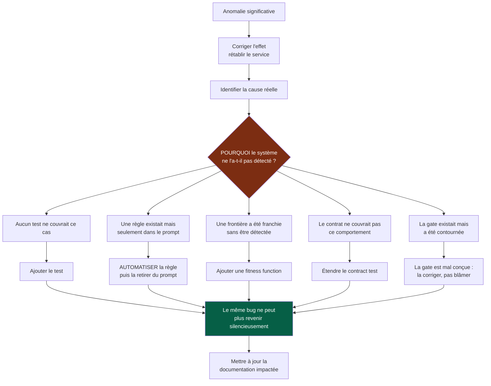

# 10 — Mesure et amélioration

## 1. À quoi servent les métriques

> Les métriques servent à améliorer le système, pas à produire des objectifs artificiels.

Toute métrique transformée en objectif individuel cesse de mesurer ce qu'elle mesurait.
Les indicateurs de ce document se lisent au niveau du **système** : ils servent à
répondre à « où ça grince ? », jamais à « qui est performant ? ».

**Ne jamais optimiser la quantité de code produite.** C'est la seule métrique que les
agents font exploser sans effort, et elle est inversement corrélée à ce qu'on cherche.

---

## 2. Les quatre familles



Les familles 1 et 2 sont classiques. Les deux autres sont spécifiques à cet OS et à mon
sens les plus informatives ici.

---

## 3. Les indicateurs qui comptent vraiment

### Taux de PR cross-module

**Le meilleur indicateur de qualité des frontières.** Il est collecté gratuitement,
puisqu'une PR cross-module nécessite un label explicite (`02-modules.md` §7).

| Tendance | Interprétation |
|---|---|
| Faible et stable | Les frontières tiennent |
| En hausse | Une frontière se dégrade — regarder quelle paire de modules revient |
| Concentré sur deux modules | Ces deux modules devraient probablement être fusionnés, ou découpés autrement |

### Taux de PR hors budget de revue

Mesure la pression réelle de la génération sur la capacité de vérification
(`05-workflow.md` §4). Une hausse signifie qu'on produit plus vite qu'on ne vérifie, et
que la qualité de la revue se dégrade silencieusement — bien avant que les incidents
n'augmentent.

### Contractions en retard

Nombre de versions de contrat dépréciées dont la date de retrait est dépassée
(`03-contrats.md` §4). C'est la mesure directe des **états intermédiaires permanents**.
Elle ne devrait jamais croître durablement.

### Temps de feedback CI

Une CI lente n'est pas seulement désagréable : elle est **contournée**. Au-delà d'un
certain seuil, les développeurs cessent de lancer les checks localement, poussent pour
voir, et ignorent les résultats. La vitesse du feedback est une propriété de qualité,
pas de confort.

### Critères de succès atteints

Proportion des décisions dont le critère daté a été vérifié à l'échéance
(`06-decisions.md` §5). Si cette proportion est faible ou inconnue, la documentation
décisionnelle est décorative.

### Fonctionnalités retirées

Un projet qui ne retire jamais rien accumule. Ce n'est pas un indicateur à maximiser,
mais un indicateur **qui ne doit pas rester à zéro** indéfiniment.

---

## 4. La boucle de feedback après incident



> **Ne pas simplement corriger un bug : améliorer le système qui a permis au bug de
> passer.**

La question `D` est la seule qui compte réellement. Un post-mortem qui s'arrête à la
cause technique produit une correction ; un post-mortem qui répond à « pourquoi le
système ne l'a-t-il pas vu ? » produit un garde-fou.

> Objectif : **transformer les erreurs passées en garde-fous futurs.**

Noter le traitement du cas `E5` : quand une gate a été contournée, le réflexe de blâmer
l'individu est une impasse. Une gate systématiquement contournée est une gate mal
conçue — trop lente, trop bruyante, ou sans valeur perçue (`07-gouvernance.md` §5).

---

## 5. Les rituels

Trois rendez-vous suffisent. Tous produisent une décision, jamais un simple constat.

| Rituel | Fréquence | Contenu | Sortie |
|---|---|---|---|
| **Revue de frontières** | Mensuelle | PR cross-module, violations de fitness functions, contractions en retard | Issues *Architecture*, ou rien |
| **Revue de décisions** | Trimestrielle | ADR/PDR dont le critère est arrivé à échéance | Confirmée · supersédée · fonctionnalité retirée |
| **Revue du backlog d'automatisation** | Trimestrielle | Règles qui vivent encore dans le prompt | Automatiser · supprimer · reconduire avec échéance |

Les deux dernières peuvent se tenir ensemble : elles traitent le même sujet vu de deux
côtés — ce qui aurait dû quitter le prompt, et ce qui aurait dû quitter le produit.

---

## 6. Amélioration de l'OS lui-même

L'OS est soumis à ses propres règles. En particulier :

**Le kernel a un budget.** 250 lignes. Ajouter une règle impose d'en retirer une autre
ou de l'automatiser. Sans cette contrainte, le kernel grossit à chaque incident et
redevient le document de 6 000 mots qu'il remplace.

**Toute règle du prompt est candidate à l'automatisation.** Sa présence dans le kernel
ou un playbook est un état transitoire, documenté dans le backlog d'automatisation avec
une échéance prévue.

**Un changement structurant de l'OS passe par un ADR.** Ajouter un format de document,
un playbook, une loi au kernel, ou changer le budget de revue sont des décisions
structurantes.

**Les signaux qui doivent déclencher une révision de l'OS :**

| Signal | Ce qu'il indique |
|---|---|
| Une règle du kernel n'est jamais suivie | Elle est mal formulée, ou pas au bon endroit |
| Un playbook n'est jamais déclenché | Le déclencheur est mal défini, ou le playbook est inutile |
| Une exception est devenue la norme | La règle ne correspond pas à la réalité du projet |
| Les agents remontent souvent le même blocage | Le système a un défaut structurel, pas les agents |
| Le kernel dépasse son budget | Une automatisation a été repoussée trop longtemps |

---

## 7. Le critère ultime

> Un nouveau développeur, une nouvelle équipe ou un nouvel agent doit pouvoir
> comprendre rapidement **ce qu'il doit savoir, ce qu'il peut modifier, ce qu'il ne doit
> pas modifier, et comment vérifier que son travail est correct.**

Si ce n'est pas possible, le problème est architectural, documentaire ou
organisationnel — **pas uniquement un problème de code**.

```
Construire vite.
Construire petit.
Construire avec des frontières.
Reprendre ce qui existe.
Documenter les décisions.
Automatiser les règles.
Vérifier systématiquement.
Faire évoluer l'architecture continuellement.
```
