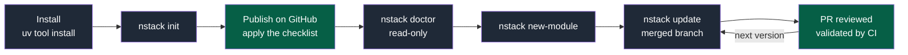
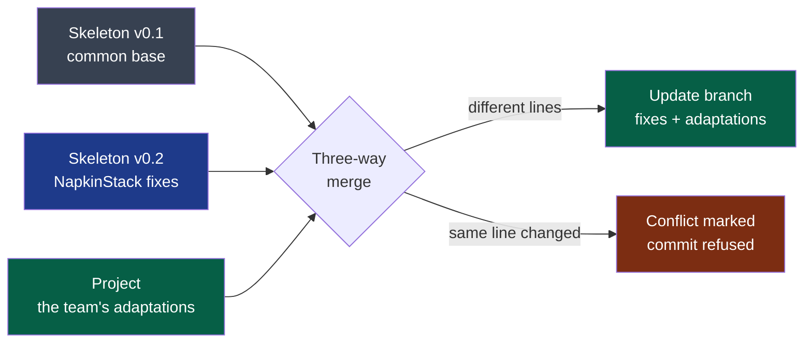

# PDR-0001 — Create a project and receive NapkinStack's updates

- **Status**: Accepted (2026-09-15, after the prototype); clarified on 2026-09-15 (private repositories)
- **Date**: 2026-09-15
- **Decision makers**: NapkinStack maintainers (`@NapkinStack/maintainers`)
- **Modules affected**: `platform/` (becomes the engine), the project skeleton, governance

> The PDR describes **what the product must do and why**, never its implementation.
> The how belongs to the ADRs listed at the end of this document.

---

## User problem

The tech lead starting a project today copies the foundation by hand (`cp -r`), replaces
markers themselves, cannot run `make` or `pip` on the reference workstation, and has to
guess that the GitHub settings, the only real barrier, are not copied.

Above all, **the copy is frozen**. No NapkinStack fix ever reaches it: a project copied
before C0 would still carry defects D1 to D14 — a red CI on a fresh clone, injectable
workflows, skills with invalid YAML, no secret scanning — with nobody knowing.

## Goal

A tech lead creates a compliant project in under 30 minutes, then receives every
NapkinStack version on demand, as a reviewable pull request that preserves their
adaptations.

## Out of scope

- Guided framing and splitting of a project: PDR-0002.
- Package name, distribution, template tool, agent identity: ADRs.
- Applying the GitHub settings automatically: checklist and verification only.
- An update triggered by a bot: on demand only.
- Any change to the modules' code: NapkinStack evolves the foundation, never the team's
  code.
- Stack presets beyond the one of the first real project.
- Forges other than GitHub; a web interface or a service.
- Going back to an earlier version.

---

## Prior art

| Product / reference | Solution chosen | What we keep from it |
|---|---|---|
| Django (`startproject`) | A skeleton owned by the project; the framework is a pinned dependency, upgraded on demand | A versioned, pinned engine and an owned skeleton |
| Rails (`rails new`, `app:update`) | Skeleton updates on demand, a diff offered to the human | An update triggered and reviewed by the team |
| Copier (`copy`, `update`) | A three-way merge between the old version, the new version and the project; conflicts marked; refusal when the tree is dirty or the version goes backwards | The update behaviour, delegated to the tool (ADR-0001) |
| GitHub Spec Kit (`specify init`) | A CLI installed by `uv tool`, project files tracked by a manifest, a stop on any modified file | Installation through uv, the only prerequisite; its update model is rejected (see options) |

**The convention the user already knows:** "`<tool> new`, then bump the version when you
decide to, reviewing what changes".

---

## Options considered

| Option | What the user experiences | Cost | Chosen? |
|---|---|---|---|
| Do nothing | A manual copy, frozen rules, defects never fixed | 0 | No |
| A. An owned skeleton, updates through a three-way merge | Changes its rules freely; every version arrives as a PR merging fixes and adaptations; the team settles the conflicts | Low, the merge delegated to an established tool | **Yes** |
| B. Managed files, a stop on modification (Spec Kit) | Untouched files get updated; any adapted file blocks or is overwritten | Low, but it drifts back towards frozen copies | No |
| C. Read-only reference rules, local additions (projen) | Always up to date, never a conflict, but generic rules that cannot be changed | Medium; contrary to the need to adapt the rules | No |

## Decision

NapkinStack is created by one command and updated by another. The project owns its whole
skeleton and adapts it freely; every NapkinStack version is offered to it on demand, merged
with its adaptations, as a branch reviewed in a pull request and validated by its CI. The
conflicts are left to the team: NapkinStack never decides in its place.

**Legend** — grey: a NapkinStack command · green: a human action. The command names are
provisional (ADR-0002).

**Legend** — grey: the version the project came from · blue: the new version · green: the
team's work and the accepted result · red: a conflict left to the team.

---

## Expected behaviour

**Nominal journey:**

1. **Install**: uv is the only prerequisite; it provides Python and the tools.
2. **Create**: `nstack init` asks the project-level questions (name, foundation team in
   the form `org/team`), generates a git repository with the skeleton — rules, CI, hooks,
   governance, no module — records the NapkinStack version and prints the checklist of
   GitHub settings.
3. **Publish**: the human creates the GitHub repository and applies the checklist.
4. **Check**: `nstack doctor` checks the workstation (tools, hooks, leftover markers) and
   the GitHub settings, read-only; every gap gives the rule, the place and the action.
5. **First module**: `nstack new-module` asks the stack questions; with a preset it
   delegates to the ecosystem's official generator; without one it creates the NapkinStack
   envelope with commands to declare.
6. **Update**: `nstack update`, on a clean working tree, creates a branch where the new
   version, engine and skeleton together, is merged with the local adaptations; the team
   opens the pull request, CI validates it.

**Edge cases and degraded states:**

- A dirty working tree: an explained refusal, nothing is changed.
- A local adaptation and a fix on the same line: a conflict marked in the file, the commit
  refused while a marker remains.
- Skipped versions (v0.1 → v0.3): a direct update to the target version.
- A target version older than the project's: refused.
- A skeleton file deleted by the team: it stays deleted, the team's decision is respected.
- The GitHub API unreachable or no token: the GitHub part of `doctor` is "not verified",
  never "compliant".

**Business rules:**

- **R1** — The project owns its whole skeleton. NapkinStack never changes a project file
  except through a reviewed branch.
- **R2** — One NapkinStack version covers the engine and the skeleton; they move up
  together.
- **R3** — The project pins its version; the workstation and CI run exactly that one.
- **R4** — `update` never touches the modules' code.
- **R5** — No stack is imposed on the modules. NapkinStack's own tooling has its own
  prerequisites, isolated from the project's code.
- **R6** — NapkinStack's own development context (`PRODUCT.md`, `docs/governance/`) is
  never copied into a project.

**Permissions:** the tool never writes the GitHub settings and requires no administration
right. `doctor` reads the settings with a read-only token supplied by the human; without a
token, the GitHub part is reported as not verified.

**Acceptance criteria** *(the implementation's oracle,
`skeleton/docs/os/05-workflow.md` §3; the 2026-09-15 prototype validated the mechanism, see
"Validation")*:

- [ ] Given a workstation with only uv and git, when the tech lead runs `init`, then the
  generated repository's CI is green on a fresh clone, with no manual touch-up.
- [ ] Given a GitHub repository with no ruleset, when `doctor` runs, then every missing
  setting is listed with its action and the command exits in failure; with the checklist
  applied, it exits successfully.
- [ ] Given `new-module` with no preset, then the module passes the fitness functions with
  no stack imposed.
- [ ] Given a v0.1 project with one playbook adapted locally, when v0.2 fixes another part
  of that playbook and `update` runs, then the branch contains both the fix and the
  adaptation, with no conflict.
- [ ] Given a fix and an adaptation on the same line, when `update` runs, then the conflict
  is marked and the commit refused while it remains.
- [ ] Given a skeleton file deleted by the team, when `update` runs, then the file is not
  recreated.
- [ ] When `update` runs, then no file of a module (`modules/<name>/`) is changed; the
  skeleton files placed under `modules/`, such as its README, do follow the versions.

---

## Success criterion

> We will consider this was the right call if **the first real project is created by
> `nstack init` in under 30 minutes before 2026-10-31, then receives at least one new
> NapkinStack version through `nstack update`, merged with no loss of local adaptation,
> before 2026-12-31**.

How it is observed: a timed initialisation session; an update pull request in the project;
no rule copied by hand from the NapkinStack repository.

If the criterion is not met: adjust if the gap comes from installation friction; supersede
with option B if the merge fails.

### Validation

A throwaway prototype of 2026-09-15, never merged: a container with only uv and git (no
system Python, no Go), a template built from the real skeleton, v0.1.0 then v0.2.0, three
projects generated.

| Criterion | Result |
|---|---|
| 1. `init`, CI green on a fresh clone | Validated: fitness, hooks and the history scan green |
| 2. `doctor` | Validated: 5 gaps listed and a failing exit with no ruleset; success on a compliant repository |
| 3. A module with no preset | Partial: fitness green, but the module template imposes `make` (R5) |
| 4. A merge with no conflict | Validated: fix and adaptation both present, commit accepted by the hooks |
| 5. A blocking conflict | Validated after a fix: the hook ignored markers outside a git merge (D20) |
| 6. A deleted file | Validated: not recreated, even when the new version changed it |
| 7. Modules untouched | Validated after rewording: the module's code untouched, the skeleton README updated |

Gaps carried into the implementation plan: a module template with no imposed command
(C1); an engine that receives the project root instead of assuming it lives there (D21);
Copier's errors translated into explanatory messages (P6).

**On published versions (2026-09-16).** `nstack update` carried a project from v0.1.0 to
v0.2.0: criteria 5 and 7 confirmed; 6 confirmed for a file that keeps its name, while a
file renamed between the two versions comes back under its new name; 4 not exercised,
since v0.2.0 translated the whole skeleton. Details:
[the M7 plan](../governance/plans/2026-09-16-english-migration.md) §7.

---

## Clarification of 2026-09-15 — private repositories

Added without changing the decision above, when the pilot project announced itself as
**private**.

**Observation** (GitHub documentation, checked on 2026-09-15): several barriers of the
checklist depend on the repository's visibility and on the GitHub plan.

| Setting | Public repository | Private, Free plan | Private, Team or Pro |
|---|---|---|---|
| Rulesets: PR, review, CODEOWNERS, required checks | Yes | No | Yes |
| Secret scanning and push protection | Yes | No | Paid Secret Protection option |
| Private vulnerability reporting | Yes | Does not exist | Does not exist |
| CI minutes | Unlimited | 2 000 per month | Per the plan |

**Clarification:**

- A project may be private; GitHub remains the only forge.
- The "not bypassable" promise requires a public repository, or a private one under GitHub
  Team (organisation) or Pro (personal account). The skeleton README states it in its
  prerequisites.
- `nstack doctor` follows the repository's visibility: private reporting is "not
  applicable" outside a public repository; a setting missing from a private repository
  names the plan or option required; on the Free plan those gaps stay gaps, because no
  barrier exists.
- Use with no forge, a purely local project: out of scope until a real project asks for it.

---

## Removal condition

> This model will be removed if, **out of the first 3 updates of a real project, more than
> one forces adaptations to be reapplied by hand**, or if **no project uses `update` six
> months after its creation**.

---

## Impacts

- **Existing users**: no project was created by copy; no migration.
- **Modules and contracts**: `platform/` becomes the versioned engine; the skeleton is
  extracted into a template; the repository stays single until a need to split it is
  demonstrated (structure fixed by an ADR).
- **Support and documentation**, on acceptance:
  - `PRODUCT.md`: §1 ("generated by `init`" instead of "copied as a root"); §2 ("nor an
    application framework"); P1 clarified per R5; §6 (a preset only exists after it has
    served a real project);
  - the README rewritten with this PDR's diagrams;
  - workstreams replanned: C1 becomes the engine's CLI, C5 is absorbed by `init` and
    `doctor`, D18 is solved by uv, D19 is handled by `new-module`.
- **Data**: no collection, no telemetry. The success criterion is measured in the project
  itself.

**Next decisions, in order**: ADR-0001 template tool · ADR-0002 distribution and name ·
prototype · ADR-0003 repository language · ADR-0004 agent identity · PDR-0002 guided
framing.
