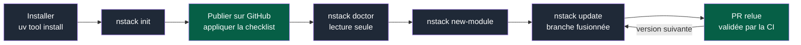
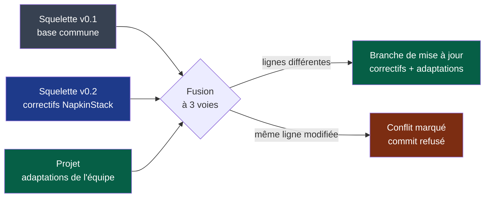

# PDR-0001 — Créer un projet et recevoir les évolutions de NapkinStack

- **Statut** : Proposé
- **Date** : 2026-09-15
- **Décideurs** : mainteneurs NapkinStack (`@NapkinStack/maintainers`)
- **Modules impactés** : `platform/` (devient le moteur), squelette de projet, gouvernance

> Le PDR décrit **ce que le produit doit faire et pourquoi**, jamais son implémentation.
> Le comment relève des ADR listés en fin de document.

---

## Problème utilisateur

Le tech lead qui démarre un projet copie aujourd'hui le socle à la main (`cp -r`),
remplace des marqueurs lui-même, ne peut lancer ni `make` ni `pip` sur le poste de
référence, et doit deviner que les réglages GitHub, seule vraie barrière, ne se copient
pas.

Surtout, **la copie est figée**. Aucun correctif de NapkinStack ne lui parvient : un
projet copié avant C0 porterait encore les défauts D1 à D14 — CI rouge sur clone vierge,
workflows injectables, skills au YAML invalide, aucun scan de secrets — sans que personne
ne le sache.

## Objectif

Un tech lead crée un projet conforme en moins de 30 minutes, puis reçoit chaque version
de NapkinStack à sa demande, en une PR relisible qui préserve ses adaptations.

## Hors périmètre

- Cadrage et découpage guidés d'un projet : PDR-0002.
- Nom du paquet, distribution, outil de gabarit, identité de l'agent : ADR.
- Application automatique des réglages GitHub : checklist et vérification seulement.
- Mise à jour déclenchée par un bot : à la demande seulement.
- Toute modification du code des modules : NapkinStack fait évoluer le socle, jamais le
  code de l'équipe.
- Presets de stack au-delà de celui du premier projet réel.
- Forges autres que GitHub ; interface web ou service.
- Retour à une version antérieure.

---

## Prior art

| Produit / référence | Solution retenue | Ce qu'on en garde |
|---|---|---|
| Django (`startproject`) | Squelette possédé par le projet ; le framework est une dépendance épinglée, montée de version à la demande | Moteur versionné et épinglé, squelette possédé |
| Rails (`rails new`, `app:update`) | Mise à jour du squelette à la demande, diff proposé à l'humain | Mise à jour déclenchée et relue par l'équipe |
| Copier (`copy`, `update`) | Fusion à 3 voies entre ancienne version, nouvelle version et projet ; conflits marqués ; refus si l'arbre est sale ou si la version recule | Le comportement de mise à jour, délégué à l'outil (ADR-0001) |
| GitHub Spec Kit (`specify init`) | CLI installée par `uv tool`, fichiers du projet suivis par manifeste, arrêt sur fichier modifié | Installation par uv, seul prérequis ; son modèle de mise à jour est écarté (voir options) |

**Convention que l'utilisateur connaît déjà :** « `<outil> new`, puis monter la version
quand on le décide, en relisant ce qui change ».

---

## Options envisagées

| Option | Ce que vit l'utilisateur | Coût | Retenue ? |
|---|---|---|---|
| Ne rien faire | Copie manuelle, règles figées, défauts jamais corrigés | 0 | Non |
| A. Squelette possédé, mise à jour par fusion à 3 voies | Modifie librement ses règles ; chaque version arrive en PR qui fusionne correctifs et adaptations ; arbitre les conflits | Faible, fusion déléguée à un outil établi | **Oui** |
| B. Fichiers gérés, arrêt sur modification (Spec Kit) | Mises à jour des fichiers intacts ; tout fichier adapté bloque ou s'écrase | Faible, mais dérive vers les copies figées | Non |
| C. Règles de référence en lecture seule, ajouts locaux (projen) | Toujours à jour, jamais de conflit, mais règles génériques non modifiables | Moyen ; contraire au besoin d'adapter les règles | Non |

## Décision

NapkinStack se crée par une commande et se met à jour par une autre. Le projet possède
tout son squelette et l'adapte librement ; chaque version de NapkinStack lui est proposée
à sa demande, fusionnée avec ses adaptations, sous forme de branche relue en PR et validée
par sa CI. Les conflits restent à l'équipe : NapkinStack ne tranche jamais à sa place.

**Légende** — gris : commande NapkinStack · vert : action humaine. Les noms de commandes
sont provisoires (ADR-0002).

**Légende** — gris : version dont le projet est issu · bleu : nouvelle version ·
vert : travail de l'équipe et résultat accepté · rouge : conflit laissé à l'équipe.

---

## Comportement attendu

**Parcours nominal :**

1. **Installer** : uv est le seul prérequis ; il fournit Python et les outils.
2. **Créer** : `nstack init` pose les questions de niveau projet (nom, équipe socle de la
   forme `org/équipe`), génère un dépôt git avec le squelette — règles, CI, hooks,
   gouvernance, aucun module — enregistre la version de NapkinStack et affiche la
   checklist des réglages GitHub.
3. **Publier** : l'humain crée le dépôt GitHub et applique la checklist.
4. **Vérifier** : `nstack doctor` contrôle le poste (outils, hooks, marqueurs restants) et
   les réglages GitHub en lecture seule ; chaque écart donne la règle, l'endroit et
   l'action.
5. **Premier module** : `nstack new-module` pose les questions de stack ; avec un preset,
   il délègue au générateur officiel de l'écosystème ; sans preset, il crée l'enveloppe
   NapkinStack avec des commandes à déclarer.
6. **Mettre à jour** : `nstack update`, sur un arbre de travail propre, crée une branche où
   la nouvelle version, moteur et squelette ensemble, est fusionnée avec les adaptations
   locales ; l'équipe ouvre la PR, la CI la valide.

**Cas limites et états dégradés :**

- Arbre de travail sale : refus expliqué, rien n'est modifié.
- Adaptation locale et correctif sur la même ligne : conflit marqué dans le fichier,
  commit refusé tant qu'un marqueur subsiste.
- Versions sautées (v0.1 → v0.3) : mise à jour directe vers la version cible.
- Version cible antérieure à celle du projet : refus.
- Fichier du squelette supprimé par l'équipe : il reste supprimé, la décision de l'équipe
  est respectée.
- API GitHub injoignable ou jeton absent : la partie GitHub de `doctor` est « non
  vérifiée », jamais « conforme ».

**Règles métier :**

- **R1** — Le projet possède tout son squelette. NapkinStack ne modifie jamais un fichier
  du projet autrement que par une branche relue.
- **R2** — Une version de NapkinStack couvre moteur et squelette ; ils montent ensemble.
- **R3** — Le projet épingle sa version ; le poste et la CI exécutent exactement celle-là.
- **R4** — `update` ne touche jamais au code des modules.
- **R5** — Aucune stack n'est imposée aux modules. L'outillage NapkinStack a ses propres
  prérequis, isolés du code du projet.
- **R6** — Le contexte de développement de NapkinStack (`PRODUCT.md`,
  `docs/governance/`) n'est jamais copié dans un projet.

**Permissions :** l'outil n'écrit jamais les réglages GitHub et n'exige aucun droit
d'administration. `doctor` lit les réglages avec un jeton en lecture seule fourni par
l'humain ; sans jeton, la partie GitHub est signalée non vérifiée.

**Critères d'acceptation** *(oracle du prototype, `docs/os/05-workflow.md` §3)* :

- [ ] Étant donné un poste avec uv et git uniquement, quand le tech lead lance `init`,
  alors la CI du dépôt généré est verte sur clone vierge, sans retouche manuelle.
- [ ] Étant donné un dépôt GitHub sans ruleset, quand `doctor` est lancé, alors chaque
  réglage manquant est listé avec son action et la commande sort en échec ; la checklist
  appliquée, elle sort en succès.
- [ ] Étant donné `new-module` sans preset, alors le module passe les fitness functions
  sans qu'aucune stack ne soit imposée.
- [ ] Étant donné un projet v0.1 dont un playbook est adapté localement, quand v0.2
  corrige une autre partie de ce playbook et que `update` est lancé, alors la branche
  contient le correctif et l'adaptation, sans conflit.
- [ ] Étant donné un correctif et une adaptation sur la même ligne, quand `update` est
  lancé, alors le conflit est marqué et le commit refusé tant qu'il subsiste.
- [ ] Étant donné un fichier du squelette supprimé par l'équipe, quand `update` est lancé,
  alors le fichier n'est pas recréé.
- [ ] Quand `update` est lancé, alors aucun fichier sous `modules/` n'est modifié.

---

## Critère de succès

> On considérera que c'était le bon choix si **le premier projet réel est créé par
> `nstack init` en moins de 30 minutes avant le 2026-10-31, puis reçoit au moins une
> nouvelle version de NapkinStack par `nstack update`, fusionnée sans perte d'adaptation
> locale, avant le 2026-12-31**.

Comment on l'observe : session d'initialisation chronométrée ; PR de mise à jour dans le
projet ; aucune règle recopiée à la main depuis le dépôt NapkinStack.

Si le critère n'est pas atteint : ajuster si l'écart vient de la friction d'installation ;
superséder par l'option B si la fusion échoue.

Avant l'acceptation, un prototype jetable doit satisfaire les critères d'acceptation. Il
n'est jamais mergé ; seul le statut de ce PDR passe à « Accepté ».

---

## Condition de retrait

> Ce modèle sera retiré si, **sur les 3 premières mises à jour d'un projet réel, plus
> d'une oblige à réappliquer des adaptations à la main**, ou si **aucun projet n'utilise
> `update` six mois après sa création**.

---

## Impacts

- **Utilisateurs existants** : aucun projet n'a été créé par copie ; pas de migration.
- **Modules et contrats** : `platform/` devient le moteur versionné ; le squelette est
  extrait en gabarit ; le dépôt reste unique tant qu'aucun besoin de le scinder n'est
  démontré (structure fixée par ADR).
- **Support et documentation**, à l'acceptation :
  - `PRODUCT.md` : §1 (« généré par `init` » au lieu de « copié comme racine ») ; §2 (« ni
    framework applicatif ») ; P1 précisé selon R5 ; §6 (un preset n'existe qu'après avoir
    servi à un vrai projet) ;
  - README réécrit avec les schémas de ce PDR ;
  - chantiers replanifiés : C1 devient la CLI du moteur, C5 est absorbé par `init` et
    `doctor`, D18 est résolu par uv, D19 est traité par `new-module`.
- **Données** : aucune collecte, aucune télémétrie. Le critère de succès se mesure dans le
  projet lui-même.

**Décisions suivantes, dans l'ordre** : ADR-0001 outil de gabarit · ADR-0002 distribution
et nom · prototype · ADR-0003 identité de l'agent · PDR-0002 cadrage guidé.
