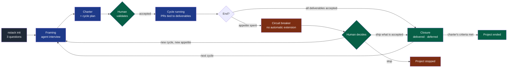

# PDR-0002 — Frame and bound a project

- **Status**: Accepted (2026-09-16, by the maintainer; the success criterion is observed in the pilot project)
- **Date**: 2026-09-16
- **Decision makers**: NapkinStack maintainers (`@NapkinStack/maintainers`)
- **Modules affected**: the project skeleton (kernel, playbooks, handbook, templates,
  issue and pull request templates), `nstack` checks, governance

> The PDR describes **what the product must do and why**, never its implementation.
> The how belongs to the implementation plan and, where structuring, to an ADR.

---

## User problem

A tech lead has an idea, or a specifications document, and an agent. `nstack init` gives
them a skeleton full of generic rules — and nothing that holds what is specific to *their*
project: who the users are, what constraints apply, what "finished" means. Every agent
session has to infer it again, and infers it differently: a model's answers are not
deterministic, so the project's understanding drifts from one session to the next.

Nor is anything bounded above the task. The handbook bounds a task (ready and done,
review budget, three-failure circuit breaker) and a decision (dated criterion, removal
condition), but not the work as a whole. There is no finite list of what is to be
delivered, no budget, no end. Every session finds one more improvement to propose; scope
grows, review capacity drowns, and the project never finishes. Many projects run by AI
agents end exactly there.

Two confusions make it worse. The rules do not say which of them belong to the framework
and which to the project: a team writes its project rules into the kernel or a playbook,
then fights a conflict at every `nstack update`, or a framework document ends up naming
one project's stack. And the kernel defines one posture only, the engineer who writes the
code, while ADR-0004 and PDR-0003 have introduced others — the verifier, the human who
approves — that nothing describes.

## Goal

From an idea or a specifications document, the tech lead and their agent produce, in one
guided session, a validated charter and a bounded cycle — a finite list of deliverables
with acceptance criteria, an appetite and an end date — that every later session reads,
so the work stops when its criteria are met or its appetite is spent.

## Out of scope

- **An AI inside `nstack`** (`PRODUCT.md` §2): the interview is led by the team's own
  agent following a framework procedure; the CLI stays deterministic.
- **A CLI that writes project content**: `nstack init` keeps asking only what it can
  validate (name, repository, team).
- **Estimates, velocity, burndown, Gantt charts**, portfolio management across projects.
- **The project's business content**: the framework ships templates and procedures, never
  a charter's content.
- **Choosing the project's stacks and tools**: per module and per project (P1, tooling
  profile).
- **Adopting the model in an existing project**: no project has been generated yet.
- **Implementation**: file names, the procedure's format, the check's mechanics — the
  implementation plan.

---

## Prior art

> Checked on 2026-09-16.

| Product / reference | Solution chosen | What we keep from it |
|---|---|---|
| Shape Up (Basecamp) | Work is shaped into a fixed box: "fixed time, variable scope". The *appetite* is "the amount of time we want to spend on a project, as opposed to an estimate". The *circuit breaker*: "If they don't finish, by default the project doesn't get an extension" | The appetite decided, not estimated; scope that gives way, never the end date; no automatic extension |
| GitHub Spec Kit | A *constitution* "once per project" — principles for "code quality, testing, and maintainability" — then, per feature, specify → plan → tasks → implement → converge, repeated "until convergence reports Converged" | A project-level document written once; an explicit end to each piece of work |
| Scrum Guide (2020) | Sprints are "fixed length events of one month or less"; "the Sprint Goal is the single objective for the Sprint"; "no changes are made that would endanger the Sprint Goal", while "scope may be clarified and renegotiated with the Product Owner" | One goal per cycle; scope changes only through the person who decides |
| BMad Method | Named agents with distinct responsibilities — Analyst (research, product brief), Product Manager (PRD, epics and stories, "correct course"), Architect, Developer (build, test generation, code review), UX Designer; "Small changes go straight to build. Complex work gets the depth it needs." | Distinct postures for distinct jobs; framing proportionate to the work |
| Claude Code best practices (Anthropic) | For larger features, "have Claude interview you" and write a spec; "once the spec is complete, start a fresh session to execute it"; the best specs "state what is out of scope, and end with an end-to-end verification step" | The framing is an interview led by the agent; the documents it produces, not the conversation, carry the context |
| PMI, PMBOK Guide — the project charter | "A document issued by the project initiator or sponsor that formally authorizes the existence of a project" | The name of the project-level document, and that its sponsor — here, the decider — validates it |

**The convention the user already knows:** a charter or constitution written once, a
backlog cut into fixed-length iterations, each with one goal, a definition of done, and a
person who decides on scope.

**Why depart from it:** the conventions assume humans who remember the project between
iterations. An agent does not: each session starts from what is written. Two additions
pay for that gap. The charter and the cycle are **documents every session reads**, not
meeting outcomes. And the bounds are **checked by CI** — a pull request outside the cycle,
a cycle past its end — instead of relying on a facilitator.

---

## Options considered

| Option | What the user experiences | Cost | Chosen? |
|---|---|---|---|
| Do nothing | Each session re-infers the project; work never ends; project rules pile into framework files | 0 | No |
| An interactive CLI installer that asks for the project's content | Familiar, but a questionnaire cannot hold a conversation about a vague idea, and putting a model in the CLI breaks `PRODUCT.md` §2 | Medium | No |
| Adopt Spec Kit or BMad as they are | A proven procedure, but tied to their own files, agents and commands, and neither bounds a cycle with an appetite and a circuit breaker | Low, then a dependency | No |
| A framing procedure led by the team's agent, producing a charter and a bounded cycle, checked by CI, with explicit rule levels and postures | One guided session, then work that ends | Medium | **Yes** |

## Decision

NapkinStack frames and bounds every project. The team's agent, following the framework's
**framing procedure**, interviews the tech lead and proposes a **charter** and a first
**cycle**; the human validates them; every later session reads them; CI enforces their
bounds.

**Legend** — grey: the deterministic command · blue: the agent's work · green: the human's
decisions and the accepted results · red: the bounds that stop the work.

### 1. Three levels of rules

**The framework never names a stack, a tool or a business domain.** Whatever is specific
goes down a level.

| Level | Holds | Maintained by | Examples |
|---|---|---|---|
| **Framework** — generic, identical in every project, received through `nstack update` | Postures, the five laws, the working loop, stopping rules, the framing procedure, the test discipline, the templates, the checks | NapkinStack | Kernel, playbooks, handbook, templates of the charter, cycle and test sheet |
| **Project** — written by the team, never shipped with content | What the framework cannot know: users, problem, constraints, success criteria, cycles, project decisions, tools | The project's foundation team; the human decider | Charter, cycle plans and closures, PDRs and ADRs, tooling profile |
| **Module** — written by its owner | Its capability, its commands, its contracts, its scenarios | The module's owner | `MANIFEST.yaml`, local `AGENTS.md`, contracts, test sheets |

A project rule is written in a project document, never in the kernel or a playbook: the
framework's files keep merging cleanly at every update.

### 2. The postures

Generic, defined by the framework. One person or one agent can hold several postures in a
small team — except that the author never verifies its own work (PDR-0003) and never
approves it (ADR-0004).

| Posture | Held by | Mission | Never | Produces |
|---|---|---|---|---|
| **Framer** | An agent | Interview the human; propose the charter, the cycle, the deliverables and their acceptance criteria, the modules | Decide; propose more than the need; split into modules on day one without a reason (`docs/os/02-modules.md` §3) | Proposals |
| **Author** | An agent | Deliver one deliverable, in one module, within its criteria | Widen the scope; verify or approve its own work | The pull request and its oracle |
| **Verifier** | An agent session other than the author, or a human | Run the test sheet against the change, before reading the diff | Fix the code; report preferences as gaps | Results and evidence |
| **Approver** | A human code owner | Decide the merge on the evidence | Approve without the sheet where one is required | The approval |
| **Decider** | The human who owns the project | Validate the charter, the cycle and its appetite; accept a change of scope; decide at the circuit breaker | Extend a cycle silently | Decisions recorded in the project |
| **Foundation team** / **module owner** | Humans | Own the project-level rules, or one module | Write project rules into framework files | The project's and the module's documents |

The kernel keeps the author's posture resident; the others are loaded when a session takes
them on, and the kernel stays within its 250-line budget (P4).

### 3. The charter

Written once, at the first framing; changed only through a PDR. It holds: the users and
their problem, the constraints (legal, security, data, platforms), the quality
expectations, the domain's vocabulary, what the project is **not**, and the project's
success criteria — which say when the project itself ends.

### 4. The cycle

A cycle is the unit of work that has a start and an end.

- **One goal**, in one sentence.
- **A finite list of deliverables**, each an observable outcome for a user, with its
  acceptance criteria — from which PDR-0003's test sheets are written — and the module it
  belongs to.
- **Out of scope**, explicitly.
- **An appetite**: the calendar time the decider chooses to spend, not an estimate. It
  sets the **end date**.
- **The end**: every deliverable accepted with its evidence — or the end date reached.
- **The circuit breaker**: at the end date, no automatic extension. The decider chooses:
  ship what is accepted, frame a new cycle with a new appetite, or stop the project.
- **Change control**: a new idea during the cycle goes to the *later* list. It enters the
  cycle only if the decider re-frames it — swapping a deliverable out, or closing the
  cycle early.
- **The closure**: what was delivered, which criteria were met, what was deferred. It is
  the next framing's starting point.

### 5. Two kinds of interaction

The question "should the framework have an interactive installer?" has two answers, one
per kind of content.

| Content | Interaction | Why |
|---|---|---|
| Structural answers — name, repository, team | `nstack init` asks them, validates them, writes the skeleton | Deterministic, checkable, identical for everyone (PDR-0001) |
| The project's substance — charter, cycle, deliverables, criteria | The team's agent interviews the human, following the framing procedure, and writes proposals the human validates | A conversation about an idea is not a form; no model in the CLI |

---

## Expected behaviour

**Nominal journey:**

1. **Create.** `nstack init` asks its three questions and generates the skeleton, with
   empty templates for the charter, the cycle and the closure.
2. **Frame.** The tech lead gives the agent their idea or their specifications and asks
   to frame the project. The agent takes the framer's posture: one subject at a time, it
   asks what it cannot infer, proposes the field's convention by default, lists the open
   questions, and writes a proposed charter and a proposed first cycle.
3. **Decide.** The tech lead amends and validates: the charter and the cycle are accepted,
   with an appetite and an end date. Modules accepted by the framing are created with
   `nstack new-module`.
4. **Run.** Each session reads the charter and the current cycle. Each pull request is
   tied to one deliverable. A new idea goes to the *later* list.
5. **End.** Every deliverable is accepted: the agent writes the closure, the decider
   frames the next cycle or ends the project. Or the end date comes first: the circuit
   breaker stops the cycle and the decider chooses.

**Edge cases and degraded states:**

- A vague idea: the framing surfaces the open questions; a blocking unknown becomes a
  *spike* deliverable, whose output is knowledge (`docs/os/05-workflow.md` §3); no cycle is
  accepted with a blocking question left open.
- A specification too large for one cycle: the framing proposes a first cycle and leaves
  the rest in the *later* list; it never stretches the appetite to fit.
- An urgent fix outside the cycle — a security incident, a production defect: allowed with
  the `out-of-cycle` label and a justification, visible and counted like `cross-module`
  and `over-budget`.
- A deliverable blocked by an outside dependency: marked blocked; the appetite keeps
  running; the circuit breaker still applies.
- A cycle closed early because every deliverable is accepted: the closure is written
  at once; unused appetite is not spent on extras.
- The decider is absent at the end date: the cycle stays broken; no pull request is tied
  to it until a decision is recorded.

**Business rules:**

- Only a human validates a charter, a cycle and its appetite, a change of scope, and the
  circuit breaker's outcome.
- A cycle has one goal, a finite list of deliverables, an appetite and an end date; a
  deliverable has acceptance criteria before work on it starts (definition of ready).
- The appetite is decided, never estimated; no cycle is extended automatically.
- Every pull request is tied to a deliverable of the current cycle, or carries the
  `out-of-cycle` label with its justification.
- The framework never names a stack, a tool or a business domain; a project rule lives in
  a project document.
- The author never verifies or approves its own work.

**Permissions:** agents propose — framings, deliverables, pull requests, results; humans
decide — the charter, the cycle, its appetite and scope, the circuit breaker, the merge.

**Acceptance criteria** *(testable — the oracle of the implementation plan)*:

- [ ] Given a generated project, then it contains the framing procedure and the charter,
  cycle and closure templates, with no project content, naming no stack, tool or domain.
- [ ] Given a pull request tied to no deliverable of the current cycle and without the
  `out-of-cycle` label, then CI fails, naming the rule and the action.
- [ ] Given a current cycle past its end date and not closed, then CI reports the circuit
  breaker and the three decisions possible.
- [ ] Given a cycle with no goal, no appetite, no end date, or a deliverable without
  acceptance criteria, then CI fails, naming what is missing.
- [ ] Given no accepted cycle, then CI reports that the project is not framed, and names
  the procedure.
- [ ] Given the kernel, then it defines where the postures are described and stays within
  250 lines.
- [ ] Given the framework's documents, then no stack, tool or business domain is named
  outside the tooling profile.

---

## Detailed functional design

**States of a cycle:** *proposed* → *accepted* (by the decider) → *running* → *closed*
(every deliverable accepted, or the decider ships what is accepted) · *stopped* (the
decider stops). Past the end date, a running cycle is *broken* until the decider records a
decision.

**States of a deliverable:** *proposed* → *ready* (acceptance criteria written) → *in
progress* → *accepted* (test sheet with evidence, approval — PDR-0003, ADR-0004) ·
*deferred* to the later list · *dropped* by the decider.

**Interactions:** the framing proposes modules that `nstack new-module` creates once
accepted; the deliverables' acceptance criteria are the source of the test sheets
(PDR-0003); the approver is the posture of ADR-0004; the cycle's closure and the charter's
success criteria feed the decision review (`docs/os/10-measurement.md` §5).

---

## Success criterion

> We will consider this was the right call if, **in the pilot project, the framing turns
> the tech lead's idea into an accepted charter and first cycle within one working session
> of two hours, and that first cycle ends on its end date or earlier — closed, or stopped
> by the circuit breaker — with no automatic extension and every pull request tied to one
> of its deliverables or labelled `out-of-cycle`**, observed before **2026-12-31**.

How it is observed: the duration of the framing session, noted by the tech lead; the dates
of the cycle's acceptance, end date and closure; the pull requests and their links; the
`out-of-cycle` count.

If the criterion is not met: adjust the procedure when the framing takes too long; adjust
the cycle's rules when the bounds block legitimate work; supersede if the pilot shows that
cycles do not bound the work.

---

## Clarification of 2026-09-16 — delivery work

Added when planning the implementation (workstream M8), without changing the decision.

**Observation:** "every pull request is tied to a deliverable" cannot hold for the pull
request that frames the project — no cycle exists yet — nor for a NapkinStack update, a CI
change or a handbook correction, none of which delivers a user outcome.

**Clarification:** the cycle rules apply to **delivery work**, a pull request that changes
a module. The others are exempt; they stay visible in the history like any change. The
circuit breaker stops delivery work only, so that an `out-of-cycle` incident fix remains
possible.

---

## Removal condition

> The cycle and its checks will be removed if, **over the pilot's first two cycles, the
> circuit breaker is overridden by an extension, or more than one pull request in five is
> labelled `out-of-cycle`** — the bounds would then be decoration.

---

## Impacts

- **Existing users**: none — no project has been generated; the pilot starts with the
  model.
- **Modules and contracts**: the skeleton gains the framing procedure (a playbook, exposed
  as a skill like the others), the charter, cycle and closure templates, the postures, the
  `out-of-cycle` label; the pull request template gains the deliverable it belongs to; the
  issue forms tie a feature to a deliverable; `nstack` gains the checks above; the kernel
  and `docs/os/00-overview.md`, `05-workflow.md`, `06-decisions.md`, `09-platform.md` and
  `10-measurement.md` describe the levels, postures and cycles.
- **Decisions**: PDR-0003's test sheets start from the deliverables' acceptance criteria;
  ADR-0004's approver becomes one posture among the others; PDR-0001's `init` is
  unchanged.
- **Support and documentation**: `PRODUCT.md` §3, whose tech lead criterion gains the
  framing; the skeleton README's journey.
- **Data**: none.
