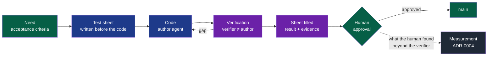

# PDR-0003 — Approve a change on evidence of its behaviour

- **Status**: Accepted (2026-09-16, by the maintainer; the success criterion is observed in the pilot project); clarified on 2026-09-17 (what changes a module)
- **Date**: 2026-09-16
- **Decision makers**: NapkinStack maintainers (`@NapkinStack/maintainers`)
- **Modules affected**: the project skeleton (kernel, playbooks, handbook, pull request
  template, module manifest), `nstack` checks, governance

> The PDR describes **what the product must do and why**, never its implementation.
> The how belongs to the implementation plan and, where structuring, to an ADR.

---

## User problem

A tech lead is asked to approve an agent's pull request that adds a login page. What they
see is a diff and a summary written by the agent that coded it, with the "E2E" and
"Accessibility" boxes ticked by that same agent.

Reading the code does not tell them what they need to know. Another agent reads code as
well as they do; what nobody learns from a diff is whether **the page behaves as
needed**. It can pass every unit test and still hide its button under the phone's
keyboard, lose the typed email after a wrong password, or never show its loading state.
And the agent that wrote the code is the worst placed to find out: if it misunderstood
"lock the account after 5 failures", it coded *and* tested that misunderstanding.

So the approval is either a formality, or the tech lead re-tests everything by hand and
becomes the bottleneck. With agents producing more pull requests than a human can
re-test, both end the same way: defects in `main`.

## Goal

Whoever approves a change sees, in the pull request, the scenarios derived from the need
and the evidence that each one was run against that change by someone other than its
author, and can decide in minutes.

## Out of scope

- **Choosing a project's test tools** — browser automation, mobile emulation, E2E runner:
  a project decision, recorded in its tooling profile (`docs/tooling-profile.md`).
- **Letting an agent's approval count toward merging**: deferred, and decided on this
  PDR's measurement (ADR-0004, "Deferred, decided on evidence").
- **Replacing unit, integration or contract tests**: the sheet verifies behaviour, it
  does not stand in for the test pyramid (`docs/os/08-quality.md` §5).
- **Preview environments and visual regression services**: a project's hosting and tool
  choices.
- **Framing and bounding a project** — where the needs and their acceptance criteria come
  from: PDR-0002.
- Load, performance and penetration testing.

---

## Prior art

> Checked on 2026-09-16.

| Product / reference | Solution chosen | What we keep from it |
|---|---|---|
| Phabricator, Meta's review tool | A test plan is required on every revision by default: "a repeatable list of steps which document what you have done to verify the behavior of a change", detailed enough for "someone unfamiliar with your change to verify its behavior" | The sheet: repeatable steps, readable by someone who did not write the change |
| Claude Code best practices (Anthropic) | "Have Claude show evidence rather than asserting success"; a verification subagent "so the agent doing the work isn't the one grading it"; a spec that ends "with an end-to-end verification step that proves the feature works"; and a warning — a reviewer asked to find gaps always finds some, so it flags "only gaps that affect correctness or the stated requirements" | Evidence over assertion; a verifier that is not the author; the verifier's scope |
| GitHub Copilot cloud agent | Has its own web browser since 2025-07-02: runs the application, interacts with it and attaches screenshots to its pull request | An agent can execute interface scenarios and bring back evidence |
| Playwright | Records a screenshot, a video and a trace per test, in CI, kept always or on failure | A replayable scenario produces its own evidence |
| mobile-mcp | Drives iOS and Android simulators, emulators and real devices for an agent | Mobile surfaces are within an agent's reach |
| GitHub, Copilot code review approvals (2026-09-01) | An administrator can let an AI approval count toward the required approvals, per path | The door this PDR's measurement keeps open |

**The convention the user already knows:** a "how was this tested" section in the pull
request, screenshots for an interface change, and a CI test report.

**Why depart from it:** in the convention, the test plan is written and ticked by the
author. When the author is an agent, self-assessment shares its errors and can overstate
— the kernel already calls an inflated summary "more dangerous than no summary at all".
Two additions pay for the gap: the sheet is written **before** the code, from the need;
and it is executed by **someone other than the author**, who brings back evidence. The
value: an approval decided in minutes on evidence, instead of a formality or a full
manual re-test.

---

## Options considered

| Option | What the user experiences | Cost | Chosen? |
|---|---|---|---|
| Do nothing | The approver reads a diff and boxes ticked by the author; behaviour defects reach `main`, or the human re-tests everything | 0 | No |
| A "how was this tested" section filled by the author | Familiar, but declared by the agent that coded, with no evidence | Low | No |
| A test sheet written before the code, run by a verifier other than the author, with evidence, required where it matters | The approver reads scenarios and evidence, tries what only a human can judge, decides in minutes | Medium: a verification per pull request, E2E tooling per project | **Yes** |
| A human acceptance test on every pull request | Reliable, but the human becomes the bottleneck | High | Only for `critical` modules, as today |

## Decision

A pull request that changes what a user sees carries a **test sheet**: scenarios derived
from the need, written before the code, executed by a **verifier** who is not the author,
each result backed by **evidence**. The approver decides on that sheet.

**Legend** — green: the human and the accepted result · blue: the author agent · purple:
the verifier, agent or human, never the author · grey: the measurement that decides
whether an agent's approval may one day count.

### Who decides what

The rule has three levels, and only the first belongs to NapkinStack: it cannot know each
project.

| Level | Decides | Here |
|---|---|---|
| **Framework** — identical in every project, delivered by `nstack init` and `nstack update` | That the sheet exists and when it is required; its format; written before the code; a verifier other than the author; no result without evidence; what the verifier reports; the human decision | This PDR, the kernel, the `tests` and `ux` playbooks, the pull request template, the checks |
| **Project** — its foundation team | Which tools run the scenarios; which browsers, devices and widths; against which environment; which design system is the reference | `docs/tooling-profile.md`, the project's decisions |
| **Module** — its owner | Its scenarios, its commands, whether it exposes a user-visible surface | Its issues, its `MANIFEST.yaml` |

---

## Expected behaviour

**Nominal journey** — the login page:

1. **Framing.** From the need, the author agent writes the sheet: S1 valid credentials,
   S2 wrong password, S3 empty fields, S4 keyboard only, S5 a 375-pixel-wide phone, S6 a
   slow network, S7 five failures in a row. The tech lead amends it — the cheapest moment
   to catch a misunderstanding.
2. **Oracle.** The replayable scenarios become automated tests, seen failing.
3. **Implementation** by the author agent.
4. **Verification.** A verifier — another agent session starting from a fresh context, or
   a human — receives the need, the sheet and the running change, **not the diff**. It
   runs each scenario and fills in the result and its evidence, tied to the commit it
   tested. CI runs the automated scenarios and keeps their evidence.
5. **Correction.** The author fixes the gaps reported; the verifier runs the affected
   scenarios again.
6. **Decision.** The tech lead reads the sheet and the evidence, tries what is marked for
   human judgement, approves, and notes what they found that the verifier missed —
   "nothing" included.

**Edge cases and degraded states:**

- A scenario no agent can run — a real payment, an email received, a physical device: it
  is marked *human only*, with the reason, and listed apart for the approver.
- A scenario not run: its result is *not verified*, never *passed*.
- The verifier and the author disagree: the human decides, and the sheet keeps both.
- An expected result changed after the code was written: visible in the sheet's history,
  and accepted by the human, never silently.
- A flaky scenario: the `tests` playbook applies — quarantined with an issue and a date,
  never re-run until it passes.
- Evidence exposing personal data or a secret: test data only; the `security` playbook
  applies.
- A pull request with no user-visible change, in a module below `high`: no sheet
  required; the summary says so.

**Business rules:**

- A sheet is **required** when the pull request changes a user-visible surface, or touches
  a module of criticality `high` or `critical`. Elsewhere it is optional.
- A module declares in its manifest whether it exposes a user-visible surface.
- Each scenario states its context, action and expected observable result, and its kind:
  *automated*, *explored* by a verifier, or *human only*.
- **No result without evidence**: a screenshot, a video, a trace, a log or a command
  output, tied to the commit tested.
- The verifier is never the session that wrote the code, and executes the sheet before
  reading the diff.
- The verifier reports gaps against the need or correctness; preferences are marked
  optional and do not block.
- For a `critical` module, a human acceptance test is added on top (`docs/os/05-workflow.md`
  §7).

**Permissions:** the author agent writes the sheet and the code; the verifier fills in
results and evidence; during the pilot, only a human approves (ADR-0004).

**Acceptance criteria** *(testable — the oracle of the implementation plan)*:

- [ ] Given a pull request touching a module that declares a user-visible surface, when it
  carries no test sheet, then CI fails, naming the rule, the module and the action.
- [ ] Given a sheet in which a scenario is marked passed without evidence, then CI fails,
  naming the scenario.
- [ ] Given a sheet whose evidence was produced on an older commit than the pull request's
  head, then CI reports the scenarios to run again.
- [ ] Given a pull request with no user-visible change in a `standard` module, then no
  sheet is required and CI passes.
- [ ] Given a scenario marked *human only*, then the pull request shows it in a list apart,
  with its reason.
- [ ] Given a generated project, then the kernel, the `tests` and `ux` playbooks, the pull
  request template and the handbook describe the sheet, and name no tool.

---

## Detailed functional design

**The sheet**, one row per scenario:

| # | Given · when · then | Kind | Result | Evidence | Commit |
|---|---|---|---|---|---|
| S2 | Given an existing account, when the password is wrong, then a message says what to do and the email stays typed | automated | passed | trace and screenshot of the CI run | `a1b2c3d` |
| S5 | Given a 375-pixel-wide phone, when the keyboard opens, then the button stays reachable | explored | **failed** — the button is hidden | emulator screenshot | `a1b2c3d` |
| S8 | Given a real email box, when the reset link is requested, then it arrives within a minute | human only — no test mailbox | not verified | — | — |

**Actors:** the author agent · the verifier (an agent session other than the author, or a
human) · the approver (a human code owner, ADR-0004) · CI.

**States of a scenario:** *to run* → *passed* · *failed* · *not verified*; any new commit
on the pull request puts the scenarios it affects back to *to run*.

---

## Success criterion

> We will consider this was the right call if, **in the pilot project, every pull request
> changing a user-visible surface carries a sheet written before the code and executed by
> a verifier other than its author, with evidence, and the human approves those pull
> requests within 15 minutes of review, median**, observed before **2026-12-31**.

How it is observed: the pilot's pull requests — the sheet and its history, the verifier's
identity, and on each one the review time and what the human found beyond the verifier,
both noted by the approver.

That last measurement also feeds ADR-0004: if, over the pilot's last 20 pull requests
carrying a sheet, the human found nothing the verifier had missed, a new ADR may let a
verifier agent's approval count for `prototype` and `standard` modules.

If the criterion is not met: adjust the format or the trigger when the cost comes from
the sheet itself; remove the rule if it catches nothing the existing tests do not.

---

## Removal condition

> This rule will be removed if, **over the pilot's first 20 pull requests carrying a
> sheet, the verification found no defect that the existing tests had not already caught,
> and approvals were not faster than without a sheet**.

---

## Impacts

- **Existing users**: none — no project has been generated from a version with this rule;
  the pilot starts with it.
- **Modules and contracts**: the module manifest gains the declaration of a user-visible
  surface; the pull request template gains the sheet; the kernel's working loop, the
  `tests` and `ux` playbooks and `docs/os/05-workflow.md`, `08-quality.md` and
  `09-platform.md` describe it; the tooling profile's "UI inspection and screenshots" and
  "Specialised agents" capabilities become the project's choice of tools; CI gains the
  checks above. The kernel stays within its 250-line budget (P4).
- **Decisions**: ADR-0004 defers the agent's approval to this measurement; PDR-0002, the
  guided framing, produces the needs and acceptance criteria the sheets start from.
- **Support and documentation**: the skeleton's handbook and README; `PRODUCT.md` if the
  users' criteria change.
- **Data**: evidence is produced with test data only, stored as CI artefacts or on the
  pull request, visible to whoever can see the repository.

---

## Clarification of 2026-09-17 — what changes a module

Added at the v0.3.0 release, with the maintainer's agreement, without changing the decision.

**Observation:** the check read "touches a module" literally. A NapkinStack update edits the
manifest and documentation of the skeleton's `contracts` module, of criticality `high`: its
pull request asked for a test sheet with no behaviour to observe, and nothing let it through
(defect D24). The same held for a module's documentation fix. Meanwhile a pull request could
lower its own module's criticality or user-visible surface and escape the sheet.

**Clarification:**

- A pull request **changes a module** when it changes a file of the module beyond its
  description — its manifest, `AGENTS.md`, `README.md` and `docs/`; an empty placeholder
  does not count either. A new module's empty scaffold is therefore not yet a change; its
  first source file is. Deleting a module changes it.
- The user-visible surface and the criticality are read **before and after** the pull
  request; the stricter applies.
- No label lifts the sheet: the exemption follows from what the diff changes, which the
  approver sees, not from a declaration an agent could make.

