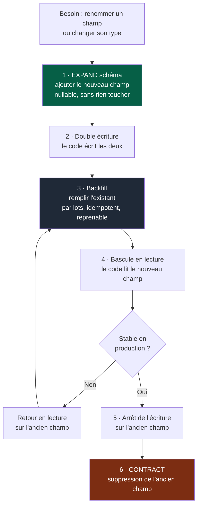

# Playbook — Données et migrations

> **Déclencheur.** Charge ce playbook si la tâche touche à : schéma de données,
> migration, suppression ou transformation de données existantes, propriété des données.

---

## Règles absolues

| # | Règle |
|---|---|
| D1 | **Une migration est un changement de production**, pas une modification de code. Elle relève des actions à haut risque (kernel §5). |
| D2 | **Chaque module possède ses données.** Aucun accès direct à la base d'un autre module — on passe par son contrat. |
| D3 | **Jamais de renommage ni de suppression en place.** On ajoute, on fait coexister, on migre, on retire. |
| D4 | **Toute migration a un plan de retour arrière**, ou une justification écrite de son absence. |
| D5 | **Ne jamais exécuter une migration destructive sans confirmation explicite.** |

---

## 1. Expand / Contract appliqué au schéma

Même logique que les contrats (`docs/03-contrats.md`), pour la même raison : l'ancien et
le nouveau code coexistent pendant le déploiement.



Chaque étape est **une PR déployable indépendamment**. À aucun moment le système n'est
dans un état où un rollback casserait les données.

L'étape 6 est la plus oubliée. Comme pour les contrats : elle porte une date, et un
check échoue quand la date est dépassée.

---

## 2. Avant toute migration

| Question | Si la réponse manque |
|---|---|
| Combien de lignes sont concernées ? | Mesurer avant d'écrire la migration |
| Verrouille-t-elle une table ? Combien de temps ? | Tester sur un volume représentatif |
| L'ancien code fonctionne-t-il après ? | C'est obligatoire pendant le déploiement |
| Le nouveau code fonctionne-t-il avant ? | Idem, dans l'autre sens |
| Que deviennent les données non conformes ? | Les compter, décider explicitement |
| Comment revenir en arrière ? | Écrire le plan, ou justifier son absence |
| Comment savoir que ça s'est bien passé ? | Définir la vérification avant de lancer |

---

## 3. Backfill

Un backfill sur un volume important est une opération d'exploitation, pas un script.

- **Par lots**, avec pause entre les lots — ne jamais tout traiter d'un coup.
- **Idempotent** : relançable sans effet de bord.
- **Reprenable** : mémorise sa progression, survit à une interruption.
- **Observable** : progression, erreurs, durée estimée.
- **Interruptible** : on doit pouvoir l'arrêter sans corrompre l'état.
- **Mesuré avant** : nombre de lignes, durée estimée, impact sur la charge.

---

## 4. Suppression de données

C'est irréversible. Procédure obligatoire :

```
1. compter exactement ce qui sera supprimé
2. vérifier le critère de sélection sur un échantillon
3. sauvegarder ou archiver ce qui est supprimé
4. exécuter en mode simulation d'abord
5. demander confirmation explicite, avec le nombre exact
6. supprimer par lots, avec point d'arrêt
7. vérifier après
```

Une suppression déclenchée par une règle de rétention est une décision produit : elle
relève d'un PDR, pas d'une tâche technique.

---

## 5. Propriété des données

Le partage implicite de données est la forme de couplage la plus difficile à défaire,
parce qu'elle est invisible dans le code.

| Situation | Traitement |
|---|---|
| Un module lit la table d'un autre | Violation — détectée par fitness function |
| Base partagée entre deux modules | ADR obligatoire, avec propriété explicite par table |
| Donnée dupliquée entre modules | Acceptable si une source de vérité est désignée et la synchronisation contractuelle |
| Jointure entre domaines nécessaire | Signal de mauvaise frontière — ne pas la contourner par un accès direct |

---

## 6. Checklist de fin

- [ ] Migration testée sur un volume représentatif
- [ ] Ancien et nouveau code fonctionnent pendant la transition
- [ ] Backfill par lots, idempotent, reprenable
- [ ] Plan de retour arrière écrit, ou absence justifiée
- [ ] Vérification post-migration définie **avant** l'exécution
- [ ] Étape de contraction planifiée, avec date et propriétaire
- [ ] Action destructive confirmée explicitement, avec le nombre exact
- [ ] Ce qui n'a pas pu être vérifié figure dans `NON VÉRIFIÉ` du résumé
