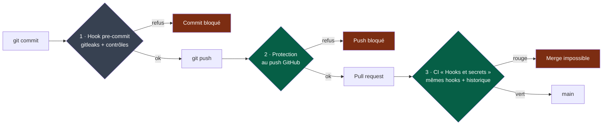

# Contribuer

## Avant de commencer

1. Prendre une issue **Ready** (les formulaires garantissent le DoR).
2. Identifier **le** module cible — un seul.
3. Lire son `MANIFEST.yaml` puis son `AGENTS.md`.
4. `nstack bootstrap <nom> && nstack check <nom>`
5. `pre-commit install` — une fois par clone ([installer pre-commit](https://pre-commit.com/#install)).

## Les barrières contre les fuites

**Légende** — gris : sur le poste, contournable · vert : côté GitHub · rouge : arrêt.

Seules les barrières 1 et 2 agissent **avant** publication. Un secret arrêté par la CI est
déjà public : c'est un incident, il se révoque immédiatement (`SECURITY.md`).

## Pendant

- **Écrire l'oracle d'abord**, le voir échouer, puis implémenter
  (`docs/os/05-workflow.md` §3).
- **Changement minimal.** Pas de refactoring opportuniste : il fait sa propre PR.
- **Rester dans le module.** Besoin d'un autre module ? Passer par son contrat.
  Le contrat ne suffit pas ? C'est un changement de contrat, donc une séquence
  expand/contract (`docs/os/03-contracts.md` §4) — jamais une PR unique.
- `nstack fitness` avant chaque commit.

## Ouvrir la PR

Le template applique la Definition of Done. Deux choses à ne pas escamoter :

- **Le résumé** — `FAIT / VÉRIFIÉ / SUPPOSÉ / NON VÉRIFIÉ / RISQUES`.
  Un résumé sans rien sous `SUPPOSÉ` et `NON VÉRIFIÉ` est presque toujours incomplet.
- **Les signaux à remonter** — c'est ainsi que le système s'améliore
  (`docs/os/10-measurement.md`).

## Exceptions

| Label | Quand | Conséquence |
|---|---|---|
| `cross-module` | PR touchant plusieurs modules, avec justification | Autorisée, comptée |
| `hors-budget` | Génération, migration mécanique, renommage massif | Autorisée, comptée |

Les exceptions sont **visibles**, jamais silencieuses. Leur taux est un indicateur de
santé des frontières.

## Ce qui ne se négocie pas

- Aucun contournement de quality gate : pas de `skip`, pas de `--no-verify`, pas de
  test désactivé sans issue ni date.
- Aucun secret dans le dépôt, sous aucune forme.
- Ne jamais cocher « tests passants » sans les avoir exécutés.
