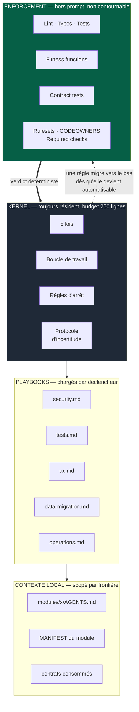
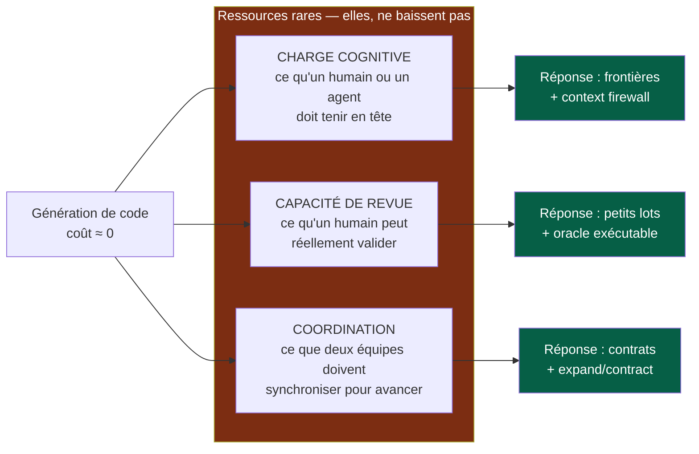

# 00 — Vue d'ensemble

## 1. Ce qu'est un « OS » ici

La métaphore n'est pas décorative. Un système d'exploitation a :

- un **kernel** : petit, résident, chargé en permanence ;
- des **modules chargés à la demande** : présents seulement quand on en a besoin ;
- un **espace utilisateur cloisonné** : chaque processus voit son contexte, pas celui des autres ;
- des **garanties matérielles** : ce que le kernel ne peut pas garantir par convention, le matériel l'impose.

L'erreur la plus fréquente quand on écrit un « système de règles pour agents » est de
tout mettre dans le kernel. On obtient un prompt de 6 000 mots qui consomme le budget
de contexte qu'il prétend protéger, à chaque tâche, y compris pour corriger une faute
de frappe.

Cet OS répartit donc ses règles sur quatre couches, chacune avec un coût et un mode de
chargement différents.

---

## 2. Les quatre couches

La flèche en pointillés est le mécanisme central de l'OS :

> **Le prompt est une zone de transit, pas un lieu de résidence.**
> Une règle n'y séjourne que le temps de devenir un check.

Une règle qui reste dans le prompt alors qu'elle est mécaniquement vérifiable est une
**dette**. Elle doit apparaître dans le backlog d'automatisation
(`07-governance.md`).

---

## 3. Pourquoi cette répartition

| Couche | Fiabilité | Coût de contexte | Coût de mise en place | Contournable ? |
|---|---|---|---|---|
| Kernel | Probabiliste | Élevé (permanent) | Nul | Oui |
| Playbooks | Probabiliste | Moyen (ponctuel) | Faible | Oui |
| Contexte local | Probabiliste | Faible | Faible | Oui |
| Enforcement | **Déterministe** | **Nul** | Moyen à élevé | **Non** |

L'enforcement est la seule couche qui ne coûte rien en contexte et qui ne dépend pas de
la vigilance d'un agent ou d'un humain. C'est pourquoi tout ce qui peut y descendre doit
y descendre.

Corollaire opérationnel : **l'IA ne doit jamais être la seule chose qui empêche une
mauvaise modification.**

---

## 4. Les trois ressources rares

Tout l'OS est dimensionné par trois contraintes, et par elles seules.

**Le débit réel d'un projet n'est pas le débit de génération, c'est le débit de
vérification.** Doubler la vitesse de production sans toucher à la capacité de revue
ne double pas la livraison : ça allonge la file d'attente et dégrade la qualité de la
revue elle-même.

---

## 5. Ce que l'OS n'impose pas

- **Aucune stack technique.** Ni langage, ni framework applicatif, ni base de données, ni cloud.
  L'OS impose une *méthode de sélection* et une trace de décision. Voir
  `06-decisions.md`.
- **Aucune structure interne de module.** Deux modules peuvent avoir des architectures
  internes différentes. Seule leur *enveloppe* est uniforme. Voir `02-modules.md`.
- **Aucune liste d'outils IA.** L'OS décrit des *capacités* nécessaires ; un profil
  d'outillage les mappe sur les outils du moment. Voir `09-platform.md`.
- **Aucun niveau de cérémonie uniforme.** La gouvernance est proportionnelle à la
  criticité déclarée du module. Voir `07-governance.md`.

---

## 6. Glossaire

Ces termes ont un sens précis dans l'OS. Les utiliser autrement crée de l'ambiguïté.

| Terme | Définition |
|---|---|
| **Module** | Unité de contexte autonome et de parallélisme : un développeur ou un agent doit pouvoir la comprendre, la modifier, la tester et la valider **sans comprendre le reste du système**. Peut être un package, une application, un service ou un repository. |
| **Playbook** | Module d'*instructions* pour agent, chargé à la demande (`playbooks/`). Appelé « playbook » et non « module » pour éviter toute confusion avec la ligne précédente. |
| **Squelette** | Fichiers communs du projet — kernel, playbooks, ce manuel, CI, hooks, modèles — générés par le moteur ; le projet les possède et les adapte. |
| **Moteur** | Outil versionné qui génère le squelette, le met à jour et exécute les contrôles ; nommé dans `docs/tooling-profile.md`. |
| **Contrat** | Interface versionnée et testée entre deux modules : API, événement, schéma, message. Le **seul** canal de communication inter-modules autorisé. |
| **Manifest** | Fichier déclaratif à la racine de chaque module : identité, owner, criticité, statut, contrats produits et consommés, commandes standards. Source de vérité machine-lisible. |
| **Oracle** | Critère de réussite *exécutable* d'une tâche, écrit et vu échouer **avant** la génération : test, contract test, ou fitness function. |
| **Fitness function** | Test automatisé qui échoue quand l'architecture dérive (dépendance interdite, cycle, couplage, budget de performance). Gouvernance par règle plutôt que par inspection. |
| **Budget de revue** | Plafond explicite par PR (lignes, fichiers, modules touchés) qui force le redécoupage **avant** génération. |
| **Prior Art Gate** | Procédure obligatoire avant décision structurante : identifier la convention du domaine, l'adopter par défaut, ne dévier que contre une valeur utilisateur observable. |
| **Expand / Contract** | Séquence de PR permettant de faire évoluer un contrat entre équipes sans synchronisation temporelle. |
| **ADR / PDR** | Architecture / Product Decision Record. Trace durable d'une décision structurante. |

> **Note.** Le format **FDR** (Functional Design Record) n'existe pas dans cet OS. Il
> chevauchait le PDR et les critères d'acceptation d'une issue sans apporter de valeur
> distincte. Pour les cas réellement complexes, il devient une **section optionnelle du
> PDR**. Justification : `06-decisions.md` § « Pourquoi seulement deux formats ».

---

## 7. Comment lire la suite

| Document | Répond à la question |
|---|---|
| `01-principes` | Sur quoi ne transige-t-on jamais ? |
| `02-modules` | Comment découper, et comment plusieurs équipes avancent en parallèle ? |
| `03-contrats` | Comment changer une interface sans bloquer l'autre équipe ? |
| `04-contexte-ia` | Que charge-t-on, et que fait-on en cas de franchissement de frontière ? |
| `05-workflow` | Comment se déroule concrètement une tâche ? |
| `06-decisions` | Comment décide-t-on, et comment évite-t-on de réinventer la roue ? |
| `07-gouvernance` | Où vit une règle, et comment devient-elle non contournable ? |
| `08-qualite` | Que teste-t-on, et jusqu'où selon le risque ? |
| `09-plateforme` | Comment démarre-t-on un module en une commande ? |
| `10-mesure` | Comment sait-on que le système s'améliore ? |
