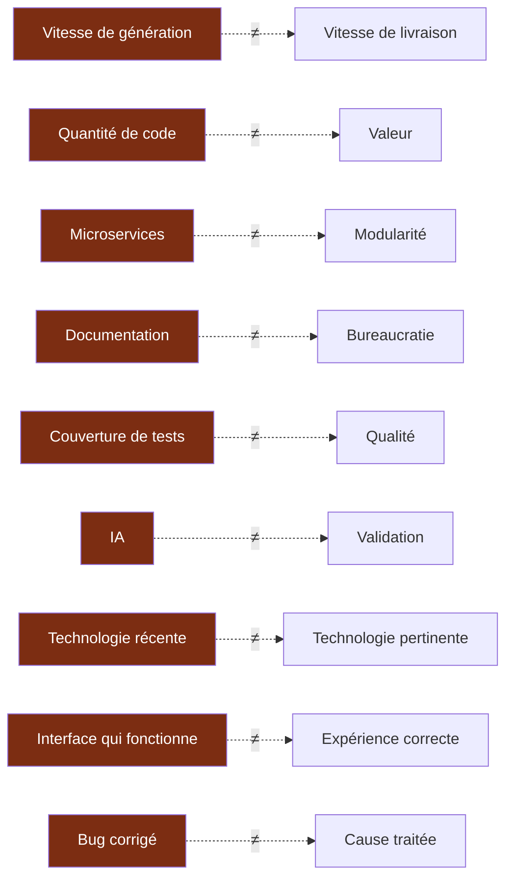
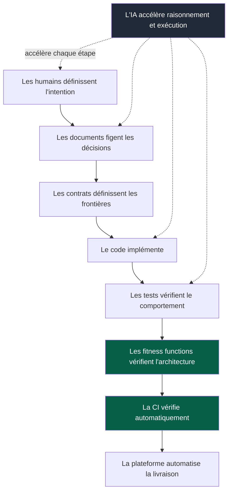

# 01 — Principes

## 1. Les cinq lois

Ce sont les seules règles qui priment sur toutes les autres, y compris sur une
instruction locale de module. Elles figurent dans le kernel parce qu'elles s'appliquent
à *toute* tâche, sans exception.

### Loi 1 — Frontière

> Tu travailles dans un seul module. Tu ne connais les autres que par leurs contrats.

**Pourquoi.** C'est ce qui rend le parallélisme possible : si un changement peut
toucher n'importe quoi, alors deux équipes ne peuvent pas travailler simultanément sans
se marcher dessus, et un agent doit charger un contexte non borné pour être sûr de ne
rien casser.

**Conséquence.** Le franchissement de frontière n'est pas interdit — il est rendu
**explicite et coûteux**, donc rare et tracé. Voir `04-ai-context.md`.

### Loi 2 — Oracle

> Pas de génération tant que le critère de réussite n'est pas exécutable.

**Pourquoi.** Un agent est un système probabiliste. Le seul moyen fiable de le
contraindre est de lui opposer un juge déterministe. Sans oracle, la validation repose
sur la relecture humaine d'un code produit en quarante secondes — c'est-à-dire sur la
ressource la plus rare du projet.

**Conséquence.** L'ordre habituel « je code puis je teste » est inversé. Si le critère
ne *peut pas* être rendu exécutable, ce n'est pas un détail de méthode : c'est le signe
que la tâche est mal cadrée.

### Loi 3 — Convention

> La solution établie est le choix par défaut et ne se justifie pas.
> Toute déviation se justifie par une valeur utilisateur observable.

**Pourquoi.** Un LLM produit toujours une réponse plausible et sur-mesure, y compris
quand la bonne réponse est « c'est un problème résolu depuis vingt ans, voici la
convention ». L'asymétrie de justification corrige ce biais structurel.

**Conséquence.** L'élégance, la flexibilité future et la préférence technique ne sont
pas des justifications recevables. Voir `06-decisions.md` § Prior Art Gate.

### Loi 4 — Minimum

> Le changement minimal qui satisfait l'oracle.

**Pourquoi.** Chaque ligne non nécessaire consomme de la capacité de revue, augmente la
surface de régression et devient du code que quelqu'un devra comprendre plus tard.

**Conséquence.** Pas de refactoring opportuniste dans une PR fonctionnelle. Pas
d'anticipation d'un besoin non démontré. Pas de généralisation spéculative.

### Loi 5 — Vérité

> Distinguer toujours fait, hypothèse, décision, recommandation, incertitude.

**Pourquoi.** Une affirmation fausse mais confiante coûte plus cher qu'une absence de
réponse, parce qu'elle est intégrée sans être vérifiée.

**Conséquence.** Ne jamais écrire qu'un test passe sans l'avoir exécuté. Ne jamais
inventer une API, une commande, une option, une version ou une capacité d'outil. Si
l'information est vérifiable, la vérifier ; sinon, le dire.

---

## 2. Principes de conception

Ils ne sont pas dans le kernel car ils guident la conception plutôt que l'exécution
d'une tâche. Ils restent opposables en revue et en ADR.

| # | Principe | Test pratique |
|---|---|---|
| 1 | Valeur utilisateur avant production technique | Qui bénéficie de ce changement, et comment le saura-t-on ? |
| 2 | Simplicité avant sophistication | Quelle est la version la plus bête qui marche ? Pourquoi ne pas la prendre ? |
| 3 | Explicite avant implicite | Un nouvel arrivant devinerait-il ce comportement, ou doit-il le découvrir ? |
| 4 | Petits changements avant grands changements | Ce lot est-il relisable en une session d'attention ? |
| 5 | Frontières fortes avant couplage caché | Ce module reste-t-il compréhensible seul ? |
| 6 | Contrats avant dépendances d'implémentation | Puis-je réécrire l'autre module sans casser celui-ci ? |
| 7 | Automatisation avant mémoire humaine | Cette règle survit-elle au départ de celui qui l'a écrite ? |
| 8 | Validation déterministe avant jugement d'IA | Qui dit que c'est correct : un check ou une intuition ? |
| 9 | Documentation comme savoir versionné | Cette décision est-elle retrouvable dans six mois ? |
| 10 | Sécurité et fiabilité dès la conception | Qu'est-ce qui casse, et que se passe-t-il alors ? |
| 11 | Décisions réversibles quand c'est possible | Combien coûte le retour en arrière ? |
| 12 | Évolution incrémentale plutôt que big-bang | Le système reste-t-il cohérent à chaque étape ? |
| 13 | Toute règle importante doit devenir vérifiable | Où vit cette règle ? (voir `07-governance.md`) |
| 14 | Le contexte IA reste volontairement borné | Ai-je chargé plus que nécessaire ? |
| 15 | Jamais de complexité sans raison mesurable | Quel chiffre ou quel comportement justifie ce surcoût ? |

---

## 3. Les confusions à ne jamais faire

Chacune de ces confusions est un mode d'échec observé, pas une figure de style.

Quelques précisions, parce que ces confusions sont coûteuses :

**Microservices ≠ modularité.** Découper en services sans découpler les données ni les
contrats produit un *monolithe distribué* : tous les inconvénients du distribué, aucun
des bénéfices de la modularité. La frontière doit réduire le coût de changement, pas
déplacer le code dans un autre dossier.

**Couverture ≠ qualité.** Un projet à 90 % de couverture dont aucune règle métier
critique n'est testée est moins sûr qu'un projet à 40 % qui couvre les parcours à fort
impact. On teste selon le risque, jamais selon un objectif chiffré arbitraire.

**Documentation ≠ bureaucratie.** Le critère est simple : *la documentation doit
réduire la charge cognitive, pas l'augmenter*. Un document qui n'est jamais lu, jamais
mis à jour et jamais opposable doit être supprimé.

---

## 4. L'IA dans ce système

Ce que l'IA fait bien : explorer, raisonner, proposer, générer, refactorer, écrire des
tests, documenter, relire, rechercher, et surtout **challenger une décision**.

Ce qu'elle ne doit jamais être : la garantie.

Ne jamais faire confiance sans vérification à :

- une affirmation non sourcée ;
- une API, une option ou une version supposée ;
- une bibliothèque supposée exister ;
- un résultat de test non exécuté ;
- une décision architecturale non documentée.

> **Règle finale.** L'IA ne doit jamais être la seule chose empêchant une mauvaise
> modification. Les règles importantes sont codifiées dans le système.

---

## 5. La chaîne de garantie

C'est la vue d'ensemble de ce que l'OS construit : une suite de maillons dont aucun ne
repose sur la vigilance.

Noter la position de l'IA : **à côté** de la chaîne, jamais **dans** la chaîne de
garantie.
