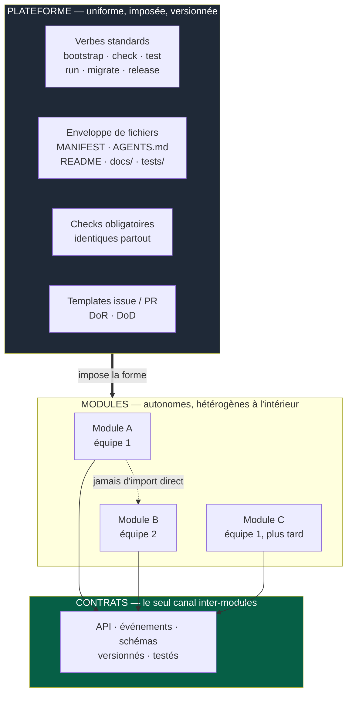
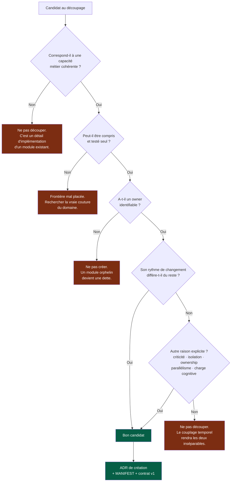
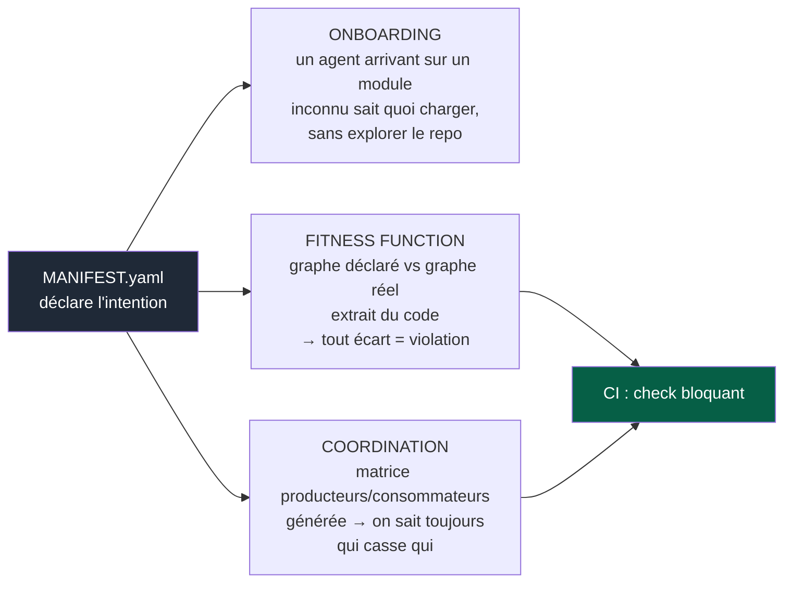
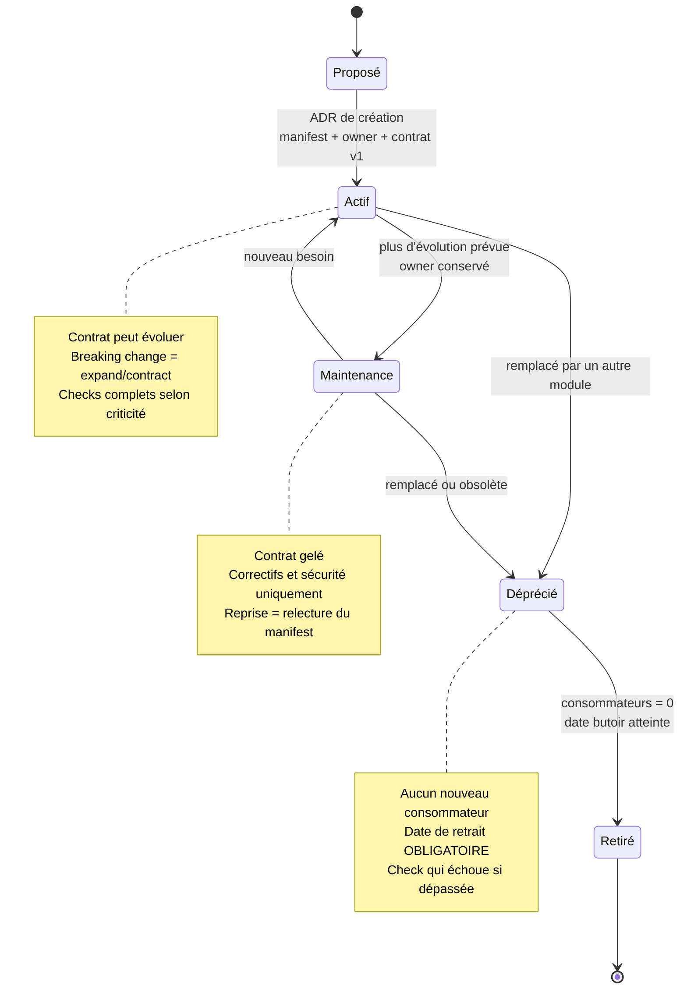
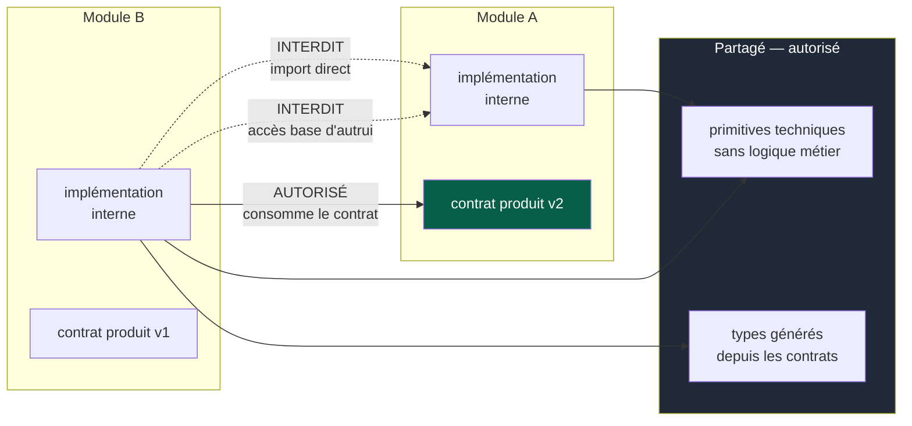

# 02 — Modules et frontières

## 1. La règle fondamentale

> Un développeur ou un agent travaillant sur un module doit pouvoir **comprendre,
> modifier, tester et valider** ce module sans devoir comprendre l'ensemble du système.

C'est la définition opérationnelle d'un module. Tout le reste — granularité, ownership,
contrats, cycle de vie — en découle.

Si cette propriété n'est pas vérifiée, ce n'est pas un module : c'est un dossier.

---

## 2. Ce qui est uniforme, ce qui ne l'est pas

Le piège classique en multi-équipes : pour que tout le monde « travaille de la même
manière », on standardise l'*implémentation* — même framework, mêmes couches, mêmes
patterns internes. Cela produit du couplage par convention, vieillit mal, et empêche
chaque équipe d'adapter son module à son domaine.

Ce que l'on standardise, c'est l'**interface d'ingénierie** du module : la façon dont
on le découvre, le lance, le teste, le valide, le livre.

> Un développeur ou un agent qui change de module retrouve les mêmes **verbes**,
> jamais le même **code**.



La règle tient en une phrase :

> **Deux modules ne se connaissent que par leur contrat. Deux équipes ne se coordonnent
> que par le contrat. Tout le reste est local.**

### Le partage frontal

| Catégorie | Uniforme ? | Détail |
|---|---|---|
| Verbes de commande | **Oui, imposé** | `09-platform.md` |
| Enveloppe de fichiers | **Oui, imposé** | §4 ci-dessous |
| Checks obligatoires | **Oui, imposé** | `07-governance.md` |
| Format des contrats | **Oui, imposé** | `03-contracts.md` |
| Formats ADR / PDR | **Oui, imposé** | `06-decisions.md` |
| Langage, framework, base de données | Non | Décision locale, ADR si structurante |
| Architecture interne, patterns | Non | Décision locale |
| Stratégie de test détaillée | Non | Guidée par le risque, `08-quality.md` |
| Conventions de nommage internes | Non | Locales, décrites dans l'`AGENTS.md` du module |

**Attention au coût de l'hétérogénéité.** L'autonomie technique n'est pas gratuite :
elle se paie en capacité à prêter main-forte entre équipes, en outillage à maintenir,
en surface de sécurité. La liberté existe, mais un ADR est attendu dès qu'un module
introduit une technologie absente du reste du projet, et le Prior Art Gate s'applique
(`06-decisions.md`).

---

## 3. Granularité : où couper

Ne jamais créer de modules artificiellement petits. Un module représente une
**capacité cohérente**, pas une table, une entité ou quelques endpoints.



Les critères qui déterminent légitimement la granularité : le domaine, le niveau de
couplage, l'ownership, le rythme de changement, la criticité, le besoin d'isolation, et
la charge cognitive.

Le découpage n'est donc **pas uniquement une décision de déploiement**. Il sert aussi à
borner le contexte d'un agent, réduire le rayon d'impact d'un changement, permettre le
travail parallèle et rendre les validations locales fiables.

---

## 4. L'enveloppe d'un module

Structure minimale, identique partout :

```
modules/<nom>/
├── MANIFEST.yaml        ← identité machine-lisible (§5)
├── AGENTS.md            ← instructions IA locales : uniquement le spécifique
├── README.md            ← humain : à quoi ça sert, comment démarrer
├── docs/
│   ├── adr/             ← décisions techniques locales
│   └── runbook.md       ← si module opéré en production
├── contracts/           ← contrats PRODUITS par ce module
├── src/
└── tests/
```

**Règle sur l'`AGENTS.md` local** : il contient uniquement ce qui est spécifique au
module. Ne jamais y dupliquer une règle du kernel. Un `AGENTS.md` local qui répète le
kernel est un bug — il gaspille du contexte et crée un risque de divergence.

Contenu typique d'un `AGENTS.md` local : conventions internes non devinables, pièges
connus, invariants métier, commandes non standards, zones à ne pas modifier et
pourquoi.

---

## 5. Le Module Manifest

C'est la pièce qui rend le multi-équipes opérationnel. Un fichier déclaratif unique,
lisible par un humain, un agent **et la CI**.

Voir `templates/MANIFEST.example.yaml` pour le format complet. Il déclare :

- identité et responsabilité en une phrase ;
- owner (équipe, pas individu) ;
- statut de cycle de vie ;
- niveau de criticité — il détermine le niveau de gouvernance exigé ;
- contrats produits ;
- contrats consommés, avec versions ;
- commandes standards.

### Les trois usages qui justifient son coût



Le point essentiel : **le manifest déclare l'intention, la CI vérifie la réalité.** Un
import vers un module non déclaré échoue en CI. Une dépendance déclarée mais inutilisée
est signalée. Aucune analyse sémantique n'est nécessaire — c'est une comparaison de
graphes.

---

## 6. Cycle de vie d'un module

Nécessaire dès qu'une équipe travaille séquentiellement sur plusieurs modules : sans
statut explicite, une équipe qui revient sur un module six mois plus tard ne sait pas ce
qu'elle a le droit de casser.



Le statut vit dans le manifest, donc il est vérifiable :

| Situation | Résultat CI |
|---|---|
| Module `Maintenance` dont le contrat change | **Rouge** |
| Module `Déprécié` qui gagne un consommateur | **Rouge** |
| Module `Déprécié` dont la date de retrait est dépassée | **Rouge** |
| Module `Actif` sans owner déclaré | **Rouge** |

C'est ce qui évite les **états intermédiaires permanents** : un chemin déprécié qui ne
disparaît jamais parce que personne n'est responsable de sa suppression.

---

## 7. Une PR, un module

C'est la contrainte la plus rentable du système. Objective, automatisable, et chaque
violation devient un signal d'architecture.

**Règle.** Une PR modifie les fichiers d'un seul module. Les exceptions existent mais
sont visibles, tracées et comptées.

| Exception | Traitement |
|---|---|
| Changement de contrat | Séquence expand/contract, jamais une PR unique (`03-contracts.md`) |
| Changement du socle | Fichiers du squelette : équipe socle, revue élargie ; module `platform/` s'il existe (`09-platform.md` §1) |
| Correction d'incident critique | Autorisée, label obligatoire, ADR ou post-mortem sous 5 jours |

Le déblocage passe par un label explicite sur la PR. Cela rend le taux de changements
cross-module **mesurable gratuitement** — c'est l'un des meilleurs indicateurs de
qualité des frontières (`10-measurement.md`).

---

## 8. Dépendances autorisées



**Interdits, détectables automatiquement :**

- import direct du code interne d'un autre module ;
- accès direct à la base de données d'un autre module ;
- dépendance circulaire entre modules ;
- partage de logique métier entre domaines distincts ;
- base de données partagée sans ADR justificatif.

**Autorisé mais à surveiller :** les primitives techniques partagées (logging, erreurs,
utilitaires sans logique métier). Dès qu'une règle métier entre dans un package
partagé, deux modules deviennent inséparables.

---

## 9. Détecter une mauvaise frontière

Une frontière doit **réduire le coût de changement**. Si elle ne fait que déplacer le
code, elle est mal placée. Ces signaux sont mesurables, pas subjectifs :

| Signal | Comment le mesurer |
|---|---|
| PR nécessitant systématiquement plusieurs modules | Taux de PR cross-module (§7) |
| Modules toujours déployés ensemble | Corrélation des releases |
| Dépendances circulaires | Fitness function sur le graphe |
| Appels synchrones en cascade | Traces de production |
| Contrats trop nombreux entre deux modules | Comptage depuis les manifests |
| Tests nécessitant l'ensemble du système | Durée et périmètre de la suite locale |
| Ownership ambigu | Manifest sans owner, ou PR revue par plusieurs équipes |
| Agent incapable de travailler via le contrat seul | Remontée du kernel §4 |

Le dernier signal est le plus fiable et le moins cher : il est collecté à chaque tâche,
gratuitement, par l'agent lui-même. **Ne jamais le contourner silencieusement.**

Quand plusieurs signaux convergent sur la même paire de modules, ouvrir une issue de
type *Architecture* : la réponse est soit fusionner, soit redécouper autrement, jamais
ajouter un contrat de plus.
