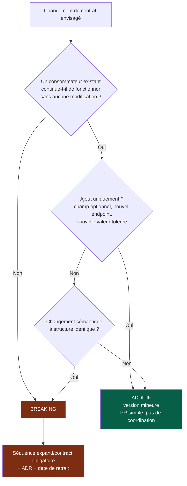
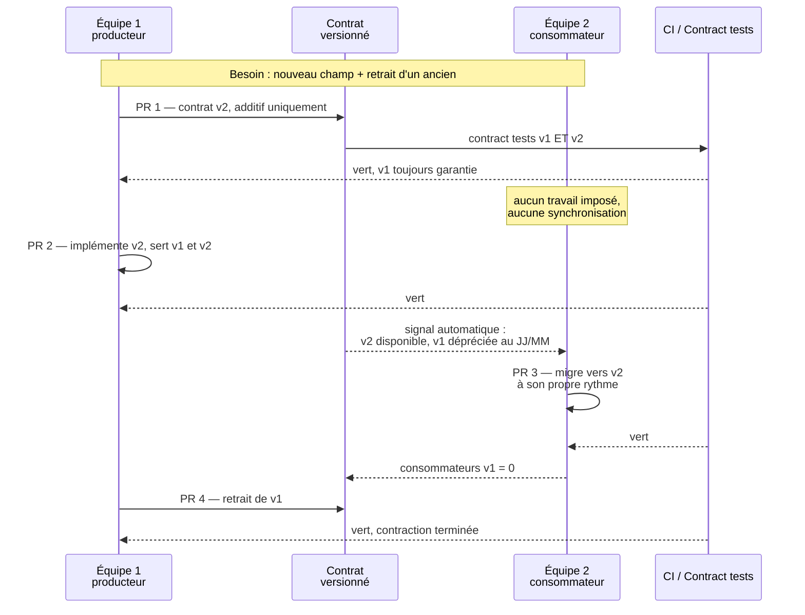
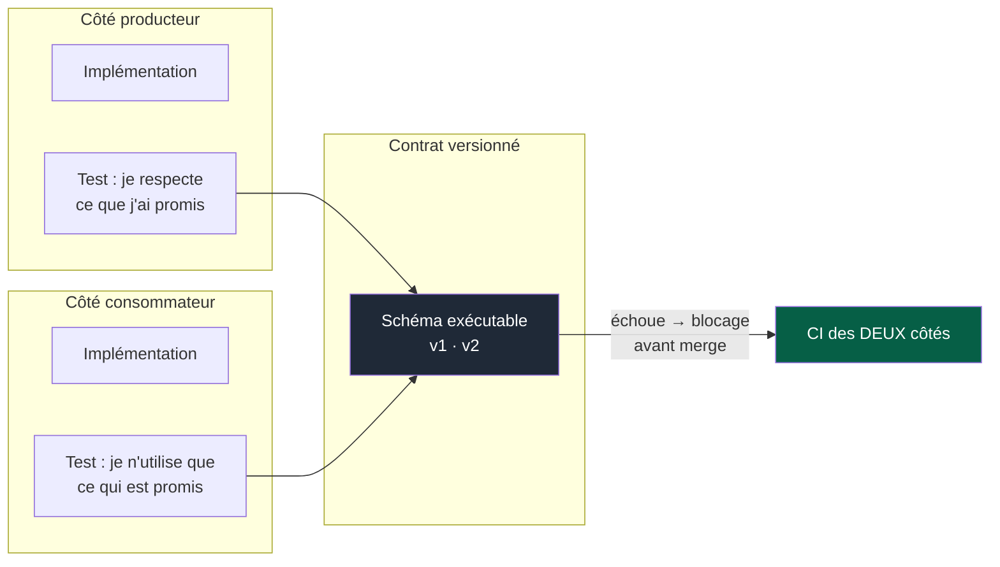

# 03 — Contrats

## 1. Rôle

Le contrat est le **seul canal de communication autorisé entre deux modules**. C'est
aussi le seul point de coordination entre deux équipes.

Tout le bénéfice du découpage en modules repose sur une propriété : je peux réécrire
entièrement l'intérieur d'un module sans que quiconque s'en aperçoive, tant que son
contrat tient. Si ce n'est pas vrai, le découpage est décoratif.

> Un changement d'API n'est **jamais** un refactoring interne.

---

## 2. Le contrat comme module à part entière

`contracts/` n'est pas un dossier utilitaire. C'est la frontière la plus critique du
système : elle ne peut pas être orpheline.

Elle a donc, comme tout module : un owner, un manifest, ses propres tests, ses propres
règles de changement, et une criticité élevée par défaut.

**Propriétés exigées d'un contrat :**

| Propriété | Vérification |
|---|---|
| Versionné | Le numéro de version fait partie de l'identifiant |
| Documenté | Champs, erreurs, codes, sémantique, exemples |
| Validable automatiquement | Schéma exécutable, pas une description en prose |
| Indépendant de l'implémentation | Aucune fuite de structure interne du producteur |
| Compatible | Règle de compatibilité explicite et testée |
| Daté pour ses dépréciations | Toute version dépréciée porte une date de retrait |

Un contrat peut couvrir : API synchrone, événements, messages, schémas de données
échangées, erreurs, authentification, autorisation, règles de compatibilité et de
dépréciation.

---

## 3. Classification des changements

C'est la première question à poser, et elle est mécanisable.

**Le piège le plus fréquent** est le nœud `F` : une structure inchangée mais une
sémantique modifiée. Un champ `status` qui gagne une valeur que les consommateurs ne
savent pas traiter, une unité qui passe de secondes à millisecondes, un champ
nullable qui devient toujours rempli. Techniquement compatible, fonctionnellement
cassant. Ce sont les ruptures les plus coûteuses parce qu'aucun outil de diff ne les
détecte — seuls les contract tests le font.

---

## 4. Expand / Contract

C'est la seule manière connue de faire évoluer un contrat entre équipes **sans
synchronisation temporelle**. Quatre PR, quatre revues indépendantes, zéro réunion.

### Les quatre étapes en détail

| PR | Qui | Contenu | Garde-fou |
|---|---|---|---|
| **1 — Expand contrat** | Producteur | v2 déclarée, additive. v1 intacte. | Contract tests v1 **et** v2 verts |
| **2 — Expand impl.** | Producteur | Sert les deux versions simultanément | Aucun consommateur impacté |
| **3 — Migration** | Chaque consommateur | Bascule vers v2, à son rythme | Manifest mis à jour : version consommée |
| **4 — Contract** | Producteur | Retrait de v1 | Revue : consommateurs v1 = 0 (à automatiser) |

### Les deux garde-fous

**① La date de dépréciation est un check.** Dès la PR 1, v1 porte une date de retrait.
Un check échoue quand la date est dépassée et que des consommateurs subsistent. Sans
cela, on accumule des versions que personne n'ose retirer.

**② La contraction est obligatoire.** L'étape 4 est la plus souvent oubliée, et c'est
précisément elle qui produit les états intermédiaires permanents. Une PR 1 ouvre une
issue de contraction, assignée à l'owner du contrat : à la main tant que cette ouverture
n'est pas automatisée.

---

## 5. Contract tests

Sans eux, un contrat n'est qu'un document — il dérive.

Les deux directions comptent, et elles attrapent des erreurs différentes :

- **Côté producteur** : « je respecte ce que j'ai promis ». Empêche la rupture par
  négligence.
- **Côté consommateur** : « je ne dépends que de ce qui est promis ». Empêche la
  dépendance à un comportement non contractuel — le cas où le producteur casse quelqu'un
  sans avoir rien violé.

Les contract tests tournent dans la CI **des deux modules**. Un changement de contrat
qui casse un consommateur déclaré est détecté avant merge, sans réunion.

---

## 6. Découverte et traçabilité

La matrice producteurs/consommateurs est **générée** depuis les manifests, jamais tenue
à la main. Elle répond à trois questions qu'aucune équipe ne devrait poser en réunion :

- Qui consomme mon contrat, dans quelle version ?
- Que consomme mon module, et quelles versions sont dépréciées ?
- Quel est le rayon d'impact de ce changement ?

Un tableau de bord minimal suffit : contrats, versions, consommateurs, dates de
dépréciation, contractions en retard.

---

## 7. Anti-patterns

| Anti-pattern | Pourquoi c'est un problème |
|---|---|
| Contrat généré depuis les classes internes du producteur | L'implémentation devient le contrat : toute refonte interne casse les consommateurs |
| Version dans le corps du message plutôt que dans l'identifiant | Le routage devient conditionnel et non testable |
| « Champ optionnel » que tous les consommateurs doivent en réalité lire | Breaking déguisé en additif |
| Contrat sans exemple ni cas d'erreur | Le consommateur devine ; les divergences apparaissent en production |
| Retrait de version « quand on aura le temps » | État intermédiaire permanent |
| Plus de N contrats entre les deux mêmes modules | Signal de mauvaise frontière (`02-modules.md` §9) |
| Contrat modifié dans la même PR que l'implémentation du consommateur | Supprime tout le bénéfice de l'expand/contract |
