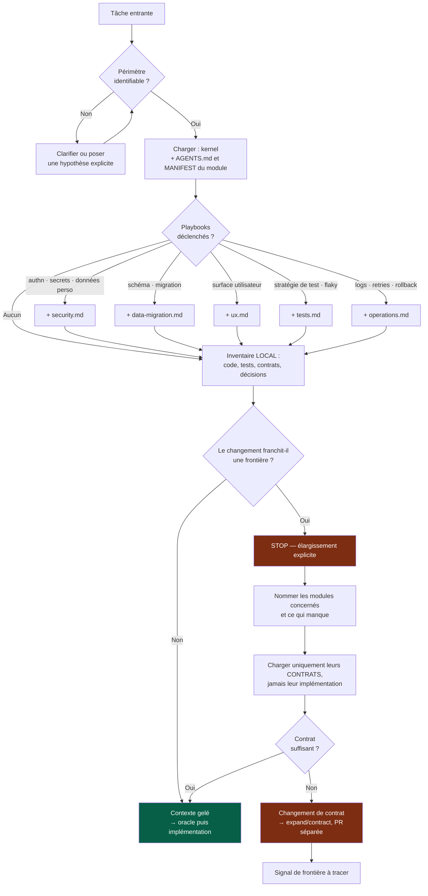

# 04 — Contexte IA

## 1. Le contexte est une ressource, pas un réservoir

Charger « tout le repo au cas où » est l'erreur la plus courante et la plus coûteuse.
Elle a trois effets, tous mauvais :

1. **Dilution** — l'information pertinente se noie ; la qualité du raisonnement baisse
   à mesure que le contexte grossit.
2. **Contamination de frontière** — un agent qui *voit* l'implémentation d'un autre
   module finit par s'en servir. Le couplage naît de la visibilité.
3. **Coût** — en tokens, en latence, et en attention humaine lors de la revue.

> **Ne jamais scanner massivement le projet « au cas où ».**

L'isolation du contexte n'est donc pas une technique de prompting : c'est une
**préoccupation architecturale**. Le découpage en modules sert autant à borner ce qu'un
agent doit charger qu'à organiser le déploiement.

---

## 2. La procédure de scoping



« **Contexte gelé** » signifie : à partir de ce point, on n'ajoute plus de fichiers au
contexte sans repasser par la question du franchissement de frontière. Une exploration
qui s'élargit progressivement pendant l'implémentation est le symptôme d'un cadrage
raté, pas d'une découverte utile.

---

## 3. Ordre de chargement et budget

```
1. kernel AGENTS.md                     toujours      ~250 lignes
2. MANIFEST du module cible             toujours      court
3. AGENTS.md local du module            toujours      ~50-100 lignes
4. playbook(s) déclenché(s)             conditionnel  1 à 2 maximum
5. code et tests locaux pertinents      ciblé         pas le module entier
6. contrats consommés                   ciblé         le contrat, pas l'implémentation
7. ADR/PDR liés à la zone modifiée       si existants
8. autre module                          JAMAIS sans franchissement explicite
```

Avant d'explorer, un agent doit pouvoir répondre à cinq questions. Si l'une reste sans
réponse, le problème est le cadrage, pas le contexte :

- Quel **module** est concerné ?
- Quels **contrats** sont impliqués ?
- Quels **tests** existent déjà sur cette zone ?
- Quelles **décisions** (ADR/PDR) contraignent ce choix ?
- Quel est l'**oracle** de cette tâche ?

---

## 4. Le franchissement de frontière

C'est le mécanisme qui distingue un système avec des frontières d'un système qui en a
l'apparence. Le franchissement n'est pas interdit : il est rendu **explicite, coûteux
et tracé**, donc rare.

Quand une tâche semble nécessiter un second module, il existe presque toujours l'une de
ces quatre réponses — dans cet ordre de préférence :

| Réponse | Quand | Coût |
|---|---|---|
| **1. Le contrat suffit déjà** | Cas le plus fréquent. L'information existe, elle n'avait pas été cherchée. | Nul |
| **2. Le contrat doit s'étendre** | Besoin réel côté consommateur. | Expand/contract (`03-contracts.md`) |
| **3. La tâche était mal découpée** | Elle contenait en réalité deux tâches. | Redécoupage, deux issues |
| **4. La frontière est mauvaise** | Le contrat ne peut structurellement pas suffire. | Issue *Architecture*, ne pas contourner |

**Le cas 4 est le signal le plus précieux du système.** L'incapacité à travailler via le
contrat seul est le symptôme de couplage le plus fiable qu'on puisse collecter — et il
est collecté gratuitement, à chaque tâche, par l'agent lui-même.

Le contourner en important directement le code de l'autre module, c'est détruire
l'information *et* la frontière en un seul geste.

---

## 5. Multi-agents

Utiliser plusieurs agents **uniquement** quand le bénéfice est clair :

| Cas légitime | Pourquoi |
|---|---|
| Travail réellement parallèle sur des modules distincts | Le cloisonnement est déjà garanti par les frontières |
| Revue indépendante | Un contexte non contaminé par la génération détecte mieux |
| Investigation / spike isolé | Évite de polluer le contexte de la tâche principale |
| Comparaison de deux approches | Chacune raisonnée sans connaître l'autre |
| Expertise spécialisée ponctuelle | Sécurité, performance, accessibilité |

Ne pas multiplier les agents pour une tâche simple : le coût de coordination et de
synthèse dépasse vite le gain.

**Règle de cohérence.** Les agents partagent les mêmes sources de vérité, les mêmes
contrats et les mêmes formats de décision. Ils ne créent **jamais** chacun leurs propres
conventions. Rôles types : Architect, Product, Software Engineer, QA, Security, UX/UI,
DevOps/SRE, Reviewer, Researcher.

**Règle de frontière.** Deux agents travaillant en parallèle travaillent sur deux
modules distincts. Deux agents sur le même module, c'est un conflit de merge et une
revue impossible.

---

## 6. Recherche et vérification

Quand l'information est susceptible d'avoir changé — versions, API, options, capacités
d'outils, état d'un écosystème — la chercher **avant** de décider.

| Faire | Ne pas faire |
|---|---|
| Privilégier les sources primaires et la documentation officielle | Se fier à un souvenir d'entraînement |
| Vérifier les versions et les contraintes de compatibilité | Supposer qu'une option existe parce qu'elle serait logique |
| Distinguer faits et opinions | Présenter une préférence comme une contrainte technique |
| Dire quand l'information n'est pas connue | Inventer une API, une commande, une version, une capacité |

Ordre de résolution d'une incertitude, du moins cher au plus cher :

```
1. inspecter le module et ses tests
2. lire le contrat concerné
3. lire les ADR/PDR liés
4. rechercher la documentation officielle
5. demander une clarification  ← uniquement si réellement bloquant
```

Demander une clarification pour une information trouvable en trente secondes est un
coût de coordination injustifié. Avancer sur une hypothèse non déclarée est pire.
La bonne réponse intermédiaire : **avancer avec une hypothèse explicitement déclarée**,
et la faire apparaître dans le résumé final.
