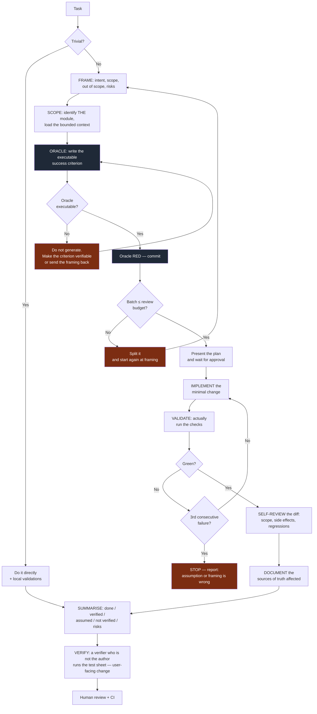
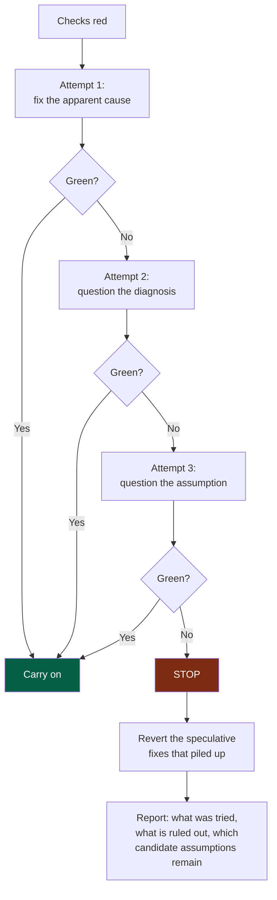

# 05 — Workflow

## 1. The reversal

The classic workflow is: *understand → code → test → review*.

With an agent, that workflow collapses for a simple reason: the "code" step no longer
costs anything, so it saturates the steps after it. The project produces, faster, what
nobody has time to verify.

The OS reverses two things:

1. **The oracle before the generation.** The success criterion is executable and red
   before the first line of code.
2. **The review budget at the entrance.** The size of the batch is constrained *before*
   generating, not observed afterwards.

---

## 2. The loop



**Legend** — dark grey: the oracle, written and seen red before any code · red: stop and
go back · the verification comes from someone other than the author.

---

## 3. The oracle

> The oracle is a task's **executable** success criterion, written and seen failing
> before the generation.

Depending on the task it can be: a unit or integration test, a contract test, a fitness
function, a migration check, a performance budget, an accessibility test.

### Why watch it fail first

A test that has never been red proves nothing: it may pass because it tests nothing. That
is a particularly frequent failure mode with generated code, where test and
implementation are born together and agree on a shared mistake.

### When the oracle is impossible

This is not a marginal case, and it is not an excuse to skip the step. It is a diagnosis:

| Cause | What to do |
|---|---|
| The acceptance criterion is subjective | Restate it as an observable behaviour |
| The task is exploratory | Requalify it as a *spike*: the deliverable is knowledge, not code |
| The area is untestable | Make it testable first — that is a task in its own right |
| The need is vague | Back to framing; it was not *Ready* |

In every case: **do not generate while waiting**.

---

## 4. The review budget

This is the most useful quality gate in the OS, because it applies **before** the
generation instead of observing the damage afterwards.

> The project's real throughput is its verification throughput, not its generation
> throughput.

The budget is an explicit ceiling, set for the project — `MAX_LINES` and `MAX_FILES` in
the pull request workflow. Adjusting it per module, by criticality, is not automated: it
is in the automation backlog. It covers:

| Dimension | Indicative ceiling |
|---|---|
| Lines changed (excluding generated and lock files) | ~400 |
| Files touched | ~15 |
| Modules touched | **1** |
| Contracts changed | 1, and a dedicated PR |

These values are starting points to calibrate, not truths. The principle matters more
than the number: **the batch must be reviewable in one session of attention**.

**Going over.** The check reports, it does not block automatically (except for modules
touched, where it does block). A justified overrun — code generation, a mechanical
migration, a mass rename — goes through an explicit label. What matters is that the
overrun is **visible and counted**: the rate of over-budget pull requests is a health
indicator (`10-measurement.md`).

Never produce a huge pull request simply because the agent can generate a lot of code
quickly.

---

## 5. The 3-failure circuit breaker

An agent looping on a fix is almost always treating a framing problem as a code problem.
Without an explicit stopping point it digs — and it digs fast.



**Legend** — green: the loop exits normally · red: the stopping point, and what it
requires.

The key point is `H1`: **revert the speculative fixes**. Three failed attempts leave
behind code added "to see" that no longer has a justification. Leaving it in place is the
quietest way to accumulate debt.

---

## 6. Definition of Ready

Do not start a significant task without:

- [ ] a **deliverable of the current cycle**, ready (`docs/project/`)
- [ ] a goal understandable without a spoken conversation
- [ ] scope **and out of scope**
- [ ] the target module identified
- [ ] **testable** acceptance criteria
- [ ] known dependencies and contracts
- [ ] important constraints identified
- [ ] an acceptable level of risk

If a piece of information is missing without being blocking: move ahead with an
**explicitly stated assumption**, which will surface in the closing summary. If it is
genuinely blocking: ask for clarification, once, precisely.

Out of scope is often neglected although it is the most useful part: it is what prevents
gradual drift and opportunistic refactoring.

---

## 7. Definition of Done

A task is finished when the **applicable** validations have actually passed. Which ones apply
depends on the module's declared `criticality`. **This table is the only place that says
which** — nothing else in the framework holds a second version of it, and a check that
refuses a change reads it here.

Each row says who judges it:

- **machine** — a check in CI fails when it is missing. You cannot forget it, and you cannot
  talk your way past it.
- **owed** — no check reads it. It is owed to a human, by name, and a row marked *owed* that
  nobody does is a decision the project took in silence.

The distinction is deliberate. A framework that claims CI verifies a UAT teaches its readers
to stop believing the rest of the table. **E2E is the honest case to look at**: a check can
read that a module declares an end-to-end command; it cannot read that the command runs
end-to-end scenarios rather than the unit suite under another name. A rule a one-line alias
satisfies teaches the alias, so that row is owed to a human.

| Validation | Judged by | prototype | standard | high | critical |
|---|---|---|---|---|---|
| Oracle green | machine | ✔ | ✔ | ✔ | ✔ |
| Lint, format, types | machine | ✔ | ✔ | ✔ | ✔ |
| Unit tests | machine | ✔ | ✔ | ✔ | ✔ |
| Fitness functions | machine | ✔ | ✔ | ✔ | ✔ |
| Contract tests | machine | if there is a contract | if there is a contract | ✔ | ✔ |
| Test sheet run by a verifier, with evidence | machine | — | if user-facing | ✔ | ✔ |
| Runbook present | machine | — | — | ✔ | ✔ |
| Every scenario re-run at the head commit | machine | — | — | — | ✔ |
| Build | owed | ✔ | ✔ | ✔ | ✔ |
| Integration tests | owed | — | per risk | ✔ | ✔ |
| Security analysis | owed | — | ✔ | ✔ | ✔ |
| Affected documentation up to date | owed | — | ✔ | ✔ | ✔ |
| Accessibility | owed | — | if UI | if UI | ✔ |
| E2E on critical journeys | owed | — | — | ✔ | ✔ |
| Observability added | owed | — | — | ✔ | ✔ |
| Rollback verified | owed | — | — | per risk | ✔ |
| UAT | owed | — | — | as needed | ✔ |
| Post-deployment verification | owed | — | — | per risk | ✔ |

**Human review is not in this table.** Who must approve a change is not a property of the
code's blast radius but of the project's exposure — how many people depend on it, and what
the forge is able to require. It lives in `07-governance.md` §7.

**One round.** The framework asks for **one** sheet, run by **one** verifier who is not an
author. It never asks for a second adversarial round, and no check counts them. A project may
decide to spend more — on a module where it is worth it, recorded in its own ADR — and that is
the project's decision, never a requirement read out of this table. Measured on one project
that had no ceiling: six rounds on a read-only module, and **three of the eleven defects found
were introduced by the late rounds themselves**.

**What separates `high` from `critical`.** At `high` the sheet is required and the verifier is
independent. `critical` adds three things, and they are the three that cost: **every scenario
re-run at the head commit** after the last fix — no confirmation stands in for a run — **e2e
present and green**, and the **runbook referenced by the sheet** rather than merely existing. A module that holds a key,
places an order, moves money or touches someone's personal data is `critical`; one whose
failure costs a day is `high`.

> **Never write "tests passing" if the tests were not actually run.** It is the gravest
> violation in the system, because it corrupts the one thing everything else rests on.

### The test sheet

Reading a diff tells nobody whether the product behaves as needed; an agent reads code as
well as a human. So a pull request that changes what a user sees — or changes a module of
criticality `high` or `critical` — carries a **test sheet** in its description. Editing
only a module's description — its manifest, `AGENTS.md`, `README.md`, `docs/` — changes no
behaviour and needs no sheet, a framework update included. The user-visible surface and the
criticality are read before and after the change, and the stricter applies:

| # | Given · when · then | Kind | Result | Evidence | Commit | Confirmed |
|---|---|---|---|---|---|---|
| S2 | Given an account, when the password is wrong, then a message says what to do and the email stays typed | automated | passed | the CI run's trace | `a1b2c3d` | — |
| S5 | Given a 375-pixel-wide phone, when the keyboard opens, then the button stays reachable | explored | failed — the button is hidden | emulator screenshot | `a1b2c3d` | `e4f5a6b` — three fixes under src/, none on this path |
| S8 | Given a real mailbox, when a reset is asked, then the email arrives | human only — no test mailbox | not verified | — | — | — |

- **Written before the code**, from the acceptance criteria: it is part of the oracle.
- **Run by a verifier who is not the author**: another agent session with a fresh
  context, or a human (`playbooks/verification.md`). The session that wrote the code
  shares its misunderstandings. CI compares the verifier's name with the change's authors —
  the pull request's, the commits' GitHub accounts (read from their noreply addresses), and
  the sessions their `Agent-Session` trailers name — and refuses a match: a declaration
  checked against the history, not a proof of identity.
- **No result without evidence**, tied to the commit tested. A new commit does not send the
  whole sheet back:
  - an **automated** scenario is **run again** at the head — CI replays it anyway, so it costs
    nothing;
  - one **explored** by hand keeps the commit its evidence was produced on, and the verifier
    adds a **`Confirmed`** column on the head commit saying **what moved since and why it leaves
    the result standing**. Reading three fixes is not the same work as driving six scenarios
    again, and the sheet should not charge the second for the first.
  - at criticality **`critical`**, nothing stands in for a run: every scenario goes again.

  A confirmation is not a round. A project that wants another adversarial round decides so
  itself; the sheet never demands one because a fix landed.
- **Kinds**: *automated* — replayable, run by CI through the module's `e2e` command;
  *explored* — judged by driving the interface; *human only* — what no agent can run, with
  the reason, listed apart for the approver.

**`Confirmed` is optional**: a sheet no fix has disturbed never carries it. The engine's pull
request check reads the sheet in CI: missing, unfilled, without evidence, verified before the
head and not confirmed on it, failed. The approver decides on the sheet, and notes what they found that
the verifier had missed — that measurement decides, one day and module by module, whether
a verifier agent's approval may count.

---

## 8. The closing summary

An imposed format, always in this order:

```
DONE           what was changed, one sentence per change
VERIFIED       the checks actually run, with their result
ASSUMED        the assumptions taken for lack of information
NOT VERIFIED   what was not tested, and why
RISKS          possible side effects, debt introduced, follow-ups needed
```

The last three sections are the most important and the most often skated over. A summary
with nothing to put under `ASSUMED` and `NOT VERIFIED` is almost always an incomplete
summary, not a perfect task.

---

## 9. Rules for changing code

**Before.** Understand the problem, look for what already exists, identify the local
conventions, the dependencies, the tests and the contracts concerned, assess the risks.

**During.** Stay inside the scope. The minimal change. **No opportunistic refactoring.**
Keep the module's existing conventions, even where you would have written them
differently. Do not introduce unnecessary complexity.

**After.** Inspect the diff line by line. Run the validations. Actively look for side
effects. Update the documents affected.

### On refactoring

Never refactor because the code "could be cleaner". A refactor must have a named reason:
removing coupling, reducing a measured complexity, enabling an identified evolution,
fixing an architectural violation, improving a measured performance, improving
testability, paying down documented debt.

A significant refactor is **isolated from the functional change**, in its own pull
request. Mixing the two makes review impossible: the reviewer can no longer tell what
changes the behaviour from what preserves it.

---

## 10. Postures

One person or one agent can hold several postures in a small team — except that the author
never verifies its own work, and never approves it.

| Posture | Held by | Mission | Never | Produces |
|---|---|---|---|---|
| **Framer** | An agent | Interview the decider; propose the charter, the cycle, the deliverables and their criteria, the modules | Decide; propose more than the need; split on day one without a reason | Proposals (`playbooks/framing.md`) |
| **Author** | An agent | Deliver one deliverable, in one module, within its criteria | Widen the scope; verify or approve its own work | The pull request and its oracle |
| **Challenger** | An agent session other than the framer's, or a human | Attack a discovery: pre-mortem, the four risks, counter-evidence | Rewrite the document; soften an objection | Objections with their evidence (`playbooks/discovery.md`) |
| **Verifier** | An agent session other than the author's, or a human | Run the test sheet against the change, before reading the diff | Fix the code; report a preference as a gap | Results and evidence (`playbooks/verification.md`) |
| **Approver** | A human code owner | Decide the merge on the evidence | Approve without the sheet where one is required | The approval |
| **Decider** | The human who owns the project | Validate the charter, the cycle and its appetite; accept a change of scope; choose at the circuit breaker | Extend a cycle silently | Decisions recorded in `docs/project/` |
| **Owners** | The foundation team, a module's owner | Own the project's rules, or one module | Write a project rule into a framework file | The project's and the module's documents |
