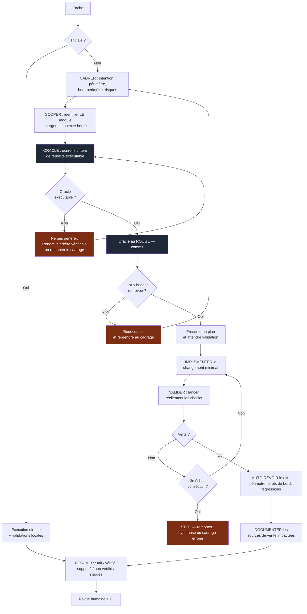
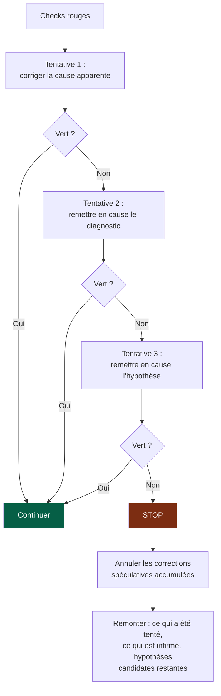

# 05 — Workflow

## 1. Le renversement

Le workflow classique est : *comprendre → coder → tester → relire*.

Avec un agent, ce workflow s'effondre pour une raison simple : l'étape « coder » ne
coûte plus rien, donc elle sature les étapes suivantes. Le projet produit plus vite ce
que personne n'a le temps de vérifier.

L'OS renverse deux choses :

1. **L'oracle avant la génération.** Le critère de réussite est exécutable et rouge
   avant la première ligne de code.
2. **Le budget de revue à l'entrée.** La taille du lot est contrainte *avant* de
   générer, pas constatée après.

---

## 2. La boucle



---

## 3. L'oracle

> L'oracle est le critère de réussite **exécutable** d'une tâche, écrit et vu échouer
> avant la génération.

Selon la tâche, ce peut être : un test unitaire ou d'intégration, un contract test, une
fitness function, un check de migration, un budget de performance, un test
d'accessibilité.

### Pourquoi le voir échouer d'abord

Un test qui n'a jamais été rouge ne prouve rien : il peut passer parce qu'il ne teste
rien. C'est un mode d'échec particulièrement fréquent avec du code généré, où test et
implémentation naissent ensemble et s'accordent sur une erreur commune.

### Quand l'oracle est impossible

Ce n'est pas un cas marginal, et ce n'est pas une excuse pour sauter l'étape. C'est un
diagnostic :

| Cause | Ce qu'il faut faire |
|---|---|
| Le critère d'acceptation est subjectif | Le reformuler en comportement observable |
| La tâche est exploratoire | La requalifier en *spike* : livrable = connaissance, pas code |
| La zone est non testable | Rendre testable d'abord — c'est une tâche à part entière |
| Le besoin est flou | Retour au cadrage ; ce n'était pas *Ready* |

Dans tous les cas : **on ne génère pas en attendant**.

---

## 4. Le budget de revue

C'est la quality gate la plus utile de l'OS, parce qu'elle s'applique **avant** la
génération au lieu de constater les dégâts après.

> Le débit réel du projet est le débit de vérification, pas le débit de génération.

Le budget est un plafond explicite, déclaré au niveau du projet et ajustable par module
selon sa criticité. Il porte sur :

| Dimension | Plafond indicatif |
|---|---|
| Lignes modifiées (hors généré et lock files) | ~400 |
| Fichiers touchés | ~15 |
| Modules touchés | **1** |
| Contrats modifiés | 1, et PR dédiée |

Ces valeurs sont des points de départ à calibrer, pas des vérités. Le principe compte
plus que le chiffre : **le lot doit être relisable en une session d'attention**.

**Dépassement.** Le check signale, il ne bloque pas automatiquement (sauf pour les
modules touchés, où il bloque). Un dépassement justifié — génération de code, migration
mécanique, renommage massif — passe par un label explicite. Ce qui compte est que le
dépassement soit **visible et compté** : le taux de PR hors budget est un indicateur de
santé (`10-measurement.md`).

Ne jamais produire une énorme PR simplement parce que l'agent peut générer beaucoup de
code rapidement.

---

## 5. Le circuit breaker des 3 échecs

Un agent qui boucle sur une correction est presque toujours en train de traiter un
problème de cadrage comme un problème de code. Sans point d'arrêt explicite, il creuse —
et il creuse vite.



Le point clé est `H1` : **annuler les corrections spéculatives**. Trois tentatives
ratées laissent derrière elles du code ajouté « pour voir » qui n'a plus de
justification. Le laisser en place est la façon la plus discrète d'accumuler de la
dette.

---

## 6. Definition of Ready

Ne pas commencer une tâche significative sans :

- [ ] objectif compréhensible sans conversation orale
- [ ] périmètre **et hors-périmètre**
- [ ] module cible identifié
- [ ] critères d'acceptation **testables**
- [ ] dépendances et contrats connus
- [ ] contraintes importantes identifiées
- [ ] niveau de risque acceptable

Si une information manque sans être bloquante : avancer avec une **hypothèse
explicitement déclarée**, qui remontera dans le résumé final. Si elle est réellement
bloquante : demander une clarification, une seule fois, précise.

Le hors-périmètre est souvent négligé alors qu'il est le plus utile : c'est lui qui
empêche le glissement progressif et le refactoring opportuniste.

---

## 7. Definition of Done

Une tâche est terminée quand les validations **applicables** sont réellement passées.
Le niveau applicable dépend de la criticité déclarée du module
(`07-governance.md` § gouvernance proportionnelle).

| Validation | Standard | Élevée | Critique |
|---|---|---|---|
| Oracle vert | ✔ | ✔ | ✔ |
| Lint, format, types | ✔ | ✔ | ✔ |
| Tests unitaires | ✔ | ✔ | ✔ |
| Build | ✔ | ✔ | ✔ |
| Contract tests | si contrat | ✔ | ✔ |
| Fitness functions | ✔ | ✔ | ✔ |
| Tests d'intégration | selon risque | ✔ | ✔ |
| Analyse de sécurité | ✔ | ✔ | ✔ |
| Revue humaine | ✔ | ✔ | ✔ + owner |
| Documentation impactée à jour | ✔ | ✔ | ✔ |
| Accessibilité | si UI | si UI | ✔ |
| E2E parcours critiques | — | ✔ | ✔ |
| Observabilité ajoutée | — | ✔ | ✔ |
| Runbook / rollback vérifié | — | selon risque | ✔ |
| UAT | — | selon besoin | ✔ |
| Vérification post-déploiement | — | selon risque | ✔ |

> **Ne jamais écrire « tests passants » si les tests n'ont pas été réellement
> exécutés.** C'est la violation la plus grave du système, parce qu'elle corrompt la
> seule chose sur laquelle tout le reste repose.

---

## 8. Le résumé de fin

Format imposé, toujours dans cet ordre :

```
FAIT           ce qui a été changé, une phrase par changement
VÉRIFIÉ        les checks réellement exécutés, avec leur résultat
SUPPOSÉ        les hypothèses prises faute d'information
NON VÉRIFIÉ    ce qui n'a pas été testé, et pourquoi
RISQUES        effets de bord possibles, dette introduite, suites nécessaires
```

Les trois dernières sections sont les plus importantes et les plus souvent escamotées.
Un résumé qui n'a rien à mettre sous `SUPPOSÉ` et `NON VÉRIFIÉ` est presque toujours un
résumé incomplet, pas une tâche parfaite.

---

## 9. Règles de modification du code

**Avant.** Comprendre le problème, chercher l'existant, identifier les conventions
locales, les dépendances, les tests et les contrats concernés, évaluer les risques.

**Pendant.** Rester dans le périmètre. Changement minimal. **Aucun refactoring
opportuniste.** Conserver les conventions existantes du module, même si on les aurait
écrites autrement. Ne pas introduire de complexité non nécessaire.

**Après.** Inspecter le diff ligne à ligne. Exécuter les validations. Chercher
activement les effets de bord. Mettre à jour les documents impactés.

### Sur le refactoring

Ne jamais refactorer parce que le code « pourrait être plus propre ». Un refactoring
doit avoir une raison nommée : supprimer du couplage, réduire une complexité mesurée,
permettre une évolution identifiée, corriger une violation architecturale, améliorer une
performance mesurée, améliorer la testabilité, résorber une dette documentée.

Un refactoring important est **isolé du changement fonctionnel**, dans sa propre PR.
Mélanger les deux rend la revue impossible : le relecteur ne peut plus distinguer ce qui
change le comportement de ce qui le préserve.
