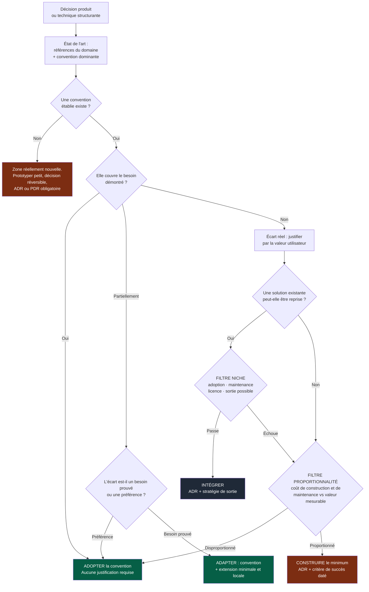
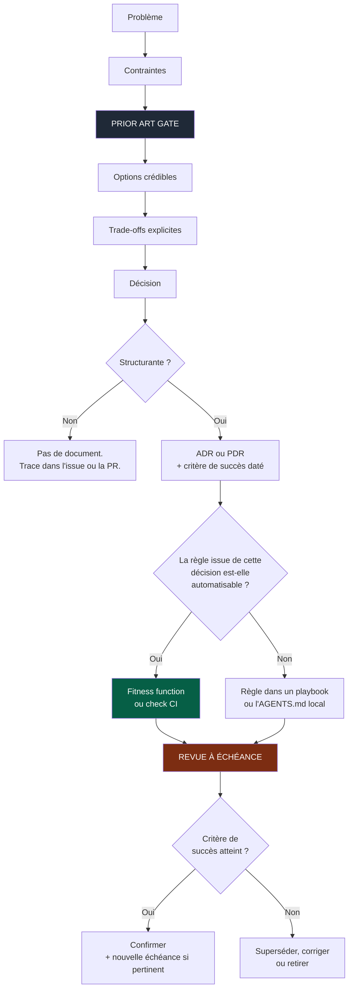

# 06 — Décisions

## 1. Le problème

Un LLM produit toujours une réponse plausible et sur-mesure. C'est sa qualité et son
défaut structurel : il répond même quand la bonne réponse est « c'est un problème résolu
depuis vingt ans, voici la convention ».

Combiné à une génération quasi gratuite, cela produit trois dérives, chacune coûteuse :

| Dérive | Symptôme | Coût |
|---|---|---|
| **Réinventer la roue** | Solution maison là où une convention existe | Maintenance permanente, personne ne connaît le code |
| **Sur-ingénierie** | Abstraction, généricité, flexibilité non demandées | Complexité qui ne sert jamais, revue plus lente |
| **Niche** | Technologie ou pattern exotique adopté trop vite | Recrutement, support, sécurité, sortie impossible |

Le Prior Art Gate traite les trois avec un seul mécanisme.

---

## 2. Le Prior Art Gate

Obligatoire avant toute décision **structurante** — produit ou technique. Structurante
signifie : coûteuse à inverser, ou qui contraindra les décisions suivantes.

Trois questions, dans cet ordre :

**① Qui a déjà résolu ça, et comment ?**
Identifier les références sérieuses du domaine et la convention dominante. Pour un
produit : ce que l'utilisateur connaît déjà et s'attend à trouver ailleurs. Pour une
décision technique : la solution standard, pas la plus élégante.

**② La convention suffit-elle ?**
Par défaut, oui. La convention est le choix gratuit : familière pour l'utilisateur,
documentée, recrutable, connue des agents, déjà éprouvée par d'autres.

**③ Si on s'en écarte, qu'est-ce qui le paie ?**
Toute déviation doit être payée par une **valeur utilisateur nommée et observable**.
Une déviation « parce que c'est plus propre », « plus flexible » ou « plus moderne » est
refusée.



Deux propriétés de ce graphe méritent d'être remarquées.

**Le chemin vert est le plus court.** Adopter la convention ne demande aucune
justification ; tout le reste en demande. L'asymétrie est volontaire — c'est elle qui
empêche la dérive, parce qu'elle rend le chemin paresseux et le chemin correct
identiques.

**Le filtre niche renvoie vers la proportionnalité** plutôt que de sortir de l'arbre.
Une dépendance exotique rejetée ne débouche pas automatiquement sur « on le construit »,
mais sur « est-ce que ça vaut vraiment le coup ».

---

## 3. Les deux filtres

### Filtre niche

Une solution existante peut être reprise si elle passe ces quatre questions :

| Critère | Question |
|---|---|
| **Adoption** | Est-elle utilisée au-delà d'un cercle restreint ? Trouve-t-on des réponses hors de sa propre documentation ? |
| **Maintenance** | Est-elle activement maintenue ? Par combien de personnes ? Que se passe-t-il si elles s'arrêtent ? |
| **Licence et sécurité** | La licence est-elle compatible ? Quelle est sa surface et son historique de vulnérabilités ? |
| **Sortie** | Que coûte le remplacement dans deux ans ? Peut-on l'isoler derrière une interface locale ? |

La dernière est la plus importante et la plus oubliée. **Toute dépendance significative
déclare sa stratégie de sortie dans le manifest du module.**

### Filtre proportionnalité

Construire sur-mesure se justifie quand :

- le besoin est **démontré**, pas anticipé ;
- le coût de construction **et de maintenance sur trois ans** est proportionné à la
  valeur attendue ;
- la solution minimale est identifiée — on construit celle-là, pas la version générique.

Question de contrôle, à poser systématiquement :

> Quelle est la version la plus bête qui résout le problème, et pourquoi ne la
> prend-on pas ?

Si la réponse est « parce qu'elle ne couvrirait pas le cas X », vérifier que le cas X
est réel et non hypothétique. Dans la majorité des cas, il ne l'est pas.

---

## 4. Les deux formats de décision

### ADR — Architecture Decision Record

Pour une décision **technique ou architecturale** significative : choix de technologie,
frontière de module, stratégie de données, pattern structurant, dépendance majeure,
compromis de performance ou de sécurité.

Contenu minimal : contexte · problème · contraintes · **prior art** · options
considérées · décision · conséquences · alternatives rejetées · **critère de succès
daté** si l'on construit sur-mesure.

Une décision remplacée est **supersédée par une nouvelle décision**, jamais réécrite
silencieusement. L'historique des décisions abandonnées vaut souvent plus que la
décision courante : il explique pourquoi l'évidence apparente ne fonctionne pas.

### PDR — Product Decision Record

Pour une décision **produit** importante : objectif utilisateur, comportement attendu,
arbitrage, règle métier structurante, décision UX ou business.

Le PDR décrit **ce que le produit doit faire et pourquoi**, jamais son implémentation.

Contenu minimal : problème utilisateur · **prior art** · options · décision ·
**critère de succès daté** · **condition de retrait** · impacts.

### Pourquoi seulement deux formats

Le format **FDR** (Functional Design Record) a été retiré. Entre le PDR (le quoi et le
pourquoi) et les critères d'acceptation de l'issue (le comportement attendu, testable),
il ne restait presque rien qui justifie un troisième format — et un format de plus
signifie : un endroit de plus où chercher, un de plus à maintenir, un de plus qui
divergera.

Pour les fonctionnalités réellement complexes (nombreux acteurs, machines à états, matrices
de permissions), cela devient une **section optionnelle du PDR** : *Conception
fonctionnelle détaillée*.

> Ne pas créer de document si une issue ou une documentation existante suffit.
> La documentation doit réduire la charge cognitive, pas l'augmenter.

---

## 5. Le critère de succès daté

C'est ce qui rend une décision **falsifiable**, donc utile.

Toute décision de type `CONSTRUIRE`, tout PDR, et tout ADR qui dévie de la convention
porte une phrase de cette forme :

> *On considérera que c'était le bon choix si* **\<observation mesurable\>** *est
> constaté avant le* **\<date\>**.

Sans date, personne ne revient jamais vérifier, et `docs/adr/` devient un cimetière —
ce qui est pire qu'une absence de documentation, parce que ça inspire faussement
confiance.

### Condition de retrait

Chaque fonctionnalité significative embarque, dès son PDR, son critère de suppression.
C'est le pendant produit de la règle d'architecture : *quand un nouveau chemin remplace
un ancien, prévoir aussi la suppression de l'ancien*.

Une fonctionnalité sans condition de retrait est une fonctionnalité définitive par
défaut, y compris quand personne ne l'utilise.

---

## 6. La boucle de décision



L'étape `REVUE À ÉCHÉANCE` est celle qui manque dans la quasi-totalité des projets. Un
rituel léger suffit : une fois par trimestre, lister les décisions dont le critère est
arrivé à échéance, et trancher — confirmée, supersédée, ou la fonctionnalité est retirée.

---

## 7. Choix technologiques

Aucune stack n'est imposée par cet OS. Mais le choix suit une méthode.

**Ne jamais choisir une technologie parce que** : elle est populaire ; elle est à la
mode ; l'IA la connaît bien ; elle est utilisée ailleurs ; elle permet de générer
rapidement du code.

**Procédure :**

```
1. identifier les exigences réelles
2. identifier les contraintes (équipe, exploitation, sécurité, budget, existant)
3. PRIOR ART GATE — quelle est la convention du domaine ?
4. identifier les options crédibles
5. rechercher les informations ACTUELLES — versions, maturité, état du projet
6. comparer selon des critères explicites et écrits d'avance
7. évaluer le coût de migration, de maintenance et de SORTIE
8. évaluer sécurité, maturité, pérennité
9. choisir l'option PROPORTIONNÉE
10. documenter si structurante
```

Pour toute technologie susceptible d'évoluer vite, vérifier la documentation officielle
et l'état actuel **avant** de décider. Ne jamais s'appuyer sur un souvenir.

> **Ne jamais présenter une préférence personnelle comme une contrainte technique.**

---

## 8. Rendre le gate déterministe

Sinon il reste un vœu pieux — et l'OS retombe exactement sur le défaut qu'il dénonce :
une règle qui n'est qu'un texte ne produit aucun comportement.

| Mécanisme | Contrôle attendu |
|---|---|
| Section **Prior art** obligatoire dans ADR et PDR, avec ≥ 2 références nommées et la convention identifiée | Absence de section ou de référence → rouge |
| Section **Déviation** obligatoire dès que la décision s'écarte de la convention, avec valeur utilisateur et critère d'observation | Décision marquée « déviation » sans section → rouge |
| Toute nouvelle dépendance déclare **adoption et stratégie de sortie** dans le manifest | Dépendance non déclarée → rouge |
| Décisions `CONSTRUIRE` : **critère de succès daté** obligatoire | Absence de date → rouge |
| Échéance dépassée sans revue | Warning en CI, remonté au rituel trimestriel |

Tant qu'un de ces contrôles n'est pas automatisé, il se fait en revue et figure au backlog
d'automatisation (`07-gouvernance.md` §9) : écrire « rouge » ne suffit pas à le rendre vrai.

Formulation courte, pour le kernel :

> La convention est le choix par défaut et ne se justifie pas. Toute déviation se
> justifie par une valeur utilisateur observable, jamais par l'élégance, la flexibilité
> future ou la préférence technique.

---

## 9. Sources de vérité

Chaque information importante a une source identifiable, et une seule.

| Information | Source de vérité |
|---|---|
| Décision produit | PDR |
| Décision technique | ADR |
| Comportement attendu d'une fonctionnalité | Critères d'acceptation de l'issue |
| Interface entre modules | Contrat versionné |
| Identité et dépendances d'un module | MANIFEST |
| Travail à effectuer | Issues / projet |
| Comportement réel | Code et tests |
| Règles de qualité | CI versionnée |
| Infrastructure | Configuration versionnée |
| Sécurité | `SECURITY.md` + contrôles automatisés |
| Exploitation | Runbooks |

> **Ne jamais laisser une décision importante uniquement dans une conversation avec une
> IA.** Une conversation n'est pas versionnée, pas relisable, pas opposable, et pas
> retrouvable par quelqu'un qui arrivera dans six mois.
