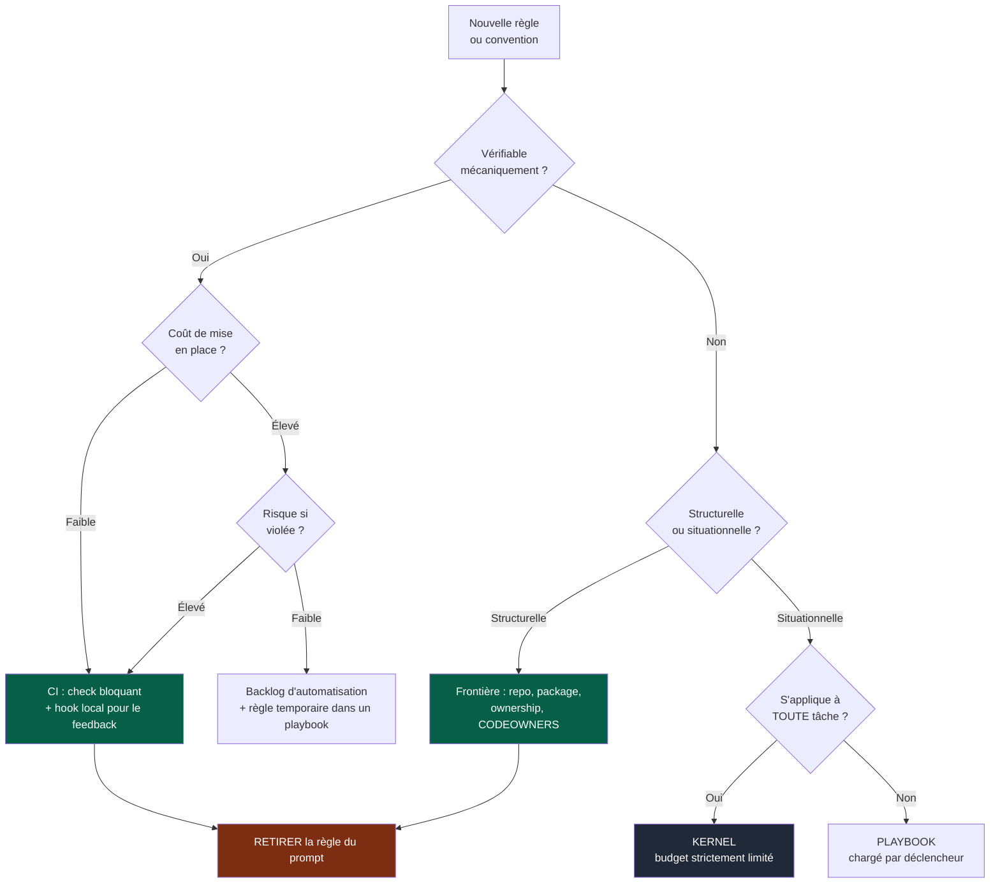
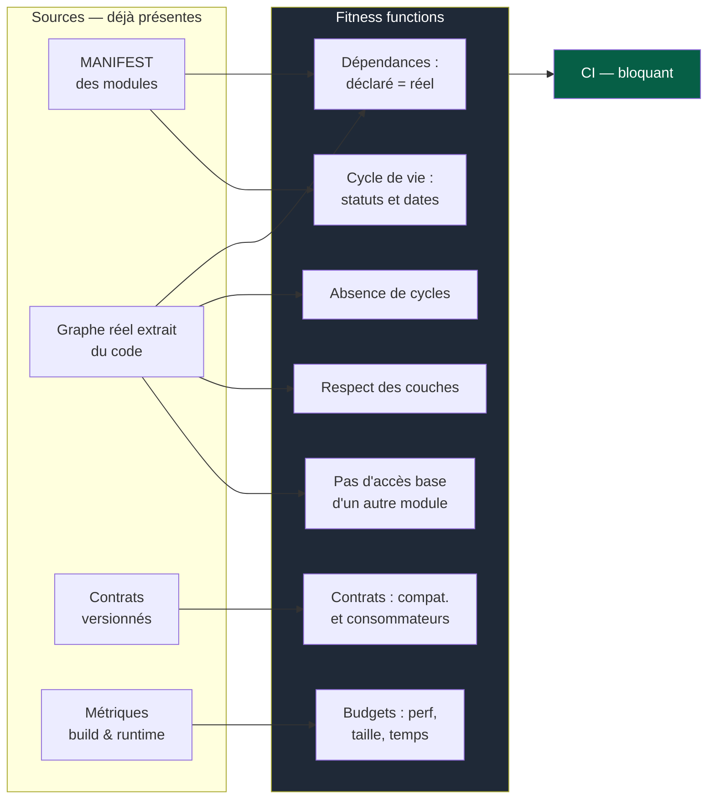
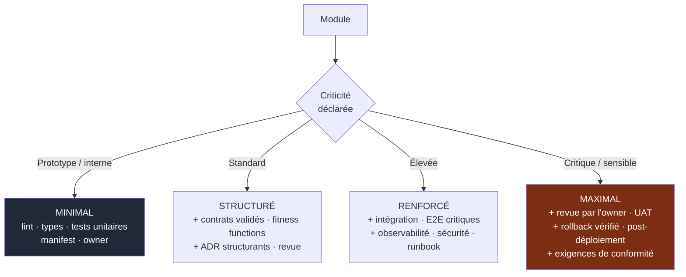
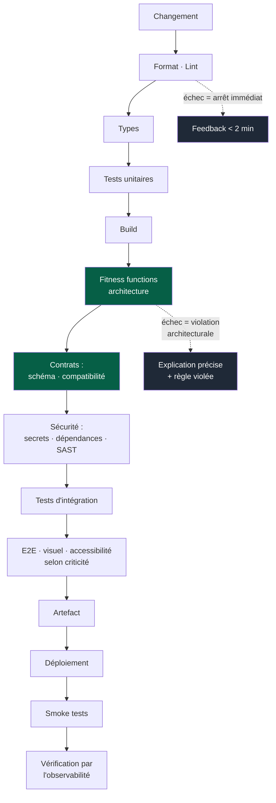

# 07 — Gouvernance

## 1. Le principe

> Si une règle peut être vérifiée automatiquement, elle ne doit **pas** dépendre de la
> vigilance de l'IA ou du développeur.

C'est le passage d'une *gouvernance par inspection* — quelqu'un relit et repère — à une
*gouvernance par règle* : le système refuse l'état invalide.

Corollaire : **une règle importante qui n'est contrôlée que par la mémoire humaine
dérivera.** Pas peut-être, pas si l'équipe est négligente. Elle dérivera.

---

## 2. Où vit cette règle ?

C'est l'arbitrage central de l'OS et il doit être fait explicitement, à chaque nouvelle
règle.



Le nœud `L` est le plus important et le plus oublié : **une fois automatisée, la règle
quitte le prompt**. Sinon le kernel grossit indéfiniment et finit par coûter, à chaque
tâche, plus de contexte qu'il n'en protège.

Le nœud `H` mérite aussi attention : une règle non vérifiable mais structurelle se
résout souvent par la **structure** plutôt que par le texte. « N'importez pas le code de
l'autre module » est une règle faible ; mettre les deux modules dans des packages
distincts avec des dépendances déclarées la rend inutile.

---

## 3. Les fitness functions

> Une règle importante ne doit pas rester dans le prompt ; elle doit devenir un test
> automatisé qui échoue si l'architecture dérive.

C'est le mécanisme qui transforme les principes de cet OS en contraintes réelles.



### Les fitness functions de base

À mettre en place dès le deuxième module, par ordre de rentabilité :

| # | Fonction | Détecte |
|---|---|---|
| 1 | Graphe déclaré (manifest) = graphe réel (code) | Dépendance cachée, import sauvage |
| 2 | Absence de dépendance circulaire | Modules devenus inséparables |
| 3 | Aucun accès direct aux données d'un autre module | Couplage par la base |
| 4 | Compatibilité ascendante des contrats | Rupture involontaire |
| 5 | Consommateurs d'une version dépréciée = 0 avant retrait | Rupture volontaire mal séquencée |
| 6 | Cohérence des statuts de cycle de vie | Contrat gelé modifié, module déprécié réutilisé |
| 7 | Dates de dépréciation non dépassées | États intermédiaires permanents |
| 8 | Une PR = un module | Érosion des frontières |
| 9 | Enveloppe de module complète (manifest, owner, tests) | Module orphelin |
| 10 | Budgets de performance et de taille | Régression silencieuse |

Les six premières sont peu coûteuses : elles se calculent sur des données déjà
présentes (manifests, imports, schémas de contrats). Il n'y a **aucune analyse
sémantique** — ce sont des comparaisons de graphes et de schémas.

### Écrire une fitness function

Une bonne fitness function est : rapide (elle tourne à chaque PR), déterministe (pas de
faux positifs aléatoires), et **explicative en cas d'échec**. Une fonction qui dit
seulement « violation d'architecture » sera contournée ; une qui dit « le module A
importe `B/internal/x.ts`, or le manifest de A ne déclare pas B ; utilisez le contrat
`b-api@v2` » sera respectée.

---

## 4. Ce qu'il faut automatiser

Par ordre de rentabilité décroissante :

```
Immédiat, coût quasi nul
  format · lint · type checking · détection de secrets · conventions de commit

Dès le 2e module
  tests unitaires · build · fitness functions 1 à 3 · une PR = un module

Dès le 1er contrat inter-équipes
  validation de schéma · contract tests · compatibilité · consommateurs

Dès la mise en production
  analyse de sécurité · dépendances/CVE · smoke tests · vérification post-déploiement

Quand le volume le justifie
  tests d'intégration · E2E ciblés · budgets de performance · merge queue
```

**Les contrôles critiques tournent en CI.** Les hooks locaux donnent un feedback rapide
mais ne sont **jamais** l'unique barrière : ils sont contournables, désactivables, et
absents chez le nouvel arrivant.

---

## 5. Quality gates

Une quality gate doit être : **objective · compréhensible · reproductible · automatisée
si possible · utile**.

Le dernier critère est le plus souvent oublié, et c'est celui qui tue l'adhésion.

| Situation | Réponse |
|---|---|
| Une gate bloque souvent sans jamais améliorer la qualité | La réévaluer ou la supprimer |
| Une règle importante jamais respectée | L'automatiser, la supprimer, ou reconsidérer explicitement |
| Une gate systématiquement contournée par label | Le problème est la gate, pas les gens |
| Une gate lente au point qu'on la saute | La rendre rapide ou la déplacer plus tard dans le pipeline |

> Éviter les gates bureaucratiques sans valeur. Chaque gate a un coût permanent payé par
> toutes les PR ; elle doit être rentable.

**Jamais de contournement silencieux.** Pas de `skip`, pas de `--no-verify`, pas de test
désactivé « temporairement », pas de seuil abaissé pour faire passer. Un contournement
nécessaire passe par un label visible et laisse une trace comptée.

---

## 6. Gouvernance proportionnelle

Le niveau d'exigence dépend de la **criticité déclarée dans le manifest**, pas d'une
règle uniforme. Ne jamais imposer à un petit module la cérémonie d'un système critique ;
ne jamais traiter un système critique comme un prototype.



La criticité est déclarée dans le manifest, donc la CI sait quels checks appliquer à
quel module. Elle n'est pas décidée PR par PR, ce qui éviterait toute discussion au
mauvais moment.

**Elle est révisable**, par ADR : un module qui passe en production change de niveau.

---

## 7. Le repository comme organe de gouvernance

Le dépôt n'est pas un espace de stockage : c'est là que les règles deviennent
non contournables. Mécanismes à utiliser (formulation GitHub, transposable) :

| Mécanisme | Ce qu'il garantit |
|---|---|
| Pull requests obligatoires | Aucun changement direct sur la branche protégée |
| Required checks | Une CI rouge bloque le merge, sans exception |
| CODEOWNERS | Le bon owner est sollicité automatiquement |
| Rulesets / branch protection | Les règles ne dépendent pas de la bonne volonté |
| Issue forms | Le DoR est structurellement rempli |
| PR template | Le DoD est visible au moment de la revue |
| Labels | Les exceptions sont visibles et comptées |
| Environnements protégés | Le déploiement passe par une approbation |
| Dependency / security automation | Les CVE ne dépendent pas d'une veille manuelle |
| Merge queue | Évite les merges qui se cassent mutuellement |

> **Les règles critiques ne doivent pas être contournables par une instruction donnée à
> l'IA.** C'est le test ultime de la gouvernance : si demander gentiment à un agent
> suffit à passer outre, la règle n'existe pas.

---

## 8. Le pipeline CI

Ordre conceptuel, du plus rapide au plus coûteux — le feedback utile arrive tôt.



**Ne pas appliquer mécaniquement toutes les étapes à tous les modules.** Le niveau de
validation est proportionnel au risque (§6).

**Le temps de feedback est une propriété de qualité.** Une CI de trente minutes est une
CI qu'on contourne, qu'on lance en fin de journée, et dont on ignore les résultats. Le
temps de feedback est un indicateur suivi (`10-measurement.md`).

---

## 9. Le backlog d'automatisation

Toute règle qui *devrait* être automatisée mais ne l'est pas encore est une dette
identifiée, pas une fatalité. Elle figure dans un backlog dédié, avec :

- la règle et où elle vit temporairement (playbook, AGENTS.md local) ;
- le risque en cas de violation ;
- le coût estimé d'automatisation ;
- le déclencheur qui la rendra prioritaire.

Ce backlog est revu au même rythme que la revue des décisions (`06-decisions.md` §6).
C'est le mécanisme qui empêche le kernel de grossir : chaque règle ajoutée au prompt
arrive avec sa date de sortie prévue.
