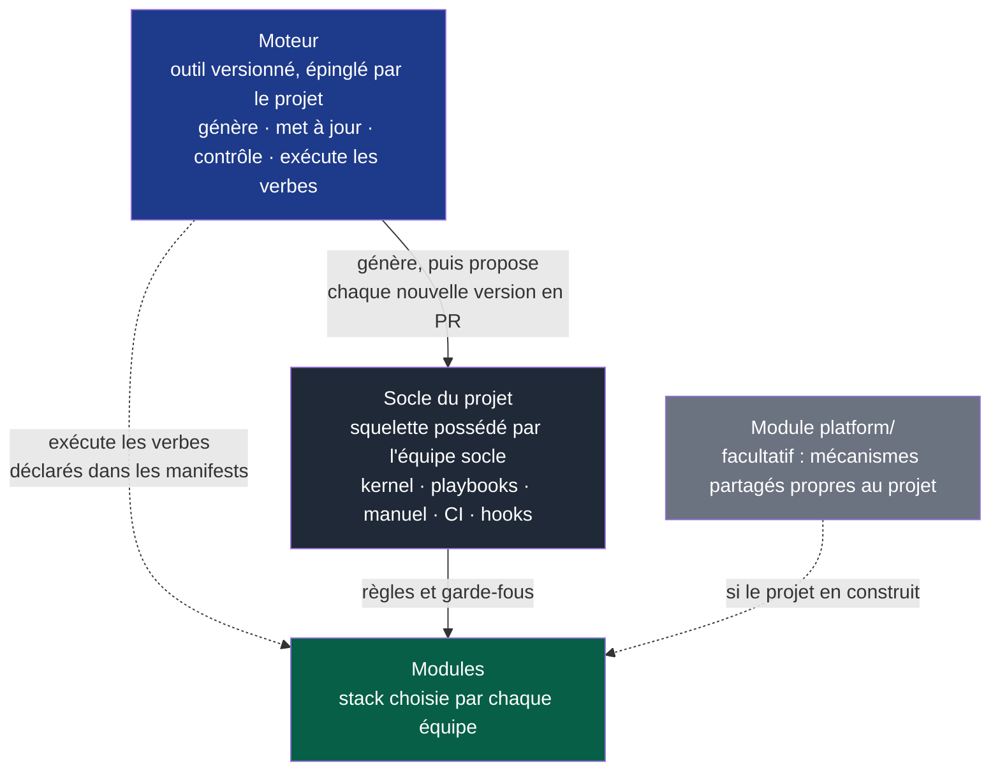
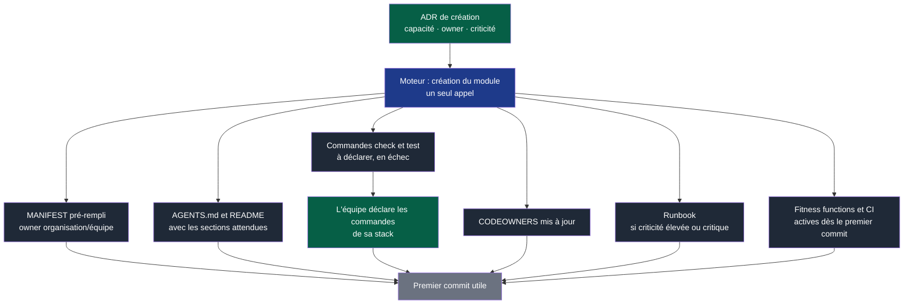

# 09 — Plateforme

## 1. Le rôle de la plateforme

La plateforme est ce qui permet à plusieurs équipes de travailler « de la même manière »
**sans** partager leur code ni leurs choix techniques.

Son objectif est de **réduire la charge cognitive**, pas de contrôler. Chaque fois
qu'une équipe doit reconstruire un mécanisme que d'autres ont déjà construit — pipeline,
templates, checks, bootstrap — c'est un échec de la plateforme.

> La plateforme fournit un chemin standardisé, automatisé et sûr.
> Elle ne fournit pas une prison.

Elle a deux étages, chacun avec son propriétaire :



**Légende** — bleu : le moteur, outil externe nommé dans `docs/tooling-profile.md` · gris
foncé : le socle, que le projet possède et adapte · gris clair : un module `platform/`,
seulement si le projet construit ses propres mécanismes partagés · vert : les modules des
équipes. Trait plein : génération et règles ; pointillés : exécution ou usage.

Le moteur ne se copie pas : il se met à jour en changeant de version, et le socle reçoit
les nouvelles versions du squelette en PR relue. Un module `platform/`, s'il existe, est un
**module** à part entière, avec un owner, un manifest, une criticité élevée et ses propres
tests. Une plateforme orpheline devient une dette que personne n'ose toucher.

---

## 2. Les verbes standards

C'est la contrepartie de l'hétérogénéité interne des modules. Chaque module expose les
mêmes verbes, quelle que soit sa technologie. Ils sont déclarés dans son manifest, section
`commands`, avec les commandes de sa propre stack.

| Verbe | Contrat | Doit fonctionner… |
|---|---|---|
| `bootstrap` | Rendre le module exploitable depuis un clone vierge | Sans connaissance préalable |
| `check` | Toutes les validations rapides : format, lint, types | En moins de 2 minutes |
| `test` | La suite de tests du module | Sans dépendance vers un autre module |
| `run` | Démarrer le module en local | Avec des doublures pour les dépendances |
| `contracts` | Valider et générer les artefacts de contrat | À chaque changement de contrat |
| `migrate` | Appliquer les migrations de données | Si le module possède des données |
| `release` | Produire l'artefact livrable | De manière reproductible |

Le moteur exécute `bootstrap`, `check`, `test` et `run` : il lit la commande dans le
manifest et la lance depuis le dossier du module, en local comme en CI. `check` et `test`
sont obligatoires ; un module neuf les déclare « à déclarer », en échec, jusqu'à ce que
l'équipe y mette les commandes de sa stack. `contracts`, `migrate` et `release` sont des
noms réservés, à déclarer quand un module en a besoin.

**Pourquoi c'est le socle du multi-équipes.** Un développeur ou un agent qui arrive sur
un module inconnu n'a pas à découvrir s'il faut lancer `npm`, `make`, `cargo`, `pytest`
ou autre chose. Il lit le manifest et lance `check`. La CI fait exactement pareil, ce
qui garantit que les checks locaux et distants sont les mêmes.

**Règle d'isolation.** `test` d'un module ne doit jamais nécessiter de démarrer un autre
module. Si c'est le cas, ce ne sont pas des tests unitaires ou d'intégration mais des
tests système — et c'est un signal de mauvaise frontière (`02-modules.md` §9).

---

## 3. Arborescence du squelette

```
project/
│
├── AGENTS.md                      # kernel de l'OS
├── README.md
├── CONTRIBUTING.md
├── SECURITY.md
│
├── docs/
│   ├── os/                        # cette documentation
│   ├── architecture/              # vue d'ensemble, diagrammes système
│   ├── adr/                       # décisions techniques transverses
│   ├── pdr/                       # décisions produit
│   ├── runbooks/                  # exploitation transverse
│   └── tooling-profile.md         # mapping capacités → outils du moment
│
├── playbooks/                     # modules d'instructions IA, chargés à la demande
│   ├── securite.md
│   ├── tests.md
│   ├── donnees-migration.md
│   ├── ux.md
│   └── exploitation.md
│
├── contracts/                     # ← module à part entière, owner dédié
│   ├── MANIFEST.yaml
│   ├── <contrat>/
│   │   ├── v1/
│   │   └── v2/
│   └── tests/
│
├── modules/                       # vide à la création
│   ├── <module-a>/
│   │   ├── MANIFEST.yaml
│   │   ├── AGENTS.md
│   │   ├── README.md
│   │   ├── docs/adr/
│   │   ├── src/
│   │   └── tests/
│   └── <module-b>/
│       └── …
│
└── .github/
    ├── ISSUE_TEMPLATE/
    ├── workflows/
    ├── CODEOWNERS
    └── pull_request_template.md
```

> `modules/` peut se décliner en `services/`, `apps/`, `packages/` selon la nature du
> projet. Ce qui compte est que chaque unité porte son manifest et son enveloppe
> complète, pas le nom du dossier parent. Un module `platform/` et un dossier
> `docs/governance/` (backlog d'automatisation, revues) s'ajoutent quand le projet en a
> besoin ; le squelette ne les crée pas.

---

## 4. Créer un nouveau module

C'est le test le plus révélateur de la maturité de la plateforme : **combien de temps
entre la décision et le premier commit utile ?**



**Légende** — vert : décision ou travail de l'équipe · bleu : le moteur · gris foncé : ce
qui est généré · gris clair : le résultat.

Le point critique est `C6` : **les garde-fous sont actifs dès le premier commit**. Un
module créé sans fitness functions accumulera des violations qu'on découvrira trop tard,
et qu'on finira par tolérer parce que les corriger sera devenu trop cher. `C3` en est le
corollaire : un module dont les commandes ne sont pas déclarées échoue en CI au lieu de
passer au vert sans rien vérifier.

---

## 5. Onboarding

L'objectif est mesurable : **un nouvel arrivant — humain ou agent — doit pouvoir
contribuer utilement sans conversation orale.**

Le parcours attendu :

```
1. lire le MANIFEST du module        → à quoi il sert, qui le possède, ce qu'il consomme
2. lire l'AGENTS.md local            → conventions et pièges spécifiques
3. lancer bootstrap puis check       → environnement fonctionnel, validations vertes
4. lire les contrats consommés       → ce sur quoi il peut s'appuyer
5. lire les ADR du module            → pourquoi c'est comme ça
6. prendre une issue Ready           → périmètre et critères déjà explicites
```

Si l'une de ces étapes nécessite de demander à quelqu'un, c'est un défaut du système,
pas du nouvel arrivant. Le temps jusqu'à la première contribution est un indicateur
suivi (`10-mesure.md`).

Le repository doit pouvoir répondre seul à : qui possède quoi · comment contribuer ·
comment tester · comment livrer · quelles règles s'appliquent · quelles validations sont
obligatoires.

---

## 6. Outillage IA

> Les outils sont des **adaptateurs**, jamais des fondations architecturales.

L'OS ne prescrit aucun outil, pour une raison simple : l'écosystème change plus vite que
les principes. Un squelette qui impose « utilisez tel plugin et telle extension » sera
faux dans douze mois, alors que ses principes tiendront.

L'OS n'embarque pas non plus d'IA : c'est l'agent de l'équipe qui lit le kernel et les
playbooks, lance les verbes et propose des changements, que la CI accepte ou refuse comme
ceux de n'importe quel contributeur.

L'OS déclare donc des **capacités**, et un *profil d'outillage* (`docs/tooling-profile.md`)
les mappe sur les outils du moment. Changer d'outil se fait alors sans toucher à l'OS.

| Capacité | À quoi elle sert |
|---|---|
| Recherche et navigation dans le repository | Inventaire local sans tout charger |
| Recherche documentaire fiable | Vérifier plutôt que supposer (`04-contexte-ia.md` §6) |
| Accès aux sources officielles | Versions, API, contraintes réelles |
| Exécution de commandes et de tests | Rendre l'oracle réellement exécutable |
| Interaction Git, issues, PR | Traçabilité et petits lots |
| Inspection UI et captures | Validation UX au-delà du « ça compile » |
| Analyse de sécurité | Contrôles automatisés intégrés |
| Analyse d'architecture | Support des fitness functions |
| Agents spécialisés | Revue indépendante, investigation isolée |

**Critères de choix d'un outil** : projet, sécurité, confidentialité, fiabilité, coût,
maturité, intégration, et surtout **capacité à être automatisé**. Un outil utile
uniquement en interactif ne peut pas devenir une garantie.

> Ne jamais ajouter un outil parce qu'il est populaire. Le Prior Art Gate s'applique
> aussi aux outils (`06-decisions.md`).

---

## 7. Le squelette comme plateforme interne miniature

Un nouveau projet démarre avec les conventions, les contrôles, les templates et les
workflows **déjà prêts**. C'est ce qui rend l'OS réel plutôt que théorique : sans
squelette, chaque projet réimplémente les mêmes mécanismes, avec des variations qui
finissent par empêcher toute mutualisation.

Ce que le squelette et son moteur fournissent dès le premier jour :

- le kernel et les playbooks ;
- l'exécution des verbes standards déclarés dans les manifests ;
- les templates ADR, PDR, issue, PR ;
- les fitness functions de base (1 à 3 de `07-gouvernance.md` §3) ;
- la CI avec les checks du niveau `standard` ;
- le CODEOWNERS, et la checklist des réglages de la forge, que le moteur vérifie en
  lecture seule ;
- la création de module ;
- les nouvelles versions du squelette, proposées en PR relue et fusionnées avec les
  adaptations du projet.

Ce qu'il ne fournit **pas** : une stack, une architecture interne, une liste d'outils,
une IA. Ces choix appartiennent au projet et passent par une décision explicite.
