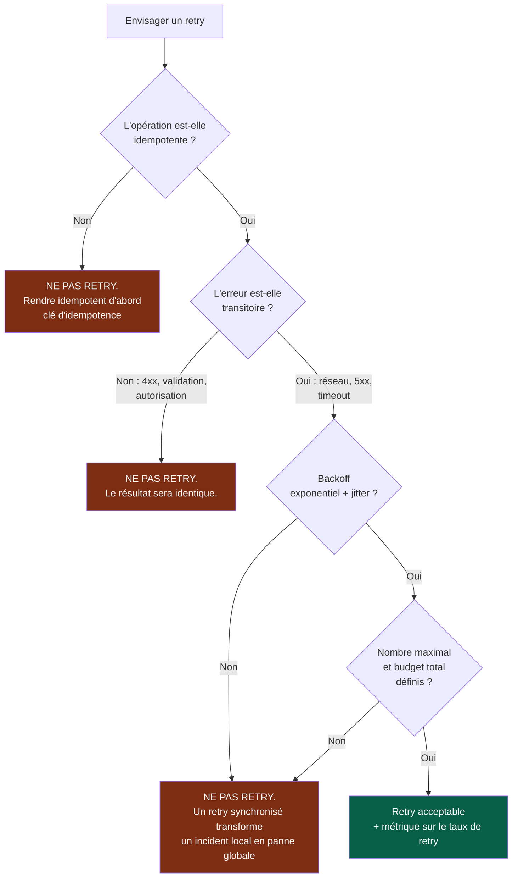
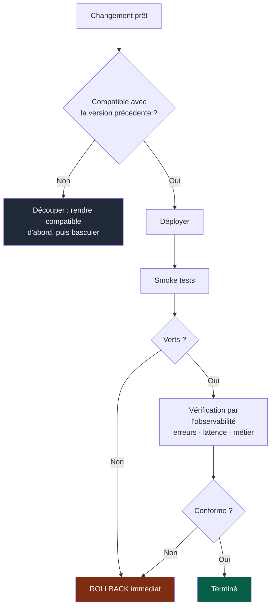

# Playbook — Exploitation et fiabilité

> **Déclencheur.** Charge ce playbook si la tâche touche à : logs, métriques, alertes,
> retries, timeouts, rollback, health checks, déploiement, ou tout appel vers une
> dépendance externe.

---

## Règles absolues

| # | Règle |
|---|---|
| E1 | **Jamais de retry automatique sans analyser les effets de bord.** |
| E2 | **Tout appel externe a un timeout explicite.** Un appel sans timeout est une panne en attente. |
| E3 | **Aucun secret ni donnée personnelle dans les logs.** |
| E4 | **Une erreur silencieusement avalée est un incident futur.** |
| E5 | **Un module en production sans moyen de savoir qu'il va mal n'est pas prêt.** |

---

## 1. Retries — le piège classique

Trois effets de bord à vérifier systématiquement :

- **Duplication** — un retry sur une opération non idempotente crée deux fois l'effet.
- **Amplification** — N clients qui retryent simultanément multiplient la charge sur un
  service déjà en difficulté.
- **Masquage** — un retry qui réussit cache une dégradation réelle. Le taux de retry est
  donc une métrique, pas un détail d'implémentation.

---

## 2. Timeouts

| Règle | Pourquoi |
|---|---|
| Tout appel externe a un timeout explicite | Un appel sans timeout bloque un thread indéfiniment |
| Le timeout est plus court en amont qu'en aval | Sinon l'appelant abandonne avant l'appelé, et le travail est perdu |
| Un budget total existe pour la requête | Empêche l'accumulation de timeouts en cascade |
| Le timeout est une valeur configurée, pas une constante enfouie | Il devra être ajusté en production |

---

## 3. Logs

| À faire | À éviter |
|---|---|
| Structurés, exploitables par machine | Chaînes concaténées non parsables |
| Identifiant de corrélation propagé | Logs impossibles à relier entre eux |
| Contexte utile : quoi, où, quel identifiant | « Erreur » sans contexte |
| Niveaux cohérents et respectés | Tout en `info`, ou tout en `error` |
| Masquage des données sensibles **à la source** | Masquage au moment de l'affichage |

Un log qui ne permet pas de reconstituer ce qui s'est passé n'a servi qu'à occuper de
l'espace disque. Question de contrôle : *à 3 h du matin, ce log me permet-il de
comprendre sans lire le code ?*

---

## 4. Métriques et alertes

| Type | Exemple |
|---|---|
| Trafic | Requêtes, messages traités |
| Erreurs | Taux d'erreur, par type |
| Latence | Distribution, pas seulement la moyenne |
| Saturation | File d'attente, connexions, mémoire |
| Métier | Ce que le module est censé produire |

**La moyenne masque tout.** Une latence moyenne correcte peut cacher 5 % d'utilisateurs
en attente de dix secondes. Toujours regarder la distribution.

### Alertes

| Règle | Raison |
|---|---|
| Alerter sur un **symptôme utilisateur**, pas sur une cause technique | Les causes changent, le symptôme reste pertinent |
| Toute alerte est **actionnable** | Une alerte sans action à faire sera ignorée |
| Toute alerte pointe vers un **runbook** | Sinon la connaissance est dans une seule tête |
| Une alerte qui se déclenche sans action est **supprimée ou corrigée** | Le bruit détruit la valeur de toutes les alertes |

---

## 5. Health checks

| Type | Répond à | Piège |
|---|---|---|
| *Liveness* | Le processus doit-il être redémarré ? | Ne doit **pas** dépendre des dépendances externes — sinon une panne externe provoque des redémarrages en boucle |
| *Readiness* | Peut-il recevoir du trafic ? | Doit vérifier les dépendances critiques |
| *Startup* | A-t-il fini de démarrer ? | Évite les redémarrages pendant une initialisation lente |

---

## 6. Déploiement et rollback

- **Le rollback se teste**, il ne se suppose pas. Un rollback jamais exécuté ne
  fonctionne probablement pas.
- **Un déploiement n'est pas terminé au déploiement** : il est terminé quand
  l'observabilité confirme le comportement attendu.
- **Compatibilité descendante obligatoire** : pendant le déploiement, deux versions
  coexistent. Un changement incompatible se découpe (`docs/os/03-contrats.md`).

---

## 7. Dégradation contrôlée

Décider **à l'avance** de ce qui se passe quand une dépendance est indisponible :

| Stratégie | Quand |
|---|---|
| Échouer proprement | La fonctionnalité n'a pas de sens sans la dépendance |
| Servir une valeur par défaut | Une approximation vaut mieux que rien |
| Servir depuis un cache, même périmé | La fraîcheur est moins critique que la disponibilité |
| Désactiver la fonctionnalité, garder le reste | La dépendance est secondaire |
| Mettre en file pour traitement différé | L'opération peut être asynchrone |

Le choix est explicite et testé. Sans décision préalable, le comportement par défaut est
toujours le pire : une erreur opaque au pire moment.

---

## 8. Checklist de fin

- [ ] Timeouts explicites sur tous les appels externes
- [ ] Retries justifiés, idempotents, avec backoff et plafond — ou absents
- [ ] Logs structurés, corrélés, sans secrets ni données personnelles
- [ ] Erreurs jamais avalées silencieusement
- [ ] Métriques et alertes actionnables, pointant vers un runbook
- [ ] Health checks corrects (liveness sans dépendances externes)
- [ ] Compatibilité descendante vérifiée
- [ ] Rollback documenté et testé
- [ ] Comportement en cas d'indisponibilité décidé explicitement
- [ ] Ce qui n'a pas pu être vérifié figure dans `NON VÉRIFIÉ` du résumé
