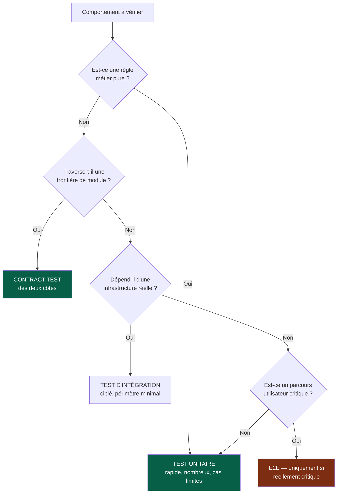
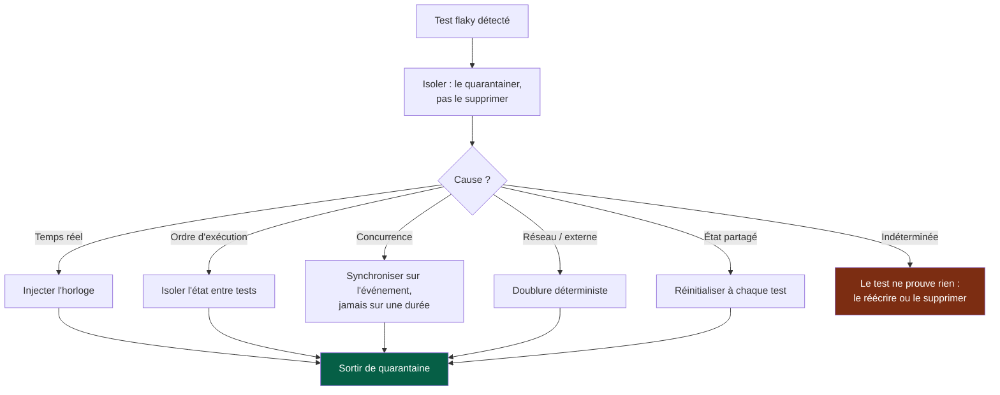

# Playbook — Tests

> **Déclencheur.** Charge ce playbook quand la stratégie de test n'est pas évidente :
> zone non testée, test flaky, comportement difficile à isoler, doute sur le bon niveau
> de test.
>
> Pour une tâche normale, la règle du kernel suffit : **écrire l'oracle, le voir
> échouer, implémenter**.

---

## 1. Choisir le niveau de test



Règle de préférence : **le niveau le plus bas qui vérifie réellement le comportement**.
Un test E2E qui aurait pu être unitaire coûte cent fois plus cher, casse dix fois plus
souvent, et diagnostique dix fois moins bien.

---

## 2. L'oracle

| Exigence | Pourquoi |
|---|---|
| Écrit **avant** l'implémentation | Sinon il est écrit pour passer, pas pour vérifier |
| Vu **échouer** avant | Un test jamais rouge peut ne rien tester |
| Échoue pour la **bonne raison** | Un échec de compilation n'est pas un échec de test |
| Nommé par le **comportement**, pas la fonction | `refuse_une_commande_sans_stock`, pas `test_create_order_2` |

### Si l'oracle est impossible

| Cause | Réponse |
|---|---|
| Critère subjectif | Le reformuler en comportement observable |
| Tâche exploratoire | Requalifier en *spike* : livrable = connaissance |
| Zone non testable | La rendre testable d'abord, comme tâche séparée |
| Besoin flou | Retour au cadrage — ce n'était pas *Ready* |

Dans tous les cas : **on ne génère pas en attendant.**

---

## 3. Quoi tester en priorité

```
1. règles métier            2. parcours critiques      3. permissions
4. contrats                 5. erreurs                 6. cas limites
7. régressions survenues    8. fort impact utilisateur
```

**Toute régression corrigée donne lieu à un test** qui échouait avant le correctif.
C'est la seule garantie qu'elle ne reviendra pas silencieusement.

**Ne pas viser un pourcentage de couverture.** La couverture indique ce qui n'est pas
testé ; elle n'indique jamais que ce qui est testé l'est bien.

---

## 4. Cas limites à considérer systématiquement

```
vide · nul · absent · zéro · négatif · très grand · très long
caractères spéciaux · unicode · espaces en début et fin
doublon · concurrence · appel répété (idempotence)
dépendance indisponible · timeout · réponse partielle
autorisation refusée · non authentifié · session expirée
fuseau horaire · changement d'heure · date limite
```

---

## 5. Tests flaky

Un test flaky est un **problème d'ingénierie**, jamais une fatalité. Son coût réel :
il apprend à l'équipe à ignorer un échec de CI. Un seul test flaky toléré dégrade la
valeur de toute la suite.



**Jamais « relancer jusqu'à ce que ça passe ».** Un test désactivé porte une issue et
une date de reprise ; sans cela, il ne revient jamais.

Les attentes fixes (`sleep`) sont la cause de flakiness la plus répandue : on attend un
**état observable**, jamais une durée.

---

## 6. Doublures

| Doubler | Ne pas doubler |
|---|---|
| Services externes, réseau, horloge, aléa | La logique métier du module testé |
| Dépendances lentes ou coûteuses | Ce que le test est censé vérifier |
| Modules tiers — via leur **contrat** | La base de données, dans un test d'intégration |

> **Ne jamais doubler le comportement d'un autre module en devinant.** On double son
> contrat, et le contract test garantit que le contrat correspond à la réalité. Une
> doublure inventée passe au vert pendant que la production casse.

---

## 7. Signaux d'alerte

| Signal | Interprétation |
|---|---|
| Un test casse à chaque refactor sans changement de comportement | Il teste l'implémentation, pas le comportement |
| Il faut démarrer un autre module pour tester | Mauvaise frontière (`docs/os/02-modules.md` §9) |
| Le test est plus long que le code testé | Le code est probablement trop couplé |
| Personne ne comprend ce que teste ce test | Le supprimer ou le réécrire ; il ne protège rien |
| La suite met plus de 10 minutes | Elle sera contournée — la rendre rapide est une tâche prioritaire |
