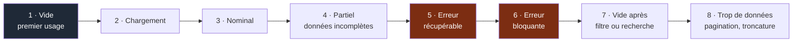

# Playbook — UX/UI

> **Déclencheur.** Charge ce playbook dès que la tâche touche une surface visible par
> l'utilisateur.

---

## Règle d'entrée : la convention prime

C'est le terrain où le Prior Art Gate (`docs/os/06-decisions.md`) est le plus rentable.

> Sur un pattern d'interface, la valeur de la convention vient **précisément du fait que
> l'utilisateur la connaît déjà**. Une innovation d'interface non demandée est un coût
> d'apprentissage imposé à tous les utilisateurs pour la satisfaction d'un seul concepteur.

Avant de concevoir un composant ou un parcours :

1. le design system du projet le prévoit-il ? → l'utiliser, fin.
2. sinon, quelle est la convention établie pour ce problème ? → l'adopter.
3. s'en écarter exige une valeur utilisateur nommée et observable.

**Ne jamais créer un composant qui existe déjà dans le design system.** C'est la forme
la plus courante de réinvention de la roue, et la plus coûteuse à défaire.

---

## Les huit états d'une interface

Une fonctionnalité n'est pas terminée si l'un de ces états n'a pas été traité. C'est la
cause n°1 d'écart entre « ça marche sur ma machine » et « c'est utilisable ».

Les états 1, 7 et 8 sont les plus systématiquement oubliés. L'état 1 est pourtant celui
que **tout** utilisateur voit en premier.

---

## Messages d'erreur

| À faire | À éviter |
|---|---|
| Dire ce qui s'est passé, en langue de l'utilisateur | Afficher un code technique seul |
| Dire **quoi faire ensuite** | « Une erreur est survenue » |
| Préserver ce que l'utilisateur avait saisi | Vider le formulaire |
| Distinguer erreur de saisie et panne système | Traiter les deux pareil |
| Rester discret sur le détail technique | Exposer une trace ou un détail exploitable |

Un message d'erreur sans action possible est une impasse : l'utilisateur ne peut que
recommencer à l'identique.

---

## Accessibilité

Non négociable dès qu'il y a une interface. Vérifications minimales :

| Point | Test |
|---|---|
| Navigation clavier complète | Parcourir toute la fonctionnalité sans souris |
| Focus visible en permanence | Tabulation de bout en bout |
| Contraste suffisant | Vérification automatisée |
| Images et icônes porteuses de sens | Alternative textuelle |
| Formulaires | Libellés associés, erreurs liées au champ |
| Information jamais portée par la couleur seule | Vérification visuelle |
| Structure de titres cohérente | Inspection du document |
| Cibles tactiles suffisantes | Test sur mobile réel |
| Zone dynamique | Changement annoncé aux lecteurs d'écran |

L'automatisable est automatisé en CI. **Le reste se teste au clavier**, en quelques
minutes — c'est le meilleur rapport effort/détection du domaine.

---

## Performance perçue

Ce qui compte est le temps **ressenti**, pas le temps mesuré.

| Situation | Traitement |
|---|---|
| Action instantanée attendue | Retour visuel immédiat, avant même la réponse serveur |
| Attente courte | Indicateur discret, pas de blocage complet |
| Attente longue | Progression réelle, et action annulable si possible |
| Contenu qui arrive par morceaux | Réserver l'espace pour éviter les sauts de mise en page |
| Action optimiste | Prévoir explicitement le retour arrière en cas d'échec |

---

## Responsive et mobile

Le poste de développement n'est pas représentatif.

- Vérifier sur une largeur réduite, pas seulement sur un navigateur redimensionné.
- Tester les interactions tactiles : pas de survol comme unique déclencheur.
- Vérifier le comportement avec le clavier virtuel ouvert.
- Vérifier sur connexion lente.

---

## Checklist de fin

- [ ] Les 8 états traités, ou explicitement hors périmètre
- [ ] Convention ou design system respecté ; toute déviation justifiée
- [ ] Messages d'erreur actionnables
- [ ] Navigation clavier complète, focus visible
- [ ] Contrastes vérifiés
- [ ] Testé sur largeur mobile réelle
- [ ] Retour visuel sur chaque action
- [ ] Aucun composant réinventé
- [ ] Ce qui n'a pas pu être vérifié figure dans `NON VÉRIFIÉ` du résumé